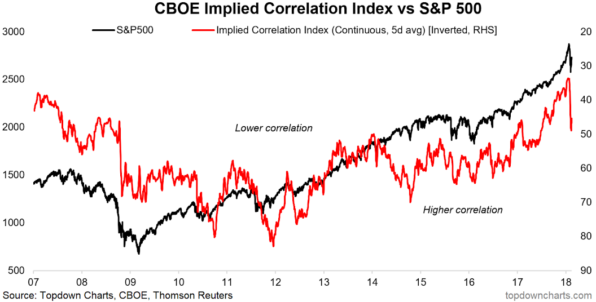

## Table of Contents

## What is the Implied Correlation Index?

The Implied Correlation Index is a measure that shows how closely related the prices of different stocks in an index are expected to move together. It's like guessing how likely it is for all the stocks in a group, like the S&P 500, to go up or down at the same time. This index is important for investors because it helps them understand the risk of their investments. If the correlation is high, it means the stocks tend to move together, which can be riskier if the market goes down.

This index is calculated using options on the index and options on the individual stocks within it. By comparing these, analysts can figure out the implied correlation. It's a bit like looking at a weather forecast for the stock market; it gives investors an idea of what might happen, but it's not a guarantee. The Implied Correlation Index is especially useful for those who trade in index options or use complex investment strategies that depend on how stocks move relative to each other.

## How is the Implied Correlation Index calculated?

The Implied Correlation Index is figured out by looking at the prices of options on a stock index, like the S&P 500, and comparing them to the prices of options on the individual stocks in that index. Imagine you're trying to guess how closely a group of friends will stick together at a party. You'd watch how they act when they're all together (the index) and how they act on their own (individual stocks). By comparing these, you can get a sense of their correlation.

To get the actual number for the Implied Correlation Index, you use a math formula that takes into account the prices of these options. It's a bit like solving a puzzle where you need to fit the pieces of index options and individual stock options together. The result tells you the expected average correlation between the stocks in the index. This number helps investors understand how risky it might be to invest in the whole index, because if the stocks are highly correlated, they'll all move up or down together, which can be risky if the market takes a downturn.

## What is the purpose of the Implied Correlation Index in financial markets?

The Implied Correlation Index helps investors understand how closely the stocks in a stock index, like the S&P 500, might move together. It's like a weather forecast for the stock market, giving investors a guess on how risky it might be to invest in the whole index. If the stocks in the index are expected to move in the same direction a lot, the correlation is high, and this can be riskier if the market goes down because all the stocks might fall together.

This index is especially useful for people who trade options on stock indexes. By looking at the Implied Correlation Index, these traders can make better guesses about how their investments might perform. It's not a perfect prediction, but it gives them a helpful hint about the potential ups and downs of the market, helping them decide whether to buy, sell, or hold their investments.

## How does the Implied Correlation Index differ from other correlation measures?

The Implied Correlation Index is different from other correlation measures because it's based on what people expect to happen in the future, not what has already happened. Other measures, like historical correlation, look at past data to see how closely stocks have moved together before. But the Implied Correlation Index uses the prices of options to guess how closely stocks might move in the future. It's like comparing a weather forecast to last week's weather report; one tells you what might happen, and the other tells you what did happen.

Another difference is that the Implied Correlation Index is calculated from the prices of options on an index and the options on the stocks in that index. This makes it useful for people who trade options, because it directly relates to the prices they're dealing with. Other correlation measures might use different data, like stock prices themselves, and don't necessarily tell you about the options market. So, while other measures give a general idea of how stocks move together, the Implied Correlation Index gives a more specific insight that's tailored to the world of options trading.

## What are the key components of the Implied Correlation Index?

The Implied Correlation Index is made up of two main parts: the prices of options on a stock index, like the S&P 500, and the prices of options on the individual stocks within that index. Think of it like trying to predict how a group of friends will act at a party. You look at how they act when they're all together (the index options) and how they act on their own (the individual stock options). By comparing these two, you can figure out how closely they might stick together, or in other words, their correlation.

The other key part is the math formula used to turn these option prices into the Implied Correlation Index. This formula takes the prices of the index options and the individual stock options and calculates an expected average correlation. It's a bit like solving a puzzle where you need to fit the pieces of the index options and individual stock options together to see the bigger picture. This number helps investors understand the risk of investing in the whole index, because if the stocks are expected to move together a lot, it can be riskier if the market goes down.

## Can you explain the relationship between the Implied Correlation Index and market volatility?

The Implied Correlation Index and market volatility are closely linked. When the Implied Correlation Index is high, it means that people expect the stocks in an index to move together a lot. This can make the market more volatile because if something happens to make the market go up or down, all the stocks are likely to follow. Think of it like a group of friends at a party; if they stick together closely, whatever happens to one will affect them all, making the whole group's mood swing more dramatically.

On the other hand, when the Implied Correlation Index is low, it means that people expect the stocks to move more independently. This can make the market less volatile because changes in one stock might not affect the others as much. It's like if the friends at the party are doing their own thing; one person's mood won't change the whole group's mood as much. So, the Implied Correlation Index helps investors understand how big swings in the market might be, based on how closely stocks are expected to move together.

## How can investors use the Implied Correlation Index to make investment decisions?

Investors can use the Implied Correlation Index to understand how risky it might be to invest in a stock index like the S&P 500. If the Implied Correlation Index is high, it means that the stocks in the index are expected to move together a lot. This can make the investment riskier because if the market goes down, all the stocks are likely to fall together. On the other hand, if the Implied Correlation Index is low, it means the stocks are expected to move more independently. This can make the investment less risky because if one stock goes down, the others might not follow.

Investors who trade options can use the Implied Correlation Index to make better guesses about their investments. For example, if they see a high Implied Correlation Index, they might choose to buy options that protect against big drops in the market. If the Implied Correlation Index is low, they might be more willing to take risks because they think the stocks won't all move in the same direction. By keeping an eye on the Implied Correlation Index, investors can make smarter choices about when to buy, sell, or hold their investments, based on how closely they think the stocks will move together.

## What historical trends have been observed with the Implied Correlation Index?

Historically, the Implied Correlation Index has shown a few interesting trends. During times of big economic trouble, like the financial crisis in 2008, the Implied Correlation Index often goes up a lot. This means people expect all the stocks in an index to move together more, making the market feel riskier. For example, when the market crashed in 2008, investors saw the Implied Correlation Index jump because everyone was worried that all stocks would go down at the same time.

On the other hand, during calmer times, the Implied Correlation Index tends to be lower. This means people expect stocks to move more on their own, making the market feel less risky. For instance, in the years following the financial crisis, as things got better, the Implied Correlation Index often went down. This showed that investors felt more comfortable with the idea that not all stocks would move in the same direction, so they were more willing to take risks.

## How does the Implied Correlation Index impact option pricing?

The Implied Correlation Index affects how much options on a stock index cost. When the Implied Correlation Index is high, it means people think all the stocks in the index will move together a lot. This makes the options more expensive because if the market goes down, all the stocks are likely to fall together, and that's riskier for the person selling the option. So, they charge more to cover that risk.

On the other hand, when the Implied Correlation Index is low, it means people think the stocks will move more on their own. This makes the options cheaper because if one stock goes down, the others might not follow, making it less risky for the person selling the option. They can charge less because the risk of all the stocks moving together is smaller.

## What are the limitations of the Implied Correlation Index?

The Implied Correlation Index is useful, but it has some limits. One big limit is that it's based on what people think might happen in the future, not what has already happened. This means it's like a weather forecast - it can be wrong. If people's guesses about how stocks will move together are off, the Implied Correlation Index won't be very accurate. This can make it hard for investors to make the right choices if they rely too much on it.

Another limit is that the Implied Correlation Index only looks at one part of the market - the options on a stock index and the options on the stocks in that index. It doesn't tell you about other things that can affect stock prices, like news or changes in the economy. So, while it gives you a good guess about how closely stocks might move together, it's not a complete picture. Investors need to use other tools and information along with the Implied Correlation Index to make the best decisions.

## How do changes in the Implied Correlation Index signal shifts in market sentiment?

Changes in the Implied Correlation Index can tell us a lot about how people feel about the market. When the Implied Correlation Index goes up, it means investors are worried that all the stocks in an index will move together a lot. This usually happens when people are scared about big problems in the economy or world events. They think if something bad happens, it will affect all the stocks, so they expect more risk. This shows that the market sentiment is turning more negative or cautious.

On the other hand, when the Implied Correlation Index goes down, it means investors think the stocks will move more on their own. This happens when people feel more confident and less worried about big problems. They believe that even if one stock goes down, the others might not follow, so they see less risk. This shows that the market sentiment is becoming more positive or optimistic. By watching these changes, investors can get a sense of how people feel about the market and adjust their investment strategies accordingly.

## What advanced strategies can traders employ using the Implied Correlation Index?

Traders can use the Implied Correlation Index to make smarter bets with options. If the Implied Correlation Index is high, meaning stocks are expected to move together a lot, traders might buy put options on the index to protect against a big market drop. This is like buying insurance for their investments. They can also look for stocks in the index that might not follow the crowd and buy call options on those stocks, hoping to make money if those stocks go up while the rest go down. It's like finding a hidden gem in a bunch of similar rocks.

On the other hand, when the Implied Correlation Index is low, meaning stocks are expected to move more on their own, traders might sell options to make money from the premiums. They could sell put options on the index, betting that not all stocks will go down together, so the options will expire worthless and they keep the money. Traders might also look for pairs of stocks that usually move together but think one will do better than the other and use options to bet on that difference. This is like playing a game where you guess which friend will have more fun at a party, even if they're all having a good time.

## What is Dispersion Trading and What is Its Significance?

Dispersion trading is a sophisticated strategy in financial markets that leverages the differences between index [volatility](/wiki/volatility-trading-strategies) and the volatilities of its component stocks. At its core, this trading tactic involves taking positions based on the divergence between the collective movements of a stock index and the individual movements of its constituent stocks. The essence of [dispersion](/wiki/dispersion-trading) trading lies in the exploitation of these volatility discrepancies.

Traders typically execute dispersion trades by selling options on an index and simultaneously buying options on the individual stocks that constitute that index. This trading approach is prominently delta-neutral, meaning that it strategically isolates the volatility component rather than depending on the directional movement of the markets. The primary objective is to profit from discrepancies when actual volatility unfolds differently from the implied volatility reflected in current option prices.

Dispersion trading can be mathematically represented by the difference between index volatility $\sigma_{index}$ and the weighted average volatility of its components $\sigma_{components}$. The spread between these volatilities often uncovers trading opportunities as:

$$
\sigma_{index}^2 = \sum_{i=1}^{n} w_i^2 \sigma_i^2 + 2 \sum_{i=1}^{n} \sum_{j=i+1}^{n} w_i w_j \rho_{ij} \sigma_i \sigma_j
$$

where $w_i$ and $w_j$ represent the weights of the index components, $\sigma_i$ and $\sigma_j$ are the volatilities of the individual stocks, and $\rho_{ij}$ signifies the correlation coefficients between the stocks.

Trade profitability arises when the realized volatility path diverges from these expectations. Such discrepancies create market conditions whereby the premium difference between selling index options, which often encapsulate a higher implied volatility due to correlation factors, and buying individual stock options, manifests as a net gain. This approach benefits particularly in scenarios where stock-specific events do not synchronize with broader index movements, causing a divergence in actual versus implied component dispersion.

With technological advancements, traders leverage algorithmic tools and software platforms to analyze real-time data, optimizing their dispersion strategies to swiftly harness these volatility spreads. Consequently, dispersion trading remains a crucial tool in the trader’s arsenal, providing a mechanism to profit from volatility mispricing within financial markets.

## What is the relationship between Algorithmic Trading and Index Correlation Analysis?

Algorithmic trading has revolutionized the financial markets by leveraging quantitative models to execute trades with precision and speed. A critical component of this process is index correlation analysis, which helps optimize trading strategies by understanding the relationships between various financial indices.

Index correlation analysis involves evaluating how different indices, or their components, move relative to each other. Traders often use statistical tools such as Pearson and Spearman correlation coefficients to quantify these relationships. The Pearson correlation coefficient measures the linear relationship between two variables while the Spearman rank correlation assesses how well the relationship between two variables can be described by a monotonic function. Formally, the Pearson correlation coefficient ($\rho_{XY}$) between two variables X and Y is calculated as:

$$

\rho_{XY} = \frac{\text{cov}(X, Y)}{\sigma_X \sigma_Y} 
$$

where $\text{cov}(X, Y)$ is the covariance of X and Y, and $\sigma_X$ and $\sigma_Y$ are the standard deviations of X and Y, respectively. 

In [algorithmic trading](/wiki/algorithmic-trading), analyzing these correlations allows traders to diversify portfolios, hedge risks, and exploit market inefficiencies. For instance, if the correlation between two asset classes or indices is weak, a trading strategy might involve simultaneously taking opposite positions to minimize risk.

To perform complex correlation analyses, traders use platforms like Python and R, which provide powerful libraries and tools. Python, in particular, is favored for its simplicity and the extensive ecosystem of libraries such as NumPy, Pandas, and SciPy, which aid in statistical analysis. A basic correlation computation can be achieved in Python as follows:

```python
import pandas as pd

# Sample data for two indices
data = {'Index_A': [100, 102, 104, 103, 105],
        'Index_B': [98, 99, 97, 96, 100]}

df = pd.DataFrame(data)

# Calculate Pearson correlation coefficient
correlation = df['Index_A'].corr(df['Index_B'])
print(f'Pearson Correlation Coefficient: {correlation}')
```

Advanced correlation analysis could further involve predictive modeling, where unusual shifts in correlation might signal opportunities for profit. As algorithmic trading systems evolve, integrating [machine learning](/wiki/machine-learning) methods could enhance the adaptability and precision of correlation analysis, leading to more refined trading strategies. Overall, the synergy between algorithmic trading and correlation analysis is essential for maintaining competitiveness in today's dynamic financial markets.

## References & Further Reading

[1]: Driessen, J., Maenhout, P., & Vilkov, G. (2009). ["The Price of Correlation Risk: Evidence from Equity Options."](https://www.jstor.org/stable/20488004) The Journal of Finance, 64(3), 1377-1406.

[2]: Brazilian, G., & Murray, R. (2005). ["Implied Correlation Trading: A Quantitative Approach."](https://link.springer.com/article/10.1007/s11079-024-09770-9) Quantitative Finance, 5(1), 29-40.

[3]: ["Advances in Financial Machine Learning"](https://www.amazon.com/Advances-Financial-Machine-Learning-Marcos/dp/1119482089) by Marcos Lopez de Prado

[4]: ["Algorithmic Trading: Winning Strategies and Their Rationale"](https://www.amazon.com/Algorithmic-Trading-Winning-Strategies-Rationale-ebook/dp/B00CY5HC0U) by Ernest P. Chan

[5]: Rinn, R., & Chincarini, L.B. (2014). ["The Value of Implied Correlation Trading."](https://onlinelibrary.wiley.com/doi/full/10.1111/eufm.12035) Journal of Futures Markets, 34(11), 999-1039.

[6]: "Options, Futures, and Other Derivatives" by John C. Hull, which covers the mathematical foundations of options trading and correlation impacts.

[7]: ["Python for Finance: Analyze Big Financial Data"](https://books.google.com/books/about/Python_for_Finance.html?id=E93SBQAAQBAJ) by Yves Hilpisch

[8]: Das, S.R., & Sundaram, R.K. (1999). ["Of Smiles and Smirks: A Term Structure Perspective."](https://www.jstor.org/stable/2676279) The Journal of Financial and Quantitative Analysis, 34(2), 211-239.