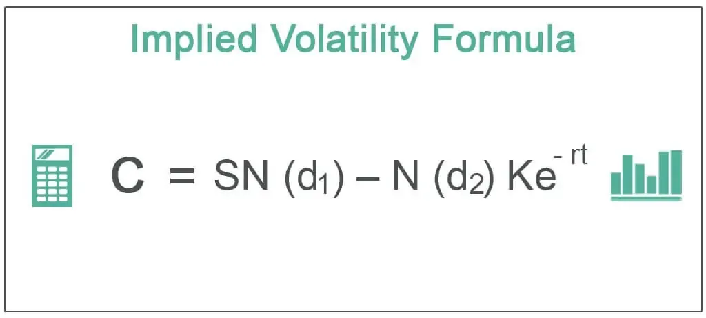

Algorithmic trading refers to the utilization of computer algorithms to automate the process of trading financial securities. It involves executing trades based on pre-defined criteria determined from an analysis of historical market data, mathematical models, and real-time market information. Precision in computational operations is a cornerstone of algorithmic trading, as even minimal errors can lead to substantial financial consequences. For instance, small discrepancies in calculating asset prices, interest rates, or risk metrics can significantly impact the profitability of trades and the effectiveness of strategies.

The importance of precision in financial computations is underscored by the need to accurately model and predict price movements, assess risk, and optimize trading strategies. Precise computations allow traders to identify market inefficiencies, capitalize on arbitrage opportunities, and manage portfolio risks more effectively. A single decimal point error in these calculations can result in significant deviations in expected returns or expose traders to unintended risks.



Implied precision computation is a concept that arises within this framework, primarily due to the complexity and dynamism of financial markets. Unlike explicit precision—where exact numerical values are calculated and applied—implied precision involves inferring levels of accuracy from the models and data used. It is about understanding the limitations of the inputs and assumptions that underpin trading algorithms and recognizing that some degree of uncertainty or approximation is inherent in these processes.

Precision can be 'implied' and not always explicit in algorithmic processes because many mathematical models in finance are based on estimates and approximations. Market data such as volatility, interest rates, or forecasts might not be available at the precise values needed, requiring traders to use implied measures. A classic example is the use of implied volatility derived from option prices in the Black-Scholes model, where the actual market volatility is not directly observed but extracted from the pricing of options.

The goal of this article is to elucidate these concepts, enhancing understanding of how implied precision influences algorithmic trading. By examining the fundamental principles, mathematical models, and real-world applications, readers will gain insights into the sophistication behind algorithmic decisions and the critical role of precision. Understanding these elements is vital for both seasoned practitioners and newcomers who aim to develop or refine their trading algorithms while appreciating the intricate balance between precision and implied precision in financial computations.

## Table of Contents

## Understanding Implied Precision

Implied precision in [algorithmic trading](/wiki/algorithmic-trading) refers to the accuracy and exactness of computations that are not explicitly defined but inherently assumed or modeled within an algorithm. It plays a crucial role in ensuring that trading strategies operate effectively under the inherent uncertainties of financial markets. In algorithmic trading, precision affects pricing, risk assessment, and decision-making processes, making it a critical component of successful trading systems.

Implied precision differs from explicit precision, which is clearly defined in terms of numerical accuracy or data granularity. Explicit precision is straightforward, as it typically involves fixed decimal places or specific data types. Implied precision, however, is more nuanced and arises from mathematical models and statistical estimations. For example, when using a stochastic model to predict future asset prices, the precision of the outcome is implied through the model's assumptions, calibration, and the quality of input data.

Common scenarios in algorithmic trading where precision is implied include options pricing, portfolio optimization, and high-frequency trading ([HFT](/wiki/high-frequency-trading-strategies)). In options pricing, models like the Black-Scholes formula provide theoretical prices based on assumptions of market [volatility](/wiki/volatility-trading-strategies), interest rates, and time to maturity. These parameters involve estimated values, and the resulting precision of the option's price is therefore implied. Similarly, in portfolio optimization, the precision of expected returns and covariances between asset returns are implied through statistical models and historical data analysis.

The role of modeling and estimation techniques is central to implied precision. These techniques define the structure and dynamics of the financial models used in trading. For instance, econometric models or [machine learning](/wiki/machine-learning) algorithms (such as regression models or neural networks) project future price movements based on historical trends. The precision of these models is implied by the model's design, parameter estimation, and the data utilized.

Mathematically, if $X$ is a random variable representing the future price of an asset and $\mu$ and $\sigma$ are its estimated mean and standard deviation, the implied precision can be seen through the estimated interval or confidence bounds around $X$. This can be expressed as $X \sim N(\mu, \sigma^2)$, where the precision is encapsulated in the statistical distributions and the assumptions underlying them.

Leveraging implied precision effectively requires a deep understanding of the models employed, careful calibration using quality data, and continuous validation of assumptions. As markets evolve, refining these approaches is crucial for maintaining and enhancing the efficacy of algorithmic trading strategies.

## Mathematical Frameworks Supporting Implied Precision

Algorithmic trading relies heavily on mathematical models to achieve high-precision computations, crucial for fast and accurate decision-making in volatile financial markets. The concept of implied precision emerges from the manner in which these models predict price movements, estimate risk, and execute trades without explicitly specifying all parameters and conditions in real time. This section explores some of the key mathematical frameworks that underpin these processes, highlighting how they support implied precision.

### Black-Scholes Model

The Black-Scholes model is one of the most fundamental mathematical frameworks used in option pricing, which has substantial applications in algorithmic trading. This model provides a theoretical estimate of the price of European-style options and is based on several assumptions, such as constant volatility and no [arbitrage](/wiki/arbitrage) opportunities. The Black-Scholes equation is defined as:

$$
C = S_0 N(d_1) - X e^{-rT} N(d_2)
$$

where
$$
d_1 = \frac{\ln(S_0/X) + (r + \sigma^2/2)T}{\sigma \sqrt{T}}
$$
$$
d_2 = d_1 - \sigma \sqrt{T}
$$

- $C$ is the call option price
- $S_0$ is the current stock price
- $X$ is the strike price
- $r$ is the risk-free interest rate
- $\sigma$ is the volatility of the stock
- $T$ is the time to expiration
- $N(\cdot)$ is the cumulative distribution function of the standard normal distribution

In algorithmic trading, the precision of this model is inherent in its assumptions and the distribution functions applied. Though explicit parameters like volatility or risk-free rate are required inputs, the true market volatility can only be estimated, hence the precision in volatility is often implied, not explicit. This involves using historical data or market-implied data, resulting in implied precision that affects pricing and risk management strategies significantly.

### GARCH Models

Generalized Autoregressive Conditional Heteroskedasticity (GARCH) models are widely utilized for estimating the volatility of returns. The key to their effectiveness lies in how past variances help forecast future volatility. The GARCH(1,1) model, for example, is defined by:

$$
\sigma_t^2 = \alpha_0 + \alpha_1 \epsilon_{t-1}^2 + \beta_1 \sigma_{t-1}^2
$$

- $\sigma_t^2$ is the current period's volatility
- $\epsilon_{t-1}^2$ is the lagged squared returns (shock from the previous period)
- $\alpha$ and $\beta$ are parameters of the model

In contexts where precision is critical, such as high-frequency trading, a GARCH model's ability to imply precision through estimated volatility is highly valued. Unlike static models, GARCH dynamically adjusts to market conditions, thus implying a precision level based on observed market data and adaptability.

### Stochastic Differential Equations (SDEs)

Used extensively in financial mathematics, including the modeling of stock prices and interest rates, stochastic differential equations are foundational for models like the Black-Scholes, which employ a continuous-time stochastic process. In general form, an SDE can be written as:

$$
dX_t = \mu(X_t, t) dt + \sigma(X_t, t) dW_t
$$

- $dX_t$ is the change in the process
- $\mu$ is the drift term (expected change)
- $\sigma$ is the diffusion term (volatility)
- $dW_t$ is a Wiener process or Brownian motion

The implied precision of SDEs arises from how they model randomness. By accounting for the paths that variables might follow under uncertainty, SDEs incorporate precision implicitly, requiring high computational prowess for estimations and decisions. Algorithmic strategies often simulate numerous paths to understand potential price evolutions.

### Conclusion

Mathematical frameworks such as the Black-Scholes model, GARCH models, and SDEs play critical roles in algorithmic trading by providing the means to handle and imply precision in market conditions. These models underline how precision is not always explicitly defined but can be inferred from estimates, assumptions, and probabilistic techniques. Harnessing these models, algorithmic trading systems maintain the necessary accuracy to optimize trading strategies and manage risks effectively.

## Practical Applications of Implied Precision in Algo Trading

Algorithmic trading systems often utilize implied precision to enhance their decision-making processes. These systems capitalize on the concept of implied precision to manage portfolios and conduct risk analysis effectively, leading to optimized trading strategies.

One real-world example of an algorithmic trading system using implied precision is high-frequency trading (HFT). These systems execute numerous transactions in fractions of a second, relying heavily on precise computations that are not always explicitly defined. Instead, they are derived from the behavior of the markets and statistical models used. The implied precision allows for managing minor discrepancies due to latency or fluctuations in market data, which can affect the trading decision when executing trades. By using historical data and real-time analytics, HFT systems can infer the level of precision necessary to make profitable trades, despite the inherent uncertainties of market conditions.

Portfolio management relies significantly on implied precision to estimate risks and return characteristics of assets. Implied precision comes into play when estimating covariance and correlation matrices between different assets, which are critical components of modern portfolio theory. While exact precision might be computationally expensive and unnecessary, an implied level of precision allows the portfolio managers to balance risk and return efficiently. For instance, techniques like the Markowitz Efficient Frontier use implied precision calculated from historical returns to optimize asset allocation in a portfolio.

In risk analysis, Value at Risk (VaR) models utilize implied precision by estimating the potential loss in value of a portfolio under normal market conditions over a set period. These estimates hinge on the implied volatility from previous market data and projected conditions. The implied precision here influences the confidence intervals and the interpretation of potential risks associated with different financial positions or assets, helping traders and risk managers make informed decisions.

Implied precision significantly impacts the decision-making processes in trading strategies, particularly in predicting price movements and executing trades. For example, [statistical arbitrage](/wiki/statistical-arbitrage) strategies often use implied precision to exploit inefficiencies between related financial instruments. These trading systems predict potential price changes based on historical price patterns and statistical correlations. By doing so, they can identify trades implied by the statistical relationships, rather than explicit market signals.

Moreover, machine learning models that are part of some trading strategies rely on implied precision when training algorithms on large datasets. These models infer a level of precision from the available data, which guides the creation of prediction models that are robust against imperfections in data quality. This implicit understanding assists in making accurate forecasts, which is crucial for devising effective trading strategies.

In conclusion, implied precision plays a critical role in the processes and decision-making within algorithmic trading systems. By leveraging historical data, statistical models, and real-time analytics, trading systems can infer necessary precision levels, enhancing their efficiency in executing trades, managing portfolios, and analyzing risks.

## Challenges and Limitations

Achieving precision in algorithmic trading presents several challenges, primarily due to the inherent complexities and dynamic nature of financial markets. Precision is crucial for optimizing trading strategies and ensuring accurate predictions, but numerous factors complicate its attainment.

One major challenge is the execution latency, which can introduce discrepancies between the computed precision and actual market outcomes. Latency arises from network delays, computational lags, or inefficiencies in data processing. These time lags cause a mismatch between the predicted and realized prices, affecting decision-making and the profitability of trades. 

Another challenge is market volatility. Market conditions change rapidly and unpredictably, leading to significant price fluctuations. These fluctuations mean that the precision of any algorithm is contingent on the stability and predictability of market indicators, which, in many cases, are volatile.

Regarding limitations of current models, financial algorithms frequently rely on simplifying assumptions that can render implied precision inadequate. For example, models like Black-Scholes assume constant volatility and normally distributed returns, which do not hold true in all market conditions. Such assumptions may lead to errors, particularly in turbulent markets where assumptions quickly become invalid.

Models often need more adaptability to varied market conditions, reducing their effectiveness in extreme situations. For instance, during market crashes, the assumptions of normal market behavior embedded within many models fail to hold, thus dragging down the precision of computations and predictions.

Reliance on historical data also poses limitations, as models typically use past data to inform parameters—this retrospective approach presumes that historical patterns will repeat, which is not always the case in dynamic markets.

Potential risks associated with reliance on implied precision include overfitting and model risk. Overfitting occurs when a model is too closely tailored to historical data, capturing noise instead of underlying trends, leading to poor performance in unseen data environments. Model risk refers to the potential for inaccurate data input or model failures, which can lead to significant financial losses.

Moreover, high-frequency trading, which depends heavily on implied precision, can amplify systemic risks. Small errors or delays in computations, although seemingly insignificant, can accumulate rapidly, causing cascading failures in financial systems.

In conclusion, achieving precision in algorithmic trading is fraught with challenges related to latency, market volatility, and model limitations. Addressing these challenges involves enhancing model robustness, incorporating more adaptive algorithms, and continuously improving computational efficiencies to reduce risks associated with implied precision.

## Future Trends and Developments

Emerging technologies and methodologies are crucial in enhancing implied precision in algorithmic trading, enabling better accuracy in financial computations and decision-making processes. Among these, machine learning and [artificial intelligence](/wiki/ai-artificial-intelligence) (AI) stand out as transformative forces. These technologies contribute significantly to refining predictions and improving the overall computational accuracy required in algorithmic trading strategies.

Machine learning algorithms enhance implied precision by learning from vast historical data sets to identify patterns and correlations that may not be evident through traditional statistical methods. Techniques such as neural networks, support vector machines, and ensemble methods are employed to model complex financial systems with high precision. For instance, neural networks can approximate nonlinear functions and capture intricate relationships in data, enhancing the prediction accuracy of market trends.

```python
from sklearn.ensemble import RandomForestRegressor

# Sample implementation of a Random Forest model for financial prediction
def predict_with_rf(features, target):
    model = RandomForestRegressor(n_estimators=100, random_state=42)
    model.fit(features, target)
    predictions = model.predict(features)
    return predictions
```

AI plays a role in optimizing trading algorithms by dynamically adjusting parameters based on real-time market conditions. Reinforcement learning, a subset of AI, is particularly useful in developing adaptive algorithms that adjust trading strategies to maximize returns while minimizing risks, thus implying precision through continuous learning and adaptation.

Research is focused on enhancing these technologies' accuracy and reliability through more efficient data processing techniques and improved model architectures. Quantum computing is another promising domain, offering the potential to execute complex calculations at unprecedented speeds, thus enhancing the precision of algorithmic models further.

Additionally, ongoing developments in blockchain technology are paving the way for more transparent and precise transaction recording and verification processes. Blockchain's decentralized ledger system provides an immutable and time-stamped record of transactions, which can enhance the precision of historical data used in algorithmic models.

Ongoing research into precision enhancement is geared toward integrating these advanced technologies with traditional financial models. This integration could facilitate the creation of hybrid models that leverage the strengths of both deterministic and probabilistic approaches, thus improving the robustness and precision of algo trading systems.

The future of precision computation in finance is likely to see more innovative solutions as researchers and industry professionals continue to explore these avenues. The integration of cutting-edge technologies will play a critical role in addressing current limitations and unlocking new possibilities in algorithmic trading.

## Conclusion

Understanding and leveraging implied precision in algorithmic trading is crucial for optimizing trading outcomes and ensuring robust financial models. Implied precision refers to the inherent accuracy in financial computations, where exactness is not explicitly stated but understood within the confines of the algorithms and models used. Mastery of this concept allows traders to create algorithms that make informed decisions based on subtle variations in market data.

Challenges in achieving precision are ever-present, primarily due to the complexity and unpredictability of financial markets. These challenges are compounded by limitations in existing models which, while sophisticated, cannot capture every nuance or eventuality. The evolving landscape of precision computation, therefore, demands continuous refinement of methodologies and tools used in trading. This includes addressing issues like model drift, ensuring data integrity, and maintaining computational efficiency amidst growing data volumes.

Recognizing these challenges highlights the necessity for ongoing research and development in precision computation. Emerging technologies, such as machine learning and artificial intelligence, are proving pivotal in advancing the accuracy and reliability of financial models. They offer the potential to enhance implied precision by learning from large datasets and adapting to dynamic market conditions.

For those seeking to deepen their understanding, further reading on specialized algorithms and financial models is encouraged. Texts and resources exploring the intricacies of quantitative finance, stochastic calculus, and computational finance provide valuable insights. As the field progresses, keeping abreast of new developments becomes vital, preparing traders and analysts to harness the full potential of implied precision in their strategies.

## References & Further Reading

[1]: Hull, J. (2014). ["Options, Futures, and Other Derivatives"](https://www.amazon.com/Options-Futures-Other-Derivatives-9th/dp/0133456315) (9th Edition). Pearson.

[2]: Black, F., & Scholes, M. (1973). ["The Pricing of Options and Corporate Liabilities."](https://www.cs.princeton.edu/courses/archive/fall09/cos323/papers/black_scholes73.pdf) Journal of Political Economy, 81(3), 637-654.

[3]: Engle, R. (1982). ["Autoregressive Conditional Heteroscedasticity with Estimates of the Variance of United Kingdom Inflation."](https://www.semanticscholar.org/paper/Autoregressive-conditional-heteroscedasticity-with-Engle/2ee6cb87fc81ecd78d161c4a92c9dfce00c8961c) Econometrica, 50(4), 987-1007.

[4]: Bollerslev, T. (1986). ["Generalized Autoregressive Conditional Heteroskedasticity."](https://www.sciencedirect.com/science/article/pii/0304407686900631) Journal of Econometrics, 31(3), 307-327.

[5]: Cont, R., & Tankov, P. (2004). ["Financial Modelling with Jump Processes."](https://www.taylorfrancis.com/books/mono/10.1201/9780203485217/financial-modelling-jump-processes-peter-tankov-rama-cont) Chapman & Hall/CRC Financial Mathematics Series.

[6]: Lopez de Prado, M. (2018). ["Advances in Financial Machine Learning."](https://www.amazon.com/Advances-Financial-Machine-Learning-Marcos/dp/1119482089) John Wiley & Sons.

[7]: Chan, E. (2009). ["Quantitative Trading: How to Build Your Own Algorithmic Trading Business."](https://github.com/ftvision/quant_trading_echan_book) John Wiley & Sons.

[8]: Jorion, P. (2006). ["Value at Risk: The New Benchmark for Managing Financial Risk."](https://books.google.com/books/about/Value_at_Risk_3rd_Ed.html?id=nnblKhI7KP8C) (3rd Edition). McGraw-Hill.

[9]: Bishop, C. M. (2006). ["Pattern Recognition and Machine Learning."](https://link.springer.com/book/9780387310732) Springer.