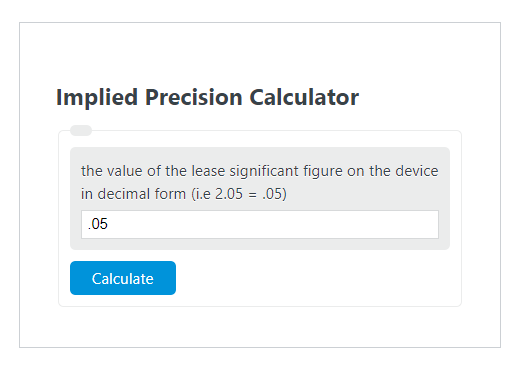

## Table of Contents

## What is implied precision computation?

Implied precision computation is a way of doing math where you don't always use the exact numbers. Instead, you use numbers that are close enough to get a good answer without needing to be perfect. This can be helpful when you want to save time or when you're working with very big or very small numbers that are hard to handle exactly.

For example, if you're calculating the distance between two cities, you might round the numbers to make the math easier. Instead of using the exact distance of 345.678 miles, you might use 346 miles. This small difference usually doesn't change the final answer much, but it makes the calculation simpler. This method is used a lot in computers and science to make things faster and easier to manage.

## Why is implied precision important in numerical computations?

Implied precision is important in numerical computations because it helps save time and computer resources. When you're doing math on a computer, using exact numbers can be slow and might need a lot of memory, especially if you're dealing with very big or very small numbers. By using numbers that are close enough, you can do the math faster and use less memory. This is really helpful in things like weather forecasting or simulations where you need to do a lot of calculations quickly.

It also makes things easier to understand and work with. When numbers are rounded to a certain level of precision, it's easier for people to read and use them. For example, if you're looking at the results of a scientific study, it's easier to understand the main points if the numbers are rounded to a few decimal places instead of seeing a long string of numbers. This way, implied precision helps make complex data more manageable and easier to communicate.

## How does implied precision differ from explicit precision?

Implied precision and explicit precision are two ways to handle numbers in math. Implied precision means you use numbers that are close enough to the real ones, but not exact. This makes calculations faster and easier because you don't need to worry about every tiny detail. For example, if you need to add 3.14159 and 2.71828, you might just use 3.14 and 2.72 instead. This small difference usually doesn't change the big picture, but it makes the math simpler.

Explicit precision, on the other hand, means you use the exact numbers every time. This can be important in situations where even small differences matter a lot, like in some scientific experiments or financial calculations. For instance, if you're calculating the exact amount of money in a bank account, you need to use the exact numbers to make sure everything is correct. Using explicit precision takes more time and computer power, but it gives you the most accurate results possible.

## What are the common applications of implied precision computation?

Implied precision computation is often used in scientific and engineering fields where speed and efficiency are important. For example, in weather forecasting, scientists need to do a lot of calculations quickly to predict the weather. They use implied precision to make these calculations faster. Instead of using exact numbers for temperature, humidity, and wind speed, they use numbers that are close enough. This way, they can get a good prediction without spending too much time on each calculation.

Another common use of implied precision is in computer graphics and simulations. When you play a video game or watch a computer-generated movie, the computer needs to calculate the position and movement of many objects very quickly. Using implied precision helps the computer do this faster. For instance, the exact position of a character might not be needed to the millionth of an inch; a close enough number works just fine. This makes the game or movie run smoothly without needing a super powerful computer.

In financial modeling and data analysis, implied precision can also be helpful. When analysts look at large sets of data, they often round numbers to make the analysis easier and quicker. For example, if they are looking at stock prices or sales figures, they might round the numbers to the nearest dollar or cent. This doesn't change the overall trends or patterns they are looking for, but it makes the work faster and easier to understand.

## Can you explain the concept of significant figures in relation to implied precision?

Significant figures are a way to show how precise a number is. They help you know which digits in a number are important and which ones are just there to fill space. For example, if you have the number 3.14, the three digits (3, 1, and 4) are all significant. This means those digits are the ones that matter when you're doing math with that number. When you use significant figures, you're using a form of implied precision because you're saying that the number is good enough for what you need, even if it's not exact.

In science and math, significant figures are used a lot because they help keep things simple and clear. If you're measuring something, you might not need to know the exact number down to the last tiny digit. For example, if you're measuring the length of a room and you get 5.0 meters, the zero at the end shows that you measured it to the nearest tenth of a meter. This is enough for most purposes, and it saves time and effort compared to measuring to the nearest millimeter. Using significant figures helps you focus on the important parts of the number and ignore the parts that don't matter as much.

## How do rounding errors affect implied precision computations?

Rounding errors can make a difference in implied precision computations. When you round numbers to make them easier to work with, you might end up with answers that are a little bit off from what they would be if you used the exact numbers. For example, if you're adding up a lot of numbers and you round each one, the small mistakes can add up and make your final answer different from what it should be. This is called the accumulation of rounding errors, and it can be a problem if you need your answer to be very accurate.

However, for many purposes, these small errors don't matter much. In things like weather forecasts or video games, the tiny differences caused by rounding don't change the big picture. As long as you know how much error you can accept, implied precision can still give you good enough answers without having to do a lot of extra work. The key is to understand when you can use rounded numbers and when you need to be more exact.

## What are the best practices for maintaining implied precision in software development?

When you're making software, it's important to think about how you use numbers. Implied precision means using numbers that are close enough instead of exact ones. To do this well, you should decide early on how many decimal places you need for your calculations. This helps keep your numbers simple and your program fast. For example, if you're making a game, you might decide that positions only need to be accurate to two decimal places. This way, you can round numbers to that level and make your game run smoothly without using too much computer power.

Another good practice is to be careful about how you round numbers. Always round in a consistent way, like always rounding up or always rounding to the nearest number. This helps keep your calculations predictable and reduces the chance of big mistakes. Also, keep an eye on how rounding errors might add up over time. If you're doing a lot of calculations, these small errors can grow and affect your results. By understanding and managing these errors, you can make sure your software works well and gives good enough answers for what you need.

## How can implied precision be managed in floating-point arithmetic?

In floating-point arithmetic, managing implied precision means choosing how many digits to keep when you do math with numbers that have a decimal point. Computers use a special way to store these numbers, which can lead to small mistakes called rounding errors. To handle this, you can decide to round your numbers to a certain number of decimal places. For example, if you only need your answers to be accurate to two decimal places, you can round all your numbers to that level. This makes your calculations simpler and faster, and the small errors usually don't matter much.

It's also important to be careful about how you round numbers in floating-point arithmetic. You should round numbers in a consistent way, like always rounding up or always rounding to the nearest number. This helps keep your calculations predictable and reduces the chance of big mistakes. If you're doing a lot of calculations, these small errors can add up over time. By understanding and managing these errors, you can make sure your software works well and gives good enough answers for what you need.

## What are the challenges of working with implied precision in scientific computing?

One big challenge of using implied precision in scientific computing is that it can lead to small mistakes in calculations. These mistakes, called rounding errors, can add up over time and make your final results less accurate than they should be. For example, if you're doing a long calculation with a lot of steps, each small rounding error can grow bigger and bigger. This is a problem in fields like climate modeling or financial forecasting where even tiny differences can change the outcome a lot. Scientists need to find a balance between using implied precision to make calculations faster and keeping the results accurate enough for their work.

Another challenge is deciding how many decimal places to keep. This choice can be tricky because it depends on what you're trying to do. If you round too much, you might lose important information and end up with answers that are too far off. But if you don't round enough, your calculations can take a long time and use a lot of computer power. Scientists have to think carefully about how much precision they need and how much they can safely round numbers without messing up their results. This often means doing tests and experiments to see how different levels of precision affect their work.

## How does implied precision impact the accuracy of statistical data analysis?

Implied precision can affect the accuracy of statistical data analysis by introducing small errors when numbers are rounded. When you round numbers to make them easier to work with, you might lose some details that could be important for understanding the data. For example, if you're looking at the average height of a group of people and you round everyone's height to the nearest inch, your final average might be a little off from what it would be if you used the exact heights. These small mistakes can add up, especially if you're doing a lot of calculations or working with big sets of data. This means that the results of your analysis might not be as accurate as they could be if you used the exact numbers.

However, for many types of statistical analysis, these small errors from implied precision don't change the big picture. If you're looking at trends or patterns in the data, rounding numbers to a reasonable level of precision often doesn't make a big difference. For example, if you're studying the relationship between two variables, rounding the numbers might not change the overall trend you see. The key is to understand how much error you can accept in your analysis. By choosing the right level of precision, you can make your calculations faster and easier while still getting results that are good enough for your needs.

## What advanced techniques exist for optimizing implied precision in complex algorithms?

One advanced technique for optimizing implied precision in complex algorithms is adaptive precision management. This means the algorithm changes how many decimal places it uses based on what part of the calculation it's doing. For example, if a certain step in the algorithm needs to be very accurate, it might use more decimal places just for that step. But if another step can handle less precision, it will round the numbers to save time and computer power. This way, the algorithm can be both fast and accurate where it needs to be.

Another technique is error analysis and compensation. This involves keeping track of the small mistakes that happen when numbers are rounded and then fixing them at the end of the calculation. For example, if you know that rounding errors are adding up in a certain way, you can adjust your final answer to make up for those errors. This helps make sure that even though you're using implied precision, your results are still as accurate as possible. Both of these techniques help balance the need for speed and the need for accuracy in complex algorithms.

## How do different programming languages handle implied precision and what are their limitations?

Different programming languages handle implied precision in various ways. In languages like Python, floating-point numbers are used by default, which means they automatically use a certain level of precision. Python's floating-point numbers follow the IEEE 754 standard, which gives a good balance between speed and accuracy. However, Python also has a 'decimal' module for when you need more control over precision. This module lets you decide exactly how many decimal places to use, which is helpful for things like financial calculations where you need to be very accurate. On the other hand, languages like Java also use floating-point numbers by default but offer a 'BigDecimal' class for high-precision calculations. This class is useful when you need to work with very big or very small numbers and want to avoid rounding errors.

The limitations of implied precision in programming languages often come from how they handle floating-point numbers. For example, in languages like C and C++, floating-point numbers can lead to small rounding errors that add up over time. These languages give you a lot of control over how numbers are stored and calculated, but it's up to the programmer to manage precision carefully. In contrast, languages like MATLAB are designed for scientific computing and have built-in tools to manage precision, but they might not be as fast as lower-level languages like C. Each language has its own way of dealing with precision, and the choice depends on what you're trying to do. If you need very accurate results, you might need to use special libraries or modules to control precision more closely.

## What Mathematical Frameworks Support Implied Precision?

Algorithmic trading relies heavily on mathematical models to achieve high-precision computations, crucial for fast and accurate decision-making in volatile financial markets. The concept of implied precision emerges from the manner in which these models predict price movements, estimate risk, and execute trades without explicitly specifying all parameters and conditions in real time. This section explores some of the key mathematical frameworks that underpin these processes, highlighting how they support implied precision.

### Black-Scholes Model

The Black-Scholes model is one of the most fundamental mathematical frameworks used in option pricing, which has substantial applications in [algorithmic trading](/wiki/algorithmic-trading). This model provides a theoretical estimate of the price of European-style options and is based on several assumptions, such as constant [volatility](/wiki/volatility-trading-strategies) and no [arbitrage](/wiki/arbitrage) opportunities. The Black-Scholes equation is defined as:

$$
C = S_0 N(d_1) - X e^{-rT} N(d_2)
$$

where
$$
d_1 = \frac{\ln(S_0/X) + (r + \sigma^2/2)T}{\sigma \sqrt{T}}
$$
$$
d_2 = d_1 - \sigma \sqrt{T}
$$

- $C$ is the call option price
- $S_0$ is the current stock price
- $X$ is the strike price
- $r$ is the risk-free interest rate
- $\sigma$ is the volatility of the stock
- $T$ is the time to expiration
- $N(\cdot)$ is the cumulative distribution function of the standard normal distribution

In algorithmic trading, the precision of this model is inherent in its assumptions and the distribution functions applied. Though explicit parameters like volatility or risk-free rate are required inputs, the true market volatility can only be estimated, hence the precision in volatility is often implied, not explicit. This involves using historical data or market-implied data, resulting in implied precision that affects pricing and risk management strategies significantly.

### GARCH Models

Generalized Autoregressive Conditional Heteroskedasticity (GARCH) models are widely utilized for estimating the volatility of returns. The key to their effectiveness lies in how past variances help forecast future volatility. The GARCH(1,1) model, for example, is defined by:

$$
\sigma_t^2 = \alpha_0 + \alpha_1 \epsilon_{t-1}^2 + \beta_1 \sigma_{t-1}^2
$$

- $\sigma_t^2$ is the current period's volatility
- $\epsilon_{t-1}^2$ is the lagged squared returns (shock from the previous period)
- $\alpha$ and $\beta$ are parameters of the model

In contexts where precision is critical, such as high-frequency trading, a GARCH model's ability to imply precision through estimated volatility is highly valued. Unlike static models, GARCH dynamically adjusts to market conditions, thus implying a precision level based on observed market data and adaptability.

### Stochastic Differential Equations (SDEs)

Used extensively in financial mathematics, including the modeling of stock prices and interest rates, stochastic differential equations are foundational for models like the Black-Scholes, which employ a continuous-time stochastic process. In general form, an SDE can be written as:

$$
dX_t = \mu(X_t, t) dt + \sigma(X_t, t) dW_t
$$

- $dX_t$ is the change in the process
- $\mu$ is the drift term (expected change)
- $\sigma$ is the diffusion term (volatility)
- $dW_t$ is a Wiener process or Brownian motion

The implied precision of SDEs arises from how they model randomness. By accounting for the paths that variables might follow under uncertainty, SDEs incorporate precision implicitly, requiring high computational prowess for estimations and decisions. Algorithmic strategies often simulate numerous paths to understand potential price evolutions.

### Conclusion

Mathematical frameworks such as the Black-Scholes model, GARCH models, and SDEs play critical roles in algorithmic trading by providing the means to handle and imply precision in market conditions. These models underline how precision is not always explicitly defined but can be inferred from estimates, assumptions, and probabilistic techniques. Harnessing these models, algorithmic trading systems maintain the necessary accuracy to optimize trading strategies and manage risks effectively.

## References & Further Reading

[1]: Hull, J. (2014). ["Options, Futures, and Other Derivatives"](https://www.amazon.com/Options-Futures-Other-Derivatives-9th/dp/0133456315) (9th Edition). Pearson.

[2]: Black, F., & Scholes, M. (1973). ["The Pricing of Options and Corporate Liabilities."](https://www.cs.princeton.edu/courses/archive/fall09/cos323/papers/black_scholes73.pdf) Journal of Political Economy, 81(3), 637-654.

[3]: Engle, R. (1982). ["Autoregressive Conditional Heteroscedasticity with Estimates of the Variance of United Kingdom Inflation."](https://www.semanticscholar.org/paper/Autoregressive-conditional-heteroscedasticity-with-Engle/2ee6cb87fc81ecd78d161c4a92c9dfce00c8961c) Econometrica, 50(4), 987-1007.

[4]: Bollerslev, T. (1986). ["Generalized Autoregressive Conditional Heteroskedasticity."](https://www.sciencedirect.com/science/article/pii/0304407686900631) Journal of Econometrics, 31(3), 307-327.

[5]: Cont, R., & Tankov, P. (2004). ["Financial Modelling with Jump Processes."](https://www.taylorfrancis.com/books/mono/10.1201/9780203485217/financial-modelling-jump-processes-peter-tankov-rama-cont) Chapman & Hall/CRC Financial Mathematics Series.

[6]: Lopez de Prado, M. (2018). ["Advances in Financial Machine Learning."](https://www.amazon.com/Advances-Financial-Machine-Learning-Marcos/dp/1119482089) John Wiley & Sons.

[7]: Chan, E. (2009). ["Quantitative Trading: How to Build Your Own Algorithmic Trading Business."](https://github.com/ftvision/quant_trading_echan_book) John Wiley & Sons.

[8]: Jorion, P. (2006). ["Value at Risk: The New Benchmark for Managing Financial Risk."](https://books.google.com/books/about/Value_at_Risk_3rd_Ed.html?id=nnblKhI7KP8C) (3rd Edition). McGraw-Hill.

[9]: Bishop, C. M. (2006). ["Pattern Recognition and Machine Learning."](https://link.springer.com/book/9780387310732) Springer.