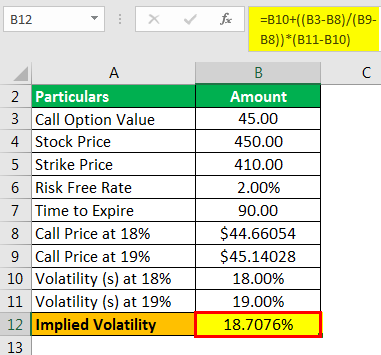

The concept of implied rates serves as a fundamental aspect of modern financial analysis, playing a crucial role in algorithmic trading and investment strategy. Implied rates represent the interest rate that equates the present value of an asset with its future value. This inferred interest rate is essential for making informed financial decisions, providing a computational bridge between current and anticipated market conditions.

Understanding how implied rates work and their calculation can provide a competitive advantage. These rates are used to forecast future financial scenarios and compare returns across different investments and instruments. By analyzing implied rates, traders and investors can infer market expectations and volatility, leading to more strategic investment and trading decisions.



This article aims to illuminate the intricacies surrounding the calculation of implied rates, supported by specific examples and applications in algorithmic trading. We will examine various mathematical methodologies involved, including the Black-Scholes model and Bootstrapping technique, to enhance understanding of interest rate dynamics. Moreover, practical use cases for investors and traders will be discussed, highlighting how these rates are leveraged in building execution algorithms, statistical arbitrage strategies, and risk management frameworks.

Comprehending implied rates is invaluable for anyone involved in the financial markets. They not only shed light on current market conditions but also provide insights into future trends and risks. Thus, mastering the calculation and application of implied rates can significantly bolster one's financial acumen and investment success.

## Table of Contents

## What is the Implied Rate?

The implied rate is an inferred interest rate that acts as a bridge between the spot interest rate and a future interest rate, providing valuable insights into potential future financial conditions. This tool enables financial analysts and investors to extrapolate expected deposit or loan costs in the future, which aids in informed financial decision-making.

Implied rates hold significant importance for comparing investment returns across various financial instruments. By standardizing the rate of return, implied rates create a common ground for evaluating distinct investment opportunities, thereby facilitating a more straightforward comparison among diverse financial products. This concept is particularly beneficial for assessing the relative attractiveness of different investments.

In trading, implied rates are widely employed across several financial markets, particularly in options, futures, and forward contracts. In options trading, for example, the implied [interest rate](/wiki/interest-rate-trading-strategies) is intricately linked with implied [volatility](/wiki/volatility-trading-strategies), determining the option's premium. Similarly, in futures contracts, implied rates help predict price differences over time, thereby creating a clearer picture of the anticipated financial landscape.

Consider the scenario where investors wish to evaluate a futures contract. By calculating the implied rate, investors infer vital information regarding the expected cost or income associated with holding that position over time. This inference helps in identifying [arbitrage](/wiki/arbitrage) opportunities and deciding the best [course](/wiki/best-algorithmic-trading-courses) of action in trading strategies.

To calculate the implied rate, one commonly deploys the formula:

$$
\text{Implied rate} = \left(\frac{\text{Forward price}}{\text{Spot price}}\right)^{1/\text{time}} - 1
$$

This formula adjusts the ratio of the forward price to the spot price over the contract period, yielding the implied rate. This rate helps investors comprehend the expectation embedded within market prices concerning future rates, thereby providing a comprehensive understanding and a more robust strategy framework for investment decisions.

Overall, the ability to discern and apply implied rates is an invaluable skill for anyone involved in finance and trading, as it enriches the depth of market analysis and enhances investment strategies.

## Understanding Calculations of Implied Rate

Calculation of the implied rate is an essential process in financial analysis, frequently applied to various financial instruments such as futures, options, and bonds. The implied rate serves as a forecast tool, allowing investors to infer future financial conditions based on current market data.

To compute the implied rate, the fundamental approach involves the ratio of the forward price to the spot price, adjusted over the contract’s expiration period. The formula employed is:

$$
\text{Implied Rate} = \left(\frac{\text{Forward Price}}{\text{Spot Price}}\right)^{\frac{1}{\text{Time}}} - 1
$$

This formula calculates the implied rate over a specific time period, effectively annualizing the return expected from holding a particular financial instrument. Here, 'Forward Price' is the price agreed upon today for a transaction that will occur at a specified future date, and 'Spot Price' is the current market price for immediate delivery of the same asset. 'Time' usually refers to the time to expiration expressed in years.

### Adjustments for Different Financial Instruments

Different financial instruments necessitate adjustments to the basic calculation to account for their unique characteristics.

1. **Futures Contracts**: 
   - Used to lock in a future price for the asset, eliminating the risk of price fluctuations. The formula applied remains largely consistent, but the 'Time' component is adjusted according to the specific maturity of the futures contract.

2. **Options**: 
   - They require additional parameters, such as the risk-free interest rate and volatility, especially when using models like Black-Scholes to determine implied volatility, which then influences the implied rate.

3. **Bonds**: 
   - When applied to bonds, the implied rate may need to consider the bond’s yield and coupon payments. The rate is influenced by the present value of the bond's cash flows compared to its market price.

### Python Example

Here is a basic Python function illustrating how to compute the implied rate for a forward contract:

```python
def calculate_implied_rate(forward_price, spot_price, time):
    implied_rate = (forward_price / spot_price) ** (1 / time) - 1
    return implied_rate

# Example
forward_price = 71
spot_price = 68
time = 1 # typically in years
implied_rate = calculate_implied_rate(forward_price, spot_price, time)
print(f"The implied rate is: {implied_rate:.2%}")
```

This simple Python function can be adapted to include further adjustments based on the characteristics and requirements of other financial instruments like those mentioned above. Understanding and performing these calculations accurately enables investors and traders to make informed financial decisions and anticipate potential market changes.

## Mathematical Formulas for Implied Interest Rates

The Black-Scholes model and the Bootstrapping technique are fundamental to calculating implied interest rates, each offering distinct methodologies suitable for different financial scenarios.

### Black-Scholes Model

The Black-Scholes model, primarily used for pricing European options, derives implied interest rates by leveraging the relationship between option prices, strike prices, and time until expiration. The model computes the theoretical price of options, using inputs like the spot price (S), strike price (K), risk-free interest rate (r), time to expiration (T), and volatility (σ). The basic formula for a European call option is:

$$
C = S N(d_1) - K e^{-rT} N(d_2)
$$

Where:
- $N$ is the cumulative distribution function of the standard normal distribution.
- $d_1 = \frac{1}{\sigma \sqrt{T}} \left[ \ln\left(\frac{S}{K}\right) + \left(r + \frac{\sigma^2}{2}\right) T \right]$
- $d_2 = d_1 - \sigma \sqrt{T}$

By inputting the current market price of the option, one can solve for the implied interest rate $r$ such that the left-hand side equals the market price, making the rate an adjustment to align theoretical and market prices.

### Bootstrapping Technique

Bootstrapping is a sophisticated method used to derive a yield curve from the prices of fixed-income securities, effectively bridging current spot rates and implied rates over different maturities. It constructs zero-coupon yield curves by iteratively solving for interest rates that align bond prices with their expected cash flows.

The process starts with short-term instruments and incrementally moves to longer maturities. The essential formula relates the bond price $P$ to future cash flows, requiring the solution of:

$$
P = \sum \frac{C_i}{(1 + r_i)^t}
$$

Where $C_i$ are the bond’s cash flows, $r_i$ are the implied rates for each period, and $t$ is the time to each cash flow. By setting each bond’s price equal to its discounted cash flows, bootstrapping iteratively solves for the implied forward rates.

### Forward Rate Formulas

Forward rate formulas play a crucial role in connecting spot and future rates. The forward rate, a type of implied rate, can be calculated using existing spot rates:

$$
f(t_1, t_2) = \frac{1 + z(t_2)}{1 + z(t_1)} - 1
$$

Where $f(t_1, t_2)$ is the forward rate between times $t_1$ and $t_2$, and $z(t_1)$ and $z(t_2)$ are the spot rates at those times. This calculation assists in determining the interest dynamics over future periods.

### Python Implementation Example

To calculate implied interest rates using the Black-Scholes formula, one might employ a Python script leveraging the SciPy library for numerical optimization:

```python
from scipy.optimize import fsolve
from scipy.stats import norm
import numpy as np

# Black-Scholes function
def black_scholes_call(S, K, T, r, sigma):
    d1 = (np.log(S / K) + (r + 0.5 * sigma**2) * T) / (sigma * np.sqrt(T))
    d2 = d1 - sigma * np.sqrt(T)
    return S * norm.cdf(d1) - K * np.exp(-r * T) * norm.cdf(d2)

# Solving for implied rate
def implied_rate(S, K, T, market_price, sigma):
    func = lambda r: black_scholes_call(S, K, T, r, sigma) - market_price
    return fsolve(func, 0.05)[0]  # Initial guess of 5%

# Example inputs
S = 100  # Spot price
K = 100  # Strike price
T = 1    # Time in years
market_price = 10  # Current market price of option
sigma = 0.2  # Volatility

implied_r = implied_rate(S, K, T, market_price, sigma)
print(f"Implied Interest Rate: {implied_r:.4f}")
```

Precise inputs are vital in all these methods, as the accuracy of the implied rate calculations significantly influences financial decision-making.

## Examples of Implied Rate Calculations

Implied rate calculations can be demonstrated through practical examples involving various asset classes such as commodities, stocks, and currencies. These calculations are essential in assessing potential returns and making informed investment decisions.

Consider an example involving commodity futures, specifically [crude oil](/wiki/crude-oil). Suppose the spot price of oil is $68, and the futures contract for the same commodity is priced at $71. Utilizing the formula for implied rate:

$$
\text{Implied Rate} = \left(\frac{\text{Forward Price}}{\text{Spot Price}}\right)^{\frac{1}{\text{Time}}} - 1
$$

Assuming a time frame of 1 year, the calculation is as follows:

$$
\text{Implied Rate} = \left(\frac{71}{68}\right)^{\frac{1}{1}} - 1 = \frac{71}{68} - 1 \approx 0.0441 \text{ or } 4.41\%
$$

This indicates an implied interest rate of 4.41% for the oil futures contract.

In the context of stocks, consider a scenario where the current spot price of a stock is $150, and the futures contract is available at $156, expected to mature in six months. Using the same formula adjusted for a half-year period:

$$
\text{Implied Rate} = \left(\frac{156}{150}\right)^{\frac{1}{0.5}} - 1 = \left(\frac{156}{150}\right)^{2} - 1 \approx 0.0809 \text{ or } 8.09\%
$$

This calculation yields an implied interest rate of 8.09% over the six-month period.

In currency markets, the implied rate is similarly critical. Take a currency pair with a spot rate of 1.25 and a forward rate of 1.27, with the contract maturing in one year:

$$
\text{Implied Rate} = \left(\frac{1.27}{1.25}\right)^{\frac{1}{1}} - 1 = \frac{1.27}{1.25} - 1 \approx 0.016 \text{ or } 1.6\%
$$

These examples highlight how implied rate calculations can differ depending on the asset class and market conditions. They also underscore the importance of using these rates to forecast future market scenarios and inform trading strategies. The precision of such calculations aids investors and traders in assessing potential profit opportunities and making strategic investment decisions.

## Practical Applications in Algorithmic Trading

Implied rates play a crucial role in [algorithmic trading](/wiki/algorithmic-trading) by facilitating the development of execution algorithms and [statistical arbitrage](/wiki/statistical-arbitrage) strategies. These rates offer traders a means to identify arbitrage opportunities and manage risks effectively, which are essential components of successful algorithmic trading.

One of the primary uses of implied rates in algorithmic trading is determining arbitrage opportunities. Arbitrage involves profiting from price discrepancies of the same asset across different markets or forms. By leveraging implied rates, traders can determine if the forward price of an asset deviates from its expected future spot price implied by market conditions. For example, if the calculated implied rate indicates a significant difference between the futures market and spot market expectations, traders can design strategies to exploit these inefficiencies.

Risk management is another significant aspect where implied rates prove beneficial. Understanding the implied rate allows traders to anticipate future interest rate movements and their impact on various financial instruments, aiding in risk assessment and hedging strategies. Advanced algorithmic models incorporate implied rates to adjust positions and manage portfolio risks dynamically.

Moreover, the integration of [machine learning](/wiki/machine-learning) (ML) and [artificial intelligence](/wiki/ai-artificial-intelligence) (AI) techniques in algorithmic trading has enhanced the utilization of implied rate data. These technologies can process vast datasets to uncover patterns and correlations that might not be apparent through traditional methods. Machine learning models, such as regression algorithms and neural networks, can be designed to predict future implied rates based on historical data, leading to improved decision-making and strategy execution.

For instance, a Python-based ML approach might involve using historical market data to train a model that forecasts future implied rates:

```python
import pandas as pd
from sklearn.model_selection import train_test_split
from sklearn.ensemble import RandomForestRegressor

# Load dataset containing historical spot prices, forward prices, and implied rates
data = pd.read_csv('market_data.csv')

# Define features and target variable
features = data[['spot_price', 'forward_price', 'time_to_maturity']]
target = data['implied_rate']

# Split data into training and testing sets
X_train, X_test, y_train, y_test = train_test_split(features, target, test_size=0.2, random_state=42)

# Initialize and train the model
model = RandomForestRegressor(n_estimators=100, random_state=42)
model.fit(X_train, y_train)

# Predict future implied rates
predictions = model.predict(X_test)
```

In conclusion, the application of implied rates in algorithmic trading extends from straightforward arbitrage strategies to sophisticated risk management techniques. The advent of ML and AI further enhances these strategies by offering data-driven insights and more precise predictions, contributing to the evolution of modern finance.

## Conclusion

Grasping the calculation and application of implied rates is invaluable for anyone involved in finance and trading. These rates offer a deeper understanding of not only the present financial markets but also potential future market trends and associated risks. Analyzing implied rates, derived from mechanisms such as forward pricing, allows traders and investors to anticipate shifts in interest rates and assess the attractiveness and risk of various financial instruments. By comparing implied rates to current market rates, investors can identify discrepancies that may indicate opportunities for arbitrage or adjustments in portfolio strategy.

Furthermore, implied rates play a substantial role in risk management. For traders and institutions, accurately interpreting these rates assists in constructing hedges that align with expected market conditions. As financial markets become increasingly complex and data-driven, the importance of understanding and utilizing implied rates is amplified. Whether through direct calculation or leveraging advanced algorithms and machine learning techniques, the knowledge gained through implied rates can lead to more informed and strategic decision-making.

Continued learning and utilization of these rates can significantly enhance one's financial acumen and investment outcomes. As markets evolve, staying informed about the nuances of implied rates ensures that investors remain competitive and can adapt their strategies to maximize returns while mitigating risk. Adopting this approach is particularly crucial in algorithmic trading, where real-time data analysis and swift decision-making are paramount. By prioritizing an in-depth grasp of implied rates, finance professionals can position themselves advantageously in the ever-evolving landscape of global markets.

## References & Further Reading

[1]: Black, F., & Scholes, M. (1973). ["The Pricing of Options and Corporate Liabilities."](https://www.cs.princeton.edu/courses/archive/fall09/cos323/papers/black_scholes73.pdf) Journal of Political Economy, 81(3), 637-654.

[2]: Hull, J. C. (2017). ["Options, Futures, and Other Derivatives."](https://www.semanticscholar.org/paper/Options%2C-Futures%2C-and-Other-Derivatives-Hull/89bdee500c8623864fc9eb7a471546aa713acc44) Pearson Education.

[3]: Fabozzi, F. J., & Mann, S. V. (2001). ["The Handbook of Fixed Income Securities."](https://www.amazon.com/Handbook-Fixed-Income-Securities-Ninth/dp/1260473899) McGraw-Hill.

[4]: Hull, J. C. (2018). ["Risk Management and Financial Institutions."](https://books.google.com/books/about/Risk_Management_and_Financial_Institutio.html?id=1J1QDwAAQBAJ) Wiley.

[5]: Gatheral, J. (2006). ["The Volatility Surface: A Practitioner's Guide."](https://onlinelibrary.wiley.com/doi/book/10.1002/9781119202073) Wiley.