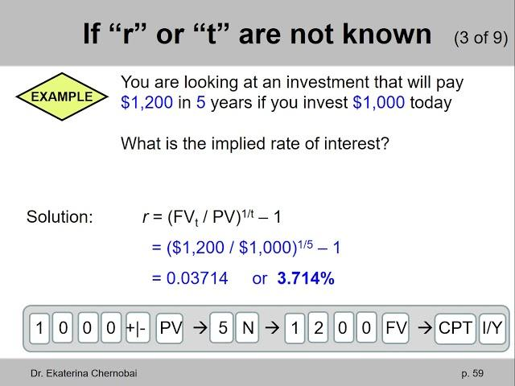

## Table of Contents

## What is the implied rate?

The implied rate is a way to figure out the interest rate that's expected in the future. It's often used when looking at financial products like bonds or currency exchanges. For example, if you're comparing the price of a bond now with what it might be worth later, the implied rate helps you understand the expected interest rate over that time.

This rate is important because it helps investors make decisions. If the implied rate is high, it might mean that people expect interest rates to go up. If it's low, it might mean the opposite. By understanding the implied rate, investors can choose the best times to buy or sell their investments to make the most money.

## Why is the implied rate important in finance?

The implied rate is important in finance because it helps people guess what interest rates will be like in the future. When you're thinking about buying or selling things like bonds or currencies, knowing the implied rate can tell you if it's a good time to do it. For example, if the implied rate is high, it means people think interest rates will go up soon. This can help you decide if you should buy now or wait.

Also, the implied rate is useful for planning. If you're saving money or borrowing, understanding the implied rate can help you pick the best times to do these things. It's like a sneak peek into what might happen with money in the future. This can make a big difference in how much money you end up with or how much you have to pay back on a loan.

## How is the implied rate different from the nominal rate?

The implied rate and the nominal rate are two different ways to think about interest rates. The nominal rate is the straightforward interest rate you see on a loan or a savings account. It's the percentage that tells you how much extra money you'll get or have to pay back, without thinking about things like inflation or other changes in the future.

On the other hand, the implied rate is a bit more complicated. It's an estimate of what people think interest rates will be in the future, based on the prices of things like bonds or currency exchanges today. The implied rate helps you guess if interest rates will go up or down, which can be really helpful when you're deciding whether to buy or sell investments. So, while the nominal rate tells you what's happening right now, the implied rate gives you a peek into what might happen later.

## What are the basic steps to calculate the implied rate?

To calculate the implied rate, you first need to look at the prices of financial products like bonds or currency futures. For example, if you have a bond that you can buy now and it will pay you back in the future, you can compare its current price to what it will be worth later. The difference between these two prices can help you figure out the implied rate. This rate shows what interest rate is expected between now and when the bond matures.

Once you have the current and future prices, you can use a formula to find the implied rate. One common way is to use the formula for the forward rate, which is a type of implied rate. You take the future value of the bond, subtract the current price, and then divide by the current price. After that, you adjust for the time until the bond matures. This gives you the implied rate, which tells you what the market thinks the interest rate will be over that period.

## Can you provide a simple example of implied rate calculation?

Let's say you can buy a bond today for $950, and in one year, it will pay you back $1,000. You want to know the implied rate, which is the expected interest rate for that year. To find it, you first figure out how much extra money you're getting. The bond pays you $1,000 at the end, but you paid $950, so you're getting an extra $50.

Next, you need to turn that $50 into a rate. You divide the extra money ($50) by what you paid for the bond ($950). That gives you about 0.0526, or 5.26%. So, the implied rate for that year is 5.26%. This means the market thinks the interest rate will be around 5.26% for the next year.

## What are the common formulas used in implied rate calculations?

One common formula used to calculate the implied rate is the forward rate formula. Imagine you have a bond you can buy today for a certain price, and it will pay you back a different amount in the future. To find the implied rate, you subtract the price you pay today from the amount you'll get in the future. Then, you divide that difference by the price you paid today. This gives you a number that you can turn into a percentage, which is the implied rate. It tells you what the market thinks the interest rate will be between now and when the bond matures.

Another way to calculate the implied rate is by using the spot rate and forward rate relationship. If you know the spot rate for a certain period and the forward rate for another period, you can figure out the implied rate for the combined period. For example, if you know the interest rate for the next six months (the spot rate) and the expected rate for the following six months (the forward rate), you can use these to calculate the implied rate for the whole year. This helps you understand the market's expectation for interest rates over different time frames.

## How does the implied rate affect investment decisions?

The implied rate is really important when you're thinking about where to put your money. It tells you what other people think interest rates will be in the future. If the implied rate is high, it means that people expect interest rates to go up. This can make you want to buy bonds or other investments now, before the rates go up and make them more expensive. On the other hand, if the implied rate is low, it might mean that interest rates won't go up much, so you might decide to wait or look for other investments that could give you a better return.

Understanding the implied rate can also help you plan better. For example, if you're saving for a big purchase like a house or a car, knowing the implied rate can help you decide when to start saving or borrowing. If the implied rate suggests that interest rates will be low for a while, it might be a good time to take out a loan. But if the implied rate is high, you might want to save more now and borrow later when rates might be lower. By using the implied rate to guide your decisions, you can make smarter choices about when to invest, save, or borrow.

## What are the factors that influence the implied rate?

The implied rate is influenced by several factors that people in the market pay attention to. One big [factor](/wiki/factor-investing) is what people think will happen with inflation. If they think prices will go up a lot in the future, they'll expect higher interest rates, which means the implied rate will be higher. Another factor is what the government or central banks are doing with interest rates. If they say they're going to raise rates, the implied rate will go up because people will expect higher rates soon.

Also, the overall health of the economy plays a role. If the economy is doing well and growing, people might think that interest rates will go up to keep things from growing too fast, so the implied rate will be higher. On the other hand, if the economy is not doing so well, people might expect interest rates to stay low or even go down, making the implied rate lower. So, the implied rate is like a guess about the future, based on what's happening with inflation, what the central banks are saying, and how the economy is doing.

## How can the implied rate be used in currency trading?

In currency trading, the implied rate can help traders guess what might happen with exchange rates in the future. If the implied rate for a currency is high, it means people think the interest rates for that currency will go up. This can make the currency more valuable because people will want to buy it to get the higher interest rates. So, if a trader sees a high implied rate, they might decide to buy that currency now, hoping to sell it later for more money when its value goes up.

On the other hand, if the implied rate is low, it means people expect interest rates to stay the same or go down. This can make the currency less valuable because people won't want to hold onto it if they can't earn much from it. Traders might then decide to sell that currency now, before its value drops even more. By paying attention to the implied rate, traders can make better guesses about when to buy or sell currencies to make a profit.

## What are the limitations and potential errors in implied rate calculations?

Implied rate calculations can be tricky because they are based on what people think will happen in the future, which is hard to predict. If people's guesses about inflation or what the central banks will do are wrong, the implied rate can be off too. Also, the prices of bonds or currency futures that are used to figure out the implied rate can change a lot because of things like news or big events. If the prices change suddenly, the implied rate might not be a good guide anymore.

Another problem with implied rates is that they can be affected by things that are hard to measure, like how much risk people are willing to take. If people suddenly get more worried about losing money, they might want higher interest rates to feel safer, which can mess up the implied rate. Plus, the formulas used to calculate the implied rate can be complicated, and if you make a small mistake in your math, you can end up with a wrong answer. So, while implied rates can be helpful, they're not perfect and should be used carefully.

## How do advanced financial models incorporate implied rates?

Advanced financial models use implied rates to make better guesses about what might happen with money in the future. These models look at lots of different things, like the prices of bonds, currency futures, and even what people think about the economy. By using the implied rate, these models can figure out what interest rates might be in the future. This helps people who manage big investments, like pension funds or insurance companies, to make smarter choices about where to put their money. They can use the implied rate to decide if it's a good time to buy or sell certain investments.

Sometimes, these models also use other information to make their guesses even better. They might look at things like how much risk people are willing to take or what the government is saying about interest rates. By mixing all this information with the implied rate, the models can give a more complete picture of what might happen. This can help investors plan for different situations and make decisions that could lead to bigger profits or less risk. So, even though implied rates are just guesses, they're really important for making smart money moves in the world of finance.

## Can you discuss a case study where the implied rate played a crucial role in financial strategy?

In 2007, before the big financial crisis, a big investment company called XYZ Investments used the implied rate to make a smart move. They noticed that the implied rates for certain bonds were going up, which meant people thought interest rates would go up soon. So, XYZ Investments decided to buy a lot of these bonds before the rates went up. When the interest rates did go up, the value of the bonds they bought went up too. This helped XYZ Investments make a lot of money and protect their clients' money during a tough time.

Another case was in 2015 when a currency trader named Jane used the implied rate to make a big profit. She saw that the implied rate for the Euro was low, which meant people thought the interest rates in Europe would stay low or go down. Jane decided to sell a lot of Euros and buy US dollars instead, because the implied rate for the US dollar was higher. When the Euro's value went down like she thought it would, Jane made a lot of money by selling Euros at a higher price and buying them back at a lower price. This showed how understanding the implied rate can help make smart moves in currency trading.

## What is the Implied Rate?

The implied rate is an inferred interest rate that acts as a bridge between the spot interest rate and a future interest rate, providing valuable insights into potential future financial conditions. This tool enables financial analysts and investors to extrapolate expected deposit or loan costs in the future, which aids in informed financial decision-making.

Implied rates hold significant importance for comparing investment returns across various financial instruments. By standardizing the rate of return, implied rates create a common ground for evaluating distinct investment opportunities, thereby facilitating a more straightforward comparison among diverse financial products. This concept is particularly beneficial for assessing the relative attractiveness of different investments.

In trading, implied rates are widely employed across several financial markets, particularly in options, futures, and forward contracts. In options trading, for example, the implied [interest rate](/wiki/interest-rate-trading-strategies) is intricately linked with implied [volatility](/wiki/volatility-trading-strategies), determining the option's premium. Similarly, in futures contracts, implied rates help predict price differences over time, thereby creating a clearer picture of the anticipated financial landscape.

Consider the scenario where investors wish to evaluate a futures contract. By calculating the implied rate, investors infer vital information regarding the expected cost or income associated with holding that position over time. This inference helps in identifying [arbitrage](/wiki/arbitrage) opportunities and deciding the best [course](/wiki/best-algorithmic-trading-courses) of action in trading strategies.

To calculate the implied rate, one commonly deploys the formula:

$$
\text{Implied rate} = \left(\frac{\text{Forward price}}{\text{Spot price}}\right)^{1/\text{time}} - 1
$$

This formula adjusts the ratio of the forward price to the spot price over the contract period, yielding the implied rate. This rate helps investors comprehend the expectation embedded within market prices concerning future rates, thereby providing a comprehensive understanding and a more robust strategy framework for investment decisions.

Overall, the ability to discern and apply implied rates is an invaluable skill for anyone involved in finance and trading, as it enriches the depth of market analysis and enhances investment strategies.

## What is the process for understanding calculations of implied rate?

Calculation of the implied rate is an essential process in financial analysis, frequently applied to various financial instruments such as futures, options, and bonds. The implied rate serves as a forecast tool, allowing investors to infer future financial conditions based on current market data.

To compute the implied rate, the fundamental approach involves the ratio of the forward price to the spot price, adjusted over the contract’s expiration period. The formula employed is:

$$
\text{Implied Rate} = \left(\frac{\text{Forward Price}}{\text{Spot Price}}\right)^{\frac{1}{\text{Time}}} - 1
$$

This formula calculates the implied rate over a specific time period, effectively annualizing the return expected from holding a particular financial instrument. Here, 'Forward Price' is the price agreed upon today for a transaction that will occur at a specified future date, and 'Spot Price' is the current market price for immediate delivery of the same asset. 'Time' usually refers to the time to expiration expressed in years.

### Adjustments for Different Financial Instruments

Different financial instruments necessitate adjustments to the basic calculation to account for their unique characteristics.

1. **Futures Contracts**: 
   - Used to lock in a future price for the asset, eliminating the risk of price fluctuations. The formula applied remains largely consistent, but the 'Time' component is adjusted according to the specific maturity of the futures contract.

2. **Options**: 
   - They require additional parameters, such as the risk-free interest rate and volatility, especially when using models like Black-Scholes to determine implied volatility, which then influences the implied rate.

3. **Bonds**: 
   - When applied to bonds, the implied rate may need to consider the bond’s yield and coupon payments. The rate is influenced by the present value of the bond's cash flows compared to its market price.

### Python Example

Here is a basic Python function illustrating how to compute the implied rate for a forward contract:

```python
def calculate_implied_rate(forward_price, spot_price, time):
    implied_rate = (forward_price / spot_price) ** (1 / time) - 1
    return implied_rate

# Example
forward_price = 71
spot_price = 68
time = 1 # typically in years
implied_rate = calculate_implied_rate(forward_price, spot_price, time)
print(f"The implied rate is: {implied_rate:.2%}")
```

This simple Python function can be adapted to include further adjustments based on the characteristics and requirements of other financial instruments like those mentioned above. Understanding and performing these calculations accurately enables investors and traders to make informed financial decisions and anticipate potential market changes.

## What are the Mathematical Formulas for Implied Interest Rates?

The Black-Scholes model and the Bootstrapping technique are fundamental to calculating implied interest rates, each offering distinct methodologies suitable for different financial scenarios.

### Black-Scholes Model

The Black-Scholes model, primarily used for pricing European options, derives implied interest rates by leveraging the relationship between option prices, strike prices, and time until expiration. The model computes the theoretical price of options, using inputs like the spot price (S), strike price (K), risk-free interest rate (r), time to expiration (T), and volatility (σ). The basic formula for a European call option is:

$$
C = S N(d_1) - K e^{-rT} N(d_2)
$$

Where:
- $N$ is the cumulative distribution function of the standard normal distribution.
- $d_1 = \frac{1}{\sigma \sqrt{T}} \left[ \ln\left(\frac{S}{K}\right) + \left(r + \frac{\sigma^2}{2}\right) T \right]$
- $d_2 = d_1 - \sigma \sqrt{T}$

By inputting the current market price of the option, one can solve for the implied interest rate $r$ such that the left-hand side equals the market price, making the rate an adjustment to align theoretical and market prices.

### Bootstrapping Technique

Bootstrapping is a sophisticated method used to derive a yield curve from the prices of fixed-income securities, effectively bridging current spot rates and implied rates over different maturities. It constructs zero-coupon yield curves by iteratively solving for interest rates that align bond prices with their expected cash flows.

The process starts with short-term instruments and incrementally moves to longer maturities. The essential formula relates the bond price $P$ to future cash flows, requiring the solution of:

$$
P = \sum \frac{C_i}{(1 + r_i)^t}
$$

Where $C_i$ are the bond’s cash flows, $r_i$ are the implied rates for each period, and $t$ is the time to each cash flow. By setting each bond’s price equal to its discounted cash flows, bootstrapping iteratively solves for the implied forward rates.

### Forward Rate Formulas

Forward rate formulas play a crucial role in connecting spot and future rates. The forward rate, a type of implied rate, can be calculated using existing spot rates:

$$
f(t_1, t_2) = \frac{1 + z(t_2)}{1 + z(t_1)} - 1
$$

Where $f(t_1, t_2)$ is the forward rate between times $t_1$ and $t_2$, and $z(t_1)$ and $z(t_2)$ are the spot rates at those times. This calculation assists in determining the interest dynamics over future periods.

### Python Implementation Example

To calculate implied interest rates using the Black-Scholes formula, one might employ a Python script leveraging the SciPy library for numerical optimization:

```python
from scipy.optimize import fsolve
from scipy.stats import norm
import numpy as np

# Black-Scholes function
def black_scholes_call(S, K, T, r, sigma):
    d1 = (np.log(S / K) + (r + 0.5 * sigma**2) * T) / (sigma * np.sqrt(T))
    d2 = d1 - sigma * np.sqrt(T)
    return S * norm.cdf(d1) - K * np.exp(-r * T) * norm.cdf(d2)

# Solving for implied rate
def implied_rate(S, K, T, market_price, sigma):
    func = lambda r: black_scholes_call(S, K, T, r, sigma) - market_price
    return fsolve(func, 0.05)[0]  # Initial guess of 5%

# Example inputs
S = 100  # Spot price
K = 100  # Strike price
T = 1    # Time in years
market_price = 10  # Current market price of option
sigma = 0.2  # Volatility

implied_r = implied_rate(S, K, T, market_price, sigma)
print(f"Implied Interest Rate: {implied_r:.4f}")
```

Precise inputs are vital in all these methods, as the accuracy of the implied rate calculations significantly influences financial decision-making.

## What are some examples of implied rate calculations?

Implied rate calculations can be demonstrated through practical examples involving various asset classes such as commodities, stocks, and currencies. These calculations are essential in assessing potential returns and making informed investment decisions.

Consider an example involving commodity futures, specifically [crude oil](/wiki/crude-oil). Suppose the spot price of oil is $68, and the futures contract for the same commodity is priced at $71. Utilizing the formula for implied rate:

$$
\text{Implied Rate} = \left(\frac{\text{Forward Price}}{\text{Spot Price}}\right)^{\frac{1}{\text{Time}}} - 1
$$

Assuming a time frame of 1 year, the calculation is as follows:

$$
\text{Implied Rate} = \left(\frac{71}{68}\right)^{\frac{1}{1}} - 1 = \frac{71}{68} - 1 \approx 0.0441 \text{ or } 4.41\%
$$

This indicates an implied interest rate of 4.41% for the oil futures contract.

In the context of stocks, consider a scenario where the current spot price of a stock is $150, and the futures contract is available at $156, expected to mature in six months. Using the same formula adjusted for a half-year period:

$$
\text{Implied Rate} = \left(\frac{156}{150}\right)^{\frac{1}{0.5}} - 1 = \left(\frac{156}{150}\right)^{2} - 1 \approx 0.0809 \text{ or } 8.09\%
$$

This calculation yields an implied interest rate of 8.09% over the six-month period.

In currency markets, the implied rate is similarly critical. Take a currency pair with a spot rate of 1.25 and a forward rate of 1.27, with the contract maturing in one year:

$$
\text{Implied Rate} = \left(\frac{1.27}{1.25}\right)^{\frac{1}{1}} - 1 = \frac{1.27}{1.25} - 1 \approx 0.016 \text{ or } 1.6\%
$$

These examples highlight how implied rate calculations can differ depending on the asset class and market conditions. They also underscore the importance of using these rates to forecast future market scenarios and inform trading strategies. The precision of such calculations aids investors and traders in assessing potential profit opportunities and making strategic investment decisions.

## References & Further Reading

[1]: Black, F., & Scholes, M. (1973). ["The Pricing of Options and Corporate Liabilities."](https://www.cs.princeton.edu/courses/archive/fall09/cos323/papers/black_scholes73.pdf) Journal of Political Economy, 81(3), 637-654.

[2]: Hull, J. C. (2017). ["Options, Futures, and Other Derivatives."](https://www.semanticscholar.org/paper/Options%2C-Futures%2C-and-Other-Derivatives-Hull/89bdee500c8623864fc9eb7a471546aa713acc44) Pearson Education.

[3]: Fabozzi, F. J., & Mann, S. V. (2001). ["The Handbook of Fixed Income Securities."](https://www.amazon.com/Handbook-Fixed-Income-Securities-Ninth/dp/1260473899) McGraw-Hill.

[4]: Hull, J. C. (2018). ["Risk Management and Financial Institutions."](https://books.google.com/books/about/Risk_Management_and_Financial_Institutio.html?id=1J1QDwAAQBAJ) Wiley.

[5]: Gatheral, J. (2006). ["The Volatility Surface: A Practitioner's Guide."](https://onlinelibrary.wiley.com/doi/book/10.1002/9781119202073) Wiley.