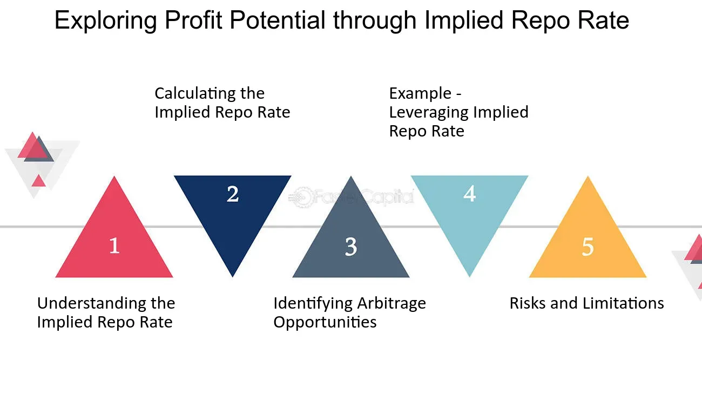

## Table of Contents

## What is the Implied Repo Rate?

The Implied Repo Rate (IRR) is a way to figure out the interest rate that someone would get if they bought a bond and then sold it later, using the bond as a kind of loan. It's like borrowing money using the bond as collateral. This rate is important for traders because it helps them understand how much they could earn from this kind of transaction.

To calculate the IRR, you need to know the price of the bond now and the price of a futures contract for that bond. The difference between these two prices, along with the time until the futures contract expires, helps you find the IRR. It's a useful tool for investors who want to make smart decisions about buying and selling bonds in the futures market.

## How is the Implied Repo Rate calculated?

The Implied Repo Rate (IRR) is calculated by comparing the current price of a bond with the price of a futures contract for that same bond. Imagine you buy a bond today and then agree to sell it later through a futures contract. The difference between what you pay now and what you will get later, along with how long you have to wait, helps you figure out the IRR. It's like finding out the interest rate you would earn if you used the bond as a loan until the futures contract expires.

To do the calculation, you start by finding the difference between the bond's current price and the futures contract price. This difference is called the "/repo cost." Then, you divide this repo cost by the current price of the bond to get a percentage. Finally, you annualize this percentage by dividing it by the fraction of the year until the futures contract expires. This gives you the Implied Repo Rate, which shows the annual [interest rate](/wiki/interest-rate-trading-strategies) you would earn from this kind of transaction.

## What is the difference between Implied Repo Rate and the actual repo rate?

The Implied Repo Rate (IRR) and the actual repo rate are two different ways to figure out how much it costs to borrow money using bonds as collateral. The actual repo rate is the real interest rate that banks and other financial institutions agree on when they lend and borrow money using bonds. It's a direct agreement between the two parties involved in the transaction.

On the other hand, the Implied Repo Rate is a calculated rate that traders use to understand what they might earn if they buy a bond now and sell it later through a futures contract. It's not a real transaction but a theoretical rate based on the difference between the current bond price and the futures contract price. The IRR helps traders make decisions about buying and selling bonds in the futures market, while the actual repo rate reflects the current market conditions for borrowing and lending.

## Why is the Implied Repo Rate important in financial markets?

The Implied Repo Rate (IRR) is important in financial markets because it helps traders figure out how much they could earn by buying a bond now and selling it later through a futures contract. It's like a tool that shows the interest rate they would get if they used the bond as a kind of loan. This information is useful for making smart decisions about trading bonds in the futures market, helping traders know if it's a good time to buy or sell.

Knowing the IRR also helps traders compare different investment options. If the IRR is higher than other interest rates they could get, it might make sense to go for the bond and futures deal. This way, they can see which investments might give them the best return on their money. Overall, the IRR is a key piece of information that helps traders navigate the complex world of financial markets.

## Can you explain the relationship between the Implied Repo Rate and bond pricing?

The Implied Repo Rate (IRR) is closely connected to bond pricing because it helps traders understand the value of a bond in the futures market. When you buy a bond and then sell it through a futures contract, the IRR shows the interest rate you would earn on that transaction. If the IRR is high, it means you could earn more by using the bond as a kind of loan until the futures contract expires. This can make the bond more attractive to traders, which might increase its price in the market.

On the other hand, if the IRR is low, it means the potential earnings from the bond and futures deal are not as good. This might make the bond less appealing to traders, which could lead to a lower bond price. So, the IRR acts like a guide that helps traders decide if a bond is a good investment based on how it might perform in the futures market. By understanding the relationship between the IRR and bond pricing, traders can make better decisions about buying and selling bonds.

## How does the Implied Repo Rate affect investment decisions?

The Implied Repo Rate (IRR) helps investors decide if buying a bond now and selling it later through a futures contract is a good idea. If the IRR is high, it means the investor could earn more money by using the bond as a kind of loan until the futures contract expires. This makes the bond more attractive, and investors might be more willing to buy it. On the other hand, if the IRR is low, the potential earnings are not as good, and the bond might not seem like a great investment.

By looking at the IRR, investors can compare different investment options. If the IRR is higher than other interest rates they could get, it might make sense to go for the bond and futures deal. This way, they can figure out which investments will give them the best return on their money. Overall, the IRR is a useful tool that helps investors make smarter choices about where to put their money in the bond market.

## What factors influence the Implied Repo Rate?

The Implied Repo Rate (IRR) is affected by the difference between the current price of a bond and the price of a futures contract for that bond. If the bond's current price is much lower than the futures price, the IRR will be high because the potential earnings from the deal are good. On the other hand, if the bond's current price is close to the futures price, the IRR will be low because the earnings won't be as good. This difference, known as the repo cost, is a big [factor](/wiki/factor-investing) in figuring out the IRR.

Another factor that influences the IRR is the time until the futures contract expires. If the futures contract is far away, the IRR will be lower because the earnings are spread out over a longer time. But if the futures contract is coming up soon, the IRR will be higher because the earnings are more immediate. So, both the price difference and the time until the futures contract expires play a role in deciding the Implied Repo Rate.

## How do traders use the Implied Repo Rate in arbitrage strategies?

Traders use the Implied Repo Rate (IRR) to find [arbitrage](/wiki/arbitrage) opportunities in the bond and futures markets. Arbitrage is when traders buy and sell the same thing at the same time to make a profit from the price difference. If the IRR is different from the actual repo rate, traders can use this to their advantage. For example, if the IRR is higher than the actual repo rate, a trader might buy a bond, use it as collateral to borrow money at the lower actual repo rate, and then sell the bond through a futures contract at the higher IRR. This way, they can make money from the difference between the two rates.

To do this, traders need to carefully watch the bond and futures markets. They look for times when the IRR and the actual repo rate are not the same. If they spot a big enough difference, they can set up the arbitrage deal. This involves buying the bond, borrowing money using it as collateral, and then selling it through a futures contract. By doing this, traders can take advantage of the price differences to make a profit without taking on much risk. It's like finding a hidden treasure in the market by using the IRR as a guide.

## What are the limitations of using the Implied Repo Rate as a market indicator?

Using the Implied Repo Rate (IRR) as a market indicator has some limitations. One big limitation is that the IRR is based on a theoretical calculation, not a real transaction. It's a guess about what you might earn if you buy a bond now and sell it later through a futures contract. Because it's a guess, it might not always match up with what actually happens in the market. This can make it hard for traders to rely on the IRR alone when making decisions.

Another limitation is that the IRR only looks at one part of the market. It focuses on the difference between the current bond price and the futures contract price, but it doesn't take into account other things that can affect the market, like changes in interest rates, economic news, or other big events. So, while the IRR can be helpful, it's not a complete picture of the market. Traders need to use it along with other information to get a better understanding of what's going on and make smarter investment choices.

## How does the Implied Repo Rate vary across different types of securities?

The Implied Repo Rate (IRR) can vary a lot depending on the type of security you're looking at. For example, government bonds usually have a lower IRR because they are seen as safer investments. People trust that the government will pay them back, so the difference between the bond's current price and the futures price isn't as big. On the other hand, corporate bonds might have a higher IRR because they are riskier. If a company runs into trouble, it might not be able to pay back its bonds, so investors want a bigger reward for taking that risk.

Different securities also have different times until their futures contracts expire, which can change the IRR. If a bond has a futures contract that's coming up soon, the IRR might be higher because the earnings are more immediate. But if the futures contract is far away, the IRR could be lower because the earnings are spread out over a longer time. So, when you're looking at the IRR for different types of securities, you need to think about both the risk of the bond and how long you have to wait for the futures contract to expire.

## What historical trends can be observed in the Implied Repo Rate, and what do they indicate?

Looking back at the history of the Implied Repo Rate (IRR), you can see that it goes up and down over time. During times when the economy is doing well and people feel confident, the IRR tends to be higher. This is because more people want to buy bonds and use them in futures deals, which pushes up the difference between the bond's current price and the futures price. On the other hand, during tough economic times, the IRR often goes down. People are more worried about their money, so they're less likely to take risks with bonds and futures, which makes the IRR lower.

These trends in the IRR can tell us a lot about what's happening in the economy. When the IRR is high, it might mean that people are feeling good about the future and are willing to invest more. This can be a sign that the economy is growing. But when the IRR is low, it might show that people are worried and not as willing to take risks. This can be a warning sign that the economy might be slowing down. By watching the IRR over time, traders and investors can get a better idea of where the economy might be headed and make smarter decisions about their money.

## How can advanced statistical models improve the accuracy of Implied Repo Rate calculations?

Advanced statistical models can help make the Implied Repo Rate (IRR) calculations more accurate by taking into account more factors than just the difference between the bond's current price and the futures price. These models can look at things like how often bond prices change, how much risk is involved with different bonds, and even what's happening in the economy at the time. By using all this extra information, the models can give a more complete picture of what the IRR might be, which helps traders make better guesses about their potential earnings.

These models also use something called "[machine learning](/wiki/machine-learning)" to keep getting better at predicting the IRR. Machine learning means that the model learns from past data and can adjust its predictions over time. For example, if the model sees that the IRR usually goes up when interest rates are low, it can use that information to make more accurate predictions in the future. This way, traders can trust the IRR calculations more and use them to make smarter decisions about buying and selling bonds in the futures market.

## What is Understanding Securities Lending?

Securities lending is a financial transaction allowing investors to earn extra income by temporarily transferring ownership of their securities to borrowers. The borrower utilizes these securities for purposes such as executing short sales or satisfying settlement requirements. The borrower, having acquired the securities, sells them with the intention of repurchasing them at a lower price later on, thus benefiting from the price difference. 

The facilitation of securities lending involves intermediaries such as custodian banks, which play an essential role. These institutions act as [agents](/wiki/agents) by connecting lenders with potential borrowers and ensuring that the transaction proceeds smoothly. They manage the administrative aspects, including the handling of collateral, which serves as a critical component in mitigating the risks associated with borrower default. Collateral, typically in the form of cash or other securities, is required from the borrower and held by the lender as a form of security against the lent securities. This collateral can be recalibrated based on market conditions and the perceived risk of the borrower defaulting, thereby creating a buffer against potential losses.

The securities lending mechanism contributes significantly to market efficiency and liquidity. By making securities available for borrowing, the process ensures that securities are actively utilized rather than lying dormant. This availability facilitates trading activities, thereby enhancing liquidity and allowing for more efficient price discovery. Short sellers, in particular, benefit from securities lending as it enables them to implement their trading strategies.

Overall, securities lending is a pivotal financial activity that supports various market functions. It aids in generating additional income streams for investors, ensures [liquidity](/wiki/liquidity-risk-premium), and promotes the efficient functioning of capital markets through the continual availability of securities for trading.

 to Implied Repo Rate

The implied repo rate is a critical measure in the financial domain, representing the return earned from lending securities while simultaneously entering into a repurchase agreement, commonly known as a repo. This rate essentially reflects the cost associated with borrowing securities, thereby playing a crucial role in determining the profitability of transactions involving securities lending.

Mathematically, the implied repo rate is derived from the price differential between the spot price and the future price of a given security. Specifically, it can be formulated as:

$$
\text{Implied Repo Rate} = \left( \frac{F - S}{S} \right) \times \frac{365}{T}
$$

Where:
- $F$ is the futures price of the security.
- $S$ is the spot (or current) price of the security.
- $T$ is the time in days until the futures contract matures.

The implied repo rate serves as a benchmark for pricing securities lending transactions, providing a transparent metric for negotiating terms between lenders and borrowers. It assesses the cost of borrowing the securities, and thus, any shift in this rate can significantly impact profitability margins for both parties involved. 

Understanding the implied repo rate is vital for borrowers and lenders as it offers insights into current market conditions. A higher implied repo rate suggests greater liquidity tightness or increased demand for borrowing specific securities, whereas a lower rate may imply abundant supply or reduced borrowing demand. Thus, monitoring the implied repo rate helps market participants make informed decisions regarding their securities lending strategies, ensuring optimized positioning within the marketplace.

## References & Further Reading

[1]: ["Securities Lending and Repo: Market Structure, Uses, and Risks"](https://www.newyorkfed.org/medialibrary/media/research/staff_reports/sr740.pdf) by Anderson, R.G., Gascon, C.S., and Liu, Y. from the Federal Reserve Bank of St. Louis.

[2]: Duffie, D. (1996). ["Special Repo Rates."](https://onlinelibrary.wiley.com/doi/abs/10.1111/j.1540-6261.1996.tb02692.x) Journal of Finance, 51(2), 493-526.

[3]: D’Avolio, G. (2002). ["The Market for Borrowing Stock."](https://www.sciencedirect.com/science/article/pii/S0304405X02002064) The Review of Financial Studies, 15(3), 1073-1112.

[4]: ["Algorithmic Trading and DMA: An introduction to direct access trading strategies"](https://archive.org/details/algorithmictradi0000john) by Barry Johnson

[5]: ["The Basics of Algorithmic Trading Strategies"](https://www.investopedia.com/articles/active-trading/101014/basics-algorithmic-trading-concepts-and-examples.asp) by Michael Halls-Moore from QuantStart.