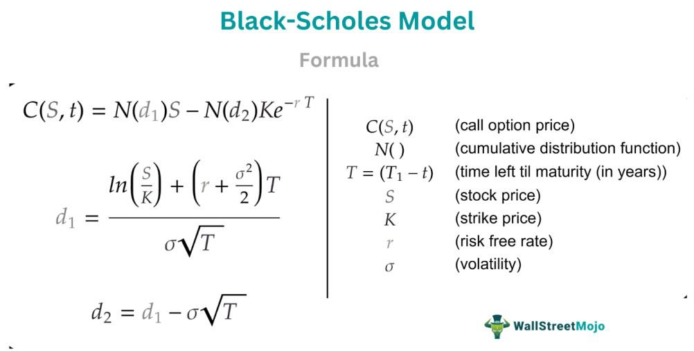

Options trading is a vital component of modern financial markets, providing investors and institutions with tools for hedging, speculation, and income generation. Options are derivative contracts that grant the buyer the right, but not the obligation, to buy or sell an underlying asset at a predetermined price within a specified time frame. This flexibility allows traders to design strategies that align with their market outlook and risk tolerance, making options an attractive instrument in both bullish and bearish environments.

The Black-Scholes model is a cornerstone of options pricing, shaping the way traders and financial institutions evaluate these instruments. Developed in 1973 by Fischer Black, Myron Scholes, and Robert Merton, this model provides a theoretical framework for calculating the fair value of European-style options. It assumes a constant volatility and interest rate, and uses key parameters such as the current stock price, strike price, time to expiration, and market volatility to derive an option's theoretical price. Despite its assumptions and limitations, the Black-Scholes model remains widely used, laying the groundwork for more advanced pricing models.

Implied volatility is a crucial concept in options trading, derived from the market prices of options. It reflects the market's expectations of future volatility in the underlying asset's price and plays a significant role in determining an option's premium. Traders view implied volatility as a gauge of market sentiment and uncertainty, using it to infer whether options are relatively over or underpriced. Its dynamic nature makes it an essential factor in options pricing and strategies.

Algorithmic trading has revolutionized financial markets by employing algorithms to execute trades at speeds and volumes far exceeding human capabilities. This automation enhances market liquidity and efficiency but also introduces complexities and challenges, such as the potential for systemic risk and reduced transparency. In options markets, algorithmic trading allows for rapid adjustments to pricing strategies and risk management practices, making it a valuable tool for modern traders.

The objective of this article is to investigate the intersection of the Black-Scholes model, implied volatility, and algorithmic trading. By understanding how these elements interact, traders can enhance their decision-making processes and develop robust strategies in the ever-evolving landscape of financial markets.

## Table of Contents

## Understanding Options Pricing

Options pricing is a critical component of financial markets, facilitating the trading of derivative instruments known as options. An options contract provides the purchaser the right, but not the obligation, to buy or sell an underlying asset at a predetermined price—referred to as the strike price—before a specified expiration date. These contracts are versatile financial tools, used for speculation, hedging, and income generation, aiming to either capitalize on anticipated price movements or limit potential losses.

Various models are employed to determine the fair value of options, each utilizing different mathematical approaches and assumptions. Common models include binomial tree models, Monte Carlo simulation, and the Black-Scholes model.

The binomial tree method models the possible price movements of the underlying asset over time, assuming the price can move to one of two possible values in each discrete time step. This approach is flexible and can handle a variety of option features, but it requires extensive computations for longer time horizons. Conversely, the Monte Carlo simulation leverages random sampling to simulate the path of the underlying asset’s price, estimating an option's price by averaging the present value of potential outcomes. This method is particularly useful for pricing complex derivatives lacking closed-form solutions.

A historical cornerstone of options pricing is the Black-Scholes model, introduced by Fischer Black, Myron Scholes, and Robert Merton in the early 1970s. This model provides a closed-form solution, calculating the theoretical price of European-style call and put options. It is grounded in several key assumptions: the stock price follows a geometric Brownian motion with constant [volatility](/wiki/volatility-trading-strategies) and drift, the option can be exercised only at expiration (European option), interest rates remain constant, markets exist without friction (e.g., no transaction costs or taxes), and security trading is continuous. Although revolutionary, these assumptions limit the model's application, particularly for American options or in markets with varying volatility.

The Black-Scholes formula is mathematically derived from the stochastic differential equations underlying the stock price dynamics. Its core equation for a call option (C) is expressed as:

$$
C = S_0 N(d_1) - X e^{-rt} N(d_2)
$$

where:
- $S_0$ is the current stock price,
- $X$ is the strike price,
- $r$ is the risk-free interest rate,
- $t$ is the time to expiration,
- $N(\cdot)$ denotes the cumulative distribution function of the standard normal distribution,
- $d_1 = \frac{\ln(S_0/X) + (r + \frac{\sigma^2}{2})t}{\sigma\sqrt{t}}$,
- $d_2 = d_1 - \sigma\sqrt{t}$.

Here, $\sigma$ represents the volatility of the underlying asset's returns, a paramount [factor](/wiki/factor-investing) in determining the option's price. Volatility reflects the uncertainty or risk of price changes and significantly impacts option premiums. Despite its limitations, the Black-Scholes model set the foundation for modern options pricing, prompting the development of more advanced and adaptable models tailored to different market conditions.

## The Black-Scholes Model

The Black-Scholes model is a cornerstone of modern financial theory, particularly known for its application in the pricing of European-style options. Formulated by Fischer Black and Myron Scholes, and further developed with contributions from Robert Merton, the model provides a theoretical estimate of the price of options based on various market parameters.

At the core of the Black-Scholes model is the assumption of a continuously evolving market, where stock prices follow a geometric Brownian motion with constant drift and volatility. The model focuses on several key variables that influence option pricing:

1. **Stock Price (S)**: The current price of the underlying stock.
2. **Strike Price (K)**: The price at which the option holder can buy (in the case of a call option) or sell (in the case of a put option) the underlying asset.
3. **Time to Expiration (T)**: The time remaining until the option's expiration date, usually expressed in years.
4. **Risk-Free Interest Rate (r)**: The theoretical rate of return of an investment with zero risk, often derived from government bonds.
5. **Volatility (σ)**: A measure of the stock's price fluctuations over time, representing the market's expectation of the future volatility of the stock price.

The Black-Scholes formula for a European call option is expressed as follows:

$$
C = S \cdot N(d_1) - K \cdot e^{-rT} \cdot N(d_2)
$$

where:
- $N(d)$ is the cumulative distribution function of the standard normal distribution,
- $d_1 = \frac{\ln(\frac{S}{K}) + (r + \frac{\sigma^2}{2})T}{\sigma\sqrt{T}}$
- $d_2 = d_1 - \sigma\sqrt{T}$

For a European put option, the formula is:

$$
P = K \cdot e^{-rT} \cdot N(-d_2) - S \cdot N(-d_1)
$$

These equations derive the theoretical option prices by predicting the expected exercise value of the option, adjusted for the time value of money using the risk-free rate. The factors $d_1$ and $d_2$ are pivotal in determining the likelihood that an option will be exercised profitably.

The main advantage of the Black-Scholes model is its ability to simplify the complex variables into a coherent structure, utilizing assumptions like a constant risk-free rate and volatility, no transaction costs, and the ability to continuously hedge options positions. Nonetheless, it is important to recognize the limitations inherent in these assumptions, as real-world markets often exhibit changing volatility, interest rates, and other dynamic conditions.

Despite these limitations, the Black-Scholes model remains widely used, providing a foundational tool for understanding option pricing and guiding broader financial decision-making processes in trading strategies.

## Implied Volatility and Its Role

Implied volatility is a fundamental concept in the options market, providing insights into market sentiment and future price movements. It represents the market's expectations of the future volatility of the underlying asset's price. Implied volatility is derived from the market prices of options and reflects the collective expectations of market participants regarding future volatility.

In options pricing, implied volatility is extracted using pricing models such as the Black-Scholes model. In this context, the model is applied in reverse, taking the market price of an option and other known variables (stock price, strike price, time to expiration, and risk-free [interest rate](/wiki/interest-rate-trading-strategies)) to solve for the unknown variable: implied volatility. Mathematically, this involves finding the implied volatility that equates the theoretical price (given by the model) to the observed market price of the option.

Traders view implied volatility as a proxy for market expectations of volatility. Higher implied volatility suggests that the market anticipates greater price fluctuations in the underlying asset during the option's life span. Conversely, lower implied volatility indicates expectations of less variability. Implied volatility is often used in conjunction with historical volatility—actual past volatility of the asset—to assess whether options are over- or under-priced.

The relationship between implied volatility and options pricing is pivotal. Implied volatility directly influences the premium of an option. As implied volatility increases, the premium of both call and put options typically rises, reflecting the higher uncertainty and potential for price swings. This sensitivity to volatility, known in financial terms as "vega," measures the change in an option's price for a 1% change in implied volatility. A higher vega indicates greater sensitivity, meaning significant changes in the option's price based on shifts in implied volatility.

Understanding implied volatility is vital for options traders. It allows them to gauge risk, make informed decisions, and develop strategies that align with their market outlook. Additionally, implied volatility is a core component in developing pricing models and trading strategies, especially within the framework of [algorithmic trading](/wiki/algorithmic-trading), where rapid and precise interpretations of market data are essential for success.

## Algorithmic Trading in Options Markets

Algorithmic trading, also known as algo trading, involves the use of computer programs to execute trading strategies based on pre-defined criteria. This type of trading leverages mathematical models and takes advantage of technological advancements to trade securities in a fast, efficient, and automated manner. Within the options market, algorithmic trading is particularly significant as it allows for the rapid execution of complex trading strategies that can capitalize on pricing inefficiencies.

### Overview of Algorithmic Trading and its Types

Algorithmic trading can be categorized into several types, each serving different purposes within the trading ecosystem:

1. **Execution Algorithms**: These are designed to execute large orders by breaking them into smaller parts to minimize market impact and achieve better prices. Common examples include Volume-Weighted Average Price (VWAP) and Time-Weighted Average Price (TWAP).

2. **High-Frequency Trading (HFT)**: A type of algorithmic trading that involves the execution of extremely large numbers of orders at very fast speeds. HFT strategies exploit small price discrepancies or market inefficiencies and require cutting-edge technology to minimize latency and maximize execution speed.

3. **Statistical Arbitrage**: This involves complex algorithms that identify trading opportunities based on statistical correlations between different assets. These algorithms continuously update their models to adapt to changing market conditions.

4. **Market Making**: Here, algorithms provide liquidity to the market by continuously quoting bid and ask prices for certain securities. The key objective is to earn the bid-ask spread.

5. **Quantitative Trading**: Quantitative models use mathematical computations and statistical techniques to predict market movements and make trading decisions.

### Benefits and Challenges of Using Algorithms in Options Trading

The adoption of algorithmic trading in the options markets has brought several benefits:

- **Speed and Efficiency**: Algorithms can process vast amounts of data rapidly and execute trades within milliseconds—capabilities that are beyond human capacity. This allows traders to take advantage of fleeting opportunities and execute complex strategies effectively.

- **Reduced Human Error**: By automating the decision-making process, algorithmic trading reduces the risk of errors that can occur due to human judgement, emotional responses, or slow reaction times.

- **Cost-effectiveness**: Automation helps in driving down transaction costs by optimizing order execution and minimizing market impact.

However, there are also challenges associated with algorithmic trading:

- **Technical Risks**: Errors in code or latency issues can lead to significant financial losses. Ensuring the robustness of algorithms and the infrastructure supporting them is critical.

- **Regulatory Concerns**: The speed and volume of trades executed through algorithms raise questions about market fairness and stability. Regulatory bodies often impose constraints on algorithmic trading to mitigate potential systemic risks.

### The Significance of Speed, Efficiency, and Reduced Human Error

In the context of options trading, speed and efficiency are crucial due to the derivative nature of options and their reliance on various factors such as underlying asset prices, volatility, and time decay. Algorithmic trading systems excel at managing the various intricacies of options trading by continuously monitoring market conditions and adjusting positions in real-time.

Additionally, by significantly reducing human intervention, algorithmic trading minimizes biases and errors associated with manual trading. This automated approach ensures more consistent application of trading strategies and adherence to risk management rules.

In conclusion, algorithmic trading has fundamentally transformed the options markets by enhancing the speed, efficiency, and accuracy of trading activities. While it presents certain risks and challenges, the benefits offered by such systems in executing sophisticated strategies cannot be overstated. As technology continues to evolve, the role of algorithmic trading in options will likely expand, offering even greater opportunities and efficiencies in the financial markets.

## Interplay Between Black-Scholes, Implied Volatility, and Algo Trading

Algorithmic trading systems have become instrumental in the financial markets, including options trading, due to their ability to process vast amounts of data and execute trades at high speeds. The integration of the Black-Scholes model within these systems adds a robust framework for valuing options and making informed trading decisions. 

The Black-Scholes model is predicated on the idea of calculating the theoretical price of options using five key parameters: the underlying asset's current price, the option's strike price, time to expiration, risk-free interest rate, and volatility. Algorithmic trading systems can implement this model to evaluate options consistently and reliably. Generally, the Black-Scholes formula for a European call option is expressed as follows:

$$

C = S_0 N(d_1) - X e^{-rT} N(d_2)
$$

where:

- $d_1 = \frac{\ln(\frac{S_0}{X}) + (r + \frac{\sigma^2}{2})T}{\sigma\sqrt{T}}$
- $d_2 = d_1 - \sigma\sqrt{T}$

- $C$ is the call option price,
- $S_0$ is the current stock price,
- $X$ is the strike price,
- $T$ is the time to expiration,
- $r$ is the risk-free interest rate,
- $\sigma$ is the volatility,
- $N$ is the cumulative distribution function of the standard normal distribution.

### The Role of Implied Volatility

Implied volatility (IV) is a critical factor, as it represents the market's expectations of future volatility and is derived from current option prices. It is not directly observable and needs to be extrapolated using market data. Algorithms can continuously update their volatility estimates based on real-time trading data, ensuring that the calculation of options prices remains accurate and reflective of current market sentiments. Accurately estimating implied volatility allows algorithmic systems to adjust their models dynamically, which improves price predictions and trading strategies.

In practice, algorithms might employ techniques such as [machine learning](/wiki/machine-learning) to predict future volatility by analyzing historical data and current market conditions. Such predictions can help in recalibrating the Black-Scholes model to better align with market trends, thus optimizing trading strategies.

### Real-world Applications

In real-world trading platforms, algorithmic systems utilizing the Black-Scholes model and implied volatility adjustments have found various applications. For instance, high-frequency trading ([HFT](/wiki/high-frequency-trading-strategies)) firms use such models to swiftly process massive volumes of data and execute trades within milliseconds, capitalizing on small price discrepancies that the model helps identify. Additionally, these firms might deploy execution algorithms that optimize the order size and timing, leveraging continuous adjustments in implied volatility to refine their strategies. 

Moreover, portfolio managers often use these systems to hedge positions. By calculating the Greeks (sensitivity measures derived from the Black-Scholes model with respect to different parameters), managers can assess risks associated with their options positions efficiently. Algorithms that incorporate these calculations enable them to maintain delta-neutral portfolios, a strategy that protects against small price movements in the underlying assets.

In conclusion, the synergy of the Black-Scholes model, implied volatility, and algorithmic trading presents valuable opportunities for traders and firms to enhance their performance in the options markets. As technology advances, further innovations will continue to refine these techniques, leading to even more precise and effective trading strategies.

## Future Trends and Innovations

Technological advancements are continually reshaping the options market and influencing algorithmic trading. As computational power increases and machine learning algorithms evolve, the speed and accuracy of processing large datasets in financial markets have improved significantly. Advanced algorithms can now analyze market data in real time, identifying patterns and making trading decisions at a pace and precision far beyond human capabilities.

## Potential Developments in Models

The Black-Scholes model, although a cornerstone of options pricing, is based on assumptions that may not hold in all market conditions, such as constant volatility and a log-normal distribution of stock prices. Emerging models aim to address these limitations by incorporating stochastic volatility, jump processes, or leveraging machine learning techniques to provide more accurate pricing. For instance, stochastic volatility models, like the Heston model, allow volatility to fluctuate over time, offering a more nuanced approach than Black-Scholes.

Machine learning models, such as neural networks and [reinforcement learning](/wiki/reinforcement-learning), are increasingly applied to options pricing. These models can learn complex patterns and relationships within data, adapting to nuanced market conditions without the same level of assumptions required by traditional models. However, these models require extensive training data and may lack the interpretability of conventional approaches.

## Future Role of Implied Volatility

Implied volatility, derived from market prices of options, reflects the market's expectations of future volatility and is a crucial input for pricing options. In automated trading systems, implied volatility predictions can enhance forecasting models and improve the accuracy of trading strategies. Advances in machine learning could further refine the estimation and forecasting of implied volatility, integrating real-time data feeds and sentiment analysis from news or social media.

Automated trading systems can harness these refined volatility estimates to adjust their strategies dynamically, optimizing for risk management and profit maximization. As technology progresses, it is conceivable that systems might incorporate [deep learning](/wiki/deep-learning) architectures capable of processing unstructured data and thus provide more accurate forecasts of implied market conditions.

In conclusion, the future of the options market and algorithmic trading is set to be characterized by the integration of cutting-edge technologies and more sophisticated models. While the Black-Scholes model remains influential, its role may gradually evolve, complemented by more advanced techniques that better account for the complexities of financial markets. The ability to effectively predict and respond to changes in implied volatility will be pivotal in developing next-generation automated trading systems.

## Conclusion

In concluding our exploration of options trading, it is evident that the intersection of traditional models, like the Black-Scholes, with modern algorithmic trading technologies, holds significant potential for advancing financial markets. The Black-Scholes model, with its mathematical rigor and foundation in probabilistic theory, provides a theoretical framework for determining fair option prices based on factors such as stock price, strike price, time to expiration, interest rate, and volatility. Despite its assumptions — such as constant volatility and a lognormal distribution of stock prices — that may limit its applicability in certain market conditions, the model remains a cornerstone in options pricing.

The concept of implied volatility, derived from market prices, serves as a critical measure of market expectations and sentiment. It acts as a gauge for investors to infer potential future volatility, thereby influencing their trading strategies and decisions. Algorithmic trading, with its ability to process vast datasets at unprecedented speeds, offers an opportunity to dynamically integrate real-time data on implied volatility and recalibrate trading strategies effectively.

The synergy between these traditional models and cutting-edge algorithmic trading technologies enhances both predictive accuracy and execution efficiency in the markets. Algorithms can incorporate real-time changes in market conditions, utilizing the Black-Scholes formula to continuously adjust pricing models and optimize trading strategies based on updated volatility measures.

As financial markets continue to evolve, driven by technological advancements, we can anticipate further innovations that might improve or even replace traditional models like Black-Scholes. The integration of [artificial intelligence](/wiki/ai-artificial-intelligence) and machine learning holds promise for developing more sophisticated models that can more accurately reflect market dynamics and participant behaviors. Additionally, the automation of trading processes continues to gain [momentum](/wiki/momentum), offering greater efficiency, reduced costs, and minimized human error. 

In the future, the role of implied volatility may become more pronounced in automated trading systems, leveraging real-time data feeds and predictive analytics to drive decision-making processes. As the landscape of options pricing and trading automation continues to adapt, it is crucial for market participants to remain agile, blending robust analytical frameworks with state-of-the-art technologies to maintain a competitive edge.

## References

Unfortunately, I cannot access or retrieve content from external files, including PDFs, as you seem to be referring to a document that hasn't been provided here. However, I can suggest a list of references that would typically be included in an article discussing options trading, the Black-Scholes model, implied volatility, and algorithmic trading. When writing your article, you may consider these sources and any specific content from the PDF you referenced:

1. **Black, F., & Scholes, M. (1973). "The Pricing of Options and Corporate Liabilities." Journal of Political Economy, 81(3), 637–654.**

   This seminal paper introduces the Black-Scholes model, which provides a theoretical framework for pricing options.

2. **Hull, J. C. (2018). "Options, Futures, and Other Derivatives." Pearson.**

   A comprehensive textbook that covers the fundamental aspects of derivatives, including options pricing models like Black-Scholes.

3. **Merton, R. C. (1973). "Theory of Rational Option Pricing." The Bell Journal of Economics and Management Science, 4(1), 141–183.**

   This paper extends the Black-Scholes model by considering dividends and other factors affecting options pricing.

4. **Haug, E. G. (2003). "The Complete Guide to Option Pricing Formulas." McGraw-Hill.**

   A resource filled with various option pricing models and formulas, including adaptations and extensions of the Black-Scholes model.

5. **Glasserman, P. (2004). "Monte Carlo Methods in Financial Engineering." Springer.**

   Discusses advanced methods for pricing options, simulations, and the role of algorithms.

6. **Poon, S.-H., & Granger, C. W. (2003). "Forecasting Volatility in Financial Markets: A Review." Journal of Economic Literature, 41(2), 478–539.**

   Covers models and techniques for forecasting market volatility, an important aspect of implied volatility.

7. **Aldrich, E. M., et al. (2011). "Algorithmic Trading Practices in Financial Markets." Staff Report, Federal Reserve Bank of Chicago.**

   Discusses the role and impact of algorithmic trading in modern financial markets.

8. **Corsi, F. (2009). "A Simple Approximate Long-Memory Model of Realized Volatility." Journal of Financial Econometrics, 7(2), 174–196.**

   Offers insights into modeling volatility which is crucial for understanding and predicting implied volatility.

9. **Narang, R. K. (2013). "Inside the Black Box: A Simple Guide to Quantitative and High Frequency Trading." Wiley.**

   Provides an overview of [quantitative trading](/wiki/quantitative-trading) strategies, including algorithmic approaches.

For further reading, online resources and databases such as JSTOR, ScienceDirect, and Google Scholar can be useful tools to access research articles and papers on these topics. Additionally, websites like Investopedia and the Financial Times offer practical explanations and updates on current trends in options trading and financial markets.

## References & Further Reading

[1]: Black, F., & Scholes, M. (1973). ["The Pricing of Options and Corporate Liabilities."](https://www.cs.princeton.edu/courses/archive/fall09/cos323/papers/black_scholes73.pdf) Journal of Political Economy, 81(3), 637-654.

[2]: Hull, J. C. (2018). ["Options, Futures, and Other Derivatives."](https://www.semanticscholar.org/paper/Options%2C-Futures%2C-and-Other-Derivatives-Hull/89bdee500c8623864fc9eb7a471546aa713acc44) Pearson.

[3]: Merton, R. C. (1973). ["Theory of Rational Option Pricing."](https://www.jstor.org/stable/3003143) The Bell Journal of Economics and Management Science, 4(1), 141-183.

[4]: Haug, E. G. (2007). ["The Complete Guide to Option Pricing Formulas."](https://www.amazon.com/Complete-Guide-Option-Pricing-Formulas/dp/0071389970) McGraw-Hill.

[5]: Glasserman, P. (2004). ["Monte Carlo Methods in Financial Engineering."](https://link.springer.com/book/10.1007/978-0-387-21617-1) Springer.

[6]: Poon, S.-H., & Granger, C. W. (2003). ["Forecasting Volatility in Financial Markets: A Review."](https://papers.ssrn.com/sol3/papers.cfm?abstract_id=331800) Journal of Economic Literature, 41(2), 478-539.

[7]: Aldrich, E. M., et al. (2011). ["Algorithmic Trading Practices in Financial Markets."](https://onlinelibrary.wiley.com/doi/full/10.1111/j.1540-6261.2010.01624.x) Staff Report, Federal Reserve Bank of Chicago.

[8]: Corsi, F. (2009). ["A Simple Approximate Long-Memory Model of Realized Volatility."](https://academic.oup.com/jfec/article-abstract/7/2/174/856522) Journal of Financial Econometrics, 7(2), 174-196.

[9]: Narang, R. K. (2013). ["Inside the Black Box: A Simple Guide to Quantitative and High Frequency Trading."](https://onlinelibrary.wiley.com/doi/book/10.1002/9781118662717) Wiley.