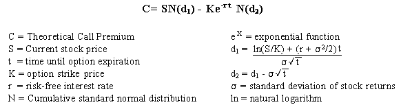

## Table of Contents

## What is implied volatility and how is it different from historical volatility?

Implied volatility is a measure that shows how much the market thinks a stock's price will move in the future. It is calculated using the price of options, which are contracts that give the buyer the right to buy or sell a stock at a certain price. When people think a stock's price will move a lot, the implied volatility goes up, and when they think it will stay steady, it goes down. It's like a guess about how wild the stock's price might get.

Historical volatility, on the other hand, looks at how much a stock's price has actually moved in the past. It is calculated by looking at the stock's price changes over a certain period, like the last 30 days or a year. This measure tells us how much the stock's price has jumped around in the past, but it doesn't tell us anything about what might happen in the future. So, while implied volatility is a prediction, historical volatility is a record of what has already happened.

## How does the Black-Scholes model use implied volatility to price options?

The Black-Scholes model is a math formula that helps figure out how much an option should cost. One of the key pieces of information it uses is implied volatility. When you want to find out the price of an option using this model, you plug in the current stock price, the option's strike price, the time until the option expires, the risk-free interest rate, and the implied volatility. The model then does its calculations and spits out the option's price. The implied volatility is super important because it tells the model how much the stock's price might swing around in the future, which affects how much the option is worth.

If the implied volatility is high, it means people think the stock's price could move a lot, so the option becomes more valuable. That's because there's a bigger chance the option will end up being worth something when it expires. On the other hand, if the implied volatility is low, it means people think the stock's price will stay pretty steady, so the option won't be worth as much. The Black-Scholes model takes all this into account and adjusts the option's price based on the level of implied volatility. This way, the model can give a fair price for the option that reflects what the market thinks might happen with the stock's price.

## What are the key inputs required for the Black-Scholes model?

The Black-Scholes model needs a few pieces of information to figure out how much an option should cost. The first thing it needs is the current price of the stock. This is important because the option's value depends a lot on where the stock price is right now. The model also needs to know the option's strike price, which is the price at which you can buy or sell the stock if you use the option. Another key input is the time until the option expires. The longer the time, the more chance there is for the stock price to move, which can make the option more valuable.

The model also uses the risk-free [interest rate](/wiki/interest-rate-trading-strategies), which is the rate you could earn on a safe investment like a government bond. This helps adjust the option's price for the time value of money. The last and very important input is the implied volatility. This tells the model how much the market thinks the stock's price might swing around in the future. If people think the stock will move a lot, the implied volatility goes up, and the option becomes more valuable. All these pieces of information go into the Black-Scholes model, which then calculates the fair price for the option.

## How can implied volatility be extracted from option prices using the Black-Scholes model?

To find out the implied volatility from option prices using the Black-Scholes model, you start with the current price of the option. You know all the other parts of the Black-Scholes formula, like the stock price, the strike price, the time until the option expires, and the risk-free interest rate. The only thing you don't know is the implied volatility. So, you use a computer to guess different values for the implied volatility until the Black-Scholes model gives you an option price that matches the actual price in the market. This process is called "solving for implied volatility."

When you find the right implied volatility, it tells you what the market thinks about how much the stock's price might move in the future. If the implied volatility is high, it means people think the stock's price could swing a lot, and if it's low, they think it will stay pretty steady. This information is useful for traders and investors because it helps them understand the market's expectations and make better decisions about buying or selling options.

## What is the significance of the volatility smile and how does it relate to the Black-Scholes model?

The volatility smile is a pattern that shows up when you look at the implied volatility of options with different strike prices but the same expiration date. If you plot these implied volatilities on a graph, you often see a curve that looks like a smile. This is interesting because the Black-Scholes model assumes that implied volatility should be the same for all options on the same stock with the same expiration date. But in real life, the volatility smile shows that this isn't true. The smile tells us that the market thinks options with strike prices far away from the current stock price are more likely to move a lot, so they have higher implied volatilities.

This difference between what the Black-Scholes model predicts and what we see in the market is important. It shows that the model doesn't always capture everything about how options are priced in the real world. Traders and investors use the volatility smile to understand market expectations better and to adjust their strategies. For example, they might see that options with very high or very low strike prices are priced with higher implied volatilities, which could mean they expect big moves in the stock price. So, while the Black-Scholes model is a useful tool, the volatility smile helps us see where it might fall short and how we can use that information to make smarter decisions.

## How does implied volatility affect the pricing of call and put options?

Implied volatility is a big deal when it comes to figuring out how much call and put options should cost. For call options, which give you the right to buy a stock at a certain price, higher implied volatility means the option could be worth more. That's because if people think the stock's price might jump around a lot, there's a bigger chance the stock will go above the strike price before the option expires. So, the option becomes more valuable because it has a better shot at being useful. On the other hand, if the implied volatility is low, it means people think the stock's price will stay pretty steady, so the call option won't be worth as much because there's less chance the stock will go above the strike price.

For put options, which give you the right to sell a stock at a certain price, the same idea applies but in reverse. Higher implied volatility makes put options more valuable too, because there's a bigger chance the stock's price will drop a lot and go below the strike price. This makes the put option more likely to be useful. If the implied volatility is low, the put option won't be worth as much because there's less chance the stock's price will fall below the strike price. So, whether it's a call or a put option, implied volatility plays a key role in deciding how much the option is worth by showing how much the market thinks the stock's price might move around.

## What are some common methods to estimate implied volatility in practice?

One common way to estimate implied volatility is by using a computer to solve the Black-Scholes model. You start with the current price of the option and all the other pieces of information you need for the model, like the stock price, the strike price, the time until the option expires, and the risk-free interest rate. The only thing you don't know is the implied volatility. So, you guess different values for it until the model gives you an option price that matches the real price in the market. This process is called "solving for implied volatility." It's like trying different keys until you find the one that unlocks the door.

Another method is to use a tool called a volatility surface. This is a chart that shows how implied volatility changes for different strike prices and expiration dates. Traders look at this chart to see patterns, like the volatility smile, which can help them guess what the implied volatility might be for a specific option. This method is useful because it gives you a bigger picture of how the market thinks about volatility for different options on the same stock. Both of these methods help traders and investors make better guesses about how much the market thinks a stock's price might move in the future, which is important for figuring out how much options should cost.

## How does the accuracy of implied volatility impact the effectiveness of the Black-Scholes model?

The accuracy of implied volatility is super important for how well the Black-Scholes model works. The model uses implied volatility to guess how much the stock's price might move around in the future, which is a big part of figuring out how much an option should cost. If the implied volatility is spot-on, the model will give you a good price for the option that matches what's happening in the market. But if the implied volatility is way off, the model's price won't be right, and you might end up paying too much or too little for the option.

In real life, the market can be tricky, and the implied volatility might not always be perfect. Things like the volatility smile show that the market doesn't always think the same way the Black-Scholes model does. When the implied volatility isn't accurate, it can mess up the model's predictions. Traders and investors need to keep an eye on how well the implied volatility matches the market's expectations, so they can adjust their strategies and make smarter decisions about buying or selling options.

## What are the limitations of using implied volatility in the Black-Scholes model?

One big limitation of using implied volatility in the Black-Scholes model is that it assumes the same volatility for all options on the same stock with the same expiration date. But in real life, the market doesn't always work that way. The volatility smile shows that options with different strike prices can have different implied volatilities. This means the Black-Scholes model might not give you the right price for options that are far away from the current stock price, because it doesn't account for these differences in implied volatility.

Another problem is that implied volatility is just a guess about how much the stock's price might move in the future. It's based on what people think will happen, but it can be wrong. If the market's guess about volatility is off, the Black-Scholes model's price for the option won't be accurate. This can lead to traders and investors making decisions based on prices that don't match what's really going on in the market. So, while implied volatility is a helpful tool, it's important to remember it's not perfect and can sometimes lead the model astray.

## How can traders and investors use implied volatility to make informed decisions?

Traders and investors can use implied volatility to get a better idea of what the market thinks about a stock's future price movements. If implied volatility is high, it means people think the stock's price might jump around a lot. This can be a sign that something big might happen, like a company announcement or a big news event. Traders might see this as a chance to buy options, because if the stock's price does move a lot, the options could become more valuable. On the other hand, if implied volatility is low, it means people think the stock's price will stay pretty steady. This might be a good time to sell options, because there's less chance the stock will move enough to make the options worth a lot.

By looking at implied volatility, traders and investors can also compare different options on the same stock. They can see which options the market thinks are more likely to move a lot, and they can use this information to pick the best options for their strategies. For example, if they see a volatility smile, they might choose options with strike prices far away from the current stock price, because those options have higher implied volatilities and could be more profitable if the stock's price makes a big move. So, implied volatility helps traders and investors make smarter choices by giving them a peek into the market's expectations about how much a stock's price might swing around.

## What advanced techniques can be used to refine implied volatility estimates in complex market conditions?

One way to get better at guessing implied volatility in tricky market situations is by using a tool called a volatility surface. This is like a big chart that shows how implied volatility changes for different strike prices and expiration dates. By looking at this chart, traders can see patterns, like the volatility smile, which can help them make smarter guesses about what the implied volatility might be for a specific option. This method is useful because it gives you a bigger picture of how the market thinks about volatility for different options on the same stock. It's like looking at a map instead of just one spot, so you can see how everything fits together.

Another advanced technique is using computer models that can handle more than just the basic Black-Scholes model. These models can take into account things like how the stock's price might jump around in different ways or how the market might change over time. They use fancy math to make better guesses about implied volatility by looking at more details about the stock and the market. This can be really helpful in complex situations where the market is hard to predict. By using these advanced models, traders and investors can get a more accurate idea of what might happen with the stock's price, which helps them make better decisions about buying or selling options.

## How do alternative models compare to the Black-Scholes model in terms of handling implied volatility?

The Black-Scholes model is a popular way to figure out how much an option should cost, but it has some limits when it comes to dealing with implied volatility. It assumes that the same implied volatility applies to all options on the same stock with the same expiration date. This can be a problem because in real life, the market often thinks differently about options with different strike prices. The volatility smile shows this, where options with strike prices far away from the current stock price have higher implied volatilities. So, the Black-Scholes model might not give you the right price for these options, because it doesn't take these differences into account.

Alternative models, like the Heston model or the SABR model, try to fix these problems by being more flexible with implied volatility. They can handle situations where the stock's price might move in different ways or where the market's expectations about volatility might change over time. These models use more complicated math to make better guesses about implied volatility, which can be really helpful in complex market conditions. By using these alternative models, traders and investors can get a more accurate idea of what the market thinks about the stock's price movements, which helps them make smarter decisions about buying or selling options.

## What is the understanding of options pricing?

Options pricing is a critical component of financial markets, facilitating the trading of derivative instruments known as options. An options contract provides the purchaser the right, but not the obligation, to buy or sell an underlying asset at a predetermined price—referred to as the strike price—before a specified expiration date. These contracts are versatile financial tools, used for speculation, hedging, and income generation, aiming to either capitalize on anticipated price movements or limit potential losses.

Various models are employed to determine the fair value of options, each utilizing different mathematical approaches and assumptions. Common models include binomial tree models, Monte Carlo simulation, and the Black-Scholes model.

The binomial tree method models the possible price movements of the underlying asset over time, assuming the price can move to one of two possible values in each discrete time step. This approach is flexible and can handle a variety of option features, but it requires extensive computations for longer time horizons. Conversely, the Monte Carlo simulation leverages random sampling to simulate the path of the underlying asset’s price, estimating an option's price by averaging the present value of potential outcomes. This method is particularly useful for pricing complex derivatives lacking closed-form solutions.

A historical cornerstone of options pricing is the Black-Scholes model, introduced by Fischer Black, Myron Scholes, and Robert Merton in the early 1970s. This model provides a closed-form solution, calculating the theoretical price of European-style call and put options. It is grounded in several key assumptions: the stock price follows a geometric Brownian motion with constant [volatility](/wiki/volatility-trading-strategies) and drift, the option can be exercised only at expiration (European option), interest rates remain constant, markets exist without friction (e.g., no transaction costs or taxes), and security trading is continuous. Although revolutionary, these assumptions limit the model's application, particularly for American options or in markets with varying volatility.

The Black-Scholes formula is mathematically derived from the stochastic differential equations underlying the stock price dynamics. Its core equation for a call option (C) is expressed as:

$$
C = S_0 N(d_1) - X e^{-rt} N(d_2)
$$

where:
- $S_0$ is the current stock price,
- $X$ is the strike price,
- $r$ is the risk-free interest rate,
- $t$ is the time to expiration,
- $N(\cdot)$ denotes the cumulative distribution function of the standard normal distribution,
- $d_1 = \frac{\ln(S_0/X) + (r + \frac{\sigma^2}{2})t}{\sigma\sqrt{t}}$,
- $d_2 = d_1 - \sigma\sqrt{t}$.

Here, $\sigma$ represents the volatility of the underlying asset's returns, a paramount [factor](/wiki/factor-investing) in determining the option's price. Volatility reflects the uncertainty or risk of price changes and significantly impacts option premiums. Despite its limitations, the Black-Scholes model set the foundation for modern options pricing, prompting the development of more advanced and adaptable models tailored to different market conditions.

## What is the Black-Scholes Model?

The Black-Scholes model is a cornerstone of modern financial theory, particularly known for its application in the pricing of European-style options. Formulated by Fischer Black and Myron Scholes, and further developed with contributions from Robert Merton, the model provides a theoretical estimate of the price of options based on various market parameters.

At the core of the Black-Scholes model is the assumption of a continuously evolving market, where stock prices follow a geometric Brownian motion with constant drift and volatility. The model focuses on several key variables that influence option pricing:

1. **Stock Price (S)**: The current price of the underlying stock.
2. **Strike Price (K)**: The price at which the option holder can buy (in the case of a call option) or sell (in the case of a put option) the underlying asset.
3. **Time to Expiration (T)**: The time remaining until the option's expiration date, usually expressed in years.
4. **Risk-Free Interest Rate (r)**: The theoretical rate of return of an investment with zero risk, often derived from government bonds.
5. **Volatility (σ)**: A measure of the stock's price fluctuations over time, representing the market's expectation of the future volatility of the stock price.

The Black-Scholes formula for a European call option is expressed as follows:

$$
C = S \cdot N(d_1) - K \cdot e^{-rT} \cdot N(d_2)
$$

where:
- $N(d)$ is the cumulative distribution function of the standard normal distribution,
- $d_1 = \frac{\ln(\frac{S}{K}) + (r + \frac{\sigma^2}{2})T}{\sigma\sqrt{T}}$
- $d_2 = d_1 - \sigma\sqrt{T}$

For a European put option, the formula is:

$$
P = K \cdot e^{-rT} \cdot N(-d_2) - S \cdot N(-d_1)
$$

These equations derive the theoretical option prices by predicting the expected exercise value of the option, adjusted for the time value of money using the risk-free rate. The factors $d_1$ and $d_2$ are pivotal in determining the likelihood that an option will be exercised profitably.

The main advantage of the Black-Scholes model is its ability to simplify the complex variables into a coherent structure, utilizing assumptions like a constant risk-free rate and volatility, no transaction costs, and the ability to continuously hedge options positions. Nonetheless, it is important to recognize the limitations inherent in these assumptions, as real-world markets often exhibit changing volatility, interest rates, and other dynamic conditions.

Despite these limitations, the Black-Scholes model remains widely used, providing a foundational tool for understanding option pricing and guiding broader financial decision-making processes in trading strategies.

## What is the interplay between Black-Scholes, implied volatility, and algo trading?

Algorithmic trading systems have become instrumental in the financial markets, including options trading, due to their ability to process vast amounts of data and execute trades at high speeds. The integration of the Black-Scholes model within these systems adds a robust framework for valuing options and making informed trading decisions. 

The Black-Scholes model is predicated on the idea of calculating the theoretical price of options using five key parameters: the underlying asset's current price, the option's strike price, time to expiration, risk-free interest rate, and volatility. Algorithmic trading systems can implement this model to evaluate options consistently and reliably. Generally, the Black-Scholes formula for a European call option is expressed as follows:

$$

C = S_0 N(d_1) - X e^{-rT} N(d_2)
$$

where:

- $d_1 = \frac{\ln(\frac{S_0}{X}) + (r + \frac{\sigma^2}{2})T}{\sigma\sqrt{T}}$
- $d_2 = d_1 - \sigma\sqrt{T}$

- $C$ is the call option price,
- $S_0$ is the current stock price,
- $X$ is the strike price,
- $T$ is the time to expiration,
- $r$ is the risk-free interest rate,
- $\sigma$ is the volatility,
- $N$ is the cumulative distribution function of the standard normal distribution.

### The Role of Implied Volatility

Implied volatility (IV) is a critical factor, as it represents the market's expectations of future volatility and is derived from current option prices. It is not directly observable and needs to be extrapolated using market data. Algorithms can continuously update their volatility estimates based on real-time trading data, ensuring that the calculation of options prices remains accurate and reflective of current market sentiments. Accurately estimating implied volatility allows algorithmic systems to adjust their models dynamically, which improves price predictions and trading strategies.

In practice, algorithms might employ techniques such as [machine learning](/wiki/machine-learning) to predict future volatility by analyzing historical data and current market conditions. Such predictions can help in recalibrating the Black-Scholes model to better align with market trends, thus optimizing trading strategies.

### Real-world Applications

In real-world trading platforms, algorithmic systems utilizing the Black-Scholes model and implied volatility adjustments have found various applications. For instance, high-frequency trading ([HFT](/wiki/high-frequency-trading-strategies)) firms use such models to swiftly process massive volumes of data and execute trades within milliseconds, capitalizing on small price discrepancies that the model helps identify. Additionally, these firms might deploy execution algorithms that optimize the order size and timing, leveraging continuous adjustments in implied volatility to refine their strategies. 

Moreover, portfolio managers often use these systems to hedge positions. By calculating the Greeks (sensitivity measures derived from the Black-Scholes model with respect to different parameters), managers can assess risks associated with their options positions efficiently. Algorithms that incorporate these calculations enable them to maintain delta-neutral portfolios, a strategy that protects against small price movements in the underlying assets.

In conclusion, the synergy of the Black-Scholes model, implied volatility, and [algorithmic trading](/wiki/algorithmic-trading) presents valuable opportunities for traders and firms to enhance their performance in the options markets. As technology advances, further innovations will continue to refine these techniques, leading to even more precise and effective trading strategies.

## References & Further Reading

[1]: Black, F., & Scholes, M. (1973). ["The Pricing of Options and Corporate Liabilities."](https://www.cs.princeton.edu/courses/archive/fall09/cos323/papers/black_scholes73.pdf) Journal of Political Economy, 81(3), 637-654.

[2]: Hull, J. C. (2018). ["Options, Futures, and Other Derivatives."](https://www.semanticscholar.org/paper/Options%2C-Futures%2C-and-Other-Derivatives-Hull/89bdee500c8623864fc9eb7a471546aa713acc44) Pearson.

[3]: Merton, R. C. (1973). ["Theory of Rational Option Pricing."](https://www.jstor.org/stable/3003143) The Bell Journal of Economics and Management Science, 4(1), 141-183.

[4]: Haug, E. G. (2007). ["The Complete Guide to Option Pricing Formulas."](https://www.amazon.com/Complete-Guide-Option-Pricing-Formulas/dp/0071389970) McGraw-Hill.

[5]: Glasserman, P. (2004). ["Monte Carlo Methods in Financial Engineering."](https://link.springer.com/book/10.1007/978-0-387-21617-1) Springer.

[6]: Poon, S.-H., & Granger, C. W. (2003). ["Forecasting Volatility in Financial Markets: A Review."](https://papers.ssrn.com/sol3/papers.cfm?abstract_id=331800) Journal of Economic Literature, 41(2), 478-539.

[7]: Aldrich, E. M., et al. (2011). ["Algorithmic Trading Practices in Financial Markets."](https://onlinelibrary.wiley.com/doi/full/10.1111/j.1540-6261.2010.01624.x) Staff Report, Federal Reserve Bank of Chicago.

[8]: Corsi, F. (2009). ["A Simple Approximate Long-Memory Model of Realized Volatility."](https://academic.oup.com/jfec/article-abstract/7/2/174/856522) Journal of Financial Econometrics, 7(2), 174-196.

[9]: Narang, R. K. (2013). ["Inside the Black Box: A Simple Guide to Quantitative and High Frequency Trading."](https://onlinelibrary.wiley.com/doi/book/10.1002/9781118662717) Wiley.