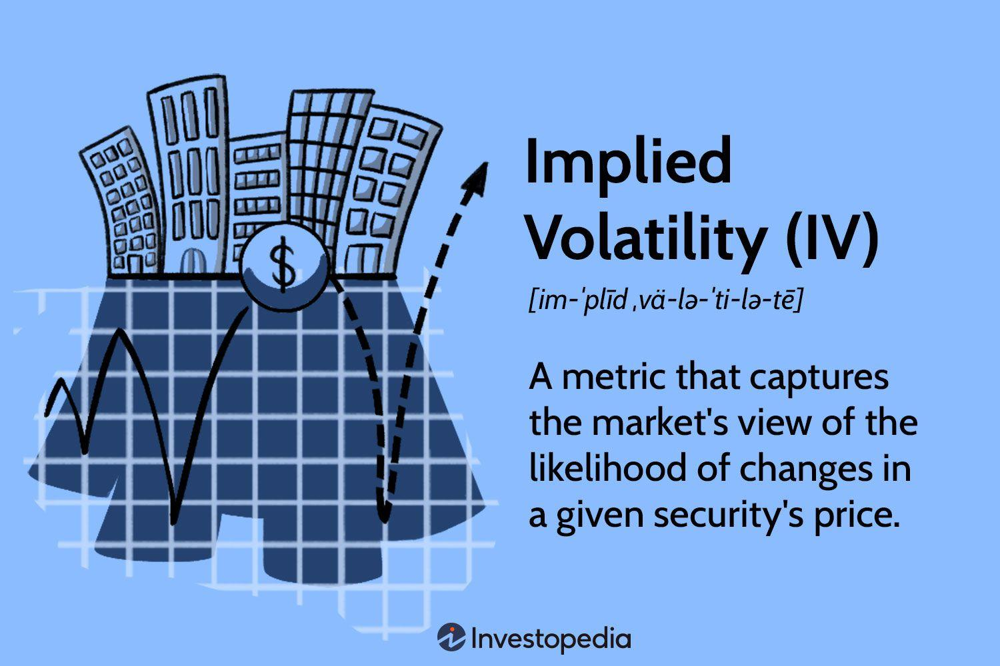

## Table of Contents

## What is implied volatility in finance?

Implied volatility is a term used in finance that shows how much the market thinks a stock's price might change in the future. It's not based on what has happened in the past, but on what people expect might happen. When you buy or sell options, which are contracts that give you the right to buy or sell a stock at a certain price, implied volatility helps you understand how much the price of the option might change.

Think of implied volatility like a weather forecast for a stock's price. If the forecast says there will be a big storm, that's like high implied volatility, meaning the stock price might move a lot. If the forecast says it will be calm, that's like low implied volatility, meaning the stock price might not change much. Traders use this information to decide if an option is a good deal or not.

## How is implied volatility different from historical volatility?

Implied volatility and historical volatility are two different ways to measure how much a stock's price might move. Historical volatility looks at the past. It calculates how much a stock's price has moved up and down over a certain time, like the last month or year. This gives you an idea of how much the stock has changed in the past, but it doesn't tell you what might happen next.

Implied volatility, on the other hand, is all about the future. It's what the market thinks might happen to a stock's price. When people buy and sell options, they're guessing how much the stock's price might change. This guess is what we call implied volatility. It's like a prediction, and it can change every day based on what people think might happen.

So, historical volatility is like looking in the rearview mirror at what has already happened, while implied volatility is like looking through the windshield at what might happen next. Both are useful, but they give you different information to help make decisions about buying or selling stocks and options.

## Why is implied volatility important for option pricing?

Implied volatility is really important for figuring out how much an option should cost. When you buy an option, you're betting on where the stock price might go. Implied volatility tells you how much the market thinks the stock price could move around. If people think the stock price might jump a lot, the implied volatility goes up, and the option becomes more expensive. If they think the stock price will stay pretty steady, the implied volatility goes down, and the option costs less.

Think of implied volatility like a spice in a recipe for option pricing. It's one of the key ingredients, along with the stock's current price, the option's strike price, the time until the option expires, and the risk-free interest rate. Without knowing the implied volatility, it's hard to tell if an option is a good deal or not. Traders use special math formulas, like the Black-Scholes model, to mix all these ingredients together and come up with the right price for an option.

## How is implied volatility calculated?

Implied volatility is figured out by using a math formula called the Black-Scholes model. This formula helps traders find out what the implied volatility should be for an option. They start by knowing the current price of the stock, the option's strike price, the time left until the option expires, and the risk-free interest rate. Then, they use the Black-Scholes model to guess the implied volatility that makes the option's price match what it's actually selling for in the market.

It's a bit like solving a puzzle. Traders plug in all the numbers they know into the Black-Scholes formula and then adjust the implied volatility until the formula's price matches the market price of the option. This process can be done by hand, but most traders use computer programs to do it quickly and accurately. Once they find the right implied volatility, they can use it to help decide if the option is a good buy or not.

## What is the role of the Black-Scholes model in determining implied volatility?

The Black-Scholes model is like a special recipe that helps figure out the price of an option. It uses ingredients like the current stock price, the option's strike price, the time until the option expires, and the risk-free interest rate. But there's one ingredient that's a bit tricky to pin down: implied volatility. This is where the Black-Scholes model becomes really useful. Traders use it to find the implied volatility that makes the option's price match what it's selling for in the market.

Think of it like solving a math problem. Traders know the price of the option from the market, and they plug all the other known numbers into the Black-Scholes formula. Then, they adjust the implied volatility until the formula's price matches the market price. This can be done by hand, but most traders use computers to do it quickly. Once they find the right implied volatility, they can use it to help decide if the option is a good deal or not.

## Can you explain the concept of the volatility smile and its relation to implied volatility?

The volatility smile is a pattern that shows up when you look at implied volatility for options at different strike prices. Imagine you draw a line that connects the implied volatilities for options on the same stock but with different strike prices. Sometimes, this line looks like a smile because the implied volatility is higher for options that are far away from the current stock price, both above and below it. This happens because people think there's a bigger chance of the stock price making a big jump or drop, so they're willing to pay more for those options.

The volatility smile is important because it shows that the market doesn't always think the way the Black-Scholes model does. The Black-Scholes model assumes that implied volatility is the same for all options on the same stock, no matter the strike price. But in real life, the market often thinks differently, and that's why you see the smile shape. Traders look at the volatility smile to understand how the market feels about the stock's future movements and to make better decisions about buying or selling options.

## How does implied volatility affect the pricing of call and put options?

Implied volatility is like a guess about how much a stock's price might move in the future. When this guess is high, it means people think the stock price might jump around a lot. This makes both call and put options more expensive. A call option gives you the right to buy a stock at a certain price, and if people think the stock might go up a lot, they'll pay more for that right. A put option gives you the right to sell a stock at a certain price, and if people think the stock might drop a lot, they'll pay more for that right too.

On the other hand, when implied volatility is low, it means people think the stock price won't move much. This makes both call and put options cheaper. If the stock price is expected to stay steady, there's less reason to pay a lot for the right to buy or sell it at a certain price. So, implied volatility is a big part of what makes options cost what they do, and it's something traders always keep an eye on when they're deciding whether to buy or sell options.

## What are some common tools or platforms used to track implied volatility?

There are several tools and platforms that traders use to keep an eye on implied volatility. One popular tool is the Chicago Board Options Exchange's (CBOE) Volatility Index, often called the VIX. The VIX is like a fear gauge for the stock market, showing how much people expect the market to move over the next 30 days. Traders can find the VIX on financial news websites and trading platforms. Another common tool is option pricing software, like the one provided by Thinkorswim by TD Ameritrade. This software lets traders see the implied volatility for different options and helps them figure out if an option is a good deal.

Other platforms that traders use include Bloomberg Terminal, which is a powerful tool used by professionals to get all sorts of financial data, including implied volatility. For those who don't need such a heavy-duty tool, there are simpler platforms like Yahoo Finance and Google Finance. These websites offer basic information on implied volatility for free, making it easier for everyday investors to keep track of it. By using these tools, traders can make better decisions about buying and selling options based on how much they think the stock price might move.

## How can traders use implied volatility to gauge market sentiment?

Implied volatility is like a thermometer for how nervous or excited the market feels about a stock's future. When implied volatility is high, it means traders think the stock price might jump around a lot. This could be because they're worried about bad news coming out, or maybe they're excited about something good that might happen. Either way, high implied volatility shows that the market is expecting big moves, and that can mean people are feeling pretty nervous or hopeful.

On the other hand, when implied volatility is low, it's like the market is taking a deep breath and relaxing. Traders think the stock price won't move much, so they're not as worried or excited. This can happen when things seem pretty calm and there's no big news expected. By watching implied volatility, traders can get a sense of whether the market is feeling calm or if it's bracing for some big changes.

## What are the limitations and potential pitfalls of relying on implied volatility?

Implied volatility is a useful tool, but it's not perfect. One big problem is that it's just a guess about the future. It's based on what people think might happen, not what will definitely happen. So, if everyone guesses wrong, the implied volatility can be way off. Also, implied volatility can change a lot from day to day. This means that if you're not watching it closely, you might miss big changes that affect your options.

Another issue is that implied volatility doesn't tell you which way the stock price will move, just how much it might move. So, you could have high implied volatility, but the stock could go up or down. This makes it hard to make decisions based on implied volatility alone. Plus, different options on the same stock can have different implied volatilities, which can be confusing. It's important to use implied volatility along with other information to make the best choices.

## How does implied volatility change in response to major economic events or news?

Implied volatility often goes up when big economic events or news come out. This is because these events can make people think that stock prices might move a lot. For example, if there's a surprise announcement from the government about new rules or if a big company reports earnings that are way different from what people expected, traders might get nervous or excited. This nervousness or excitement makes them want to pay more for options, which pushes up the implied volatility.

But, after the news or event happens, implied volatility usually goes back down. Once people know what's going on, they feel less worried about big surprises. If the news turns out to be not as important as they thought, or if the stock price doesn't move as much as they expected, the implied volatility can drop pretty quickly. So, implied volatility can be like a roller coaster, going up when big news is coming and then coming back down once the news is out and people know more.

## What advanced strategies can be employed using implied volatility for options trading?

One advanced strategy that uses implied volatility is called a volatility arbitrage. This is when traders try to make money from the difference between what the market thinks will happen (implied volatility) and what they think will happen. They might buy options if they think the stock price will move more than the market expects, or sell options if they think it will move less. This strategy can be tricky because it's hard to guess the future, but it can be profitable if you're good at it.

Another strategy is called a straddle or strangle. These are ways to bet on big moves in the stock price without knowing which way it will go. In a straddle, you buy both a call and a put option at the same strike price. In a strangle, you buy a call and a put at different strike prices. Both strategies can make money if the stock price moves a lot, and implied volatility helps you decide if it's worth doing. If implied volatility is low, these strategies might be a good bet because the options are cheaper, but you need the stock to move a lot to make money.

A third strategy is using implied volatility to find mispriced options. Traders look at the implied volatility of different options on the same stock and see if some options seem too cheap or too expensive. If they find an option with lower implied volatility than others, they might buy it, thinking it's a good deal. If they find one with higher implied volatility, they might sell it, thinking it's overpriced. This strategy takes a lot of work to find these differences, but it can be a smart way to use implied volatility to your advantage.

## What is Implied Volatility: A Forward-Looking Measure?

Implied volatility (IV) is an essential metric used in options pricing, representing the market's forecast of a security's future volatility and thereby directly impacting the option's price. Unlike historical volatility, which calculates past price movements, IV gives a forward-looking perspective, reflecting the collective sentiments of market participants about future stock price fluctuations.

IV is not observed directly; rather, it is extracted from the market prices of options using options pricing models like the Black-Scholes model. The Black-Scholes model establishes a relationship between an option's market price and several variables, one of which is volatility. By plugging the market price of the option into the model and solving for volatility, we obtain the implied volatility. This process can be conducted using iterative numerical methods, as there is no analytical formula directly giving IV.

The formula used in the Black-Scholes model for pricing a European call option is:

$$
C = S_0N(d_1) - Xe^{-rt}N(d_2)
$$

where:

- $C$ is the call option price
- $S_0$ is the current stock price
- $X$ is the strike price of the option
- $t$ is the time to expiration
- $r$ is the risk-free interest rate
- $N(d)$ is the cumulative distribution function of the standard normal distribution
- $d_1$ and $d_2$ are defined as:

$$
d_1 = \frac{\ln(S_0/X) + (r + \sigma^2 / 2)t}{\sigma \sqrt{t}}
$$
$$
d_2 = d_1 - \sigma \sqrt{t}
$$

In these equations, $\sigma$ represents volatility. By using the observed market price for $C$, the implied volatility $\sigma$ can be iteratively solved, demonstrating the volatility assumption consistent with the given market price.

The significance of IV extends beyond individual options pricing; it serves as a critical tool for assessing market sentiment. When IV is high, it indicates that the market anticipates significant price movements, either up or down, suggesting increased uncertainty. Conversely, low IV implies expectations of relative price stability.

Traders can leverage IV in several ways to make informed trading decisions. For instance, option traders often use IV to gauge whether an option is overvalued or undervalued compared to historical volatility levels. Strategies such as straddles or strangles can be employed when traders expect an increase in volatility, as these strategies benefit from sharp price movements regardless of direction.

Moreover, changes in IV can serve as signals for implementing specific trading strategies. For instance, a sudden spike in IV might suggest an impending event likely to cause market turbulence. Conversely, a neutral or declining IV could favor strategies that benefit from less price movement, such as selling options to capitalize on premium decay.

Overall, implied volatility is a core concept for traders aiming to understand market dynamics and capitalize on opportunities that arise from volatility forecasts. Understanding its derivation, application, and implications provides a substantial advantage in the fast-paced world of options trading.

## What are the differences between implied and implied and historical volatility?

Volatility is a fundamental concept in options trading, instrumental in risk assessment and strategy formulation. Implied and historical volatility are two distinct measures that play crucial roles in evaluating options prices, market conditions, and trading strategies.

Historical volatility refers to the actual volatility observed in the past price movements of a security. It is calculated using the standard deviation of the security’s returns over a specific period. The formula for calculating historical volatility ($HV$) is as follows:

$$

HV = \sqrt{\frac{\sum_{i=1}^{N} (R_i - \bar{R})^2}{N-1}} 
$$

where $R_i$ is the daily return, $\bar{R}$ is the average return over $N$ days, and $N$ is the total number of days considered. Historical volatility provides insights into how volatile a security has been over a particular time frame, helping traders analyze past market behaviors.

In contrast, implied volatility reflects the market's expectations of future price fluctuations, derived from the market price of options. Unlike historical volatility, it is a forward-looking measure and is embedded in options pricing models such as the Black-Scholes model. It represents the market's view on the magnitude of potential price changes for the underlying asset. Traders often use implied volatility to gauge market sentiment and adjust their strategies accordingly.

The appropriateness of each volatility measure depends on the context of the trading strategy. Historical volatility is particularly useful when analyzing the past behavior of a security, aiding traders in understanding the underlying asset's risk profile. It serves as a baseline for comparing how the asset has reacted to past market events. Conversely, implied volatility is more suitable when trying to predict or prepare for future price movements. It informs traders about the level of uncertainty or risk perceived by the market participants.

For a practical comparison, consider a scenario during a significant market announcement, such as an earnings report. Historical volatility can indicate how the stock reacted to previous announcements, while implied volatility can provide insights into market expectations for the forthcoming announcement. If implied volatility is significantly higher than historical volatility, it suggests that the market anticipates higher volatility, perhaps due to expected significant changes in the company's financial outlook.

Case studies of market events illustrate the interplay between these volatility metrics. During the 2008 financial crisis, for instance, there was a marked spike in implied volatility. Despite high historical volatility resulting from previous market turmoil, implied volatility surged as traders expected further instability. This divergence provided a signal to traders regarding heightened future risks.

To implement these concepts in Python, one could use libraries such as NumPy and pandas to calculate historical volatility and plot these metrics against implied volatility data sourced from market APIs or financial data services.

```python
import numpy as np
import pandas as pd

# Sample historical price data (example)
prices = pd.Series([100, 102, 101, 105, 110, 108, 107])

# Calculate daily returns
returns = prices.pct_change().dropna()

# Calculate historical volatility
historical_volatility = np.std(returns) * np.sqrt(252)  # Annualize using a 252 trading day assumption

print(f"Historical Volatility: {historical_volatility:.2%}")
```

Understanding both implied and historical volatility equips traders with comprehensive insights for assessing risk and forming robust trading strategies. Recognizing their differences and applications enhances decisions that align with market dynamics and trading objectives.

## References & Further Reading

[1]: Hull, J. C. (2018). ["Options, Futures, and Other Derivatives"](https://www.semanticscholar.org/paper/Options%2C-Futures%2C-and-Other-Derivatives-Hull/89bdee500c8623864fc9eb7a471546aa713acc44). Pearson Education.

[2]: Black, F., & Scholes, M. (1973). ["The Pricing of Options and Corporate Liabilities."](https://www.cs.princeton.edu/courses/archive/fall09/cos323/papers/black_scholes73.pdf) Journal of Political Economy, 81(3), 637-654.

[3]: Haug, E. G., & Taleb, N. N. (2010). ["Option Traders Use (Very) Sophisticated Heuristics, Never the Black-Scholes-Merton Formula."](https://www.sciencedirect.com/science/article/abs/pii/S0167268110001927) Journal of Economic Behavior & Organization, 77(2), 286-287.

[4]: Gatheral, J. (2006). ["The Volatility Surface: A Practitioner's Guide."](https://github.com/PlamenStilyianov/Quant/blob/master/Gatheral%20J.%20The%20volatility%20surface..%20A%20practitioner%27s%20guide%20(Wiley%2C%202006)(ISBN%200471792519)(210s)_FD_.pdf) Wiley.

[5]: Chan, E. (2008). ["Quantitative Trading: How to Build Your Own Algorithmic Trading Business"](https://github.com/ftvision/quant_trading_echan_book). Wiley Trading.

[6]: Lopez de Prado, M. (2018). ["Advances in Financial Machine Learning"](https://www.amazon.com/Advances-Financial-Machine-Learning-Marcos/dp/1119482089). Wiley.

[7]: Higham, D. J. (2004). ["An Introduction to Financial Option Valuation: Mathematics, Stochastics and Computation"](https://assets.cambridge.org/052192/0825/full_version/0521920825_pub.pdf). Cambridge University Press.