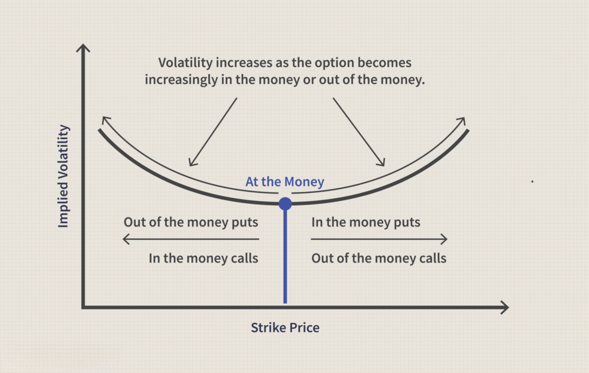

The financial markets present a vast environment, where various tools and strategies are employed to optimize returns and manage risks effectively. Central to these activities are options pricing, financial markets, implied volatility, and algorithmic trading, which serve as crucial components of modern trading practices. Options pricing enables traders to determine the value of options contracts, thus facilitating informed investment decisions. The financial markets provide the arena where these options are traded, influenced by myriad economic indicators and sentiment.

Implied volatility, a forward-looking measure, provides insights into market expectations of future price fluctuations, making it an invaluable metric for assessing risk and potential returns. Unlike historical volatility, implied volatility anticipates future uncertainty, which is essential for traders aiming to adapt their strategies to changing market conditions. Algorithmic trading, meanwhile, employs advanced computer algorithms to execute trades at optimal speeds and efficiencies, thereby enhancing decision-making capabilities in high-frequency trading environments.



Understanding these core concepts is vital for both novice investors seeking entry into the financial markets and seasoned traders aiming to refine their strategies. Mastery of options pricing and its relationship with implied volatility can lead to better risk management and more strategic portfolio construction. Additionally, leveraging algorithmic trading can offer significant competitive advantages by automating complex trading strategies, thereby enhancing the efficacy of trades.

As financial markets evolve with technological advancements and regulatory changes, the integration of these elements becomes increasingly relevant. Both novice and experienced traders must remain vigilant and adaptable, continuously learning and evolving their understanding and application of these concepts. This article will thoroughly explore these integral elements, emphasizing their relevance to modern trading practices, and serve as a guide for navigating the complexities of financial market dynamics.

## Table of Contents

## Basics of Options Pricing and the Black-Scholes Model

Options pricing is a fundamental component of financial markets, crucial for investors seeking to gauge the value of options contracts. At the heart of options pricing lies the Black-Scholes model, a pioneering mathematical framework developed by Fischer Black, Myron Scholes, and Robert Merton in the early 1970s. The Black-Scholes model provides a systematic method for estimating the theoretical price of European options.

### Black-Scholes Formula

The Black-Scholes formula considers several key factors to derive the theoretical price of an option: the current stock price $S$, the option's strike price $K$, the time to expiration $T$ (expressed as a fraction of the year), the risk-free [interest rate](/wiki/interest-rate-trading-strategies) $r$, and the implied [volatility](/wiki/volatility-trading-strategies) $\sigma$ of the stock.

The formula for a European call option (C) is:
$$

C = S N(d_1) - K e^{-rT} N(d_2) 
$$
For a European put option (P), the formula is:
$$

P = K e^{-rT} N(-d_2) - S N(-d_1)
$$
where:
$$
d_1 = \frac{\ln(S/K) + (r + \sigma^2/2)T}{\sigma \sqrt{T}} 
$$
$$
d_2 = d_1 - \sigma \sqrt{T}
$$
and $N(\cdot)$ denotes the cumulative distribution function of the standard normal distribution.

### Key Components

1. **Stock Price (S):** The current price of the underlying stock significantly influences option value. The higher the stock price relative to the strike price, the more valuable a call option becomes, while the opposite is true for a put option.

2. **Strike Price (K):** The predetermined price at which the option can be exercised. The relationship between the current stock price and the strike price is vital in options pricing.

3. **Time to Expiration (T):** The period until the option's expiration. Longer durations increase the potential for stock price movements, thus generally increasing an option's premium due to higher uncertainty.

4. **Risk-Free Interest Rate (r):** The rate of return on a risk-free investment, typically based on government bonds. The interest rate impacts the present value of the strike price.

5. **Implied Volatility ($\sigma$):** Unlike historical volatility, implied volatility reflects market expectations of future stock price fluctuations. It is a forward-looking measure, impacting the premium for both call and put options.

### Limitations of the Black-Scholes Model

Despite its widespread use, the Black-Scholes model has notable limitations. It assumes constant volatility and interest rates over the option's life, which is often unrealistic in dynamic markets. Moreover, the model does not account for market factors such as dividends during the option term, which can affect stock prices. Additionally, it presumes efficient markets and log-normal distribution of stock prices, which may not hold true in all market conditions, particularly during periods of high turbulence or systemic market anomalies.

While the Black-Scholes model revolutionized the field of options pricing by providing a replicable and quantifiable method, its assumptions necessitate a cautious application. Traders often adjust the model or utilize alternative pricing models to address these limitations and improve pricing accuracy in real-world trading scenarios.

## Implied Volatility: A Forward-Looking Measure

Implied volatility (IV) is an essential metric used in options pricing, representing the market's forecast of a security's future volatility and thereby directly impacting the option's price. Unlike historical volatility, which calculates past price movements, IV gives a forward-looking perspective, reflecting the collective sentiments of market participants about future stock price fluctuations.

IV is not observed directly; rather, it is extracted from the market prices of options using options pricing models like the Black-Scholes model. The Black-Scholes model establishes a relationship between an option's market price and several variables, one of which is volatility. By plugging the market price of the option into the model and solving for volatility, we obtain the implied volatility. This process can be conducted using iterative numerical methods, as there is no analytical formula directly giving IV.

The formula used in the Black-Scholes model for pricing a European call option is:

$$
C = S_0N(d_1) - Xe^{-rt}N(d_2)
$$

where:

- $C$ is the call option price
- $S_0$ is the current stock price
- $X$ is the strike price of the option
- $t$ is the time to expiration
- $r$ is the risk-free interest rate
- $N(d)$ is the cumulative distribution function of the standard normal distribution
- $d_1$ and $d_2$ are defined as:

$$
d_1 = \frac{\ln(S_0/X) + (r + \sigma^2 / 2)t}{\sigma \sqrt{t}}
$$
$$
d_2 = d_1 - \sigma \sqrt{t}
$$

In these equations, $\sigma$ represents volatility. By using the observed market price for $C$, the implied volatility $\sigma$ can be iteratively solved, demonstrating the volatility assumption consistent with the given market price.

The significance of IV extends beyond individual options pricing; it serves as a critical tool for assessing market sentiment. When IV is high, it indicates that the market anticipates significant price movements, either up or down, suggesting increased uncertainty. Conversely, low IV implies expectations of relative price stability.

Traders can leverage IV in several ways to make informed trading decisions. For instance, option traders often use IV to gauge whether an option is overvalued or undervalued compared to historical volatility levels. Strategies such as straddles or strangles can be employed when traders expect an increase in volatility, as these strategies benefit from sharp price movements regardless of direction.

Moreover, changes in IV can serve as signals for implementing specific trading strategies. For instance, a sudden spike in IV might suggest an impending event likely to cause market turbulence. Conversely, a neutral or declining IV could favor strategies that benefit from less price movement, such as selling options to capitalize on premium decay.

Overall, implied volatility is a core concept for traders aiming to understand market dynamics and capitalize on opportunities that arise from volatility forecasts. Understanding its derivation, application, and implications provides a substantial advantage in the fast-paced world of options trading.

## Algorithmic Trading: Enhancing Strategy Execution

Algorithmic trading leverages computer programs to execute trades based on predefined criteria. This technology enhances decision-making capabilities by optimizing the speed and accuracy with which trades are conducted. In the fast-paced environment of financial markets, the ability to make split-second decisions is crucial, particularly in options trading where pricing can be volatile and complex. 

The primary benefit of [algorithmic trading](/wiki/algorithmic-trading) lies in its efficiency. Algorithms can process vast amounts of data at speeds far exceeding human capabilities, allowing traders to exploit fleeting opportunities in the markets. By automating the trading process, these algorithms can execute orders at the most favorable prices, minimize transaction costs, and mitigate risks associated with human emotion and error.

Algorithmic trading also offers significant advantages in risk management. Algorithms are designed to adhere strictly to trading strategies, which helps in maintaining discipline and avoiding impulsive decisions that could lead to substantial losses. Furthermore, they can continuously monitor portfolios and market conditions to adjust positions dynamically, ensuring that trading strategies remain aligned with predefined risk parameters.

Key strategies in algorithmic trading for options markets include dynamic hedging and volatility [arbitrage](/wiki/arbitrage). Dynamic hedging involves using algorithms to adjust a portfolio's hedge continuously as market conditions change. This real-time adjustment helps in maintaining a desired risk profile, protecting against adverse price movements. 

Volatility arbitrage is another sophisticated strategy that algorithmic trading excels at. This involves taking advantage of discrepancies between implied and actual volatility. Traders might, for instance, write options that are overpriced due to high implied volatility while simultaneously buying the underlying asset to offset potential losses. Algorithms facilitate these complex positions by quickly identifying profitable arbitrage opportunities and executing them at precise timings.

Real-world applications of algorithmic trading in managing complex options strategies are abundant. For example, hedge funds and proprietary trading firms employ high-frequency trading ([HFT](/wiki/high-frequency-trading-strategies)) strategies that rely on speed and advanced algorithms to capitalize on minute price discrepancies across different markets. These strategies require a combination of deep market understanding, sophisticated algorithms, and cutting-edge technological infrastructure.

In Python, implementing a simple algorithmic strategy might involve using libraries such as pandas for data manipulation and NumPy for numerical computations. For example, a basic moving average crossover strategy—though simplistic compared to professional trading algorithms—can be executed to showcase how systematic trading decisions occur:

```python
import pandas as pd

# Load historical options pricing data
data = pd.read_csv('options_data.csv')

# Calculate moving averages
data['short_ma'] = data['price'].rolling(window=5).mean()
data['long_ma'] = data['price'].rolling(window=20).mean()

# Define buy/sell signals
data['signal'] = 0
data.loc[data['short_ma'] > data['long_ma'], 'signal'] = 1  # buy
data.loc[data['short_ma'] < data['long_ma'], 'signal'] = -1 # sell

# Execute trades based on signals
data['position'] = data['signal'].shift()
data['returns'] = data['price'].pct_change() * data['position']
```

This basic framework forms the foundation for more complex strategies that incorporate real-time data, [machine learning](/wiki/machine-learning) models, and advanced statistical techniques.

As the financial markets continue to evolve with technology, algorithmic trading's role in options markets is set to grow. Its ability to enhance speed, efficiency, and precision in executing trading strategies remains invaluable, promising even more sophisticated solutions as computational capabilities advance.

## Comparing Implied and Historical Volatility

Volatility is a fundamental concept in options trading, instrumental in risk assessment and strategy formulation. Implied and historical volatility are two distinct measures that play crucial roles in evaluating options prices, market conditions, and trading strategies.

Historical volatility refers to the actual volatility observed in the past price movements of a security. It is calculated using the standard deviation of the security’s returns over a specific period. The formula for calculating historical volatility ($HV$) is as follows:

$$

HV = \sqrt{\frac{\sum_{i=1}^{N} (R_i - \bar{R})^2}{N-1}} 
$$

where $R_i$ is the daily return, $\bar{R}$ is the average return over $N$ days, and $N$ is the total number of days considered. Historical volatility provides insights into how volatile a security has been over a particular time frame, helping traders analyze past market behaviors.

In contrast, implied volatility reflects the market's expectations of future price fluctuations, derived from the market price of options. Unlike historical volatility, it is a forward-looking measure and is embedded in options pricing models such as the Black-Scholes model. It represents the market's view on the magnitude of potential price changes for the underlying asset. Traders often use implied volatility to gauge market sentiment and adjust their strategies accordingly.

The appropriateness of each volatility measure depends on the context of the trading strategy. Historical volatility is particularly useful when analyzing the past behavior of a security, aiding traders in understanding the underlying asset's risk profile. It serves as a baseline for comparing how the asset has reacted to past market events. Conversely, implied volatility is more suitable when trying to predict or prepare for future price movements. It informs traders about the level of uncertainty or risk perceived by the market participants.

For a practical comparison, consider a scenario during a significant market announcement, such as an earnings report. Historical volatility can indicate how the stock reacted to previous announcements, while implied volatility can provide insights into market expectations for the forthcoming announcement. If implied volatility is significantly higher than historical volatility, it suggests that the market anticipates higher volatility, perhaps due to expected significant changes in the company's financial outlook.

Case studies of market events illustrate the interplay between these volatility metrics. During the 2008 financial crisis, for instance, there was a marked spike in implied volatility. Despite high historical volatility resulting from previous market turmoil, implied volatility surged as traders expected further instability. This divergence provided a signal to traders regarding heightened future risks.

To implement these concepts in Python, one could use libraries such as NumPy and pandas to calculate historical volatility and plot these metrics against implied volatility data sourced from market APIs or financial data services.

```python
import numpy as np
import pandas as pd

# Sample historical price data (example)
prices = pd.Series([100, 102, 101, 105, 110, 108, 107])

# Calculate daily returns
returns = prices.pct_change().dropna()

# Calculate historical volatility
historical_volatility = np.std(returns) * np.sqrt(252)  # Annualize using a 252 trading day assumption

print(f"Historical Volatility: {historical_volatility:.2%}")
```

Understanding both implied and historical volatility equips traders with comprehensive insights for assessing risk and forming robust trading strategies. Recognizing their differences and applications enhances decisions that align with market dynamics and trading objectives.

## Risk Management in Options Trading

Effective risk management is essential in options trading, given the complex nature of options contracts and the dynamic market environment. Key strategies such as diversification, position sizing, and the use of stop-loss orders form the bedrock of an effective risk management plan. Diversification involves spreading investments across various assets or options to minimize exposure to any single market movement. This approach reduces the impact of adverse price shifts in one option by balancing them with other, potentially better-performing investments.

Position sizing is another critical strategy, determining the amount of capital allocated to a particular option trade. By carefully calculating position sizes, traders can control their risk exposure, ensuring that a single market movement does not unduly affect their entire portfolio. Position sizing often involves using the Kelly Criterion or other techniques to decide on optimal bet sizes based on assessed risk and portfolio diversification.

Stop-loss orders are automated trades that sell an option once its price reaches a predetermined level, thus preventing further losses. This tool is essential in maintaining a disciplined trading approach by limiting potential downsides before they escalate into more significant losses.

Volatility, often a focal point in options trading, requires specific strategies for effective risk management. Volatility trading strategies are employed, such as buying options in anticipation of higher volatility or selling them when expecting lower volatility. The CBOE Volatility Index (VIX) serves as a barometer of market expectations for future volatility. By observing VIX levels, traders can infer potential market volatility trends, enabling them to adjust their strategies accordingly.

Algorithmic solutions provide enhanced risk management capabilities in options trading by utilizing computational power to execute complex strategies with precision and speed. Algorithms can assess market conditions, volatility levels, and real-time data feeds to make informed trading decisions. For example, algorithms can implement delta-hedging strategies, automatically adjusting the position of options to maintain a delta-neutral stance, thus mitigating the risks associated with directional market movements.

Python code can be employed to illustrate basic algorithmic risk management strategies. Consider the following pseudocode for implementing a simple volatility-based adjustment strategy:

```python
import numpy as np

# Define basic parameters
portfolio_size = 100000  # Portfolio size in dollars
vix_threshold_high = 20   # High volatility threshold
vix_threshold_low = 15    # Low volatility threshold
current_vix = np.random.uniform(10, 30)  # Random current VIX value for simulation

# Adjust position based on VIX levels
if current_vix > vix_threshold_high:
    position_size = portfolio_size * 0.5  # Reduce exposure in high volatility
elif current_vix < vix_threshold_low:
    position_size = portfolio_size * 1.5  # Increase exposure in low volatility
else:
    position_size = portfolio_size  # Maintain standard exposure

print(f"Position size based on current VIX ({current_vix}): ${position_size}")
```

In this example, the position size is adjusted based on current VIX values, reducing exposure during periods of high volatility and increasing it during low volatility. This adjustment aids in maintaining an optimal risk-reward balance.

In summary, effective risk management in options trading encompasses a combination of strategic diversification, precise position sizing, and the utilization of advanced tools like stop-loss orders. Furthermore, understanding and accounting for volatility through indices like the VIX, paired with algorithmic frameworks, allows traders to manage risks dynamically and responsively in evolving market conditions.

## Algorithmic Trading Platforms and Tools

Algorithmic trading has become indispensable in executing sophisticated and high-frequency trading strategies. It leverages computational power to process extensive data sets and complex calculations. To successfully implement algorithmic trading strategies, traders rely on robust platforms and tools. 

Several popular trading platforms and application programming interfaces (APIs) facilitate algorithmic options trading. Notable among them are MetaTrader 4 and 5, which offer extensive customization options through scripting languages. These platforms support automated trading strategies and provide real-time data feeds, technical indicators, and analytical tools. Thinkorswim by TD Ameritrade is another example that provides a robust API, enabling traders to develop and deploy complex trading algorithms using the thinkScript programming language.

In evaluating these platforms, certain key features stand out. Real-time data feeds are essential, as they allow traders to receive up-to-the-moment information necessary for making accurate trading decisions. Platforms with [backtesting](/wiki/backtesting) capabilities enable users to simulate trading algorithms against historical data. This feature is crucial for assessing the potential effectiveness of a strategy before deploying it in live markets. Integration with broker platforms ensures that execution is seamless, allowing trades to be placed quickly and efficiently.

Emerging technologies are further enhancing the capabilities of algorithmic trading platforms. Cloud computing and machine learning technologies are making it possible to process larger datasets more effectively. Cloud-based platforms offer scalability and flexibility, as traders can access their tools and data from anywhere. Machine learning models are being integrated into trading algorithms to identify patterns and optimize decision-making processes. Natural language processing (NLP) is another innovation that helps analyze news and social media sentiment to influence trading strategies.

In Python, platforms like Alpaca provide APIs that are particularly convenient for algorithmic traders. They allow easy access to data and execution services. A simple Python code snippet to connect to Alpaca’s API and fetch historical data might look like this:

```python
import alpaca_trade_api as tradeapi

# Set up API connection
api = tradeapi.REST('APCA-API-KEY-ID', 'APCA-API-SECRET-KEY', base_url='https://paper-api.alpaca.markets')

# Get historical data for a stock
barset = api.get_barset('AAPL', 'day', limit=30)
apple_bars = barset['AAPL']

# Print the closing prices
for bar in apple_bars:
    print(bar.c)
```

This code establishes a connection with Alpaca’s trading API and retrieves the last 30 days of daily bar data for Apple Inc. (AAPL), showcasing how straightforward algorithmic trading processes can be with modern tools. 

The landscape of algorithmic trading is rapidly evolving. As technology advances, traders must stay abreast of developments to leverage these tools effectively, ensuring optimal performance in dynamic markets.

## Conclusion and Future Prospects

The integration of options pricing models, implied volatility assessment, and algorithmic trading strategies holds considerable promise in financial markets, providing traders with powerful tools for optimizing returns and managing risks. As technology advances, the sophistication and efficacy of these trading solutions are poised to enhance market efficiency further.

Algorithmic trading is expected to continue its rapid expansion, driven by advancements in machine learning, big data analysis, and cloud computing. These technologies allow for more precise modeling and faster computation, enabling traders to execute complex strategies with greater accuracy and timing precision. In particular, the use of AI and machine learning models can refine predictions about market behavior, improving the adaptability of trading algorithms to volatile conditions.

Regulatory impacts must also be considered. As algorithmic trading becomes more prevalent, the need for regulatory bodies to ensure market stability and fairness increases. This could involve stricter oversight on algorithmic strategies that significantly impact market movements, possibly necessitating new frameworks for transparency and accountability.

Technological advancements are likely to lead to the development of more sophisticated trading platforms. These platforms may offer enhanced features such as real-time analytics, improved backtesting capabilities, and seamless integration with global exchanges and financial data providers. The ability to process and analyze larger datasets in real-time will undoubtedly be a critical [factor](/wiki/factor-investing) in gaining a competitive edge.

A key aspect of sustained success in trading will be the continuous learning and adaptation of traders and institutions. As markets and technologies evolve, being proactive in terms of education and strategy refinement will be crucial. Advanced programming skills, a strong grasp of statistical models, and the ability to interpret market signals will become increasingly valuable. 

The future of options markets and algorithmic trading hints at greater interconnectedness, with traders leveraging comprehensive models to navigate and capitalize on market dynamics. As these trends unfold, the importance of staying informed and adaptable will be paramount in pursuing profitable outcomes.

## References & Further Reading

[1]: Hull, J. C. (2018). ["Options, Futures, and Other Derivatives"](https://www.semanticscholar.org/paper/Options%2C-Futures%2C-and-Other-Derivatives-Hull/89bdee500c8623864fc9eb7a471546aa713acc44). Pearson Education.

[2]: Black, F., & Scholes, M. (1973). ["The Pricing of Options and Corporate Liabilities."](https://www.cs.princeton.edu/courses/archive/fall09/cos323/papers/black_scholes73.pdf) Journal of Political Economy, 81(3), 637-654.

[3]: Haug, E. G., & Taleb, N. N. (2010). ["Option Traders Use (Very) Sophisticated Heuristics, Never the Black-Scholes-Merton Formula."](https://www.sciencedirect.com/science/article/abs/pii/S0167268110001927) Journal of Economic Behavior & Organization, 77(2), 286-287.

[4]: Gatheral, J. (2006). ["The Volatility Surface: A Practitioner's Guide."](https://github.com/PlamenStilyianov/Quant/blob/master/Gatheral%20J.%20The%20volatility%20surface..%20A%20practitioner%27s%20guide%20(Wiley%2C%202006)(ISBN%200471792519)(210s)_FD_.pdf) Wiley.

[5]: Chan, E. (2008). ["Quantitative Trading: How to Build Your Own Algorithmic Trading Business"](https://github.com/ftvision/quant_trading_echan_book). Wiley Trading.

[6]: Lopez de Prado, M. (2018). ["Advances in Financial Machine Learning"](https://www.amazon.com/Advances-Financial-Machine-Learning-Marcos/dp/1119482089). Wiley.

[7]: Higham, D. J. (2004). ["An Introduction to Financial Option Valuation: Mathematics, Stochastics and Computation"](https://assets.cambridge.org/052192/0825/full_version/0521920825_pub.pdf). Cambridge University Press.