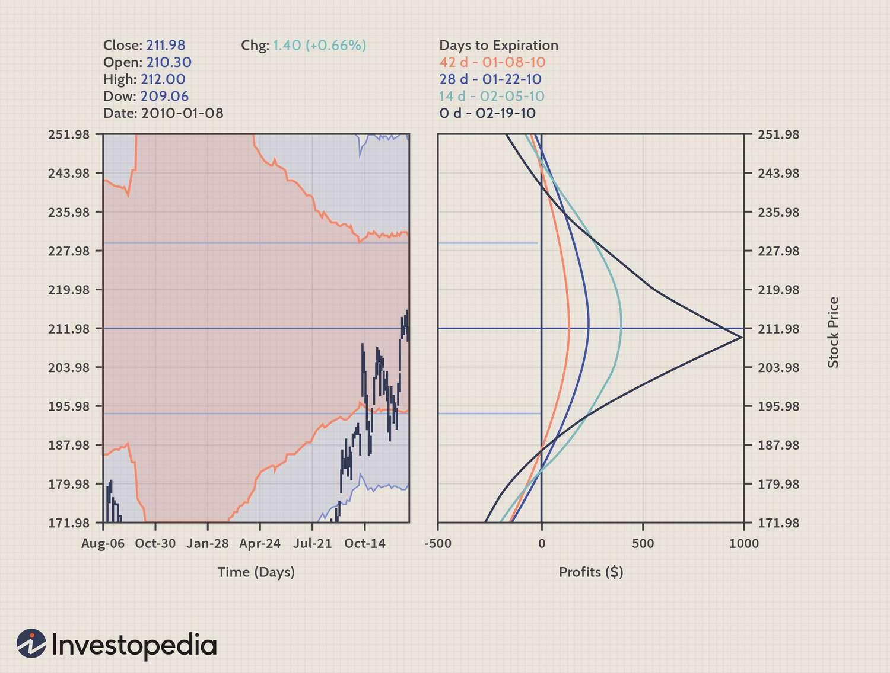

The world of options trading is rich with strategies designed to provide traders with a competitive advantage. Among these sophisticated strategies, the calendar spread stands out due to its unique approach to capitalizing on implied volatility. This strategy involves buying and selling options of the same class, typically calls or puts, with the same strike price but different expiration dates. The calendar spread hinges on the concept of time decay and changes in implied volatility, which can offer traders the potential for profit even when the underlying asset's price remains stable.

Implied volatility plays a dynamic role in this strategy. It represents the market's expectations of future price fluctuations, influencing the pricing of options. In a calendar spread, traders navigate these expectations to derive value, anticipating how market sentiment shifts over time. High implied volatility can enhance the value of longer-dated options, while lower volatility can benefit those with nearer expiration.



Algorithmic trading introduces precision and data-driven insights into executing calendar spreads. Algorithms can automate decision-making processes, ensuring trades are executed based on predefined criteria. This approach minimizes emotional bias and maximizes efficiency, qualities highly valued by professional traders. By leveraging historical data analysis and volatility forecasting, algorithms can identify optimal entry and exit points, boosting the strategy's overall success.

In exploring the elements of calendar spreads, implied volatility, and algorithmic trading, we can appreciate how these components interconnect to create unique trading opportunities. Understanding these elements enables traders to devise robust strategies that harness the complexities of the market, potentially yielding notable rewards.

## Table of Contents

## Understanding Calendar Spreads

A calendar spread involves the simultaneous purchase and sale of options contracts of the same class—either all call options or all put options—with the same strike price but different expiration dates. This strategy leverages the effects of time decay and implied volatility to potentially generate profit. Typically, traders engage in a calendar spread by selling a short-term option and purchasing a longer-term option. The rationale here is that the short option's value decays more rapidly as it approaches expiration, a concept known as theta decay. 

The profitability of a calendar spread hinges on the characteristic that options lose value as they approach maturity, and this time decay is more pronounced for shorter-term options. The difference in time decay rates between the short and long options can provide an opportunity to generate a profit, assuming the underlying asset's price remains relatively stable.

Implied [volatility](/wiki/volatility-trading-strategies) also plays a critical role in the success of this strategy. A change in implied volatility can disproportionately affect the options involved, potentially increasing the value of options with more time to expiration while having a lesser effect on the nearer-term options. By capitalizing on these variations, traders can maximize their gains or mitigate potential losses associated with the spread. 

In mathematical terms, the value of an option can be expressed using the Black-Scholes formula, which incorporates time to expiration (T), implied volatility (σ), and other factors. The accelerated time decay of the short option, combined with potential volatility shifts, creates an environment where traders can benefit even if the asset price remains stable, effectively exploiting the nuanced pricing dynamics of options with different maturities.

## Role of Implied Volatility in Calendar Spreads

Implied volatility is a vital component in the pricing of options as it represents the market's expectations for future volatility of the underlying asset. In the context of calendar spreads, implied volatility plays a significant role in determining the potential profitability and risk of the strategy.

A calendar spread involves holding a long position in an option with a longer expiration date and a short position in an option with a nearer expiration date, both having the same strike price. Implied volatility affects each leg of the spread differently. When implied volatility is high, it raises the premium of the longer-term option, potentially increasing the spread's value as the long position stands to gain more. Conversely, low implied volatility benefits the short option because it accelerates time decay, resulting in a quicker erosion of its premium.

Traders often initiate calendar spreads when they anticipate that implied volatility will rise. This positioning allows them to capitalize on the increased value of the long option while maintaining some protection offered by the short option. However, accurate assessment and prediction of implied volatility changes are crucial. A rise in implied volatility can lead to a profitable scenario if the long option appreciates more than anticipated, while a decline can diminish potential returns or even result in a loss.

To quantify the effect of implied volatility, the Vega measure is often used, indicating how much an option's price changes with a 1% change in implied volatility. In Python, calculating an option's price sensitivity to volatility changes can be illustrated with the following code snippet, assuming the use of a library like NumPy and SciPy for option Greeks computation:

```python
import numpy as np
from scipy.stats import norm

def calculate_vega(S, K, T, r, sigma, option_type='call'):
    """Calculate Vega of an option."""
    d1 = (np.log(S / K) + (r + 0.5 * sigma**2) * T) / (sigma * np.sqrt(T))
    vega = S * norm.pdf(d1) * np.sqrt(T)
    return vega

# Example parameters
S = 100  # Underlying price
K = 100  # Strike price
T = 0.5  # Time to maturity (in years)
r = 0.05  # Risk-free interest rate
sigma = 0.2  # Implied volatility

vega = calculate_vega(S, K, T, r, sigma)
print(f"Vega: {vega:.2f}")
```

This code provides a basic approach to estimating how changes in implied volatility would impact an option's price and, consequently, the calendar spread strategy. Traders can enhance their strategies by updating their models with real-time data, using advanced [machine learning](/wiki/machine-learning) techniques to predict volatility shifts, and understanding market sentiment that drives these changes. Accurately assessing implied volatility is a crucial skill for transforming average trades into profitable ones in calendar spread strategies.

## Algorithmic Trading Strategies for Calendar Spreads

Algorithmic trading has transformed the landscape of options trading, enabling the automation and optimization of complex strategies, such as calendar spreads. This technological advancement facilitates traders in executing trades with enhanced precision and efficiency.

Algorithms can utilize historical data analysis and volatility forecasting to detect mispricing in options. By analyzing patterns in past data, they identify periods when volatility is mispriced, offering unique opportunities to initiate calendar spreads. The reliance on mathematical and statistical models allows traders to anticipate market movements with a higher degree of accuracy. For example, such algorithms might analyze historical implied volatility using a rolling window approach, calculating moving averages or standard deviations to provide insights into the likelihood of future volatility increases or decreases.

```python
import numpy as np
import pandas as pd

def calculate_moving_volatility(data, window_size):
    """Calculate rolling volatility (standard deviation) based on historical price data."""
    return data['Price'].rolling(window=window_size).std()

# Sample usage
data = pd.DataFrame({'Price': [28, 29, 30, 32, 31, 30, 29, 34, 33, 32]})
volatility_rolling = calculate_moving_volatility(data, window_size=5)
print(volatility_rolling)
```

This Python function shows how historical price data can be processed to calculate rolling volatility. Such calculations aid in estimating future volatility, which is crucial in deciding entry points for calendar spreads.

Executing trades based on predefined criteria is another significant advantage of [algorithmic trading](/wiki/algorithmic-trading). Algorithms are programmed with specific entry and [exit](/wiki/exit-strategy) rules, ensuring that trades occur only when the conditions are favorable. This eliminates human errors and cognitive biases that can influence decision-making under stress or uncertainty.

Furthermore, algorithmic trading allows for back-testing strategies, a vital component in aligning trading strategies with historical data trends. Back-testing involves running an algorithm on past data to determine how it would have performed, thus validating the strategy before deploying it in live trading environments. This process helps traders refine their strategies and improve their predictive capabilities. A simple back-test can be implemented in Python as follows:

```python
def backtest_calendar_spread_strategy(data, buy_criteria, sell_criteria):
    """Simple backtest for a calendar spread strategy based on buy and sell criteria."""
    trades = []
    position = None

    for i in range(1, len(data)):
        if buy_criteria(data.iloc[i]):
            position = ('buy', data.iloc[i]['Date'], data.iloc[i]['Price'])
        elif sell_criteria(data.iloc[i]):
            if position and position[0] == 'buy':
                trades.append(('sell', data.iloc[i]['Date'], data.iloc[i]['Price'], position[1], position[2]))
                position = None

    return trades

# Example criteria functions
def example_buy_criteria(row):
    return row['Price'] < 30  # Buy if price is below 30

def example_sell_criteria(row):
    return row['Price'] > 35  # Sell if price rises above 35

# Running the back-test
trades = backtest_calendar_spread_strategy(data, example_buy_criteria, example_sell_criteria)
print(trades)
```

In this script, hypothetical buy and sell criteria guide the execution of trades based on past price levels. Through back-testing, traders gain insights into the potential profitability and risk associated with their strategies.

In conclusion, algorithmic trading strategies for calendar spreads offer considerable advantages by enhancing precision and efficiency. Analyzing historical data, making accurate volatility forecasts, and executing trades based on rigorous quantitative criteria can significantly improve trading outcomes. However, traders must continually adapt their algorithms to changing market conditions to maintain their competitive edge.

## Benefits and Risks of Using Algorithms in Calendar Spread Trading

Using algorithms in calendar spread trading provides several benefits that enhance the overall trading process. One notable advantage is the ability to perform back-testing. By simulating trades over historical data, algorithms allow traders to evaluate the potential performance of calendar spread strategies before risking actual capital. This process ensures that strategies are refined based on empirical evidence, potentially improving success rates.

Efficiency is another key benefit of algorithmic trading. Algorithms can process complex data sets and execute trades at speeds far beyond human capabilities. This swift execution is critical in volatile markets where price movements can occur in fractions of a second. An algorithm can quickly assess the market conditions and execute trades according to predefined criteria, reducing the lag between decision-making and trade execution.

Moreover, algorithms help in minimizing emotional influences on trading decisions. Human traders are often susceptible to cognitive biases and emotional reactions, which can impact their decision-making process. By automating trades, algorithms adhere strictly to a strategic framework, eliminating impulsive actions driven by fear or greed. This discipline ensures consistency and adherence to strategy, aligning closely with the trader's objectives.

Automating entry and exit points in calendar spread trades is another practical application of algorithmic trading. Traders can set specific criteria for entering or exiting a position, such as certain price levels or changes in implied volatility. By doing so, algorithms can maximize gains by seizing advantageous market conditions and minimize losses by executing predefined stop-loss orders. This systematic approach enhances risk management and optimizes portfolio performance.

However, algorithmic trading is not without its risks. Algorithms are inherently limited by their programming parameters. They can only react to situations for which they have been explicitly coded. Consequently, unexpected market conditions or black swan events may lead to suboptimal decisions or losses if the algorithm is not equipped to handle such anomalies. Thus, regular updates and adjustments to the algorithms are essential to ensure they remain relevant to current market dynamics.

Market conditions can also evolve more rapidly than an algorithm’s programmed responses. This limitation underscores the importance of continuous monitoring and adjustment to align with the ever-changing market landscape. Traders must remain vigilant and ready to intervene if an algorithmic strategy deviates from expected performance.

Lastly, even though algorithms can enhance trading precision, robust risk management practices are crucial. This includes setting appropriate position sizes, employing stop-loss and take-profit levels, and diversifying strategies to mitigate potential adverse impacts. While algorithms offer a sophisticated tool for executing calendar spreads, human oversight remains indispensable to ensure strategic alignment and successful risk management.

## Case Study: Navigating Profits with Calendar Spreads

In this case study, we examine a trader employing a long calendar spread strategy utilizing options with February and April expiration dates. The trader leverages algorithmic tools to optimize entry points by analyzing historical volatility patterns. This data-driven approach enables precise timing for initiating the trade.

Initially, the trader sets up the calendar spread by selling a call option with a February expiration while purchasing a call option with the same strike price but with an April expiration. The strategy banks on the premise that the option nearing expiration (February) will experience accelerated time decay, reducing its value more quickly than the longer-dated (April) option. This differential in time decay is a critical [factor](/wiki/factor-investing) in the potential profitability of the calendar spread.

An unexpected increase in implied volatility works to the trader's advantage in this scenario. Typically, an increase in implied volatility raises the price of options. However, since the April call option—held long—has more time until expiration, it is more sensitive to changes in implied volatility than the February call. Consequently, the value of the long April option rises significantly, providing the trader with an opportunity for profit.

The mathematical relationship governing the sensitivity of an option's price to changes in implied volatility is captured by the vega of the option. Vega is higher for options with more time left to expiration, which explains why the longer-dated option benefits more from the increase in implied volatility. 

The successful execution of this trade relies heavily on accurate timing and precise volatility assessment. Here, the trader's utilization of algorithmic inputs to analyze historical volatility patterns plays a pivotal role. By interpreting shifts in market conditions and identifying optimal entry points, the algorithm maximizes the potential for profit under shifting volatility levels.

The outcome of this case study highlights the effectiveness of combining algorithmic trading strategies with a deep understanding of market dynamics. This technological integration aids traders in navigating complex options strategies such as calendar spreads, ultimately increasing the likelihood of profitable outcomes.

## Conclusion

Calendar spread trading is a sophisticated options strategy that effectively utilizes the principles of implied volatility and time decay. By purchasing and selling options with the same strike price but different expiration dates, traders benefit from the differing rates of time decay, known as theta, between options. This strategy can generate profits when the underlying asset's price remains relatively stable or when implied volatility increases.

Incorporating algorithmic trading into calendar spreads significantly enhances the precision and efficiency of these trades. Algorithms enable traders to automate processes, back-test strategies, and optimize trade execution by using predefined criteria. This computational advantage allows for the analysis of vast amounts of historical data, assisting in the identification of mispricings and in making informed decisions based on volatility forecasts.

A deep understanding of implied volatility, which reflects anticipated movements in a security's price, is essential to executing successful calendar spreads. Accurately predicting changes in implied volatility positions traders to capitalize on options pricing dynamics, thus providing a significant competitive edge. Implied volatility's impact on the premium of options cannot be overstated, as it directly influences the potential profit or loss in trading strategies.

Despite the precision afforded by algorithmic trading, a solid foundational knowledge of options and implied volatility remains critical. Algorithms, though effective, operate within the limits of their programming and require constant updates to adapt to changing market conditions. Risk management practices are necessary to mitigate unforeseen market shifts that could affect the performance of algorithm-driven trades.

For traders who engage with this complex strategy, the rewards can justify the effort and knowledge required. By marrying technical analysis with computational power, calendar spreads offer a compelling opportunity for those who seek to maximize their trading potential through a well-informed approach to options trading.

## References & Further Reading

[1]: Hull, J. C. (2017). ["Options, Futures, and Other Derivatives"](https://www.semanticscholar.org/paper/Options%2C-Futures%2C-and-Other-Derivatives-Hull/89bdee500c8623864fc9eb7a471546aa713acc44). Pearson.

[2]: De Prado, M. L. (2018). ["Advances in Financial Machine Learning"](https://www.amazon.com/Advances-Financial-Machine-Learning-Marcos/dp/1119482089). Wiley.

[3]: Natenberg, S. (1994). ["Option Volatility and Pricing: Advanced Trading Strategies and Techniques"](https://www.amazon.com/Option-Volatility-Pricing-Strategies-Techniques/dp/0071818774). McGraw-Hill.

[4]: Black, F., & Scholes, M. (1973). ["The Pricing of Options and Corporate Liabilities."](https://www.cs.princeton.edu/courses/archive/fall09/cos323/papers/black_scholes73.pdf) Journal of Political Economy, 81(3), 637-654.

[5]: Chan, E. P. (2009). ["Quantitative Trading: How to Build Your Own Algorithmic Trading Business"](https://github.com/ftvision/quant_trading_echan_book). Wiley.

[6]: Jansen, S. (2020). ["Machine Learning for Algorithmic Trading - Second Edition"](https://www.amazon.com/Machine-Learning-Algorithmic-Trading-alternative-ebook/dp/B08D9SP6MB). Packt Publishing.