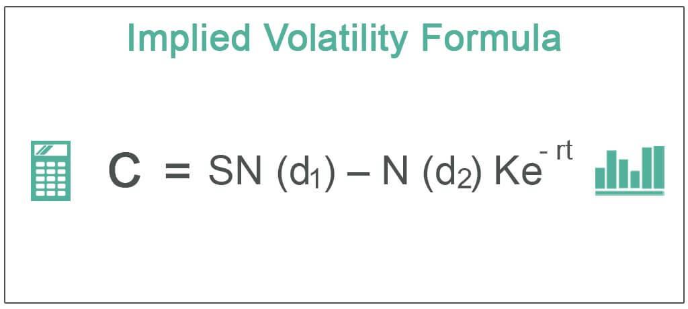

Understanding financial derivatives is essential for anyone looking to navigate modern financial markets effectively. One of the most prominent types of financial derivatives is options. Options trading represents a pivotal component in financial markets, providing instruments that managers, traders, and individual investors use to hedge risks and speculate on future price movements. Options are contracts that provide the buyer the right, but not the obligation, to buy or sell an underlying asset at a predetermined price within a specified time frame. This characteristic offers both strategic flexibility and risk management opportunities. 

A fundamental concept within options trading is implied volatility, a metric used to measure market expectations regarding the future volatility of an asset's price. Unlike historical volatility, which looks at past price variations, implied volatility provides a forward-looking view. It is derived from the market price of an option and indicates how volatile market participants expect the asset to be in the future. High implied volatility typically leads to pricier options premiums, reflecting greater market uncertainty or heightened potential for price swings. Consequently, traders leverage this metric to inform their strategies and manage risk.

In recent years, algorithmic trading has revolutionized options trading by employing advanced, data-driven strategies to capitalize on market inefficiencies. Algorithmic trading utilizes complex algorithms to automatically execute trades at extremely high speeds, often incorporating real-time data analysis and machine learning techniques. This approach enhances the precision and efficiency of trade execution, offering significant advantages in terms of liquidity and market efficiency. However, it also introduces challenges, such as heightened market volatility and increased regulatory scrutiny.

This article explores the relationships among options trading, implied volatility, and algorithmic trading, providing insights into how these elements collectively influence financial markets. With technologies advancing rapidly, understanding these interactions is vital for traders aiming to maintain a competitive edge in today's dynamic market environment.

## Table of Contents

## Understanding Financial Derivatives and Options Trading

Financial derivatives, such as options, serve crucial functions in financial markets, offering tools for both hedging and speculative purposes, particularly in environments characterized by price volatility. Options are a category of derivatives that provide holders with the right, though not the obligation, to buy or sell an underlying asset at an agreed-upon price, known as the strike price, within a specified time frame. This right to buy is encapsulated in a call option, while the right to sell is represented by a put option.

The pricing of options is central to their effective use in trading, as it determines the cost and potential profitability of these contracts. One of the foundational models used for option pricing is the Black-Scholes model, developed by Fisher Black, Myron Scholes, and Robert Merton. This model calculates the theoretical price of European call and put options based on several factors, including the current price of the underlying asset ($S$), the option's strike price ($K$), the time to expiration ($T$), the risk-free [interest rate](/wiki/interest-rate-trading-strategies) ($r$), and the volatility of the underlying asset ($\sigma$).

The Black-Scholes formula for a call option ($C$) is represented as:

$$
C = S N(d_1) - K e^{-rT} N(d_2)
$$

Where:
$$
d_1 = \frac{\ln(S/K) + (r + \sigma^2/2)T}{\sigma \sqrt{T}}
$$
$$
d_2 = d_1 - \sigma \sqrt{T}
$$

And $N(d)$ denotes the cumulative distribution function of the standard normal distribution.

Effective options trading requires an understanding of several key factors that influence pricing. These factors include intrinsic value, time value, and [volatility](/wiki/volatility-trading-strategies). The intrinsic value is the difference between the underlying asset's price and the strike price for in-the-money options. Time value represents the additional premium that traders are willing to pay for the chance that an option might become profitable before its expiration date. Finally, volatility is a measure of the expected price fluctuation of the underlying asset, and it significantly impacts the option's premium. Higher anticipated volatility usually results in higher option prices due to the increased probability of substantial price movements before expiration. Understanding these elements is vital for traders to make informed decisions in options trading strategies.

## The Role of Implied Volatility in Options Trading

Implied volatility serves as a critical indicator in the domain of options trading, as it encapsulates the market's expectations regarding future price volatility. It influences the premiums of options, and its dynamic nature renders it a key variable in the valuation and strategic deployment of options. Unlike historical volatility, which examines the variability of a financial asset's price based on past data, implied volatility provides insights into anticipated future movements. This forward-looking aspect makes it indispensable for traders seeking to formulate risk management strategies or to speculate on future price directions.

The link between implied volatility and options premiums can be understood through the lens of option pricing models, such as the Black-Scholes model. In its core equation:

$$
C = S_0 N(d_1) - X e^{-rt} N(d_2)
$$

where:
- $C$ is the call option price,
- $S_0$ is the current stock price,
- $X$ is the strike price,
- $r$ is the risk-free interest rate,
- $t$ is the time to expiration,
- $N$ denotes the cumulative distribution function of the standard normal distribution,
- and $d_1$ and $d_2$ are derived variables that incorporate volatility.

Increased implied volatility results in higher option premiums due to the heightened uncertainty associated with the asset's future price movements. This effectively makes options costlier as the market forecasts more significant swings in the underlying asset price.

Traders leverage implied volatility as a barometer of market sentiment. High implied volatility may indicate market unrest or upcoming news that could cause substantial price changes, while low implied volatility suggests stability and lower expected price fluctuations. Consequently, options traders prioritize implied volatility when formulating strategies, aiming to profit from predicted changes in market conditions or to hedge positions to minimize risk.

Given its predictive nature, implied volatility assists investors in assessing the attractiveness of options contracts. By identifying periods of potentially increased volatility, traders can make informed decisions about timing and strategy—whether to capitalize on expected market movements or to protect against adverse scenarios. Thus, proficiency in interpreting implied volatility [statistics](/wiki/bayesian-statistics) and incorporating them into trading strategies is crucial for risk management and speculative endeavors within options markets. 

Traders and investors frequently utilize tools like volatility indices (e.g., the VIX for the S&P 500) to monitor and predict movements in implied volatility, further refining their strategies to align with market conditions. Understanding these dynamics is pivotal for harnessing implied volatility as a means to optimize trading outcomes.

## Algorithmic Trading and Its Influence on Options Markets

Algorithmic trading refers to the use of sophisticated computer algorithms to automate trade execution, leveraging high-speed processing capabilities to capitalize on market inefficiencies. This approach has profoundly impacted options markets, where the combination of automation and vast data processing offers substantial advantages.

In the context of options markets, [algorithmic trading](/wiki/algorithmic-trading) encompasses the analysis and execution of trades based on large data sets. Algorithms are designed to interpret complex market indicators and rapidly respond to changing conditions. Implied volatility (IV), which indicates market expectations of future price fluctuations, is a critical input for algorithmic strategies. By analyzing IV, algorithms can optimize trading decisions to achieve favorable outcomes. For example, when implied volatility is high, options premiums increase, prompting algorithms to adjust strategies accordingly.

The automation aspect of algorithmic trading confers several benefits, such as enhanced [liquidity](/wiki/liquidity-risk-premium), providing a steady flow of buy and sell orders that help maintain market balance. High-frequency trading, a subset of algorithmic trading, is particularly effective in improving market efficiency by narrowing bid-ask spreads. Moreover, automated systems improve execution precision, reducing the likelihood of human error and enabling traders to capture fleeting market opportunities.

However, algorithmic trading introduces challenges that can affect the stability of financial markets. One major concern is increased market volatility; fast-paced trading can amplify price swings during periods of market stress. Additionally, the reliance on algorithms has attracted regulatory scrutiny, as authorities aim to mitigate the risks of systemic disruptions, such as those seen during the "flash crashes." Regulators may impose restrictions or require more stringent risk management practices to ensure that automated trading does not compromise market integrity.

Furthermore, the complexity of developing effective algorithmic trading models necessitates significant expertise in quantitative finance and computer science. Traders and firms engaging in algorithmic trading often rely on [machine learning](/wiki/machine-learning) techniques to enhance predictive accuracy and adapt to evolving market conditions. This continuous development and refinement of algorithms are critical to maintaining a competitive edge in the options markets.

## Strategic Integration: Implied Volatility and Algorithmic Trading

Algorithmic trading strategies have increasingly integrated implied volatility metrics to predict market movements and optimize trading performance. These strategies often utilize models that assess the difference between implied volatility—the market's expectation of future price fluctuations—and actual historical price movements, with the aim of identifying and exploiting inefficiencies.

One prominent strategy is volatility [arbitrage](/wiki/arbitrage), which seeks to take advantage of the discrepancy between an option's implied volatility and the anticipated volatility. Traders employing this strategy may simultaneously buy and sell different options or other financial instruments to profit from this variance. For example, if implied volatility is significantly higher than historical volatility, a trader might short an option, expecting the option's price to decrease as implied volatility converges closer to historical levels.

The use of machine learning has significantly advanced the predictive capabilities of these algorithmic strategies. Machine learning models can process vast amounts of historical and real-time data to forecast implied volatility with greater precision. Techniques such as supervised learning, including regression models and neural networks, are employed to identify patterns and correlations that may not be discernible through traditional analysis. For instance, a machine learning algorithm may analyze historical price data, trading volumes, and other relevant financial indicators to predict future implied volatility, assisting traders in making more informed decisions.

Moreover, these algorithms are equipped to rapidly analyze and process market data, providing traders with a competitive edge in executing trades efficiently. This rapid analysis is crucial in options trading, where market conditions can change swiftly, making timely decision-making essential for achieving profitability. The use of algorithms allows for the swift execution of complex trading strategies tailored to capitalize on predicted market movements, further enhancing the efficiency and profitability of options trading.

Overall, the integration of implied volatility metrics with algorithmic trading not only improves the accuracy of market predictions but also enhances the operational efficiency of options trading, enabling traders to better navigate market complexities and capitalize on emerging opportunities.

## Real-World Applications and Case Studies

Prominent hedge funds, such as Renaissance Technologies and Two Sigma, have long been at the forefront of utilizing algorithmic strategies that incorporate implied volatility to navigate complex financial markets. These firms leverage sophisticated quantitative models and machine learning algorithms to identify patterns and inefficiencies in market movements, particularly during periods of heightened volatility, such as those experienced during the COVID-19 pandemic.

During the COVID-19 pandemic, financial markets experienced unprecedented volatility, driven by uncertainty in global economies and rapid shifts in investor sentiment. This environment required hedge funds to adapt quickly, utilizing advanced volatility models to forecast market movements and respond effectively. Renaissance Technologies, known for its Medallion Fund's impressive returns, capitalized on these volatile conditions by employing algorithms that analyzed massive datasets in real-time. These algorithms took advantage of discrepancies between implied and historical volatility, allowing the fund to manage risk and optimize trading opportunities with precision.

Two Sigma, another leader in quantitative finance, further exemplifies the strategic use of implied volatility to gain competitive advantages. The firm employs predictive analytics and machine learning to assess market signals, adjusting its strategies dynamically based on volatility metrics. By continuously refining its models to incorporate new data, Two Sigma efficiently managed its portfolio, capturing value from rapid price distortions while maintaining a robust risk management framework.

The case studies of these firms highlight the critical role of robust volatility models and algorithmic strategies in navigating market crises. The success of Renaissance Technologies and Two Sigma during volatile periods is attributed to their ability to integrate implied volatility into their trading algorithms, thus enhancing decision-making processes and achieving superior returns.

In real-world applications, the importance of implied volatility is further underscored by its use in volatility arbitrage strategies. These strategies seek to exploit the differences between the implied and realized volatility of an asset. By systematically identifying and acting on these discrepancies, funds can generate alpha while mitigating exposure to unforeseen market shifts.

In summary, the strategic incorporation of implied volatility in algorithmic trading frameworks by leading hedge funds has demonstrated significant advantages in times of market turmoil. The capacity to anticipate and respond to volatility with agility has become a defining characteristic of successful trading operations, enabling firms to navigate complexities and capitalize on emerging opportunities.

## Future Trends and Developments in Options Trading

The landscape of options trading is poised for significant transformation driven by advancements in [artificial intelligence](/wiki/ai-artificial-intelligence) (AI) and machine learning (ML). These technologies are enhancing the predictive capabilities of financial models, allowing traders to develop more sophisticated strategies. A primary focus is on innovations in predictive analytics, which aim to construct more accurate models of implied volatility, a critical [factor](/wiki/factor-investing) in pricing options.

Implied volatility, a measure of the market's expectations of future price fluctuations, plays a pivotal role in the valuation of options. As AI and ML technologies advance, they enable the development of models that improve the forecasting accuracy of implied volatility. Machine learning algorithms can process large volumes of market data efficiently, identifying patterns that might not be apparent through traditional methods. This enables traders to better anticipate market movements and adjust their strategies accordingly.

The evolving regulatory environment also plays a crucial role in shaping the future of options trading. Regulatory bodies continually update frameworks to balance the rapid pace of innovation with the necessity for market stability and integrity. For instance, regulations may focus on transparency, risk management practices, and ensuring fair access to markets. Traders and financial institutions need to remain vigilant in understanding and adapting to these regulatory changes to ensure compliance and mitigate risks.

Traders are required to stay informed about technological advancements and regulatory updates. By doing so, they can harness new tools and techniques while adhering to guidelines that ensure market stability. This proactive approach allows traders to maintain a competitive edge, optimizing their strategies to leverage the benefits offered by AI and ML.

In summary, the future of options trading will be intricately linked to the technological advancements in AI and ML, coupled with a dynamic regulatory landscape. The successful trader will be one who effectively integrates these technological innovations into their trading strategies while navigating the complexities of regulatory compliance. Continued adaptation and strategic planning will be vital in sustaining a competitive position in the ever-evolving financial markets.

## Conclusion

Options trading, which is significantly influenced by implied volatility and algorithmic strategies, plays an essential role in contemporary financial markets. The incorporation of complex algorithms has enabled traders to execute high-frequency trades, capitalize on minute market inefficiencies, and adapt swiftly to market changes. This necessitates a profound understanding of financial derivatives and their underlying metrics, like implied volatility, which provides insights into potential future market movements. 

To optimize trading strategies, traders need to integrate a comprehensive understanding of derivatives, incorporating both historical data and forward-looking measures such as implied volatility. Leveraging algorithmic innovations can optimize decision-making processes, enhancing both speed and precision in trade executions.

A crucial element of maintaining a competitive edge lies in the continuous adaptation to both technological advancements and regulatory developments. As financial markets become increasingly sophisticated, staying informed about new tools, methodologies, and compliance requirements is essential. This ensures that traders not only capitalize on emerging opportunities but also mitigate associated risks. 

The intersection of technology and finance is rapidly evolving, promising to redefine the landscape of options trading. The future trajectory will likely be shaped by advancements in artificial intelligence and machine learning, offering enhanced predictive capabilities for market dynamics. Consequently, traders who skillfully navigate this intersection will be well-positioned to harness the benefits of these technological innovations, ensuring sustained success in the competitive arena of options trading.

## References & Further Reading

1. **Hull, J. C. (2018). "Options, Futures, and Other Derivatives."** This foundational text provides a comprehensive overview of financial derivatives, including in-depth explanations of options pricing models like Black-Scholes and their applications in managing risk.

2. **Black, F., & Scholes, M. (1973). "The Pricing of Options and Corporate Liabilities." Journal of Political Economy.** This seminal paper introduces the Black-Scholes model, a critical framework for options pricing and a fundamental component of quantitative finance.

3. **Heston, S. L. (1993). "A Closed-Form Solution for Options with Stochastic Volatility with Applications to Bond and Currency Options." The Review of Financial Studies.** This paper extends traditional options pricing models by incorporating stochastic volatility, providing a richer context for analyzing implied volatility.

4. **Cheng, I-H., & Madhavan, A. (2009). "The Dynamics of Leveraged and Inverse Exchange-Traded Funds." Journal of Investment Management.** This study discusses the impacts of leverage in exchange-traded funds, providing insights into volatility management and the role of algorithmic trading in options markets.

5. **Cartea, Á., Jaimungal, S., & Penalva, J. (2015). "Algorithmic and High-Frequency Trading."** This book offers a technical exploration of algorithmic trading principles, covering strategies that integrate implied volatility metrics to optimize trading performance.

6. **Avellaneda, M., & Lee, J. (2010). "Statistical Arbitrage in the U.S. Equities Market." Quantitative Finance.** The authors explore statistical arbitrage, a strategy closely linked to algorithmic trading, illustrating its application within the context of volatile market conditions.

7. **Bishop, C. M. (2006). "Pattern Recognition and Machine Learning."** This text is instrumental for understanding machine learning algorithms and their applications in predictive analytics, crucial for enhancing options trading strategies through improved volatility forecasting.

8. **Iosifidis, G., & Menchelli, R. (2011). "Volatility Forecasting with Financial Time Series Data: A Review." International Journal of Statistics and Economics.** This review examines various methodologies for forecasting volatility, emphasizing the integration of machine learning techniques in predictive model enhancements.

9. **U.S. Securities and Exchange Commission (SEC). "Regulatory Framework for Algorithmic Trading."** The SEC provides an overview of the legal and regulatory considerations in algorithmic trading, crucial for understanding the evolving compliance landscape in financial markets.

10. **Narayan, P. K., & Zheng, X. (2010). "Out-of-sample Evidence on the Economic Efficiency of Algorithmic Trading Strategies." Journal of Banking & Finance.** This article evaluates the efficiency of algorithmic trading strategies, offering empirical evidence to support the use of data-driven approaches in financial markets.