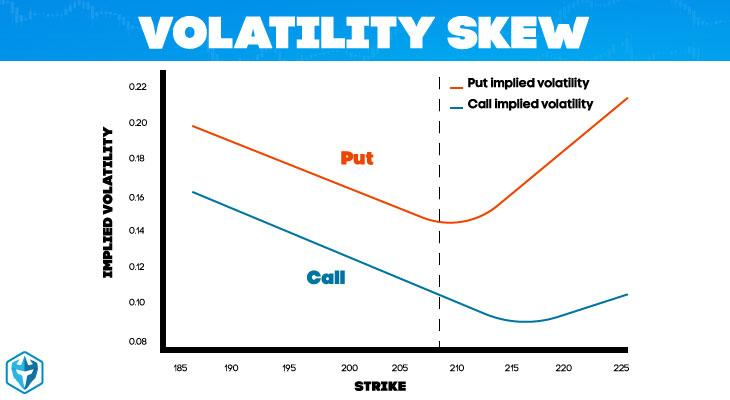

## Table of Contents

## What is implied volatility?

Implied volatility is a measure that shows how much the market thinks a stock's price will move in the future. It's not about what has happened to the stock's price in the past, but what people expect might happen. This number is important for options trading, which are contracts that give you the right to buy or sell a stock at a certain price. The higher the implied volatility, the more the market expects the stock's price to swing around.

You can think of implied volatility as a prediction of risk. If a stock has high implied volatility, it means traders think there's a bigger chance the stock's price could change a lot, either going up or down. On the other hand, low implied volatility suggests that traders expect the stock's price to stay pretty stable. This measure is calculated using option prices, and it's a key part of figuring out how much an option should cost.

## How is implied volatility calculated?

Implied volatility is figured out by using a special math formula called the Black-Scholes model. This model takes the current price of an option and works backward to find out what the market thinks the stock's future volatility will be. The key things you need to know to use this formula are the current stock price, the option's strike price, the time until the option expires, the risk-free interest rate, and the price of the option itself. By putting all these pieces into the Black-Scholes model, you can solve for the implied volatility.

The process involves a bit of trial and error. You start with a guess for the volatility and plug it into the Black-Scholes model to see what option price it gives you. If the calculated price doesn't match the actual market price of the option, you adjust your guess and try again. You keep doing this until the model's price matches the market price. This final guess for volatility is what we call the implied volatility. It's like solving a puzzle where the market's option price is the clue, and the implied volatility is the answer.

## What is volatility skew?

Volatility skew is when the implied volatility of options isn't the same across different strike prices. Usually, you'd expect all options on the same stock to have similar implied volatilities, but in the real world, they often don't. For example, options that let you buy the stock at a higher price (out-of-the-money calls) might have higher implied volatility than options that let you buy at the current price (at-the-money calls). This difference is called the volatility skew.

The reason for this skew can be because investors are worried about the stock price dropping a lot, so they pay more for options that protect against big drops. This makes the implied volatility higher for options with lower strike prices. On the other hand, if investors think the stock might go up a lot, they might pay more for options that let them buy the stock at a higher price, causing higher implied volatility for those options. Understanding the volatility skew helps traders see what the market is expecting and make smarter decisions about buying and selling options.

## What causes volatility skew?

Volatility skew happens because people think a stock's price might move more in one direction than another. For example, if everyone is worried that a stock's price could drop a lot, they might buy more options that protect against big drops. These options, which let you sell the stock at a set price, usually have lower strike prices. When lots of people want these options, their price goes up, and so does their implied volatility. This makes the implied volatility higher for options with lower strike prices than for options with higher strike prices.

Another reason for volatility skew is when people expect a stock's price to go up a lot. If everyone thinks the stock might jump in value, they might buy more options that let them buy the stock at a higher price. These options, known as out-of-the-money calls, have higher strike prices. When many people want these options, their price and implied volatility go up, making the implied volatility higher for options with higher strike prices. So, the volatility skew shows what the market is expecting and can help traders make better choices about which options to buy or sell.

## How does implied volatility affect option pricing?

Implied volatility is a big deal when it comes to figuring out how much an option should cost. It's like a guess about how much a stock's price might jump around in the future. When implied volatility is high, it means people think the stock's price could move a lot, so options become more expensive. This is because options are like bets on the stock's price, and if the price is expected to swing a lot, those bets are worth more. On the other hand, when implied volatility is low, it means people think the stock's price will stay pretty steady, so options are cheaper because there's less chance for a big move.

This relationship between implied volatility and option prices is really important for anyone trading options. If you think the implied volatility is too high compared to what you think will really happen, you might sell options because you believe they're overpriced. If you think the implied volatility is too low, you might buy options because you think they're a good deal. Traders use tools like the Black-Scholes model to figure out how much implied volatility is baked into an option's price, and then they make their moves based on whether they think that volatility is right or wrong.

## What is the relationship between implied volatility and volatility skew?

Implied volatility and volatility skew are closely related because they both tell us about what the market thinks might happen to a stock's price. Implied volatility is a guess about how much a stock's price might move in the future. It's used to figure out how much an option should cost. When implied volatility is high, it means people think the stock's price could swing a lot, so options become more expensive. When it's low, it means people think the stock's price will stay pretty steady, so options are cheaper.

Volatility skew shows us that the implied volatility isn't the same for all options on the same stock. It happens because people might think the stock's price is more likely to move in one direction than another. For example, if everyone is worried about the stock's price dropping a lot, they might pay more for options that protect against big drops, making the implied volatility higher for options with lower strike prices. This difference in implied volatility across different strike prices is what we call volatility skew. So, while implied volatility gives us a general idea of expected price movement, volatility skew shows us the market's specific worries or hopes about the stock's future price changes.

## How can traders use volatility skew to their advantage?

Traders can use volatility skew to see what the market is thinking about a stock's future price moves. If the skew shows that people are worried about the stock's price dropping a lot, traders might buy options that protect against big drops. These options, which have lower strike prices, could be cheaper because of the higher implied volatility for those options. By understanding the skew, traders can spot these cheaper options and use them to make money if the stock's price does drop.

On the other hand, if the skew shows that people think the stock's price might go up a lot, traders might buy options that let them buy the stock at a higher price. These options, called out-of-the-money calls, could be a good deal if the implied volatility for them is lower than what the trader thinks it should be. By looking at the volatility skew, traders can find these opportunities and make trades that could pay off if the stock's price goes up as expected.

## What are the different types of volatility skew?

Volatility skew comes in different forms, but the main ones are the "smile" and the "smirk." The smile happens when the options with really high and really low strike prices have higher implied volatility than the options with strike prices close to the current stock price. It looks like a smile because if you draw a line connecting the implied volatilities, it curves up at both ends. This can happen when people think the stock's price could move a lot in either direction, like before a big news event.

The smirk, on the other hand, happens when the options with lower strike prices have higher implied volatility than the options with higher strike prices. It looks like a smirk because the line connecting the implied volatilities goes up on the left side and stays flat or goes down on the right. This often happens when people are worried about the stock's price dropping a lot, so they pay more for options that protect against big drops. Understanding these different types of skew can help traders see what the market is expecting and make better trading choices.

## How does volatility skew impact different option strategies?

Volatility skew can really change how different option strategies work. For example, if you're using a strategy like buying put options to protect against a big drop in a stock's price, you might find that these options are more expensive because of the skew. The skew might show that people are worried about the stock falling, so the implied volatility for these put options is higher. This means you'll have to pay more for the protection, but it could also mean there's a bigger chance of making money if the stock does drop a lot.

On the other hand, if you're using a strategy like selling call options to make money from a stock that's not expected to move much, you need to look at the skew too. If the skew shows that people think the stock might go up a lot, the implied volatility for these call options could be higher. This might make them less attractive to sell because they're more expensive. But if you think the skew is overreacting and the stock won't move as much as people think, you might still sell these options and make money if the stock stays steady or only moves a little.

## What are the historical patterns of volatility skew in financial markets?

Over time, volatility skew has shown some interesting patterns in financial markets. One common pattern is the "smirk," where options with lower strike prices have higher implied volatility. This often happens because people get worried about a big drop in the stock's price, so they pay more for options that protect against that drop. For example, after big events like the 1987 stock market crash, the smirk became more common because people were more worried about big drops happening again. This pattern can be seen in many markets, especially in times of economic uncertainty or when there's a lot of bad news.

Another pattern is the "smile," where options with both really high and really low strike prices have higher implied volatility than options with strike prices close to the current stock price. This can happen when people think the stock's price could move a lot in either direction, like before a big company announcement or an election. The smile pattern was more common in the past, but it's less common now because people are usually more worried about big drops than big jumps. Understanding these patterns can help traders see what the market is expecting and make better choices about which options to buy or sell.

## How can advanced models better predict changes in volatility skew?

Advanced models can help predict changes in volatility skew by looking at a lot of different things at once. These models use fancy math to figure out how the market might change. They look at past data, like how the stock's price has moved before, and they also look at what's happening in the world right now, like news or economic reports. By putting all this information together, these models can make better guesses about what might happen to the volatility skew. They can see patterns that might be hard for people to notice and use those patterns to predict if the skew will get bigger or smaller.

One way these models work is by using something called machine learning. This is when computers learn from lots of data to find out what's likely to happen next. For example, a model might learn that when certain news comes out, the volatility skew changes in a certain way. By understanding these connections, the model can predict how the skew might change when similar news comes out in the future. This can help traders make smarter choices about buying and selling options, because they can be ready for changes in the market before they happen.

## What are the limitations and potential biases in using implied volatility and volatility skew for trading decisions?

Using implied volatility and volatility skew for trading decisions has some limits and can lead to biases. One big limit is that these measures are based on what people think might happen in the future, not what will actually happen. If everyone is wrong about how much a stock's price will move, then the implied volatility and skew can be way off. This can make options seem like a good deal when they're not, or make traders think the market is expecting one thing when it's really expecting something else. Also, these measures are based on past data and current market conditions, but the future can be different. So, traders need to be careful and not just trust these numbers without thinking about other things too.

Another problem is that traders can have biases that affect how they use implied volatility and volatility skew. For example, if a trader always thinks the market is going to crash, they might see a smirk in the volatility skew and think it's a sure sign to buy put options. But if they're wrong, they could lose money. Or, if a trader always thinks the market is going to go up, they might see a smile in the skew and think it's a great time to sell call options. But if the market doesn't move as much as they expect, they could lose money too. So, it's important for traders to be aware of their own biases and not let them cloud their judgment when looking at implied volatility and volatility skew.

## What is Implied Volatility Explained?

Implied volatility represents the market's forecast of the magnitude of a potential movement in an asset's price, expressed as an annualized percentage. Unlike historical volatility, which measures past market fluctuations, implied volatility is prospective, offering insights into market sentiment regarding future price movements. It's crucial to note that implied volatility does not predict the direction of the movement, merely its potential intensity.

Implied volatility is derived from the current price of options using models such as the Black-Scholes-Merton model. This model calculates the theoretical price of options, taking into account factors like the underlying asset's current price, the option's strike price, time to expiration, risk-free [interest rate](/wiki/interest-rate-trading-strategies), and implied volatility. The formula for the Black-Scholes option pricing model is:

$$
C = S_0 N(d_1) - X e^{-rT} N(d_2)
$$

$$
P = X e^{-rT} N(-d_2) - S_0 N(-d_1)
$$

where:

- $C$ and $P$ are the call and put option prices respectively,
- $S_0$ is the current price of the underlying asset,
- $X$ is the strike price,
- $T$ is the time to expiration in years,
- $r$ is the risk-free interest rate,
- $N$ is the cumulative distribution function of the standard normal distribution,
- $d_1 = \frac{\ln(S_0/X) + (r + 0.5\sigma^2)T}{\sigma\sqrt{T}}$
- $d_2 = d_1 - \sigma\sqrt{T}$
- $\sigma$ represents implied volatility.

The option market's buyers and sellers interactively influence the implied volatility. When there is high demand for options, the implied volatility tends to increase, raising the premium of the options. This increase results in higher reward expectations for sellers, as they demand more return for taking on the risk of potential market movements. Conversely, when implied volatility decreases, indicating market tranquility or reduced expectation of significant price movements, option premiums typically become cheaper, making them more attractive to buyers.

Options traders must keenly observe changes in implied volatility as it significantly affects their strategies. For instance, a trader might opt to buy options in periods of low implied volatility if they anticipate a market event that could trigger significant price movement. Conversely, during periods of high implied volatility, strategies such as selling options could be more viable to capitalize on high premiums and expected volatility reversion to mean levels.

In summary, implied volatility is a critical element in the pricing of options, reflecting collective market sentiment about future volatility without specifying the direction, thereby shaping the buying and selling strategies of traders. Understanding implied volatility can empower traders to make informed decisions about entering or exiting option positions, maximize their returns, and mitigate potential risks.

## What are Strategic Approaches Using Volatility Skew?

Utilizing volatility skew is essential for traders looking to optimize their options trading strategies. A variety of approaches can leverage this phenomenon to potentially enhance returns. Among these strategies, Risk Reversal, Iron Condor, and Calendar Spreads are prominent for their ability to exploit different market conditions effectively.

**Risk Reversal Strategy**

The Risk Reversal strategy involves simultaneously purchasing a call option and selling a put option with the same expiration date, but typically at different strike prices. This approach tends to be utilized when there is higher implied volatility, an indicator of uncertain market conditions or expected price movements in the underlying asset. The goal of the Risk Reversal is to capitalize on the directional bias of the market. For instance, if a trader anticipates a bullish movement in the asset, they might engage in a bullish Risk Reversal by buying an out-of-the-money (OTM) call and selling an OTM put. The spread between the two options reflects the skew in implied volatility. The payoff for a Risk Reversal can be expressed as:

$$

\text{Payoff}_{\text{Long Call}} - \text{Payoff}_{\text{Short Put}} 
$$

where $\text{Long Call}$ represents the call option purchased, and $\text{Short Put}$ denotes the sold put option.

**Iron Condor Strategy**

The Iron Condor strategy is a popular choice in stable market environments with lower volatility levels. It involves selling a call spread and a put spread with the same expiration dates, aiming to profit from minimal price movement within a specific range. The Iron Condor consists of four options: one long call, one short call with a higher strike price, one long put, and one short put with a lower strike price. This strategy exploits the volatility skew by targeting options where implied volatility may temporarily expand, allowing traders to capture premium through the selling of the options. The profitability hinges on the underlying asset remaining between the two strike prices of the short options.

**Calendar Spread Strategy**

Calendar Spreads take advantage of the volatility skew by involving the sale and purchase of options with the same strike prices but different expiration dates. By trading a calendar spread, traders aim to profit from differences in implied volatility over different timeframes. The strategy benefits from the differential decay of time value between the short-term and long-term options, which is particularly pronounced when implied volatility is skewed across the maturity spectrum. 

In conclusion, these strategies highlight how volatility skew can be systematically leveraged to enhance trading performance. Each approach—Risk Reversal, Iron Condor, and Calendar Spreads—provides a structured means to harness varying market conditions as indicated by the skew and implied volatility dynamics. By employing these strategies, traders can align their positions with their market expectations, optimizing risk and potential returns.

## References & Further Reading

[1]: Hull, J. C. (2012). ["Options, Futures, and Other Derivatives"](https://www.semanticscholar.org/paper/Options%2C-Futures%2C-and-Other-Derivatives-Hull/89bdee500c8623864fc9eb7a471546aa713acc44). Pearson Education.

[2]: Gatheral, J. (2006). ["The Volatility Surface: A Practitioner's Guide"](https://onlinelibrary.wiley.com/doi/book/10.1002/9781119202073). Wiley.

[3]: Natenberg, S. (1994). ["Option Volatility and Pricing: Advanced Trading Strategies and Techniques"](https://www.amazon.com/Option-Volatility-Pricing-Strategies-Techniques/dp/0071818774). McGraw-Hill.

[4]: Taleb, N. N. (1997). ["Dynamic Hedging: Managing Vanilla and Exotic Options"](https://archive.org/details/dynamichedgingma0000tale). Wiley.

[5]: Black, F., & Scholes, M. (1973). ["The Pricing of Options and Corporate Liabilities."](https://www.cs.princeton.edu/courses/archive/fall09/cos323/papers/black_scholes73.pdf) The Journal of Political Economy, 81(3), 637–654.

[6]: Bertsimas, D., Kogan, L., & Lo, A. W. (2000). ["When is Time Continuous?"](http://web.mit.edu/~dbertsim/www/papers/Finance/When%20is%20time%20continuous.pdf) Journal of Financial Economics, 55(2), 173-204.