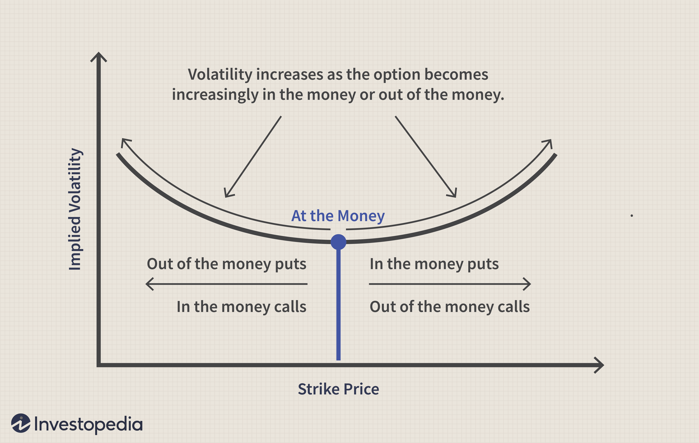

Options trading is a versatile and complex financial strategy that involves trading options contracts to speculate on or hedge against price movements. Options provide traders with the flexibility to profit from various market conditions through different types of contracts, notably calls and puts. A call option gives the holder the right, but not the obligation, to buy an asset at a specified strike price before the option's expiration, while a put option gives the right to sell under similar conditions. The primary objective is to leverage these contracts to achieve desired economic exposures without directly buying or selling the underlying asset.

Two critical components in understanding options pricing and market sentiment are volatility skew and implied volatility. Volatility skew refers to the pattern of implied volatility differences across options with different strike prices but the same expiration date. This pattern can signal market expectations about future asset price movements. Different skew shapes, such as smile or smirk, reveal investor perceptions regarding potential risk or direction of market movement. For instance, a smirk, characterized by higher implied volatility for out-of-the-money (OTM) puts, suggests a bearish market sentiment where market participants might expect downward asset price movements.



Implied volatility, on the other hand, is a forward-looking metric representing the market's forecast of the asset's price fluctuations. Derived from the market price of options, implied volatility does not indicate the direction of the price change but rather the magnitude of anticipated movement. Higher implied volatility leads to increased option premiums, influencing options trading strategies by impacting both buyer and seller perspectives regarding risk and return.

Algorithmic trading has emerged as a powerful tool capable of efficiently exploiting volatility patterns and dynamic market conditions. Employing automated systems to execute trades based on pre-designed quantitative models, algorithmic trading allows for rapid response to market changes, optimizing trade execution. By integrating real-time market data and sophisticated analytics, algorithmic trading systems can identify profitable opportunities arising from volatility skew and implied volatility fluctuations, while also managing associated risks more effectively.

This article explores the interplay among options trading, volatility skew, implied volatility, and algorithmic trading, offering insights into the complexity of options markets and how these elements contribute to informed trading decisions. Understanding these concepts is essential for traders and investors seeking to capitalize on options as a strategic financial instrument.

## Table of Contents

## Understanding Volatility Skew

Volatility skew is a fundamental concept in options trading that illustrates how implied volatility varies across different strike prices for options with the same expiration date. It is often visualized as a curve when plotting implied volatility against strike prices. This concept is crucial for traders as it reflects market perceptions and can influence trading strategies.

There are several distinct patterns of [volatility](/wiki/volatility-trading-strategies) skew, each conveying different interpretations of market sentiment.

### Smile Skew
The smile skew presents a U-shaped pattern, where implied volatility is higher for both lower and higher strike prices compared to at-the-money (ATM) options. This pattern is indicative of heightened market uncertainty, suggesting that traders expect significant price movements in either direction. Smile skew is more prevalent in markets with assets that have a higher probability of experiencing sudden large moves, such as foreign exchange markets. It reflects the market's anticipation of higher risks associated with extreme price movements, whether they lead to deep-in-the-money or far out-of-the-money scenarios.

### Smirk Skew
The smirk skew, also known as the volatility smirk, is more commonly observed in equity markets. It is characterized by higher implied volatility for out-of-the-money (OTM) put options compared to ATM options and calls. This skew indicates a negative market sentiment, with the anticipation that the underlying asset's price will decline. The steeper slope on the put side signifies a greater demand for insurance against downside risk, often due to fears of crashes or corrections. This sentiment drives up the premiums of these protective puts, reflecting a collective market expectation of potential downside volatility.

### Reverse Skew
The reverse skew, or inverted skew, displays higher implied volatility for calls rather than puts. This pattern can occur in markets where there is a significant expectation of upward price movements, often due to anticipated positive news or market events that could drive asset prices up. In a reverse skew scenario, the demand for call options increases because traders expect significant gains, leading to elevated premiums for these options.

Each skew pattern offers insight into the market's collective beliefs about future volatility and possible price directions. For traders, understanding these patterns is critical for making informed decisions about entering, managing, or exiting positions based on anticipated volatility. This knowledge enables traders to tailor their strategies according to prevailing market expectations, whether they aim to hedge existing positions or speculate on future market movements.

## Implied Volatility Explained

Implied volatility represents the market's forecast of the magnitude of a potential movement in an asset's price, expressed as an annualized percentage. Unlike historical volatility, which measures past market fluctuations, implied volatility is prospective, offering insights into market sentiment regarding future price movements. It's crucial to note that implied volatility does not predict the direction of the movement, merely its potential intensity.

Implied volatility is derived from the current price of options using models such as the Black-Scholes-Merton model. This model calculates the theoretical price of options, taking into account factors like the underlying asset's current price, the option's strike price, time to expiration, risk-free [interest rate](/wiki/interest-rate-trading-strategies), and implied volatility. The formula for the Black-Scholes option pricing model is:

$$
C = S_0 N(d_1) - X e^{-rT} N(d_2)
$$

$$
P = X e^{-rT} N(-d_2) - S_0 N(-d_1)
$$

where:

- $C$ and $P$ are the call and put option prices respectively,
- $S_0$ is the current price of the underlying asset,
- $X$ is the strike price,
- $T$ is the time to expiration in years,
- $r$ is the risk-free interest rate,
- $N$ is the cumulative distribution function of the standard normal distribution,
- $d_1 = \frac{\ln(S_0/X) + (r + 0.5\sigma^2)T}{\sigma\sqrt{T}}$
- $d_2 = d_1 - \sigma\sqrt{T}$
- $\sigma$ represents implied volatility.

The option market's buyers and sellers interactively influence the implied volatility. When there is high demand for options, the implied volatility tends to increase, raising the premium of the options. This increase results in higher reward expectations for sellers, as they demand more return for taking on the risk of potential market movements. Conversely, when implied volatility decreases, indicating market tranquility or reduced expectation of significant price movements, option premiums typically become cheaper, making them more attractive to buyers.

Options traders must keenly observe changes in implied volatility as it significantly affects their strategies. For instance, a trader might opt to buy options in periods of low implied volatility if they anticipate a market event that could trigger significant price movement. Conversely, during periods of high implied volatility, strategies such as selling options could be more viable to capitalize on high premiums and expected volatility reversion to mean levels.

In summary, implied volatility is a critical element in the pricing of options, reflecting collective market sentiment about future volatility without specifying the direction, thereby shaping the buying and selling strategies of traders. Understanding implied volatility can empower traders to make informed decisions about entering or exiting option positions, maximize their returns, and mitigate potential risks.

## Role of Algorithmic Trading

Algorithmic trading leverages sophisticated computational algorithms to automate the execution of pre-designed trading strategies, relying heavily on quantitative models. This approach is particularly impactful in options trading, where the complexities of volatility skew and implied volatility present unique opportunities and challenges.

The systematic nature of [algorithmic trading](/wiki/algorithmic-trading) allows for the rapid analysis of vast datasets, integrating real-time market data to identify and exploit minute pricing inefficiencies that manual trading might miss. Volatility skew, which describes differences in implied volatility across various strike prices, often signals market sentiment shifts that algorithms can swiftly detect and respond to. For instance, a noticeable smirk skew might prompt an algorithm to adjust the trading strategy to capitalize on anticipated market downturns, as it suggests increased implied volatility for out-of-the-money (OTM) puts.

Handling complex calculations and large amounts of data, algorithms efficiently parse through historical and current market data to adjust trading signals according to fluctuations in implied volatility. For example, when implied volatility rises, options premiums increase, potentially altering the risk-reward profile of certain strategies. Here's a basic Python example illustrating how a simple moving average crossover strategy might be adapted to account for changes in implied volatility:

```python
import numpy as np

def calculate_simple_moving_average(data, window):
    return np.convolve(data, np.ones(window), 'valid') / window

def trading_signal(price_data, volatility_data, vol_threshold=0.3):
    short_window = 5
    long_window = 20
    signals = []
    short_ma = calculate_simple_moving_average(price_data, short_window)
    long_ma = calculate_simple_moving_average(price_data, long_window)

    # Align the lengths of moving averages
    long_ma = long_ma[short_window-1:]

    for short, long, vol in zip(short_ma, long_ma, volatility_data[len(volatility_data) - len(short_ma):]):
        if short > long and vol > vol_threshold:
            signals.append("Buy - High Volatility")
        elif short < long and vol < vol_threshold:
            signals.append("Sell - Low Volatility")
        else:
            signals.append("Hold")

    return signals

# Example usage with simplified data
price_data = np.random.randn(100)
volatility_data = np.random.rand(100)
trading_signals = trading_signal(price_data, volatility_data)
print(trading_signals[-10:])
```

This code snippet exemplifies how trading signals can adapt based on simple moving average crossovers and current levels of implied volatility, thereby enhancing decision-making.

Moreover, algorithmic trading helps manage the risk associated with options trading by executing trades with speed and precision that human traders cannot match. Algorithms can be programmed to [exit](/wiki/exit-strategy) positions automatically when certain risk thresholds are breached, ensuring that defensive maneuvers are executed without delay.

The precision of algorithmic trading is complemented by its scalability, making it a powerful tool in managing complex options portfolios. This technological advancement allows traders to engage in multiple strategies simultaneously, adjusting parameters in response to evolving market conditions. Overall, algorithmic trading provides a competitive edge by systematically exploiting the nuances of volatility skew and implied volatility, ultimately aiming to enhance profitability and risk management in options trading.

## Strategic Approaches Using Volatility Skew

Utilizing volatility skew is essential for traders looking to optimize their options trading strategies. A variety of approaches can leverage this phenomenon to potentially enhance returns. Among these strategies, Risk Reversal, Iron Condor, and Calendar Spreads are prominent for their ability to exploit different market conditions effectively.

**Risk Reversal Strategy**

The Risk Reversal strategy involves simultaneously purchasing a call option and selling a put option with the same expiration date, but typically at different strike prices. This approach tends to be utilized when there is higher implied volatility, an indicator of uncertain market conditions or expected price movements in the underlying asset. The goal of the Risk Reversal is to capitalize on the directional bias of the market. For instance, if a trader anticipates a bullish movement in the asset, they might engage in a bullish Risk Reversal by buying an out-of-the-money (OTM) call and selling an OTM put. The spread between the two options reflects the skew in implied volatility. The payoff for a Risk Reversal can be expressed as:

$$

\text{Payoff}_{\text{Long Call}} - \text{Payoff}_{\text{Short Put}} 
$$

where $\text{Long Call}$ represents the call option purchased, and $\text{Short Put}$ denotes the sold put option.

**Iron Condor Strategy**

The Iron Condor strategy is a popular choice in stable market environments with lower volatility levels. It involves selling a call spread and a put spread with the same expiration dates, aiming to profit from minimal price movement within a specific range. The Iron Condor consists of four options: one long call, one short call with a higher strike price, one long put, and one short put with a lower strike price. This strategy exploits the volatility skew by targeting options where implied volatility may temporarily expand, allowing traders to capture premium through the selling of the options. The profitability hinges on the underlying asset remaining between the two strike prices of the short options.

**Calendar Spread Strategy**

Calendar Spreads take advantage of the volatility skew by involving the sale and purchase of options with the same strike prices but different expiration dates. By trading a calendar spread, traders aim to profit from differences in implied volatility over different timeframes. The strategy benefits from the differential decay of time value between the short-term and long-term options, which is particularly pronounced when implied volatility is skewed across the maturity spectrum. 

In conclusion, these strategies highlight how volatility skew can be systematically leveraged to enhance trading performance. Each approach—Risk Reversal, Iron Condor, and Calendar Spreads—provides a structured means to harness varying market conditions as indicated by the skew and implied volatility dynamics. By employing these strategies, traders can align their positions with their market expectations, optimizing risk and potential returns.

## Case Studies in Options Trading

Analyzing real-world applications of options trading provides valuable insights into how various strategies are implemented based on volatility skews and implied volatility patterns. Significant companies such as Apple, Tesla, and Amazon serve as quintessential examples due to their large impact on market dynamics and their tendency to have rapid, significant price movements influenced by technological advancements, consumer behavior, and earnings announcements.

### Apple Inc.

Apple's stock options are among the most actively traded, providing a rich landscape for understanding volatility dynamics. During periods leading up to product launches or earnings announcements, traders often notice a smirk skew pattern in Apple's options. This skew suggests higher implied volatility for out-of-the-money (OTM) puts compared to OTM calls, indicating market participants are hedging against potential downside risk. For instance, prior to a major earnings call, the implied volatility (IV) tends to rise, reflecting traders' anticipation of substantial price movements. Following the announcement, regardless of whether the news is positive or negative, implied volatility typically falls, a phenomenon known as volatility crush. In such scenarios, strategies like using a risk reversal can allow traders to position themselves advantageously based on expected price trends.

### Tesla Inc.

Tesla's options trading exemplifies the use of volatility skew in a highly volatile and speculative environment. Known for its unpredictable price movements, Tesla often shows a volatility smile, indicating significant uncertainty on both ends of the strike spectrum. Before major product announcements or industry shifts, Tesla's implied volatility increases, rendering a broad volatility smile pattern due to potential for either strong rallies or steep declines. Traders might exploit such events by deploying straddle or strangle strategies that benefit from significant moves in either direction, hedging against uncertainty.

### Amazon.com, Inc.

Amazon represents a case where market sentiment and strategic business decisions impact volatility. Events such as changes in CEO leadership or shifts in business strategy can impose a marked effect on implied volatility. Similar to Apple, Amazon's options frequently exhibit a smirk skew during earnings seasons, reflecting increased demand for downside protection. Options strategies like an Iron Condor or Calendar Spread might be used in this context. These strategies aim to profit from expected stable price action post-earnings announcement, as the market adjusts to new information and implied volatility decreases.

These case studies illustrate the importance of understanding and leveraging implied volatility and volatility skews in options trading. Whether adapting to anticipated market events or unexpected announcements, traders benefit from tailoring their strategies to the dynamics of individual stocks and prevailing market conditions. By tracking how these parameters evolve, traders can optimize their positions, minimizing risks while capitalizing on potential profits.

## Conclusion

Understanding volatility skews and implied volatility is crucial in making informed trading decisions, as they provide insights into market expectations and risk assessments. Volatility skews, by reflecting different implied volatilities at varying strike prices, signal potential price movements and underlying market sentiments. Implied volatility, on the other hand, represents the market's forecast of the magnitude of price changes, thereby influencing option premiums and guiding strategic decision-making.

Algorithmic trading enhances the ability to exploit these market nuances by employing automated, quantitative models that can quickly react to volatility patterns. These algorithms can analyze vast amounts of data efficiently, identifying and executing trading opportunities that align with skew and implied volatility dynamics. For example, algorithms can be designed to recognize a volatility smile pattern and subsequently execute a straddle strategy that bets on increased volatility in either direction.

Here is an example of a simple Python function that can aid in identifying volatility skew patterns from options data:

```python
def identify_volatility_skew(option_data):
    skew_types = {'smile': 0, 'smirk': 0, 'reverse': 0}
    for option in option_data:
        # Calculate implied volatilities for different strikes
        ivs = calculate_implied_volatility(option)
        if ivs['high_strike'] > ivs['low_strike'] and ivs['high_strike'] > ivs['atm']:
            skew_types['smile'] += 1
        elif ivs['low_strike'] > ivs['atm']:
            skew_types['smirk'] += 1
        else:
            skew_types['reverse'] += 1
    return max(skew_types, key=skew_types.get)
```

Continual monitoring and adapting to market changes are essential for success in options trading, as market conditions and sentiments can rapidly fluctuate. Traders need to remain vigilant, regularly updating their strategies and possibly their algorithmic parameters, to align with the ever-changing market landscape. By marrying a solid understanding of volatility concepts with the precision of algorithmic trading, traders can enhance their ability to manage risk and capitalize on market opportunities effectively.

## References & Further Reading

[1]: Hull, J. C. (2012). ["Options, Futures, and Other Derivatives"](https://www.semanticscholar.org/paper/Options%2C-Futures%2C-and-Other-Derivatives-Hull/89bdee500c8623864fc9eb7a471546aa713acc44). Pearson Education.

[2]: Gatheral, J. (2006). ["The Volatility Surface: A Practitioner's Guide"](https://onlinelibrary.wiley.com/doi/book/10.1002/9781119202073). Wiley.

[3]: Natenberg, S. (1994). ["Option Volatility and Pricing: Advanced Trading Strategies and Techniques"](https://www.amazon.com/Option-Volatility-Pricing-Strategies-Techniques/dp/0071818774). McGraw-Hill.

[4]: Taleb, N. N. (1997). ["Dynamic Hedging: Managing Vanilla and Exotic Options"](https://archive.org/details/dynamichedgingma0000tale). Wiley.

[5]: Black, F., & Scholes, M. (1973). ["The Pricing of Options and Corporate Liabilities."](https://www.cs.princeton.edu/courses/archive/fall09/cos323/papers/black_scholes73.pdf) The Journal of Political Economy, 81(3), 637–654.

[6]: Bertsimas, D., Kogan, L., & Lo, A. W. (2000). ["When is Time Continuous?"](http://web.mit.edu/~dbertsim/www/papers/Finance/When%20is%20time%20continuous.pdf) Journal of Financial Economics, 55(2), 173-204.