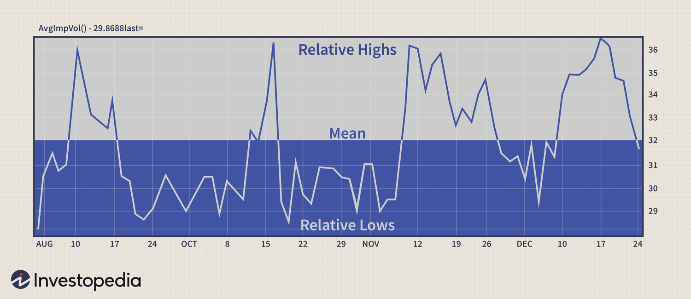

## Table of Contents

## What is implied volatility?

Implied volatility is a measure that shows how much the market thinks a stock's price will move in the future. It is often used in options trading, where options are contracts that give the buyer the right to buy or sell a stock at a certain price. Implied volatility is calculated using the price of an option and a mathematical model, like the Black-Scholes model. It is called "implied" because it is not directly observed but is derived from the option's price.

When implied volatility is high, it means the market expects big price swings in the stock. This can happen when there is a lot of uncertainty or big news expected, like earnings reports or economic announcements. On the other hand, when implied volatility is low, it means the market expects the stock price to stay pretty stable. Traders use implied volatility to help decide if an option is a good buy or if it's overpriced. It's an important tool for making smart decisions in options trading.

## How is implied volatility different from historical volatility?

Implied volatility and historical volatility are two different ways to measure how much a stock's price might move. Historical volatility looks at how much the stock price has moved in the past. It is calculated using past stock prices over a certain period, like the last 30 or 60 days. This tells us how much the stock price has changed in the past, which can give us an idea of what might happen in the future, but it's based on what has already happened.

Implied volatility, on the other hand, is a prediction of how much the stock price might move in the future. It is calculated from the price of an option, which is a contract that gives the buyer the right to buy or sell a stock at a certain price. Because option prices are influenced by what traders think will happen, implied volatility shows what the market expects the stock price to do. It's called "implied" because it's not directly observed but is figured out from the option's price. 

So, historical volatility tells us about past price movements, while implied volatility tells us about expected future movements. Both are useful, but they give us different kinds of information. Historical volatility can help us understand what has happened, while implied volatility helps us guess what might happen next.

## What does implied volatility tell us about market expectations?

Implied volatility tells us about what the market thinks will happen to a stock's price in the future. It's like a guess about how much the price might go up or down. When implied volatility is high, it means the market expects big changes in the stock price. This can happen when there's a lot of uncertainty or big news coming up, like earnings reports or important announcements. Traders look at high implied volatility and think, "Wow, the market expects this stock to move a lot!"

On the other hand, when implied volatility is low, it means the market expects the stock price to stay pretty steady. This can happen when things are calm and there's not much news or uncertainty. Traders see low implied volatility and think, "Okay, the market expects this stock to not move much." So, implied volatility is a helpful tool for traders because it gives them an idea of what to expect from a stock's price, based on what everyone else in the market is thinking.

## How is implied volatility calculated?

Implied volatility is calculated using a special math formula, often the Black-Scholes model. This formula takes the price of an option and figures out what the expected future movement of the stock price must be to make that option price make sense. An option is like a bet on whether a stock will go up or down, and its price is influenced by what traders think will happen. So, by looking at the option's price, the formula can work backwards to find the implied volatility.

To use the Black-Scholes model, you need to know a few things: the current price of the stock, the option's strike price (the price at which the option can be used), the time until the option expires, the risk-free [interest rate](/wiki/interest-rate-trading-strategies), and the option's price. You put all these into the formula, and it solves for the implied volatility. This number tells you how much the market expects the stock price to move in the future. It's like a guess about how wild the stock's price might get, based on what everyone is willing to pay for the option.

## What are the common uses of implied volatility in trading?

Implied volatility is a big help for traders when they're deciding whether to buy or sell options. Options are like bets on whether a stock's price will go up or down, and their prices are based on what traders think will happen. When implied volatility is high, it means the market expects the stock price to move a lot. Traders might see this as a chance to make money if they think the stock will move in a big way. On the other hand, when implied volatility is low, it means the market expects the stock price to stay pretty stable. Traders might use this info to decide if an option is a good deal or if it's overpriced.

Another way traders use implied volatility is to compare it with historical volatility. Historical volatility shows how much a stock's price has moved in the past, while implied volatility shows what the market expects in the future. By looking at both, traders can see if the market's expectations are higher or lower than what has happened before. This can help them decide if an option is priced right or if it's a good time to buy or sell. Implied volatility is like a crystal ball for traders, helping them make smarter choices in the fast-moving world of options trading.

## How does implied volatility affect option pricing?

Implied volatility plays a big role in deciding how much an option costs. An option is like a bet on whether a stock's price will go up or down, and its price is based on what traders think will happen. When implied volatility is high, it means the market expects the stock price to move a lot. This makes options more expensive because there's a bigger chance the stock price will hit the option's strike price, which is the price at which the option can be used. So, if traders think a stock will move a lot, they'll pay more for the option.

On the other hand, when implied volatility is low, it means the market expects the stock price to stay pretty stable. This makes options cheaper because there's less chance the stock price will move enough to hit the option's strike price. Traders see low implied volatility and think the option is less likely to be worth a lot, so they won't pay as much for it. In simple terms, high implied volatility makes options more expensive, and low implied volatility makes them cheaper.

## What is the relationship between implied volatility and the VIX index?

The VIX index, also known as the "fear gauge," is a measure of the market's expected volatility over the next 30 days. It's calculated using the implied volatility of options on the S&P 500 index. When the VIX is high, it means the market expects big changes in the S&P 500, which is a sign that investors are worried or uncertain about what's going to happen. On the other hand, when the VIX is low, it means the market expects the S&P 500 to stay pretty steady, which shows that investors are feeling calm and confident.

So, the VIX is like a big picture view of implied volatility for the whole market. It's based on the same idea as implied volatility for individual stocks, but it looks at a bunch of options on the S&P 500 to get a sense of how nervous or relaxed the market is feeling. Traders and investors watch the VIX to get a feel for the overall mood of the market and to help them make decisions about buying or selling options.

## How can implied volatility be used to assess the risk of an option?

Implied volatility helps traders figure out how risky an option might be. When implied volatility is high, it means the market thinks the stock's price could move a lot. This makes the option more risky because there's a bigger chance the stock price will swing up or down a lot. Traders see high implied volatility and think, "This option could be really exciting, but it's also more likely to lose money if the stock doesn't move the way I expect."

On the other hand, when implied volatility is low, it means the market expects the stock's price to stay pretty steady. This makes the option less risky because there's less chance of big price swings. Traders see low implied volatility and think, "This option might not make me a lot of money, but it's also less likely to lose a lot." So, by looking at implied volatility, traders can get a sense of how wild or calm the stock's price might be, which helps them decide if an option is too risky or just right for their trading plan.

## What are volatility smiles and smirks, and how do they relate to implied volatility?

Volatility smiles and smirks are patterns you see when you plot the implied volatility of options against their strike prices. A volatility smile looks like a smile because the implied volatility is higher for options that are way out of the money (far from the current stock price) on both the high and low ends. This means the market thinks there's a bigger chance of big price swings, either up or down, even though these options are less likely to be used. Traders see a volatility smile and think, "The market expects this stock to move a lot, no matter which way it goes."

A volatility smirk, on the other hand, is when the implied volatility is higher for out-of-the-money options on just one side, usually the lower side. This makes the graph look like a smirk instead of a full smile. A volatility smirk often shows up when the market is worried about the stock price dropping a lot. Traders see a volatility smirk and think, "The market is more worried about the stock going down than going up." Both smiles and smirks show how the market's expectations about future price movements can change depending on the option's strike price.

## How do changes in implied volatility impact option strategies like straddles and strangles?

Changes in implied volatility can have a big effect on option strategies like straddles and strangles. A straddle is when you buy a call option and a put option at the same strike price, betting that the stock will move a lot in either direction. A strangle is similar, but you buy a call option and a put option at different strike prices, still betting on big moves. When implied volatility goes up, it makes these options more expensive because the market expects bigger price swings. This can be good for traders who already own straddles or strangles because the value of their options goes up, even if the stock price hasn't moved yet. But it can be bad for traders who want to start a new straddle or strangle because they have to pay more for the options.

On the other hand, when implied volatility goes down, it makes these options cheaper because the market expects the stock price to stay pretty steady. This can be bad for traders who already own straddles or strangles because the value of their options goes down, even if the stock price hasn't moved. But it can be good for traders who want to start a new straddle or strangle because they can buy the options for less. So, traders need to keep an eye on implied volatility to decide when to start or end these strategies, depending on whether they think the stock will move a lot or stay calm.

## What advanced models incorporate implied volatility, and how do they improve upon basic models?

Advanced models that use implied volatility include the Heston model and the SABR model. These models are more detailed than the basic Black-Scholes model, which assumes that implied volatility stays the same for all options on a stock. The Heston model lets implied volatility change over time and be different for different options, which makes it better at predicting how option prices will move. The SABR model is good for options on things like interest rates or commodities, and it can handle situations where the price of the underlying asset and its volatility are connected.

These advanced models are better because they take into account more real-world stuff. The Black-Scholes model is simple and works well for some options, but it doesn't always match what happens in the market. The Heston and SABR models can handle changes in implied volatility and other tricky things that the Black-Scholes model can't. This makes them more useful for traders who want to understand and predict how option prices will change based on what's happening in the market.

## How can traders use implied volatility to predict market movements and adjust their portfolios?

Traders can use implied volatility to guess how much a stock's price might move in the future. When implied volatility is high, it means the market thinks the stock will move a lot, either up or down. This can be a sign that big news or events are coming up, like earnings reports or economic announcements. Traders might see high implied volatility and decide to buy options to take advantage of the expected big moves. On the other hand, when implied volatility is low, it means the market expects the stock to stay pretty steady. Traders might see this as a chance to sell options, since they think the stock won't move much and the options won't be worth a lot.

Traders can also use implied volatility to adjust their portfolios. If they see that implied volatility is going up for a stock they own, they might decide to buy options to protect their investment from big price swings. This is called a hedge. If implied volatility is going down, they might sell options to make some extra money, since the options are less likely to be worth a lot. By keeping an eye on implied volatility, traders can make smarter decisions about when to buy or sell options and how to protect their investments from unexpected market moves.

## What is Implied Volatility?

Implied volatility is a critical concept in the pricing of options, providing insight into the expected fluctuations in an asset's price. It represents the market's forecast of a security's volatility, embedded in options prices. Unlike historical and realized volatility, which are based on past price movements, implied volatility projects future volatility based on the current price of options.

Implied [volatility](/wiki/volatility-trading-strategies) plays a fundamental role in the Black-Scholes model, a widely-used framework for options pricing. In the formula:

$$
C = S_0 \cdot N(d_1) - X \cdot e^{-rT} \cdot N(d_2)
$$

implied volatility is an essential input in the calculation of $d_1$ and $d_2$, and affects the premium of an option. Here, $C$ is the call option price, $S_0$ is the current price of the underlying asset, $X$ is the strike price, $r$ is the risk-free interest rate, $T$ is the time until expiration, and $N$ represents the cumulative distribution function of a standard normal distribution.

The distinction between implied volatility and other volatilities lies in its predictive nature. Historical volatility measures the movement of an asset's price over a specific period in the past, while realized volatility is the actual volatility observed over a given period. Implied volatility, however, reflects the market's forward-looking expectations and is derived from the current market prices of options.

One of the key significances of implied volatility is its ability to encapsulate market expectations. A higher implied volatility suggests that the market anticipates greater price movement, indicating potential uncertainty or risk. Conversely, lower implied volatility may imply stability in the asset's price. This makes implied volatility a valuable metric for traders and analysts who aim to gauge market sentiment and forecast future price dynamics.

Despite its usefulness, there are common misconceptions regarding implied volatility. One such misconception is that it predicts the direction of the price movement; however, implied volatility only indicates the magnitude of expected price changes without providing insights into whether the price will increase or decrease. Additionally, implied volatility can be influenced by external factors such as news events or geopolitical developments, which may cause sudden spikes or declines unrelated to the intrinsic value of the underlying asset.

A limitation of implied volatility is its reliance on option pricing models, which may not always perfectly capture real-world complexities. Models like Black-Scholes assume constant volatility and can sometimes fail during market stress or anomalies. Furthermore, implied volatility is sensitive to the supply and demand dynamics of options trading, which may skew its representation of future volatility. Therefore, traders must combine implied volatility insights with other indicators and market analyses to make informed decisions.

## What is the Implied Volatility Formula?

The Black-Scholes model, developed by Fischer Black, Myron Scholes, and Robert Merton, is fundamental in the field of financial derivatives, particularly for pricing European-style options. This model facilitates the calculation of implied volatility, a critical metric indicating the market's expectations of future price volatility. 

### Black-Scholes Model and Implied Volatility

The Black-Scholes model calculates the theoretical price of options and derives implied volatility from the market prices of these options. The model assumes that the market follows a geometric Brownian motion with constant volatility and interest rates, which enables it to estimate the option's fair value based on several input parameters. 

### Formula and Parameters

The Black-Scholes formula for the price of a European call option is given by:

$$
C = S_0 N(d_1) - X e^{-rT} N(d_2)
$$

where:

- $C$ = Call option price
- $S_0$ = Current stock price
- $X$ = Strike price of the option
- $r$ = Risk-free interest rate
- $T$ = Time to expiration in years
- $N$ = Cumulative distribution function of the standard normal distribution
- $d_1 = \frac{\ln(S_0/X) + (r + \sigma^2/2)T}{\sigma\sqrt{T}}$
- $d_2 = d_1 - \sigma\sqrt{T}$

Here, the volatility parameter $\sigma$ is the implied volatility that the model aims to determine.

### Reverse Engineering Complexity

Implied volatility is not directly observable from the market; it must be inferred by reversing the Black-Scholes formula. Unlike historical volatility, which is calculated from past price data, determining implied volatility involves using the current market price of the option and solving the Black-Scholes equation for $\sigma$. This process typically requires iterative numerical methods, as the equation is not directly solvable for $\sigma$.

### Example Calculation

Consider a call option with the following parameters:

- Current stock price $S_0 = 100$
- Strike price $X = 105$
- Time to expiration $T = 1$ year
- Risk-free interest rate $r = 5\%$
- Market price of the call option $C = 10$

To determine implied volatility, one needs to adjust $\sigma$ in the Black-Scholes equation until the calculated call price equals the market price.

### Python Implementation

```python
from scipy.stats import norm
from scipy.optimize import minimize
import numpy as np

# Black-Scholes formula for call option
def black_scholes_call_price(S, K, T, r, sigma):
    d1 = (np.log(S / K) + (r + sigma**2 / 2) * T) / (sigma * np.sqrt(T))
    d2 = d1 - sigma * np.sqrt(T)
    return S * norm.cdf(d1) - K * np.exp(-r * T) * norm.cdf(d2)

# Objective function to minimize
def objective_function(sigma, S, K, T, r, market_price):
    return (black_scholes_call_price(S, K, T, r, sigma) - market_price) ** 2

# Parameters
S = 100  # Current stock price
K = 105  # Strike price
T = 1    # Time to expiration (in years)
r = 0.05 # Risk-free interest rate
market_price = 10  # Market price of the call option

# Initial guess for implied volatility
initial_sigma = 0.2

# Minimizing the function to find implied volatility
result = minimize(objective_function, initial_sigma, args=(S, K, T, r, market_price), bounds=[(0.001, 3.0)])
implied_volatility = result.x[0]

print(f"The implied volatility is approximately {implied_volatility:.2%}")
```

This Python example harnesses numerical optimization to align the calculated call option price with the observed market price, thereby estimating implied volatility. The procedure illustrates the nuanced and iterative nature of deriving implied volatility, emphasizing the Black-Scholes model’s practical applications in financial analysis.

## What are the challenges and risks in using implied volatility?

Traders utilizing implied volatility as a predictive tool in [algorithmic trading](/wiki/algorithmic-trading) face several challenges and risks, primarily due to the inherent complexities and limitations of this volatility measure. Implied volatility, while providing insights into market expectations, does not always guarantee accuracy or predictability, leading traders to encounter various issues.

One significant challenge is the over-reliance on implied volatility predictions. Traders may be tempted to use implied volatility as the sole indicator of future market movements, believing it to be a definitive reflection of market sentiment. However, implied volatility is driven by supply and demand dynamics in the options market and can often be influenced by speculative actions rather than fundamental market conditions. This reliance can result in misguided trading strategies when the actual market behavior deviates from what implied volatility suggests.

Another issue is market noise, which can obscure true volatility signals. Financial markets are subject to fluctuations caused by numerous factors, including investor sentiment, macroeconomic data releases, and geopolitical events. This noise can lead to erratic movements in implied volatility, making it difficult for traders to distinguish between genuine signals and random variations. As a result, the interpretation of implied volatility measures can be quite challenging, requiring traders to filter out irrelevant data carefully.

Data limitations also impact the accuracy of implied volatility measures. The calculation of implied volatility typically assumes efficient markets and a stable volatility structure, as outlined in models like the Black-Scholes equation:

$$
\text{IV} = \sqrt{\frac{2\pi}{\Delta} \cdot \left(\frac{C - (S_0 - K \cdot e^{-r\Delta})}{S_0}\right)}
$$

where $C$ represents the option price, $S_0$ the current stock price, $K$ the strike price, $r$ the risk-free rate, and $\Delta$ the time to expiration. However, real-world markets often deviate from these assumptions due to incomplete data or inefficiencies, affecting the reliability of implied volatility outputs.

Moreover, the patterns of implied volatility can vary significantly across different instruments and market conditions, thereby influencing trading outcomes. For example, in times of market stress, implied volatility tends to spike, reflecting heightened uncertainty and fear. These volatility patterns, known as volatility smiles or skews, present additional challenges in interpreting volatility measures and developing robust trading strategies.

In conclusion, while implied volatility is a valuable tool for capturing market sentiment and expectations, traders must be wary of its limitations. Rather than relying solely on implied volatility predictions, it is advisable to integrate other market indicators and perform comprehensive data analyses to enhance decision-making processes. Thus, understanding the nuances and potential pitfalls of implied volatility is crucial for effective risk management and successful trading outcomes.

## What are some practical tips for traders?

Practical strategies for effectively using implied volatility in trading involve integrating it with a cohesive analytical framework that encompasses various market dynamics. One of the most effective strategies is to diversify your analytical approach, minimizing reliance on a single indicator. While implied volatility is a potent tool for gauging market sentiment and predicting price movement, traders should not disregard other market indicators. One method is to combine implied volatility analysis with technical indicators such as moving averages, relative strength index (RSI), and Bollinger Bands, or fundamental indicators including economic releases and earnings reports. This comprehensive approach helps in validating the signals that implied volatility might be suggesting.

Diversification can also be extended to trading assets and strategies. Employing a mix of options strategies, such as straddles, strangles, and iron condors, can provide a more balanced risk-reward scenario. These strategies allow traders to capitalize on different volatility scenarios, thus reducing the impact of erroneous predictions about implied volatility. An important aspect of diversification is continuously updating and reassessing the basket of indicators and strategies being used, adjusting them according to the changing market conditions and personal risk preferences.

Risk management is an integral component when engaging with implied volatility. Traders should consider the potential for volatility spikes and plan accordingly by setting appropriate stop-loss levels and position sizing. For example, the Kelly Criterion can be employed to determine the optimal size of a series of bets to maximize wealth over time. The formula is:

$$
f^* = \frac{bp - q}{b}
$$

where $f^*$ is the fraction of the trader's capital to bet, $b$ is the odds received on the wager (in decimal form), $p$ is the probability of winning, and $q$ is the probability of losing (which is $1 - p$). This formula can guide traders in balancing their exposure based on their confidence in a trade's success.

Risk management should also [factor](/wiki/factor-investing) in the unpredictable nature of implied volatility, which may be influenced by unforeseen external events, such as geopolitical developments or corporate announcements. Scenario analysis and stress testing can help traders anticipate potential adverse moves and prepare suitable mitigation tactics.

In conclusion, by coupling implied volatility analysis with other market data and maintaining diversified and well-managed trading strategies, traders can better navigate the complexities of the market, optimizing their ability to make informed decisions.

## References & Further Reading

[1]: Hull, J. C. (2015). ["Options, Futures, and Other Derivatives."](https://www.semanticscholar.org/paper/Options%2C-Futures%2C-and-Other-Derivatives-Hull/89bdee500c8623864fc9eb7a471546aa713acc44) Pearson Education.

[2]: Natenberg, S. (1994). ["Option Volatility and Pricing: Advanced Trading Strategies and Techniques."](https://www.amazon.com/Option-Volatility-Pricing-Strategies-Techniques/dp/0071818774) McGraw-Hill.

[3]: Black, F., & Scholes, M. (1973). ["The Pricing of Options and Corporate Liabilities."](https://www.cs.princeton.edu/courses/archive/fall09/cos323/papers/black_scholes73.pdf) Journal of Political Economy, 81(3), 637-654.

[4]: Merton, R. C. (1973). ["Theory of Rational Option Pricing."](https://www.semanticscholar.org/paper/Theory-of-Rational-Option-Pricing-Merton/f22256599cc513be281a2a82082d4bac7031def2) Bell Journal of Economics and Management Science, 4(1), 141-183. 

[5]: Jansen, S. (2018). ["Machine Learning for Algorithmic Trading: Second Edition."](https://github.com/PacktPublishing/Machine-Learning-for-Algorithmic-Trading-Second-Edition) Packt Publishing.

[6]: Chan, E. P. (2009). ["Quantitative Trading: How to Build Your Own Algorithmic Trading Business."](https://github.com/ftvision/quant_trading_echan_book) Wiley Trading.