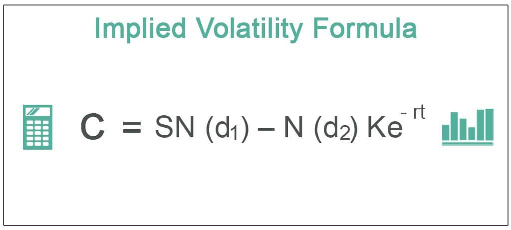

Implied volatility has become a crucial concept in algorithmic trading, especially in the context of options trading. It serves as a market-derived forecast of future volatility, offering insights into market expectations and potential price movement. Unlike historical volatility, which reflects past price swings, implied volatility is a forward-looking measure, deduced from current option prices. This characteristic makes it an invaluable tool for traders aiming to anticipate changes and respond with precision.

In options trading, implied volatility plays a significant role by influencing the pricing of options contracts. Higher implied volatility often leads to higher option premiums due to the increased expected future price fluctuations, whereas lower implied volatility suggests calmer market conditions and lower premiums. Traders often use this measure to gauge market sentiment and inform decision-making processes.



Understanding market expectations and movements is essential for traders looking to capitalize on short-term price changes or manage long-term investment risks. Implied volatility provides insights into these expectations, allowing traders to adjust their strategies accordingly. As a predictive tool, it offers an estimate of how volatile a market might be in the future, assisting traders in their risk management strategies and selections of appropriate investment vehicles.

This article will explore the concept of implied volatility in detail, beginning with a thorough understanding of its definition and its distinction from other types of volatility such as historical and realized volatility. We'll discuss the formula and calculations involved, particularly through the use of models like Black-Scholes, and illustrate how these can be implemented in Python. We will also examine the variables impacting implied volatility, such as supply-demand dynamics, time to expiration, and market sentiment. Furthermore, we will delve into the challenges and risks associated with relying on implied volatility predictions and offer practical tips for traders on how to effectively incorporate this analysis into their trading strategies.

By the end of this article, readers will have a comprehensive understanding of the importance of implied volatility in algorithmic trading, and how it can be leveraged to make informed trading decisions. The content aims to provide both theoretical insights and practical guidance, while also encouraging ongoing learning and adaptation to the ever-evolving financial markets.

## Table of Contents

## What is Implied Volatility?

Implied volatility is a critical concept in the pricing of options, providing insight into the expected fluctuations in an asset's price. It represents the market's forecast of a security's volatility, embedded in options prices. Unlike historical and realized volatility, which are based on past price movements, implied volatility projects future volatility based on the current price of options.

Implied [volatility](/wiki/volatility-trading-strategies) plays a fundamental role in the Black-Scholes model, a widely-used framework for options pricing. In the formula:

$$
C = S_0 \cdot N(d_1) - X \cdot e^{-rT} \cdot N(d_2)
$$

implied volatility is an essential input in the calculation of $d_1$ and $d_2$, and affects the premium of an option. Here, $C$ is the call option price, $S_0$ is the current price of the underlying asset, $X$ is the strike price, $r$ is the risk-free interest rate, $T$ is the time until expiration, and $N$ represents the cumulative distribution function of a standard normal distribution.

The distinction between implied volatility and other volatilities lies in its predictive nature. Historical volatility measures the movement of an asset's price over a specific period in the past, while realized volatility is the actual volatility observed over a given period. Implied volatility, however, reflects the market's forward-looking expectations and is derived from the current market prices of options.

One of the key significances of implied volatility is its ability to encapsulate market expectations. A higher implied volatility suggests that the market anticipates greater price movement, indicating potential uncertainty or risk. Conversely, lower implied volatility may imply stability in the asset's price. This makes implied volatility a valuable metric for traders and analysts who aim to gauge market sentiment and forecast future price dynamics.

Despite its usefulness, there are common misconceptions regarding implied volatility. One such misconception is that it predicts the direction of the price movement; however, implied volatility only indicates the magnitude of expected price changes without providing insights into whether the price will increase or decrease. Additionally, implied volatility can be influenced by external factors such as news events or geopolitical developments, which may cause sudden spikes or declines unrelated to the intrinsic value of the underlying asset.

A limitation of implied volatility is its reliance on option pricing models, which may not always perfectly capture real-world complexities. Models like Black-Scholes assume constant volatility and can sometimes fail during market stress or anomalies. Furthermore, implied volatility is sensitive to the supply and demand dynamics of options trading, which may skew its representation of future volatility. Therefore, traders must combine implied volatility insights with other indicators and market analyses to make informed decisions.

## The Implied Volatility Formula

The Black-Scholes model, developed by Fischer Black, Myron Scholes, and Robert Merton, is fundamental in the field of financial derivatives, particularly for pricing European-style options. This model facilitates the calculation of implied volatility, a critical metric indicating the market's expectations of future price volatility. 

### Black-Scholes Model and Implied Volatility

The Black-Scholes model calculates the theoretical price of options and derives implied volatility from the market prices of these options. The model assumes that the market follows a geometric Brownian motion with constant volatility and interest rates, which enables it to estimate the option's fair value based on several input parameters. 

### Formula and Parameters

The Black-Scholes formula for the price of a European call option is given by:

$$
C = S_0 N(d_1) - X e^{-rT} N(d_2)
$$

where:

- $C$ = Call option price
- $S_0$ = Current stock price
- $X$ = Strike price of the option
- $r$ = Risk-free interest rate
- $T$ = Time to expiration in years
- $N$ = Cumulative distribution function of the standard normal distribution
- $d_1 = \frac{\ln(S_0/X) + (r + \sigma^2/2)T}{\sigma\sqrt{T}}$
- $d_2 = d_1 - \sigma\sqrt{T}$

Here, the volatility parameter $\sigma$ is the implied volatility that the model aims to determine.

### Reverse Engineering Complexity

Implied volatility is not directly observable from the market; it must be inferred by reversing the Black-Scholes formula. Unlike historical volatility, which is calculated from past price data, determining implied volatility involves using the current market price of the option and solving the Black-Scholes equation for $\sigma$. This process typically requires iterative numerical methods, as the equation is not directly solvable for $\sigma$.

### Example Calculation

Consider a call option with the following parameters:

- Current stock price $S_0 = 100$
- Strike price $X = 105$
- Time to expiration $T = 1$ year
- Risk-free interest rate $r = 5\%$
- Market price of the call option $C = 10$

To determine implied volatility, one needs to adjust $\sigma$ in the Black-Scholes equation until the calculated call price equals the market price.

### Python Implementation

```python
from scipy.stats import norm
from scipy.optimize import minimize
import numpy as np

# Black-Scholes formula for call option
def black_scholes_call_price(S, K, T, r, sigma):
    d1 = (np.log(S / K) + (r + sigma**2 / 2) * T) / (sigma * np.sqrt(T))
    d2 = d1 - sigma * np.sqrt(T)
    return S * norm.cdf(d1) - K * np.exp(-r * T) * norm.cdf(d2)

# Objective function to minimize
def objective_function(sigma, S, K, T, r, market_price):
    return (black_scholes_call_price(S, K, T, r, sigma) - market_price) ** 2

# Parameters
S = 100  # Current stock price
K = 105  # Strike price
T = 1    # Time to expiration (in years)
r = 0.05 # Risk-free interest rate
market_price = 10  # Market price of the call option

# Initial guess for implied volatility
initial_sigma = 0.2

# Minimizing the function to find implied volatility
result = minimize(objective_function, initial_sigma, args=(S, K, T, r, market_price), bounds=[(0.001, 3.0)])
implied_volatility = result.x[0]

print(f"The implied volatility is approximately {implied_volatility:.2%}")
```

This Python example harnesses numerical optimization to align the calculated call option price with the observed market price, thereby estimating implied volatility. The procedure illustrates the nuanced and iterative nature of deriving implied volatility, emphasizing the Black-Scholes model’s practical applications in financial analysis.

## Calculating Implied Volatility in Python

To calculate implied volatility using Python, it is essential to utilize specific libraries that provide financial and mathematical functionalities. The process involves setting up the environment, writing the code to compute implied volatility, and interpreting the results for practical application.

### Setting Up the Environment

Before starting the calculation, ensure that Python is installed on your system. It is recommended to use an integrated development environment (IDE) like Jupyter Notebook or PyCharm for writing and executing your code. Additionally, you will need to install several libraries that are commonly used for financial computations. These libraries can be installed via pip, Python’s package manager.

```bash
pip install numpy scipy pandas matplotlib
```

- **NumPy** and **SciPy** offer advanced mathematical functions.
- **Pandas** is used for data manipulation and analysis.
- **Matplotlib** helps with plotting graphs if visual representation is required.

### Example Python Code for Calculating Implied Volatility

The following Python code snippet demonstrates how to calculate implied volatility using the Black-Scholes option pricing model. 

```python
import numpy as np
from scipy.stats import norm
from scipy.optimize import minimize

def black_scholes_call(S, K, T, r, sigma):
    """Calculate the Black-Scholes call option price."""
    d1 = (np.log(S / K) + (r + 0.5 * sigma ** 2) * T) / (sigma * np.sqrt(T))
    d2 = d1 - sigma * np.sqrt(T)
    call_price = S * norm.cdf(d1) - K * np.exp(-r * T) * norm.cdf(d2)
    return call_price

def implied_volatility(Cm, S, K, T, r):
    """Calculate the implied volatility using the Black-Scholes model."""
    # Objective function to minimize
    def objective_function(sigma):
        return (black_scholes_call(S, K, T, r, sigma) - Cm) ** 2

    # Initial guess
    sigma_initial = 0.2

    # Minimize the objective function
    result = minimize(objective_function, sigma_initial, bounds=[(1e-5, 2)], method='L-BFGS-B')
    return result.x[0]

# Example parameters
S = 100  # Current stock price
K = 100  # Option strike price
T = 1    # Time to expiration in years
r = 0.05 # Risk-free interest rate
Cm = 10  # Market price of the call option

# Calculate implied volatility
iv = implied_volatility(Cm, S, K, T, r)
print(f"Implied Volatility: {iv:.2%}")
```

### Interpretation of the Output

The output of the above code provides the implied volatility as a percentage. In this context, implied volatility represents the market's view of the likelihood of changes in a given security's price. A higher implied volatility indicates a greater expected price movement.

### Adjustments for Accuracy

1. **Initial Guess**: The accuracy of the implied volatility computation can depend heavily on the initial guess for the volatility parameter. Adjusting the initial guess may be necessary if the minimization algorithm fails to converge to a realistic solution.

2. **Optimization Bounds**: The bounds in the `minimize` function ensure that the algorithm searches for solutions within a practical range. Adjusting these bounds can prevent the model from exploring unrealistic volatility values.

3. **Method Selection**: While the ‘L-BFGS-B’ method is suitable for bound-constrained problems, other optimization methods might yield better performance depending on the specific characteristics of the input data and market conditions.

In conclusion, calculating implied volatility using Python requires a structured approach involving setting up an appropriate environment, implementing the Black-Scholes option pricing model, and carefully interpreting the results. Adjusting various aspects of the computation process can enhance the accuracy of the implied volatility derived, providing traders and analysts with valuable insight into market expectations.

## Factors Affecting Implied Volatility

Implied volatility, a crucial component in options pricing, is influenced by various factors, each contributing to its dynamic nature. Understanding these factors is essential for traders to make informed decisions and develop robust [algorithmic trading](/wiki/algorithmic-trading) strategies.

### Supply and Demand Dynamics

The primary driver of implied volatility is the supply and demand for options. When demand for options increases due to investors seeking to hedge risks or speculate on market movements, implied volatility tends to rise. Conversely, if the demand wanes, implied volatility often decreases. This phenomenon occurs because the price of an option is inherently linked to its perceived value, which fluctuates based on market participants' collective expectations of future volatility.

### Time to Expiration and Market Conditions

The time until an option's expiration significantly affects its implied volatility. Options with longer expiration periods generally exhibit higher implied volatility as there is more time for price movements to occur, increasing uncertainty. Conversely, options approaching expiration might display lower volatility due to reduced time for potential market movements.

Market conditions, such as periods of economic uncertainty or stability, also play a vital role. In volatile markets, implied volatility tends to spike as traders anticipate larger price swings. On the other hand, in stable markets, implied volatility might decline as expectations of significant market movements decrease.

### External Events and Market Sentiment

External events, such as geopolitical developments, economic reports, and corporate earnings announcements, can trigger volatility spikes. These events create uncertainty regarding future market conditions, prompting traders to adjust their expectations, which is reflected in implied volatility.

Market sentiment, often measured through indicators such as the VIX (Volatility Index), can also impact implied volatility. A bearish sentiment may lead to increased demand for put options as protection against downside risk, pushing implied volatility higher. Conversely, a bullish sentiment might lead to an increase in call option demand, affecting implied volatility similarly.

### Integration into Algorithmic Trading Strategies

Algorithmic trading strategies incorporate these factors to optimize trades. Algorithms can be designed to monitor supply and demand changes, adjust positions based on time to expiration, and react to external events in real-time. By doing so, traders aim to capitalize on implied volatility movements, either by exploiting temporary mispricings or by hedging against adverse moves in implied volatility itself.

For instance, a volatility [arbitrage](/wiki/arbitrage) strategy might involve concurrently buying and selling options to exploit differences in implied volatility across different maturities or strike prices. Additionally, [machine learning](/wiki/machine-learning) models are increasingly employed to predict volatility changes by analyzing historical data, market sentiment indicators, and macroeconomic variables.

By understanding the multifaceted nature of implied volatility and its influencing factors, traders can better anticipate market movements, manage risk, and enhance their trading strategies accordingly.

## Challenges and Risks in Using Implied Volatility

Traders utilizing implied volatility as a predictive tool in algorithmic trading face several challenges and risks, primarily due to the inherent complexities and limitations of this volatility measure. Implied volatility, while providing insights into market expectations, does not always guarantee accuracy or predictability, leading traders to encounter various issues.

One significant challenge is the over-reliance on implied volatility predictions. Traders may be tempted to use implied volatility as the sole indicator of future market movements, believing it to be a definitive reflection of market sentiment. However, implied volatility is driven by supply and demand dynamics in the options market and can often be influenced by speculative actions rather than fundamental market conditions. This reliance can result in misguided trading strategies when the actual market behavior deviates from what implied volatility suggests.

Another issue is market noise, which can obscure true volatility signals. Financial markets are subject to fluctuations caused by numerous factors, including investor sentiment, macroeconomic data releases, and geopolitical events. This noise can lead to erratic movements in implied volatility, making it difficult for traders to distinguish between genuine signals and random variations. As a result, the interpretation of implied volatility measures can be quite challenging, requiring traders to filter out irrelevant data carefully.

Data limitations also impact the accuracy of implied volatility measures. The calculation of implied volatility typically assumes efficient markets and a stable volatility structure, as outlined in models like the Black-Scholes equation:

$$
\text{IV} = \sqrt{\frac{2\pi}{\Delta} \cdot \left(\frac{C - (S_0 - K \cdot e^{-r\Delta})}{S_0}\right)}
$$

where $C$ represents the option price, $S_0$ the current stock price, $K$ the strike price, $r$ the risk-free rate, and $\Delta$ the time to expiration. However, real-world markets often deviate from these assumptions due to incomplete data or inefficiencies, affecting the reliability of implied volatility outputs.

Moreover, the patterns of implied volatility can vary significantly across different instruments and market conditions, thereby influencing trading outcomes. For example, in times of market stress, implied volatility tends to spike, reflecting heightened uncertainty and fear. These volatility patterns, known as volatility smiles or skews, present additional challenges in interpreting volatility measures and developing robust trading strategies.

In conclusion, while implied volatility is a valuable tool for capturing market sentiment and expectations, traders must be wary of its limitations. Rather than relying solely on implied volatility predictions, it is advisable to integrate other market indicators and perform comprehensive data analyses to enhance decision-making processes. Thus, understanding the nuances and potential pitfalls of implied volatility is crucial for effective risk management and successful trading outcomes.

## Practical Tips for Traders

Practical strategies for effectively using implied volatility in trading involve integrating it with a cohesive analytical framework that encompasses various market dynamics. One of the most effective strategies is to diversify your analytical approach, minimizing reliance on a single indicator. While implied volatility is a potent tool for gauging market sentiment and predicting price movement, traders should not disregard other market indicators. One method is to combine implied volatility analysis with technical indicators such as moving averages, relative strength index (RSI), and Bollinger Bands, or fundamental indicators including economic releases and earnings reports. This comprehensive approach helps in validating the signals that implied volatility might be suggesting.

Diversification can also be extended to trading assets and strategies. Employing a mix of options strategies, such as straddles, strangles, and iron condors, can provide a more balanced risk-reward scenario. These strategies allow traders to capitalize on different volatility scenarios, thus reducing the impact of erroneous predictions about implied volatility. An important aspect of diversification is continuously updating and reassessing the basket of indicators and strategies being used, adjusting them according to the changing market conditions and personal risk preferences.

Risk management is an integral component when engaging with implied volatility. Traders should consider the potential for volatility spikes and plan accordingly by setting appropriate stop-loss levels and position sizing. For example, the Kelly Criterion can be employed to determine the optimal size of a series of bets to maximize wealth over time. The formula is:

$$
f^* = \frac{bp - q}{b}
$$

where $f^*$ is the fraction of the trader's capital to bet, $b$ is the odds received on the wager (in decimal form), $p$ is the probability of winning, and $q$ is the probability of losing (which is $1 - p$). This formula can guide traders in balancing their exposure based on their confidence in a trade's success.

Risk management should also [factor](/wiki/factor-investing) in the unpredictable nature of implied volatility, which may be influenced by unforeseen external events, such as geopolitical developments or corporate announcements. Scenario analysis and stress testing can help traders anticipate potential adverse moves and prepare suitable mitigation tactics.

In conclusion, by coupling implied volatility analysis with other market data and maintaining diversified and well-managed trading strategies, traders can better navigate the complexities of the market, optimizing their ability to make informed decisions.

## Conclusion

Implied volatility (IV) remains a pivotal concept in algorithmic trading due to its ability to convey market expectations and potential price movements. As algorithmic strategies evolve, understanding IV's nuances equips traders with the insights necessary for crafting sophisticated trading algorithms. Through emphasizing the probabilistic nature of potential price changes, IV enables algorithms to dynamically adjust to real-time market information.

Looking to the future, the role of volatility analysis is expected to expand significantly. The increasing computational power and the integration of [artificial intelligence](/wiki/ai-artificial-intelligence) in trading strategies are likely to enhance the precision with which IV is used. Machine learning models can incorporate IV data more efficiently, allowing for predictive analytics that refine risk management and strategy optimization. The emergence of big data analytics further supports this trend by offering enhanced tools for analyzing vast sets of market data, including IV fluctuations, thereby improving traders' strategic outlook.

Leveraging IV involves not only using it to gauge market sentiment but also integrating it into broader financial models that consider a range of variables. This multidimensional approach provides a more holistic view of potential market dynamics, allowing traders to make informed decisions that capitalize on short-term opportunities while managing long-term risks.

Continuing education and adaptation are paramount for traders striving to employ IV effectively. The dynamic nature of financial markets means that strategies involving IV must be adaptable, with ongoing adjustments informed by the latest technological advancements and market conditions. As traders become more adept at interpreting and applying IV, they enhance their ability to respond to market changes, thereby maintaining a competitive edge.

In summary, while implied volatility encompasses complexity, its application is integral to successful algorithmic trading. A deep understanding of IV assists in predictive accuracy and strategic execution, which are essential in navigating volatile markets. For traders, the continuous learning and integration of evolving technologies into volatility analysis will be key to maintaining relevance and achieving consistent success in the market.

## Additional Resources

For those interested in enhancing their understanding of implied volatility and its application in options trading and algorithmic strategies, a variety of resources are available. To build a comprehensive knowledge base, consider the following suggestions:

1. **Online Courses and Webinars**: Platforms such as Coursera and edX offer a range of courses on financial markets, options trading, and volatility analysis. For example, [Coursera](https://www.coursera.org/) provides courses from institutions like the University of Illinois and the University of Geneva that cover financial derivatives and risk management. Similarly, [edX](https://www.edx.org/) hosts courses from MIT and Columbia University focusing on financial engineering and data analysis in trading.

2. **Books**: To gain a deeper theoretical understanding, several books offer insights into volatility and options trading. "Options, Futures, and Other Derivatives" by John C. Hull is a staple in the field, providing comprehensive information on derivatives and volatility. Another recommended book is "Options Volatility and Pricing" by Sheldon Natenberg, which offers guidance on trading strategies and risk management.

3. **Tools and Platforms**: Practical experience is crucial, and there are numerous tools and platforms to facilitate hands-on practice of implied volatility calculations. Python libraries such as NumPy, SciPy, and pandas are essential for performing financial computations and analyses. Furthermore, [QuantConnect](https://www.quantconnect.com/) and [Backtrader](https://www.backtrader.com/) are two platforms that allow traders to simulate algorithmic trading strategies using historical data, including volatility calculations.

4. **Webinars and Online Seminars**: To stay current with market trends and advanced techniques, participating in webinars is beneficial. Organizations like the [Options Industry Council](http://www.optionseducation.org/) frequently host educational webinars that cover various aspects of options trading and volatility analysis.

5. **Financial Blogs and Publications**: Regularly reviewing material from established financial blogs and industry publications such as [Investopedia](https://www.investopedia.com/), [The Wall Street Journal](https://www.wsj.com/), and [Bloomberg Markets](https://www.bloomberg.com/markets) keeps traders updated on market developments and expert analyses.

These resources collectively offer a robust framework for developing both theoretical and practical expertise in implied volatility, ensuring traders can leverage this knowledge effectively in their decision-making processes.

## References & Further Reading

[1]: Hull, J. C. (2015). ["Options, Futures, and Other Derivatives."](https://www.semanticscholar.org/paper/Options%2C-Futures%2C-and-Other-Derivatives-Hull/89bdee500c8623864fc9eb7a471546aa713acc44) Pearson Education.

[2]: Natenberg, S. (1994). ["Option Volatility and Pricing: Advanced Trading Strategies and Techniques."](https://www.amazon.com/Option-Volatility-Pricing-Strategies-Techniques/dp/0071818774) McGraw-Hill.

[3]: Black, F., & Scholes, M. (1973). ["The Pricing of Options and Corporate Liabilities."](https://www.cs.princeton.edu/courses/archive/fall09/cos323/papers/black_scholes73.pdf) Journal of Political Economy, 81(3), 637-654.

[4]: Merton, R. C. (1973). ["Theory of Rational Option Pricing."](https://www.semanticscholar.org/paper/Theory-of-Rational-Option-Pricing-Merton/f22256599cc513be281a2a82082d4bac7031def2) Bell Journal of Economics and Management Science, 4(1), 141-183. 

[5]: Jansen, S. (2018). ["Machine Learning for Algorithmic Trading: Second Edition."](https://github.com/PacktPublishing/Machine-Learning-for-Algorithmic-Trading-Second-Edition) Packt Publishing.

[6]: Chan, E. P. (2009). ["Quantitative Trading: How to Build Your Own Algorithmic Trading Business."](https://github.com/ftvision/quant_trading_echan_book) Wiley Trading.