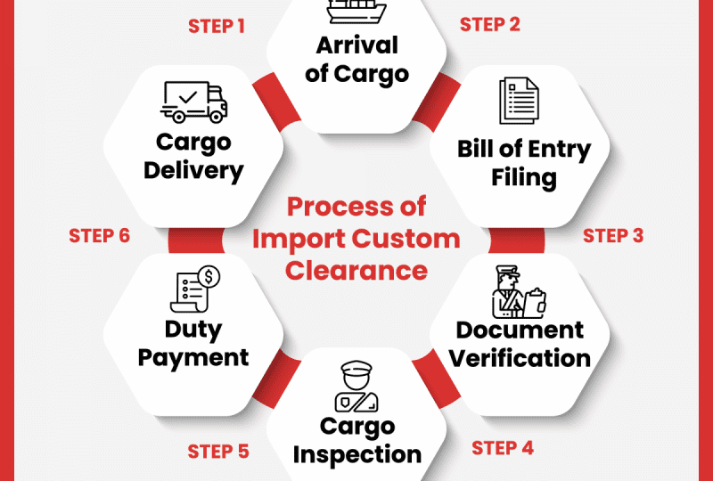

## Table of Contents

## What is import customs duty?

Import customs duty is a tax that a country charges on goods brought in from other countries. When you buy something from another country, the government might add this extra cost to make sure the item is checked and to help protect local businesses. This tax can make imported items more expensive, which might encourage people to buy things made in their own country instead.

The amount of import customs duty can be different depending on the type of product and the country it comes from. Some items might have a higher duty because they are seen as more important to protect, like certain foods or electronics. The duty can also change because of trade agreements between countries, which can make some imports cheaper or more expensive.

## Why is import customs duty imposed?

Import customs duty is put in place mainly to protect local businesses and to raise money for the government. When a country adds a tax on things coming from other places, it can make those items more expensive. This can help local companies because people might choose to buy things made at home instead of the pricier imports. It's like giving local businesses a little advantage in their own country.

Another reason for import customs duty is to control what comes into the country. Governments might want to check that the things coming in are safe and meet their rules. Sometimes, they use this duty to make sure that not too much of a certain product comes in, which can help keep prices stable and protect important industries at home. It's a way to balance what's good for the country's economy and what's good for its people.

## Who is responsible for paying import customs duty?

The person or business that brings goods into a country usually has to pay the import customs duty. This could be someone buying things online from another country or a big company importing products to sell in stores. They need to know about the duty and include it in their costs.

Sometimes, the buyer might not have to pay the duty directly. If you buy something from a foreign website, the seller might already include the duty in the price you pay. But if it's not included, you might have to pay it when the item arrives in your country. It's important to check this before you buy things from other countries.

## How is the amount of import customs duty calculated?

The amount of import customs duty is figured out based on the value of the goods being brought into the country and the duty rate that applies to those goods. Each type of product has its own duty rate, which can be a percentage of the item's value or a fixed amount per unit. For example, if you're importing a shirt that costs $20 and the duty rate for shirts is 10%, you would pay $2 as the duty.

Sometimes, other costs like shipping and insurance are added to the value of the goods before calculating the duty. This is called the "duty-inclusive value." If the shirt's shipping cost is $5 and the insurance is $1, the total value becomes $26. With the same 10% duty rate, you would then pay $2.60 in duty. It's important to know these details to figure out how much you'll need to pay in total.

## What are the different types of import customs duties?

There are a few different types of import customs duties that countries use. One type is called "ad valorem duty," which means the duty is a percentage of the value of the goods. For example, if you import a toy that costs $100 and the duty rate is 5%, you would pay $5 in duty. Another type is "specific duty," where you pay a fixed amount for each unit of the product, no matter its value. If the duty is $2 per toy, you would pay $2 no matter how much the toy costs.

Another kind of duty is "compound duty," which is a mix of both ad valorem and specific duties. For instance, you might pay 5% of the toy's value plus $2 per toy. There's also "tariff rate quotas," where a lower duty rate applies up to a certain amount of imports, and a higher rate kicks in after that limit is reached. This helps control how much of a product comes into the country.

These different types of duties help governments manage imports in various ways. They can protect local industries, raise money, and control the flow of goods into the country. Knowing which type of duty applies to your imports can help you plan and budget better.

## Can import customs duty rates vary by country?

Yes, import customs duty rates can be different from one country to another. Each country decides its own duty rates based on what they want to protect or encourage. For example, a country might have high duty rates on electronics to help its own electronic companies, but low rates on raw materials that its factories need.

These rates can also change because of trade agreements between countries. If two countries have a special deal, they might agree to lower duty rates on certain products to make trade easier. So, a shirt might cost more to import from one country than from another, depending on these agreements and the policies of the country you're importing to.

## What documentation is required to pay import customs duty?

To pay import customs duty, you need to have some important papers ready. The main one is the commercial invoice, which shows what you are importing and how much it costs. You also need a packing list that tells the customs people what's inside the boxes. Another important document is the bill of lading or air waybill, which shows how the goods are being shipped.

Sometimes, you might need more papers depending on what you are importing. If you are bringing in things like food or medicine, you might need a certificate that says they are safe. Also, if your country has special rules about where the goods come from, you might need a certificate of origin to show where they were made. Having all these documents ready helps make sure you can pay the duty and get your goods through customs without problems.

## How can one estimate the import customs duty before importing goods?

To estimate the import customs duty before importing goods, you need to know the value of the goods and the duty rate that applies to them. You can find the duty rate by checking the customs tariff schedule for your country, which lists the duty rates for different types of products. Once you know the duty rate, you can calculate the duty by multiplying the value of the goods by the duty rate. For example, if you are importing a toy worth $100 and the duty rate is 10%, you would pay $10 in duty.

Sometimes, you also need to add other costs like shipping and insurance to the value of the goods before calculating the duty. This is called the "duty-inclusive value." If the toy's shipping cost is $5 and the insurance is $1, the total value becomes $106. With the same 10% duty rate, you would then pay $10.60 in duty. It's a good idea to check with a customs broker or use an online duty calculator to make sure you get the right estimate, as duty rates can change and other factors might affect the final amount you need to pay.

## Are there any exemptions or reductions available for import customs duty?

Yes, there are some times when you might not have to pay import customs duty or you might pay less. Some countries have special rules that let you bring in certain things without paying duty. For example, if you are moving to a new country, you might not have to pay duty on your personal stuff like clothes and furniture. Also, small gifts sent to you from another country might not have duty if they are under a certain value. Some countries also have programs where businesses can import materials to make things without paying duty right away, as long as they use those materials in their products.

Another way to pay less duty is through trade agreements between countries. These agreements can make the duty rates lower for certain products from certain countries. For example, if your country has a trade deal with another country, you might pay less duty on electronics or cars from there. Sometimes, governments also give duty reductions to help certain industries or to encourage people to buy more of certain things. It's a good idea to check with your country's customs office or a customs broker to see if you can get any exemptions or reductions on the duty you need to pay.

## What are the consequences of not paying import customs duty?

If you don't pay the import customs duty, you might get in trouble. The customs office can stop your goods from coming into the country until you pay the duty. They might even take your goods away if you don't pay. This can be a big problem if you need those goods for your business or if they are something important to you.

Not paying the duty can also lead to fines or other punishments. The government might make you pay extra money as a penalty for not following the rules. In some cases, if you keep not paying, you could even face legal action. It's always best to pay the duty on time to avoid these kinds of problems.

## How does import customs duty affect international trade?

Import customs duty can make international trade harder or easier depending on how it's used. When a country puts a high duty on imported goods, it makes those goods more expensive for people in that country. This can make it tough for businesses from other countries to sell their products there. They might decide to sell in other places where the duty is lower or not sell there at all. This can slow down trade between countries because fewer goods are moving across borders.

On the other hand, import customs duty can also help international trade in some ways. Countries sometimes use duty to protect their own businesses, but they also make trade agreements with other countries to lower these duties. When countries agree to lower duties on certain products, it can make those products cheaper and easier to trade. This can lead to more trade between countries because it's easier for businesses to sell their goods in new markets. So, while high duties can make trade harder, smart use of duties can help trade grow.

## What role do international trade agreements play in import customs duty?

International trade agreements help countries work together to make trading easier. These agreements often include rules about import customs duty. They can lower the duty rates on certain products from countries that are part of the agreement. This makes the products cheaper and can help businesses sell more in other countries. For example, if two countries agree to lower duties on cars, it might be easier for a car company from one country to sell cars in the other country.

These agreements are important because they can change how much duty you have to pay. When countries make these deals, they are trying to help their own businesses sell more abroad and get more products at home. But not all products are treated the same. Some might still have high duties, while others might have no duty at all. It all depends on what the countries agree on. This can make a big difference in how much it costs to import things and how much trade happens between countries.

## What is the difference between Import Duty and Customs Duty?

Import duty, commonly referred to as customs duty, is a fiscal levy imposed by governments on goods and services entering a country. These duties are a vital component of international trade, serving to protect domestic industries from foreign competition, generate revenue for the government, and control the flow of goods and services across borders.

The calculation of import duty is typically based on the value of the imported goods. This valuation generally includes the cost of the goods themselves, the cost of shipping, and any insurance paid. This total is often referred to as the CIF value (Cost, Insurance, and Freight). The duty amount can be expressed with the formula:

$$
\text{Import Duty} = \text{CIF value} \times \text{Duty Rate}
$$

Countries have distinct systems and tariffs influencing how these calculations are made. These systems are typically outlined in a Harmonized Tariff Schedule (HTS), which standardizes the classification of goods and correlates each category with a specific duty rate. The HTS is complex and detailed, providing a systematic guide for determining the appropriate classification and duty rate for each type of good.

Besides the basic cost of the goods, the country of origin is a critical [factor](/wiki/factor-investing) in the calculation of import duties. Origin can influence the duty rate due to international trade agreements that might stipulate preferential or reduced rates for certain countries. 

Many nations have intricate tariffs and trade agreements affecting the duties imposed, reflecting the selective and strategic application of tariffs to serve national interests. By using a specific classification under the HTS, importers can ensure accuracy in duty payments and avoid potential legal penalties associated with misclassification.

Understanding the implications of these duties and tariffs helps businesses make informed decisions when engaging in international trade. Keeping track of the myriad regulations and rate changes can be challenging, yet crucial for maintaining compliance and optimizing trade-related expenses.

## References & Further Reading

[1]: ["The Harmonized Tariff Schedule (HTS)"](https://hts.usitc.gov/) - U.S. International Trade Commission.

[2]: Lopez de Prado, M. (2018). ["Advances in Financial Machine Learning."](https://www.amazon.com/Advances-Financial-Machine-Learning-Marcos/dp/1119482089) John Wiley & Sons.

[3]: Aronson, D. R. (2011). ["Evidence-Based Technical Analysis: Applying the Scientific Method and Statistical Inference to Trading Signals."](https://www.wiley.com/en-us/Evidence+Based+Technical+Analysis%3A+Applying+the+Scientific+Method+and+Statistical+Inference+to+Trading+Signals-p-9780470008744) John Wiley & Sons.

[4]: Jansen, S. (2020). ["Machine Learning for Algorithmic Trading: Predictive models to extract signals from market and alternative data for systematic trading strategies with Python."](https://www.amazon.com/Machine-Learning-Algorithmic-Trading-alternative/dp/1839217715) Packt Publishing.

[5]: Chan, E. P. (2008). ["Quantitative Trading: How to Build Your Own Algorithmic Trading Business."](https://github.com/ftvision/quant_trading_echan_book) John Wiley & Sons.