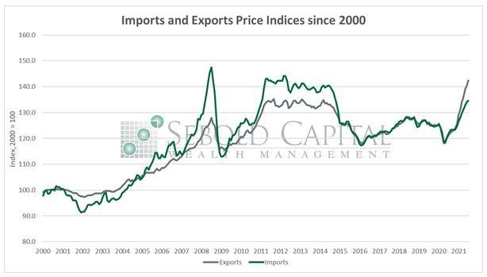

## Table of Contents

## What is the Import and Export Price Index (IEPI)?

The Import and Export Price Index (IEPI) is a measure used to track the changes in the prices of goods and services that a country imports and exports. It helps to understand how the costs of these goods and services are changing over time. This information is important for businesses and policymakers because it can affect decisions about trade, pricing, and economic strategies.

The IEPI is calculated by collecting data on the prices of a wide range of products that are traded internationally. This includes everything from raw materials like oil and steel to finished products like cars and electronics. By comparing these prices over time, the IEPI provides a clear picture of inflation or deflation in the prices of traded goods. This helps economists and businesses to make better predictions about future price trends and to adjust their strategies accordingly.

## Why is the Import and Export Price Index important for economists?

The Import and Export Price Index (IEPI) is important for economists because it helps them understand how the prices of goods and services that a country buys and sells to other countries are changing. This information is key for economists to see if the prices are going up (inflation) or going down (deflation). By knowing this, economists can predict how these price changes might affect the country's economy. For example, if the prices of imports go up a lot, it might make things more expensive for people in the country, which could slow down the economy.

Economists also use the IEPI to help make decisions about trade policies. If the IEPI shows that the prices of exports are going down, it might mean that the country's goods are becoming cheaper on the world market. This could be good for selling more goods to other countries, but it might also mean that the country is making less money from its exports. By looking at the IEPI, economists can suggest changes to trade policies that could help the country's economy grow stronger.

## How is the Import and Export Price Index calculated?

The Import and Export Price Index (IEPI) is calculated by collecting price data from a wide range of goods and services that a country trades with other countries. This includes things like raw materials, such as oil and steel, and finished products, like cars and electronics. The data is gathered from businesses and organizations that are involved in importing and exporting. These prices are then compared to a base period to see how much they have changed over time. This comparison helps to create an index that shows whether the prices of imports and exports are going up or down.

To make the IEPI, economists use a method called "weighting." This means they give more importance to the prices of goods and services that are traded a lot. For example, if a country exports a lot of oil, the price changes of oil will have a bigger effect on the IEPI than the price changes of a product that is not traded as much. By using weighting, the IEPI gives a more accurate picture of how the overall prices of imports and exports are changing. This helps economists and policymakers understand the trends and make better decisions about the economy.

## What are the main components of the Import and Export Price Index?

The Import and Export Price Index (IEPI) is made up of two main parts: the Import Price Index and the Export Price Index. The Import Price Index looks at the prices of goods and services that a country buys from other countries. This includes things like oil, cars, and electronics. The Export Price Index looks at the prices of goods and services that a country sells to other countries. This can include things like agricultural products, machinery, and textiles.

Each part of the IEPI is calculated by collecting price data from businesses and organizations that import or export goods and services. This data is then compared to a base period to see how prices have changed over time. The prices are also given different weights based on how much of each product is traded. For example, if a country imports a lot of oil, the price changes of oil will have a bigger effect on the Import Price Index than the price changes of a product that is not imported as much. This helps to make the IEPI a good measure of how the overall prices of imports and exports are changing.

## How frequently is the Import and Export Price Index updated?

The Import and Export Price Index (IEPI) is usually updated once a month. This means that every month, new data is collected and the index is recalculated to show the latest changes in the prices of imports and exports. This monthly update helps economists and businesses to keep track of price changes and make timely decisions.

By updating the IEPI monthly, it stays current and reflects the most recent economic conditions. This is important because prices can change quickly due to things like changes in the world economy, new trade deals, or even natural disasters. Having up-to-date information helps everyone understand the economy better and plan for the future.

## What is the difference between the Import Price Index and the Export Price Index?

The Import Price Index and the Export Price Index are two parts of the Import and Export Price Index. The Import Price Index tracks the changes in the prices of goods and services that a country buys from other countries. This can include things like oil, cars, and electronics. It helps to show how much more or less a country is paying for the things it imports over time.

The Export Price Index, on the other hand, tracks the changes in the prices of goods and services that a country sells to other countries. This can include things like agricultural products, machinery, and textiles. It shows how the prices of a country's exports are changing, which can affect how much money the country makes from selling its goods and services to other countries.

Both indexes are important because they help economists and businesses understand the overall trends in trade prices. The Import Price Index can show if the cost of goods coming into a country is going up or down, which can affect the economy. The Export Price Index can show if the country is getting more or less money for its exports, which can also have a big impact on the economy.

## How does the Import and Export Price Index affect inflation rates?

The Import and Export Price Index (IEPI) can affect inflation rates because it shows how the prices of goods and services that a country buys and sells to other countries are changing. If the prices of imports go up a lot, it can lead to higher inflation in the country. This happens because the things that people buy every day, like gas for their cars or electronics, might cost more. When these prices go up, it can make everything more expensive, and that's what inflation is all about.

On the other hand, if the prices of exports go up, it can sometimes help to keep inflation down. When a country sells its goods and services for more money, it can make more money from other countries. This extra money can help the country's economy grow without needing to print more money, which can keep inflation in check. But if the prices of exports go down, it might mean less money coming in, which could lead to higher inflation if the country needs to print more money to make up for it.

## What are the common uses of the Import and Export Price Index in business?

Businesses use the Import and Export Price Index (IEPI) to help them make smart choices about buying and selling things. If the IEPI shows that the prices of things they need to buy from other countries are going up, businesses might decide to buy more now before the prices get even higher. Or, they might look for cheaper places to buy from. On the other hand, if the IEPI shows that the prices of things they sell to other countries are going down, businesses might need to find ways to make their products cheaper or different so they can still make money.

The IEPI also helps businesses plan for the future. By looking at the IEPI, businesses can guess what prices might do next. This can help them decide how much to charge for their products or how much to pay for the things they need. Knowing what the IEPI says can also help businesses talk to their customers about why prices might be changing. This way, they can keep their customers happy and keep making money even when prices go up or down.

## How can changes in the Import and Export Price Index influence monetary policy?

Changes in the Import and Export Price Index (IEPI) can influence monetary policy because they show how the prices of things a country buys and sells to other countries are changing. If the IEPI shows that import prices are going up a lot, it can mean that inflation is going up too. When this happens, the people in charge of the country's money, like the central bank, might decide to raise interest rates. This makes borrowing money more expensive, which can slow down spending and help keep inflation under control.

On the other hand, if the IEPI shows that export prices are going up, it can mean that the country is making more money from selling things to other countries. This can help the economy grow without needing to print more money, which can also help keep inflation in check. But if export prices go down, it might mean less money coming in, and the central bank might need to lower interest rates to encourage more spending and help the economy grow. By watching the IEPI, the people who make monetary policy can make better choices about how to keep the economy stable.

## What are the limitations of the Import and Export Price Index as an economic indicator?

The Import and Export Price Index (IEPI) is a helpful tool, but it has some limitations. One big problem is that it doesn't show everything about the economy. The IEPI only looks at the prices of things a country buys and sells to other countries. It doesn't tell us about the prices of things people buy inside the country, like food at the grocery store or rent. So, if prices are going up a lot for things people buy every day, the IEPI might not show that.

Another limitation is that the IEPI can be slow to show changes. It takes time to collect all the price data from businesses and then calculate the index. By the time the IEPI is updated, the prices might have changed again. This can make it hard for businesses and policymakers to make quick decisions based on the IEPI. Also, the IEPI uses weights to give more importance to things that are traded a lot. If these weights are not right, the IEPI might not give a good picture of how prices are really changing.

## How do global trade agreements impact the Import and Export Price Index?

Global trade agreements can change the Import and Export Price Index (IEPI) because they make it easier or harder for countries to buy and sell things to each other. If a new trade deal makes it cheaper for a country to import things, the prices of those imports might go down. This can make the Import Price Index go down too. On the other hand, if a trade deal makes it harder to import things, maybe because of new taxes or rules, the prices of imports might go up, and the Import Price Index would show that.

Trade agreements can also affect the Export Price Index. If a deal helps a country sell more things to other countries, the prices of those exports might go up because more people want to buy them. This would make the Export Price Index go up. But if a trade deal makes it harder to sell things, maybe because other countries put up barriers, the prices of exports might go down, and the Export Price Index would show that. So, trade agreements can really change how the IEPI looks by making the prices of imports and exports go up or down.

## What advanced statistical methods are used to refine the accuracy of the Import and Export Price Index?

To make the Import and Export Price Index (IEPI) more accurate, economists use a method called regression analysis. This helps them understand how different things, like changes in the world economy or new trade deals, affect the prices of imports and exports. By using regression analysis, they can see which factors are most important and adjust the IEPI to make it a better measure of price changes. This method helps to make sure the IEPI is not just showing random changes but is really showing what's happening in the economy.

Another way to improve the IEPI is by using something called seasonal adjustment. Prices can go up and down at certain times of the year, like during holidays or because of the weather. Seasonal adjustment helps to take out these regular changes so the IEPI can show the real trends in prices. By doing this, economists can see if prices are going up or down because of bigger economic changes, not just because it's a busy time of year. This makes the IEPI a more reliable tool for understanding the economy.

## How are Import and Export Price Indexes compiled?

Data for import and export price indexes is derived from exporter declarations and import documents, providing a foundational dataset for price analysis. These documents detail the transaction prices of goods and services that cross international borders, serving as primary sources for measuring price changes over time. The indexes do not include all global transactions; for instance, they typically omit military goods, unique art pieces, and used items, focusing instead on standard commercial trade categories.

Currency conversion is an integral part of compiling these indexes, given that international trade is conducted in various currencies, not exclusively in U.S. dollars. Prices are converted to the local currency utilizing the average exchange rates from the previous month. This conversion is crucial for accurate price comparisons and economic analysis across different periods. The formula used is straightforward:

$$
\text{Converted Price} = \text{Price in Foreign Currency} \times \text{Average Exchange Rate}
$$

By standardizing prices in a common currency, analysts can discern genuine price trends without the distortions introduced by fluctuating exchange rates.

The Bureau of Labor Statistics (BLS) employs a base year index value of 100, simplifying temporal comparisons and trend analyses. Such a base year system allows for a relative measurement of price changes. For instance, an index value of 110 suggests a 10% increase in prices since the base year. 

These methodologies enable policymakers and businesses to assess international trade conditions accurately. By understanding these price movements, stakeholders can gauge economic activities' impact on inflation, competitive positioning, and overall market health. Adjustments in price indexes often signal shifts in trade patterns, production costs, and consumer demand, making them indispensable for strategic planning and economic forecasting.

## References & Further Reading

[1]: ["US Import and Export Price Indexes"](https://www.bls.gov/mxp/) - Bureau of Labor Statistics

[2]: ["Exchange Rate Economics: Theories and Evidence"](https://www.taylorfrancis.com/books/mono/10.4324/9780203380185/exchange-rate-economics-ronald-macdonald) by Ronald MacDonald

[3]: ["Algorithmic Trading and DMA: An Introduction to Direct Access Trading Strategies"](https://www.amazon.com/Algorithmic-Trading-DMA-introduction-strategies/dp/0956399207) by Barry Johnson

[4]: ["Advances in Financial Machine Learning"](https://www.amazon.com/Advances-Financial-Machine-Learning-Marcos/dp/1119482089) by Marcos Lopez de Prado

[5]: ["International Macroeconomics and Finance: Theory and Econometric Methods"](https://archive.org/details/internationalmac0000mark) by Nelson Mark