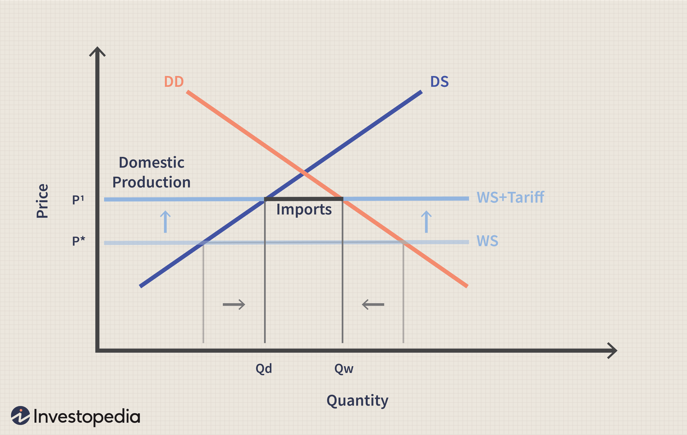

The global market is influenced by a variety of price indexes that significantly impact trading activities. Among these, import and export price indexes hold particular importance for businesses engaged in international trade. These indexes provide crucial insights into the price trends of goods and services traded across borders, offering a window into global demand and supply dynamics. 

In the current economic landscape, understanding these indexes is vital for businesses looking to remain competitive in the international arena. Import and export price indexes help companies strategize their pricing models, manage risk, and anticipate market trends. By reflecting the changing costs of goods and services, these indexes enable businesses to adapt to economic fluctuations and position their products advantageously in the global market.

This article will explore the significance of import and export price indexes and their growing relevance in algorithmic trading. Algorithmic trading, characterized by the use of computer programs to execute trading strategies at speeds and frequencies that are impossible for human traders, has revolutionized the way price index data is utilized. By offering timely and precise data, import and export price indexes empower algorithmic systems to make informed, real-time trading decisions. This reliance on automated systems not only enhances efficiency but also reduces the potential for human error in trading operations.

Furthermore, the influence of these indexes extends beyond individual businesses, affecting entire economies worldwide. Shifts in import and export pricing can signal broader economic trends, such as inflationary pressures or changes in consumer demand, making these indexes valuable tools for economic forecasting and policy-setting. As global trading continues to evolve amidst technological advancements and geopolitical shifts, the role of import and export price indexes will undoubtedly remain central to economic planning and decision-making.

## Table of Contents

## Understanding Import and Export Price Indexes

The import and export price indexes are crucial metrics that capture the fluctuations in prices of goods and services that a country buys from and sells to international markets. These indexes offer essential insights into the economic strength and global demand for a nation's products and services. They are updated monthly by the Bureau of Labor Statistics (BLS), which reflects ongoing changes in price dynamics influenced by various factors, including supply and demand, currency fluctuations, and global economic conditions.

The import price index measures the average change in prices paid by a specific country for goods and services bought from abroad. Conversely, the export price index tracks the average change in prices received by a country for goods and services it sells internationally. These indexes exclude certain categories, such as military goods, art, used items, and several non-merchandise contingents, maintaining a focus on primary, standardized goods and services which facilitates cleaner comparisons and analyses.

Understanding import and export price indexes is essential for businesses engaged in international trade. These metrics help companies strategize effectively by providing information necessary for planning competitive pricing strategies. For example, a rise in the import price index might signal increased costs for raw materials, prompting businesses to reassess their sourcing strategies or explore alternative suppliers to maintain profitability.

Furthermore, these indexes allow businesses to gauge global economic conditions. A rising export price index might indicate strengthened global demand for a country's goods, suggesting an opportunity for expanded production or new market entry. By keeping abreast of these changes, stakeholders can make data-driven decisions, reducing risks and capitalizing on favorable market conditions.

In essence, the systematic analysis of import and export price indexes empowers businesses to adapt to economic shifts efficiently, ensuring competitive positioning in the volatile arena of global trade.

## How Import and Export Price Indexes Are Compiled

Data for import and export price indexes is derived from exporter declarations and import documents, providing a foundational dataset for price analysis. These documents detail the transaction prices of goods and services that cross international borders, serving as primary sources for measuring price changes over time. The indexes do not include all global transactions; for instance, they typically omit military goods, unique art pieces, and used items, focusing instead on standard commercial trade categories.

Currency conversion is an integral part of compiling these indexes, given that international trade is conducted in various currencies, not exclusively in U.S. dollars. Prices are converted to the local currency utilizing the average exchange rates from the previous month. This conversion is crucial for accurate price comparisons and economic analysis across different periods. The formula used is straightforward:

$$
\text{Converted Price} = \text{Price in Foreign Currency} \times \text{Average Exchange Rate}
$$

By standardizing prices in a common currency, analysts can discern genuine price trends without the distortions introduced by fluctuating exchange rates.

The Bureau of Labor Statistics (BLS) employs a base year index value of 100, simplifying temporal comparisons and trend analyses. Such a base year system allows for a relative measurement of price changes. For instance, an index value of 110 suggests a 10% increase in prices since the base year. 

These methodologies enable policymakers and businesses to assess international trade conditions accurately. By understanding these price movements, stakeholders can gauge economic activities' impact on inflation, competitive positioning, and overall market health. Adjustments in price indexes often signal shifts in trade patterns, production costs, and consumer demand, making them indispensable for strategic planning and economic forecasting.

## Impact on the Economy

Import and export price indexes play a pivotal role in analyzing and understanding economic trends, particularly those related to inflation and overall economic health. These indexes serve as crucial barometers for assessing the pricing dynamics of a nation in the global marketplace. One of their primary functions is to provide insights into inflation trends. By examining the fluctuations in the prices of imported and exported goods, economists and policymakers can identify underlying inflationary or deflationary pressures within an economy. For instance, a sustained increase in import prices might suggest rising inflationary trends, as more expensive imports can lead to higher costs for consumers and businesses, thereby influencing the consumer price index (CPI).

These indexes are integral to the formulation of fiscal and monetary policies. Policymakers rely on them to understand consumer behavior and inflation dynamics, which in turn influence [interest rate](/wiki/interest-rate-trading-strategies) decisions and monetary supply adjustments. For example, if export price indexes show a significant increase, indicating higher demand for a country's goods, this could prompt a review of export tariffs and trade policies to capitalize on foreign markets.

Moreover, import and export price indexes assist in the accurate measurement of exchange rates, providing a reliable metric for fair trade negotiations and contracts. Fluctuations in these indexes can affect the terms of trade, which is a critical component of international economic agreements. For example, if a country's export prices increase relative to its import prices, the terms of trade improve, suggesting that the country can obtain more goods for the same amount of exports.

Investors also closely monitor these indexes as they can have substantial impacts on market dynamics and investment strategies. Changes in import and export prices influence company earnings forecasts, stock valuations, and investment portfolios. For instance, a rise in import prices could signal increased costs for industries reliant on foreign raw materials, potentially affecting their stock performance and making them less attractive to investors.

In summary, import and export price indexes are essential tools for understanding economic conditions, setting effective policies, negotiating trade agreements, and guiding investment decisions. By providing a clear picture of price movements in international trade, these indexes facilitate informed decision-making at various levels of the economy.

## Role in Algorithmic Trading

Algorithmic trading has emerged as a pivotal tool for leveraging price index data, including import and export price indexes, to facilitate automated decision-making and develop market strategies. Utilizing sophisticated algorithms, these systems can process large volumes of data swiftly, allowing traders to gain competitive advantages by promptly responding to changes in price exposures.

The import and export price indexes provide real-time indications of economic shifts, reflecting the rising or declining costs of goods and services traded internationally. Algorithmic trading systems integrate these indexes into their models to dynamically adjust investment portfolios, aligning them with current market conditions. Such adjustments help capitalize on discrepancies and opportunities in fluctuating global trade prices, thereby optimizing returns for traders.

One of the primary advantages of employing [algorithmic trading](/wiki/algorithmic-trading) lies in its ability to reduce human error. Algorithms can execute predefined rules with consistent precision, ensuring that trading decisions are made based on quantifiable data rather than emotional biases or delayed judgments. This precision is crucial in volatile markets, where rapid changes in import and export price indexes can significantly impact asset valuation and trading strategies.

Moreover, algorithmic trading enhances operational efficiency by processing complex data sets at a pace far beyond human capability. With the integration of [machine learning](/wiki/machine-learning) and [artificial intelligence](/wiki/ai-artificial-intelligence), these systems continuously refine their algorithms, learning from historical data to improve future predictions. This adaptability is particularly beneficial in volatile economic landscapes, where swift and informed decisions are essential.

In essence, algorithmic trading transforms the utilization of import and export price indexes by streamlining processes, enhancing predictive accuracy, and facilitating swift adaptation to economic changes. This technological integration not only maximizes trading efficiency but also positions stakeholders to make proactive and well-informed decisions in the evolving landscape of global trade.

## Examples of Price Index Influences

A significant change in the export price index can substantially impact a company's international sales strategies. When the export price index rises, it indicates an increase in the price of goods being sold overseas, potentially affecting their competitiveness in global markets. Exporting companies might respond to this shift by adjusting their pricing strategies, perhaps by seeking ways to reduce production costs to maintain competitive pricing or exploring new markets where demand remains strong despite higher prices. Conversely, a decrease in the export price index can be leveraged to boost sales by promoting price advantages and expanding market share.

For businesses reliant on imports, an increase in the import price index typically signals higher costs for goods and services acquired from abroad. This scenario prompts companies to seek cost-effective alternatives to maintain profit margins. They might explore sourcing materials from different countries, investing in local production capabilities, or enhancing operational efficiencies. Such strategic shifts can mitigate the impact of rising import prices and preserve business viability.

Historical data from import and export price indexes has proven instrumental in predicting future economic conditions. By analyzing past trends, economists and investors can identify patterns that signal economic shifts, such as inflation or changes in trade balances. For instance, a consistent upward trend in the import price index may anticipate inflationary pressures, prompting central banks to consider monetary policy adjustments. Similarly, fluctuations in export indexes might be used to forecast changes in a country's trade surplus or deficit.

Overall, the import and export price indexes serve as critical tools for shaping strategic decisions in both the private and public sectors, impacting everything from business operations to macroeconomic policies.

## Conclusion

The importance of understanding import and export price indexes is foundational for both businesses and investors in today's interconnected global economy. These indexes serve as critical tools that provide insights into global market trends, which are essential for devising effective trading strategies and making informed investment decisions.

Algorithmic trading systems, which rely heavily on quantitative data, leverage the insights from import and export price indexes to optimize trading strategies. By incorporating these indexes, algorithmic models enhance their predictive accuracy, helping traders to navigate market volatilities with precision. For example, a surge in the export price index can signal an improved competitiveness of a country's products, prompting algorithmic systems to adjust asset allocations favorably.

Moreover, staying updated with changes in these price indexes enables stakeholders to anticipate market trends and adjust their strategies accordingly. This forward-looking approach supports businesses in maintaining competitive pricing, managing supply chain risks, and optimizing resource allocation. Investors, on the other hand, can better assess exchange rate movements and inflationary pressures, influencing their investment choices toward diversified portfolios that minimize risks and leverage potential gains.

As the landscape of global trade continuously evolves, the relevance of import and export price indexes in economic forecasting and planning becomes ever more significant. They not only aid in understanding the past economic performances but also pave the way for projecting future economic scenarios, thereby guiding fiscal and monetary policy-making. Businesses that prioritize the analysis of these indexes will be better positioned to adapt to shifting market dynamics and capitalize on emerging opportunities. Hence, the strategic incorporation of price index data remains a powerful advantage in navigating the complexities of the global market.

## References & Further Reading

[1]: ["US Import and Export Price Indexes"](https://www.bls.gov/mxp/) - Bureau of Labor Statistics

[2]: ["Exchange Rate Economics: Theories and Evidence"](https://www.taylorfrancis.com/books/mono/10.4324/9780203380185/exchange-rate-economics-ronald-macdonald) by Ronald MacDonald

[3]: ["Algorithmic Trading and DMA: An Introduction to Direct Access Trading Strategies"](https://www.amazon.com/Algorithmic-Trading-DMA-introduction-strategies/dp/0956399207) by Barry Johnson

[4]: ["Advances in Financial Machine Learning"](https://www.amazon.com/Advances-Financial-Machine-Learning-Marcos/dp/1119482089) by Marcos Lopez de Prado

[5]: ["International Macroeconomics and Finance: Theory and Econometric Methods"](https://archive.org/details/internationalmac0000mark) by Nelson Mark