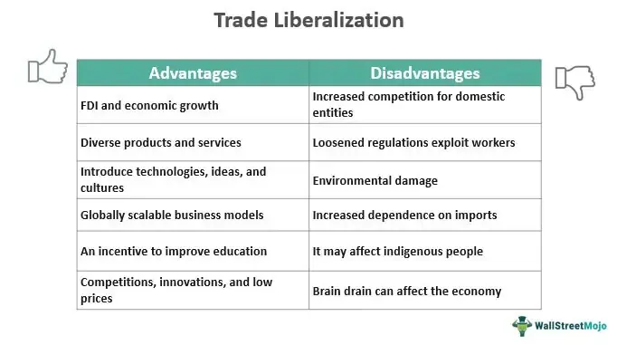

The global economy is significantly shaped by the dual forces of trade imports and algorithmic trading, both of which have profound impacts on market dynamics and economic structures. Trade imports involve the acquisition of goods and services from international sources, serving as a fundamental component of international trade. These imports are essential for fulfilling domestic demands that cannot be met due to inefficiencies or competitive disadvantages in local industries. The interplay between imports and exports creates a balance of trade, with the potential for trade deficits when imports surpass exports, thereby influencing economic stability and growth.

Concurrently, algorithmic trading has transformed financial markets by employing intricate algorithms to streamline trading processes. The efficiency and speed offered by algorithmic methods have revolutionized how financial decisions are made, resulting in increased market liquidity and efficiency. However, these advancements have introduced challenges, such as heightened market volatility, evident in instances like flash crashes.

Exploring these elements in tandem reveals their interconnectedness and the broader implications for both global and domestic economies. As trade imports affect the flow of goods and services across borders, algorithmic trading influences how financial markets react to trade policies, tariffs, and other economic variables. Understanding these dynamics enables stakeholders—such as policymakers, economists, and businesses—to navigate the complexities of modern economic landscapes more effectively. This comprehensive examination provides valuable insights into anticipating market trends, formulating adaptive strategies, and promoting economic resilience, allowing for strategic engagement with evolving economic forces to ensure stability and growth.

## Table of Contents

## Understanding Trade Imports

Trade imports encompass the acquisition of goods or services from external markets, serving as an integral part of international trade dynamics. The decision for a country to import certain goods often hinges on the efficiency and cost-competitiveness of production within its domestic industries. Nations are inclined to import items that they are unable to produce sufficiently or where production costs would be prohibitively high relative to other countries. For example, Japan imports large quantities of oil and gas due to its limited natural resources, whereas nations like Saudi Arabia export these commodities owing to their abundance.

The influence of free trade agreements (FTAs) and tariffs is significant in shaping import dynamics. FTAs, such as the North American Free Trade Agreement (NAFTA), now succeeded by the United States-Mexico-Canada Agreement (USMCA), promote reduced tariffs and trade barriers between member nations, thereby facilitating increased imports. Conversely, tariffs, imposed as a form of taxation on imports, can hinder trade by increasing the cost of foreign goods, thereby protecting domestic industries from foreign competition. This protectionism can alter the competitive landscape and influence the economic balance by modifying trade flows.

The balance of trade is a critical concept, wherein a nation’s imports and exports are assessed to determine trade surpluses or deficits. A trade deficit occurs when a country's imports surpass its exports, which can have widespread economic implications. Persistent trade deficits may lead to a nation incurring debt to finance its imports, potentially impacting its currency value and leading to inflationary pressures.

The role and impact of imports are essential for gauging their contribution to economic stability and growth. Imports can drive competition and innovation, providing consumers with access to a variety of products and fostering an environment of efficiency and productivity among domestic producers. However, it's important to balance imports with domestic capabilities to ensure long-term economic resilience and to avoid over-reliance on foreign markets for essential goods and services. 

Understanding these aspects of trade imports provides insights into how they are interwoven with domestic economic strategies and their broader impact on the global economy. This understanding is crucial for policymakers and businesses aiming to formulate strategies that leverage international trade benefits while safeguarding national economic interests.

## The Evolution of Algorithmic Trading

Algorithmic trading has revolutionized financial markets by employing sophisticated mathematical models to execute transactions at high speed and precision. This method leverages computational efficiency, allowing traders to capitalize on timely market opportunities, thus optimizing decision-making. The use of algorithms in trading began gaining traction in the late 20th century as computers became more powerful and accessible, enabling the rapid analysis of market data and execution of transactions which were previously not feasible at such speed.

The primary advantage of [algorithmic trading](/wiki/algorithmic-trading) lies in its ability to process vast amounts of data quicker than human traders. These algorithms can detect market trends and generate trading signals based on pre-defined strategies without the delay and emotional bias that human intervention might introduce. For example, they can predict short-term price movements and execute trades in milliseconds, far surpassing human capabilities.

However, the rise of algorithmic trading has also introduced new challenges, most notably the increase in market [volatility](/wiki/volatility-trading-strategies). The 'flash crash' of May 6, 2010, is a significant example where algorithmic trading was implicated. Within minutes, major U.S. stock indices plunged, attributed to automated systems responding to unusual market conditions. The incident highlighted the potential risks of over-reliance on trading algorithms without adequate control measures.

Algorithmic trading contributes substantially to market [liquidity](/wiki/liquidity-risk-premium)—a measure of how easily assets can be bought or sold. By maintaining a constant flow of buy and sell orders, it helps narrow the spread between the bid and ask prices, thus making trading more efficient. However, excessive liquidity can lead too rapidly changing prices, creating an environment where rapid buying and selling, prompted by minimal market shifts, can lead to instability.

To manage the risks associated with algorithmic trading, stakeholders must thoroughly understand its capabilities and limitations. Regulatory measures have been strengthened in many jurisdictions to ensure that these systems do not undermine market stability. Effective risk management strategies may include implementing circuit breakers, which temporarily halt trading during extreme volatility, and ensuring robust oversight and maintenance of trading systems.

The future of algorithmic trading is poised to evolve further with advances in [machine learning](/wiki/machine-learning) and [artificial intelligence](/wiki/ai-artificial-intelligence), promising even smarter and more adaptive trading strategies. As these technologies develop, they will necessitate an even deeper understanding and careful handling to balance the benefits of greater efficiency against the potential for increased systemic risk.

Stakeholders such as financial institutions, regulators, and individual traders need to continuously adapt by adopting comprehensive risk management frameworks and embracing technological innovations to harness the full potential of algorithmic trading while safeguarding market integrity.

## Interconnection Between Trade Policies and Algorithmic Trading

Trade policies, including tariffs and regulations, significantly impact global financial markets. They dictate the flow of goods and services across nations and influence market conditions. Algorithmic trading systems have become an integral component of financial markets, facilitating high-speed and high-frequency trading activities. These systems are designed to quickly analyze market data, respond to price changes, and execute trades without human intervention. As a result, they are incredibly reactive to changes in trade policies, which can cause swift adjustments in stock prices and market predictions.

Algorithmic trading systems are programmed to interpret vast amounts of data rapidly, allowing them to respond almost instantaneously to announcements related to trade policies. For instance, when tariffs are increased, these systems can immediately adjust their strategies based on historical data and algorithmic predictions of future market movements. Such reactions can amplify market movements, sometimes leading to increased volatility. If not properly managed, the interaction between trade policies and algorithmic trading can contribute to unpredictable and unstable market conditions.

Simulations and scenario analyses are effective tools for predicting how algorithmic trading systems might react to changes in trade policies. By modeling potential policy changes and the subsequent algorithmic responses, stakeholders can better anticipate market reactions and devise strategic responses. This proactive approach helps policymakers and traders mitigate risks associated with abrupt market shifts.

Understanding the interplay between trade policies and algorithmic trading is fundamental for maintaining financial market stability. It requires in-depth analysis of historical data and an appreciation of the algorithms' decision-making processes. Policymakers must carefully balance the implementation of trade policies to avoid triggering excessive market swings, while traders should continuously refine their algorithms to adapt to evolving conditions. This balance is crucial for fostering an environment where trade policies can effectively govern international commerce without causing unintended disruptions in the financial markets.

## Economic Impact of Trade Policies and Algorithmic Trading

Trade policies and algorithmic trading significantly shape macroeconomic trends and market dynamics, each bringing unique influences on economic structures and their interrelationships. 

Tariffs, as part of trade policies, play a crucial role in modifying trade balances and affecting currency values. For instance, an imposed tariff increases the cost of imported goods, making them less competitive compared to domestic products. This often results in a decreased [volume](/wiki/volume-trading-strategy) of imports, potentially improving a country's trade balance if export levels remain constant or rise. However, increased production costs for companies relying on imported raw materials or components may lead to higher consumer prices, causing inflationary pressures. Currency valuation is also impacted by such tariffs; a positive trade balance can lead to a stronger currency as foreign demand for the exporting country’s currency increases. Conversely, trade deficits may cause currency depreciation.

Algorithmic trading, introduced to enhance the speed and efficiency of financial transactions, adjusts rapidly to shifts in trade policies. This immediate reaction capability can amplify market volatility. For instance, a sudden imposition of tariffs or a change in trade agreements can lead to swift price fluctuations as algorithmic systems execute trades based on new data inputs. The rapid response of these algorithms can result in market conditions oscillating at a pace traditional trading cannot match, potentially leading to sudden liquidity shortages and increased bid-ask spreads in security markets.

The interplay between these factors—trade policies and algorithmic trading—has broader economic implications. Both components can significantly influence economic growth and employment. For example, protective trade measures like tariffs may benefit domestic industries in the short term by sheltering them from international competition, potentially spurring job creation. However, other sectors might experience job losses due to increased production costs or retaliatory tariffs from other countries, resulting in a net negative impact on employment. Furthermore, the investment landscape is also affected; volatility induced by algorithmic trading can lead to risk-averse behavior among investors, affecting capital allocation and long-term investment strategies.

Real-world case studies exemplify the opportunities and risks inherent in the intertwined operation of trade policies and algorithmic trading. An illustrative instance is the U.S.-China trade war, where fluctuating trade tariffs between the two nations had rippling effects across global markets. Algorithmic traders, responding to trade policy announcements, contributed to increased volatility in stock indices and currency markets. This situation demonstrated both the capacity of algorithmic trading to capitalize on rapid information dissemination and the potential for enhanced volatility, complicated by evolving trade policy landscapes.

Overall, the economic impact of trade policies and algorithmic trading is marked by their dual influence on macroeconomic indicators and market behavior, necessitating a strategic approach to leverage potential benefits while safeguarding against systemic risks.

## Future Trends and Considerations

Technological advancements are poised to further refine algorithmic trading strategies, amplifying their influence in financial markets. These advancements are driven by improvements in machine learning, artificial intelligence, and high-frequency trading technologies, which collectively enhance the speed and accuracy of trading algorithms. As algorithms become more sophisticated, they can better analyze trends, execute trades faster, and respond to market changes with heightened precision.

One of the significant considerations for the future is the adaptation of trade policies to accommodate these technologically advanced trading systems. Currently, trade policies and regulations can lag behind the rapid response capabilities of algorithmic trading technologies, potentially leading to mismatches that can destabilize markets. Policymakers face the challenge of designing regulations that strike a balance: they must protect domestic economic interests while ensuring that markets remain accessible and stable on a global scale.

The geopolitical landscape also plays a critical role in shaping trade policies. As nations strive to balance domestic protection with global market stability, economic policies may need to evolve to address concerns about the concentration of economic power and data privacy associated with algorithmic trading systems. Strengthening international cooperation and creating harmonized regulations may help mitigate these risks, ensuring that all participants have a level playing field.

Stakeholders must be proactive in navigating these evolving dynamics to safeguard economic resilience. This requires continuous monitoring of market trends, investment in research and development, and the cultivation of adaptive strategies that can respond to changes swiftly. Financial institutions, investors, and regulators alike should prioritize agility and foresight to anticipate potential disruptions and opportunities in the market landscape.

Collaboration between economists, policymakers, and technologists is essential for managing these complex interactions effectively. By working together, these stakeholders can develop comprehensive frameworks that incorporate economic theories and technological insights into policy-making processes. Such collaborations can lead to better forecasting models and risk management strategies that contribute to market stability and economic resilience in the face of technological advancements.

To summarize, the future of algorithmic trading and trade policies will be defined by the integration of advanced technologies, adaptive policies, and collaborative efforts aimed at achieving market stability and resilience. Stakeholders must remain vigilant and innovative to harness the potential benefits of these trends while mitigating the associated risks.

## Conclusion

Trade policies, tariffs, and algorithmic trading collectively form the backbone of modern economic systems, influencing market dynamics and shaping global economic landscapes. This complex interplay demands a strategic understanding and the development of adaptive frameworks to respond effectively to the challenges and opportunities they present. 

The increasing prominence of algorithmic trading highlights the necessity for informed strategies that maximize its potential benefits while mitigating associated risks. As algorithmic systems become more sophisticated, their impact on market liquidity and volatility grows, necessitating strategies that can anticipate and respond to swift market changes. This involves developing robust risk management protocols to safeguard against unexpected market moves driven by algorithmic trades.

Proactive data-driven approaches are crucial for maintaining global economic stability amid these evolving forces. By leveraging data analytics, policymakers and market participants can gain insights into market behaviors and predict potential disruptions caused by changes in trade policies or algorithmic trading practices. This predictive capability enables more informed decision-making and helps in crafting resilient economic strategies that accommodate rapid technological advancements and shifting trade policies.

Promoting economic resilience in this context is vital for ensuring long-term growth and stability. It involves a collaborative effort among economists, policymakers, and technologists to develop frameworks that can withstand the pressures of changing trade dynamics and technological innovations. By fostering adaptability and resilience, economies can better withstand external shocks and maintain sustainable growth.

In conclusion, the intersection of trade policies, tariffs, and algorithmic trading necessitates a sophisticated approach to economic strategy. By embracing adaptive frameworks, leveraging data-driven insights, and fostering collaboration among key stakeholders, it is possible to navigate these complexities effectively, promoting economic stability and resilience in a rapidly evolving global environment.

## References & Further Reading

[1]: Krugman, P. R., Obstfeld, M., & Melitz, M. J. (2018). ["International Economics: Theory and Policy."](https://www.pearson.com/se/Nordics-Higher-Education/subject-catalogue/economics/International-Economics-Theory-and-Policy-Krugman.html) Pearson.

[2]: Gomber, P., Arndt, B., Lutat, M., & Uhle, T. (2011). ["High-Frequency Trading."](https://papers.ssrn.com/sol3/papers.cfm?abstract_id=1858626) Wirtschaftsdienst, 91(7), 475-484.

[3]: Kirilenko, A. A., Kyle, A. S., Samadi, M., & Tuzun, T. (2017). ["The Flash Crash: The Impact of High-Frequency Trading on an Electronic Market."](https://www.jstor.org/stable/26652722) The Review of Financial Studies, 30(11), 2220-2251.

[4]: Sanders, R. (2018). ["Algorithmic Trading and the Arms Race: Insights into the World's Most Complex Financial System."](https://www.sciencedirect.com/science/article/pii/S0040162521008210) Springer.

[5]: ["The Wealth of Nations"](https://en.wikipedia.org/wiki/The_Wealth_of_Nations) by Adam Smith

[6]: Lopez de Prado, M. (2018). ["Advances in Financial Machine Learning"](https://www.amazon.com/Advances-Financial-Machine-Learning-Marcos/dp/1119482089) Wiley.

[7]: Chan, E. P. (2009). ["Quantitative Trading: How to Build Your Own Algorithmic Trading Business."](https://github.com/ftvision/quant_trading_echan_book) Wiley.