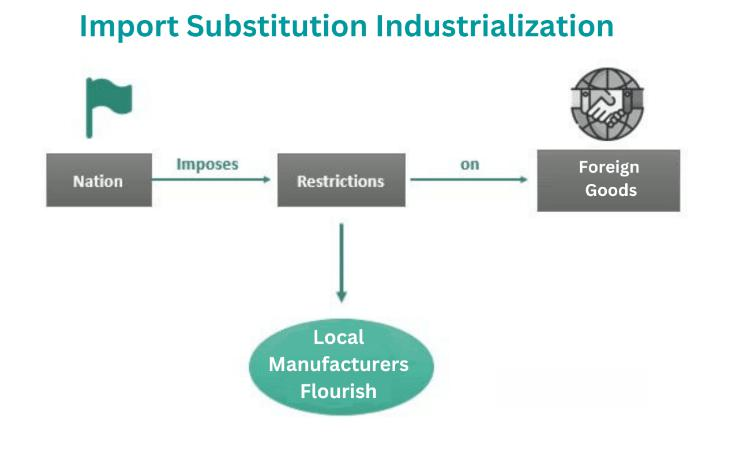

Economic strategies are fundamental for the growth and stability of nations, providing a structured framework through which countries can achieve their developmental objectives. A cornerstone of these strategies has historically been industrialization. This process shifts economies from agriculture-based systems to those dominated by manufacturing and services, thereby increasing productivity and fostering technological innovation. By creating jobs and stimulating economic activity, industrialization has proven to be a critical driver of development in both developed and developing nations.

Import Substitution Industrialization (ISI) offers an alternative route to economic development by focusing on self-sufficiency. By reducing dependency on imported goods and fostering domestic industries through protective measures like tariffs and quotas, ISI aims to diversify economies and build internal capabilities. This approach has been particularly significant for developing countries seeking to reduce external vulnerabilities and achieve economic independence.

In recent times, the advent of technology has revolutionized economic strategies, with algorithmic trading representing a key advancement. This form of trading employs computer algorithms to automate the buying and selling of financial instruments, thereby enhancing market efficiency. Algorithmic trading contributes to improved liquidity, reduced transaction costs, and overall financial market enhancement, making it a valuable tool in the formulation of modern economic strategies.

This article examines how industrialization, import substitution, and algorithmic trading can intersect to form comprehensive economic strategies. By understanding and leveraging these elements, policymakers can develop robust frameworks that propel countries toward sustained economic growth and stability.

## Table of Contents

## Understanding Economic Strategies

Economic strategies are the frameworks through which nations aim to achieve and maintain growth and enhance their competitiveness on a global scale. These strategies involve a combination of policies and practices that are tailored to the unique developmental goals and economic contexts of individual countries. A key aspect of formulating an effective economic strategy is understanding the foundational role that elements like industrialization and import substitution play.

Industrialization is a cornerstone of economic strategy, serving as a transformative force that shifts the focus of an economy from agriculture to manufacturing and services. This shift not only boosts productivity but also catalyzes job creation and technological innovation. By fostering a more diversified industrial base, nations can improve their economic resilience and adaptability to global market changes.

Import Substitution Industrialization (ISI) is another critical element in shaping economic strategies. ISI focuses on reducing dependency on imported goods by promoting domestic industries, thus fostering self-sufficiency. This approach typically involves implementing protective measures such as tariffs, quotas, and government subsidies to nurture local industries until they become competitive.

Different countries adopt various economic strategies depending on their specific circumstances and objectives. Developing nations, for instance, may prioritize industrialization and import substitution to jumpstart their economies and reduce foreign dependency. In contrast, developed nations might focus on advanced industries and innovation-driven strategies to maintain their global edge.

Effective economic strategies are not static; they require continuous assessment and adjustment to respond to changing economic landscapes and global challenges. Nations must evaluate their developmental priorities, resource endowments, and technological capabilities to devise strategies that not only drive economic growth but also ensure long-term sustainability and competitiveness.

## The Role of Industrialization

Industrialization is a fundamental component of economic development that involves the transition of an economy from a primarily agricultural focus to one centered on manufacturing and services. This transformative process has far-reaching implications for productivity, employment, and technological innovation.

Firstly, industrialization significantly enhances productivity by optimizing the production process. The shift from manual agricultural labor to mechanized manufacturing increases output while reducing labor intensity. This productivity boost is typically measured in terms of output per worker, and it facilitates economies of scale—a crucial aspect for sustained economic growth. For instance, the introduction of mechanized production lines in manufacturing industries enables businesses to produce goods at a faster rate and lower cost, thereby increasing overall economic efficiency.

Moreover, industrialization creates a multitude of employment opportunities. As economies industrialize, the demand for skilled workers in sectors such as manufacturing, construction, and services rises. This demand not only absorbs surplus agricultural labor but also stimulates urbanization as people migrate in search of better-paying jobs. The migration from rural to urban areas further catalyzes economic activities in cities, contributing to urban development and expansion.

Technological innovation is another significant byproduct of industrialization. Industrial economies tend to invest in research and development (R&D) to improve production technologies and processes. This investment spurs technological advancements and the creation of new products and industries. For example, the development of information technology (IT) industries has roots in industrialized economies that prioritized innovation and technological development. As industrialization progresses, the spillover effects of technological advancements often permeate other sectors, enhancing overall economic growth.

Historically, industrialization has been a major driver of economic growth across various regions worldwide. In the 19th and 20th centuries, industrialization powered the economic expansion of Western Europe, the United States, and later Japan. These regions witnessed unprecedented economic growth as they transitioned from agrarian societies to industrial powerhouses, resulting in improved living standards and increased economic output. Similarly, in recent decades, countries like China and India have experienced rapid industrialization, contributing to their emergence as formidable economic players on the global stage.

The impact of industrialization on both developed and developing nations underscores its importance as an engine of economic growth. By fostering productivity, job creation, and innovation, industrialization lays the groundwork for more diversified and resilient economies capable of withstanding global economic fluctuations. As economies continue to evolve, the principles and advantages of industrialization remain integral to crafting effective economic strategies that promote sustainable growth and development.

## Import Substitution as an Economic Strategy

Import Substitution Industrialization (ISI) is a strategic economic policy framework designed to stimulate domestic industrial development by reducing a country's reliance on foreign goods. At its core, ISI seeks to foster self-sufficiency and economic diversification, particularly in developing nations.

The policy operates on a structured approach that incorporates protective measures such as tariffs, quotas, and government subsidies. Tariffs, which are taxes levied on imported goods, serve as a fundamental tool in ISI, aiming to make foreign products more expensive compared to their domestic counterparts. This price differential encourages consumers to prefer domestically manufactured goods, thereby spurring local production. Quotas, or quantitative restrictions, limit the [volume](/wiki/volume-trading-strategy) of imports, ensuring that domestic industries have a significant market share. Additionally, government subsidies provide financial support to emerging industries, helping them scale production and innovate without the immediate pressure of international competition.

ISI emerged prominently in the mid-20th century, particularly across Latin America, as many countries sought to overcome the vulnerabilities exposed by over-dependence on primary commodity exports. The strategy was seen as a pathway to industrialize rapidly by nurturing infant industries that could eventually compete on a global scale.

While successful in laying the groundwork for industrialization in several regions, ISI has also faced criticism. Critics argue that excessive protectionism can lead to inefficient industries that fail to innovate or improve productivity. The lack of competitive pressure may result in higher prices and lesser quality for consumers.

In summary, Import Substitution Industrialization is a significant economic strategy aimed at bolstering domestic industries, reducing import dependency, and achieving economic diversification. This approach requires careful balance to avoid the pitfalls of inefficiency while ensuring sufficient support for developing industries to thrive.

## The Evolution of Import Substitution

Import Substitution Industrialization (ISI) emerged as a strategy amid the economic upheavals of the early to mid-20th century, serving as a protective mechanism for countries seeking economic autonomy. The concept was particularly embraced in response to the vulnerabilities exposed by the Great Depression and the disruption of international trade during World War II. By prioritizing the development of domestic industries to replace imported goods, ISI aimed to bolster national economies and reduce dependency on foreign markets.

During its implementation, ISI witnessed significant success, most notably in Latin America during the 1950s and 1960s. Countries like Brazil and Argentina invested heavily in domestic industries, resulting in substantial economic growth and industrial diversification. The strategy enabled these nations to transform their predominantly agrarian economies into more robust industrialized systems. However, this initial success was not without its drawbacks.

Critics of ISI highlight several inherent inefficiencies relating to its protectionist measures, such as high tariffs and import quotas. These barriers often led to the creation of inefficient domestic industries that lacked the competitiveness of their international counterparts. A reliance on government subsidies became commonplace, fostering an economic environment where innovation was stiflied and growth stagnated. Additionally, ISI sometimes resulted in trade imbalances and a lack of foreign exchange reserves, as the emphasis on domestic products often disregarded the export potential.

Modern iterations of ISI seek to rectify previous shortcomings by emphasizing a balanced approach that combines protectionism with integration into the global economy. This involves gradually reducing trade barriers while promoting competitiveness and efficiency within domestic markets. The goal is to create industries capable of competing internationally without the perpetual crutch of government support.

In recent years, ISI has evolved to incorporate elements of global economic engagement, leveraging both domestic capacity building and international trade opportunities. Nations are now encouraged to pursue strategic partnerships and trade agreements that enhance domestic industrial capabilities while remaining open to foreign investment and competition. This more nuanced approach aims to create a sustainable economic environment that aligns with global market dynamics while maintaining a level of economic sovereignty.

## Algorithmic Trading: Enhancing Economic Growth

Algorithmic trading refers to the use of computer algorithms to execute trading orders in financial markets automatically. This sophisticated approach capitalizes on speed, precision, and the ability to process vast amounts of data beyond human capacity. The widespread adoption of [algorithmic trading](/wiki/algorithmic-trading) is transforming financial markets and driving economic growth through several key mechanisms.

Firstly, algorithmic trading improves [liquidity](/wiki/liquidity-risk-premium) in markets. By continuously placing a large number of small buy and sell orders, algorithms ensure that there are always willing buyers and sellers. This continuous trading reduces the bid-ask spread, making it easier for traders to buy and sell without causing significant price changes. Enhanced liquidity lowers the cost of trading for all market participants and can attract investment, thereby fostering economic growth.

Secondly, algorithmic trading reduces transaction costs. Automated systems can identify optimal times to execute trades based on market conditions, ensuring that trades occur at the most favorable prices. This process minimizes the impact of price [volatility](/wiki/volatility-trading-strategies) and slippage on transactions, resulting in cost savings. Lower transaction costs increase the profitability of trading strategies and can lead to more frequent trading activity, contributing to market vitality.

Furthermore, algorithmic trading enhances market efficiency by incorporating vast amounts of information into asset prices swiftly. Algorithms can process and react to market news, economic indicators, and other relevant data much faster than humans. This capability ensures that prices reflect available information in real-time, reducing the likelihood of market anomalies or [arbitrage](/wiki/arbitrage) opportunities. Efficient markets are crucial for effective capital allocation, which is a fundamental component of economic growth.

The integration of algorithmic trading into broader economic strategies can optimize financial practices and investment decisions. By leveraging the advanced data processing capabilities of algorithms, policymakers and investors can gain insights into market trends, risk assessment, and asset allocation. This level of analysis supports informed decision-making, aligns investment strategies with economic objectives, and enhances overall economic stability.

In conclusion, algorithmic trading is a powerful tool that enhances economic growth by improving liquidity, reducing transaction costs, and increasing market efficiency. Its integration into economic strategies provides an opportunity to harness technology's strengths, optimize financial markets, and sustain economic development in an increasingly digital world.

## Bridging Industrialization and Modern Technology

The integration of traditional industrialization methods with modern technologies, such as algorithmic trading, is a pivotal aspect of contemporary economic strategies. This fusion allows countries to more efficiently navigate global markets, capitalizing on both the benefits of industrial manufacturing and the technological advancements associated with financial and information technologies.

Industrialization historically facilitated the transition of economies from agriculture-based systems to those focused on manufacturing and services. This shift, characterized by increased productivity, job creation, and technological innovation, has been a cornerstone of economic development. As nations continue to industrialize, the incorporation of advanced technologies becomes essential for maintaining competitiveness in a rapidly evolving global market.

Algorithmic trading, a byproduct of technological advancement, automates trading processes in financial markets, thereby enhancing liquidity, reducing transaction costs, and boosting market efficiency. Its adoption illustrates how technology can complement traditional economic strategies, creating robust frameworks that improve operational efficiencies and investment decisions across sectors. For instance, the application of algorithms in logistics and supply chain management significantly optimizes manufacturing processes by predicting demand and managing inventories more effectively.

Policymakers play a critical role in this integration. They must devise strategies that leverage technological advancements to fuel industrial growth while safeguarding economic stability. This involves fostering an environment conducive to innovation, where industries can seamlessly adopt new technologies without fear of disruption. Incentives for research and development, coupled with investments in digital infrastructure, are crucial components of a supportive policy framework.

Moreover, educational systems should adapt to equip the workforce with skills necessary for a technology-driven industrial landscape, ensuring that human capital development keeps pace with technological progress. As countries harness these synergistic opportunities, they position themselves to not only strengthen their domestic economies but also to engage more effectively with international markets, contributing to balanced and sustainable economic growth.

## Case Studies and Global Perspectives

### Case Studies and Global Perspectives

The implementation of Import Substitution Industrialization (ISI) strategies across various countries has yielded diverse outcomes, highlighting the complexity and context-specific nature of such policies. Examining the cases of Brazil, India, South Korea, and China offers valuable insights into how different nations have navigated ISI and its implications on economic development.

**Brazil and India: Mixed Outcomes of ISI**

Brazil and India embraced ISI strategies in the mid-20th century, aiming to reduce dependency on imports and cultivate domestic industries. In Brazil, ISI led to substantial growth in the manufacturing sector, fostering industries such as automotive and electronics. However, the policy also resulted in inefficiencies and protectionist market barriers, which stifled competitiveness and innovation. Brazil's experience underscores the challenge of achieving self-sufficiency while maintaining market dynamism.

Similarly, India adopted ISI post-independence, focusing on industrialization through state intervention and protective measures. The strategy initially spurred industrial growth, laying a foundation for economic development. Nonetheless, India's excessive reliance on protectionism led to an insular economy, which eventually necessitated economic liberalization in the 1990s to rectify stagnation and enhance global competitiveness.

**South Korea's Economic Transformation**

South Korea's economic strategy presents an illustrative case of evolution from ISI to global market integration. Initially adopting ISI in the 1960s, South Korea prioritized developing core industries, such as steel and shipbuilding, under government guidance and protectionist policies. However, recognizing the limitations of prolonged protectionism, the country transitioned towards export-oriented industrialization in subsequent decades. By embracing global trade and fostering technological advancements, South Korea transformed its economy into a high-tech, export-driven powerhouse. This strategic pivot illustrates the potential for substantial economic transformation when nations adapt their economic models to global economic trends.

**China: A Hybrid Approach**

China represents an intriguing case of integrating ISI principles with global trade engagement. Since the late 20th century, China has strategically utilized ISI to nurture domestic industries and reduce import dependence, particularly through policies that encourage technology transfer and joint ventures with foreign firms. Concurrently, China's active participation in global trade organizations and commitment to export growth underline its hybrid approach. By combining protectionist measures with openness to foreign investment and technology, China has achieved remarkable economic growth and emerged as a leading global manufacturing hub.

These case studies highlight that while ISI can serve as a catalyst for industrial development, its success is contingent upon adaptive strategies that respond to global economic dynamics. Nations must balance protectionist policies with market openness to foster sustainable economic growth and competitiveness.

## Challenges and Opportunities

Import Substitution Industrialization (ISI) and technological integration offer significant potential for economic development by promoting self-reliance and technological advancement. However, they also introduce several challenges. One major challenge is the risk of inefficiency and market distortion. ISI often involves protective measures like tariffs and subsidies that can create a shielded environment for domestic industries. While this protection can foster initial growth, it might lead to complacency and inefficiency if domestic firms face little competitive pressure. Such environments can stifle innovation and result in products that are uncompetitive globally.

Balancing protectionist policies with competitiveness is critical for ISI to be effective. Policymakers must ensure that while domestic industries are shielded from international competition to some extent, they are also encouraged to innovate and improve efficiency. This balance can be achieved through measures such as sunset clauses on tariffs, which gradually reduce protection to expose firms to international competition, thereby incentivizing them to increase productivity.

Emerging markets need to adapt their economic strategies to contemporary environments, characterized by rapid technological change and globalization. The integration of modern technologies such as algorithmic trading into economic strategies represents an opportunity for these markets to enhance financial efficiency and global competitiveness. Algorithmic trading can boost market liquidity and efficiency, but it also requires robust regulatory frameworks to prevent issues such as market manipulation and flash crashes.

Successful adaptation involves learning from both past experiences with ISI and the opportunities presented by modern technology. Countries can look to hybrid models that incorporate the core principles of ISI—such as fostering domestic capabilities—while engaging with global markets to ensure competitiveness. This approach necessitates a comprehensive understanding of both domestic needs and global market trends.

Overall, the effectiveness of economic strategies that incorporate ISI and technological integration hinges on carefully calibrated policies that foster innovation and competitiveness while protecting nascent industries during their critical growth phases.

## Conclusion

The combination of industrialization, import substitution, and algorithmic trading presents a robust framework for crafting modern economic strategies. Industrialization remains a pivotal driver of structural economic transformation, shifting reliance from agriculture toward more lucrative manufacturing and service sectors. This shift inherently boosts productivity, fosters job creation, and spurs technological innovation, resulting in sustained economic advancement.

Import substitution serves as a strategic complement to industrialization by reducing a country's dependence on foreign imports and nurturing domestic industries. By implementing protective measures such as tariffs and quotas, nations can stimulate local production, diversify their economies, and achieve greater self-reliance. However, the lessons learned from previous import substitution efforts emphasize the importance of balancing protection with competitiveness to avoid inefficiencies and market distortions.

Incorporating algorithmic trading further enhances the economic strategy landscape by leveraging technological advancements to optimize financial markets. This method improves market liquidity, reduces transaction costs, and increases trading efficiency, offering nations a competitive edge in global markets.

To develop sustainable and effective economic policies, it is crucial for countries to integrate historical insights gleaned from past industrial and trade practices with modern technological tools. The evolving global economic environment necessitates policies that not only focus on self-sufficiency and internal growth but also on active participation in international trade. A measured approach that fosters innovation while maintaining economic stability is pivotal.

In conclusion, the synthesis of industrialization, import substitution, and algorithmic trading can lead to a balanced economic growth model. Such an approach not only bolsters internal economic capabilities but also ensures dynamic engagement with the global economy, positioning countries for long-term prosperity and resilience.

## References & Further Reading

[1]: Amsden, A. H. (2001). *The Rise of "The Rest": Challenges to the West from Late-Industrializing Economies*. Oxford University Press.

[2]: Chang, H. J. (2003). *Kicking Away the Ladder: Development Strategy in Historical Perspective*. Anthem Press.

[3]: Frenkel, R., & Rapetti, M. (2009). ["A Developing Country View of the Current Global Crisis: What Should Not Be Forgotten and What Should Be Done."](https://www.jstor.org/stable/23601994) PERI Working Paper Series.

[4]: Irwin, D. A. (2001). ["Tariffs and Growth in Late Nineteenth Century America."](https://onlinelibrary.wiley.com/doi/10.1111/1467-9701.00341) The World Economy, 24(8), 999-1013.

[5]: Rajan, R. (2004). ["Why Are Structural Reforms so Difficult?"](https://www.imf.org/external/pubs/ft/fandd/2004/06/pdf/straight.pdf) International Monetary Fund Working Paper.

[6]: Rodrik, D. (2008). *One Economics, Many Recipes: Globalization, Institutions, and Economic Growth*. Princeton University Press.

[7]: Taylor, L. (1993). *The Rocky Road to Reform: Adjustment, Income Distribution, and Growth in the Developing World*. MIT Press.

[8]: Wade, R. (1990). *Governing the Market: Economic Theory and the Role of Government in East Asian Industrialization*. Princeton University Press.