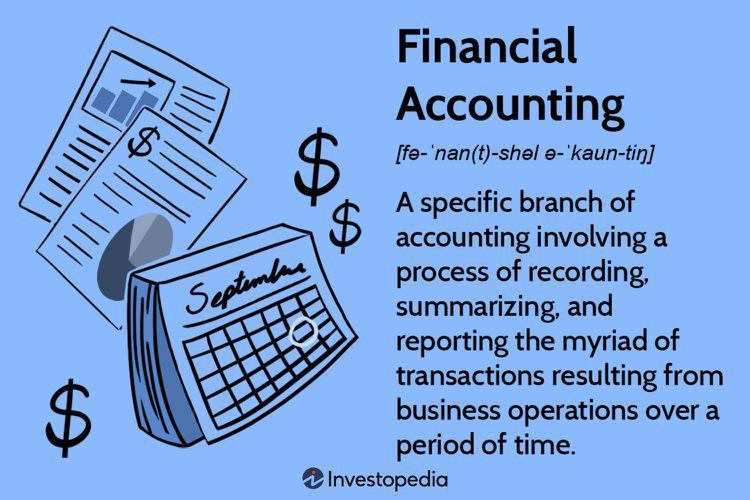

In the complex world of finance, developing effective investment strategies is crucial for achieving financial success. Investors must navigate a dynamic landscape influenced by economic variables, market conditions, and technological advances. The intricate nature of investments demands a comprehensive understanding of financial tools and approaches. Among these, algorithmic trading and accounting strategies stand out as transformative elements that have redefined conventional investment paradigms.

Algorithmic trading employs sophisticated computer algorithms to execute trades at optimal speeds, thus enhancing market efficiency and reducing human error. This method leverages advanced algorithms to analyze market data, identify trading opportunities, and execute trades at precise moments to maximize returns. Its precision and capability to process vast amounts of data rapidly make algorithmic trading a powerful tool in the arsenal of modern investors.



Accounting strategies, on the other hand, provide the foundational knowledge necessary to evaluate company performance. Understanding financial statements is key to assessing the profitability, risk, and valuation of assets. Accurate financial reporting and key financial metrics derived from accounting data enable investors to benchmark their investments and maintain transparency, which is crucial for informed investment decisions.

By integrating these two components, investors can develop strategies that optimize portfolio performance, enhance decision-making, and adapt to shifting market conditions. The interplay between algorithmic trading and accounting strategies allows for a more comprehensive analysis of investment opportunities, balancing technical precision with fundamental financial insights. As the financial markets continue to evolve, understanding these dynamics becomes essential for achieving long-term financial success and leveraging the full potential of investment strategies.

## Table of Contents

## Understanding Investor Influence on Investment Strategies

Investors, both individual and institutional, significantly impact the development and modification of investment strategies. Individual investors often seek personalized investment tools and platforms that align with their unique financial goals and risk tolerance. This demand has prompted financial service providers to create tailored applications and platforms, enhancing the accessibility of investment opportunities for the average investor. These tools are designed to provide real-time data analysis and risk assessment, allowing investors to make informed decisions based on their specific preferences and market conditions.

Institutional investors, such as pension funds, insurance companies, and mutual funds, have a substantial influence on the evolution of financial instruments and risk management practices. Their significant capital resources and investment activities can shape market trends and liquidity. To manage complex portfolios, institutional investors frequently employ advanced statistical models and risk management techniques. This practice drives innovation in the financial sector, as institutions seek to develop more efficient and sophisticated methods to allocate their capital optimally. These advancements can introduce new financial products, such as derivatives and hedge funds, designed to meet specific institutional needs.

The growing focus on sustainability and ethical considerations is transforming investor strategies. Increasing awareness and concern over environmental, social, and governance ([ESG](/wiki/esg-investing)) issues have led to a surge in demand for ESG funds. These funds invest in companies that adhere to sustainable practices and ethical standards, aligning with investors' desires for socially responsible investment options. The appeal of ESG funds lies not only in their capacity to address ethical considerations but also in their potential for long-term financial returns. Studies have shown that companies with strong ESG performance can be more resilient to market [volatility](/wiki/volatility-trading-strategies) and regulatory changes, providing a viable investment avenue for risk-averse investors.

In summary, the preferences and demands of individual and institutional investors are pivotal in shaping investment strategies. These strategies increasingly emphasize customization, innovation, and sustainability. As both groups continue to influence financial markets, their growing interest in new methodologies and ethically aligned investments demonstrates the dynamic nature of modern investment practices.

## The Role of Accounting in Investment Decisions

Accounting serves as the bedrock for sound investment decisions, providing investors with essential tools to evaluate company performance and financial health. Financial statements, such as the balance sheet, income statement, and cash flow statement, are vital documents that offer insights into profitability, risk, and asset valuation. These statements reveal the company's revenue streams, expenses, assets, liabilities, and overall financial condition.

Analyzing these documents allows investors to assess key financial metrics. For example, the Price-to-Earnings (P/E) ratio, an indicator derived from accounting data, helps investors determine how much they are willing to pay for a dollar of earnings. The P/E ratio is calculated as:

$$
\text{P/E Ratio} = \frac{\text{Market Value per Share}}{\text{Earnings per Share (EPS)}}
$$

A lower P/E ratio might indicate that a company is undervalued, whereas a higher ratio can suggest overvaluation, contingent on industry comparisons and economic conditions.

Another crucial metric is the Return on Equity (ROE), which shows how effectively a company is using its equity to generate profits. It is calculated using:

$$
\text{ROE} = \frac{\text{Net Income}}{\text{Shareholder's Equity}}
$$

ROE provides insights into management efficiency and can guide investment decisions by highlighting companies that deliver superior returns on equity capital.

Beyond interpreting financial metrics, accurate and transparent financial reporting is vital for maintaining market confidence and enabling benchmarking against industry standards. Regulatory frameworks, such as Generally Accepted Accounting Principles (GAAP) and International Financial Reporting Standards (IFRS), ensure consistent recording and reporting of financial information, which is crucial for fair comparison across entities.

Investors rely heavily on such standardized data to identify profitable opportunities and mitigate risks. By thoroughly understanding and leveraging this information, investors can make informed decisions that maximize their returns while ensuring transparency and trust within the financial market.

## Algorithmic Trading: Revolutionizing Investment Approaches

Algorithmic trading represents a transformative approach within modern financial markets, employing complex computer algorithms to execute trades at speeds and prices that are optimal for traders and investors. This type of trading became feasible with the advancement of technology and electronic trading platforms, allowing market participants to capitalize on inefficiencies far quicker than human trading actions.

The fundamental premise of [algorithmic trading](/wiki/algorithmic-trading) is its ability to minimize human errors and elevate market efficiency through speed and precision. Algorithms follow predefined criteria for trading such as timing, price, and [volume](/wiki/volume-trading-strategy), executing trades in mere fractions of a second, faster than any human can achieve. This rapid execution is crucial, especially in high-frequency trading, where the slightest advantage in execution speed can result in significant profit margins.

One of the typical strategies utilized in algorithmic trading is [trend following](/wiki/trend-following). This strategy capitalizes on the [momentum](/wiki/momentum) of asset prices, employing algorithms to identify upward or downward trends and execute trades accordingly. Another common approach is mean reversion, which is based on the hypothesis that asset prices eventually return to their historical averages. Algorithms implementing this strategy look for statistical anomalies and execute trades when prices deviate significantly from their average.

Arbitrage is yet another popular strategy, where algorithms exploit price differentials of the same asset in different markets or forms. This method relies on finding and acting upon price imbalances within milliseconds before the market corrects itself.

Despite these advantages, algorithmic trading is not without its risks. One of the primary concerns is the increased market volatility it can induce, as mass algorithmic trading can lead to rapid price changes. Furthermore, the phenomenon known as a flash crash can occur, where algorithms trigger cascading sell orders causing asset prices to plummet within seconds, followed by a quick recovery once human traders intervene or algorithms cease operations.

The integration of algorithms in trading processes certainly provides significant benefits in terms of speed and efficiency, but it also necessitates a careful approach to risk management and regulation to mitigate potential adverse effects on market stability. Maintaining a balance between leveraging technology and ensuring fairness in market operations is essential for the sustainable advancement of algorithmic trading practices.

## Integrating Accounting Data with Algorithmic Trading Strategies

Integrating accounting data with algorithmic trading strategies offers a potent combination for enhancing decision-making in financial markets. Equity accounting data, which includes metrics such as earnings, revenue growth, debt levels, and price-to-earnings ratios, provides essential insights into company valuations and performance. These metrics serve as critical inputs for developing and refining algorithmic trading models.

By incorporating financial metrics into algorithms, traders can achieve a more robust analysis of market trends, enabling them to make predictions with higher accuracy. For instance, a trading strategy might utilize historical earnings data to adjust buy and sell signals based on a company's performance trajectory. The integration facilitates the design of algorithms that not only respond to market data in real-time but also consider underlying financial health factors, potentially leading to more informed trading decisions.

The application of [artificial intelligence](/wiki/ai-artificial-intelligence) (AI) and [machine learning](/wiki/machine-learning) further amplifies these capabilities. Machine learning models, such as decision trees, neural networks, and support vector machines, can process vast quantities of accounting data alongside market data to uncover complex patterns that traditional statistical methods might miss. These models can be trained on historical data to identify indicators that precede market movements, thereby optimizing algorithmic trading strategies.

For example, in Python, a machine learning model might be employed to predict stock price movements based on accounting data inputs. This might involve using the `sklearn` library to create a regression model:

```python
from sklearn.model_selection import train_test_split
from sklearn.ensemble import RandomForestRegressor

# Example dataset with accounting metrics and stock prices
data = ...  # Load dataset containing accounting data and stock prices
X = data[['earnings', 'revenue_growth', 'debt', 'pe_ratio']]
y = data['stock_price']

# Split the dataset into training and testing sets
X_train, X_test, y_train, y_test = train_test_split(X, y, test_size=0.3, random_state=42)

# Train a random forest regressor model
model = RandomForestRegressor(n_estimators=100, random_state=42)
model.fit(X_train, y_train)

# Make predictions
predictions = model.predict(X_test)
```

This model predicts future stock prices by learning from the company's financial data, thus aiding traders in making decisions based on both market conditions and company fundamentals.

Overall, integrating accounting data with algorithmic trading strategies offers a comprehensive approach to market analysis, combining the precision of financial metrics with the computational power of AI-driven algorithms. This synergy not only enhances trading efficiency but also empowers investors to leverage deeper market insights for more strategic investment decisions.

## Emerging Trends in Investment Strategies

Artificial intelligence (AI) and machine learning (ML) have become pivotal in shaping contemporary investment strategies. These technologies enable the analysis of vast datasets, deriving insights that are both timely and actionable. One of the key trends is the demand for personalized investment solutions, driven by AI's capability to tailor recommendations based on individual investor profiles, risk appetites, and financial goals. For example, algorithms can analyze past investment behavior and market conditions to suggest customized portfolios that adapt to changing circumstances.

The shift towards data-driven investment services is emphasized by the increasing reliance on AI and ML to parse through complex datasets quickly and accurately. This trend is evident in the proliferation of robo-advisors, which use algorithmic frameworks to offer low-cost, automated financial advice. These platforms leverage AI to continually learn from data, adjusting investment strategies as new information arises.

Regulatory bodies are actively developing frameworks to ensure transparency and fairness in the deployment of advanced trading algorithms. This is crucial as the use of AI in financial markets grows. Regulations aim to mitigate risks such as algorithmic bias and ensure that AI systems operate within ethical boundaries. For instance, legislation surrounding the European Union's Markets in Financial Instruments Directive II (MiFID II) includes requirements for transparency in algorithmic trading activities, demanding that firms disclose detailed information about their trading algorithms and strategies.

Investors who stay informed about these developments can capitalize on the benefits of AI and ML in their investment strategies. Understanding the implications of regulatory changes and technological advancements is essential to navigate the evolving financial landscape successfully. Practically, this involves continuous education and adaptation to emerging tools and platforms that leverage AI for improved decision-making and enhanced portfolio performance.

Moreover, as AI and machine learning models become more sophisticated, they can integrate diverse data types beyond traditional financial datasets, including social media sentiment and macroeconomic indicators. This broadens the scope of investment analysis, offering investors a more comprehensive view of potential market movements.

In conclusion, embracing these emerging trends enables investors to harness powerful technology while aligning with regulatory standards, ensuring competitive advantage and sustained financial success.

## Conclusion

The synergistic relationship between investor influence, accounting, and algorithmic trading has been a driving force in reshaping financial markets. This interplay enables investors to optimize their strategies by integrating comprehensive data analysis with cutting-edge trading techniques. 

Leveraging deep insights from accounting data equips investors with the capability to evaluate company performance and potential investment opportunities rigorously. For instance, financial statements provide critical metrics such as earnings per share (EPS), return on equity (ROE), and debt-to-equity ratios. By understanding these metrics, investors can better assess profitability, risk exposure, and overall financial health. In parallel, algorithmic trading offers the speed and precision needed to execute trades that capitalize on these insights. Algorithms can continuously monitor market conditions and execute trades almost instantly when predefined parameters are met, thus enhancing portfolio performance through timely decisions.

As technology evolves, maintaining awareness of technological advancements and regulatory changes becomes crucial for investors seeking a sustainable competitive edge. The financial landscape is ever-changing, with innovations like artificial intelligence and machine learning leading the charge. These technologies enable more sophisticated data analysis and predictive capabilities, empowering investors to make more informed decisions based on intricate market patterns. Investors must stay informed on both current and forthcoming regulatory frameworks that govern the use of such technologies to ensure compliance and market integrity.

Ultimately, understanding the complex dynamics at play between investor influence, accounting analytics, and algorithmic trading is essential for optimizing investment strategies. This holistic comprehension allows investors to navigate the intricacies of modern financial markets effectively, ensuring robust financial success in an environment that is continuously evolving. By harnessing these powerful tools and insights, investors can not only enhance their portfolio performance but also secure a lasting advantage in an increasingly competitive market.

## References & Further Reading

[1]: Bergstra, J., Bardenet, R., Bengio, Y., & Kégl, B. (2011). ["Algorithms for Hyper-Parameter Optimization."](https://dl.acm.org/doi/10.5555/2986459.2986743) Advances in Neural Information Processing Systems 24.

[2]: ["Advances in Financial Machine Learning"](https://www.amazon.com/Advances-Financial-Machine-Learning-Marcos/dp/1119482089) by Marcos Lopez de Prado

[3]: ["Evidence-Based Technical Analysis: Applying the Scientific Method and Statistical Inference to Trading Signals"](https://www.amazon.com/Evidence-Based-Technical-Analysis-Scientific-Statistical/dp/0470008741) by David Aronson

[4]: ["Machine Learning for Algorithmic Trading"](https://github.com/stefan-jansen/machine-learning-for-trading) by Stefan Jansen

[5]: ["Quantitative Trading: How to Build Your Own Algorithmic Trading Business"](https://www.amazon.com/Quantitative-Trading-Build-Algorithmic-Business/dp/1119800064) by Ernest P. Chan