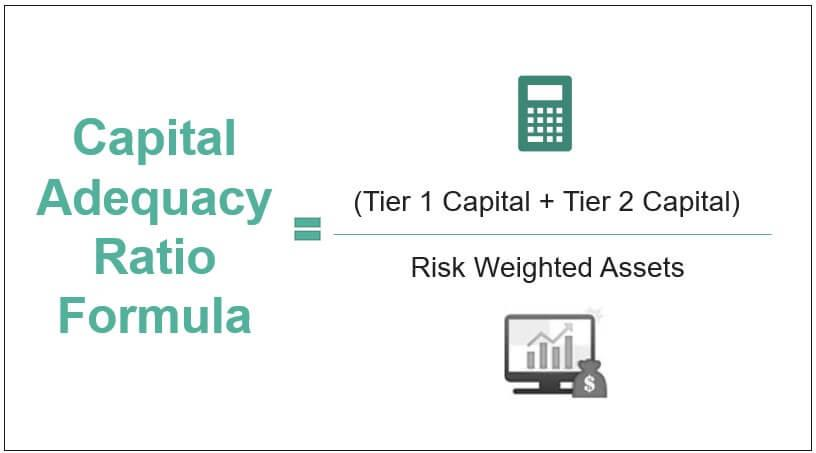

In today's complex financial landscape, understanding key financial metrics is crucial for shareholders, especially within the banking and trading sectors. Among these metrics, the Capital Adequacy Ratio (CAR) holds significant importance as it measures a bank's available capital relative to its risk-weighted assets. This ratio provides insights into a bank's capacity to withstand financial strain, ensuring that depositors' funds are safeguarded and the broader financial system remains stable. For shareholders, a robust CAR is an indicator of the bank's financial health and resilience, thereby aiding in making informed investment decisions.

The intersection of algorithmic trading with financial metrics like CAR further enriches our understanding of financial health and stability. By leveraging complex algorithms, traders can enhance portfolio resilience and optimize trading strategies, balancing risk and return. Algorithmic trading systems can integrate CAR data analytics to offer sophisticated insights, thus supporting informed decision-making processes.



In the context of a volatile market environment, optimizing financial strategies through the lens of CAR is becoming increasingly essential. A strong understanding of CAR assists in aligning business operations with regulatory requirements while capitalizing on emerging market opportunities. Thus, having a comprehensive grasp of CAR and its interplay with modern trading technologies is paramount for prioritizing financial security and maximizing shareholder value.

## Table of Contents

## Understanding Capital Adequacy Ratio (CAR)

The Capital Adequacy Ratio (CAR) is a crucial financial metric that quantifies a bank's capital relative to its risk-weighted assets. It is expressed as:

$$
\text{CAR} = \left( \frac{\text{Tier 1 Capital} + \text{Tier 2 Capital}}{\text{Risk-Weighted Assets}} \right) \times 100
$$

This ratio is instrumental in determining the ability of a bank to sustain potential losses, thereby safeguarding depositors' funds and ensuring overall financial stability. CAR is divided into two main components: Tier 1 and Tier 2 capital.

**Tier 1 Capital** primarily includes core capital, comprising common equity, retained earnings, and certain instruments that are perpetual and absorb losses immediately when they occur. This tier is vital because it serves as the primary funding source capable of absorbing losses without ceasing operations. The emphasis on core equity underlines its significance as a solid buffer against economic fluctuations and financial strains.

**Tier 2 Capital** encompasses supplementary capital, which includes revaluation reserves, subordinated debt, hybrid instruments, and undisclosed reserves. Although it serves as an additional layer of protection, it is considered less secure than Tier 1 capital due to its lower quality and less immediate loss-absorbing capacity.

Internationally, regulatory benchmarks such as the Basel III accords play a pivotal role in setting minimum thresholds for CAR. These accords were introduced to strengthen bank capital requirements and promote a more resilient banking system in the wake of financial crises. Under Basel III, banks are required to maintain a minimum CAR of 8%, with a core Tier 1 leverage ratio of at least 4.5% of risk-weighted assets, ensuring that institutions maintain a substantial buffer of high-quality capital.

CAR's role in the financial soundness of banks is paramount, as it acts as a protective mechanism against insolvency and mitigates systemic risk in the banking sector. By maintaining a robust CAR, banks are better positioned to absorb adverse shocks, preserve depositor trust, and contribute to financial stability.

## The Importance of CAR for Shareholders

The Capital Adequacy Ratio (CAR) is a fundamental indicator for shareholders, providing critical insight into a bank's ability to manage potential financial risks. A high CAR signifies robust bank health, reassuring shareholders of the institution's capability to withstand financial stress. A healthy CAR reflects the bank's resilience and its ability to absorb unexpected losses, thereby protecting depositor funds and maintaining financial stability.

Shareholders use CAR as a tool to evaluate the safety and soundness of their investments. A strong CAR suggests that the bank is not over-leveraged and has sufficient buffer to manage volatile market conditions. Conversely, a low CAR may indicate that a bank is taking on excessive risk, which could be a red flag for potential financial instability.

The assessment of risk management practices through CAR impacts shareholder value and confidence significantly. Investors examine CAR to ensure that banks employ effective risk management strategies that align with regulatory requirements and market expectations. Banks with higher CARs are generally perceived as more reliable and capable of generating sustainable returns, fostering greater confidence among shareholders.

An effective CAR not only enhances shareholder trust but also supports strategic decision-making within financial institutions. By maintaining a strong CAR, banks can position themselves advantageously in the market, potentially leading to enhanced shareholder value through improved financial performance and reduced risk exposure. This evaluation of CAR as a marker of financial resilience underscores its importance in the overall assessment of a bank's economic health and its attractiveness as an investment opportunity.

## Financial Stability Through CAR

Maintaining a healthy Capital Adequacy Ratio (CAR) is crucial for ensuring financial stability within the banking sector. A well-managed CAR acts as a protective buffer, safeguarding banks against potential economic downturns by ensuring they have sufficient capital to absorb unexpected losses. The CAR is calculated as follows:

$$
\text{CAR} = \frac{\text{Tier 1 Capital} + \text{Tier 2 Capital}}{\text{Risk-Weighted Assets}}
$$

The numerator of this formula includes Tier 1 and Tier 2 capital, which respectively signify a bank's core capital and supplementary financial support. The denominator, risk-weighted assets, represents the varying levels of risk associated with the bank's exposures.

The significance of CAR in preventing systemic crises is paramount, as it functions as an indicator of potential financial distress. An optimal CAR level can serve as an early warning system, enabling timely interventions to avert broader financial breakdowns. Banks with higher CARs signal to regulators, investors, and stakeholders that they are well-managed, comply with regulatory standards, and maintain financial stability. This perception is vital as it enhances a bank's credibility and its ability to extend credit while managing risk prudently.

Strategies for improving CAR often involve optimizing the risk-weighted asset component. Banks can achieve this by:

1. **Enhancing Asset Quality**: Prioritizing high-quality, low-risk loans can reduce the risk exposure and improve CAR.

2. **Augmenting Capital Reserves**: Raising capital through retained earnings or capital markets, thereby increasing the numerator in the CAR formula.

3. **Efficient Risk Management**: Utilizing advanced analytics and risk assessment tools to better allocate capital toward assets with favorable risk-weight profiles.

4. **Regulatory Compliance**: Ensuring adherence to evolving regulatory frameworks such as Basel III, which may necessitate adjustments in capital strategies.

Long-term financial stability is contingent upon these strategic initiatives, enabling banks to maintain robust operations even in turbulent economic environments. Enhancing CAR is not an isolated process but requires a holistic approach to managing credit risk, operational efficiencies, and shareholder expectations, ultimately fostering a resilient banking system.

## The Role of Algorithmic Trading

Algorithmic trading utilizes complex computer algorithms to manage trading portfolios by automating the decision-making process. This approach is often employed to enhance trading efficiency and minimize transaction costs. Central to its functionality is the incorporation of financial metrics, such as the Capital Adequacy Ratio (CAR), into the algorithms, providing a quantitative basis for strategic investment decisions.

Integrating CAR data analytics into [algorithmic trading](/wiki/algorithmic-trading) equips traders with advanced strategies designed to bolster portfolio resilience. CAR, a measure of a bank's capital relative to its risk-weighted assets, serves as a vital indicator of financial health and stability. By embedding CAR analytics into trading algorithms, traders can create risk-adjusted strategies that assess and manage the risk inherent in various investment instruments. This process involves evaluating the CAR to determine the extent to which a bank can withstand financial stress, thus offering insights into potential investment risks and opportunities.

The equilibrium between leveraging algorithmic trading and maintaining sufficient capital adequacy is crucial for the optimization of a bank's financial strategies. Algorithmic systems can interpret CAR data to ensure compliance with regulatory standards while seeking profitable opportunities. This dual focus allows banks to enhance their risk management frameworks, aligning trading strategies with their capital adequacy standing. 

Consider a simplified Python example demonstrating how CAR might influence algorithmic trading:

```python
def calculate_risk_adjusted_return(portfolio, car, risk_free_rate):
    """
    Calculate risk-adjusted return based on CAR.
    """
    expected_return = portfolio.expected_return
    beta = portfolio.beta
    market_return = portfolio.market_return

    # Risk-adjusted return formula incorporating CAR
    risk_adjusted_return = (expected_return - risk_free_rate) / (beta * car)

    return risk_adjusted_return
```

In this snippet, the `calculate_risk_adjusted_return` function computes the risk-adjusted return of a portfolio, factoring in the CAR. By doing so, the algorithm assesses the investment's return relative to its risk, adjusted by the bank's capital adequacy. This method exemplifies how algorithmic trading systems can operationalize CAR data to enforce investment decisions that are both compliant with regulatory requirements and aligned with financial growth objectives.

Overall, the integration of CAR in algorithmic trading supports the development of resilient trading strategies, ensuring that investment decisions are hedged against potential financial disruptions. This balance is pivotal for banks seeking sustainable growth while maintaining adherence to capital adequacy guidelines.

## Impact on Financial Strategies

Banks face the ongoing challenge of aligning their financial strategies with both regulatory requirements and market opportunities, a task heavily influenced by the Capital Adequacy Ratio (CAR). The CAR's role expands beyond mere compliance, as it also serves as a critical determinant in planning and executing financial strategies to sustain and enhance shareholder value.

The Capital Adequacy Ratio is fundamentally linked to risk management, dictating how banks manage their balance sheets to mitigate potential risks. By maintaining a robust CAR, banks can effectively cushion against financial downturns, thereby ensuring stability and investor confidence. This interplay requires banks to navigate between maintaining a healthy CAR and pursuing growth through expanded credit facilities and diversified investment portfolios. A well-managed CAR indicates that a bank has sufficient reserves of Tier 1 and Tier 2 capital, allowing it to support both operational growth and unexpected losses, thus contributing to sustainable shareholder value.

Strategies to maintain an adequate CAR often involve optimizing risk-weighted assets (RWAs). By reducing RWAs, banks can bolster their CAR, either by decreasing the allocation of assets in high-risk ventures or by reallocating existing resources into less risky assets. This approach not only stabilizes the CAR but also frees capital for other strategic investments, which are aligned with short- and long-term growth objectives.

Future trends in CAR regulation and implementation reveal a shift towards more stringent international standards, largely driven by Basel III and its successors. These developments necessitate that banks adopt dynamic financial strategies capable of adjusting to evolving regulatory landscapes. For instance, the introduction of the Countercyclical Capital Buffer (CCyB) and additional capital requirements for Globally Systemically Important Banks (G-SIBs) demand that banking institutions enhance their capital management practices, technology infrastructure, and risk assessment models. 

Moreover, advancements in financial technology (FinTech) provide banks with the tools to optimize CAR more efficiently. Utilizing data analytics and automation, banks can perform real-time assessments of capital adequacy and execute informed adjustments to their portfolios and credit offerings.

In conclusion, the strategic alignment of CAR with regulatory compliance and market pursuit forms the cornerstone of a bank’s financial planning and risk management framework. By leveraging technology and adhering to forward-looking regulatory standards, banks can enhance their CAR, seize market opportunities, and deliver greater shareholder value.

## Conclusion

By comprehensively understanding the Capital Adequacy Ratio (CAR), shareholders are equipped to make savvy investment decisions in the banking sector. This metric serves as a critical gauge of a bank's financial resilience, helping investors assess the bank's capacity to withstand economic shocks while safeguarding depositor funds. The strategic interplay between CAR, financial stability, and algorithmic trading forms the bedrock of contemporary investment strategies. 

A nuanced grasp of CAR allows investors to better manage risk while capitalizing on potential returns. This is achieved by relying on CAR data to evaluate a bank’s leverage and capital buffer during financial assessments. The implementation of algorithmic trading further enhances this evaluation by enabling dynamic adjustment of trading strategies in real-time, leveraging advanced analytics to interpret CAR data effectively. For instance, if a bank maintains a CAR above the regulatory minimum, it signals a lower risk profile and can be perceived as a more secure investment. Conversely, a CAR that hovers around minimum thresholds may prompt algorithms to flag potential risks, urging tighter risk management.

Moreover, the harmonious integration of maintaining a robust CAR and employing effective algorithmic trading strategies is pivotal to the future of stable banking systems. This synergy not only fortifies the bank's financial strategies but also enhances its ability to navigate volatile market conditions. As banks strive to optimize their financial strategies, the role of CAR as both a regulatory benchmark and a performance metric becomes increasingly indispensable. Thus, for shareholders and institutions alike, fostering a solid understanding of CAR and leveraging algorithmic insights are paramount to sustaining and enhancing financial stability in the ever-evolving global banking landscape.

## References & Further Reading

[1]: Basel Committee on Banking Supervision. (2011). ["Basel III: A global regulatory framework for more resilient banks and banking systems."](https://www.bis.org/publ/bcbs189.htm)

[2]: Hull, J. C. (2018). ["Risk Management and Financial Institutions"](https://books.google.com/books/about/Risk_Management_and_Financial_Institutio.html?id=1J1QDwAAQBAJ) (5th Edition). Wiley Finance.

[3]: Matthews, K., & Thompson, J. (2014). ["The Economics of Banking"](https://www.amazon.com/Economics-Banking-Kent-Matthews/dp/1118639200). Wiley.

[4]: Duffie, D., & Singleton, K. J. (2003). ["Credit Risk: Pricing, Measurement, and Management"](https://press.princeton.edu/books/hardcover/9780691090467/credit-risk). Princeton University Press.

[5]: Lopez de Prado, M. (2018). ["Advances in Financial Machine Learning"](https://www.amazon.com/Advances-Financial-Machine-Learning-Marcos/dp/1119482089). Wiley.

[6]: Chan, E. P. (2013). ["Algorithmic Trading: Winning Strategies and Their Rationale"](https://github.com/ftvision/quant_trading_echan_book). Wiley Trading Series.

[7]: Basel Committee on Banking Supervision. (2010). ["Basel III: A global framework for more resilient banks and banking systems."](https://www.bis.org/publ/bcbs189_dec2010.htm) Bank for International Settlements. 

[8]: Treleaven, P., Galas, M., & Lalchand, V. (2013). ["Algorithmic Trading Review."](https://www.researchgate.net/publication/262239006_Algorithmic_Trading_Review) In Computer (Vol. 46, Issue 10, pp. 76–81).