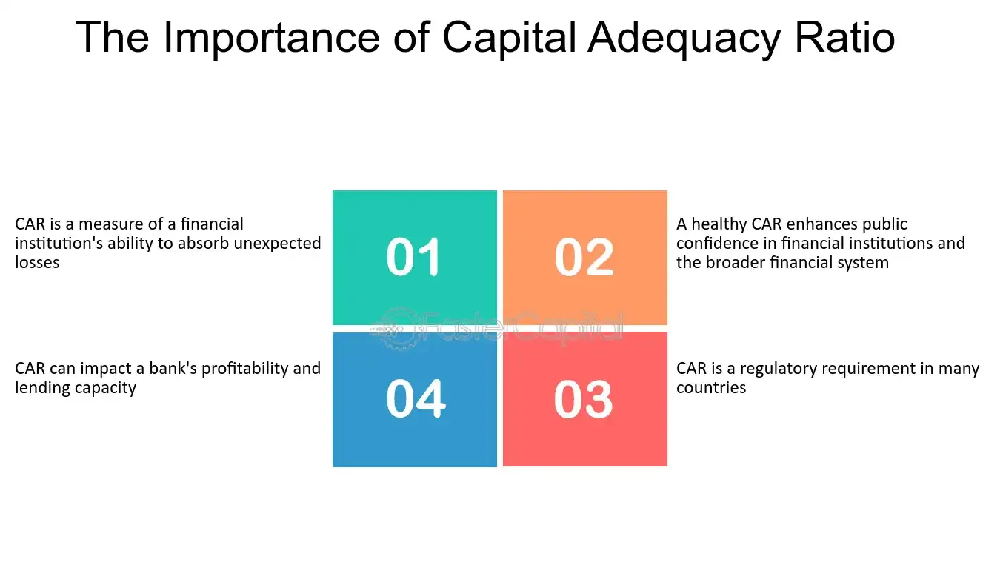

## Table of Contents

## What is the Capital Adequacy Ratio (CAR)?

The Capital Adequacy Ratio (CAR) is a measure used by banks to show how much capital they have compared to their risk. It's like a safety net that helps banks stay strong and safe. Regulators set a minimum CAR that banks must meet to make sure they can handle losses and keep customers' money safe.

Think of CAR as a score that tells us if a bank is healthy. If the ratio is high, it means the bank has a good cushion of capital to protect against bad loans or economic downturns. If it's low, the bank might be riskier because it doesn't have enough capital to cover potential losses. This ratio is important for keeping the banking system stable and protecting the economy.

## Why is the Capital Adequacy Ratio important for banks?

The Capital Adequacy Ratio (CAR) is really important for banks because it helps them stay safe and strong. It's like a rule that tells banks how much money they need to keep aside to cover any losses they might have. If a bank has a good CAR, it means they have enough money to handle tough times, like when people can't pay back their loans or if the economy goes bad. This makes the bank more stable and less likely to fail, which is good for everyone who uses the bank.

Having a strong CAR also helps build trust. When people know that a bank has a high CAR, they feel more confident about keeping their money there. They know the bank can handle problems without going broke. This trust is super important for banks because it helps them attract more customers and keep the ones they have. Plus, regulators look at the CAR to make sure banks are following the rules and staying safe, which helps keep the whole financial system stable.

## How does the Capital Adequacy Ratio affect shareholders?

The Capital Adequacy Ratio (CAR) can impact shareholders in a big way. When a bank has a high CAR, it means the bank is safer and less likely to fail. This makes shareholders feel more secure because their investments are less risky. A high CAR can also make the bank's stock price go up, which is good news for shareholders because it means their shares are worth more money.

On the other hand, if a bank's CAR is low, it can worry shareholders. A low CAR means the bank might not have enough money to cover losses, which makes it riskier. This can make the stock price go down, and shareholders might lose money. So, shareholders keep a close eye on the CAR because it tells them how safe their investment is and how well the bank is doing.

## What are the minimum CAR requirements set by regulatory bodies?

The minimum Capital Adequacy Ratio (CAR) requirements are set by different regulatory bodies around the world. In many countries, the Basel Committee on Banking Supervision's guidelines are followed. The Basel III framework, which many countries have adopted, sets a minimum CAR of 8%. This means that for every $100 of risk-weighted assets, a bank must have at least $8 in capital.

However, some countries have their own rules that might be stricter. For example, in the European Union, banks need to maintain a CAR of at least 8%, but there are also additional buffers that can push the effective minimum higher. In India, the Reserve Bank of India requires banks to have a CAR of at least 9%. These different requirements help make sure that banks in each country are strong enough to handle financial problems.

## How is the Capital Adequacy Ratio calculated?

The Capital Adequacy Ratio (CAR) is calculated by dividing a bank's capital by its risk-weighted assets. Capital includes things like the bank's own money and any profits it has kept. Risk-weighted assets are the bank's loans and other investments, but each one is given a risk score. For example, a loan to a big company might be seen as less risky than a loan to someone who might not pay it back, so it gets a lower risk score.

To find the CAR, you take the total capital and divide it by the total risk-weighted assets, then multiply by 100 to get a percentage. If a bank has $10 million in capital and $100 million in risk-weighted assets, the CAR would be ($10 million / $100 million) * 100 = 10%. This percentage tells us how well the bank can handle losses. A higher percentage means the bank is safer because it has more capital to cover any problems that might come up.

## What are the components of capital in the CAR calculation?

The components of capital in the Capital Adequacy Ratio (CAR) calculation are divided into two main types: Tier 1 and Tier 2 capital. Tier 1 capital is the most important because it's the bank's core capital. It includes things like the bank's own money, which is called common equity, and any profits the bank has kept instead of giving them to shareholders as dividends. Tier 1 capital is super important because it's what the bank can use to absorb losses without going out of business.

Tier 2 capital is a bit different. It's like an extra layer of protection that helps the bank if things get really bad. Tier 2 capital includes things like certain types of loans that the bank has taken out and some kinds of reserves. While Tier 2 capital is not as strong as Tier 1, it still helps the bank stay safe by providing more money to cover losses. Together, Tier 1 and Tier 2 capital make up the total capital that's used to calculate the CAR.

## How does a high CAR benefit shareholders?

A high Capital Adequacy Ratio (CAR) is good for shareholders because it means the bank is safe and strong. When a bank has a high CAR, it has more money set aside to handle losses. This makes the bank less likely to fail, which is great for shareholders. If the bank is stable, shareholders feel more secure about their investment, knowing that their money is in a safe place.

Plus, a high CAR can make the bank's stock price go up. When people see that a bank is doing well and has a good CAR, they are more likely to want to buy its stock. This demand can push the stock price higher, which means the value of the shares that shareholders own goes up too. So, a high CAR not only keeps the bank safe but can also help shareholders make more money.

## What risks do shareholders face if a bank has a low CAR?

If a bank has a low Capital Adequacy Ratio (CAR), it means the bank might not have enough money to cover losses if things go wrong. This can be scary for shareholders because it makes their investment riskier. If the bank can't handle losses well, it might have to cut back on what it does, or in the worst case, it might even fail. This could make the bank's stock price drop a lot, which means shareholders could lose money.

When people see a bank has a low CAR, they might not want to buy its stock. This can make the stock price go down even more. Shareholders could end up selling their shares for less than they paid, losing money. So, a low CAR is a big worry for shareholders because it could mean their investment is not as safe as they hoped, and they could lose money if the bank's problems get worse.

## How do changes in CAR impact a bank's stock price?

When a bank's Capital Adequacy Ratio (CAR) goes up, it usually makes the bank's stock price go up too. A higher CAR means the bank is safer because it has more money to cover losses. This makes people feel more confident about the bank, and they are more likely to want to buy its stock. When more people want to buy the stock, the price goes up. So, shareholders can make more money because their shares are worth more.

On the other hand, if a bank's CAR goes down, it can make the stock price go down too. A lower CAR means the bank might not have enough money to handle problems, which makes it riskier. When people see that a bank is riskier, they might not want to buy its stock, or they might even want to sell it. This can make the stock price drop, and shareholders could lose money if they have to sell their shares for less than they paid. So, changes in CAR can really affect how much money shareholders make or lose.

## Can you explain the difference between Tier 1 and Tier 2 capital in the context of CAR?

Tier 1 capital and Tier 2 capital are two types of money that banks use to make sure they are safe and strong. Tier 1 capital is the most important kind because it's the bank's core money. It includes the bank's own money, which is called common equity, and any profits the bank has kept instead of giving them to shareholders as dividends. Think of Tier 1 capital as the bank's strong foundation. It's what the bank can use to absorb losses without going out of business, making it super important for keeping the bank safe.

Tier 2 capital is like an extra layer of protection for the bank. It's not as strong as Tier 1 capital, but it still helps. Tier 2 capital includes things like certain types of loans that the bank has taken out and some kinds of reserves. If things get really bad, Tier 2 capital can help the bank cover more losses. Together, Tier 1 and Tier 2 capital make up the total capital that's used to calculate the Capital Adequacy Ratio (CAR), which tells us how well the bank can handle losses.

## How do international standards like Basel III influence CAR and shareholder value?

International standards like Basel III set rules for banks around the world to make them safer. These rules say that banks need to have a minimum Capital Adequacy Ratio (CAR) of 8%. This means banks have to keep enough money to cover losses, which makes them stronger and less likely to fail. When banks follow these rules, it helps keep the whole financial system stable. For shareholders, this is good news because a stronger bank means their investment is safer. If people see that a bank is following Basel III and has a good CAR, they might want to buy its stock, which can make the stock price go up.

Basel III also makes banks more transparent about their risks. This means shareholders can see more clearly how safe their investment is. When banks are more open about their CAR and how they manage risk, shareholders can make better decisions about buying or selling the bank's stock. If a bank has a high CAR and follows Basel III rules well, shareholders might feel more confident, which can lead to a higher stock price. On the other hand, if a bank struggles to meet these standards, shareholders might worry and the stock price could go down. So, Basel III can really affect how much money shareholders make or lose.

## What strategies can banks employ to improve their CAR and how do these strategies impact shareholders?

Banks can improve their Capital Adequacy Ratio (CAR) by increasing their capital or reducing their risk-weighted assets. One way to increase capital is by keeping more of their profits instead of paying them out as dividends. This means the bank has more money to cover losses, which makes it safer. Another way is to issue new shares, which brings in more money from investors. Banks can also reduce their risk-weighted assets by selling off risky loans or investments, or by being more careful about the loans they give out in the future. This makes the bank's overall risk lower, which can help improve the CAR.

When banks do these things to improve their CAR, it can affect shareholders in different ways. If the bank keeps more profits, shareholders might get less money in dividends, which could make them unhappy. But if the bank is safer because of a higher CAR, the stock price might go up, which is good for shareholders because their shares are worth more. If the bank issues new shares, it can dilute the value of existing shares, which might make the stock price go down a bit. But if selling off risky assets makes the bank stronger, shareholders might feel more confident, and this can help the stock price in the long run. So, while some strategies might have short-term downsides for shareholders, they can lead to a stronger, safer bank that's better for shareholders in the long term.

## What is the Capital Adequacy Ratio (CAR) and how is it understood?

The Capital Adequacy Ratio (CAR) is a crucial financial metric that quantifies a bank's capital relative to its risk-weighted assets. It is expressed as:

$$
\text{CAR} = \left( \frac{\text{Tier 1 Capital} + \text{Tier 2 Capital}}{\text{Risk-Weighted Assets}} \right) \times 100
$$

This ratio is instrumental in determining the ability of a bank to sustain potential losses, thereby safeguarding depositors' funds and ensuring overall financial stability. CAR is divided into two main components: Tier 1 and Tier 2 capital.

**Tier 1 Capital** primarily includes core capital, comprising common equity, retained earnings, and certain instruments that are perpetual and absorb losses immediately when they occur. This tier is vital because it serves as the primary funding source capable of absorbing losses without ceasing operations. The emphasis on core equity underlines its significance as a solid buffer against economic fluctuations and financial strains.

**Tier 2 Capital** encompasses supplementary capital, which includes revaluation reserves, subordinated debt, hybrid instruments, and undisclosed reserves. Although it serves as an additional layer of protection, it is considered less secure than Tier 1 capital due to its lower quality and less immediate loss-absorbing capacity.

Internationally, regulatory benchmarks such as the Basel III accords play a pivotal role in setting minimum thresholds for CAR. These accords were introduced to strengthen bank capital requirements and promote a more resilient banking system in the wake of financial crises. Under Basel III, banks are required to maintain a minimum CAR of 8%, with a core Tier 1 leverage ratio of at least 4.5% of risk-weighted assets, ensuring that institutions maintain a substantial buffer of high-quality capital.

CAR's role in the financial soundness of banks is paramount, as it acts as a protective mechanism against insolvency and mitigates systemic risk in the banking sector. By maintaining a robust CAR, banks are better positioned to absorb adverse shocks, preserve depositor trust, and contribute to financial stability.

## How can one achieve financial stability through CAR?

Maintaining a healthy Capital Adequacy Ratio (CAR) is crucial for ensuring financial stability within the banking sector. A well-managed CAR acts as a protective buffer, safeguarding banks against potential economic downturns by ensuring they have sufficient capital to absorb unexpected losses. The CAR is calculated as follows:

$$
\text{CAR} = \frac{\text{Tier 1 Capital} + \text{Tier 2 Capital}}{\text{Risk-Weighted Assets}}
$$

The numerator of this formula includes Tier 1 and Tier 2 capital, which respectively signify a bank's core capital and supplementary financial support. The denominator, risk-weighted assets, represents the varying levels of risk associated with the bank's exposures.

The significance of CAR in preventing systemic crises is paramount, as it functions as an indicator of potential financial distress. An optimal CAR level can serve as an early warning system, enabling timely interventions to avert broader financial breakdowns. Banks with higher CARs signal to regulators, investors, and stakeholders that they are well-managed, comply with regulatory standards, and maintain financial stability. This perception is vital as it enhances a bank's credibility and its ability to extend credit while managing risk prudently.

Strategies for improving CAR often involve optimizing the risk-weighted asset component. Banks can achieve this by:

1. **Enhancing Asset Quality**: Prioritizing high-quality, low-risk loans can reduce the risk exposure and improve CAR.

2. **Augmenting Capital Reserves**: Raising capital through retained earnings or capital markets, thereby increasing the numerator in the CAR formula.

3. **Efficient Risk Management**: Utilizing advanced analytics and risk assessment tools to better allocate capital toward assets with favorable risk-weight profiles.

4. **Regulatory Compliance**: Ensuring adherence to evolving regulatory frameworks such as Basel III, which may necessitate adjustments in capital strategies.

Long-term financial stability is contingent upon these strategic initiatives, enabling banks to maintain robust operations even in turbulent economic environments. Enhancing CAR is not an isolated process but requires a holistic approach to managing credit risk, operational efficiencies, and shareholder expectations, ultimately fostering a resilient banking system.

## References & Further Reading

[1]: Basel Committee on Banking Supervision. (2011). ["Basel III: A global regulatory framework for more resilient banks and banking systems."](https://www.bis.org/publ/bcbs189.htm)

[2]: Hull, J. C. (2018). ["Risk Management and Financial Institutions"](https://books.google.com/books/about/Risk_Management_and_Financial_Institutio.html?id=1J1QDwAAQBAJ) (5th Edition). Wiley Finance.

[3]: Matthews, K., & Thompson, J. (2014). ["The Economics of Banking"](https://www.amazon.com/Economics-Banking-Kent-Matthews/dp/1118639200). Wiley.

[4]: Duffie, D., & Singleton, K. J. (2003). ["Credit Risk: Pricing, Measurement, and Management"](https://press.princeton.edu/books/hardcover/9780691090467/credit-risk). Princeton University Press.

[5]: Lopez de Prado, M. (2018). ["Advances in Financial Machine Learning"](https://www.amazon.com/Advances-Financial-Machine-Learning-Marcos/dp/1119482089). Wiley.

[6]: Chan, E. P. (2013). ["Algorithmic Trading: Winning Strategies and Their Rationale"](https://github.com/ftvision/quant_trading_echan_book). Wiley Trading Series.

[7]: Basel Committee on Banking Supervision. (2010). ["Basel III: A global framework for more resilient banks and banking systems."](https://www.bis.org/publ/bcbs189_dec2010.htm) Bank for International Settlements. 

[8]: Treleaven, P., Galas, M., & Lalchand, V. (2013). ["Algorithmic Trading Review."](https://www.researchgate.net/publication/262239006_Algorithmic_Trading_Review) In Computer (Vol. 46, Issue 10, pp. 76–81).