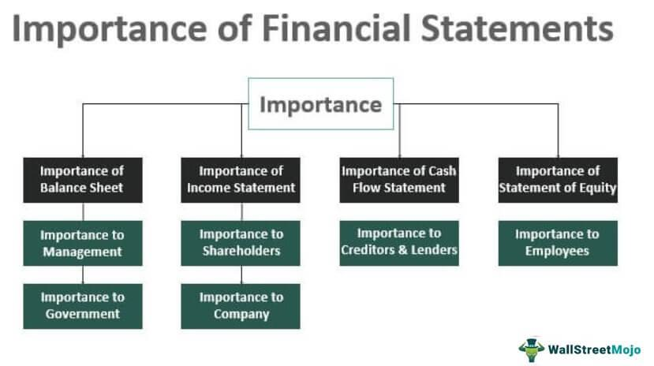

The financial landscape is a complex domain that integrates elements such as financial statements, shareholder interests, financial reporting, and algorithmic trading. Understanding these components is essential for investors, financial analysts, and managers seeking to navigate and succeed in modern finance. Financial statements provide critical insights into a company's financial position, offering shareholders the tools they need to make informed decisions. Meanwhile, financial reporting ensures transparency and consistent communication of this information across stakeholders, adhering to stringent regulatory standards.

Simultaneously, algorithmic trading has emerged as a pivotal force in financial markets, leveraging advanced algorithms to optimize trading strategies. By facilitating high-speed transactions and enhancing market liquidity, algorithmic trading plays a crucial role in today's financial operations. This article examines the integration and significance of these foundational elements, emphasizing their role in crafting informed investment strategies. Financial instruments derived from these components allow stakeholders to make prudent investment decisions while maintaining robust corporate governance. Understanding the synergy between these aspects is key to mastering the intricacies of modern financial markets.



## Table of Contents

## Understanding Financial Statements: A Shareholder's Perspective

Financial statements are crucial tools for shareholders, providing a comprehensive overview of a company's financial health and facilitating informed decision-making. The three principal types of financial statements are the balance sheet, the income statement, and the cash flow statement. Each one offers unique insights into different dimensions of a company's financial situation, assisting shareholders in evaluating profitability, operational efficiency, and financial stability.

The balance sheet presents a snapshot of a company’s assets, liabilities, and shareholders' equity at a specific point in time. This statement is instrumental for assessing a company's net worth and how it has been financed, either through debt or equity. Shareholders utilize balance sheets to gauge financial stability, determining whether the company possesses adequate resources to cover its obligations. Key metrics such as the current ratio (current assets divided by current liabilities) and the debt-to-equity ratio (total liabilities divided by shareholders' equity) provide insights into the company's financial leverage and liquidity position.

The income statement, also known as the profit and loss statement, details a company's revenues, expenses, and profits over a specific period. It enables shareholders to evaluate the company's operational performance and profitability. By analyzing key figures such as operating income, gross profit margins, and net profit margins, shareholders can assess how effectively a company is generating profit from its operations. The income statement serves as a roadmap for understanding a company’s operational efficiency and cost management practices.

The cash flow statement highlights the inflows and outflows of cash within a company during a particular period, focusing on cash generated from operating, investing, and financing activities. This statement is crucial for understanding the [liquidity](/wiki/liquidity-risk-premium) and cash position of the company. Shareholders can determine how well a company manages its cash, assess its ability to fund operations, pay dividends, and finance new investments. Critical indicators from the cash flow statement include the operating cash flow (OCF) and free cash flow (FCF), which reflect the cash generated from regular business operations and the cash available after capital expenditures, respectively.

Together, these financial statements form an integrated framework for evaluating a company's financial performance and position. Shareholders depend on this information to make informed decisions regarding investments, voting in corporate matters, and understanding the financial trajectory of the company. By analyzing these statements, shareholders can not only assess past performance but also forecast future financial conditions, aiding in more strategic and informed investment decisions.

## Financial Reporting and Its Significance

Financial reporting is a crucial component of modern financial systems, primarily mandated by regulatory bodies such as the U.S. Securities and Exchange Commission (SEC) to ensure transparency and uniformity across financial markets. The requirement for publicly-traded companies to produce and disclose accurate financial reports stems from the need to protect investors and maintain orderly market conditions. By providing insights into a company’s financial operations, these reports allow investors and analysts to assess financial health, compare performance across companies, and make informed investment decisions.

### Protocols and Compliance with International Standards

The protocols of financial reporting are largely dictated by accounting standards, such as Generally Accepted Accounting Principles (GAAP) in the United States and International Financial Reporting Standards (IFRS) used in many other countries. These standards establish a common framework of guidelines for preparing financial statements, ensuring consistency and comparability. Key components of these reports typically include balance sheets, income statements, and cash flow statements, which collectively offer a comprehensive view of a company’s financial performance and position.

Adhering to these standards is critical for maintaining the integrity of financial reports. Companies often employ internal controls and audit practices to ensure that financial information is accurate and free from material misstatement. Furthermore, compliance with these standards enhances credibility with investors, creditors, and other stakeholders who rely on these reports for decision-making.

### Consequences of Non-Compliance

Failure to comply with mandated financial reporting regulations can result in severe consequences for companies. The most immediate repercussion is legal and financial penalties imposed by regulatory bodies like the SEC. Non-compliance can also lead to restatements of financial reports, which may damage a company’s reputation and result in financial losses as stock prices may be adversely affected. Moreover, non-compliance erodes shareholder trust and can create a trust deficit, as investors rely on transparent and accurate reports to make informed judgments about the company’s future prospects.

For example, cases of financial reporting fraud, such as the Enron scandal, underscore the catastrophic consequences of non-compliance, both in terms of financial repercussions and loss of credibility. Such instances highlight the necessity for stringent regulatory oversight and the implementation of robust internal controls to safeguard against misinformation and fraud.

In conclusion, the significance of financial reporting lies in its ability to provide a structured and transparent view of a company’s financial health. By ensuring compliance with established international standards, companies not only fulfill regulatory obligations but also enhance their credibility and foster investor confidence. The role of financial reporting in the broader financial landscape is thus paramount, underlining its contribution to effective corporate governance and market stability.

## Algorithmic Trading in Today's Financial Markets

Algorithmic trading, often referred to as algo trading, employs sophisticated computer algorithms to execute trades at speeds and frequencies unachievable by human traders. By leveraging advanced mathematical models and formulas, [algorithmic trading](/wiki/algorithmic-trading) aims to optimize investment strategies, bringing both speed and precision into trading operations.

### Benefits of Algorithmic Trading

One of the most significant advantages of algorithmic trading is the enhancement of market efficiency. The continuous buying and selling of assets by algorithms ensure that price anomalies are quickly corrected, leading to more accurate pricing of securities. This high-frequency trading capability allows market participants to capitalize on small price differences across different markets or securities—a process known as [arbitrage](/wiki/arbitrage).

Moreover, algo trading significantly reduces transaction costs. Automated systems replace manual workforce requirements, cutting down on labor costs associated with traditional trading. Furthermore, algorithms can execute large orders by slicing them into smaller ones, minimizing the market impact and reducing the costs associated with price slippage.

### Potential Risks

Despite its benefits, algorithmic trading also introduces certain risks. One such risk is systemic risk, where an error or failure in an algorithm leads to widespread effects across the financial markets. Algorithms operate at high speeds and if not correctly designed, can cause rapid market disruptions. An infamous example is the "Flash Crash" of 2010, where the Dow Jones Industrial Average plunged about 1,000 points within minutes, largely due to erroneous algorithmic trading.

Furthermore, algorithmic trading can contribute to increased market [volatility](/wiki/volatility-trading-strategies). The speed and [volume](/wiki/volume-trading-strategy) at which trades are executed can sometimes lead to exaggerated movements in asset prices, especially if a large number of traders employ similar strategies.

### Regulatory Oversight

Given the potential risks associated with algorithmic trading, regulatory bodies play a crucial role in overseeing these practices. Agencies such as the U.S. Securities and Exchange Commission (SEC) and the Commodity Futures Trading Commission (CFTC) have implemented guidelines to safeguard market stability. Regulations often involve ensuring sufficient risk management systems are in place and that trading algorithms are regularly tested and monitored to mitigate any potential impact on market integrity.

In conclusion, while algorithmic trading offers substantial benefits in terms of efficiency and cost savings, it also presents challenges that necessitate careful regulation and oversight. As algorithmic trading continues to evolve, regulatory frameworks must adapt to address the complexities inherent in this high-speed, data-driven trading environment.

## The Interplay Between Financial Statements and Algo Trading

Algorithmic trading harnesses data from financial statements to refine trading decisions, emphasizing the symbiosis between financial analysis and technological execution. Financial statements such as balance sheets, income statements, and cash flow statements provide essential data that underpin algorithmic trading strategies. Their data richness enables the extraction of critical financial ratios and metrics instrumental for algorithm development.

### Financial Ratios and Analytics

Ratios like the Price-to-Earnings (P/E) ratio, Return on Equity (ROE), and Debt-to-Equity (D/E) ratio are extensively used to decipher a company’s financial health. For instance, a low P/E ratio might indicate undervaluation, which algorithms can exploit for potential buy signals. Here is a basic Python example to compute the P/E ratio:

```python
def price_to_earnings_ratio(market_price_per_share, earnings_per_share):
    return market_price_per_share / earnings_per_share

market_price = 100  # Example market price per share
earnings = 5        # Example earnings per share

pe_ratio = price_to_earnings_ratio(market_price, earnings)
print("P/E Ratio:", pe_ratio)
```

Similarly, ROE provides clarity on how well a company generates earnings from investments, guiding algorithms to firms with superior operational efficiency.

### Informing Algorithmic Models

Financial reports feed into algorithmic models by offering quantitative data for [backtesting](/wiki/backtesting) and optimization. Algorithms utilize historical financial data to simulate potential outcomes, enhancing predictive capabilities. This process of backtesting involves running trading strategies on past data to assess their reliability and profitability.

Python libraries like `pandas` and `numpy` are extensively used for such data manipulation:

```python
import pandas as pd
import numpy as np

# Example financial data
data = {
    'Year': [2019, 2020, 2021],
    'Net Income': [20000, 22000, 25000],
    'Shareholders Equity': [100000, 110000, 120000]
}

df = pd.DataFrame(data)
df['ROE'] = df['Net Income'] / df['Shareholders Equity']
print(df)
```

### Real-Life Examples

The interplay between financial reporting and algorithmic trading is evident in scenarios where companies release earnings reports. Positive earnings that surpass market expectations can trigger buy signals within algorithms, leading to significant trading volumes. For instance, the surge in high-frequency trading following Tesla's successful quarterly results exemplifies this interaction.

Moreover, hedge funds often employ quantitative models that integrate sentiment analysis from earnings calls with financial ratios. This blended approach allows the anticipation of market movements, utilizing financial compliance reports to enhance decision-making frameworks.

Conclusively, the integration of financial analysis into algorithmic trading represents a sophisticated amalgamation of data science and finance. By leveraging financial statements, algorithms enable investors to pursue lucrative trading opportunities with increased rigor and reduced risk, illustrating the indispensable role of robust financial analytics in contemporary financial markets.

## Conclusion

The interconnected nature of financial statements, shareholder insight, financial reporting, and algorithmic trading establishes a comprehensive framework that underpins modern investing. Each component holds distinct yet interrelated roles that contribute to informed decision-making and optimal investment strategies. Financial statements such as balance sheets, income statements, and cash flow statements offer vital data that reveal a company's fiscal condition. This data is crucial for shareholders seeking to understand their investment's profitability and sustainability.

In navigating this multifaceted relationship, it becomes essential to possess a deep understanding and strategic application of each element. Shareholder insights drawn from financial statements help ascertain the investment's viability, while robust financial reporting provides the necessary transparency and comparability needed to evaluate financial health across different companies. Algorithmic trading, on the other hand, utilizes these data points to execute high-speed trades, optimizing both efficiency and cost-effectiveness.

This article has pinpointed the critical components and tools that stakeholders—ranging from investors and financial analysts to corporate managers—should utilize to enhance their financial pursuits. By leveraging financial statements for strategic insights, adhering to stringent financial reporting standards, and embracing algorithmic trading, stakeholders can navigate the complexities of the financial markets more effectively.

In an era where financial markets are continuously evolving, staying informed and adept with these concepts is imperative. The ability to integrate financial analysis with algorithmic models not only improves investment outcomes but also strengthens corporate governance by aligning shareholder interests with corporate actions. This synergy, therefore, remains a cornerstone for achieving sustainable growth and competitive advantage in today's financial landscape.

## References & Further Reading

[1]: ["International Financial Statement Analysis"](https://www.amazon.com/International-Financial-Statement-Institute-Investment/dp/1119628059) by Thomas R. Robinson, Elaine Henry, Wendy L. Pirie, and Michael A. Broihahn

[2]: ["Financial Statement Analysis and Security Valuation"](https://highered.mheducation.com/sites/0078025311/student_view0/index.html) by Stephen H. Penman

[3]: Peterson, R.L., & Hightower, R. (2010). ["Trading on Sentiment: The Power of Minds Over Markets."](https://www.amazon.com/Trading-Sentiment-Power-Markets-Finance/dp/1119122767) Wiley Trading.

[4]: ["Algorithmic Trading and DMA: An Introduction to Direct Access Trading Strategies"](https://archive.org/details/algorithmictradi0000john) by Barry Johnson

[5]: ["The Intelligent Investor: The Definitive Book on Value Investing. A Book of Practical Counsel"](https://www.amazon.com/Intelligent-Investor-Definitive-Investing-Essentials/dp/0060555661) by Benjamin Graham