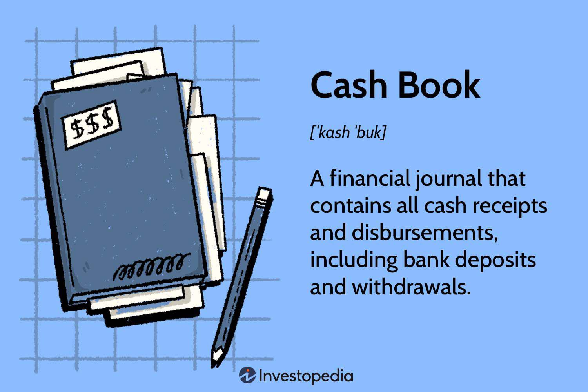

Forex trading is a dynamic world involving various strategies and techniques designed to navigate the complexities of currency markets. Among these methods, trade analysis and trading diaries are particularly noteworthy for their capacity to enhance trader performance. Trade analysis involves scrutinizing past trades to identify patterns, successes, and errors, enabling traders to make informed, data-driven decisions for future trades. Through consistent trade analysis, traders can discern high-probability setups and build confidence in their strategies.

In addition to trade analysis, the practice of maintaining a trading diary is invaluable. A trading diary acts as a comprehensive record of trading activities, capturing the rationale behind each decision. This record helps traders understand the psychological and emotional factors that might influence their trading behaviors. Documenting trades exposes recurring patterns that can be refined for improved future performance, thus serving as a foundation for continuous learning and strategy refinement.



Algorithmic trading, or algo trading, represents a significant advancement in forex trading. By blending programmed decision-making with rapid execution, algo trading offers enhanced speed and precision. Equipped with predefined algorithms, traders can automate decision-making processes, handling large data sets to identify market opportunities. This approach minimizes emotional bias, promoting consistent and disciplined trading aligned with pre-set strategies. Algo trading encompasses various strategies, such as arbitrage, trend-following, and sentiment analysis, each offering unique benefits in a fast-changing market landscape.

This article intends to explore the intersections of trade analysis, the utility of trading diaries, and the transformative impact of algorithmic trading in the forex market. Understanding and integrating these concepts can provide traders with valuable insights, leading to improved performance. By meticulously analyzing past trades and utilizing algorithmic strategies, traders can position themselves to gain a competitive edge in the demanding forex trading environment.

## Table of Contents

## Importance of Trade Analysis in Forex Trading

Trade analysis plays a crucial role in forex trading by enhancing traders' decision-making processes. By systematically reviewing past trades, traders can pinpoint successful strategies and recognize errors, allowing for more informed decisions in future endeavors. This reflective practice not only aids in identifying trading patterns but also bolsters trader confidence by highlighting high-probability setups.

One primary tool that traders utilize in trade analysis is technical analysis. This method involves assessing statistical trends gathered from trading activity, such as price movement and [volume](/wiki/volume-trading-strategy). Technical indicators, such as moving averages, relative strength index (RSI), and Bollinger Bands, provide insights into market sentiment and potential price direction. For instance, the moving average, calculated as:

$$
\text{MA}_n = \frac{\sum_{i=1}^{n} P_i}{n}
$$

where $P_i$ represents the price at a given interval $i$, helps smooth out price data, thereby identifying trends over specific periods.

In addition to technical analysis, [fundamental analysis](/wiki/fundamental-analysis) is integral to understanding [forex](/wiki/forex-system) market dynamics. It encompasses evaluating economic indicators, monetary policies, and geopolitical events affecting currency values. By considering factors such as interest rates, inflation, and political stability, traders can anticipate long-term market movements.

Furthermore, consistent trade analysis is vital for crafting a robust trading plan and strategy. A well-devised trading plan outlines specific entry and [exit](/wiki/exit-strategy) points, risk management techniques, and contingency plans, ensuring disciplined trading decisions. Strategies derived from comprehensive trade analysis are more likely to yield positive outcomes and adapt successfully to evolving market conditions.

In conclusion, trade analysis is indispensable for forex traders seeking to improve their performance. By rigorously assessing past performance through the lenses of technical and fundamental analysis, traders can refine their strategies and enhance their forecasting abilities. This continuous cycle of analysis and adaptation forms the bedrock of successful forex trading.

## The Role of a Trading Diary

Maintaining a trading diary is an essential practice for traders seeking to refine their strategies and enhance their performance in the forex market. A trading diary serves as a comprehensive record of all trading activities, capturing the rationale and decision-making processes behind each trade. This record-keeping enables traders to retrospectively analyze their actions, facilitating a deeper understanding of the dynamics influencing their trading outcomes.

One of the primary benefits of maintaining a trading diary is its ability to reveal the emotional and psychological factors that can influence trading decisions. Emotions such as fear, greed, and overconfidence can significantly impact trading performance. By noting these emotional states in a diary, traders can become more aware of their influence, allowing for the implementation of strategies to mitigate their impact.

Moreover, documenting each trade helps traders identify recurring patterns and behaviors that may adversely affect their performance. By having a structured account of their trades, traders can systematically evaluate what works and what needs adjustment. This retrospective evaluation forms the basis for continuous improvement, allowing traders to learn from both successful and unsuccessful trades.

In addition, a trading diary can serve as a critical tool for strategy refinement. As traders accumulate data over time, they gain a nuanced understanding of their trading style and the market conditions under which they perform best. This information is invaluable for fine-tuning existing strategies or developing new ones that align better with individual trading habits and market trends. 

In summary, a well-maintained trading diary is not just a record of past trades but a powerful resource for personal development and strategic enhancement in forex trading. It fosters self-awareness, aids in overcoming emotional biases, and provides a structured approach to learning from one's own trading history.

 to Algorithmic (Algo) Trading

Algorithmic trading, often referred to as algo trading, capitalizes on the use of pre-defined algorithms to facilitate trade decision-making and execution. This approach harnesses the power of computational technology to enhance both speed and precision in trading activities, offering significant advantages in the forex market. The fundamental premise of algo trading is the automation of trading processes, allowing for rapid decision-making and execution that manual trading cannot emulate.

Algo trading stands out by its ability to process and analyze large datasets efficiently. In fast-paced markets like forex, where conditions can change rapidly, this capability provides traders with a competitive edge. Algorithms can sift through vast amounts of data, identifying patterns and opportunities that might be missed by the human eye. This enhances the trader’s ability to act quickly on market shifts and capitalize on short-lived opportunities.

A notable advantage of [algorithmic trading](/wiki/algorithmic-trading) is its capacity to minimize emotional bias. Human emotions, such as fear and greed, can often cloud judgment and lead to inconsistent trading decisions. By relying on algorithms, traders can maintain consistency and discipline, adhering strictly to pre-set strategies without succumbing to emotional impulses. This reliability is crucial in ensuring that trading decisions are aligned with the trader’s overarching strategy, thus enhancing the potential for favorable outcomes.

Various strategies are employed within the framework of algo trading. Arbitrage, for instance, involves exploiting price differences of the same asset across different markets or forms. This strategy relies on the ability to react quickly to price discrepancies, a task well-suited to algorithmic execution. Trend-following is another common strategy, where algorithms identify and capitalize on existing market trends. This approach involves using technical indicators to determine entry and exit points, often without predicting specific price movements. Sentiment analysis, which evaluates market sentiment based on news, social media, and other sources, can also be automated to inform trading strategies. Algorithms capable of processing natural language data can integrate sentiment analysis into trading decisions, allowing traders to respond swiftly to changes in market sentiment.

Here is a simple Python example of how an algorithmic trend-following strategy might be implemented using moving averages:

```python
import pandas as pd
import numpy as np

# Example stock price data
data = {'Price': [100, 102, 105, 107, 110, 108, 107, 109, 111, 113]}
df = pd.DataFrame(data)

# Calculate moving averages
df['Short_MA'] = df['Price'].rolling(window=3).mean()
df['Long_MA'] = df['Price'].rolling(window=5).mean()

# Generate trading signals
def generate_signals(df):
    signals = []
    for i in range(len(df)):
        if df['Short_MA'][i] > df['Long_MA'][i]:
            signals.append('Buy')
        elif df['Short_MA'][i] < df['Long_MA'][i]:
            signals.append('Sell')
        else:
            signals.append('Hold')
    return signals

df['Signal'] = generate_signals(df)

print(df)
```

This script demonstrates an entry-level implementation of a trend-following strategy using moving averages and can be expanded upon for more sophisticated trading algorithms. Automated execution based on such signals ensures that the trader capitalizes on emerging trends without delay.

Overall, the integration of algorithmic trading in forex markets promises an elevation in trading efficiency, precision, and consistency, showcasing the transformative potential of technology in modern trading practices.

## Benefits of Combining Manual and Algo Trading

Integrating manual trade analysis with algorithmic trading offers a synergy that leverages human intuition alongside automated efficiency. This balanced approach allows traders to benefit from the strengths of both methods, enabling a flexible and precise response to varying market conditions.

Manual trade analysis contributes a depth of understanding that algorithms alone may not capture. Human traders can recognize market sentiments, interpret news impacts, and adjust to unforeseen events based on experience and intuition. This qualitative assessment ensures that the strategies employed by algorithms remain relevant to the current market context.

On the other hand, algorithmic trading excels in executing trades with speed and precision. Algorithms can handle vast amounts of data and execute trades based on predetermined parameters without the delay associated with human reaction times. This capability is crucial in fast-paced markets where opportunities can be fleeting.

Combining manual and algorithmic strategies enhances a trader's ability to confirm the logic and appropriateness of chosen strategies. Manual analysis can refine the parameters fed into algorithms, ensuring they align with broader market insights. This validation process is essential to avoid relying solely on historical data, which may not account for present or future market anomalies.

Further, a hybrid approach provides the agility to adapt strategies dynamically. Markets are not static; they evolve in response to economic indicators, geopolitical events, and other factors. By continually refining algorithmic parameters based on manual insights, traders can maintain an edge, adjusting quickly to new information without sacrificing the mechanical advantages of automated execution.

Consider a Python example that showcases the integration of manual insights into algorithmic trading:

```python
def update_algo_parameters(manual_input, initial_parameters):
    # Adjust algorithm parameters based on manual insights
    updated_parameters = initial_parameters.copy()
    for key in manual_input:
        if key in updated_parameters:
            updated_parameters[key] += manual_input[key]
    return updated_parameters

# Initial algorithm parameters
algo_params = {'stop_loss': 0.02, 'take_profit': 0.05, 'risk_factor': 1.0}

# Manual insights suggesting adjustments
manual_adjustments = {'risk_factor': -0.1}

# Update algorithm parameters
new_params = update_algo_parameters(manual_adjustments, algo_params)
print(new_params)
```

This code snippet demonstrates how manual inputs can dynamically adjust parameters within an algorithm, reflecting current market conditions more accurately.

In summary, the blend of manual analysis with algorithmic trading offers a powerful toolkit for traders. It empowers them to capitalize on the strengths of both human judgment and machine precision, ultimately improving trading strategies and market responsiveness.

## Conclusion

The convergence of trade analysis, trading diaries, and algorithmic (algo) trading can lead to significant improvements in trading outcomes. By maintaining a meticulous trading diary, traders can systematically enhance their self-awareness and the effectiveness of their strategies. The diary serves as a reflective tool that documents every trade, capturing the rationale, emotions, and outcomes. This documentation allows traders to identify patterns, both positive and negative, and refine their approach over time, thereby reducing emotional biases and enhancing decision-making processes.

Additionally, the utilization of algorithms in trading offers the ability to automate routine processes. This automation not only increases efficiency but also enables traders to capitalize on fleeting market opportunities that require quick responses, which might be missed with manual intervention. Algo trading algorithms, which can implement strategies with precision and speed, are vital for operating in fast-paced markets where timing is crucial.

Ultimately, the integration of trade analysis, trading diaries, and algo trading provides a robust framework to excel in forex trading. By combining the meticulousness of manual analysis with the efficiency of algorithms, traders can achieve a balanced approach that encompasses both strategic depth and operational agility. This hybrid model enables adaptability to varying market conditions and supports ongoing strategy refinement.

Success in forex trading is contingent on a trader’s commitment to continuous learning and adaptation. Engaging with educational resources, staying informed on market dynamics, and iterating on trading strategies are all essential practices. By embracing these elements and integrating them cohesively, traders can harness the full potential of these tools and strategies, positioning themselves for sustained success.

## References & Further Reading

[1]: Bergstra, J., Bardenet, R., Bengio, Y., & Kégl, B. (2011). ["Algorithms for Hyper-Parameter Optimization."](https://dl.acm.org/doi/10.5555/2986459.2986743) Advances in Neural Information Processing Systems 24.

[2]: ["Advances in Financial Machine Learning"](https://www.amazon.com/Advances-Financial-Machine-Learning-Marcos/dp/1119482089) by Marcos Lopez de Prado

[3]: ["Evidence-Based Technical Analysis: Applying the Scientific Method and Statistical Inference to Trading Signals"](https://www.amazon.com/Evidence-Based-Technical-Analysis-Scientific-Statistical/dp/0470008741) by David Aronson

[4]: ["Machine Learning for Algorithmic Trading"](https://github.com/stefan-jansen/machine-learning-for-trading) by Stefan Jansen

[5]: ["Quantitative Trading: How to Build Your Own Algorithmic Trading Business"](https://www.amazon.com/Quantitative-Trading-Build-Algorithmic-Business/dp/1119800064) by Ernest P. Chan