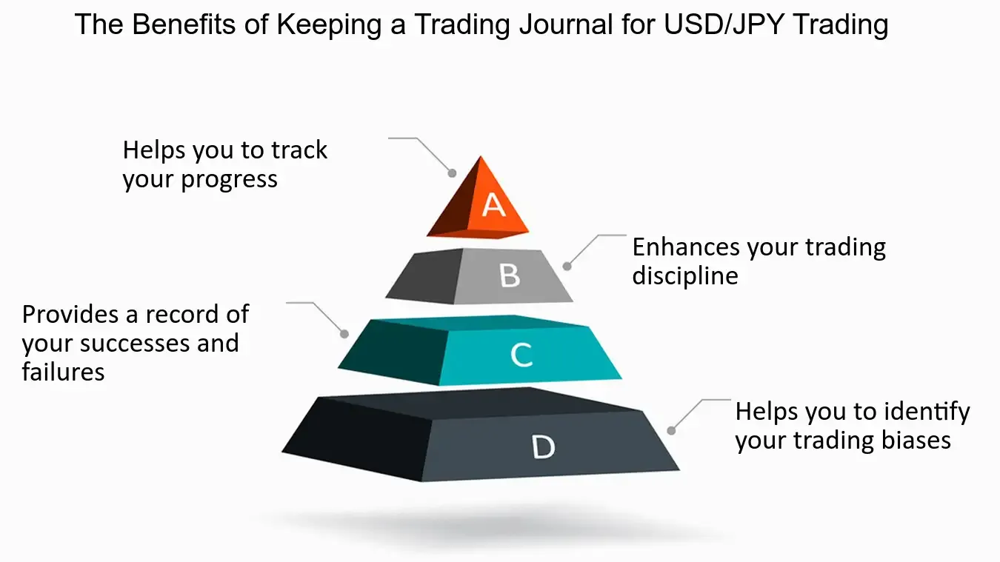

## Table of Contents

## What is a trading diary and why is it important for Forex traders?

A trading diary is a tool where Forex traders write down details about their trades. It includes things like when they bought or sold a currency, how much they spent, and why they made those decisions. It's like a personal journal for trading. Keeping a trading diary helps traders remember what they did and see patterns in their trading habits.

Using a trading diary is important for Forex traders because it helps them learn from their mistakes and successes. By looking back at their diary, traders can see what strategies worked and what didn't. This can help them make better decisions in the future. It also keeps them disciplined and focused on their trading goals.

## How can a beginner start keeping a Forex trading diary?

Starting a Forex trading diary is easy and helpful for beginners. First, choose a simple notebook or use a computer document where you can write down your trades. Each time you make a trade, write down the date, the currency pair you traded, how much you bought or sold, and the price at which you did it. Don't forget to note why you made that trade. Were you following a news event, or did you see a pattern on a chart? Writing these details helps you remember what you did and why.

As you keep adding to your diary, you'll start to see patterns in your trading. Maybe you'll notice that you make better trades in the morning or that certain currency pairs work better for you. This information is valuable because it helps you learn from your past trades. Over time, you can use your diary to improve your trading strategy. Just remember to be honest and write down everything, even if a trade didn't go well. Learning from mistakes is a big part of becoming a better trader.

## What essential information should be recorded in a Forex trading diary?

A Forex trading diary should include the date and time of each trade. This helps you remember exactly when you made your decisions. You should also write down the currency pair you traded, like EUR/USD or GBP/JPY. It's important to note the entry and exit prices, which are the prices at which you bought and sold the currency. Don't forget to record the size of your trade, or how much money you put into it. All of these details help you keep track of what you did.

Another key piece of information to include is your reason for making the trade. Were you following a news event, or did you see a pattern on a chart? Writing this down helps you understand your thought process. You should also note any emotions you felt during the trade, like if you were nervous or excited. This can help you see if your feelings affect your trading decisions. Lastly, record the outcome of the trade, whether you made a profit or a loss. This information is valuable because it helps you learn from your past trades and improve your strategy over time.

## How does keeping a trading diary help in tracking progress and performance?

Keeping a trading diary helps you track your progress and performance by giving you a clear record of all your trades. When you write down each trade, you can see how you're doing over time. You can look back at your diary to see if you're making more profits than losses, or if you're getting better at [picking](/wiki/asset-class-picking) the right times to buy and sell. This helps you understand if your trading strategy is working or if you need to change something.

Your trading diary also shows you patterns in your trading. By looking at your past trades, you might notice that you do better with certain currency pairs or at certain times of the day. You can also see if your emotions, like being too excited or nervous, affect your decisions. Knowing these patterns helps you make smarter trades in the future. Over time, your diary becomes a tool that helps you improve your skills and become a better Forex trader.

## Can a trading diary help in identifying and correcting trading mistakes?

Yes, a trading diary can really help you spot and fix trading mistakes. When you write down every trade, you can look back and see what went wrong. Maybe you traded too often, or maybe you didn't stick to your plan. By seeing these mistakes in your diary, you can figure out what you need to change. For example, if you notice that you lose money when you trade in the afternoon, you might decide to only trade in the morning.

Your trading diary also helps you see if your emotions are messing up your trades. Sometimes, feeling too excited or scared can make you buy or sell at the wrong time. By writing down how you felt during each trade, you can see if your emotions are a problem. Once you know this, you can work on staying calm and sticking to your strategy. Over time, using your diary to learn from your mistakes will make you a better trader.

## What are the psychological benefits of maintaining a Forex trading diary?

Keeping a Forex trading diary can really help with your emotions. When you write down your trades, you also write about how you felt. This can help you see if you get too excited or too scared when you trade. Knowing your feelings can help you stay calm and make better decisions. It's like having a friend who helps you stay cool and focused.

Your trading diary also makes you feel more in control. When you see all your trades written down, it's easier to see what you're doing well and what you need to work on. This can make you feel more confident and less worried about making mistakes. Over time, this can make trading less stressful and more fun, because you know you're getting better and learning from what you write.

## How can intermediate traders use a trading diary to refine their strategies?

Intermediate traders can use a trading diary to refine their strategies by looking at patterns in their past trades. By writing down why they made each trade and how it turned out, they can see what works and what doesn't. For example, they might notice that certain currency pairs give them better results or that they make more money when they follow specific news events. This information helps them focus on strategies that have proven successful and avoid ones that lead to losses.

Another way a trading diary helps is by showing how emotions affect trading decisions. Intermediate traders can write down how they felt during each trade, like if they were nervous or excited. Over time, they can see if these emotions cause them to make bad choices. By understanding this, they can work on staying calm and sticking to their plan. This emotional awareness can lead to more disciplined and effective trading strategies.

## What role does a trading diary play in risk management for Forex trading?

A trading diary helps with risk management in Forex trading by letting traders see how much risk they are taking with each trade. By writing down the size of each trade and the entry and exit prices, traders can look back and see if they are risking too much money on any single trade. This helps them understand if they need to adjust their trade sizes to avoid big losses. It's like keeping a scorecard that shows them when they might be playing too risky.

The diary also helps traders learn from their mistakes. If a trader keeps losing money because they're not using stop-loss orders, they can see this pattern in their diary. A stop-loss order is like a safety net that limits how much money you can lose. By noticing this in their diary, traders can start using stop-loss orders more often to protect their money. Over time, this helps them manage risk better and trade more safely.

## How can advanced traders analyze their trading diary to optimize their trading system?

Advanced traders can use their trading diary to find patterns and improve their trading system. By looking at all their past trades, they can see which strategies work best for them. They might notice that they make more money when they trade certain currency pairs or at specific times of the day. They can also see if they do better when they follow certain news events or use particular chart patterns. This helps them focus on the strategies that make them the most profit and avoid ones that lead to losses.

Another way advanced traders can use their diary is to check their risk management. They can look at how much money they risked on each trade and see if they need to change their approach. For example, if they often lose a lot on single trades, they might decide to use smaller trade sizes or set tighter stop-loss orders. By understanding these patterns, advanced traders can adjust their trading system to manage risk better and increase their chances of success.

## What tools and software are recommended for maintaining an effective Forex trading diary?

For keeping a good Forex trading diary, you can use simple tools like a notebook or a computer document. If you like writing things down by hand, a notebook works great. You can [carry](/wiki/carry-trading) it with you and write in it whenever you make a trade. If you prefer using a computer, a simple document like a Word file or a Google Doc can work well. These let you easily add, change, and look back at your trades.

There are also special software and apps made just for trading diaries. Some popular ones are Trading Journal Spreadsheets, Edgewonk, and TraderSync. These tools make it easy to write down your trades and see graphs and reports that show how you're doing. They can help you see patterns and learn from your trades faster. If you want to use these, you might need to pay a bit, but they can be really helpful for keeping track of everything and getting better at trading.

## How can a trading diary be used to prepare for and review trading sessions?

A trading diary can help you get ready for your trading sessions by letting you look back at what you did before. Before you start trading, you can read your past trades to see what worked and what didn't. This helps you remember your good strategies and avoid the mistakes you made before. You can also see if there are certain times of the day or certain currency pairs that you do better with. This way, you can plan your next trades better and feel more ready.

After your trading session, you can use your diary to review how you did. Write down all the details of your trades, like the time, the currency pair, and why you made those trades. This helps you see if you followed your plan or if your emotions got in the way. By looking at your diary, you can learn from your trades and see if you need to change anything for next time. Over time, this helps you get better at trading because you keep learning from what you write down.

## What are the long-term benefits of consistently keeping a Forex trading diary?

Keeping a Forex trading diary over a long time helps you see how much you've grown as a trader. When you write down every trade, you can look back and see how your strategies have changed and improved. You might start to notice patterns that you didn't see before, like which currency pairs work best for you or the best times to trade. This helps you make smarter choices and stick to what works. Over time, your diary becomes a tool that shows you how to keep getting better and making more money.

Another big benefit is that a trading diary helps you manage your emotions. When you write about how you felt during each trade, you can see if your feelings, like being too excited or scared, are affecting your decisions. By understanding this, you can work on staying calm and sticking to your plan. This makes trading less stressful and more enjoyable because you know you're learning and improving with every trade you write down.

## What is the Importance of Trade Analysis in Forex Trading?

Trade analysis plays a crucial role in forex trading by enhancing traders' decision-making processes. By systematically reviewing past trades, traders can pinpoint successful strategies and recognize errors, allowing for more informed decisions in future endeavors. This reflective practice not only aids in identifying trading patterns but also bolsters trader confidence by highlighting high-probability setups.

One primary tool that traders utilize in trade analysis is technical analysis. This method involves assessing statistical trends gathered from trading activity, such as price movement and [volume](/wiki/volume-trading-strategy). Technical indicators, such as moving averages, relative strength index (RSI), and Bollinger Bands, provide insights into market sentiment and potential price direction. For instance, the moving average, calculated as:

$$
\text{MA}_n = \frac{\sum_{i=1}^{n} P_i}{n}
$$

where $P_i$ represents the price at a given interval $i$, helps smooth out price data, thereby identifying trends over specific periods.

In addition to technical analysis, [fundamental analysis](/wiki/fundamental-analysis) is integral to understanding [forex](/wiki/forex-system) market dynamics. It encompasses evaluating economic indicators, monetary policies, and geopolitical events affecting currency values. By considering factors such as interest rates, inflation, and political stability, traders can anticipate long-term market movements.

Furthermore, consistent trade analysis is vital for crafting a robust trading plan and strategy. A well-devised trading plan outlines specific entry and [exit](/wiki/exit-strategy) points, risk management techniques, and contingency plans, ensuring disciplined trading decisions. Strategies derived from comprehensive trade analysis are more likely to yield positive outcomes and adapt successfully to evolving market conditions.

In conclusion, trade analysis is indispensable for forex traders seeking to improve their performance. By rigorously assessing past performance through the lenses of technical and fundamental analysis, traders can refine their strategies and enhance their forecasting abilities. This continuous cycle of analysis and adaptation forms the bedrock of successful forex trading.

## References & Further Reading

[1]: Bergstra, J., Bardenet, R., Bengio, Y., & Kégl, B. (2011). ["Algorithms for Hyper-Parameter Optimization."](https://dl.acm.org/doi/10.5555/2986459.2986743) Advances in Neural Information Processing Systems 24.

[2]: ["Advances in Financial Machine Learning"](https://www.amazon.com/Advances-Financial-Machine-Learning-Marcos/dp/1119482089) by Marcos Lopez de Prado

[3]: ["Evidence-Based Technical Analysis: Applying the Scientific Method and Statistical Inference to Trading Signals"](https://www.amazon.com/Evidence-Based-Technical-Analysis-Scientific-Statistical/dp/0470008741) by David Aronson

[4]: ["Machine Learning for Algorithmic Trading"](https://github.com/stefan-jansen/machine-learning-for-trading) by Stefan Jansen

[5]: ["Quantitative Trading: How to Build Your Own Algorithmic Trading Business"](https://www.amazon.com/Quantitative-Trading-Build-Algorithmic-Business/dp/1119800064) by Ernest P. Chan