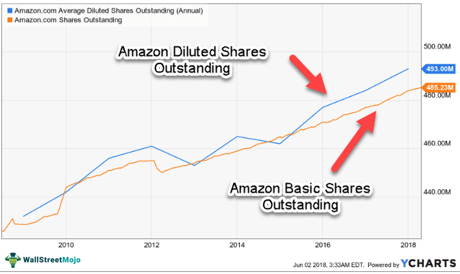

The stock market represents a complex and dynamic financial ecosystem where investors buy and sell shares of publicly traded companies. This marketplace operates on the principles of supply and demand, with prices influenced by a myriad of factors, including economic indicators, corporate performance, and global events. A fundamental component of this system is the concept of shareholders—individuals or entities that own shares in a company.

Shareholders play a pivotal role in the stock market as they effectively own portions of the companies whose shares they hold. Their decisions to buy, hold, or sell shares directly influence market dynamics and the valuation of these companies. The number of shares held by all shareholders at any given time is known as outstanding shares, which is determined by the total issued shares minus any held as treasury stock. These outstanding shares are crucial as they impact a company's market value and provide insight into its financial health. They form the basis for calculating earnings per share (EPS), a key measure of profitability, offering investors an essential tool for evaluating investment potential.



The introduction of algorithmic trading has revolutionized the stock market, capitalizing on the vast amounts of data generated by transactions. Algorithmic trading, or algo trading, involves using computer programs to execute trades at speeds and frequencies beyond human capability. This advancement has brought increased speed, efficiency, and precision to financial transactions. Algo trading strategies, such as trend-following and arbitrage, enhance market liquidity and ensure fair pricing, but they also contribute to the complexity and volatility of the market. The influence of algorithmic trading is profound, affecting how outstanding shares are traded and impacting the overall market structure.

Examining the multifaceted relationships between shareholders, outstanding shares, and algorithmic trading is essential for a comprehensive understanding of the stock market. These elements are intertwined, shaping each other and driving market dynamics in unprecedented ways. As we navigate this intricate landscape, a thorough understanding of these concepts is invaluable for making informed investment decisions and anticipating future trends.

## Table of Contents

## Understanding Shareholders and Outstanding Shares

Shareholders are individuals or entities that own shares of a company's stock, representing a unit of ownership. These stakeholders possess an interest in the company's profits and assets proportional to the number of shares they hold. Shareholders play a crucial role in corporate governance and decision-making processes by exercising their voting rights on matters such as elections of board members, mergers, and other significant events.

Outstanding shares refer to the total number of shares that are currently held by all shareholders, including shares held by institutional investors and insiders but excluding treasury shares that the company holds. These shares are determined during a company's Initial Public Offering (IPO) or subsequent stock issuance. The number of outstanding shares can be adjusted following stock repurchase programs, stock splits, or new share issuances.

The significance of outstanding shares in valuing a company cannot be understated. They are a critical component in calculating a company's market capitalization, which is determined by multiplying the current share price by the number of outstanding shares. This calculation provides investors with a quick snapshot of the company's market value, serving as a comparative tool in evaluating investment potential and financial health.

$$
\text{Market Capitalization} = \text{Share Price} \times \text{Outstanding Shares}
$$

Outstanding shares also influence the share price and ownership structure. A larger number of outstanding shares can dilute earnings per share (EPS), potentially impacting investor perceptions and the market valuation. Conversely, a company with fewer outstanding shares might exhibit higher [volatility](/wiki/volatility-trading-strategies) in its stock price due to lower [liquidity](/wiki/liquidity-risk-premium). Adjustments in the number of outstanding shares through stock buybacks or new issues directly influence the ownership percentages and governance dynamics within the company.

Understanding these concepts helps investors and analysts assess a company's valuation and investment potential effectively. Knowledge of outstanding shares enables stakeholders to gauge the implications of corporate actions on their financial interests, empowering them to make more informed investment choices.

## The Role of Market Capitalization

Market capitalization, often referred to as market cap, is a crucial metric in the financial markets that measures the total value of a publicly traded company's outstanding shares of stock. It is calculated by multiplying the current market price per share by the total number of outstanding shares. The formula is expressed as:

$$
\text{Market Cap} = \text{Price per Share} \times \text{Number of Outstanding Shares}
$$

Market capitalization provides investors with a snapshot of a company's size and its market valuation. It categorizes companies into different tiers—small-cap, mid-cap, and large-cap—each signifying varying levels of risk and growth potential. Generally, large-cap companies are considered more stable with lower risk and modest growth potential, while small-cap companies may offer higher growth opportunities accompanied by greater volatility and risk.

The relationship between outstanding shares and market capitalization is direct and fundamental. Since market cap is derived from the product of outstanding shares and the current share price, fluctuations in either of these factors can lead to significant changes in a company's market capitalization. For instance, if a company issues more shares, its outstanding shares increase, which can dilute the value per share unless the market value of the company increases proportionately.

In investment strategy formulation, market capitalization plays an integral role. It helps investors diversify their portfolios by allocating assets across companies of various sizes, thus balancing risk and growth potential. A diversified portfolio might include a mix of large-cap, mid-cap, and small-cap stocks to leverage the stability of larger companies and the growth potential of smaller ones. Moreover, market cap provides a benchmark for comparing companies within the same industry, aiding investors in making informed decisions based on relative valuation.

By understanding market capitalization, investors can determine the scalability and managerial efficiency of a company, thereby guiding decisions on investment allocation and risk management. It allows for a more precise assessment of a company's position and potential in the market, aligning with strategic financial goals.

 to Algorithmic Trading

Algorithmic trading refers to the utilization of computer algorithms to automate the process of buying and selling financial instruments in the market. This form of trading leverages complex mathematical models and formulas to make high-frequency trading decisions that optimize investment outcomes. Algorithmic trading has evolved significantly since its inception in the 1970s, when it started as a simple rule-based system for executing orders. With advancements in technology and increased computational power, it now encompasses a range of sophisticated techniques, enabling traders to process large volumes of data with minimal delay.

There are several advantages to using [algorithmic trading](/wiki/algorithmic-trading), primarily revolving around speed, efficiency, and precision. The speed of execution offered by algorithms is unparalleled, allowing trades to be completed in fractions of a second. This is particularly advantageous in high-frequency trading environments where even a millisecond of delay can result in significant financial impact. Efficiency is enhanced through the elimination of manual processes, which reduces the risk of human error and streamlines operations. Precision is a crucial [factor](/wiki/factor-investing), as algorithms are capable of executing trades with high accuracy by adhering to predefined rules and criteria without succumbing to emotional biases in decision-making.

Various algorithmic trading strategies are employed to capitalize on market opportunities. Trend-following is a popular strategy that involves algorithms analyzing historical price data and executing trades based on the identification of market trends. The goal is to enter trades in the direction of the trend, capturing profits from sustained price movements. Another widely used strategy is [arbitrage](/wiki/arbitrage), where algorithms simultaneously buy and sell equivalent securities in different markets to profit from price discrepancies. This requires rapid execution and extensive computational resources to identify and exploit short-lived inefficiencies.

Algorithmic trading continues to transform financial markets, offering traders the ability to enhance their trading strategies through automation and advanced data analysis. The ongoing development in this field promises further integration of sophisticated computational techniques, expanding the scope and capability of algorithmic trading systems.

## Interaction of Outstanding Shares and Algo Trading

Outstanding shares, representing the total number of shares issued by a company and currently held by its shareholders, directly impact market liquidity and trading [volume](/wiki/volume-trading-strategy). Liquidity, defined as the ease with which assets can be bought or sold without causing significant price changes, is crucial for efficient market functioning. A higher number of outstanding shares generally implies greater liquidity, as there are more shares available for trading. This enhances the ability to execute large trades with minimal impact on the share price.

Trading volume, the quantity of shares exchanged within a given time frame, is intrinsically linked to liquidity. More outstanding shares often lead to increased trading volume, providing fertile ground for algorithmic trading strategies. Algorithmic (algo) trading systems capitalize on these conditions by utilizing sophisticated mathematical models to execute trades rapidly and efficiently. Algorithms can be programmed to identify patterns and trends in share data, exploiting brief market inefficiencies for profit. For example, algorithms may engage in high-frequency trading ([HFT](/wiki/high-frequency-trading-strategies)), where they conduct a large number of trades within fractions of a second, capitalizing on minimal price differentials.

The constant monitoring of share data allows algorithms to adapt to changes in outstanding shares. Variations in outstanding shares, such as those resulting from share buybacks or new stock issuances, can significantly alter market dynamics. A reduction in outstanding shares through buybacks can decrease liquidity and increase share prices due to the reduced supply, potentially triggering algorithms to recalibrate their strategies. Conversely, an increase in shares through new issuances may initially depress the share price due to increased supply but can enhance liquidity and attract more trading activity.

Algorithmic decision-making relies heavily on accurate and current data. Changes in outstanding shares can influence algorithmic models, necessitating real-time adjustments to trading strategies. For instance, a sudden increase in outstanding shares might prompt algorithms to adopt a trend-following strategy, aiming to exploit potential upward [momentum](/wiki/momentum) created by increased trading activity. Alternatively, in the case of a decrease in shares, strategies may shift towards speculative trading or arbitrage.

Overall, the interplay between outstanding shares and algorithmic trading highlights the importance of real-time data analysis and adaptive trading strategies. Algorithmic systems not only respond to changes in the number of outstanding shares but also predict potential market shifts, enabling them to maintain a competitive edge in dynamic financial markets.

## The Impact of Float on Trading Strategies

Float refers to the number of a company’s shares that are available for trading by the public and is a subset of total outstanding shares. While outstanding shares are the total shares currently issued by a company, the float excludes shares owned by company insiders, such as executives and other key stakeholders, which are often subject to sale restrictions. 

$$
\text{Float} = \text{Outstanding Shares} - \text{Restricted Shares}
$$

The float is crucial for understanding market liquidity, which significantly impacts trading strategies, particularly in algorithmic trading. A larger float typically indicates higher liquidity, allowing for more seamless execution of trades without causing excessive price fluctuations. Conversely, a smaller float can lead to increased volatility, as even modest trading volumes might significantly impact stock prices.

Algorithmic trading systems use float data for liquidity assessments by analyzing the volume of trades relative to the float. This helps in gauging the capacity to execute large orders without incurring substantial market impact costs. For instance, in Python:

```python
def liquidity_ratio(trading_volume, float_shares):
    return trading_volume / float_shares

# Example usage
trading_volume = 1000000  # Daily trading volume
float_shares = 5000000    # Company's float
ratio = liquidity_ratio(trading_volume, float_shares)
print("Liquidity Ratio:", ratio)
```

A high liquidity ratio indicates active trading and suggests a suitable environment for high-frequency trading (HFT) strategies, which rely on executing thousands of orders in milliseconds to capitalize on small price movements. In high-frequency trading, float is integral, as these strategies require significant market liquidity to function effectively.

Float also plays a key role in momentum and other trading strategies. Smaller floats can lead to more pronounced price movements, making stocks of such companies appealing targets for momentum-based algorithms that seek to exploit sharp price shifts. Thus, understanding and analyzing float is essential for optimizing trading strategies across various contexts, ensuring algorithmic systems can make informed decisions based on real-time liquidity dynamics.

## Challenges and Opportunities in Algorithmic Trading

Algorithmic trading, characterized by using computer programs to execute trading decisions, presents several challenges and opportunities. Understanding these can help both traders and regulatory bodies to navigate the evolving landscape.

### Challenges in Algorithmic Trading

1. **Data Accuracy**: Ensuring accurate data is paramount in algorithmic trading. Algorithms rely heavily on data inputs to execute trades, and any anomalies or inaccuracies can lead to flawed decision-making. Data feeds from various stock exchanges must be precise and timely. Moreover, discrepancies between different data vendors can result in trades based on outdated or incorrect information, impacting the efficiency and profitability of trading strategies.

2. **Market Volatility**: Algorithmic trading systems must adapt to rapidly changing market conditions. Volatility can lead to significant price swings, and while algorithms can be programmed to manage certain levels of fluctuation, extreme volatility can overwhelm standard risk management protocols. This unpredictability requires algorithms to be robust and flexible, capable of handling unexpected market events effectively.

3. **Regulatory Frameworks**: The regulatory landscape significantly influences algorithmic trading practices. Regulations are designed to maintain market integrity, prevent manipulative trading practices, and protect investors. However, they can also pose challenges by imposing constraints on trading strategies and requiring compliance with reporting standards. For instance, the U.S. Securities and Exchange Commission (SEC) and the European Securities and Markets Authority (ESMA) have enacted rules governing algorithmic trading to prevent market manipulation and ensure fair trading practices.

### Opportunities in Algorithmic Trading

1. **Artificial Intelligence (AI) and Machine Learning**: AI and machine learning present opportunities to enhance trading processes. These technologies enable the development of advanced trading algorithms that can learn from historical data, adapt to new trends, and anticipate market movements. Machine learning models can analyze vast amounts of data, identify patterns, and make predictions that might not be apparent through traditional analysis. This capability enhances the precision and reliability of algorithmic trading strategies.

2. **Improving Trading Efficiency and Execution**: Technology advancements, including high-speed internet and powerful computing resources, facilitate quicker trade executions and more efficient market operations. Algorithmic trading capitalizes on these technologies to execute trades seamlessly across multiple markets and asset classes, reducing transaction costs and latency. This efficiency allows traders to exploit small price movements and capitalize on arbitrage opportunities.

3. **Emerging Technologies**: Beyond AI and machine learning, technologies like blockchain and quantum computing hold promise for algorithmic trading. Blockchain can offer increased transparency and security in trading operations, while quantum computing has the potential to revolutionize data processing speeds, allowing for even more sophisticated algorithmic models.

As the algorithmic trading landscape continues to evolve, overcoming challenges related to data accuracy, market volatility, and regulatory compliance will be crucial. At the same time, technological advancements present unprecedented opportunities for improving trading precision and strategy development. The interplay between these challenges and opportunities shapes the future of algorithmic trading, making continuous adaptation essential for success.

## Case Studies and Real-World Examples

Algorithmic trading has been implemented effectively by numerous companies and trading firms, demonstrating both its potential and its challenges. Among these, several well-documented case studies highlight the varied applications and impacts of algorithmic strategies on financial markets.

### Examples of Companies and Trading Firms Utilizing Algorithmic Trading Effectively

**Citadel Securities**: One of the most prominent market makers globally, Citadel Securities employs algorithmic trading to handle a substantial volume of trades daily. Their algorithms are designed to provide liquidity across multiple asset classes, leveraging speed and data analytics to optimize trade execution and manage risk. By constantly refining their algorithms, Citadel has maintained a competitive edge in high-frequency trading environments.

**Two Sigma Investments**: This quantitative hedge fund uses a rigorous scientific method and advanced computing to develop its trading strategies. By employing machine learning and big data analytics, Two Sigma has successfully predicted market trends and executed profitable trades, demonstrating the efficacy of algorithmic trading in managing substantial assets.

### Case Studies: Index Changes and Stock Buybacks

**Index Changes**: The inclusion or exclusion of a company in a significant stock index, such as the S&P 500, often results in increased volatility and trading volume around the announcement date. Algorithmic trading systems are particularly adept at capitalizing on these opportunities by swiftly adjusting portfolios to mirror index compositions. These real-time adjustments can influence stock prices and market liquidity, underscoring the role of algorithms in maintaining market efficiency.

**Stock Buybacks**: Corporations engage in stock repurchase programs to buy back their shares from the marketplace, attempting to boost the stock price and improve financial ratios. Algorithmic trading systems can anticipate or respond to these buyback announcements, adjusting positions based on anticipated price movements. This strategic responsiveness is evident in firms that program their algorithms to detect buyback signals from financial disclosures.

### Lessons from Past Market Events

**Flash Crash of 2010**: This market event highlighted the vulnerabilities of algorithmic trading systems. Triggered by large trades executed at rapid speeds, the Dow Jones Industrial Average dropped nearly 1,000 points in minutes before recovering just as quickly. This incident emphasized the need for circuit breakers and better risk management protocols within algorithmic trading systems to prevent extreme volatility and maintain market stability.

**Quant Quake of 2007**: A disruption in quantitative hedge funds' strategy occurred, leading to significant losses in several prominent funds. This event revealed the risks associated with overcrowded trades and the importance of diversification in algorithmic strategies. The lessons learned include the need for adaptive algorithms that can withstand sudden changes in market dynamics and avoid herding behaviors.

These cases demonstrate the effective use of algorithmic trading by companies proficient in leveraging advanced technological tools to optimize trading strategies. They also underscore critical lessons regarding the risks associated with market volatility and the importance of robust risk management practices in algorithmic trading strategies. As technology continues to evolve, these examples highlight the need for continuous innovation and adaptation in algorithmic trading practices.

## Future Trends and Developments in Stock Market Trading

Future advancements in stock market trading are poised to be shaped by several emerging technologies and methodologies. Key among these are quantum computing, blockchain technology, and [artificial intelligence](/wiki/ai-artificial-intelligence) (AI), all of which promise to revolutionize how trading is conducted.

Quantum computing is expected to have a profound impact on the speed and efficiency of trading systems. Unlike classical computers that use bits as the smallest unit of information, quantum computers use quantum bits or qubits, which can represent both 0 and 1 simultaneously due to superposition. This allows quantum computers to process a vast number of possibilities at once, significantly accelerating complex computations. In trading, this could enable more sophisticated modeling of financial markets, optimizing portfolio management, and developing more effective predictive algorithms. However, the application of quantum computing in finance is still in its nascent stages, with major challenges to overcome such as error rates, stability, and practical implementation.

Blockchain technology offers a distributed and immutable ledger that promises to enhance transparency, reduce fraud, and streamline settlement processes in trading. By providing a clear and incorruptible record of transactions, blockchain can minimize counterparty risk and reduce the reliance on intermediaries. This could lead to more decentralized trading platforms and quicker transaction times. Companies are already exploring blockchain-based solutions for clearing and settlement to improve efficiencies and cut costs associated with traditional systems.

Artificial Intelligence (AI) continues to evolve rapidly, enhancing trading accuracy and efficiency in various ways. AI systems, particularly those involving [machine learning](/wiki/machine-learning) and [deep learning](/wiki/deep-learning), can process massive data sets far more quickly and accurately than human traders. These systems can identify patterns, forecast market trends, and execute trades at optimal times, frequently with greater precision than traditional methods.

Python code, for instance, can be used to develop AI-based trading algorithms, as demonstrated by the simple example:

```python
import pandas as pd
from sklearn.model_selection import train_test_split
from sklearn.ensemble import RandomForestClassifier

# Load data (example assumes a DataFrame df with market features and target 'signal')
df = pd.read_csv('market_data.csv')
X = df.drop('signal', axis=1)
y = df['signal']

# Split data into training and test sets
X_train, X_test, y_train, y_test = train_test_split(X, y, test_size=0.2, random_state=42)

# Train a Random Forest model
model = RandomForestClassifier(n_estimators=100, random_state=42)
model.fit(X_train, y_train)

# Predict signals
predictions = model.predict(X_test)
```

In this example, a Random Forest Classifier is trained to predict trading signals based on historical market data. Such models can be integrated into broader AI systems for executing trades based on real-time data analysis.

Future developments are also anticipated in the integration of different technologies. For instance, the combination of AI and blockchain could foster novel trading platforms that not only execute trades with higher precision but also ensure secure and transparent transaction processing. This hybrid model would capitalize on AI's predictive strengths and blockchain's secure infrastructure.

These technological advancements have the potential to reshape traditional trading methodologies, offering unprecedented capabilities in data analysis, transaction security, and overall market efficiency. As these technologies mature and become more accessible, they are likely to redefine the landscape of stock market trading, driving further innovation and competition.

## Conclusion

Understanding the complexities of shareholders, outstanding shares, and algorithmic trading is vital for navigating the dynamic landscape of the stock market. Shareholders are the backbone of market operations, owning equity stakes in companies and influencing corporate decisions. Their interest in the quantity of outstanding shares is pivotal, as these shares determine equity distribution and company valuation. Outstanding shares form the basis for calculating key financial metrics, including earnings per share (EPS) and market capitalization. This underscores the critical impact they have on a company's perceived value and investor decisions.

Algorithmic trading, a transformative force in modern financial markets, leverages advanced mathematical models to execute trades at high speed and precision. Algorithms often consider data related to shares outstanding and market dynamics to optimize trading strategies. The interplay between share data and algorithmic trading reflects in liquidity management and transaction velocities, shaping market efficiency and price stability.

Investors must appreciate these intertwined concepts for making astute, informed decisions. A solid grasp of how outstanding shares influence a company's valuation and market activity, combined with understanding the role of algorithmic trading in market mechanisms, equips investors to better assess opportunities and risks. As the financial landscape continues to evolve with technological advancements, embracing continuous learning and adaptation is essential for staying ahead. Whether through exploring algorithmic influences or analyzing market trends, an ongoing commitment to understanding these elements will provide investors with a significant advantage in the ever-evolving world of finance.

## References & Further Reading

### Articles and Online Resources

1. **Investopedia**: A comprehensive resource for investors of all levels. Articles cover a range of topics including outstanding shares, market capitalization, and algorithmic trading.
   - [Investopedia](https://www.investopedia.com)

2. **Khan Academy**: Offers an extensive library of educational videos on the basics of the stock market and investment strategies, including discussions on market capitalization and shareholder roles.
   - [Khan Academy - Economics & Finance](https://www.khanacademy.org/economics-finance-domain/core-finance)

3. **Securities and Exchange Commission (SEC)**: The official US government website provides detailed regulatory documents and guidelines, offering insights into market practices, including those related to algo trading.
   - [SEC Official Website](https://www.sec.gov)

4. **Algorithmic Trading & DMA: An Introduction to Direct Access Trading Strategies** by Barry Johnson: This book provides a detailed explanation of algorithmic trading strategies and how they are applied in financial markets.

5. **"Advances in Financial Machine Learning" by Marcos López de Prado**: An essential read for those interested in the intersection of finance and machine learning, discussing algorithmic trading applications.

### Books

1. **"The Intelligent Investor" by Benjamin Graham**: Often cited as the stock market bible, providing insights into investment strategies and the importance of understanding shareholder value.

2. **"Flash Boys: A Wall Street Revolt" by Michael Lewis**: This book explores the rise of high-frequency trading and its impact on the financial markets.

3. **"Algorithmic Trading: Winning Strategies and Their Rationale" by Ernest P. Chan**: Offers a deep dive into developing, testing, and implementing algorithmic trading strategies.

### Research Papers

1. **"The Impact of High-Frequency Trading on an Electronic Market" by Jonathan Brogaard**: This paper analyzes the effects of high-frequency trading on market stability and efficiency.
   - Available at: [SSRN](https://www.ssrn.com/en/)

2. **"Measuring the Efficiency of Algorithmic Trading Systems"**: This academic paper provides insights into the metrics used to evaluate algorithmic trading performance.
   - Available at: [SSRN](https://www.ssrn.com/en/)

### Additional Resources

1. **"What is Market Capitalization?"** by Nasdaq: A primer on understanding market cap and its relevance to valuing a company.
   - [Nasdaq - Market Cap Explanation](https://www.nasdaq.com/investing/glossary/m/market-capitalization)

2. **"Introduction to Shareholder Value" by Harvard Business Review**: Discusses how companies create value for shareholders and the implications for stock market investments.
   - [Harvard Business Review](https://hbr.org/)

3. **Coursera and edX Courses on Finance and Investment**: Offer courses that introduce key financial concepts and trading strategies, suitable for beginners and advanced learners alike.
   - [Coursera](https://www.coursera.org)
   - [edX](https://www.edx.org)

These resources provide a strong foundation for anyone looking to enhance their understanding of the stock market, shareholder dynamics, and algorithmic trading.