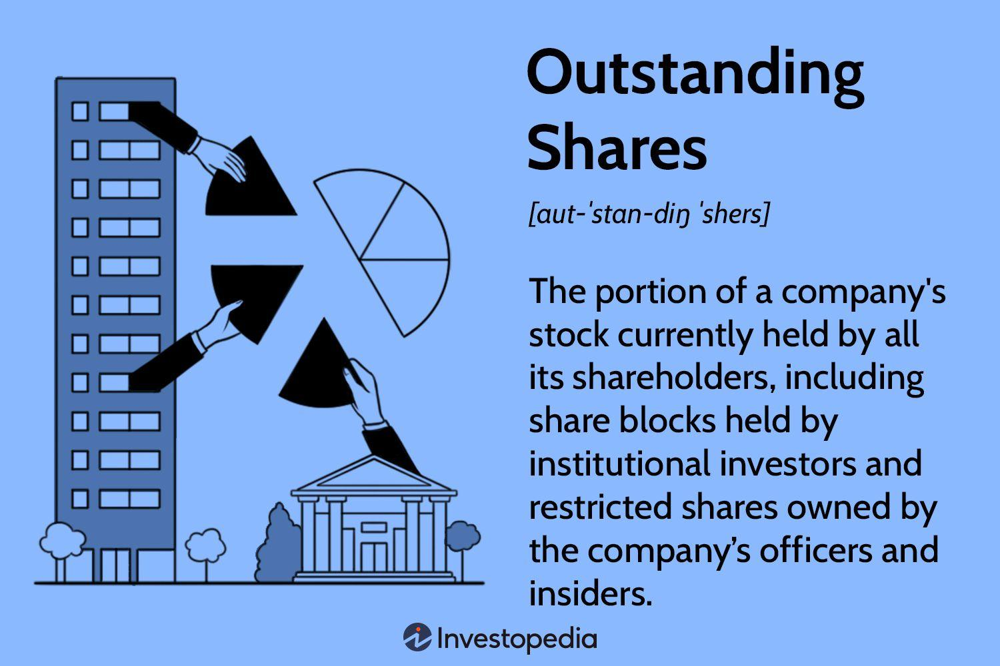

## Table of Contents

## What are outstanding shares?

Outstanding shares are the total number of a company's shares that are owned by investors, including the public and company insiders. These shares are important because they represent the ownership of the company. When people buy and sell these shares on the stock market, they are trading pieces of the company.

The number of outstanding shares can change over time. For example, if a company issues new shares, the number of outstanding shares goes up. On the other hand, if the company buys back its own shares, the number of outstanding shares goes down. Knowing the number of outstanding shares is useful for investors because it helps them understand the value of their investment and how much of the company they own.

## Why should shareholders care about the number of outstanding shares?

Shareholders should care about the number of outstanding shares because it helps them understand their ownership in the company. If a company has a lot of outstanding shares, each share represents a smaller piece of the company. This means that if the company does well and makes more money, each shareholder gets a smaller part of the profits. On the other hand, if there are fewer outstanding shares, each share is worth a bigger piece of the company, so shareholders might get more of the profits.

The number of outstanding shares also affects the value of each share. When a company has more outstanding shares, the price of each share might go down because there are more shares available to buy. If the company buys back some of its shares and reduces the number of outstanding shares, the price of each share might go up because there are fewer shares available. This is important for shareholders because it can impact how much money they can make from selling their shares.

## How do outstanding shares affect a shareholder's ownership percentage?

The number of outstanding shares directly impacts a shareholder's ownership percentage. If a company has a lot of outstanding shares, each share represents a smaller piece of the company. So, if you own 100 shares in a company that has 1 million outstanding shares, you own a very small percentage of the company. But if the same company had only 100,000 outstanding shares, your 100 shares would represent a much bigger piece of the company.

Changes in the number of outstanding shares can also change your ownership percentage over time. If the company decides to issue more shares, the total number of outstanding shares goes up. This means your ownership percentage goes down because your shares now represent a smaller part of the company. On the other hand, if the company buys back some of its shares, the number of outstanding shares goes down, and your ownership percentage goes up because your shares now represent a larger part of the company.

## What is the difference between outstanding shares and authorized shares?

Outstanding shares are the total number of shares that a company has given to investors. This includes all the shares that people own, whether they are the public or company insiders. These shares can be bought and sold on the stock market, and they represent the actual ownership of the company.

Authorized shares, on the other hand, are the maximum number of shares that a company is allowed to issue. This number is set when the company is formed and can be changed by the company's board of directors. Not all authorized shares are given out to investors right away. Some might be kept in reserve for future use, like if the company wants to raise more money later by selling more shares.

So, the main difference is that outstanding shares are the shares that have already been given to investors, while authorized shares are the total number of shares the company could potentially issue. The number of outstanding shares will always be less than or equal to the number of authorized shares.

## How can the number of outstanding shares impact a company's stock price?

The number of outstanding shares can affect a company's stock price because it changes how much of the company each share represents. If a company has a lot of outstanding shares, each share is a smaller piece of the company. This means that if the company is worth $100 million and has 10 million shares, each share is worth $10. But if the company had only 5 million shares, each share would be worth $20. So, more outstanding shares can make the price of each share go down because each share is less valuable.

Changes in the number of outstanding shares can also move the stock price. If a company issues more shares, the total number of outstanding shares goes up. This can make the stock price go down because there are more shares for people to buy. On the other hand, if a company buys back some of its shares, the number of outstanding shares goes down. This can make the stock price go up because there are fewer shares available, and each share is now a bigger piece of the company.

## What is stock dilution and how does it relate to outstanding shares?

Stock dilution happens when a company issues new shares, which increases the total number of outstanding shares. When this happens, each existing share represents a smaller piece of the company. Imagine you own 100 shares in a company that has 1,000 shares total. If the company decides to issue 1,000 more shares, now there are 2,000 shares total, and your 100 shares are only half as valuable as they were before.

This is important for shareholders because dilution can affect the value of their investment. If the company issues more shares, the price of each share might go down because there are more shares for people to buy. This means that even though you still own the same number of shares, the value of your investment might be less. Companies might issue new shares to raise money for growth, but it's something shareholders need to keep an eye on because it can change how much of the company they own.

## How can shareholders find out the number of outstanding shares of a company?

Shareholders can find out the number of outstanding shares of a company by looking at the company's financial reports. These reports are called quarterly or annual reports, and they are available on the company's website or through the Securities and Exchange Commission (SEC) website. The number of outstanding shares is usually listed in the financial statements or in the notes to the financial statements.

Another way to find the number of outstanding shares is by using financial websites like Yahoo Finance or Google Finance. These websites gather information from the company's reports and make it easy to see. Just type in the name or the stock symbol of the company, and you can find the number of outstanding shares listed on the company's summary page.

## What role do outstanding shares play in calculating earnings per share (EPS)?

Outstanding shares are important when figuring out a company's earnings per share (EPS). EPS tells you how much money the company made for each share of its stock. To find EPS, you take the company's total earnings and divide it by the number of outstanding shares. So, if a company made $10 million and has 5 million outstanding shares, the EPS would be $2 per share.

The number of outstanding shares can change, and this can affect the EPS. If a company issues more shares, the number of outstanding shares goes up. This makes the EPS go down because the same amount of earnings is now spread out over more shares. On the other hand, if the company buys back some of its shares, the number of outstanding shares goes down, and the EPS goes up because the earnings are now spread over fewer shares. So, keeping an eye on the number of outstanding shares can help you understand how the company's earnings are shared among its shareholders.

## How do changes in outstanding shares affect voting power in shareholder meetings?

When a company changes the number of outstanding shares, it can affect how much say each shareholder has in company decisions. If a company issues more shares, the total number of outstanding shares goes up. This means that each existing share now represents a smaller piece of the company, so each shareholder has less voting power. For example, if you own 100 shares and the company issues 1,000 more shares, your 100 shares are now a smaller part of the total, so your vote at shareholder meetings counts for less.

On the other hand, if a company buys back some of its shares, the number of outstanding shares goes down. This makes each share represent a bigger piece of the company, so each shareholder's voting power goes up. If the company bought back 500 shares in the example above, your 100 shares would now be a bigger part of the total, so your vote would count for more. Keeping track of changes in outstanding shares can help shareholders understand how much influence they have in company decisions.

## What are the implications of buybacks on the number of outstanding shares?

When a company buys back its own shares, it reduces the number of outstanding shares. This is called a share buyback or stock repurchase. When the company takes back some of its shares, the total number of shares that people own goes down. This means that the value of each remaining share goes up because each share now represents a bigger part of the company. If the company made $100 million and had 10 million shares before the buyback, each share was worth $10. After buying back 2 million shares, there are now only 8 million shares left, so each share is worth $12.50.

Buybacks can also affect how much money shareholders get from the company's earnings. If the number of outstanding shares goes down, the earnings per share (EPS) goes up because the same amount of earnings is now spread over fewer shares. This can make the company look more profitable to investors. Plus, shareholders might get a bigger piece of the profits because their shares are now worth more. But, buybacks can also change how much say shareholders have in company decisions. With fewer shares, each shareholder's vote at meetings becomes more powerful.

## How do outstanding shares influence market capitalization?

Outstanding shares are important for figuring out a company's market capitalization, or market cap. Market cap is how much the whole company is worth, and you find it by multiplying the number of outstanding shares by the price of one share. If a company has 10 million outstanding shares and each share costs $10, the market cap is $100 million. So, the more outstanding shares a company has, the higher its market cap can be if the share price stays the same.

Changes in the number of outstanding shares can also change the market cap. If a company issues more shares, the total number of outstanding shares goes up. This can make the market cap go up if the share price stays the same because you're multiplying a bigger number of shares by the same price. But if the company buys back some of its shares, the number of outstanding shares goes down, which can make the market cap go down if the share price stays the same. So, keeping track of the number of outstanding shares helps investors understand how much the company is worth.

## What advanced financial ratios involve outstanding shares and how are they interpreted?

Two advanced financial ratios that involve outstanding shares are the price-to-earnings (P/E) ratio and the dividend yield. The P/E ratio tells you how much investors are willing to pay for each dollar of the company's earnings. You find it by dividing the price of one share by the earnings per share (EPS). EPS is the company's total earnings divided by the number of outstanding shares. So, if a company's share price is $20 and its EPS is $2, the P/E ratio is 10. This means investors are willing to pay $10 for every dollar of earnings. A high P/E ratio might mean people think the company will grow a lot in the future, while a low P/E ratio might mean they think it won't grow as much.

The dividend yield tells you how much money you get back from owning the stock as a percentage of what you paid for it. You find it by dividing the annual dividend per share by the price of one share and then multiplying by 100 to get a percentage. The annual dividend per share is the total dividends the company pays out each year divided by the number of outstanding shares. So, if a company pays out $1 in dividends per year and the share price is $20, the dividend yield is 5%. This means you get back 5% of what you paid for the stock each year in dividends. A high dividend yield can be good if you want to get money back from your investment, but a low yield might mean the company is keeping more money to grow the business.

## What is the understanding of shareholders and outstanding shares?

Shareholders are individuals or entities that own shares of a company's stock, representing a unit of ownership. These stakeholders possess an interest in the company's profits and assets proportional to the number of shares they hold. Shareholders play a crucial role in corporate governance and decision-making processes by exercising their voting rights on matters such as elections of board members, mergers, and other significant events.

Outstanding shares refer to the total number of shares that are currently held by all shareholders, including shares held by institutional investors and insiders but excluding treasury shares that the company holds. These shares are determined during a company's Initial Public Offering (IPO) or subsequent stock issuance. The number of outstanding shares can be adjusted following stock repurchase programs, stock splits, or new share issuances.

The significance of outstanding shares in valuing a company cannot be understated. They are a critical component in calculating a company's market capitalization, which is determined by multiplying the current share price by the number of outstanding shares. This calculation provides investors with a quick snapshot of the company's market value, serving as a comparative tool in evaluating investment potential and financial health.

$$
\text{Market Capitalization} = \text{Share Price} \times \text{Outstanding Shares}
$$

Outstanding shares also influence the share price and ownership structure. A larger number of outstanding shares can dilute earnings per share (EPS), potentially impacting investor perceptions and the market valuation. Conversely, a company with fewer outstanding shares might exhibit higher [volatility](/wiki/volatility-trading-strategies) in its stock price due to lower [liquidity](/wiki/liquidity-risk-premium). Adjustments in the number of outstanding shares through stock buybacks or new issues directly influence the ownership percentages and governance dynamics within the company.

Understanding these concepts helps investors and analysts assess a company's valuation and investment potential effectively. Knowledge of outstanding shares enables stakeholders to gauge the implications of corporate actions on their financial interests, empowering them to make more informed investment choices.

## What is the Role of Market Capitalization?

Market capitalization, often referred to as market cap, is a crucial metric in the financial markets that measures the total value of a publicly traded company's outstanding shares of stock. It is calculated by multiplying the current market price per share by the total number of outstanding shares. The formula is expressed as:

$$
\text{Market Cap} = \text{Price per Share} \times \text{Number of Outstanding Shares}
$$

Market capitalization provides investors with a snapshot of a company's size and its market valuation. It categorizes companies into different tiers—small-cap, mid-cap, and large-cap—each signifying varying levels of risk and growth potential. Generally, large-cap companies are considered more stable with lower risk and modest growth potential, while small-cap companies may offer higher growth opportunities accompanied by greater volatility and risk.

The relationship between outstanding shares and market capitalization is direct and fundamental. Since market cap is derived from the product of outstanding shares and the current share price, fluctuations in either of these factors can lead to significant changes in a company's market capitalization. For instance, if a company issues more shares, its outstanding shares increase, which can dilute the value per share unless the market value of the company increases proportionately.

In investment strategy formulation, market capitalization plays an integral role. It helps investors diversify their portfolios by allocating assets across companies of various sizes, thus balancing risk and growth potential. A diversified portfolio might include a mix of large-cap, mid-cap, and small-cap stocks to leverage the stability of larger companies and the growth potential of smaller ones. Moreover, market cap provides a benchmark for comparing companies within the same industry, aiding investors in making informed decisions based on relative valuation.

By understanding market capitalization, investors can determine the scalability and managerial efficiency of a company, thereby guiding decisions on investment allocation and risk management. It allows for a more precise assessment of a company's position and potential in the market, aligning with strategic financial goals.

 to Algorithmic Trading

Algorithmic trading refers to the utilization of computer algorithms to automate the process of buying and selling financial instruments in the market. This form of trading leverages complex mathematical models and formulas to make high-frequency trading decisions that optimize investment outcomes. Algorithmic trading has evolved significantly since its inception in the 1970s, when it started as a simple rule-based system for executing orders. With advancements in technology and increased computational power, it now encompasses a range of sophisticated techniques, enabling traders to process large volumes of data with minimal delay.

There are several advantages to using [algorithmic trading](/wiki/algorithmic-trading), primarily revolving around speed, efficiency, and precision. The speed of execution offered by algorithms is unparalleled, allowing trades to be completed in fractions of a second. This is particularly advantageous in high-frequency trading environments where even a millisecond of delay can result in significant financial impact. Efficiency is enhanced through the elimination of manual processes, which reduces the risk of human error and streamlines operations. Precision is a crucial [factor](/wiki/factor-investing), as algorithms are capable of executing trades with high accuracy by adhering to predefined rules and criteria without succumbing to emotional biases in decision-making.

Various algorithmic trading strategies are employed to capitalize on market opportunities. Trend-following is a popular strategy that involves algorithms analyzing historical price data and executing trades based on the identification of market trends. The goal is to enter trades in the direction of the trend, capturing profits from sustained price movements. Another widely used strategy is [arbitrage](/wiki/arbitrage), where algorithms simultaneously buy and sell equivalent securities in different markets to profit from price discrepancies. This requires rapid execution and extensive computational resources to identify and exploit short-lived inefficiencies.

Algorithmic trading continues to transform financial markets, offering traders the ability to enhance their trading strategies through automation and advanced data analysis. The ongoing development in this field promises further integration of sophisticated computational techniques, expanding the scope and capability of algorithmic trading systems.

## What is the impact of float on trading strategies?

Float refers to the number of a company’s shares that are available for trading by the public and is a subset of total outstanding shares. While outstanding shares are the total shares currently issued by a company, the float excludes shares owned by company insiders, such as executives and other key stakeholders, which are often subject to sale restrictions. 

$$
\text{Float} = \text{Outstanding Shares} - \text{Restricted Shares}
$$

The float is crucial for understanding market liquidity, which significantly impacts trading strategies, particularly in algorithmic trading. A larger float typically indicates higher liquidity, allowing for more seamless execution of trades without causing excessive price fluctuations. Conversely, a smaller float can lead to increased volatility, as even modest trading volumes might significantly impact stock prices.

Algorithmic trading systems use float data for liquidity assessments by analyzing the [volume](/wiki/volume-trading-strategy) of trades relative to the float. This helps in gauging the capacity to execute large orders without incurring substantial market impact costs. For instance, in Python:

```python
def liquidity_ratio(trading_volume, float_shares):
    return trading_volume / float_shares

# Example usage
trading_volume = 1000000  # Daily trading volume
float_shares = 5000000    # Company's float
ratio = liquidity_ratio(trading_volume, float_shares)
print("Liquidity Ratio:", ratio)
```

A high liquidity ratio indicates active trading and suggests a suitable environment for high-frequency trading ([HFT](/wiki/high-frequency-trading-strategies)) strategies, which rely on executing thousands of orders in milliseconds to capitalize on small price movements. In high-frequency trading, float is integral, as these strategies require significant market liquidity to function effectively.

Float also plays a key role in [momentum](/wiki/momentum) and other trading strategies. Smaller floats can lead to more pronounced price movements, making stocks of such companies appealing targets for momentum-based algorithms that seek to exploit sharp price shifts. Thus, understanding and analyzing float is essential for optimizing trading strategies across various contexts, ensuring algorithmic systems can make informed decisions based on real-time liquidity dynamics.

## References & Further Reading

### Articles and Online Resources

1. **Investopedia**: A comprehensive resource for investors of all levels. Articles cover a range of topics including outstanding shares, market capitalization, and algorithmic trading.
   - [Investopedia](https://www.investopedia.com)

2. **Khan Academy**: Offers an extensive library of educational videos on the basics of the stock market and investment strategies, including discussions on market capitalization and shareholder roles.
   - [Khan Academy - Economics & Finance](https://www.khanacademy.org/economics-finance-domain/core-finance)

3. **Securities and Exchange Commission (SEC)**: The official US government website provides detailed regulatory documents and guidelines, offering insights into market practices, including those related to algo trading.
   - [SEC Official Website](https://www.sec.gov)

4. **Algorithmic Trading & DMA: An Introduction to Direct Access Trading Strategies** by Barry Johnson: This book provides a detailed explanation of algorithmic trading strategies and how they are applied in financial markets.

5. **"Advances in Financial Machine Learning" by Marcos López de Prado**: An essential read for those interested in the intersection of finance and machine learning, discussing algorithmic trading applications.

### Books

1. **"The Intelligent Investor" by Benjamin Graham**: Often cited as the stock market bible, providing insights into investment strategies and the importance of understanding shareholder value.

2. **"Flash Boys: A Wall Street Revolt" by Michael Lewis**: This book explores the rise of high-frequency trading and its impact on the financial markets.

3. **"Algorithmic Trading: Winning Strategies and Their Rationale" by Ernest P. Chan**: Offers a deep dive into developing, testing, and implementing algorithmic trading strategies.

### Research Papers

1. **"The Impact of High-Frequency Trading on an Electronic Market" by Jonathan Brogaard**: This paper analyzes the effects of high-frequency trading on market stability and efficiency.
   - Available at: [SSRN](https://www.ssrn.com/en/)

2. **"Measuring the Efficiency of Algorithmic Trading Systems"**: This academic paper provides insights into the metrics used to evaluate algorithmic trading performance.
   - Available at: [SSRN](https://www.ssrn.com/en/)

### Additional Resources

1. **"What is Market Capitalization?"** by Nasdaq: A primer on understanding market cap and its relevance to valuing a company.
   - [Nasdaq - Market Cap Explanation](https://www.nasdaq.com/investing/glossary/m/market-capitalization)

2. **"Introduction to Shareholder Value" by Harvard Business Review**: Discusses how companies create value for shareholders and the implications for stock market investments.
   - [Harvard Business Review](https://hbr.org/)

3. **Coursera and edX Courses on Finance and Investment**: Offer courses that introduce key financial concepts and trading strategies, suitable for beginners and advanced learners alike.
   - [Coursera](https://www.coursera.org)
   - [edX](https://www.edx.org)

These resources provide a strong foundation for anyone looking to enhance their understanding of the stock market, shareholder dynamics, and algorithmic trading.

