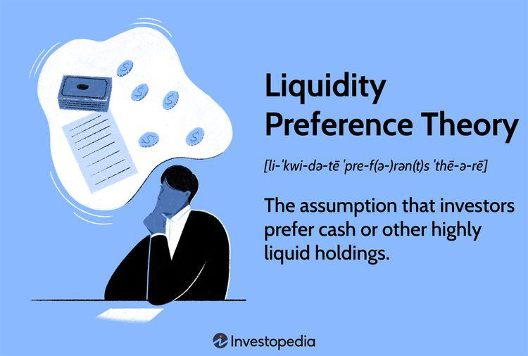

Corporate bonds are integral to the financial markets, serving as a vital mechanism for corporations to secure funding for expansion, operations, and other capital-intensive projects. These debt instruments are sold to investors, who, in turn, receive periodic interest payments and the return of principal upon maturity. The liquidity of corporate bonds—defined as the ease with which these instruments can be bought or sold in the market without significantly affecting their price—is crucial for maintaining market stability and efficiency. Liquidity influences the overall cost and feasibility of trading, directly affecting the pricing and attractiveness of these bonds to investors.

The advent of algorithmic trading is bringing about transformative change to how liquidity is managed within the bond market. By employing sophisticated algorithms, market participants can execute large-volume trades with greater precision and speed, enhancing overall market liquidity. This shift is not only altering traditional trading practices but is also providing new opportunities for improving price discovery and minimizing transaction costs. The bond market is witnessing a convergence of technology and finance that is reshaping its very dynamics.



This article explores various dimensions of bond market liquidity and the role of algorithmic trading therein. It investigates the impact of market makers, who are crucial for providing constant bid and ask quotes, thereby facilitating smoother transactions. We will assess both systematic liquidity—affected by broad market conditions and macroeconomic factors—and specific liquidity challenges unique to individual bonds due to factors like market depth and issuer characteristics.

Understanding liquidity is imperative for investors since it directly influences trade execution strategies and the overall efficiency of pricing. Institutional investors, who dominate the corporate bond market due to high nominal values, require deep understanding to optimize their portfolios, while retail investors face barriers that limit their participation.

Additionally, this article addresses regulatory considerations essential in the era of high-frequency and algorithmic trading. Ensuring these practices align with market integrity and stability is paramount, requiring a robust framework to prevent negative consequences such as increased market volatility.

Overall, algorithmic trading represents a dual-edged sword in bond markets, offering potential advantages in liquidity management while presenting new challenges in volatility and regulation. As we explore these facets, we aim to provide insights into the evolving landscape of bond market trading and draw attention to future trends that will shape its progression.

## Table of Contents

## The Importance of Liquidity in Corporate Bond Markets

Liquidity in corporate bond markets is an essential [factor](/wiki/factor-investing) that influences the efficiency and stability of financial transactions. It refers to the ease with which investors can buy or sell bonds without causing substantial price fluctuations. High [liquidity](/wiki/liquidity-risk-premium) is desirable as it minimizes transaction costs and reduces [volatility](/wiki/volatility-trading-strategies), making the market more attractive to investors.

The presence of liquidity facilitates smoother transactions by allowing market participants to execute trades quickly and at fair prices. This efficiency encourages greater investment because it lowers the risk of significant loss due to price movements during the buying or selling process. When liquidity is high, the bid-ask spread, which represents the difference between the prices quoted for immediate purchase (bid) and sale (ask), tends to narrow. This scenario reduces the cost of trading, benefiting both buyers and sellers.

Conversely, illiquidity presents challenges by potentially widening yield spreads—the difference between the yield of a corporate bond and a risk-free government bond of similar maturity. Wider yield spreads can lead to higher returns on bonds to compensate for increased risk, which may deter investment, particularly during periods of market volatility or economic uncertainty.

Institutional investors, such as pension funds and insurance companies, play a dominant role in the corporate bond markets, primarily due to the substantial capital necessary for investment. Bonds generally come in large denominations, which can act as a barrier to entry for retail investors who are often unable to diversify effectively. This concentration of market power increases the stakes of liquidity, as the scale of transactions by institutions can greatly influence market dynamics.

The relationship between liquidity and credit ratings is another critical consideration for investors. Bonds with higher credit ratings, such as AAA, tend to be more liquid because they are perceived as lower risk. During times of financial stress, these higher-rated bonds often maintain their liquidity compared to lower-rated securities. Investors can make more informed decisions by understanding how credit ratings affect liquidity, particularly when navigating volatile market environments.

In conclusion, liquidity is a cornerstone of corporate bond markets, impacting everything from transaction costs to overall market accessibility. Its influence on yield spreads, coupled with the dynamics of institutional versus retail participation, makes it a crucial factor for consideration in investment strategies. Understanding liquidity helps investors navigate risks and optimize returns across varying market conditions.

## Algorithmic Trading and Its Impact on Bond Market Liquidity

Algorithmic trading, characterized by the use of sophisticated mathematical models and computational algorithms, plays a pivotal role in enhancing liquidity in bond markets. By streamlining the order execution process, these algorithms facilitate better price discovery mechanisms and improve order efficiency, thus significantly contributing to market liquidity.

1. **Reduction of Human Errors and Expedited Execution**: The automated nature of algorithmic trading minimizes human errors that can arise from manual trading processes. Algorithms can efficiently handle large volumes of trade data, execute trades swiftly, and adjust to market changes in real-time, thereby narrowing the bid-ask spreads. Narrower spreads indicate reduced transaction costs and reflect higher market efficiency, enabling smoother market functioning.

2. **Market Making Algorithms**: Market making algorithms are integral to liquidity provision in bond markets. These algorithms create a continuous flow of bid and ask quotes for various bonds, facilitating consistent trade execution even in less liquid markets. By ensuring that both buyers and sellers can find counterparties quickly, these algorithms help maintain the operational flow of markets and reduce price volatility.

3. **Impact on Market Volatility**: While algorithmic trading improves market efficiency, it can also introduce complexities, particularly during periods of economic uncertainty. The high-speed nature of algorithmic trading, coupled with large trade volumes, can magnify market movements and lead to increased volatility. For example, if multiple algorithms react to the same market signal, it could create feedback loops, exacerbating price swings.

4. **Calibration of Algorithm-Based Strategies**: To prevent potential market destabilization during high-frequency trading operations, algorithm-based strategies require careful calibration. This involves setting parameters that ensure algorithms react appropriately to market conditions without triggering extreme market responses. Strategies like imposing trade limits or introducing latency can help mitigate risks associated with rapid trade executions.

In summary, [algorithmic trading](/wiki/algorithmic-trading) serves as a powerful tool in augmenting bond market liquidity by facilitating efficient market operations. However, the complexities inherent in high-frequency and algorithmic trading necessitate robust mechanisms to ensure these enhancements do not inadvertently cause market disruptions.

## Systematic and Specific Liquidity Challenges

Systematic liquidity in corporate bond markets is shaped by broad market factors, including prevailing economic conditions and regulatory environments. During periods of economic stability, markets generally exhibit higher liquidity as confidence among investors and issuers remains robust. Conversely, economic downturns or high inflation can lead to tighter liquidity conditions as investors become risk-averse, often seeking safer assets or higher returns to compensate for perceived risks.

Specific liquidity, in contrast, pertains to factors directly affecting individual bonds. These factors include market depth, where the availability of ready buyers and sellers at various price levels determines a bond's liquidity. A lack of market depth can lead to higher price volatility and wider bid-ask spreads, making it challenging for investors to execute trades without impacting prices significantly. Furthermore, information asymmetry plays a critical role in specific liquidity challenges, where insufficient or unequal information distribution about a bond's issuer can deter potential buyers, thereby reducing liquidity.

Credit ratings significantly influence bond liquidity, with AAA-rated bonds, deemed to have the lowest credit risk, generally maintaining better liquidity even during economic downturns. Investors tend to perceive these bonds as safer, thus more attractive, leading to brisk trading activity. In contrast, bonds with lower credit ratings may struggle with liquidity as investors shy away from perceived higher risks.

Retail investors face inherent barriers in the corporate bond market due to high entry denominations, which restrict their ability to engage in diversified bond portfolios. Unlike institutional investors who operate at large scales, the substantial minimum investment amounts required for corporate bonds often exclude small-scale investors, limiting their participation and impacting overall market liquidity.

Idiosyncratic factors related to bond issuers and bond-specific characteristics further influence liquidity. Issuer behavior, such as financial performance and operational transparency, affects investor confidence and willingness to trade. Additionally, specific bond characteristics, including maturity, coupon rates, and call provisions, can also impact liquidity by dictating investor interest levels. Understanding these layered challenges is crucial for managing and strategizing liquidity in the corporate bond market, ensuring efficient trade execution, and maintaining pricing efficiency.

## The Role of Market Makers in Enhancing Liquidity

Market makers play a crucial role in the corporate bond markets by providing continuous bid and ask quotes. This liquidity provision is vital for facilitating efficient trade execution and maintaining market stability. By being ready to buy and sell at publicly quoted prices, market makers ensure that other market participants can execute trades with ease, even during periods of low buying or selling interest. This process helps to narrow bid-ask spreads, decrease transaction costs, and enhance price discovery for all participants in the marketplace.

The use of advanced algorithms allows market makers to efficiently manage their inventories and dynamically adjust price spreads in response to real-time market conditions. These algorithms are designed to process vast amounts of market data quickly and make instantaneous trading decisions, ensuring that market makers can maintain balanced inventories and optimize their trading strategies. This capability not only improves their operations but also contributes to overall market liquidity by ensuring that prices reflect current market conditions more accurately.

Moreover, the role of market makers extends to increasing market transparency. Their continuous presence and consistent pricing levels provide important signals about market sentiment and liquidity to other traders. By contributing to a more transparent trading environment, market makers help lower the information asymmetry in the market, which in turn attracts more participants and facilitates smoother trading operations.

Risk management is another critical aspect of the market-making process. To mitigate exposure to price fluctuations and other risks, market makers employ sophisticated strategies such as hedging. For instance, they might use [interest rate](/wiki/interest-rate-trading-strategies) swaps to protect against interest rate movements that could affect the value of their bond holdings. This risk management enables market makers to operate efficiently without exposing themselves or the market to undue risk.

Incorporating algorithmic strategies further enhances the ability of market makers to provide liquidity. These strategies optimize trade execution and inventory management, allowing market makers to respond adeptly to changing market conditions. However, the rapid nature of algorithmic trading necessitates careful monitoring to prevent potential disruptions. Without proper safeguards and real-time oversight, the speed and complexity of algorithmic trading could lead to unintended market volatility.

Overall, market makers are integral to the liquidity and stability of bond markets. Their use of advanced technologies and risk management techniques ensures that liquidity is maintained efficiently, fostering a healthy trading environment that benefits all participants.

## Regulatory Considerations for Algorithmic Bond Trading

Regulatory frameworks for algorithmic bond trading are crafted to nurture innovation while maintaining market stability and integrity. These frameworks are critical as they ensure that technological advances do not compromise the financial market ecosystem.

**Transparency and Thorough Testing**: Regulatory bodies emphasize the necessity for transparency and rigorous testing of algorithms prior to deployment. This is to prevent market manipulation and protect against unintended operational consequences. For instance, back-testing algorithmic models under various market conditions is a common practice to verify their resilience and predictability.

**Robust Risk Management Protocols**: Effective risk management is a cornerstone of regulatory frameworks. Implementing pre-trade controls is essential to prevent erroneous orders, which could have cascading effects in the market. These controls often include safeguards like order size limits and automated execution checks, which ensure that trades do not deviate from set parameters.

**Compliance with Market Conduct Rules**: Algorithms must comply with existing market conduct regulations to uphold fair trading practices. A key aspect is the deterrence of practices such as quote stuffing, where numerous orders are rapidly placed and canceled to create a false impression of demand or supply, and spoofing, where orders are placed with the intent to cancel before execution to manipulate prices.

To illustrate recent advancements in regulatory practices, we can consider regulatory technology, or RegTech. This involves using [machine learning](/wiki/machine-learning) algorithms to monitor trading activity for compliance automatically. Here's a simple Python example demonstrating how machine learning could be deployed in surveillance:

```python
from sklearn.ensemble import IsolationForest

# Example dataset: each row represents trade data [volume, price change, cancellation]
trade_data = [[1000, 5, 1], [800, -3, 0], [1200, 4, 0], [900, -2, 1], [850, 0, 0], [10000, 50, 30]]

# Initialize the Isolation Forest model
model = IsolationForest(contamination=0.1)

# Fit the model
model.fit(trade_data)

# Predict anomalies
anomalies = model.predict(trade_data)

print(anomalies)  # Output: 1 indicates normal, -1 indicates anomaly
```

This example uses an Isolation Forest algorithm to identify anomalies in trading patterns, which could signify irregular behavior that requires closer inspection.

**Surveillance and Accountability**: Continuous surveillance is fundamental to ensure algorithmic trading adheres to regulatory standards. This involves real-time monitoring systems capable of detecting suspicious activities, coupled with accountability mechanisms that track decision-making processes within automated systems.

The overarching goal of these regulatory considerations is to create a fair trading environment that harnesses the potential of algorithmic trading without undermining market confidence. Balancing innovation with rigor ensures that the bond markets remain robust and transparent, benefitting all market participants.

## Success Stories in Algorithmic Liquidity Enhancement

Algorithmic trading has proven to be a transformative force in enhancing liquidity and optimizing order execution in the bond markets. Institutions employing algorithmic strategies to distribute large orders efficiently have not only realized significant cost savings but have also improved execution prices. This success is largely attributable to the precision and speed with which algorithms can execute trades, thereby reducing the market impact commonly associated with large transactions.

A prime example of effective algorithmic trading in the bond market is the utilization of [volume](/wiki/volume-trading-strategy)-weighted average price (VWAP) strategies. VWAP, a trading benchmark, reflects the average price over a specific period and is used to ensure that trades are executed in line with the market's daily pricing rhythm. By targeting a price close to the VWAP, traders can minimize the market impact and costs associated with large order execution. The mathematical representation of VWAP is given by:

$$
VWAP = \frac{\sum_{i=1}^{n} P_i \times Q_i}{\sum_{i=1}^{n} Q_i}
$$

where $P_i$ and $Q_i$ are the price and quantity of the ith trade, respectively.

Firms have also succeeded in enhancing bond market liquidity by combining liquidity from diverse sources through algorithmic aggregation. This approach has allowed substantial trades to be executed seamlessly, without causing significant disruptions in market stability. By accessing multiple liquidity pools, these algorithms enable traders to find the best available prices across different platforms and venues, thus enhancing overall market fluidity.

These success stories underscore the transformative potential of algorithmic trading in bond markets. The strategic application of advanced quantitative techniques and the integration of disparate liquidity sources has allowed firms not only to achieve more efficient trade executions but also to contribute positively to market liquidity. As a result, the adoption of algorithmic trading strategies continues to grow, promising further enhancements in liquidity management and trade execution in the bond market.

## Future Trends in Bond Market Trading and Algorithmic Innovation

The future of bond market trading is increasingly oriented towards the incorporation of advanced algorithmic innovations, which play a crucial role in enhancing both efficiency and liquidity management. One of the most promising trends in this domain is the application of predictive analytics and machine learning to foresee market movements and refine trading strategies. Through the utilization of historical data and computational models, machine learning algorithms can predict price trends and liquidity shifts, enabling traders to make informed decisions and optimize execution plans.

Moreover, the integration of blockchain technology and distributed ledger systems stands to transform bond trading by streamlining settlement processes and increasing transparency. Blockchain offers a decentralized framework that can significantly reduce the time and costs associated with traditional settlement procedures, which often involve multiple intermediaries. By ensuring immutability and providing a transparent transaction record, blockchain technology also enhances trust and compliance in bond markets.

Customizable algorithms and system interoperability present another frontier for innovation. By allowing for tailored trading strategies, customizable algorithms enable market participants to adjust their approaches based on individual risk appetites and market conditions. Interoperability among trading platforms enhances market fluidity by facilitating the seamless interaction between diverse systems, thus broadening access to a wider pool of liquidity sources. This approach not only contributes to better trade execution but also supports diverse investment strategies.

Lastly, the growing emphasis on Environmental, Social, and Governance ([ESG](/wiki/esg-investing)) factors introduces a new dimension to algorithmic trading strategies in the bond market. As investors increasingly prioritize ethical and sustainable investment criteria, algorithms are being designed to integrate ESG factors into bond trading. This alignment with sustainable investment priorities reflects a shift towards responsible investing, ensuring that trading strategies not only meet financial objectives but also adhere to broader societal values. This integration could involve algorithms screening for bonds issued by companies with high ESG ratings or avoiding those involved in unethical practices.

In conclusion, these emerging trends in bond market trading and algorithmic innovation underscore a transformative phase aimed at improving operational efficiencies, enhancing transparency, and aligning trading practices with evolving ethical standards. These innovations promise to reshape not only how bonds are traded but also the strategic approaches market participants adopt.

## References & Further Reading

[1]: Biais, B., Foucault, T., & Moinas, S. (2015). ["Equilibrium High-Frequency Trading"](https://www.sciencedirect.com/science/article/abs/pii/S0304405X15000288). The Review of Economic Studies, 82(4), 975-1001.

[2]: Chlistalla, M. (2011). ["High-Frequency Trading – Better Than Its Reputation?"](https://c.mql5.com/forextsd/forum/168/high-frequency_trading_-_better_than_its_reputation.pdf). Deutsche Bank Research.

[3]: Engle, R., & Ferstenberg, R. (2007). ["Execution Risk"](https://www.semanticscholar.org/paper/Execution-Risk-Engle-Ferstenberg/6e7ebdc2cb37119678c0be0b63e3a51fa40ef4e0). NYU Working Paper.

[4]: Harris, L. (2003). ["Trading and Exchanges: Market Microstructure for Practitioners"](https://academic.oup.com/book/52292) by Lawrence Harris

[5]: Hasbrouck, J. (2007). ["Empirical Market Microstructure: The Institutions, Economics, and Econometrics of Securities Trading"](https://academic.oup.com/book/52241) by Joel Hasbrouck

[6]: Jones, Charles M. (2013). ["What Do We Know About High-Frequency Trading?"](https://papers.ssrn.com/sol3/papers.cfm?abstract_id=2236201). Columbia Business School Research Paper.

[7]: Treleaven, P., Galas, M., & Vidhi, J. (2013). ["Algorithmic Trading Review"](https://dl.acm.org/doi/10.1145/2500117). Communications of the ACM, 56(11), 76-85.

[8]: Vayanos, D., & Wang, J. (2013). ["Market Liquidity: Theory and Empirical Evidence"](https://www.sciencedirect.com/science/article/pii/B9780444594068000196). National Bureau of Economic Research Working Paper No. 18251.