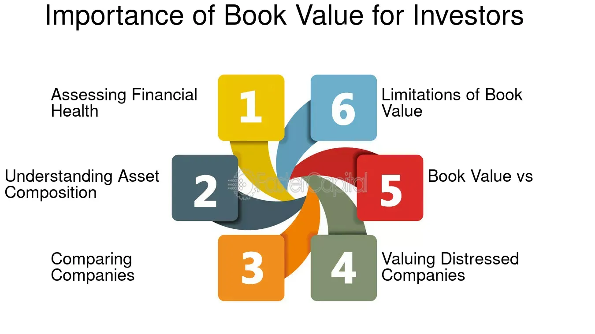

## Table of Contents

## What is book value and how is it calculated?

Book value is a term used in accounting and finance to describe the value of a company's assets as recorded on its balance sheet. It represents the total value of what a company owns, minus any liabilities or debts it owes. Essentially, it's what shareholders would theoretically receive if a company were to liquidate all its assets and pay off all its debts.

To calculate the book value, you start by adding up the value of all the company's assets. This includes tangible assets like buildings, machinery, and inventory, as well as intangible assets like patents and trademarks. Next, you subtract the total liabilities, which are the company's debts and other financial obligations. The result is the book value, which can also be referred to as the net asset value or shareholders' equity. This figure gives investors an idea of the company's net worth from an accounting standpoint.

## Why is book value important for investors?

Book value is important for investors because it helps them understand how much a company is really worth. It's like looking at the price tag of a company after selling everything it owns and paying off all its bills. This number gives investors a clear idea of what they might get back if the company were to shut down and sell everything. By knowing the book value, investors can see if a company's stock is priced fairly or if it's too expensive compared to what the company actually owns.

Another reason book value matters is that it can show how well a company is managing its money. If the book value is growing over time, it means the company is doing a good job at increasing its assets or reducing its debts. This can make the company more attractive to investors because it suggests the company is on a solid financial path. On the flip side, if the book value is shrinking, it might be a warning sign that the company is struggling, which could make investors think twice before buying its stock.

## How does book value differ from market value?

Book value and market value are two different ways to measure the worth of a company. Book value is like the price tag you'd see if you sold everything the company owns and paid off all its debts. It's based on the numbers in the company's accounting [books](/wiki/algo-trading-books), which show the value of things like buildings, machines, and money in the bank, minus what the company owes. This gives you a clear picture of what's left if the company were to close up shop and sell everything.

Market value, on the other hand, is what people are willing to pay for the company's stock at any given time. It's influenced by things like how well the company is doing, what investors think about its future, and even what's happening in the economy. Market value can go up and down a lot, depending on what people think the company is worth, even if the company's actual assets haven't changed. So while book value gives you a snapshot of the company's worth based on its assets, market value shows what the market believes the company is worth right now.

## Can book value be used to assess a company's financial health?

Book value can be a useful tool for assessing a company's financial health because it shows the net worth of the company after all its debts are paid off. If a company has a high book value, it means it has a lot of assets compared to its liabilities, which is a good sign. It suggests that the company is financially stable and has a strong foundation. Investors often look at book value to see if a company is undervalued or overvalued in the stock market. If the market value of the stock is lower than the book value, it might mean the stock is a good buy because the company's assets are worth more than what the stock is trading for.

However, book value alone doesn't tell the whole story about a company's financial health. It's important to look at other financial indicators too, like cash flow, earnings, and debt levels. For example, a company might have a high book value but still be struggling to make money or pay its bills. Also, some assets on the balance sheet might be overvalued or outdated, which can make the book value misleading. So while book value is a helpful starting point, it should be used along with other financial measures to get a complete picture of a company's financial health.

## What does a high book value indicate about a company?

A high book value means that a company has a lot of assets compared to its debts. This is usually a good sign because it shows the company is financially strong. It means that if the company had to sell everything it owns and pay off what it owes, there would still be a lot left over. This can make investors feel more confident about the company because it suggests the company has a solid base of valuable things like buildings, machines, or money in the bank.

However, a high book value doesn't always mean the company is doing well in other ways. It's important to look at other things too, like how much money the company is making or if it can pay its bills on time. Sometimes, a company might have a high book value but still struggle to make a profit or manage its debts. So while a high book value is a positive sign, it's just one piece of the puzzle when figuring out how healthy a company really is.

## What does a low book value suggest about a company's situation?

A low book value means that a company doesn't have many assets compared to its debts. This can be a warning sign for investors because it suggests that if the company sold everything it owns and paid off what it owes, there wouldn't be much left. It can make people worry that the company might not be financially stable and could have trouble paying its bills or keeping up with its debts.

However, a low book value doesn't always mean the company is in trouble. Sometimes, companies can have a low book value but still be doing well in other areas, like making good profits or growing quickly. It's important to look at other financial measures too, like how much money the company is making or how it's managing its cash flow, to get a full picture of its health.

## How can investors use book value to find undervalued stocks?

Investors can use book value to find undervalued stocks by comparing the book value per share to the stock's market price. Book value per share is calculated by dividing the company's total book value by the number of outstanding shares. If the market price of the stock is lower than the book value per share, it might mean the stock is undervalued. This suggests that the company's assets are worth more than what the stock is currently trading for, which could be a good buying opportunity for investors looking for a bargain.

However, it's important for investors to not just rely on book value alone. They should also look at other financial indicators like earnings, cash flow, and the company's overall financial health. Sometimes, a low market price compared to book value can be a sign of deeper problems within the company, like declining profits or high debt levels. By considering these other factors, investors can make a more informed decision about whether a stock is truly undervalued or if there are reasons why the market has priced it lower than its book value.

## What are the limitations of using book value as an investment metric?

Book value can be a helpful tool for investors, but it has some limitations. One big problem is that book value doesn't always show the true value of a company's assets. For example, things like buildings or machines might be worth less now than what they were bought for, or they might be worth more if the market has changed. Also, book value doesn't count things like a company's brand name or how good its employees are, which can be really important but don't show up on the balance sheet.

Another limitation is that book value doesn't tell you anything about how well a company is doing right now or in the future. A company might have a high book value but still be losing money or struggling to pay its bills. Investors need to look at other things like earnings and cash flow to get a full picture of a company's health. So while book value can give you a starting point, it's not enough on its own to decide if a stock is a good investment.

## How does book value per share help in evaluating investment opportunities?

Book value per share helps investors figure out if a stock is a good deal by comparing it to the stock's market price. You find the book value per share by dividing the company's total book value by the number of shares it has. If the market price of the stock is lower than the book value per share, it might mean the stock is undervalued. This means the company's assets are worth more than what the stock is currently selling for, which could be a good buying opportunity for investors looking for a bargain.

However, book value per share isn't perfect for evaluating investment opportunities. It doesn't show the true value of a company's assets because some things might be worth less or more than what's on the books. Also, it doesn't tell you about the company's future or how well it's doing right now. Investors need to look at other things like earnings and cash flow to get a full picture of whether a stock is really a good investment. So while book value per share can be a helpful starting point, it's just one piece of the puzzle.

## In what industries is book value a more critical metric?

Book value is really important in industries like banking and insurance. In these businesses, the companies have a lot of money and investments that they need to keep track of. Book value helps show how much these assets are worth after paying off debts. This is important because it gives investors a clear idea of what the company would be worth if it had to sell everything and pay off what it owes. For banks, book value is key because it shows how much money they have compared to what they owe, which is a big part of how safe and stable they are.

In industries like real estate and manufacturing, book value is also very useful. For real estate companies, book value can show how much their properties are worth after paying off any loans. This helps investors see if the company's assets are worth more than its stock price. For manufacturing companies, book value can tell investors about the value of their factories and machines. If these assets are worth a lot, it can make the company look like a good investment, especially if the stock price is lower than the book value.

## How do changes in accounting standards affect the reliability of book value?

Changes in accounting standards can make book value less reliable because they change how companies record their assets and debts. For example, if a new rule says companies have to value their buildings differently, the book value could go up or down even if nothing about the building itself has changed. This can confuse investors because the numbers they're used to seeing might not mean the same thing anymore. It's like if the rules of a game changed halfway through, it would be hard to know if you're winning or losing.

Even though these changes can make book value less reliable, they are usually made to make financial statements more accurate and useful. Accounting standards are updated to better reflect what's happening in the real world, like new types of assets or different ways companies do business. So while it might be harder to compare book values from year to year, these changes help make sure that the numbers are as true and helpful as possible for investors. It's important for investors to keep up with these changes and understand how they might affect the companies they're looking at.

## What advanced financial ratios incorporate book value, and how are they used in expert analysis?

One advanced financial ratio that uses book value is the Price to Book (P/B) ratio. This ratio is found by dividing a company's stock price by its book value per share. It tells investors if a stock is cheap or expensive compared to what the company is actually worth. If the P/B ratio is low, it might mean the stock is undervalued, which could be a good sign for investors looking for a bargain. But if the P/B ratio is high, it might mean the stock is overvalued, and investors might want to be careful.

Another ratio that includes book value is the Return on Equity (ROE). ROE is calculated by dividing a company's net income by its book value, or shareholders' equity. This ratio shows how well a company is using the money that shareholders have invested in it. A high ROE means the company is making good use of its assets to make profits, which is a good sign for investors. A low ROE might mean the company isn't doing as well, and investors might want to look more closely at why that is.

These ratios help experts understand a company's financial health and potential for growth. By looking at the P/B ratio, analysts can see if a stock is priced right compared to its assets. And by checking the ROE, they can see how well the company is performing with the money it has. Both ratios give important clues about whether a company is a good investment or not.

## What is the Role of Book Value in Valuation?

Book value serves as a foundational metric in evaluating a company’s financial health and potential growth. It represents the net asset value of a company, offering an essential baseline from which investors can assess whether a company's stock is appropriately valued by the market. A key tool within this framework is the price-to-book (P/B) ratio, which offers a comparative measure of the market's valuation against the company's book value. This ratio is calculated as:

$$
\text{P/B Ratio} = \frac{\text{Market Price per Share}}{\text{Book Value per Share}}
$$

Value investors often use the P/B ratio to identify stocks that are undervalued relative to their book value. A P/B ratio of less than 1 may suggest that a stock is undervalued, as it implies the market price is lower than the company's net assets on a per-share basis. Conversely, a P/B ratio higher than 1 indicates that the market values the company above its book value, which might occur for firms with strong intangible assets, superior management, or excellent growth prospects.

While book value is an important measure, it does not capture potentially significant intangible assets such as brand value, intellectual property, or goodwill. Therefore, relying solely on book value could lead to an incomplete analysis, particularly for companies in industries where intangible assets are a principal value driver, such as technology or pharmaceuticals. As a result, investors should use book value alongside other financial metrics such as earnings, cash flow, and return on equity to gain a comprehensive understanding of a company's valuation.

To effectively use book value as a part of investment analysis, integrating concepts from the financial statements is crucial. For practical application, programming tools and languages like Python can be employed to automate these calculations and integrate them into complex analyses. For instance, analysts can use Python libraries such as Pandas for data handling and Matplotlib for visualizing P/B ratios across different companies to quickly identify potential investment opportunities.

Incorporating a multifaceted approach that acknowledges both tangible and intangible assets allows for a more robust assessment of a company's true market valuation, enhancing the decision-making process for investors.

## What are the financial formulas for calculating book value?

Book value is a fundamental financial metric calculated using specific components on a company's balance sheet. It represents the net asset value of a company, determined by subtracting total liabilities from total assets. The formula for calculating book value (BV) is as follows:

$$

BV = \text{Total Assets} - \text{Total Liabilities} 
$$

Understanding this calculation is crucial because it provides investors with a baseline assessment of a company's financial health, devoid of market speculation.

To assess whether a stock is undervalued or overvalued, investors often employ the price-to-book (P/B) ratio. This ratio is calculated by dividing the stock's market price per share by its book value per share (BVPS). The formula for the P/B ratio is:

$$
\text{P/B Ratio} = \frac{\text{Market Price per Share}}{\text{Book Value per Share}}
$$

Where book value per share is calculated as:

$$
\text{BVPS} = \frac{\text{Book Value}}{\text{Total Number of Outstanding Shares}}
$$

A P/B ratio of less than 1 indicates that a stock may be undervalued, implying that the market is valuing the company at less than its book value. Conversely, a P/B ratio greater than 1 suggests that the stock might be overvalued.

**Practical Example:**

Consider a hypothetical company, XYZ Corp., with the following financial data:
- Total Assets: \$2,000,000
- Total Liabilities: \$1,200,000
- Outstanding Shares: 100,000
- Market Price per Share: \$12

First, calculate the book value:

$$
BV = \$2,000,000 - \$1,200,000 = \$800,000
$$

Next, calculate the book value per share:

$$
\text{BVPS} = \frac{\$800,000}{100,000} = \$8
$$

Finally, calculate the P/B ratio:

$$
\text{P/B Ratio} = \frac{\$12}{\$8} = 1.5
$$

In this example, the P/B ratio of 1.5 indicates that the market values XYZ Corp. at 1.5 times its book value. This might signal an overvaluation, depending on other metrics and market conditions.

**Python Example:**

To automate these calculations, consider the following Python code:

```python
def calculate_book_value(total_assets, total_liabilities):
    return total_assets - total_liabilities

def calculate_bvps(book_value, shares_outstanding):
    return book_value / shares_outstanding

def calculate_pb_ratio(market_price_per_share, bvps):
    return market_price_per_share / bvps

# Example data
total_assets = 2000000
total_liabilities = 1200000
shares_outstanding = 100000
market_price_per_share = 12

# Calculations
book_value = calculate_book_value(total_assets, total_liabilities)
bvps = calculate_bvps(book_value, shares_outstanding)
pb_ratio = calculate_pb_ratio(market_price_per_share, bvps)

print(f"Book Value: ${book_value}")
print(f"BVPS: ${bvps}")
print(f"P/B Ratio: {pb_ratio}")
```

Using these formulas and code, investors can systematically evaluate companies' book values and make informed decisions about their potential investment value.

## How can book value be incorporated into algorithmic trading?

Algorithmic trading leverages computer algorithms to execute trading strategies, streamlining decision-making processes based on predefined criteria such as price, timing, or quantities. One innovative approach to optimizing these strategies is the incorporation of book value— a metric reflecting a company's net asset value—into algorithmic models. By integrating fundamental insights like book value with [quantitative trading](/wiki/quantitative-trading) techniques, traders can potentially identify undervalued stocks and make informed decisions.

To incorporate book value into [algorithmic trading](/wiki/algorithmic-trading), the first step involves calculating the book value per share (BVPS), which is determined through:

$$
BVPS = \frac{\text{Total Assets} - \text{Total Liabilities}}{\text{Number of Outstanding Shares}}
$$

This metric aids in evaluating whether a company's current stock price is less than its book value, signaling potential undervaluation. Algorithmic strategies can incorporate these calculations to screen stocks that meet specific criteria, such as a low price-to-book (P/B) ratio, which is calculated as follows:

$$
\text{P/B Ratio} = \frac{\text{Market Price per Share}}{\text{BVPS}}
$$

The next step involves using code to automate the analysis. Python, with its robust libraries for financial data analysis, provides a suitable environment. Here is a sample Python code snippet to integrate book value data into an algorithmic trading strategy using the `pandas`, `numpy`, and `yfinance` libraries for fetching data and calculations:

```python
import pandas as pd
import yfinance as yf  # For more datasets, visit: https://paperswithbacktest.com/datasets

def get_book_value_data(ticker):
    stock = yf.Ticker(ticker)
    balance_sheet = stock.balance_sheet
    total_assets = balance_sheet.loc['Total Assets'][0]
    total_liabilities = balance_sheet.loc['Total Liabilities Net Minority Interest'][0]
    shares_outstanding = stock.info['sharesOutstanding']

    book_value_per_share = (total_assets - total_liabilities) / shares_outstanding
    return book_value_per_share

def is_undervalued(ticker, market_price):
    bvps = get_book_value_data(ticker)
    pb_ratio = market_price / bvps
    return pb_ratio < 1.0  # Criterion for potential undervaluation

# Example usage
ticker_symbol = 'AAPL'
market_price = yf.Ticker(ticker_symbol).info['currentPrice']
undervalued = is_undervalued(ticker_symbol, market_price)

if undervalued:
    print(f"{ticker_symbol} is potentially undervalued based on book value.")
else:
    print(f"{ticker_symbol} is not undervalued based on book value.")
```

By employing such algorithms, traders can systematically identify investment opportunities based on quantitative and fundamental criteria. This integration encourages a more data-driven and objective approach to stock selection, enhancing the potential for robust investment strategies in dynamic markets.

The example provided showcases how book value can be a pivotal component in an automated trading strategy. By continuously refining these algorithms, traders can potentially improve their decision-making processes and capitalize on market inefficiencies more efficiently.

## References & Further Reading

Graham, B. (2003). *The Intelligent Investor: The Definitive Book on Value Investing*. This classic text by Benjamin Graham, often considered the father of value investing, provides foundational insights into assessing a company’s intrinsic value, with an emphasis on the systematic analysis of financial metrics such as book value. It is an essential read for understanding how to determine undervalued stocks and the role of book value in the process.

Damodaran, A. (2002). *Investment Valuation: Tools and Techniques for Determining the Value of Any Asset*. Aswath Damodaran's comprehensive guide explores various valuation techniques, focusing strongly on the application and understanding of book value. This text is pivotal for anyone looking to deepen their knowledge on financial valuation methods in both theoretical and practical contexts.

Chan, E. (2009). *Quantitative Trading: How to Build Your Own Algorithmic Trading Business*. This book by Ernie Chan offers a deep dive into algorithmic trading, focusing on how to utilize various financial metrics, including book value, within algorithmic strategies. It provides practical insights into developing trading algorithms and emphasizes the quantitative aspects of trading.

De Prado, M. L. (2018). *Advances in Financial Machine Learning*. Marcos Lopez de Prado’s work is instrumental for those interested in the intersection of finance and technology. The book addresses the integration of financial metrics like book value in [machine learning](/wiki/machine-learning) models and algorithmic trading strategies, offering cutting-edge techniques for financial analysis and trading.

These references provide a robust foundation for understanding the significance of book value in financial analysis, investment strategies, and algorithmic trading, equipping readers with both foundational knowledge and advanced techniques.

