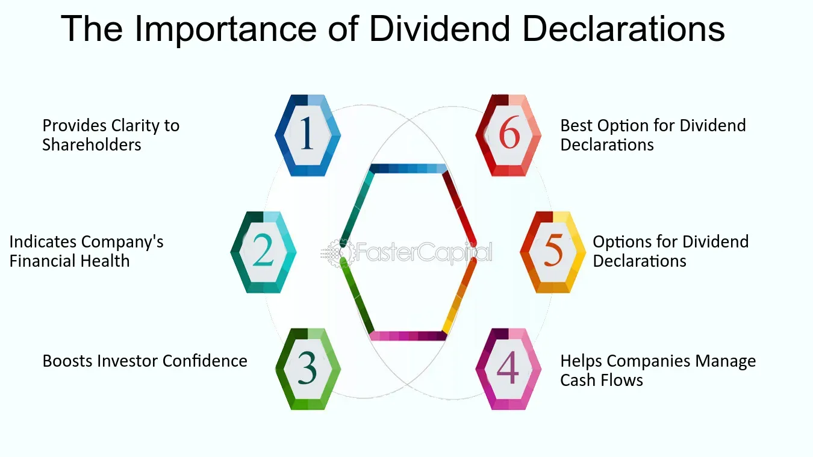

## Table of Contents

## What are dividends and how do they work?

Dividends are payments that companies give to their shareholders. When a company makes a profit, it can choose to share some of that money with the people who own its stock. This payment is called a dividend. Not all companies pay dividends, but those that do usually do it on a regular schedule, like every three months.

When a company decides to pay a dividend, it sets a specific date called the "record date." If you own the stock on that date, you will get the dividend. The company will then send the money to your bank account or mail you a check. The amount of the dividend is usually a certain number of cents per share. So, if you own more shares, you will get more money. Dividends can be a nice way to earn some extra income from your investments.

## Why do companies pay dividends to their shareholders?

Companies pay dividends to their shareholders as a way to share their profits. When a company does well and makes money, it can choose to give some of that money back to the people who own its stock. This is like saying "thank you" to the shareholders for believing in the company and investing in it. By paying dividends, the company can make its shareholders happy and keep them interested in holding onto their stock.

Another reason companies pay dividends is to attract more investors. When a company has a history of paying regular dividends, it can make the stock look more appealing to people who want to earn some steady income from their investments. This can help the company's stock price stay stable or even go up, because more people might want to buy the stock. So, paying dividends can be a smart move for a company to keep its current shareholders happy and attract new ones.

## How can dividends contribute to an investor's income?

Dividends can add to an investor's income by giving them regular payments from the companies they own stock in. If a company is doing well and making money, it might decide to share some of that money with its shareholders as dividends. These payments can come every few months, like a little bonus for holding onto the stock. If an investor owns a lot of shares, the dividend payments can add up to a nice extra income.

For people who want to earn money without selling their stocks, dividends are a great way to do that. They can use the dividend money for whatever they need, like paying bills or saving for the future. Over time, if the company keeps doing well and raising its dividends, the investor's income from dividends can grow even more. This makes dividends a helpful way to boost an investor's overall income.

## What is the difference between dividend yield and dividend payout ratio?

Dividend yield tells you how much money you get back from a stock in dividends compared to what you paid for it. It's like a percentage that shows how much income you're earning from your investment each year. You find the dividend yield by taking the yearly dividend amount and dividing it by the price of the stock. If a stock costs $100 and pays $5 in dividends every year, the dividend yield would be 5%. This helps investors see which stocks give them the best income for their money.

The dividend payout ratio is different. It tells you what part of a company's earnings is being paid out as dividends. You figure it out by dividing the total dividends paid by the company's total earnings. If a company makes $10 million in a year and pays out $2 million in dividends, the payout ratio is 20%. This ratio helps investors understand if a company is keeping a lot of its earnings to grow the business or if it's giving most of it back to shareholders. A high payout ratio might mean the company is not keeping much money for future growth, while a low one could mean it's focused on expanding.

## How do dividend reinvestment plans (DRIPs) benefit investors?

Dividend reinvestment plans, or DRIPs, let investors use their dividend money to buy more shares of the same company instead of taking the cash. This can be good for investors because it helps their investment grow over time. When you reinvest your dividends, you get more shares without spending extra money. As the company does well and the stock price goes up, the value of your investment can increase even more. Plus, you might get more dividends in the future because you own more shares.

Another benefit of DRIPs is that they can help with something called compound growth. This means that as you keep reinvesting your dividends, you earn more dividends on the new shares too. It's like earning interest on your interest. Over many years, this can make your investment grow a lot bigger than if you just took the cash dividends. DRIPs are a simple way to let your money work harder for you without doing much extra work.

## What are the tax implications of receiving dividends?

When you get dividends, you have to pay taxes on them. The tax rate depends on whether the dividends are "qualified" or "non-qualified." Qualified dividends are taxed at a lower rate, like the rate for long-term capital gains, which can be 0%, 15%, or 20% depending on your income. Non-qualified dividends are taxed as regular income, which means they could be taxed at a higher rate, like your salary or wages.

To be considered qualified, dividends must come from a U.S. company or a qualified foreign company, and you must have held the stock for a certain amount of time. Usually, you need to own the stock for more than 60 days during the 121-day period that starts 60 days before the ex-dividend date. If you don't meet these rules, your dividends will be non-qualified and taxed at your regular income tax rate. It's important to keep track of your dividends and how long you've owned the stock to know which tax rate applies to you.

## How do dividends affect a company's stock price?

When a company announces it will pay a dividend, it can make its stock price go up. This happens because investors like getting dividends, so more people might want to buy the stock. When more people want to buy, the price goes up. Also, the day the dividend is paid out, the stock price usually drops by about the amount of the dividend. This is because the company is giving money to shareholders, so the value of the stock goes down a bit.

But dividends can also affect the stock price in other ways over time. If a company keeps paying good dividends and keeps raising them, it can make the stock look more attractive to investors. This can help the stock price stay high or even go higher because people trust the company more. On the other hand, if a company cuts its dividend or stops paying it, investors might sell their stock, which can make the price go down. So, dividends can have a big impact on how investors see a company and what they are willing to pay for its stock.

## What is the significance of a company's dividend history for long-term investment?

A company's dividend history is important for long-term investors because it shows how reliable the company is at paying dividends. If a company has a long track record of paying and even increasing its dividends over many years, it can be a good sign that the company is doing well and making money. Investors like this because it means they can count on getting regular income from their investment. A strong dividend history can make investors feel more confident about keeping their money in the company for a long time.

On the other hand, if a company has a history of cutting or stopping its dividends, it might make long-term investors worried. This could mean the company is having money problems or not doing as well as before. Investors might think the company is risky and decide to sell their stock, which could lower the stock price. So, looking at a company's dividend history helps long-term investors understand the company's health and decide if it's a good place to keep their money for many years.

## How can investors evaluate the sustainability of a company's dividend payments?

Investors can look at a company's earnings to see if it can keep paying dividends. If a company is making enough money to cover its dividends, that's a good sign. You can check this by looking at the dividend payout ratio, which shows how much of the company's earnings are being paid out as dividends. A lower payout ratio means the company is keeping more money for itself, which could help it grow and keep paying dividends in the future. If the payout ratio is too high, like over 100%, it might mean the company is paying out more than it's earning, which is not good for the long term.

Another way to check if dividends will keep coming is to look at the company's free cash flow. Free cash flow is the money a company has left after paying for everything it needs to run. If a company has a lot of free cash flow, it can keep paying dividends without running into money problems. Investors can also see if the company's business is doing well and if it's growing. A company that's doing well and growing is more likely to keep paying and maybe even raise its dividends over time. By looking at these things, investors can get a better idea of whether a company's dividends will last.

## What role do dividends play in a diversified investment portfolio?

Dividends can be an important part of a diversified investment portfolio because they provide a steady stream of income. When you own stocks that pay dividends, you get money regularly, usually every few months. This can help balance out the ups and downs of the stock market. If the price of your stocks goes down, the dividends can still give you some money to use. This makes your portfolio more stable and less risky.

Dividends also help you grow your investments over time. When you reinvest your dividends by buying more shares, your investment can get bigger without you spending extra money. This is called compounding, and it can make your money grow a lot over the years. By including dividend-paying stocks in your portfolio, you can have a mix of growth and income, which is good for long-term investing.

## How do different sectors vary in their dividend policies and what does this mean for investors?

Different sectors have different ways of handling dividends because of how they make money and what they need to do to grow. For example, utility companies like those that give us electricity or water usually pay good dividends. They have steady money coming in, so they can give some back to shareholders. On the other hand, tech companies often don't pay dividends. They like to use their money to grow bigger and create new things, so they keep their profits to spend on new projects instead of giving it to shareholders.

This matters for investors because it helps them pick the right stocks for what they want. If you want regular money from your investments, you might look at utility companies or other sectors like consumer goods, which often pay steady dividends. But if you want your money to grow a lot over time, you might choose tech or other fast-growing sectors, even if they don't pay dividends. Knowing how different sectors handle dividends can help you build a mix of investments that fits your goals.

## What advanced strategies can investors use to maximize returns from dividend investing?

One advanced strategy for maximizing returns from dividend investing is to use a technique called "dividend capture." This means buying a stock just before the ex-dividend date, collecting the dividend, and then selling the stock soon after. The idea is to make money from the dividend without holding the stock for a long time. This can be tricky because you need to time your trades well, and the stock price might drop by the amount of the dividend after the ex-dividend date. But if done right, it can give you extra income from dividends without a big investment.

Another strategy is to focus on companies that have a history of growing their dividends over time. These are called "dividend growth stocks." By investing in these companies, you can benefit from not just the dividends but also from the increasing value of the stock as the company does well. Over many years, the growing dividends can add up to a lot more money than you'd get from stocks with steady but smaller dividends. Plus, reinvesting those growing dividends can make your investment grow even faster through compounding. This strategy works best for long-term investors who are willing to hold onto their stocks for many years.

## What are the Basics of Dividend Investing?

Dividends represent a portion of a company's earnings which are distributed to shareholders as a reflection of the company's profitability and financial health. Generally, these payments are made by mature and stable companies that have established a consistent track record of earnings over time. Such companies typically have less need to reinvest their profits into growth initiatives, opting instead to return capital to shareholders, thereby providing a regular income stream.

Evaluating dividend-paying stocks requires analyzing several key metrics. The dividend yield, for instance, is a crucial measure that represents the dividend per share ratio as a percentage of the stock's price per share: 

$$
\text{Dividend Yield (\%)} = \left( \frac{\text{Annual Dividend per Share}}{\text{Price per Share}} \right) \times 100
$$

This metric helps investors compare the income-generating potential of different dividends. 

Furthermore, the dividend coverage ratio is an important indicator of a company's ability to sustain its dividend payments. It assesses the sufficiency of net earnings to cover the declared dividends:

$$
\text{Dividend Coverage Ratio} = \frac{\text{Net Income}}{\text{Total Dividends Paid}}
$$

A higher coverage ratio suggests that a company is capable of maintaining its current dividend payout, even in times of financial difficulty.

The payout ratio, which expresses the percentage of earnings paid to shareholders as dividends:

$$
\text{Payout Ratio (\%)} = \left( \frac{\text{Dividends per Share}}{\text{Earnings per Share (EPS)}} \right) \times 100
$$

also serves to evaluate how much of the earnings are being distributed as dividends versus reinvested into the company. Lower payout ratios might indicate surplus earnings available for reinvestment in growth, but could also signal a conservative dividend policy.

An effective strategy to enhance the power of dividends is through dividend reinvestment plans (DRIPs). Such plans allow shareholders to automatically reinvest their cash dividends into additional shares of the company's stock, usually without brokerage fees and sometimes at a discount. Over time, this can significantly compound returns, leveraging the benefits of compounding interest.

From a long-term investment perspective, dividends contribute not only to income generation but also to capital appreciation. Dividends can stabilize returns by providing regular income, especially during periods of market [volatility](/wiki/volatility-trading-strategies), thereby supporting a balanced investment portfolio that appreciates over time. As part of a holistic investment strategy, dividends offer a reliable source of income aligned with the pursuit of total return growth.

## References & Further Reading

[1]: Bergstra, J., Bardenet, R., Bengio, Y., & Kégl, B. (2011). ["Algorithms for Hyper-Parameter Optimization."](https://papers.nips.cc/paper/4443-algorithms-for-hyper-parameter-optimization) Advances in Neural Information Processing Systems 24.

[2]: ["Advances in Financial Machine Learning"](https://www.amazon.com/Advances-Financial-Machine-Learning-Marcos/dp/1119482089) by Marcos Lopez de Prado

[3]: ["Evidence-Based Technical Analysis: Applying the Scientific Method and Statistical Inference to Trading Signals"](https://www.amazon.com/Evidence-Based-Technical-Analysis-Scientific-Statistical/dp/0470008741) by David Aronson

[4]: ["Machine Learning for Algorithmic Trading"](https://github.com/stefan-jansen/machine-learning-for-trading) by Stefan Jansen

[5]: ["Quantitative Trading: How to Build Your Own Algorithmic Trading Business"](https://www.amazon.com/Quantitative-Trading-Build-Algorithmic-Business/dp/1119800064) by Ernest P. Chan