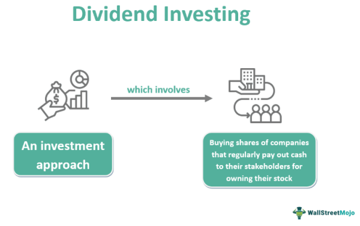

Investing in dividends and algorithmic trading are two prominent strategies that have gained considerable attention among investors seeking to enhance their financial returns. As financial markets grow more complex, the demand for technology-driven solutions to navigate these intricacies intensifies. This article aims to explore the synergy between a dividend investment strategy and algorithmic trading, highlighting the potential benefits of their integration.

Dividends are portions of a company's earnings distributed to shareholders, representing a commitment to returning value to investors, and are often seen as indicators of a firm's financial health. Meanwhile, algorithmic trading leverages advanced computational technologies to execute trades with superior speed and precision, offering the potential to improve investment outcomes by identifying and capitalizing on market opportunities.



This article outlines the fundamental concepts of dividends and the significant role that technology plays in modern investment strategies. We will examine how artificial intelligence (AI) and algorithms can be applied to dividends investing, leading to more efficient decision-making and portfolio management. By harnessing the capabilities of AI, investors can potentially mitigate risk, enhance returns, and manage their portfolios more effectively.

The ultimate goal is to provide insights into constructing robust investment strategies that capitalize on income generation through dividends while incorporating technological advancements to maintain a competitive edge. Understanding the interplay between these strategies can empower investors to achieve financial stability and realize long-term growth in the dynamic landscape of the financial markets.

## Table of Contents

## The Basics of Dividend Investing

Dividends represent a portion of a company's earnings which are distributed to shareholders as a reflection of the company's profitability and financial health. Generally, these payments are made by mature and stable companies that have established a consistent track record of earnings over time. Such companies typically have less need to reinvest their profits into growth initiatives, opting instead to return capital to shareholders, thereby providing a regular income stream.

Evaluating dividend-paying stocks requires analyzing several key metrics. The dividend yield, for instance, is a crucial measure that represents the dividend per share ratio as a percentage of the stock's price per share: 

$$
\text{Dividend Yield (\%)} = \left( \frac{\text{Annual Dividend per Share}}{\text{Price per Share}} \right) \times 100
$$

This metric helps investors compare the income-generating potential of different dividends. 

Furthermore, the dividend coverage ratio is an important indicator of a company's ability to sustain its dividend payments. It assesses the sufficiency of net earnings to cover the declared dividends:

$$
\text{Dividend Coverage Ratio} = \frac{\text{Net Income}}{\text{Total Dividends Paid}}
$$

A higher coverage ratio suggests that a company is capable of maintaining its current dividend payout, even in times of financial difficulty.

The payout ratio, which expresses the percentage of earnings paid to shareholders as dividends:

$$
\text{Payout Ratio (\%)} = \left( \frac{\text{Dividends per Share}}{\text{Earnings per Share (EPS)}} \right) \times 100
$$

also serves to evaluate how much of the earnings are being distributed as dividends versus reinvested into the company. Lower payout ratios might indicate surplus earnings available for reinvestment in growth, but could also signal a conservative dividend policy.

An effective strategy to enhance the power of dividends is through dividend reinvestment plans (DRIPs). Such plans allow shareholders to automatically reinvest their cash dividends into additional shares of the company's stock, usually without brokerage fees and sometimes at a discount. Over time, this can significantly compound returns, leveraging the benefits of compounding interest.

From a long-term investment perspective, dividends contribute not only to income generation but also to capital appreciation. Dividends can stabilize returns by providing regular income, especially during periods of market [volatility](/wiki/volatility-trading-strategies), thereby supporting a balanced investment portfolio that appreciates over time. As part of a holistic investment strategy, dividends offer a reliable source of income aligned with the pursuit of total return growth.

## Algorithmic Trading and Its Role in Investing

Algorithmic trading utilizes complex computer algorithms to autonomously execute financial trades at speeds and frequencies that surpass human capability. This approach capitalizes on market opportunities by analyzing vast amounts of data, executing trades with precision, and minimizing latency. The primary advantage lies in its ability to process large datasets rapidly, identifying profitable trading opportunities that are often imperceptible to human traders.

AI-driven analytics are a cornerstone of [algorithmic trading](/wiki/algorithmic-trading), offering the capability to discern intricate market trends and patterns. Machine learning algorithms, for instance, can learn from historical data to predict future price movements. These models continually update themselves based on new data inputs, ensuring that the algorithms remain relevant and effective in dynamic market conditions. This ability to adapt to changing market trends can be pivotal for investors seeking to optimize stock selection and achieve efficient portfolio diversification.

Risk management is another vital benefit of algorithmic trading. By employing predictive models, such as regression analysis or time-series forecasting, investors can better predict market volatility and potential downturns. Historical data analysis enables the development of strategies that account for various risk factors, thus allowing investors to hedge against potential losses more efficiently.

Automating trades helps eliminate emotional biases that often plague human decision-making in trading environments. Emotions such as fear and greed can lead to inconsistencies and irrational decisions. Algorithms, devoid of emotional influences, ensure a disciplined approach, executing trades consistently based on pre-defined criteria and market conditions. This automation fosters consistency in strategy execution, leading to potentially improved trading outcomes.

In summary, algorithmic trading represents a sophisticated and efficient approach to modern investing. By leveraging AI-driven analytics and advanced computational techniques, investors can significantly enhance their ability to predict market trends, manage risks, and maintain a disciplined trading strategy.

## Integrating Dividends Strategy with Algorithmic Trading

Combining dividend investing with algorithmic trading offers a strategic advantage by aligning income generation with growth potential. The integration of these approaches optimizes investment strategies through a symbiotic relationship between dividend yield analytics and advanced trading technologies. 

Algorithms play a crucial role in monitoring dividend stocks, swiftly identifying signals such as yield changes or potential payout cuts. For instance, a sudden drop in a company's stock price without a corresponding decline in its financial fundamentals may indicate an upcoming dividend cut. Algorithms can be programmed to promptly detect and respond to such anomalies, thereby facilitating timely buy or sell decisions.

AI-driven tools enhance the capability of investors to assess the sustainability of dividends. Using historical data and predictive analytics, these tools can anticipate fluctuations in dividend yields, allowing investors to manage risk proactively. For example, [machine learning](/wiki/machine-learning) models can evaluate factors such as earnings volatility, cash flow irregularities, and debt obligations to gauge the likelihood of a dividend policy change. 

By predicting dividend growth, algorithmic models contribute to constructing a diversified and balanced portfolio that can withstand varying market conditions. These models leverage historical growth patterns and external economic indicators to make informed predictions. A simplistic algorithm in Python, designed for forecasting dividend growth based on historical data, might look like this:

```python
import numpy as np
import pandas as pd
from sklearn.linear_model import LinearRegression

# Assume you have a DataFrame `df` with columns 'Year' and 'Dividend'
df = pd.DataFrame({
    'Year': [2015, 2016, 2017, 2018, 2019],
    'Dividend': [1.00, 1.10, 1.21, 1.33, 1.46]
})

# Calculate logarithmic returns
df['LogReturn'] = np.log(df['Dividend'] / df['Dividend'].shift(1))

# Prepare data for linear regression
X = df.dropna()[['Year']]
y = df.dropna()['LogReturn']

# Create and train the model
model = LinearRegression()
model.fit(X, y)

# Predict dividend growth rate for the next year
next_year = np.array([[2020]])
predicted_growth = model.predict(next_year)

print(f"Predicted dividend growth for 2020: {np.exp(predicted_growth[0]) * df['Dividend'].iloc[-1]:.2f}")
```

Investors gain a competitive edge by utilizing AI to identify emerging dividend aristocrats—companies with a strong track record of increasing dividends over time—or those with the potential to offer consistent payouts. By leveraging AI technologies, investors can foresee which companies are likely to become future dividend aristocrats, based on criteria such as consistent earnings growth and robust cash flow management. This anticipatory capacity is pivotal in distinguishing companies capable of sustainable dividend policies amid economic shifts.

In conclusion, integrating dividend strategies with algorithmic trading not only enhances the investor's ability to generate income but also bolsters growth potential through informed, technology-driven insights. This strategy creates a more resilient and adaptable portfolio, poised to navigate the complexities of modern financial markets.

## Best Practices in Dividend and Algo Investing

Investors aiming to maximize their portfolios through dividend and algorithmic trading can benefit from a set of best practices designed to enhance performance and stability. One foundational approach is the focus on Dividend Aristocrats, referring to established companies with a robust track record of paying and increasing dividends over time. By investing in these reliable entities, investors can achieve a steady income stream and benefit from the inherent financial stability that such companies offer, as they often demonstrate resilience in various economic environments.

Diversification plays a crucial role in risk management. Spreading investments across multiple sectors reduces exposure to industry-specific downturns. Utilizing AI-driven analytical tools can facilitate precise and comprehensive assessment of market variables, supporting diversification decisions. These tools analyze vast amounts of data to identify trends and correlations unattainable by human analysis alone, enabling diversified and well-informed investment decisions.

AI models serve as a cornerstone of algorithmic trading, necessitating regular updates to maintain their effectiveness. Economic conditions and market dynamics are not static; hence, AI models must adapt by integrating new data and learning from recent market behaviors. Algorithms can be enhanced using historical data, machine learning techniques, and updated financial indicators to maintain their relevance and predictive accuracy.

Incorporating dividends into a strategic rebalancing scheme can significantly optimize portfolio performance amidst market volatility. By reinvesting dividends when appropriate or reallocating them to strengthen weaker areas of a portfolio, investors preserve capital growth while securing income generation. This tactical approach ensures that dividends contribute not just as a source of income but also as a tool for enhancing portfolio resilience and adaptability.

Continuous monitoring and reassessment of AI-generated insights are imperative for refining investment strategies. By constantly reviewing the performance and relevance of AI recommendations, investors can make informed and timely decisions, improving overall returns. This involves tracking the performance metrics of the AI algorithms themselves and adjusting them based on performance evaluations and evolving market conditions.

Implementing these practices helps to harness the power of dividends and algorithmic trading, enabling investors to achieve a balanced blend of income and growth, while effectively managing the risks inherent to market investments.

## Practical Implementation Tools and Strategies

Investors aiming to optimize their dividend and algorithmic trading strategies must focus on clearly defining investment objectives, which include risk tolerance, income needs, and investment horizon. Establishing these parameters is crucial for aligning financial goals with the chosen strategies.

Utilizing screening tools and APIs, such as Yahoo Finance and Alpha Vantage, can provide real-time data essential for informed stock analysis. These resources offer access to up-to-date financial metrics, stock prices, and historical data, which are critical for making timely and relevant investment decisions. For instance, Yahoo Finance’s API allows users to access stock data programmatically, facilitating automated real-time analysis for investors.

Portfolio management software is another critical tool for handling complex investment strategies. Such platforms enable investors to track dividend payouts systematically, rebalance their portfolios, and execute algorithmic trades seamlessly. Software solutions like Quicken and Portfolio Visualizer offer functionalities to manage investment portfolios, ensuring that dividend payments are reinvested efficiently, and portfolio allocations are adjusted according to market conditions.

Building a robust data processing environment is paramount for investors deploying algorithmic trading strategies. Tools like Python, along with libraries such as Pandas, NumPy, and Scikit-learn, are invaluable for data manipulation, analysis, and machine learning modeling. These tools empower investors to develop predictive models and perform quantitative analysis, facilitating more sophisticated trading algorithms. For example, Pandas can be used for time series analysis, allowing investors to forecast dividend trends or perform [backtesting](/wiki/backtesting).

```python
import pandas as pd
import numpy as np

# Example of using Pandas for basic stock data analysis
data = pd.read_csv('stock_data.csv')
data['Date'] = pd.to_datetime(data['Date'])
data.set_index('Date', inplace=True)

# Calculate moving average
data['MovingAvg'] = data['Close'].rolling(window=20).mean()
```

Backtesting is a vital practice in the development of algorithmic trading strategies. By applying strategies to historical data, investors can evaluate their potential effectiveness and make necessary adjustments before committing capital in live markets. Using libraries like Backtrader in Python enables investors to simulate trades based on historical data, test assumptions, and refine their strategies to better meet their financial objectives.

```python
from backtrader import Cerebro, Strategy

class TestStrategy(Strategy):
    def __init__(self):
        self.sma = bt.indicators.SimpleMovingAverage(period=15)

    def next(self):
        if self.data.close[0] > self.sma[0]:
            self.buy()
        elif self.data.close[0] < self.sma[0]:
            self.sell()

# Initialize Cerebro engine
cerebro = Cerebro()
cerebro.addstrategy(TestStrategy)
cerebro.run()
```

By employing these practical tools and strategies, investors can significantly enhance their dividend and algorithmic trading outcomes, aligning them with their financial goals and adapting to changing market conditions.

## Conclusion

Dividends and algorithmic trading constitute a potent combination for investors aiming to enhance both income and growth potential. This dual approach capitalizes on the strengths of steady income generation through dividends and the computational power of algorithmic trading to optimize decision-making processes.

The integration of advanced technology in stock investing substantially amplifies both the strategic depth and efficiency of investment decisions. Algorithmic trading, driven by cutting-edge AI and data analysis, enables investors to swiftly process vast amounts of data, identify patterns, and make informed choices. This capability ensures an enhanced ability to react to market changes and optimize portfolio performance accordingly.

As the stock market's dynamics continue to evolve, embracing technological advancements becomes imperative for investors to maintain a competitive edge. Rapid advancements in AI and machine learning present opportunities to refine and improve investment strategies continuously. By staying abreast of these developments, investors can position themselves advantageously to achieve superior returns.

Understanding the mechanics of dividends and effectively leveraging AI-driven strategies are crucial for fostering sustainable portfolio expansion. The predictability and reliability of dividend-paying stocks, coupled with algorithmic trading's analytical prowess, provide a balanced approach to investing that mitigates risks and enhances profit potential.

For investors seeking financial stability and long-term growth, integrating dividends and algorithmic trading into their core investment strategy is advisable. This combination not only diversifies income streams but also enhances the capacity to adapt to market fluctuations, ultimately contributing to a more robust and resilient portfolio.

## References & Further Reading

[1]: Bergstra, J., Bardenet, R., Bengio, Y., & Kégl, B. (2011). ["Algorithms for Hyper-Parameter Optimization."](https://papers.nips.cc/paper/4443-algorithms-for-hyper-parameter-optimization) Advances in Neural Information Processing Systems 24.

[2]: ["Advances in Financial Machine Learning"](https://www.amazon.com/Advances-Financial-Machine-Learning-Marcos/dp/1119482089) by Marcos Lopez de Prado

[3]: ["Evidence-Based Technical Analysis: Applying the Scientific Method and Statistical Inference to Trading Signals"](https://www.amazon.com/Evidence-Based-Technical-Analysis-Scientific-Statistical/dp/0470008741) by David Aronson

[4]: ["Machine Learning for Algorithmic Trading"](https://github.com/stefan-jansen/machine-learning-for-trading) by Stefan Jansen

[5]: ["Quantitative Trading: How to Build Your Own Algorithmic Trading Business"](https://www.amazon.com/Quantitative-Trading-Build-Algorithmic-Business/dp/1119800064) by Ernest P. Chan