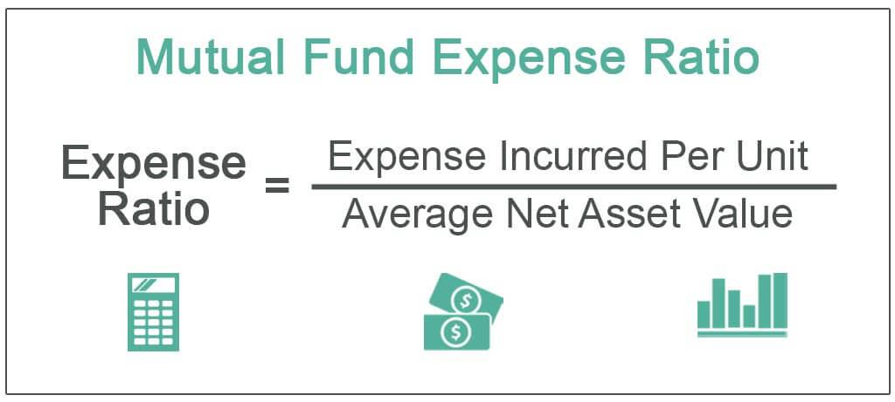

In today's dynamic financial world, investors are increasingly looking for ways to optimize their portfolios and enhance returns. Two important aspects of this pursuit are understanding investment expense ratios in mutual funds and leveraging algorithmic trading methods. Investment expense ratios represent the percentage of a mutual fund's assets that are used to cover its operating expenses, such as management fees, administrative costs, and other day-to-day fund expenses. These ratios directly impact the net returns investors receive and thus play a crucial role in fund selection and portfolio performance.

On the other hand, algorithmic trading involves the use of computer algorithms to execute trades at speeds and frequencies that far exceed human capabilities. This method allows investors to exploit market inefficiencies and implement sophisticated trading strategies that are often beyond the reach of traditional trading approaches. By automating the trading process, algorithmic trading can enhance execution efficiency and reduce transaction costs, thus potentially increasing overall investment returns.



This article will explore the intersection of understanding investment expense ratios and applying algorithmic trading methods, offering insights into how these components can significantly impact investment performance. By adopting an informed approach to both mutual fund expenses and algorithmic trading, investors can strategically enhance the performance of their portfolios. Understanding the nuances of expense ratios alongside the capabilities of automated trading strategies is vital for maximizing investment success in today's competitive and rapidly evolving markets.

## Table of Contents

## Understanding Investment Expense Ratios in Mutual Funds

The expense ratio of a mutual fund is a critical element that represents the annual percentage of fund assets allocated to cover various administrative and operational expenses. This ratio directly influences the net returns an investor receives, underscoring the importance of understanding and evaluating it. 

Expense ratios encompass costs such as management fees, legal fees, accounting charges, and marketing expenses. For investors, a thorough comprehension of these ratios is pivotal, as they diminish the overall returns on investment. The equation for calculating the net return can be expressed as:

$$
\text{Net Return} = \text{Gross Return} - (\text{Expense Ratio} \times \text{Fund Assets})
$$

When selecting mutual funds, the expense ratio plays a vital role. Even slight variations in expense ratios can have a profound effect on long-term investment gains. For instance, if two funds generate the same gross return but differ in their expense ratios, the one with the lower ratio will invariably result in higher net returns over time. Consider these two hypothetical funds, Fund A and Fund B, over a ten-year period:

- Fund A: Gross annual return of 6% with an expense ratio of 0.5%
- Fund B: Gross annual return of 6% with an expense ratio of 1%

Using the formula for compounding annual returns:

$$
\text{Final Value} = \text{Initial Investment} \times (1 + \text{Annual Net Return})^{\text{Years}}
$$

An initial investment of $1,000 in these funds would yield:

- Fund A: $1000 \times (1 + 0.055)^{10} \approx 1,744.94$
- Fund B: $1000 \times (1 + 0.05)^{10} \approx 1,628.89$

As such, Fund A would provide a higher final value due to its lower expense ratio. Therefore, investors should meticulously compare expense ratios among similar funds to pinpoint cost-efficient options. While performance metrics are crucial, consistently lower expense ratios contribute significantly to maximizing long-term investment success.

## The Importance of Low Expense Ratios

Lower expense ratios are crucial for enhancing net returns since they indicate that a smaller proportion of the fund's assets is allocated towards operational costs. By reducing these expenses, investors can allocate a larger percentage of their assets towards actual investments, facilitating greater overall growth. This principle aligns well with long-term investment strategies that aim to leverage compound interest over time. The equation for future value using compound interest is given by:

$$
FV = PV \times (1 + r)^n
$$

where:
- $FV$ is the future value of the investment
- $PV$ is the present value or initial amount invested
- $r$ is the annual rate of return
- $n$ is the number of years the money is invested

In this equation, a lower expense ratio effectively increases the annual rate of return $r$, thereby increasing the future value $FV$ of the investment.

For those focused on sustainable, long-term wealth accumulation, selecting mutual funds with minimal expense ratios is a strategic choice. The power of compound growth is then maximized, given that lower expenses allow more of the investment's growth to be reinvested rather than absorbed by fees.

However, solely prioritizing low expense ratios without considering fund performance can be misleading. An investment decision should balance cost with the fund's ability to generate returns. A fund with a slightly higher expense ratio might provide a better overall return if its underlying assets perform exceptionally well. It is critical to evaluate the net performance, which is the fund's return after expenses, to make well-informed investment decisions.

To illustrate, investors might employ a Python script to compare relative long-term outcomes of different funds, factoring in both expense ratios and historical performances:

```python
def future_value(initial_investment, annual_return, expense_ratio, years):
    net_return = annual_return - expense_ratio
    return initial_investment * (1 + net_return) ** years

# Example of comparing two funds
initial_investment = 10000  # Starting with $10,000
years = 20

# Fund A characteristics
annual_return_a = 0.08  # 8% return
expense_ratio_a = 0.01  # 1% expense ratio

# Fund B characteristics
annual_return_b = 0.10  # 10% return
expense_ratio_b = 0.02  # 2% expense ratio

fv_a = future_value(initial_investment, annual_return_a, expense_ratio_a, years)
fv_b = future_value(initial_investment, annual_return_b, expense_ratio_b, years)

print("Future Value of Fund A:", fv_a)
print("Future Value of Fund B:", fv_b)
```

This hypothetical comparison underscores the importance of considering both expense ratio and performance metrics to optimize investment outcomes. Investors, therefore, need a comprehensive strategy that incorporates both cost and performance elements, ensuring optimal returns over time.

## Algorithmic Trading: Enhancing Investment Strategies

Algorithmic trading utilizes sophisticated algorithms to perform trades at speeds and volumes far surpassing human capabilities. This form of trading enables market participants to leverage computational power and data analysis to identify and exploit market inefficiencies. By utilizing technical indicators, price trends, and more complex mathematical models, [algorithmic trading](/wiki/algorithmic-trading) systems can automatically execute transactions in milliseconds or less, enabling strategies that rely on rapid response times.

One of the core advantages of algorithmic trading is its ability to systematically capitalize on small price inefficiencies that may quickly disappear once detected by human traders. This efficiency is achieved through methodologies such as [arbitrage](/wiki/arbitrage), market-making, and [statistical arbitrage](/wiki/statistical-arbitrage), each relying on algorithms to monitor market movements and execute trades based on predefined criteria. For example, algorithms can be programmed to detect discrepancies in asset prices across different markets and execute buy and sell orders to profit from these differences.

Incorporating algorithmic trading into investment strategies can complement traditional methods by enhancing returns and reducing transaction costs. For instance, algorithms employed in high-frequency trading ([HFT](/wiki/high-frequency-trading-strategies)) can perform large volumes of trades in a very short timeframe, allowing traders to profit from small price fluctuations. Despite its potential, HFT requires a robust IT infrastructure, sophisticated risk management, and significant technical expertise.

Python, a popular language in financial markets due to its simplicity and extensive library support, is often used to develop and implement trading algorithms. The following Python snippet demonstrates a simplistic framework for an algorithm based on moving averages, a common trading strategy:

```python
import numpy as np
import pandas as pd

# Sample moving average crossover strategy
def moving_average_strategy(prices, short_window=40, long_window=100):
    signals = pd.DataFrame(index=prices.index)
    signals['price'] = prices
    signals['short_mavg'] = prices.rolling(window=short_window, min_periods=1).mean()
    signals['long_mavg'] = prices.rolling(window=long_window, min_periods=1).mean()

    # Create signals: 1 indicates buy, 0 indicates sell
    signals['signal'] = np.where(signals['short_mavg'] > signals['long_mavg'], 1, 0)
    signals['positions'] = signals['signal'].diff()

    return signals

# Assuming 'price_data' is a Pandas Series with historical price information
# signals = moving_average_strategy(price_data)
```

This strategy generates buy or sell signals by comparing short and long-term moving averages, a foundational concept in many algorithmic trading models. It executes trades when the short-term average crosses the long-term average, suggesting a potential change in price trend.

Beyond its technical execution, algorithmic trading fosters the integration of data science into finance, employing [machine learning](/wiki/machine-learning) and [artificial intelligence](/wiki/ai-artificial-intelligence) to enhance predictive insights and risk assessment. As investment strategies evolve, algorithmic trading is likely to maintain its significance, providing valuable tools to improve investment portfolio management.

## Integrating Expense Ratios and Algorithmic Trading

Investors can enhance their investment portfolios by integrating algorithmic trading with the analysis of expense ratios in mutual funds. This approach enables the systematic and data-driven selection of mutual funds, prioritizing those with minimal expense ratios while ensuring that performance criteria are met.

Algorithmic trading employs advanced mathematical models and statistical techniques to identify optimal trading opportunities. When applied to mutual fund selections, these algorithms can efficiently process large datasets to rank funds based on their expense ratios and other performance metrics. An algorithm can be designed to filter out mutual funds exceeding a predefined expense ratio threshold, ensuring cost-efficiency as a primary selection criterion.

For illustrative purposes, consider the development of a basic Python script leveraging the pandas library to analyze a hypothetical dataset of mutual funds, focusing on their expense ratios and performance:

```python
import pandas as pd

# Example dataset of mutual funds
data = {
    'Fund Name': ['Fund A', 'Fund B', 'Fund C'],
    'Expense Ratio': [0.15, 0.75, 0.4],
    'Performance Score': [85, 78, 92]
}

df = pd.DataFrame(data)

# Define parameters for selection
max_expense_ratio = 0.5
min_performance_score = 80

# Filter funds
selected_funds = df[(df['Expense Ratio'] <= max_expense_ratio) & (df['Performance Score'] >= min_performance_score)]

print(selected_funds)
```

This script filters mutual funds whose expense ratios do not exceed 0.5% and have a performance score of at least 80, effectively sifting through options to highlight cost-efficient investments with favorable performance outcomes.

Integrating these elements allows investors to maintain a dynamic and responsive investment strategy, aligning with their financial goals while minimizing costs. The automated and objective nature of algorithmic trading aids in consistently applying these criteria across vast datasets, enhancing the strategic management of portfolios. As technology advances, the combination of low-cost investment vehicles and sophisticated trading techniques is expected to become an integral part of competitive investment strategies.

## Real-World Application and Examples

Leading asset management companies Vanguard and BlackRock serve as prominent examples of how integrating low-cost mutual fund offerings with algorithmic trading techniques can offer significant advantages to investors. These firms have systematically optimized their investment practices by focusing on cost-efficiency and leveraging advanced trading technologies.

Vanguard, known for its low-cost index funds and ETFs, employs algorithmic trading to enhance its fund management processes. By automating trade executions and utilizing sophisticated algorithms, Vanguard reduces transaction costs and minimizes market impact, which can contribute to preserving investor returns. The reliance on algorithms also allows Vanguard to efficiently manage large-scale transactions, ensuring optimal pricing and [liquidity](/wiki/liquidity-risk-premium). The firm's commitment to maintaining low expense ratios is complemented by this technological edge, enabling it to offer products that effectively combine cost-efficiency with strategic execution.

Similarly, BlackRock has pioneered the use of technology in asset management, prominently through its Aladdin platform. This platform integrates risk analytics with trading capabilities, utilizing algorithmic strategies to optimize portfolio management and trade execution. Aladdin's advanced analytics support BlackRock's fund managers in making data-driven decisions, while algorithms streamline trading activities, reducing operational costs and improving execution quality. The efficient management provided by algorithmic trading aligns with BlackRock's emphasis on offering competitive expense ratios across its diverse range of mutual funds and ETFs.

The success of these companies highlights the benefits of integrating cost-efficient investment practices with cutting-edge trading technologies. By focusing on low expense ratios and leveraging algorithmic trading, they provide investors with superior products that harness both financial prudence and technological innovation, illustrating a model approach in the asset management industry.

## Conclusion

Understanding and applying investment expense ratios and algorithmic trading can significantly impact investor success. By focusing on mutual funds with low expense ratios, investors can reduce the portion of their returns that are consumed by operational costs, thereby enhancing net returns. Algorithms, when appropriately designed, can efficiently analyze vast datasets to select funds that offer optimal expense ratios without compromising on performance. The integration of low-cost fund selection using algorithmic trading allows investors to achieve better portfolio outcomes by improving cost-efficiency and potential returns.

As technology continues to advance, investment strategies must evolve correspondingly to stay effective. Algorithmic trading stands out as a formidable tool in this evolution, enabling investors to quickly adapt to changing market conditions and implement sophisticated strategies that enhance efficiency and precision. Future investment paradigms should consider combining emerging technologies with a solid understanding of cost structures, such as expense ratios, to maintain a competitive edge within financial markets. By embracing these innovations, investors are better positioned to maximize the potential of their portfolios and achieve long-term financial success.

## References & Further Reading

[1]: Bergstra, J., Bardenet, R., Bengio, Y., & Kégl, B. (2011). ["Algorithms for Hyper-Parameter Optimization."](https://papers.nips.cc/paper/4443-algorithms-for-hyper-parameter-optimization) Advances in Neural Information Processing Systems 24.

[2]: ["Advances in Financial Machine Learning"](https://www.amazon.com/Advances-Financial-Machine-Learning-Marcos/dp/1119482089) by Marcos Lopez de Prado

[3]: ["Evidence-Based Technical Analysis: Applying the Scientific Method and Statistical Inference to Trading Signals"](https://www.amazon.com/Evidence-Based-Technical-Analysis-Scientific-Statistical/dp/0470008741) by David Aronson

[4]: ["Machine Learning for Algorithmic Trading"](https://github.com/stefan-jansen/machine-learning-for-trading) by Stefan Jansen

[5]: ["Quantitative Trading: How to Build Your Own Algorithmic Trading Business"](https://www.amazon.com/Quantitative-Trading-Build-Algorithmic-Business/dp/1119800064) by Ernest P. Chan