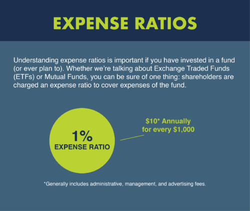

## Table of Contents

## What is an expense ratio in mutual funds?

An expense ratio in mutual funds is a fee that investors pay to the fund company for managing their money. It is shown as a percentage of the total assets in the fund. This fee covers the costs of running the fund, like paying the managers, administrative expenses, and other operational costs. The expense ratio is taken out of the fund's assets each year, which means it reduces the returns that investors get.

Different mutual funds have different expense ratios. Some funds might have a low expense ratio, which is good for investors because it means they keep more of their returns. Other funds might have a high expense ratio, which can eat into the returns more significantly. It's important for investors to look at the expense ratio when choosing a mutual fund because even a small difference in the fee can make a big impact on their investment over time.

## Why should beginners care about expense ratios?

Beginners should care about expense ratios because they affect how much money they can make from their investments. When you put money into a mutual fund, the fund company takes a small part of it every year to pay for running the fund. This is the expense ratio. If the expense ratio is high, it means the fund company is taking more money out of your investment, which leaves you with less money to grow over time.

Even a small difference in the expense ratio can make a big difference in the long run. For example, if you invest in a fund with a low expense ratio, more of your money stays in the fund and can grow. But if you choose a fund with a high expense ratio, you'll end up with less money because the fund company is taking more out each year. So, it's important for beginners to look at the expense ratio when picking a mutual fund to help their money grow as much as possible.

## How does the expense ratio affect the overall return of a mutual fund?

The expense ratio is like a yearly fee that the fund company takes out of your mutual fund. This fee is a percentage of all the money in the fund. When the fund company takes this fee, it means there's less money left in the fund to grow and make you money. So, if the expense ratio is high, it can eat into your returns a lot because the fund company is taking more money out each year.

Let's say you have two funds that make the same amount of money each year, but one has a high expense ratio and the other has a low one. The fund with the high expense ratio will give you less money at the end of the year because more of the fund's money is being used to pay the fee. Over many years, this difference can add up, and the fund with the lower expense ratio will usually give you more money in the end. That's why it's important to look at the expense ratio when choosing a mutual fund.

## What is considered a high expense ratio for a mutual fund?

A high expense ratio for a mutual fund is usually anything above 1%. This means that if you have $100 in the fund, the fund company will take more than $1 every year to cover their costs. For example, if the expense ratio is 1.5%, they will take $1.50 out of your $100 each year. This can really add up over time and eat into your returns.

Expense ratios can vary a lot depending on the type of fund. Actively managed funds, where a person picks the investments, often have higher expense ratios because they need to pay the manager and do more research. On the other hand, index funds, which just try to match the performance of a market index, usually have lower expense ratios because they don't need as much work to manage. So, when you're looking at mutual funds, it's a good idea to compare the expense ratios and think about how they might affect your money over time.

## How can you find the expense ratio of a mutual fund?

You can find the expense ratio of a mutual fund by looking at the fund's prospectus. The prospectus is a document that the fund company gives to investors. It has all the important information about the fund, including the expense ratio. You can usually find the prospectus on the fund company's website or by asking them to send you a copy.

Another way to find the expense ratio is by using financial websites. Websites like Morningstar, Yahoo Finance, or the fund company's own website often list the expense ratio right on the fund's page. Just type in the name of the mutual fund, and you should see the expense ratio along with other details about the fund. It's a quick and easy way to compare different funds and see how much they charge.

## What are the components that make up the expense ratio?

The expense ratio of a mutual fund is made up of different costs that the fund company has to pay to run the fund. One big part of the expense ratio is the management fee. This is what the fund company charges to pay the people who manage the fund and make investment decisions. Another part is the administrative costs, which include things like paying for office space, staff salaries, and keeping records. The fund company also has to pay for other services like legal fees, accounting, and sometimes marketing the fund to attract more investors.

These costs are all added together and then divided by the total amount of money in the fund to figure out the expense ratio. This way, the expense ratio is shown as a percentage of the fund's assets. The percentage tells investors how much of their money is being used each year to cover these costs. A higher expense ratio means more of the fund's money is being used for these expenses, which can lower the returns for investors. So, it's important for investors to understand what makes up the expense ratio and how it can affect their investments.

## Can the expense ratio change over time, and if so, why?

Yes, the expense ratio of a mutual fund can change over time. This happens because the costs that make up the expense ratio can go up or down. For example, if the fund company decides to hire more people to manage the fund, the management fee might go up. Or if the fund grows and has more money in it, the administrative costs might go down because they are spread out over a larger amount of money.

Another reason the expense ratio might change is because of changes in the fund's strategy or the market. If the fund company decides to start investing in more complex things that need more research, the costs could go up. On the other hand, if the fund switches to a simpler strategy or if the market changes in a way that makes managing the fund easier, the costs might go down. So, it's a good idea for investors to keep an eye on the expense ratio and see if it changes over time.

## How do expense ratios compare between actively managed and passively managed funds?

Expense ratios for actively managed funds are usually higher than those for passively managed funds. Actively managed funds have people who pick the investments and try to beat the market. This takes a lot of work and costs more money. So, the fund company charges a higher fee, which is the expense ratio, to cover these costs. For example, an actively managed fund might have an expense ratio of 1% or more.

On the other hand, passively managed funds, like index funds, have lower expense ratios. These funds just try to match the performance of a market index, like the S&P 500. They don't need people to pick investments, so they don't have to pay as much for management. This makes the expense ratio lower. For example, an index fund might have an expense ratio of 0.1% or even less. So, if you want to keep more of your money, a passively managed fund might be a better choice because of its lower expense ratio.

## What strategies can investors use to minimize the impact of expense ratios?

One strategy investors can use to minimize the impact of expense ratios is to choose funds with lower expense ratios. This means looking for index funds or other passively managed funds, which usually have lower fees than actively managed funds. By putting money into these lower-cost funds, more of your money stays in the fund and can grow over time. It's a good idea to compare the expense ratios of different funds before you decide where to invest.

Another strategy is to keep an eye on the expense ratio over time. Sometimes, the expense ratio can change, and if it goes up, it might be time to look for a different fund. Also, if you have a lot of money spread out over many different funds, you might be paying more in fees than you need to. It can help to focus your money on a few funds with low expense ratios instead of spreading it out too much. This way, you can keep more of your money working for you and not going to fees.

## How do expense ratios impact long-term investment growth?

Expense ratios can have a big effect on how much your investments grow over a long time. When you put money into a mutual fund, the fund company takes a small part of it every year to pay for running the fund. This is the expense ratio. If the expense ratio is high, it means the fund company is taking more money out of your investment each year. This leaves you with less money to grow over time. Even a small difference in the expense ratio can make a big difference in the long run. For example, if you invest in a fund with a low expense ratio, more of your money stays in the fund and can grow. But if you choose a fund with a high expense ratio, you'll end up with less money because the fund company is taking more out each year.

Over many years, the impact of the expense ratio can really add up. Let's say you invest $10,000 in a fund that grows by 7% each year. If the expense ratio is 0.5%, after 30 years, you might have around $57,434. But if the expense ratio is 1.5%, you might only have around $46,147. That's a difference of over $11,000 just because of the expense ratio. So, it's important to look at the expense ratio when picking a mutual fund to help your money grow as much as possible over the long term.

## What regulatory requirements govern the disclosure of expense ratios?

In the United States, the disclosure of expense ratios for mutual funds is governed by the Securities and Exchange Commission (SEC). The SEC requires mutual fund companies to include the expense ratio in the fund's prospectus, which is a document that gives investors all the important information about the fund. This helps investors understand how much they will be paying in fees and make better choices about where to put their money.

The SEC also requires that the expense ratio be shown in the fund's annual and semi-annual reports. These reports give investors an update on how the fund is doing and how much it costs to run the fund. By making sure this information is clear and easy to find, the SEC helps investors keep track of the fees they are paying and see if they change over time.

## How do international mutual funds' expense ratios differ from domestic ones?

International mutual funds often have higher expense ratios than domestic ones. This is because managing an international fund can be more complicated and expensive. The fund managers need to deal with different countries' rules, currencies, and markets. They might need to pay for more research and have to travel more often. All these extra costs can make the expense ratio go up. So, if you're looking at an international fund, you might see an expense ratio that's higher than what you'd find with a domestic fund.

Even though international funds can have higher expense ratios, it's still important to compare them. Not all international funds will have high fees. Some might be managed in a way that keeps costs down. It's a good idea to look at the expense ratio and see how it compares to other international funds and to domestic funds. This way, you can make a better choice about where to put your money and understand how the fees might affect your investment over time.

## What are Investment Expense Ratios in Mutual Funds and How Can They Be Understood?

The expense ratio of a mutual fund is a critical element that represents the annual percentage of fund assets allocated to cover various administrative and operational expenses. This ratio directly influences the net returns an investor receives, underscoring the importance of understanding and evaluating it. 

Expense ratios encompass costs such as management fees, legal fees, accounting charges, and marketing expenses. For investors, a thorough comprehension of these ratios is pivotal, as they diminish the overall returns on investment. The equation for calculating the net return can be expressed as:

$$
\text{Net Return} = \text{Gross Return} - (\text{Expense Ratio} \times \text{Fund Assets})
$$

When selecting mutual funds, the expense ratio plays a vital role. Even slight variations in expense ratios can have a profound effect on long-term investment gains. For instance, if two funds generate the same gross return but differ in their expense ratios, the one with the lower ratio will invariably result in higher net returns over time. Consider these two hypothetical funds, Fund A and Fund B, over a ten-year period:

- Fund A: Gross annual return of 6% with an expense ratio of 0.5%
- Fund B: Gross annual return of 6% with an expense ratio of 1%

Using the formula for compounding annual returns:

$$
\text{Final Value} = \text{Initial Investment} \times (1 + \text{Annual Net Return})^{\text{Years}}
$$

An initial investment of $1,000 in these funds would yield:

- Fund A: $1000 \times (1 + 0.055)^{10} \approx 1,744.94$
- Fund B: $1000 \times (1 + 0.05)^{10} \approx 1,628.89$

As such, Fund A would provide a higher final value due to its lower expense ratio. Therefore, investors should meticulously compare expense ratios among similar funds to pinpoint cost-efficient options. While performance metrics are crucial, consistently lower expense ratios contribute significantly to maximizing long-term investment success.

## What is the Importance of Low Expense Ratios?

Lower expense ratios are crucial for enhancing net returns since they indicate that a smaller proportion of the fund's assets is allocated towards operational costs. By reducing these expenses, investors can allocate a larger percentage of their assets towards actual investments, facilitating greater overall growth. This principle aligns well with long-term investment strategies that aim to leverage compound interest over time. The equation for future value using compound interest is given by:

$$
FV = PV \times (1 + r)^n
$$

where:
- $FV$ is the future value of the investment
- $PV$ is the present value or initial amount invested
- $r$ is the annual rate of return
- $n$ is the number of years the money is invested

In this equation, a lower expense ratio effectively increases the annual rate of return $r$, thereby increasing the future value $FV$ of the investment.

For those focused on sustainable, long-term wealth accumulation, selecting mutual funds with minimal expense ratios is a strategic choice. The power of compound growth is then maximized, given that lower expenses allow more of the investment's growth to be reinvested rather than absorbed by fees.

However, solely prioritizing low expense ratios without considering fund performance can be misleading. An investment decision should balance cost with the fund's ability to generate returns. A fund with a slightly higher expense ratio might provide a better overall return if its underlying assets perform exceptionally well. It is critical to evaluate the net performance, which is the fund's return after expenses, to make well-informed investment decisions.

To illustrate, investors might employ a Python script to compare relative long-term outcomes of different funds, factoring in both expense ratios and historical performances:

```python
def future_value(initial_investment, annual_return, expense_ratio, years):
    net_return = annual_return - expense_ratio
    return initial_investment * (1 + net_return) ** years

# Example of comparing two funds
initial_investment = 10000  # Starting with $10,000
years = 20

# Fund A characteristics
annual_return_a = 0.08  # 8% return
expense_ratio_a = 0.01  # 1% expense ratio

# Fund B characteristics
annual_return_b = 0.10  # 10% return
expense_ratio_b = 0.02  # 2% expense ratio

fv_a = future_value(initial_investment, annual_return_a, expense_ratio_a, years)
fv_b = future_value(initial_investment, annual_return_b, expense_ratio_b, years)

print("Future Value of Fund A:", fv_a)
print("Future Value of Fund B:", fv_b)
```

This hypothetical comparison underscores the importance of considering both expense ratio and performance metrics to optimize investment outcomes. Investors, therefore, need a comprehensive strategy that incorporates both cost and performance elements, ensuring optimal returns over time.

## References & Further Reading

[1]: Bergstra, J., Bardenet, R., Bengio, Y., & Kégl, B. (2011). ["Algorithms for Hyper-Parameter Optimization."](https://papers.nips.cc/paper/4443-algorithms-for-hyper-parameter-optimization) Advances in Neural Information Processing Systems 24.

[2]: ["Advances in Financial Machine Learning"](https://www.amazon.com/Advances-Financial-Machine-Learning-Marcos/dp/1119482089) by Marcos Lopez de Prado

[3]: ["Evidence-Based Technical Analysis: Applying the Scientific Method and Statistical Inference to Trading Signals"](https://www.amazon.com/Evidence-Based-Technical-Analysis-Scientific-Statistical/dp/0470008741) by David Aronson

[4]: ["Machine Learning for Algorithmic Trading"](https://github.com/stefan-jansen/machine-learning-for-trading) by Stefan Jansen

[5]: ["Quantitative Trading: How to Build Your Own Algorithmic Trading Business"](https://www.amazon.com/Quantitative-Trading-Build-Algorithmic-Business/dp/1119800064) by Ernest P. Chan