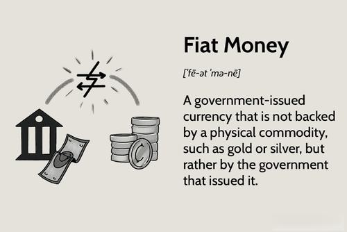

In the ever-evolving world of finance, gold and other precious metals have consistently stood out as robust and dependable investment options. Historically, these commodities have served as effective hedges against inflation and economic instability, maintaining their value over time. The allure of gold, silver, platinum, and palladium lies in their inherent scarcity and intrinsic value, making them a staple in diversified investment portfolios.

As technology advances, algorithmic trading has emerged as a formidable tool for investors eager to optimize their returns in the precious metals market. Algorithmic trading, driven by complex computer algorithms, allows investors to execute trades with precision and at optimal conditions by analyzing large volumes of market data swiftly. This technological advancement reduces human error, eliminates emotional trading decisions, and enhances the overall trading strategy.



This article offers insights and strategies for investing in gold and precious metals through algorithmic trading, aiming to assist both seasoned and novice investors. By leveraging this technology, investors can strike a balance between risk and reward, ensuring a more stable and profitable portfolio. With algorithmic trading, investors are empowered to navigate the financial markets' complexities with greater efficiency and informed decision-making.

Join us as we explore the investment landscape, harnessing the power of traditional commodity investment and the revolutionary impact of algorithmic trading. This synergy between age-old asset classes and cutting-edge technology presents a promising frontier for investors aiming to gain a competitive edge in the market.

## Table of Contents

## The Importance of Gold in Investment Portfolios

Gold has long held a prominent place in investment portfolios due to its unique properties as a financial asset. Its reputation as a hedge against inflation and economic uncertainty makes it an attractive option for investors seeking stability in times of financial turbulence. Historically, gold has retained its intrinsic value, often experiencing increases in demand and price when market conditions are unfavorable.

One of the primary reasons for gold's prominence is its status as a 'safe haven' asset. During periods of market volatility, investors often flock to gold as a means of preserving capital. Unlike fiat currencies, which can be affected by central bank policies and inflation, gold is a tangible asset that does not rely on any entity for its value. This makes gold a crucial component of diversified investment strategies.

Historically, gold has outperformed many other asset classes during tumultuous economic times. For example, during the 2008 financial crisis, while equities and other commodities experienced sharp declines, gold prices increased, providing a cushion for investors' portfolios. Similarly, in times of geopolitical tensions, such as conflicts or trade disputes, gold has consistently served as a reliable store of value.

In comparison with other commodities, gold's performance has shown remarkable resilience. It often acts inversely to equities and bonds, providing a balancing effect in an investment portfolio. While other commodities like oil or agricultural products can be influenced by supply chain dynamics and seasonal factors, gold's price movements are less erratic, largely driven by macroeconomic indicators and investor sentiment.

The strategic inclusion of gold in modern investment portfolios offers significant advantages. It provides diversification, reduces overall portfolio risk, and offers protection against currency devaluation. For instance, the World Gold Council suggests maintaining a small allocation of about 2-10% of an investment portfolio in gold to enhance overall resilience.

Incorporating gold into a financial strategy also aligns with modern portfolio theory, which emphasizes diversification to achieve optimized returns for a given level of risk. With gold's low correlation with other asset classes, it can effectively reduce [volatility](/wiki/volatility-trading-strategies) and enhance portfolio performance over time.

In conclusion, the importance of gold in investment portfolios is underscored by its ability to serve as a hedge against economic uncertainties and its proven track record during financial upheavals. By understanding gold's role in modern investment, investors can make more informed strategic financial planning decisions, ultimately fortifying their portfolios against unforeseen challenges.

## Understanding Precious Metals Beyond Gold

In addition to gold, precious metals such as silver, platinum, and palladium present distinct investment opportunities that can enhance a diversified portfolio. Each of these metals carries unique properties, uses, and market behaviors, contributing to their potential as profitable investment choices.

### Silver
Silver, often referred to as the "poor man's gold," is a versatile metal with both industrial and investment demand. Its applications span across electronics, solar panels, jewelry, and currency, making its market dynamics distinct from gold. The demand for silver in renewable energy technologies, particularly solar energy, has been increasing, potentially driving future price appreciation.

The silver market is known for its volatility due to smaller market size compared to gold, leading to more significant price fluctuations. Therefore, potential returns can be substantial, but the risks are equally pronounced.

### Platinum
Platinum is a rare metal with high industrial demand, especially in the automotive industry for catalytic converters. Its role in reducing vehicle emissions bolsters its demand as stricter environmental regulations are implemented globally. Additionally, platinum is used in jewelry and various industrial applications, including chemical processing and electronics.

The price of platinum is influenced by its supply, which is concentrated mainly in South Africa and Russia. Economic and political developments in these regions can significantly impact platinum prices. Historically, platinum has traded at a premium to gold, although recent years have seen a reversal of this trend.

### Palladium
Palladium, like platinum, is crucial in the automotive industry for catalytic converters, particularly in gasoline engines. Its market is tightly supplied, with significant production coming from Russia and South Africa. The increased demand for palladium in the automotive sector, coupled with supply constraints, has led to a substantial price increase in recent years.

Palladium's market is subject to unique dynamics, such as regulatory changes in vehicle emissions and economic factors influencing car sales, making its price behavior distinct from other precious metals.

### Market Dynamics and Investment Considerations
The prices of these metals are influenced by a myriad of factors, including industrial demand, technological advancements, geopolitical events, and currency fluctuations. Investors should evaluate these market forces when considering investments beyond gold.

Diversifying an investment portfolio to include silver, platinum, and palladium can mitigate risks and enhance potential returns. Each metal responds differently to market stimuli, providing a balancing effect against economic uncertainties and inflation. A well-rounded approach to investing in precious metals, considering supply-demand dynamics and industrial trends, can lead to more resilient and profitable investment outcomes.

## Algorithmic Trading: The Future of Investing

Algorithmic trading uses computer algorithms to execute trades at optimal market conditions. These algorithms perform intricate analyses of extensive market data, allowing traders to capitalize on even the slightest market fluctuations. This approach contrasts with traditional trading, where human decision-makers rely more on intuition and manual analysis.

The primary advantage of [algorithmic trading](/wiki/algorithmic-trading) is its speed. Algorithms can process data and execute trades in milliseconds, far faster than a human could. This advantage is crucial in the high-frequency trading environment where securities can change hands in fractions of a second. Additionally, algorithms enhance accuracy and efficiency. By removing the emotional and psychological biases inherent to human traders, algorithms reduce the chance of error and ensure that trades adhere strictly to predefined criteria.

Various algorithmic trading strategies have been developed to suit different market conditions and investment goals. One common strategy is statistical [arbitrage](/wiki/arbitrage), which exploits price inefficiencies between correlated securities. For example, an algorithm may detect a temporary discrepancy between the prices of two similar stocks and execute offsetting trades to profit from the price convergence.

Another widely used strategy is [trend following](/wiki/trend-following), where algorithms identify and trade in the direction of a trending market. This strategy uses mathematical indicators like moving averages or the relative strength index (RSI) to ascertain the trend. Here's a simple example of a basic moving average strategy implemented in Python:

```python
import pandas as pd
import numpy as np

# Load historical price data
data = pd.read_csv('price_data.csv')
prices = data['Close']

# Calculating short and long-term moving averages
short_window = 40
long_window = 100
signals = pd.DataFrame(index=data.index)
signals['Signal'] = 0.0

signals['Short_MA'] = prices.rolling(window=short_window, min_periods=1, center=False).mean()
signals['Long_MA'] = prices.rolling(window=long_window, min_periods=1, center=False).mean()

# Generating buy/sell signals
signals['Signal'][short_window:] = np.where(
    signals['Short_MA'][short_window:] > signals['Long_MA'][short_window:], 1.0, 0.0)
signals['Positions'] = signals['Signal'].diff()

# Display signals
print(signals)
```

Understanding the fundamentals of algorithmic trading is essential for investors aiming to exploit this technology. Algorithms are commonly built using a combination of mathematical rules and statistical models. These models assess historical data patterns to forecast future price movements. Successful implementation of algorithmic trading requires robust risk management and continuous strategy improvement, adapting to the ever-changing market conditions.

In conclusion, algorithmic trading represents the future of financial investing by offering unmatched speed, accuracy, and strategic flexibility. This technology empowers investors to execute precise, data-driven trades, minimizing emotional factors and maximizing potential returns.

## Applying Algorithmic Trading to Gold and Precious Metals

The integration of algorithmic trading in the precious metals market represents a notable transformation for investors. Algorithmic trading employs advanced computer algorithms to automate trade execution at optimal times, relying on complex mathematical models and vast market data analysis. This approach can be particularly effective when tailored to the nuances of trading gold and other precious metals.

**Customizing Algorithms for Precious Metals**

Algorithmic trading in precious metals demands an understanding of the distinct market dynamics that influence these commodities. For instance, gold, often seen as a safe haven asset, reacts to macroeconomic indicators, such as inflation rates and geopolitical tensions. As a result, trading algorithms for gold can be designed to analyze economic reports, news feeds, and historical price data, allowing them to predict market movements and execute trades accordingly.

Tailoring an algorithm for gold might involve incorporating variables such as:
- Interest rates and inflation indicators
- Currency strength, especially the U.S. dollar
- Geopolitical event data feed processing
- Volume-Weighted Average Price (VWAP) adjustments to manage large orders

**Case Studies of Algorithmic Trading Success**

Numerous examples illustrate the successful application of algorithmic trading in gold markets. One notable case is the use of [momentum](/wiki/momentum)-based algorithms, which identify and exploit trends based on past price behavior. By integrating sentiment analysis and real-time data ingestion, these algorithms capitalize on short-term price movements effectively.

Another example is arbitrage strategies, where algorithms simultaneously buy and sell gold contracts in different markets or time frames to profit from price discrepancies. This requires high-frequency trading algorithms capable of executing multiple trades in a fraction of a second, leveraging computational speed and efficiency.

**Potential Risks and Pitfalls**

Despite the advantages, algorithmic trading in volatile markets such as precious metals comprises inherent risks. Market conditions can change rapidly, and algorithms might react too slowly to unexpected events. A significant risk is "flash crashes," where rapid sell-offs cause substantial price drops, sometimes exacerbated by automated trading systems.

Additionally, overly complex algorithms may suffer from "overfitting," where they perform well on historical data but fail in live markets. Simplified models with robust risk management protocols are critical to avoiding such pitfalls.

**Risk Mitigation Strategies**

Successfully navigating the volatile precious metals market with algorithmic trading involves several risk mitigation strategies:
- Implementing stop-loss mechanisms to limit potential losses
- Continuous algorithm testing and refinement using out-of-sample data
- Use of multi-strategy approaches, combining several trading strategies to balance risk and reward
- Real-time monitoring and human oversight to mitigate algorithmic errors

By addressing these aspects, investors can efficiently leverage algorithmic trading to optimize their investments in gold and other precious metals, balancing the pursuit of returns with prudent risk management.

## Choosing the Right Algorithmic Trading Platform

Selecting an appropriate algorithmic trading platform is a critical step for investors in the precious metals market. The right platform not only facilitates efficient trading but also provides robust features, competitive pricing, and stringent security measures.

**Criteria for Choosing Platforms**

To choose the right platform, investors should consider several key criteria:

1. **Features and Functionality**: A comprehensive algorithmic trading platform should offer extensive features such as backtesting capabilities, a wide range of technical indicators, customizable trading strategies, and high-speed execution. Platforms that allow for seamless integration with various data sources are also beneficial for real-time monitoring and decision-making.

2. **Pricing Structure**: Different platforms offer various pricing models, such as subscription fees, commission-based pricing, or a combination. Investors should evaluate the cost-effectiveness of a platform by balancing the services offered with their trading volume and frequency. Some platforms may charge additional fees for advanced features, so it's important to factor these into the overall cost.

3. **Security and Compliance**: Security is paramount in algorithmic trading. Investors should ensure that the platform adheres to industry standards for data protection and transaction security. Compliance with regulatory requirements and regular audits can also provide an added layer of trust and reliability.

**Comparison of Leading Platforms**

A comparative analysis of leading algorithmic trading platforms can help investors identify which tools best suit their needs. Notable platforms often providing advanced functionalities include MetaTrader 4/5, QuantConnect, and [Interactive Brokers](/wiki/interactive-brokers-api). Each offers unique advantages:

- **MetaTrader 4/5**: Known for its user-friendly interface, MT4/5 provides robust technical analysis tools and automated trading capabilities through Expert Advisors (EAs). It is widely used among retail traders.

- **QuantConnect**: This platform caters to both novice and experienced traders by offering a collaborative environment to build and backtest algorithms using C# or Python. QuantConnect also supports an extensive range of data libraries.

- **Interactive Brokers**: Renowned for access to a global market, it provides sophisticated tools suitable for professional traders, including various order types and real-time data integration.

**Considerations for Usability and Support**

Platform usability and customer support are also vital for algorithmic trading success. A platform should be intuitive, allowing traders to set up and modify strategies with ease. Comprehensive documentation and tutorial resources can significantly enhance the learning curve for new users. Moreover, responsive customer support services can assist with technical issues and ensure seamless trading operations.

**Aligning Tools with Trading Styles**

Selecting a platform that aligns with an investor's trading style and strategy is crucial. For instance, high-frequency traders might prioritize platforms with low latency and quick execution times, whereas long-term investors may focus on different analytical tools and data integration capabilities. By assessing personal trading goals and methodological preferences, investors can better determine which platform will optimize their investment outcomes in precious metals.

## The Impact of Market Trends on Precious Metal Investments

Market trends and economic indicators play a crucial role in determining the prices of gold and other precious metals. Understanding these trends and factors can provide investors with insights necessary for strategic decision-making.

**Recent Trends and Projections**

Over recent years, the prices of precious metals have been heavily influenced by global economic conditions. For instance, during periods of economic uncertainty or recession, the demand for gold often rises due to its reputation as a safe-haven asset. This phenomenon was notable during the COVID-19 pandemic, where gold prices reached unprecedented highs as investors sought security amidst market volatility.

Projections suggest that as economies recover and stabilize, there may be a shift in demand. However, with ongoing uncertainties, including potential pandemics or unforeseen economic disruptions, precious metals could continue to see volatile price movements. Silver, platinum, and palladium also show unique trends due to their industrial applications, often tied to technological advancements and changes in consumer preferences.

**Global Events and Their Impact**

Several global events critically impact precious metal prices. For example, changes in economic policies, such as [interest rate](/wiki/interest-rate-trading-strategies) adjustments by central banks, can alter investor behavior. Low interest rates typically decrease the opportunity cost of holding non-yielding assets like gold, driving up its demand.

Geopolitical tensions also play a pivotal role. Conflicts or diplomatic conflicts can lead to increased demand for precious metals as a hedge against currency devaluation and economic instability. 

Currency fluctuations have a direct impact on metal pricing, primarily because these assets are typically priced in U.S. dollars. A weaker dollar often makes precious metals more affordable for investors using other currencies, thereby boosting demand and prices.

**Strategic Timing and Decision-Making**

Investing in precious metals during volatile markets requires strategic timing. Technical analysis, including trend lines and moving averages, can help identify optimal entry and [exit](/wiki/exit-strategy) points. Advanced data analytics and real-time market monitoring are indispensable tools for such strategic decision-making.

**Adapting to Market Changes with Algorithmic Trading**

Algorithmic trading offers a cutting-edge method to adapt to rapid market changes. Algorithms can quickly analyze vast historical and real-time data to identify profitable trading opportunities. These systems can incorporate complex mathematical models and [artificial intelligence](/wiki/ai-artificial-intelligence) to predict price movements more accurately than traditional methods.

For instance, a simple moving average crossover strategy can automatically execute trades when short-term averages surpass long-term ones, signaling a price uptrend. 

```python
import pandas as pd

def generate_signals(data, short_window=40, long_window=100):
    signals = pd.DataFrame(index=data.index)
    signals['price'] = data['price']
    signals['short_mavg'] = data['price'].rolling(window=short_window, min_periods=1, center=False).mean()
    signals['long_mavg'] = data['price'].rolling(window=long_window, min_periods=1, center=False).mean()
    signals['signal'] = 0.0
    signals['signal'][short_window:] = np.where(signals['short_mavg'][short_window:] 
                                         > signals['long_mavg'][short_window:], 1.0, 0.0)   
    signals['positions'] = signals['signal'].diff()
    return signals
```

Algorithmic trading helps mitigate risks associated with emotional bias and human error, providing a systematic approach to investing in precious metals. As such, investors who leverage these technologies are better positioned to quickly adapt to evolving market conditions, maximizing returns while managing risks effectively.

## Conclusion: The Future of Gold, Precious Metals, and Algorithmic Trading

As financial technologies continue to advance, algorithmic trading within the gold and precious metals markets presents a promising frontier for contemporary investors. The integration of sophisticated algorithms has the potential to significantly streamline and enhance investment strategies, allowing traders to execute precise and data-driven decisions with minimal human intervention. These algorithmic systems leverage vast amounts of market data, identifying patterns and trends that might be overlooked by traditional analysis methods.

The implementation of algorithms in trading not only augments accuracy but also increases the speed of transactions, offering a notable competitive advantage. The ability to swiftly respond to market fluctuations and economic indicators is a critical [factor](/wiki/factor-investing) in optimizing returns and minimizing risks. For instance, algorithmic trading platforms can be programmed to adjust trading strategies in real-time based on pre-set conditions, such as changes in metal prices or the emergence of geopolitical tensions.

Investors who capitalize on algorithmic trading stand to gain a competitive edge in managing their precious metal portfolios. The adaptability and precision of these systems allow for a more dynamic approach to investing, accommodating shifts in global markets and economic landscapes. However, success in algorithmic trading requires an ongoing commitment to staying informed about technological advancements and market dynamics. Continuous learning and adaptation are pivotal, as the technological landscape in finance is ever-changing, and market conditions can rapidly evolve.

Embracing the synergy of traditional commodities like gold and modern technology such as algorithmic trading is essential for forward-thinking investors. This convergence offers a unique opportunity to blend the stability historically associated with precious metals with the cutting-edge efficiencies of contemporary financial technologies. As investors look towards the future, the integration of these elements promises to redefine investment strategies, offering both security and innovation.

## References & Further Reading

[1]: ["The Intelligent Investor"](https://en.wikipedia.org/wiki/The_Intelligent_Investor) by Benjamin Graham

[2]: Goldman Sachs. (2019). ["Gold: At the Crossroads of Inflation Hedge, Safe Haven, and Cyclical Commodity."](https://finance.yahoo.com/news/gold-hedge-trump-inflation-risks-161353421.html)

[3]: J.P. Morgan. (2020). ["A Guide to Investing in Gold and Precious Metals."](https://privatebank.jpmorgan.com/nam/en/insights/markets-and-investing/is-it-a-golden-era-for-gold)

[4]: World Gold Council. (n.d.). ["Investment in Gold."](https://www.gold.org/goldhub/research/gold-demand-trends/gold-demand-trends-full-year-2022/investment)

[5]: ["Algorithmic Trading and DMA: An Introduction to Direct Access Trading Strategies"](https://archive.org/details/algorithmictradi0000john) by Barry Johnson

[6]: Elliott, D. J. (2021). ["The Role of Gold as a Financial Asset."](https://www.sciencedirect.com/science/article/pii/S2405851321000519)

[7]: National Bureau of Economic Research. (2016). ["Historical Returns of Gold."](https://www.nber.org/papers/w24112) by Baur, D. G., & McDermott, T.