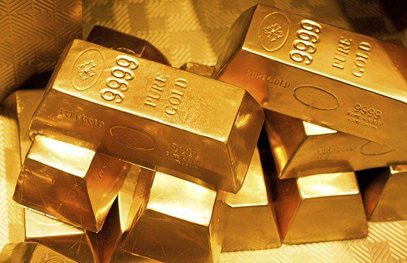

## Table of Contents

## What is gold and where does it come from?

Gold is a shiny, yellow metal that people have valued for thousands of years. It is very soft and can be shaped easily. People use gold to make jewelry, coins, and other special things. Gold does not rust or tarnish, which means it stays shiny and does not change color over time. This makes it very special and valuable.

Gold comes from the earth. It is found in rocks and soil, often near rivers or in mountains. Miners dig deep into the earth to find gold. Sometimes, they find it in big chunks, but usually, it is mixed with other rocks and metals. To get the gold out, miners have to crush the rocks and use chemicals to separate the gold. This process can be hard and takes a lot of work.

## Why has gold been valued throughout history?

Gold has been valued throughout history because it is rare and beautiful. People like how it shines and how it can be made into pretty things like jewelry and coins. Gold is also very soft and easy to work with, so it can be shaped into different forms. This made it useful for making things that show wealth and power, like crowns and special decorations.

Another reason gold has been valued is because it lasts a long time. It doesn't rust or tarnish, so things made of gold stay beautiful forever. This made gold a good choice for important items that people wanted to keep for a long time, like religious objects and family heirlooms. Because gold is so lasting and hard to find, people have always been willing to trade a lot for it, making it a good way to store value and wealth.

## How is gold used in jewelry and what makes it suitable for this purpose?

Gold is used in jewelry because it is soft and can be shaped easily. Jewelers can make it into rings, necklaces, bracelets, and earrings. They can also mix gold with other metals to make it stronger or change its color. For example, mixing gold with copper makes it more red, and mixing it with silver makes it more white. This way, jewelers can make many different kinds of jewelry that people like.

Gold is also good for jewelry because it does not rust or tarnish. This means that gold jewelry stays shiny and beautiful for a long time. People like to wear gold because it looks nice and lasts a long time. It is also a symbol of wealth and special occasions, so people often give gold jewelry as gifts for weddings, birthdays, and other important events.

## What role does gold play in the global economy?

Gold plays an important role in the global economy because it is seen as a safe investment. When people are worried about their money because of problems like wars or economic downturns, they often buy gold. They do this because gold keeps its value over time and can be easily traded anywhere in the world. Many countries keep gold in their banks as a way to protect their money and make sure they have something valuable if their own money loses value.

Gold is also used in the economy because it helps set prices for other things. For example, the price of gold can affect the prices of other metals and even some currencies. When the price of gold goes up, it can make other investments seem less valuable. This means that the price of gold is watched closely by people who make decisions about money and investments around the world.

## How is gold mined and what are the environmental impacts?

Gold is mined in two main ways: open-pit mining and underground mining. In open-pit mining, miners dig big holes in the ground to get to the gold. They use big machines to move the dirt and rocks. In underground mining, miners dig tunnels deep into the earth to reach the gold. Once they find the gold, they crush the rocks and use chemicals like cyanide to separate the gold from the other materials. This process can take a lot of time and work.

Mining gold can harm the environment in many ways. One big problem is that it can destroy the land where the mining happens. The big holes from open-pit mining can change the landscape and make it hard for plants and animals to live there. The chemicals used to separate the gold can also pollute the water and soil, which can harm fish and other wildlife. Another issue is that mining uses a lot of energy, which can add to pollution and climate change.

Governments and mining companies are trying to reduce these environmental impacts. They are working on better ways to mine gold that use less harmful chemicals and energy. They are also trying to restore the land after mining is done, by planting trees and cleaning up the water. But, even with these efforts, mining gold still has a big impact on the environment.

## What are the different forms of gold investment and their benefits?

Gold can be invested in different ways, like buying physical gold, gold ETFs, or gold mining stocks. Physical gold includes things like gold bars and coins. People like this because they can hold the gold and feel safe knowing they have something real. Gold ETFs, or exchange-traded funds, are like buying a piece of a big gold collection. They are easy to buy and sell, and you don't have to worry about keeping the gold safe. Gold mining stocks are shares in companies that mine gold. If the price of gold goes up, these companies can make more money, and the value of the stocks can go up too.

Each type of gold investment has its own benefits. Physical gold is good because it is a safe way to keep your money. It can protect your savings if the economy is doing badly. Gold ETFs are good because they are easy to buy and sell, and you don't have to worry about storing the gold. They can also be a good way to spread out your investments. Gold mining stocks can be a good choice if you think the price of gold will go up. They can make more money than just buying gold, but they can also be riskier because the success of the company matters too.

## How does gold act as a hedge against inflation?

Gold acts as a hedge against inflation because it keeps its value over time. When prices for things like food, gas, and houses go up, money can lose value. But gold does not lose value as easily. People can buy gold when they think inflation will go up, and then they can sell it later for more money than they paid for it. This way, gold helps protect their savings from losing value because of inflation.

Gold is also seen as a safe place to put money during uncertain times. When people are worried about the economy, they often buy gold because it is a good way to keep their money safe. If inflation is high, people might move their money from things like stocks and bonds to gold. This demand for gold can make its price go up, which helps people who own gold to keep their wealth even when prices for other things are going up.

## What are the properties of gold that make it valuable in technology and industry?

Gold is very useful in technology and industry because it has special properties that make it different from other metals. One important property is that gold is an excellent conductor of electricity. This means it can move electricity very well, which is important for making things like computers, phones, and other electronic devices. Gold is also very good at not reacting with other things. This means it does not rust or tarnish, so it stays the same even when it is used in small parts inside machines and devices.

Another reason gold is valuable in technology and industry is because it is very soft and can be shaped easily. This makes it perfect for making very thin wires and sheets that are needed in many electronic devices. Gold can be stretched into very thin wires or made into very thin sheets, which is important for making things like circuit boards and connectors. Because gold does not wear out easily and keeps working well, it is often used in places where things need to last a long time and work without problems.

## How do central banks use gold reserves and why is this important?

Central banks use gold reserves to help keep their country's money stable. They keep gold because it is seen as a safe and valuable asset. When there are problems with the economy, like inflation or a falling currency, central banks can use their gold to help fix these problems. They might sell some of their gold to get money or use it to back up their currency. This can help people trust the country's money more and keep the economy stable.

Having gold reserves is important for central banks because it shows that the country has something valuable to fall back on. Other countries and investors see this as a sign that the country's money is strong and reliable. This can make it easier for the country to borrow money and do business with other countries. Gold reserves also give central banks a way to deal with big economic changes without having to change their policies too much. This helps keep the economy running smoothly.

## What is the process of gold refining and purification?

Gold refining and purification is the process of making gold purer by removing other metals and impurities. When gold is mined, it usually comes mixed with other things like silver, copper, and dirt. To get pure gold, miners first crush the rocks and use chemicals like cyanide to separate the gold from the other materials. This makes a kind of gold mixture, but it's still not pure enough for most uses.

The next step is to refine the gold even more. One common way to do this is called the Miller process. In this process, the gold mixture is melted and then chlorine gas is passed through it. The chlorine reacts with the other metals in the mixture, turning them into a solid that can be removed easily. This leaves behind gold that is much purer. Another method is the Wohlwill process, where the gold is turned into a liquid and then an electric current is used to separate the pure gold from the other metals. After these processes, the gold is very pure and can be used for jewelry, electronics, and other things that need high-quality gold.

## How does the gold standard affect monetary policy and why was it abandoned?

The gold standard means that a country's money is backed by gold. This means that the government promises to exchange its money for a certain amount of gold. When a country uses the gold standard, it can help keep the value of its money stable. If people trust that the money can be turned into gold, they will trust the money more. But it also makes it harder for the government to change how much money is in the economy. If they want to print more money, they need more gold, which can be hard to get.

The gold standard was abandoned because it made it hard for countries to deal with economic problems. During times like wars or economic downturns, countries needed to change how much money was in the economy to help fix things. But with the gold standard, they couldn't do this easily. Also, as countries traded more with each other, they needed a way to change the value of their money compared to other countries' money. The gold standard made this hard too. So, countries started using other ways to control their money, like setting interest rates and printing more money when they needed to. This gave them more control over their economy and helped them deal with problems better.

## What are the future trends and potential disruptions in the gold market?

The future of the gold market could see some big changes. One trend might be more people using gold in new technology, like in solar panels and electric cars. Gold is a good conductor and does not wear out easily, so it could be used more in these new devices. Another trend could be more countries using gold to back up their money again. Some people think that if the world's economy has big problems, countries might go back to the gold standard to make their money more stable. But this could also cause problems, like making it hard for countries to change how much money they have.

There could also be disruptions in the gold market. One big disruption could come from new ways of mining gold. If new technology makes it easier and cheaper to mine gold, there could be more gold in the market, which might make the price go down. Another disruption could come from changes in the environment. If mining gold harms the environment more, countries might make stricter rules about mining, which could make it harder to get gold. These changes could make the gold market very different in the future.

## References & Further Reading

[1]: ["The Intelligent Investor"](https://en.wikipedia.org/wiki/The_Intelligent_Investor) by Benjamin Graham

[2]: Goldman Sachs. (2019). ["Gold: At the Crossroads of Inflation Hedge, Safe Haven, and Cyclical Commodity."](https://finance.yahoo.com/news/gold-hedge-trump-inflation-risks-161353421.html)

[3]: J.P. Morgan. (2020). ["A Guide to Investing in Gold and Precious Metals."](https://privatebank.jpmorgan.com/nam/en/insights/markets-and-investing/is-it-a-golden-era-for-gold)

[4]: World Gold Council. (n.d.). ["Investment in Gold."](https://www.gold.org/goldhub/research/gold-demand-trends/gold-demand-trends-full-year-2022/investment)

[5]: ["Algorithmic Trading and DMA: An Introduction to Direct Access Trading Strategies"](https://archive.org/details/algorithmictradi0000john) by Barry Johnson

[6]: Elliott, D. J. (2021). ["The Role of Gold as a Financial Asset."](https://www.sciencedirect.com/science/article/pii/S2405851321000519)

[7]: National Bureau of Economic Research. (2016). ["Historical Returns of Gold."](https://www.nber.org/papers/w24112) by Baur, D. G., & McDermott, T.