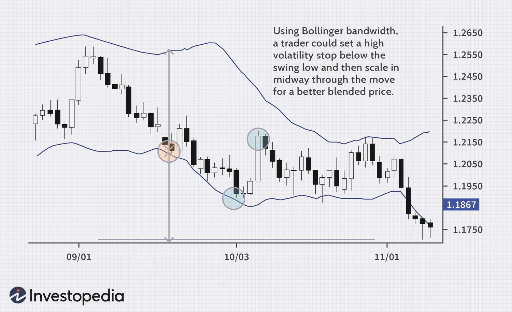

The world of forex trading encompasses a vast and intricate system that presents numerous opportunities for profit. Recognized as the largest financial market globally, forex trading involves transactions exceeding trillions of dollars each day. Traders, banks, financial institutions, and corporations actively participate in this dynamic market, contributing to its liquidity and volatility.

Gaining success in forex trading is contingent not only on possessing market knowledge but also on implementing effective money management strategies. Money management serves as a protective shield for traders' capital, enhancing the potential for profitable outcomes while mitigating risks. Such strategies are crucial given the market's inherent unpredictability.



In recent years, algorithmic trading, known as algo trading, has gained popularity within the forex market. This approach employs computer programs designed to execute trades based on predefined criteria, enabling traders to identify profitable opportunities swiftly. The integration of technology into trading practices has revolutionized how strategies are devised and executed.

This article investigates the interplay between forex trading, money management, and algorithmic trading. It explores how these elements can be synthesized to optimize trading performance and reduce risk exposure. Through systematic planning and technological integration, traders can better navigate the complex terrain of forex trading, enhancing their potential for sustained success.

## Table of Contents

## Understanding Forex Trading

Forex trading involves buying and selling currencies with the primary aim of making a profit from the fluctuations in exchange rates. As the most extensive financial market globally, the forex market records a daily trading volume that runs into trillions of dollars, surpassing other markets such as equities and commodities. This immense liquidity provides traders with numerous opportunities, as well as challenges, given the market's rapid and dynamic nature.

### Key Players in the Forex Market

The [forex](/wiki/forex-system) market comprises several key participants that influence its operations and price actions. These include:

- **Banks and Financial Institutions**: Major global banks trade significant volumes in the forex market, facilitating currency transactions on behalf of clients and engaging in proprietary trading.

- **Corporations**: International businesses engage in forex trading to manage currency risk associated with their global operations and transactions.

- **Retail Traders**: Individuals also participate in the forex market, often using online platforms. They may trade for speculative reasons, to hedge other investments, or to gain exposure to different currencies.

- **Central Banks and Governments**: These entities may intervene in the forex market to stabilize or devalue their currency, affecting overall market sentiment and movement.

### Trading Strategies

Forex trading strategies are diverse, catering to different trader types, time horizons, and market conditions. Some common strategies include:

- **Day Trading**: This strategy involves opening and closing positions within a single trading day, capitalizing on short-term price movements. Day traders often rely on technical analysis and chart patterns to guide their decisions.

- **Swing Trading**: Traders hold positions for several days to benefit from medium-term market movements. Swing trading often combines technical and fundamental analysis.

- **Carry Trade**: This strategy involves borrowing in a currency with a low-interest rate and investing in one with a higher rate, aiming to profit from the interest rate differential.

- **Long-term Investing**: Investors might hold positions for weeks, months, or even years, typically relying on fundamental analysis to assess the long-term prospects and economic situations of different countries.

### Importance of Forex Fundamentals

Understanding the fundamental principles of forex trading is essential for anyone looking to navigate this complex market successfully. Key elements of forex fundamentals include:

- **Exchange Rates**: The price of one currency in terms of another, influenced by factors such as interest rates, economic data, political stability, and market sentiment.

- **Leverage and Margin**: Forex trading often involves leverage, allowing traders to control larger positions with a smaller amount of capital. However, high leverage also increases the risk of significant losses.

- **Market Hours**: The forex market operates 24 hours a day, five days a week, allowing traders in different time zones to participate, providing flexibility and continuous trading opportunities.

In summary, forex trading's success hinges on understanding market dynamics and employing suitable strategies. Knowledge of the market's fundamental aspects is crucial for making informed decisions and navigating the complexities of currency trading.

## Importance of Money Management in Forex

Money management is crucial in forex trading as it plays a pivotal role in safeguarding capital and maximizing potential returns. Essential strategies involve setting risk limits and crafting approaches to manage losses actively. These strategies help ensure that one loss does not wipe out an entire trading account, providing a buffer against the volatile nature of the forex market.

A fundamental component of money management is position sizing. Position sizing determines the amount of capital to be risked in a single trade, based on the trader's risk tolerance and account size. A common rule is to risk only a small percentage of the trading account on any single trade, often between 1% and 3%. This approach minimizes the impact of individual losses on the overall portfolio, allowing traders to survive streaks of losing trades.

A practical way to implement position sizing is through the formula:

$$
\text{Position Size} = \frac{\text{Risk Per Trade}}{\text{Stop Loss in Pips} \times \text{Value Per Pip}}
$$

Here, the risk per trade is a predefined percentage of the total account balance. The stop-loss value in pips and the value per pip are based on currency pair specifics and current market prices.

Stop-loss orders are vital tools used to limit potential losses by automatically closing a trade when the price reaches a predetermined level. By setting stop-loss limits, traders can prevent emotions from interfering with trading decisions, adhering to rational strategies rather than being swayed by hope or fear.

Moreover, maintaining a balanced portfolio across different currency pairs can reduce risk by diversifying exposure. A balanced approach minimizes the impact of adverse movements in any single currency or market event, smoothing the performance curve and [volatility](/wiki/volatility-trading-strategies) of returns.

Effective money management supports emotional detachment, enabling traders to make more rational decisions and stay disciplined. Emotional control is imperative in coping with market swings and maintaining a consistent strategy regardless of losing streaks or winning streaks.

Neglecting money management can markedly increase the risk of substantial losses, even when employing a profitable trading strategy. A lack of proper money management amplifies the effects of emotional and impulsive decisions, which can be detrimental. Ultimately, integrating sound money management principles is indispensable for sustaining long-term success in the forex market.

 to Algorithmic Trading

Algorithmic trading, often referred to as algo trading, leverages computer programs to execute trades based on predefined criteria. This automated approach involves the use of algorithms, which are complex mathematical models and instructions, to analyze market data and perform trading activities without direct human intervention. This section explores how such algorithms function and their advantages to traders, both novice and experienced.

Algo trading systems are designed to scan and process large volumes of market data with remarkable speed. They can quickly identify profitable trading opportunities by detecting market trends, patterns, and anomalies that might be imperceptible to human traders. For example, an algorithm can evaluate historical price data and use statistical analysis to predict future price movements, enabling traders to capitalize on fleeting market opportunities.

Moreover, the systematic nature of [algorithmic trading](/wiki/algorithmic-trading) reduces the likelihood of human error and limits the influence of emotion in trading decisions. Emotions like fear and greed can significantly impact manual trading decisions, often leading to suboptimal outcomes. By using predefined rules and logic, algo trading ensures that transactions are carried out based on objective criteria rather than subjective feelings.

There are several types of trading algorithms commonly used in the forex market:

1. **Trend-following strategies**: These algos aim to profit by identifying and following market trends. They typically use indicators like moving averages to determine the market's direction and execute trades accordingly.

2. **Arbitrage algorithms**: These take advantage of price discrepancies between different markets or instruments. They simultaneously buy and sell related securities to exploit differences in their prices to earn a profit with minimal risk.

3. **Market-making algorithms**: These provide liquidity to the market by continuously quoting buy and sell prices for a particular asset. They earn profits through the bid-ask spread.

Algorithmic trading can be particularly beneficial for beginners, allowing them to utilize advanced strategies without needing deep expertise in market analysis. For experienced traders, algos provide the ability to execute trades more efficiently, managing multiple strategies simultaneously and improving overall trading performance. 

In conclusion, algo trading offers significant advantages in terms of speed and efficiency, providing traders with the tools to effectively navigate the forex market. By incorporating algorithmic strategies, traders can enhance their trading capabilities and potentially achieve more consistent and profitable outcomes.

## Integrating Algo Trading and Money Management

Integrating algorithmic trading with effective money management strategies is a crucial step for enhancing trading performance in the forex market. Algorithmic trading, which employs computer programs to execute trades based on predefined criteria, provides a systematic method for managing trades. This systematic approach can be effectively paired with sound money management principles to optimize results and minimize risks.

One of the primary advantages of using algorithms in trading is the ability to programmatically enforce money management rules. This includes setting risk limits, stop-loss levels, and position sizing according to predetermined strategies. By doing so, traders can ensure that these critical parameters are consistently applied across trades, thereby maintaining discipline and avoiding the pitfalls of emotional trading, which is a common reason for failure in non-algorithmic approaches.

Automated systems excel in maintaining consistency, as they do not suffer from psychological biases that may lead to irrational decision-making. For instance, by employing algorithms, traders can ensure that stop-loss orders are executed precisely without second-guessing or hesitation, which is often observed in manual trading scenarios. 

The ability to backtest algorithms using historical data is another significant benefit. Backtesting involves running the algorithm through a set of historical data to evaluate its performance, which helps in refining the strategy and making data-driven decisions. By analyzing past data, traders can identify potential weaknesses in their strategies and make necessary adjustments before deploying them in live markets. This process can help in obtaining a quantitative measure of a strategy's effectiveness and probability of success.

Successful integration of algorithmic trading and money management demands a thorough understanding of both the technical aspects of algorithm development and the dynamic nature of the forex market. Parameters such as volatility, [liquidity](/wiki/liquidity-risk-premium), and market trends must be monitored and incorporated into the algorithms to ensure that they respond appropriately to different market conditions.

A simple Python example might involve using a [backtesting](/wiki/backtesting) library, such as Backtrader, to assess a strategy that incorporates these elements:

```python
import backtrader as bt

class MyStrategy(bt.Strategy):
    params = (('stop_loss', 0.02), ('take_profit', 0.05))

    def __init__(self):
        self.buy_signal = bt.indicators.CrossOver(self.data)

    def next(self):
        if not self.position:
            if self.buy_signal > 0:
                self.buy(size=self.adjust_position_size())
        else:
            if self.data.close[0] < self.buy_price * (1.0 - self.p.stop_loss):
                self.sell()
            elif self.data.close[0] > self.buy_price * (1.0 + self.p.take_profit):
                self.sell()

    def adjust_position_size(self):
        # Calculate position size based on risk management
        account_risk = 0.01  # Risk 1% of account
        position_size = (self.broker.getcash() * account_risk) / (self.data.close[0] * self.p.stop_loss)
        return position_size

cerebro = bt.Cerebro()
cerebro.addstrategy(MyStrategy)
# Add data, set cash, add analyzers etc.
cerebro.run()
```

In this example, the strategy's logic includes a stop-loss and a take-profit level, and dynamically adjusts the position size according to the trader's risk appetite. By automating these processes through code, traders can eliminate human errors and align their strategies with their overall money management goals.

For traders seeking to merge algorithmic techniques with robust money management practices, this blend offers a promising avenue to enhance performance and manage risk effectively in the forex landscape.

## Benefits and Risks of Using Algo Trading in Forex

Algorithmic trading, commonly referred to as algo trading, provides several advantages for forex traders due to its ability to process large amounts of data quickly and execute trades at speeds beyond human capability. This method allows for continuous trading operations on a 24/5 basis, aligning with the non-stop nature of the forex market. By leveraging algo trading, traders can exploit fleeting market inefficiencies and opportunities that might elude manual trading methods.

**Advantages of Algo Trading:**

1. **Speed and Precision:** Algorithms can execute trades instantly based on predefined criteria, allowing traders to react to market changes in milliseconds. This precision is crucial in the fast-paced forex environment where exchange rates can fluctuate rapidly.

2. **Reduced Emotional Bias:** By automating trading decisions, algo trading minimizes the impact of human emotions like fear and greed, which can often lead to irrational trading choices.

3. **Efficiency and Consistency:** Algorithms ensure consistent application of trading strategies without the need for human intervention. This efficiency allows strategies to be executed flawlessly, without any deviations that might be caused by manual errors.

4. **Ability to Handle Complex Strategies:** Algorithms are capable of processing various indicators and executing complex trading strategies that would be difficult to manage manually. For instance, they can integrate multiple technical analysis metrics and execute trades based on a combination of signals.

5. **Market Timing and Opportunities:** With the ability to trade continuously, algorithms can capture short-lived trading opportunities that may occur outside typical working hours or during periods of high volatility.

**Risks Associated with Algo Trading:**

1. **System Errors and Failures:** The reliance on technology introduces the risk of system errors or failures which can lead to significant trading losses. It is essential for traders to have backup systems and fail-safes in place to mitigate these risks.

2. **Continuous Monitoring Required:** Although algo trading minimizes the need for manual intervention, systems still require constant monitoring to ensure they are functioning correctly and adapting to changing market conditions.

3. **Complexity and Technical Expertise:** Developing effective trading algorithms requires a high level of technical proficiency in both programming and financial markets. Traders may need to collaborate with or become proficient in coding languages, such as Python, to maintain and update their systems.

4. **Market Dependency and Testing:** Algorithms should be thoroughly backtested using historical data to ensure they perform well under various market conditions. However, past performance is not indicative of future results, and constant adaptation and analysis are necessary.

5. **Risk of Over-Optimization:** There's a danger of over-optimizing algorithms to perform exceptionally well with historical data, which might lead to poor performance under real market conditions due to changes in market dynamics or unforeseen events.

To mitigate these risks, traders implementing algo trading should ensure robust system testing, establish multiple levels of safety checks, diversify their strategies to spread risk, and commit to ongoing market analysis and system upgrades. By understanding these benefits and challenges, traders can make informed decisions about incorporating algorithmic trading into their forex strategies, optimizing performance while effectively managing risks.

## Conclusion

Forex trading presents a lucrative opportunity for those equipped with the right combination of skills, strategies, and technology. At the core of a successful trading regimen is effective money management, ensuring that traders protect their capital while maximizing potential returns. This involves setting clear risk limits, employing strategies such as position sizing and stop-loss orders, and maintaining a diversified portfolio. Proper money management allows traders to remain emotionally detached from the unpredictability of the market, enabling rational decision-making.

Algorithmic trading (algo trading) complements this by offering a systematic approach to executing trades. By leveraging computer programs to make trade decisions based on predefined criteria, algo trading enhances trading efficiency and helps manage complex strategies. The ability of algorithms to rapidly analyze vast data sets and execute trades mitigates human errors and the emotional biases that often affect trading outcomes.

Integrating algorithmic trading with effective money management strategies allows traders to optimize performance and manage risks more efficiently. Algorithms can be programmed to enforce specific money management rules, ensuring these strategies are applied consistently, thereby reducing the risks associated with emotional decision-making. Furthermore, the capability to backtest algorithms using historical data enables refinement of trading strategies and enhances decision-making processes.

The ever-evolving nature of the forex market necessitates continuous learning and adaptation. Traders must stay updated with market trends and technological advancements to maintain a competitive edge. This involves not only understanding market dynamics but also possessing the technical expertise required to develop and maintain trading algorithms. By balancing these elements, traders can unlock the full potential of forex trading while mitigating associated risks, paving the way for long-term success.

## References & Further Reading

[1]: Bergstra, J., Bardenet, R., Bengio, Y., & Kégl, B. (2011). ["Algorithms for Hyper-Parameter Optimization."](https://dl.acm.org/doi/10.5555/2986459.2986743) Advances in Neural Information Processing Systems 24.

[2]: ["Advances in Financial Machine Learning"](https://www.amazon.com/Advances-Financial-Machine-Learning-Marcos/dp/1119482089) by Marcos Lopez de Prado

[3]: ["Evidence-Based Technical Analysis: Applying the Scientific Method and Statistical Inference to Trading Signals"](https://www.amazon.com/Evidence-Based-Technical-Analysis-Scientific-Statistical/dp/0470008741) by David Aronson

[4]: ["Machine Learning for Algorithmic Trading"](https://github.com/stefan-jansen/machine-learning-for-trading) by Stefan Jansen

[5]: ["Quantitative Trading: How to Build Your Own Algorithmic Trading Business"](https://www.amazon.com/Quantitative-Trading-Build-Algorithmic-Business-ebook/dp/B097QGPVND) by Ernest P. Chan