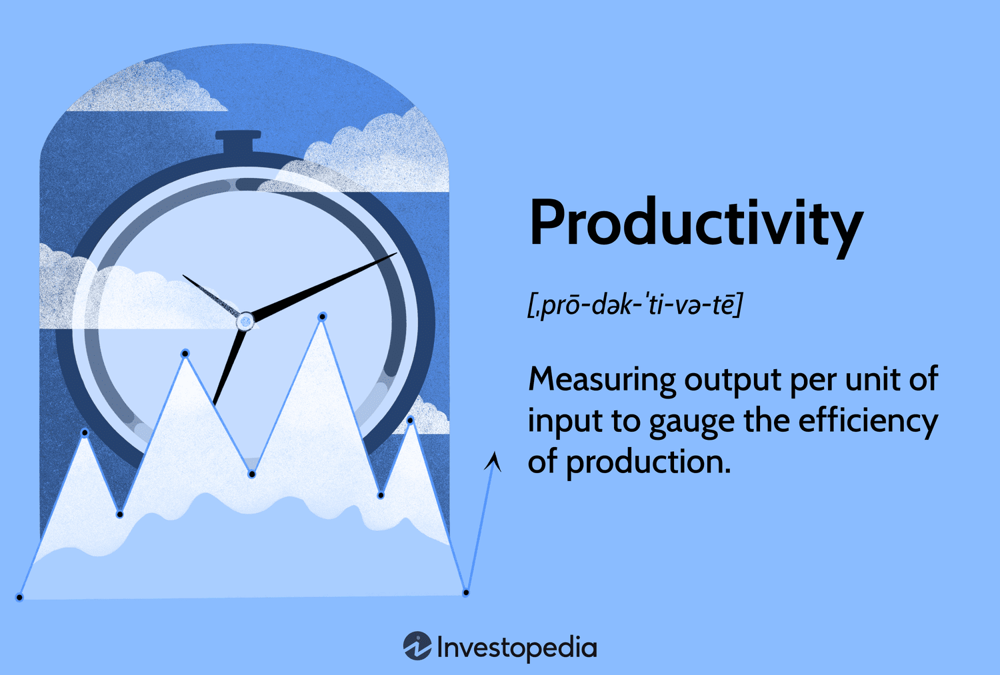

Economic efficiency is a fundamental concept in modern economies, signifying the optimal allocation and utilization of resources to maximize output and meet the needs of society. It plays a crucial role in enhancing an economy's overall performance, leading to increased wealth and improved living standards. Economic efficiency is often measured by the balance achieved between inputs and outputs, ensuring that resources are not wasted and that the maximum possible satisfaction is derived from available goods and services.

Productivity, a related concept, is defined as the ratio of outputs produced to inputs used in the production process. It is a key determinant of economic efficiency, as improvements in productivity can lead to higher output without requiring additional resources. Enhanced productivity contributes to economic growth by expanding the capacity of an economy to produce goods and services, ultimately leading to increased competitiveness and prosperity.



In recent years, algorithmic trading has emerged as a transformative force in financial markets. This form of trading relies on complex algorithms and mathematical models to execute trades at high speeds, often without human intervention. Algorithmic trading has significantly impacted market dynamics by improving liquidity and reducing transaction costs, thereby enhancing market efficiency. As algorithmic trading continues to gain prominence, its implications for economic productivity and efficiency warrant careful exploration.

The interconnectedness of economic efficiency, productivity, and algorithmic trading represents the focal theme of this article. By examining these relationships, we aim to provide insights into how technological advancements, particularly in financial markets, are shaping modern economies.

The following sections of this article will delve into the nuances of each concept. We begin with an exploration of economic efficiency and its various dimensions, followed by a detailed analysis of productivity and its role in driving economic performance. The article will then address the mechanics of algorithmic trading and its influence on market efficiency and economic productivity. In the concluding sections, we analyze the synergies and potential conflicts among these elements, highlighting the implications for policy and economic strategies in the future.

## Table of Contents

## Understanding Economic Efficiency

Economic efficiency refers to the optimal use of resources to achieve the desired outcomes with minimal waste. It is measured by comparing the outputs produced with the resources used, aiming to maximize output while minimizing input costs. Economic efficiency is critical for modern economies as it ensures that resources are used where they are most valued, which in turn enhances overall welfare and economic growth.

Resource allocation is paramount to achieving economic efficiency. It involves distributing resources across various sectors or activities to meet consumer preferences and demands effectively. When resources are allocated efficiently, goods and services are produced at levels and costs that reflect their true value and cost to society.

Economic efficiency can be categorized into three main types: allocative, productive, and dynamic.

1. **Allocative Efficiency**: This type occurs when resources are allocated in a way that maximizes the net benefit to society, considering that every resource used has an opportunity cost. It aligns with the concept of Pareto efficiency, where no one can be made better off without making someone else worse off. Mathematically, it is represented where the price of a good or service equals the marginal cost of production.

2. **Productive Efficiency**: This is achieved when goods are produced at the lowest possible cost. Any waste of resources, such as labor or capital, is minimized. Productive efficiency occurs on the production possibility frontier, which represents the maximum feasible output of an economy given its resource constraints.

3. **Dynamic Efficiency**: This involves the optimal allocation of resources over time, allowing for innovation and technological advancement. It ensures that industries can adapt and evolve with changes in technology and consumer preferences, sustaining growth and competitiveness.

Technological advances play a significant role in enhancing economic efficiency. Innovations in technology can lead to new methods of production that reduce costs and resources needed per unit of output. For instance, automation and digitalization have revolutionized many industries by optimizing resource use and reducing human error.

### Case Studies: Real-world Examples of Economic Efficiency Improvements

1. **Agriculture**: The Green Revolution introduced high-yielding crop varieties and advanced agricultural techniques. This transformation led to significant increases in food production with lower resource input per unit, showcasing both productive and dynamic efficiency.

2. **Manufacturing**: The adoption of lean manufacturing processes, such as those pioneered by Toyota, reduced waste and optimized the use of labor and materials, achieving higher output per input and thus enhancing productive efficiency.

3. **Energy Sector**: The shift towards renewable energy sources, supported by technological advancements in solar and wind energy, has improved allocative efficiency by reducing dependence on fossil fuels and enhancing sustainability.

In conclusion, economic efficiency in its various forms is crucial for maximizing resource utilization and achieving sustainable economic growth. Technological advancements and effective resource allocation are pivotal to attaining these efficiencies, as demonstrated by improvements in agriculture, manufacturing, and energy sectors. These real-world examples highlight the importance and impact of efficient resource use in driving economic progress.

## Productivity: Key Driver of Economic Efficiency

Productivity is a fundamental concept in economic analysis, representing the efficiency with which inputs are converted into outputs. It is commonly measured as the ratio of output to input in the production process, often expressed as productivity = output/input. This concept plays a critical role in determining the overall economic capacity of a nation, sector, or organization.

Increased productivity leads to enhanced economic outputs by enabling more goods and services to be produced with the same or fewer resources. This improvement not only boosts profitability for businesses but also contributes to the broader economic growth by increasing the gross domestic product (GDP) of a country. Enhanced productivity allows economies to expand without placing additional strain on resources, promoting sustainable growth. For instance, a technological breakthrough that enhances automation in manufacturing can lead to substantial productivity gains, lowering production costs and facilitating higher output levels.

The relationship between productivity improvements and economic growth is well-established, with productivity serving as a key driver. Economic growth can be partly attributed to increases in productivity, which occurs when inputs, such as labor and capital, are utilized more efficiently. Indeed, the Solow-Swan growth model highlights productivity as a critical component of economic growth, often summarized in the formula ΔY/Y = ΔA/A + α(ΔK/K) + (1-α)(ΔL/L), where Y represents output, A denotes total [factor](/wiki/factor-investing) productivity, K is capital, L is labor, and α is the capital share of output.

Several factors influence productivity, including technological advancements and human capital. Technology, as a transformative force, can streamline processes, improve accuracy, and minimize waste, leading to productivity enhancements. On the other hand, human capital refers to the skills, knowledge, and experience possessed by individuals, which can enhance their efficiency and effectiveness in the workplace. Investments in education and training are vital for cultivating human capital, thereby boosting productivity.

Maintaining high productivity levels poses significant challenges across diverse industries. Rapid technological changes require constant adaptation, and businesses must continuously upskill their workforce to remain competitive. Additionally, industries face resource constraints, regulatory obstacles, and varying market demands, all of which can hinder productivity. For example, the manufacturing sector may struggle with rising material costs, while the services industry might grapple with talent shortages.

In conclusion, productivity remains a key driver of economic efficiency. It not only enhances output and economic growth but also helps industries and economies navigate the complex landscape of technological and human capital challenges. Understanding and improving productivity metrics are essential for achieving sustainable economic development.

## Algorithmic Trading and Market Efficiency

Algorithmic trading involves the use of computer programs to execute trades in financial markets at speeds and frequencies that are impossible for human traders. These algorithms use pre-defined criteria such as timing, price, and [volume](/wiki/volume-trading-strategy) to make trading decisions. The widespread adoption of [algorithmic trading](/wiki/algorithmic-trading) strategies has emerged as a significant factor influencing market efficiency and [liquidity](/wiki/liquidity-risk-premium).

### Mechanisms of Algorithmic Trading

Algorithmic trading employs a set of rules and mathematical models to automate the trading process. The underlying algorithms can analyze large datasets to identify trading opportunities based on historical data and market trends. These algorithms often utilize high-frequency trading ([HFT](/wiki/high-frequency-trading-strategies)) and statistical [arbitrage](/wiki/arbitrage) to exploit short-term market fluctuations. A simple trading algorithm could be represented in Python as follows:

```python
def simple_moving_average(data, window_size):
    return data.rolling(window=window_size).mean()

def trading_signal(data, short_window, long_window):
    short_ma = simple_moving_average(data, short_window)
    long_ma = simple_moving_average(data, long_window)
    signal = (short_ma > long_ma).astype(int)
    return signal
```

### Impact on Market Efficiency and Liquidity

Algorithmic trading can enhance market efficiency by narrowing bid-ask spreads and increasing trading volumes, thereby improving market liquidity. The algorithms are capable of executing trades with high precision, which reduces the cost of trading and leads to more efficient price discovery. Research suggests that markets with active algorithmic trading experience lower transaction costs and reduced [volatility](/wiki/volatility-trading-strategies) [1].

### Pros and Cons

The advantages of algorithmic trading include increased speed and accuracy of trade execution, along with the elimination of human error. Algorithms can operate 24/7 without fatigue, allowing markets to react swiftly to new information.

However, the reliance on complex algorithms can lead to systemic risks, such as the famous 2010 "Flash Crash," where rapid automated sell-offs resulted in a severe market downturn. Furthermore, algorithmic trading can lead to unfair market advantages if the algorithms employed exploit loopholes or asymmetrical information [2].

### Examples of Influence in Large Markets

Algorithmic trading has a profound effect on large financial markets, including the New York Stock Exchange (NYSE) and NASDAQ. In these markets, a significant portion of trading volume is now attributed to algorithmic trading. For instance, HFT firms utilize co-location services to place their servers close to exchange systems to gain millisecond advantages in trade execution.

### Future of Algorithmic Trading in Relation to Economic Policies

The future of algorithmic trading is intertwined with economic policies and regulatory frameworks. As algorithms increase their market influence, regulators are tasked with ensuring market stability and fairness. Increasing scrutiny over trading algorithms aims to mitigate risks associated with market manipulation and systemic failures.

In conclusion, algorithmic trading presents both opportunities and challenges for market efficiency and economic productivity. The development and regulation of trading algorithms will play a crucial role in shaping the financial landscape, balancing the need for innovation with the imperative of maintaining market integrity.

### References

[1] Hendershott, T., Jones, C. M., & Menkveld, A. J. (2011). Does Algorithmic Trading Improve Liquidity? The Journal of Finance, 66(1), 1-33.

[2] Kirilenko, A. A., Kyle, A. S., Samadi, M., & Tuzun, T. (2017). The Flash Crash: High-Frequency Trading in an Electronic Market. Journal of Finance, 72(3), 967-998.

## The Interconnection: Economic Efficiency, Productivity, and Algorithmic Trading

Algorithmic trading, a method of executing orders using pre-programmed trading instructions, significantly contributes to economic efficiency by optimizing resource allocation in financial markets. This form of trading uses complex algorithms that process vast amounts of data to identify trading opportunities, thereby enhancing both the speed and accuracy of transactions. By automating decision-making processes, algorithmic trading reduces transaction costs and minimizes human biases and errors, ultimately leading to more efficient market operations.

Technology serves as a critical bridge between productivity and market effectiveness. Advanced computing power, data analytics, and [machine learning](/wiki/machine-learning) are pivotal in developing sophisticated trading algorithms. These technologies enable the rapid analysis of extensive datasets, identifying patterns and correlations that would be impractical for human traders. This increased capability allows for more informed decision-making, fostering a more productive and efficient market environment. As a result, markets become more responsive to new information, promoting the rapid adjustment of prices to reflect underlying asset values accurately.

Despite these advantages, there are synergies and conflicts associated with algorithmic trading strategies and market stability. On the one hand, algorithmic trading facilitates higher liquidity and tighter bid-ask spreads, which are essential components of market stability. However, it can also lead to increased volatility, primarily when driven by high-frequency trading (HFT) strategies. The 2010 Flash Crash exemplifies such a conflict, where the use of algorithmic strategies led to a sudden, severe market drop within minutes, highlighting potential systemic risks.

The implications of data analysis in algorithmic trading extend beyond market efficiency to broader economic outcomes. Algorithmic trading relies heavily on big data analysis to make predictions and execute trades. This reliance necessitates robust data management systems and raises concerns about data privacy and security. The ability to process and interpret large datasets can provide a competitive advantage, but it also poses challenges related to data accuracy and the potential for market manipulation.

Regulatory and ethical considerations are crucial in evaluating the impact of algorithmic trading on productivity. Regulators face the challenge of balancing innovation with the need to maintain fair and orderly markets. This involves setting rules around the use of algorithms to prevent unfair trading practices and ensure market transparency. Ethical considerations also emerge regarding the potential for algorithms to exacerbate inequalities by favoring entities with advanced technological capabilities. Thus, regulatory frameworks must evolve to address these issues, promoting a financial ecosystem that supports sustainable economic growth.

## Conclusion

In examining the interconnectedness of economic efficiency, productivity, and algorithmic trading, several key insights emerge. Economic efficiency serves as a cornerstone for modern economies, emphasizing the optimal allocation of resources to maximize output. This principle is closely linked with productivity, which drives economic efficiency by enhancing output using existing resources effectively. This relationship underpins economic growth, as increased productivity translates to improved economic outputs.

Algorithmic trading plays a significant role in this context by facilitating precise and swift market transactions, thereby contributing to market efficiency and liquidity. The automation of trading processes allows for the efficient distribution and allocation of financial resources, directly impacting economic productivity. However, this technological advancement also introduces complexities, including potential market volatility and ethical concerns, that require careful consideration.

Looking ahead, the integration of economic efficiency, productivity, and algorithmic trading holds promise for the enhancement of economic performance. Advanced algorithms and technology can further streamline market operations, but this development calls for a balanced approach. Stakeholders, including policymakers, financial institutions, and technologists, must collaborate to ensure that the advancement of algorithmic trading supports sustainable growth without undermining market stability or ethical standards. Monitoring these interactions and implementing robust safeguards is vital to harnessing the full potential of these dynamics.

In conclusion, the synergy between economic efficiency, productivity enhancements, and algorithmic trading offers substantial benefits for economic systems. However, the path forward requires vigilance and cooperation to mitigate risks while leveraging technology to strengthen market strategies. As stakeholders navigate these strategies, a judicious integration of technology will be crucial for fostering robust and equitable economic advancement.

## References & Further Reading

[1]: Hendershott, T., Jones, C. M., & Menkveld, A. J. (2011). ["Does Algorithmic Trading Improve Liquidity?"](https://onlinelibrary.wiley.com/doi/full/10.1111/j.1540-6261.2010.01624.x) The Journal of Finance, 66(1), 1-33.

[2]: Kirilenko, A. A., Kyle, A. S., Samadi, M., & Tuzun, T. (2017). ["The Flash Crash: High-Frequency Trading in an Electronic Market."](https://onlinelibrary.wiley.com/doi/abs/10.1111/jofi.12498) Journal of Finance, 72(3), 967-998.

[3]: Solow, R. M. (1957). ["Technical Change and the Aggregate Production Function."](http://piketty.pse.ens.fr/files/Solow1957.pdf) The Review of Economics and Statistics, 39(3), 312-320.

[4]: Lopez de Prado, M. (2018). ["Advances in Financial Machine Learning."](https://www.amazon.com/Advances-Financial-Machine-Learning-Marcos/dp/1119482089) John Wiley & Sons.

[5]: Chan, E. (2009). ["Quantitative Trading: How to Build Your Own Algorithmic Trading Business."](https://github.com/ftvision/quant_trading_echan_book) John Wiley & Sons.