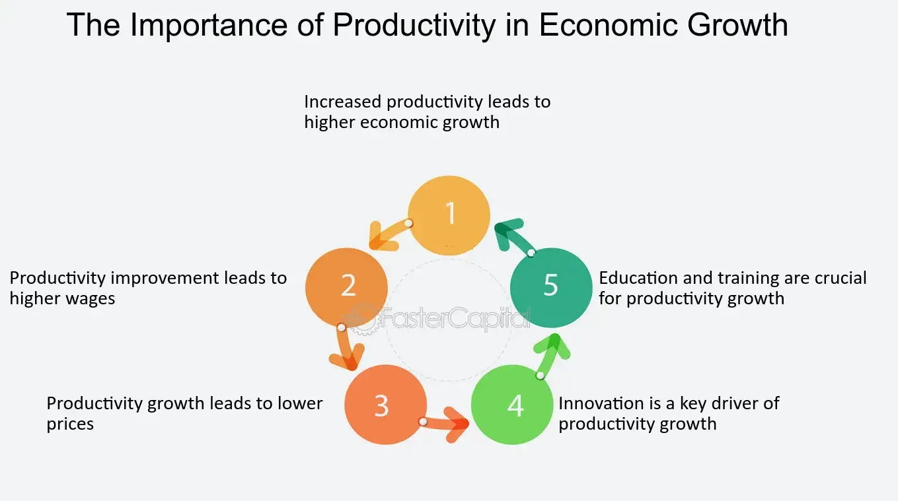

## Table of Contents

## What is productivity in the context of economics?

Productivity in economics is about how well people, businesses, or a whole country can turn their resources into goods and services. It's like a measure of how efficiently work is done. If a worker can make more things in less time, their productivity is high. This is important because higher productivity can lead to more profits for businesses and better living standards for people.

Economists often look at productivity to understand how an economy is doing. They might compare productivity between different countries or over time to see if things are improving. Things like better technology, more skilled workers, and good management can boost productivity. When productivity goes up, it can help the economy grow, create more jobs, and make life better for everyone.

## Why is productivity important for economic growth?

Productivity is really important for economic growth because it helps an economy produce more with the same amount of resources. When workers or machines can make more stuff in less time, the whole economy can grow faster. This means more goods and services are available, which can lead to higher profits for companies and more money for people to spend. When people have more money, they can buy more things, which keeps the economy moving and growing.

Higher productivity also helps create new jobs. When businesses can produce more efficiently, they often need more workers to keep up with demand. This can lower unemployment and make the economy stronger. Plus, when productivity goes up, it can lead to higher wages because workers are creating more value. This extra money in people's pockets can be spent on more goods and services, which helps the economy grow even more. So, productivity is like the engine that drives economic growth.

## How is productivity measured in economics?

Productivity in economics is usually measured by looking at how much stuff is made compared to the resources used. The most common way to do this is by calculating something called "labor productivity." This is done by dividing the total output of goods and services by the total number of hours worked. For example, if a factory makes 1000 widgets in a week and the workers put in 500 hours, the labor productivity would be 2 widgets per hour. This helps economists see how efficiently workers are turning their time into products.

Another way to measure productivity is by looking at "total [factor](/wiki/factor-investing) productivity" (TFP). This method tries to take into account all the resources used, not just labor. It looks at how well an economy uses things like machines, technology, and raw materials to make goods and services. TFP is a bit trickier to calculate because it involves a lot of different factors, but it gives a more complete picture of how productive an economy is. Both labor productivity and TFP are important for understanding how well an economy is doing and how it can grow in the future.

## What are the main factors that influence productivity?

There are several main factors that affect how productive people and businesses are. One big factor is technology. When new machines or computer programs come out, they can help workers do their jobs faster and better. Another important factor is the skills of the workers. If people are well-trained and know a lot about their job, they can work more efficiently. Also, how a business is run can make a big difference. Good managers can organize work in a way that makes everyone more productive.

Another factor is the amount of capital, like machines and tools, that a business has. More and better equipment can help workers produce more. The health and well-being of workers also matter. If people are healthy and happy, they can work better. Finally, the overall economic environment plays a role. Things like government policies, trade, and competition can either help or hurt productivity. All these factors work together to determine how much an economy can produce with its resources.

## Can you explain the relationship between productivity and standard of living?

Productivity and standard of living are closely connected. When productivity goes up, it means that people and businesses can make more things with the same amount of work. This can lead to more money for everyone. Businesses can make more profit, and they might pay their workers more. When workers earn more, they can buy more things they need and want, like better food, nicer homes, and fun activities. This makes their lives better and improves their standard of living.

Higher productivity also helps the whole country. When a country's productivity is high, it can make more goods and services, which can make the economy grow. A growing economy can create more jobs and lower unemployment. This means more people can work and earn money, which helps everyone's standard of living. So, when productivity goes up, it can lead to a better life for everyone in the country.

## How does productivity affect employment and wages?

When productivity goes up, it can help create more jobs. If businesses can make more things faster and cheaper, they might need more workers to keep up with the demand for their products. This means more people can find work, which is good for the economy. When more people are working, it can lower unemployment, and that's a big deal because it means more families have money coming in.

Higher productivity can also lead to higher wages. When workers can make more stuff in less time, they are creating more value for their company. Businesses might decide to share some of that extra value with their workers by paying them more. When workers earn more money, they can spend more on things they need and want, which helps the economy grow even more. So, productivity is important for both creating jobs and making sure workers get paid well.

## What role does technology play in enhancing productivity?

Technology plays a big role in making people and businesses more productive. When new machines or software come out, they can help workers do their jobs faster and better. For example, a factory might get a new robot that can build cars much quicker than people can. Or, a company might use a new computer program that helps them keep track of their work and find ways to do it more efficiently. These tools can save time and reduce mistakes, which means more stuff can be made with less effort.

Technology also helps by making it easier for people to work together and share information. With the internet and tools like video calls and online documents, people can work from anywhere and still be part of a team. This means businesses can hire the best people no matter where they live, and workers can do their jobs without having to travel to an office. All these things add up to make the whole economy more productive, which is good for everyone.

## How do government policies impact productivity?

Government policies can have a big impact on how productive a country is. One way is through laws and regulations that make it easier or harder for businesses to operate. For example, if the government makes rules that help businesses use new technology or train their workers, productivity can go up. But if the rules are too strict or hard to follow, businesses might have a harder time getting things done, which can lower productivity.

Another way government policies affect productivity is through spending on things like education and infrastructure. When the government invests in good schools and training programs, people can learn more and become better at their jobs. Also, if the government builds good roads, bridges, and internet systems, it can help businesses move their goods and communicate more easily. All these things can make the whole economy more productive and help everyone live better lives.

## What are the differences between labor productivity and total factor productivity?

Labor productivity is a way to measure how much stuff workers can make in a certain amount of time. It's calculated by dividing the total output of goods and services by the total number of hours worked. For example, if a factory makes 1000 widgets in a week and the workers put in 500 hours, the labor productivity would be 2 widgets per hour. This measure is easy to understand and use because it focuses just on how well workers are using their time. It's really helpful for looking at how efficient workers are and can show if businesses are getting better at making things.

Total factor productivity, or TFP, is a bit more complicated. It tries to measure how well an economy is using all its resources, not just labor. This includes things like machines, technology, and raw materials. TFP looks at how these different factors work together to make goods and services. It's harder to calculate because it involves a lot of different things, but it gives a more complete picture of how productive an economy is. TFP can help economists understand why some countries or businesses are better at turning their resources into valuable stuff, even if they use the same amount of labor.

## How can businesses improve their productivity?

Businesses can improve their productivity by using new technology. When they get new machines or software, it can help workers do their jobs faster and better. For example, a factory might use robots to make things quicker than people can. Or, a company might use a computer program to keep track of work and find ways to do it more efficiently. These tools can save time and reduce mistakes, which means more stuff can be made with less effort. Technology also helps people work together better, even if they are far away. With the internet and tools like video calls and online documents, workers can do their jobs from anywhere and still be part of a team.

Another way businesses can boost productivity is by training their workers. When people learn new skills and know more about their jobs, they can work more efficiently. Businesses can offer classes or workshops to help workers get better at what they do. Good management also plays a big role. Managers can organize work in a way that makes everyone more productive. They can set clear goals, give feedback, and make sure everyone knows what they need to do. When workers are well-trained and well-managed, they can make more things in less time, which helps the business grow.

## What are the global trends in productivity and their economic implications?

Global productivity trends show that some countries are getting better at making things faster and more efficiently, while others are not improving as much. In places like the United States and many European countries, productivity has been growing slowly over the last few years. This slow growth can make it harder for these countries to increase their wealth and improve living standards. On the other hand, countries like China and India have seen big jumps in productivity, thanks to new technology and more people moving to cities where they can work in factories and offices. These improvements help their economies grow quickly and create more jobs.

The economic implications of these trends are important. When productivity grows slowly in developed countries, it can lead to slower economic growth and less money for people to spend. This can make it harder for these countries to keep up with their debts and provide good services like healthcare and education. In contrast, fast productivity growth in developing countries can help them catch up with richer nations. It can create more jobs and higher wages, which means more people can afford a better life. Overall, global productivity trends show how some parts of the world are moving forward while others are struggling to keep up.

## How can economists accurately forecast future productivity changes?

Economists use different tools and data to try to guess how productivity will change in the future. They look at things like how fast technology is improving, how much money businesses are spending on new machines, and how well workers are being trained. They also pay attention to government policies that might help or hurt productivity. By studying these things, economists can make educated guesses about whether productivity will go up or down. But it's not easy because the future can be hard to predict, and unexpected things can happen.

Even though it's tough, economists use models and past data to help them make better forecasts. They might look at how productivity has changed in the past and use that information to guess what might happen next. They also keep an eye on global trends, like how other countries are doing with their productivity. By putting all this information together, economists can give businesses and governments a good idea of what to expect. This helps them plan for the future and make decisions that can help improve productivity.

## References & Further Reading

[1]: Hendershott, T., Jones, C. M., & Menkveld, A. J. (2011). ["Does Algorithmic Trading Improve Liquidity?"](https://onlinelibrary.wiley.com/doi/full/10.1111/j.1540-6261.2010.01624.x) The Journal of Finance, 66(1), 1-33.

[2]: Kirilenko, A. A., Kyle, A. S., Samadi, M., & Tuzun, T. (2017). ["The Flash Crash: High-Frequency Trading in an Electronic Market."](https://onlinelibrary.wiley.com/doi/abs/10.1111/jofi.12498) Journal of Finance, 72(3), 967-998.

[3]: Solow, R. M. (1957). ["Technical Change and the Aggregate Production Function."](http://piketty.pse.ens.fr/files/Solow1957.pdf) The Review of Economics and Statistics, 39(3), 312-320.

[4]: Lopez de Prado, M. (2018). ["Advances in Financial Machine Learning."](https://www.amazon.com/Advances-Financial-Machine-Learning-Marcos/dp/1119482089) John Wiley & Sons.

[5]: Chan, E. (2009). ["Quantitative Trading: How to Build Your Own Algorithmic Trading Business."](https://github.com/ftvision/quant_trading_echan_book) John Wiley & Sons.