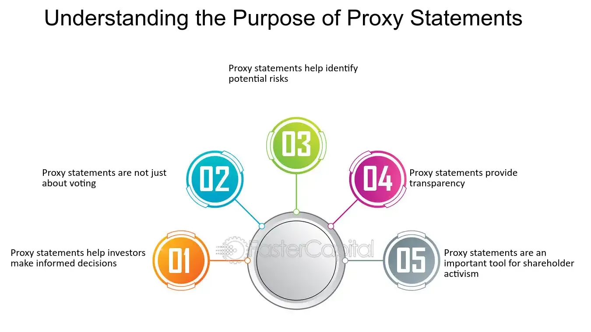

## Table of Contents

## What is a proxy statement?

A proxy statement is a document that companies send to their shareholders before a big meeting. It tells shareholders important things they need to know to make good choices about voting on company matters. These matters can include electing new board members or approving big company decisions.

The proxy statement includes details about the meeting, like when and where it will happen. It also gives information about the people who want to be on the board and any big proposals that shareholders will vote on. This helps shareholders decide how they want to vote, even if they can't go to the meeting themselves.

## Why are proxy statements important for investors?

Proxy statements are important for investors because they give a lot of useful information about the company. They tell investors about who is running the company and what big decisions are coming up. This helps investors understand if the company is being managed well and if it's making good choices for the future. By reading the proxy statement, investors can see if the people in charge are doing a good job and if they should keep them or choose new ones.

Also, proxy statements help investors make smart voting decisions. Since many investors can't go to the big meetings, the proxy statement lets them vote without being there. It explains what each vote is about in a clear way, so investors know what they're voting for. This is really important because the votes can affect the company's direction and how much money investors might make. So, proxy statements are a key tool for investors to stay informed and have a say in the company's future.

## How can investors access proxy statements?

Investors can access proxy statements easily through a few different ways. One common way is by visiting the company's website. Most companies have a section called "Investor Relations" where they post important documents like proxy statements. Investors just need to find this section and look for the latest proxy statement.

Another way to get proxy statements is through the Securities and Exchange Commission's (SEC) website. The SEC has a database called EDGAR where all public companies have to file their documents. Investors can search for the company they're interested in and find the proxy statement there. It's free and easy to use.

Lastly, if investors own shares through a brokerage account, they might get the proxy statement mailed to them or receive it electronically. Brokerage firms often send out these documents to their clients before big meetings. So, investors should check their mail or email for these important documents.

## What kind of information is included in a proxy statement?

A proxy statement includes a lot of important information that helps shareholders understand what's going on with the company. It tells you about the big meeting, like when and where it will happen. It also gives details about the people who want to be on the board of directors. You can learn about their backgrounds, how much they get paid, and if they own any shares in the company. This helps you decide if they are good choices to help run the company.

The proxy statement also explains any big proposals that shareholders will vote on. These could be things like approving a merger with another company or changing how the company is run. It tells you what the proposals are about and why the company thinks they are a good idea. This way, you can make smart choices about how to vote, even if you can't go to the meeting yourself.

## How often are proxy statements issued?

Proxy statements are usually issued once a year. This happens before the company's annual meeting, where shareholders vote on important things like who should be on the board of directors and other big decisions. The timing can change a bit from one company to another, but it's always around the time of the annual meeting.

Sometimes, there might be extra proxy statements if there's a special meeting. This can happen if the company needs to vote on something important that can't wait until the next annual meeting. But most of the time, you'll see one proxy statement each year.

## What is the difference between a proxy statement and an annual report?

A proxy statement and an annual report are both important documents that companies send to their shareholders, but they serve different purposes. A proxy statement is all about the big meeting where shareholders vote on important things like who should be on the board of directors and other big decisions. It gives you details about the meeting, the people running for the board, and what you'll be voting on. This helps you make smart choices about how to vote, even if you can't go to the meeting yourself.

On the other hand, an annual report is like a yearly check-up on the company. It tells you how the company did over the past year, including its financial performance, what it achieved, and what challenges it faced. The annual report also talks about the company's plans for the future. While the proxy statement is focused on voting and governance, the annual report gives you a broader picture of the company's health and direction.

## How can proxy statements influence investment decisions?

Proxy statements can help investors make better choices about their money. They give a lot of information about who is running the company and what big decisions are coming up. By reading the proxy statement, investors can see if the people in charge are doing a good job and if they should keep them or choose new ones. This can affect how well the company does in the future, which is important for deciding whether to buy, sell, or hold onto the company's stock.

Also, proxy statements tell investors about big proposals that the company wants to vote on. These could be things like merging with another company or changing how the company is run. If investors think these proposals are good ideas, they might want to keep their money in the company. But if they think the proposals are bad, they might decide to sell their shares. So, proxy statements give investors the information they need to make smart choices about their investments.

## What are some key sections of a proxy statement that investors should focus on?

Investors should pay close attention to the section about the board of directors in a proxy statement. This part tells you about the people who want to be on the board, including their backgrounds, how much they get paid, and if they own any shares in the company. It's important because the board makes big decisions that can affect the company's future. If the board members seem experienced and have the company's best interests at heart, that's a good sign for investors.

Another key section is the one about voting proposals. This part explains what big decisions shareholders will vote on, like mergers or changes in how the company is run. It's helpful because it gives you the reasons behind these proposals and how they might affect the company. By understanding these proposals, investors can decide if they agree with the company's direction and make smart voting choices.

Lastly, the executive compensation section is also crucial. It shows how much the top people in the company are paid and how their pay is decided. This can tell investors if the company is rewarding its leaders fairly and if their pay is tied to the company's performance. If the pay seems too high or not linked to good results, it might make investors think twice about keeping their money in the company.

## How do proxy statements relate to corporate governance?

Proxy statements are really important for corporate governance because they help shareholders understand how the company is being run. They tell you about the people who want to be on the board of directors and what big decisions the company is making. This helps shareholders decide if they think the company is being managed well and if they should vote to keep the current leaders or choose new ones. By giving shareholders this information, proxy statements make sure that the people in charge are doing a good job and that the company is being run in a fair and open way.

Also, proxy statements show how much the top people in the company are paid and how their pay is decided. This is a big part of corporate governance because it helps shareholders see if the company is rewarding its leaders fairly. If the pay seems too high or not linked to good results, shareholders might vote to change things. So, proxy statements are a key tool for making sure that the company's leaders are doing what's best for the company and its shareholders.

## Can proxy statements reveal potential red flags about a company?

Yes, proxy statements can show some warning signs about a company. If you see that the board members don't have much experience or if they own very few shares, it might mean they're not as committed to making the company do well. Also, if the proxy statement says the company wants to vote on something that seems risky or not well thought out, that could be a red flag. It's important to read these parts carefully to see if the company is making good choices.

Another thing to look out for is how much the top people in the company are paid. If their pay is really high but the company isn't doing well, that could be a problem. It might mean the company isn't rewarding its leaders in a fair way. By looking at these details in the proxy statement, investors can spot potential issues and decide if they want to keep their money in the company or not.

## How have recent regulatory changes affected the content and importance of proxy statements?

Recent changes in rules have made proxy statements even more important and detailed. For example, new laws now say that companies have to tell shareholders more about how much the top people get paid and why. This is called "say on pay," and it lets shareholders vote on if they think the pay is fair. Also, companies have to explain more about how they choose board members and what skills they need. This helps shareholders see if the board is made up of the right people to help the company do well.

These changes make proxy statements a better tool for investors. They give more clear information about how the company is run and who is in charge. This helps investors make smarter choices about voting and whether to keep their money in the company. Because of these new rules, proxy statements are now a key way for shareholders to keep an eye on the company and make sure it's being managed in a fair and open way.

## What advanced analysis techniques can investors use on proxy statement data?

Investors can use a few smart ways to look at the information in proxy statements. One way is to compare the pay of the top people in the company with how well the company is doing. If the pay is high but the company isn't doing well, that could be a problem. Another way is to look at the skills and experience of the board members. If they don't have the right skills or if they own very few shares, it might mean they're not as committed to making the company do well. By doing this kind of analysis, investors can see if the company is being run in a good way.

Another technique is to use data from proxy statements to see how the company is doing over time. Investors can look at past proxy statements to see if the board members have changed a lot or if the company's pay plans have been the same. This can help them understand if the company is making good choices and if it's moving in the right direction. By putting all this information together, investors can get a better picture of the company and make smarter decisions about their money.

## References & Further Reading

[1]: ["The Proxy Statement as a Catalyst for Corporate Governance Improvement"](https://library.fiveable.me/key-terms/corporate-governance/proxy-statements) by Lisa Fairfax in the Journal of Business & Technology Law

[2]: Larcker, D. F., & Tayan, B. (2011). ["Corporate Governance Matters: A Closer Look at Organizational Choices and Their Consequences"](https://archive.org/details/corporategoverna0000larc) by David F. Larcker and Brian Tayan

[3]: ["Algorithmic Trading and DMA: An Introduction to Direct Access Trading Strategies"](https://www.amazon.com/Algorithmic-Trading-DMA-introduction-strategies/dp/0956399207) by Barry Johnson

[4]: Beaver, W. H. (1968). ["The Information Content of Annual Earnings Announcements"](https://www.jstor.org/stable/2490070?casa_token=XxvCftA7XgwAAAAA%3AK5T3s6voyfkPYDN-OHEBvlbrVvmbXw8XgvitWjnz2RcxROfr_eZAcXTYimQVht_5o0H6_gi85xT3SqKSG6rp8G3RJealgak93XmVeQNm4AtmXH_8ypCQ) in the Journal of Accounting Research

[5]: ["Corporate Governance and Firm Performance: The Role of Transparency & Disclosure"](https://www.semanticscholar.org/paper/Corporate-Governance-and-Firm-Performance%3A-The-Role-Zaman-Arslan/1d38ce87ded616b185a0663b7029247298f02c1e) by Ossama Mohammed Boublos in the Law and Economics Yearly Review