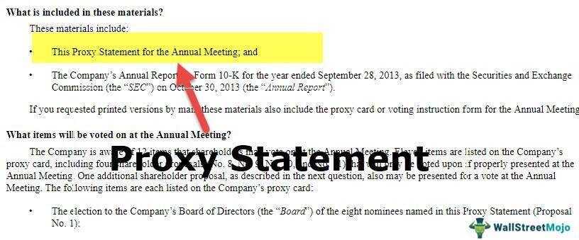

Investing is a multifaceted discipline that requires a solid understanding of various financial documents and market strategies. Among the resources available to investors, proxy statements stand out as a critical yet often overlooked tool for making informed decisions. These documents, mandated by regulatory bodies, provide insights into corporate governance and financial health that are crucial for evaluating company performance.

This article emphasizes the significance of proxy statements in the broader context of financial analysis and algorithmic trading. By examining these areas, investors can gain a comprehensive understanding of how different elements interact to enhance investment outcomes. As algorithmic trading grows in prominence, recognizing the value of data sources like proxy statements becomes increasingly important for refining investment strategies. Such insights allow investors to anticipate corporate actions and adjust their trading tactics accordingly, thus improving strategic decision-making in the dynamic financial environment.



## Table of Contents

## What is a Proxy Statement?

A proxy statement is a mandatory document that public corporations are required to distribute to their shareholders in preparation for shareholder meetings. The primary purpose of this document is to ensure that shareholders have all the necessary information to make informed voting decisions on various corporate matters.

Proxy statements encompass a wide array of topics, including but not limited to executive compensation, company policy changes, shareholder proposals, and the election of board members. These documents serve as a window into a corporation's strategic and operational direction, providing insights that are essential for assessing the company's future trajectory and governance practices.

For example, proxy statements typically detail executive salaries, stock options, and other forms of remuneration, which can reveal a lot about corporate priorities and the alignment of management's interests with those of the shareholders. This information is crucial in evaluating whether company executives are incentivized to prioritize shareholder value.

Proxy statements also discuss significant proposals that can affect the company’s policies. These may include plans for mergers and acquisitions, changes in company bylaws, or other major strategic moves. By examining these proposals, investors can better understand the company's future plans and potential impacts on its financial health and stock performance.

Furthermore, proxy statements are a vital source for understanding governance dynamics within a company. They often contain detailed biographies of board nominees, highlighting their qualifications, other board memberships, and past contributions. This information enables investors to critically assess the decision-making capabilities of those who will influence the company's strategic direction.

To ensure accessibility and transparency, proxy statements are publicly available through the Securities and Exchange Commission's (SEC) Electronic Data Gathering, Analysis, and Retrieval (EDGAR) database. This online repository allows investors to easily access current and past filings, providing a wealth of data for conducting thorough corporate analyses.

In summary, a proxy statement is a comprehensive document that plays a crucial role in the governance of a corporation by equipping shareholders with the necessary information to participate in critical decision-making processes. It combines strategic, operational, and governance insights, all of which are invaluable for any investor looking to understand a company’s overall standing and future prospects.

## Investor Insights from Proxy Statements

Proxy statements provide detailed information on management profiles, compensation structures, and potential conflicts of interest. This information is crucial for investors to assess whether the actions and priorities of a company's leadership align with the interests of its shareholders.

Understanding executive compensation and insider ownership can indicate whether management's interests align with shareholder interests. Executive compensation often includes salaries, bonuses, stock options, and other incentives. By analyzing these elements, investors can determine if the compensation policies are designed to promote long-term company growth and align with shareholder value. For example, if a significant portion of management's compensation is tied to the company's stock performance, it suggests a direct alignment with shareholder interests.

Investors can gauge a company’s commitment to transparency and ethical governance through disclosed auditor changes and related-party transactions. Auditor changes might signal issues with financial reporting or conflicts of interest. Regular changes in auditors could indicate potential problems in financial practices or disagreements over accounting methods. Meanwhile, related-party transactions—dealings between the company and its management or related entities—must be scrutinized to ensure they are conducted openly and at arm's length, preventing embedded conflicts of interest that could disadvantage shareholders.

Analysis of senior-level loans and litigation risks also helps assess the financial health and risk factors affecting a company. Loans to company executives can indicate potential [liquidity](/wiki/liquidity-risk-premium) issues or misaligned incentives if not properly structured. Conversely, litigation risks provide insight into potential legal challenges the company faces, which can have significant financial impacts. Investors examine these aspects to better estimate the overall risk profile of the company and to anticipate any potential financial liabilities that may affect future profitability. 

Overall, investors leveraging information from proxy statements gain deeper insights into a company's governance structure, management's alignment with shareholder value, and potential risks facing the organization. This analysis is instrumental in making informed investment decisions, ensuring alignment between corporate actions and investor interests.

## Financial Analysis for Informed Investing

Financial statements, including balance sheets and cash flow statements, are essential documents that complement proxy statements to provide a comprehensive view of a company's financial health. Balance sheets offer a snapshot of a company’s assets, liabilities, and shareholders' equity at a specific point in time, helping investors assess the company's financial stability and operational capabilities.

A comprehensive financial analysis involves evaluating these documents to understand various financial aspects such as profitability, liquidity, and operational efficiency. Profitability is typically assessed using income statements, which display revenues, expenses, and profits over a specific period. Common profitability metrics include gross profit margin, operating margin, and net profit margin. These metrics help investors evaluate how well a company converts sales into profits, offering insights into its operational efficiency.

Liquidity analysis focuses on a company's ability to meet short-term obligations, crucial for assessing financial health. Key liquidity ratios include the current ratio, quick ratio, and working capital. These metrics indicate whether a company has enough resources to cover its immediate liabilities, ensuring operational continuity.

Operational efficiency indicates how effectively a company utilizes its resources to generate revenue. Common metrics include return on assets (ROA) and return on equity (ROE), which measure the efficiency of resource use relative to profit generation. Higher ratios suggest that a company effectively manages its assets and equity to achieve profitable operations.

Investors rely on these analyses to make informed, data-driven investment decisions. In volatile markets, where financial conditions can change rapidly, being able to quickly assess a company's financial health becomes essential. For example, an investor might monitor a company’s debt-to-equity ratio to evaluate its financial leverage and risk level in uncertain economic times. A high debt-to-equity ratio could indicate higher risk, as the company is potentially over-leveraged, whereas a lower ratio generally suggests a more stable financial position.

To automate parts of this analysis, investors might use software to process and interpret financial data. Here is a simple Python code snippet to calculate common financial ratios:

```python
def calculate_ratios(balance_sheet, income_statement):
    ratios = {}
    ratios['current_ratio'] = balance_sheet['current_assets'] / balance_sheet['current_liabilities']
    ratios['quick_ratio'] = (balance_sheet['current_assets'] - balance_sheet['inventory']) / balance_sheet['current_liabilities']
    ratios['net_profit_margin'] = income_statement['net_income'] / income_statement['revenue']
    ratios['return_on_assets'] = income_statement['net_income'] / balance_sheet['total_assets']
    ratios['return_on_equity'] = income_statement['net_income'] / balance_sheet['shareholders_equity']
    return ratios
```

This simple approach allows for the rapid assessment of a company's financial standing, empowering investors to respond swiftly to market changes. Adopting these comprehensive analysis strategies helps investors make informed decisions that align with their risk tolerance and investment goals, fostering successful financial outcomes.

## The Role of Algorithmic Trading

Algorithmic trading is a sophisticated trading technique that utilizes computer algorithms to automatically conduct trading orders based on predetermined parameters and inputs. This technology plays a crucial role in contemporary financial markets, allowing for the rapid execution of trades, far beyond the capability of human traders. At its core, [algorithmic trading](/wiki/algorithmic-trading) is designed to exploit market inefficiencies and capitalize on minor differences in pricing or sentiment information.

To enhance trading strategies, algorithms leverage both financial analysis and data from proxy statements. Algorithms can optimize strategies by analyzing historical price data alongside insights from proxy statements, which may include executive actions, strategic decisions, or corporate governance changes. By integrating this diverse set of data, algorithms can improve predictions of stock price movements and adjust trading parameters dynamically. For instance, if a proxy statement reveals a significant change in management or strategy, algorithms can adjust positions accordingly in anticipation of market reactions.

This method facilitates high-frequency trading ([HFT](/wiki/high-frequency-trading-strategies)), allowing algorithms to execute thousands of trades in fractions of a second. The speed and efficiency of algorithmic trading minimize the influence of human error, ensuring that decisions are based purely on data. High-frequency traders often use mathematical models and statistical techniques such as time series analysis, regression models, or [machine learning](/wiki/machine-learning) to analyze large datasets efficiently and develop predictive analytics.

For example, a simple moving average (SMA) strategy can be employed in Python as follows:

```python
import numpy as np
import pandas as pd

# Load historical stock data
data = pd.read_csv('historical_stock_data.csv')
prices = data['Close']

# Calculate short and long-term SMAs
short_window = 40
long_window = 100
signals = pd.DataFrame(index=data.index)
signals['signal'] = 0.0
signals['short_mavg'] = prices.rolling(window=short_window, min_periods=1, center=False).mean()
signals['long_mavg'] = prices.rolling(window=long_window, min_periods=1, center=False).mean()

# Create signals based on SMAs
signals['signal'][short_window:] = np.where(signals['short_mavg'][short_window:] > signals['long_mavg'][short_window:], 1.0, 0.0)
signals['positions'] = signals['signal'].diff()

# Print signals
print(signals)
```

The above code generates buy or sell signals when the short-term moving average crosses the long-term moving average. In practice, more complex algorithms can incorporate proxy statement data to better assess market sentiment and thus refine trading signals.

The integration of vast volumes of financial data also enables algorithms to make quicker and more informed decisions. Advanced machine learning models or even [deep learning](/wiki/deep-learning) networks could be used to parse textual data from proxy statements to extract sentiments or forecasts, which further empowers algorithmic trading strategies.

In summary, algorithmic trading automates the trading process, allowing traders to capitalize on market opportunities with precision and speed. The integration of diverse data sources, particularly from proxy statements, enhances the capacity of algorithms to make informed and strategic trading decisions.

## Integrating Proxy Statements in Algorithmic Models

Algorithmic models represent a sophisticated edge in trading by processing massive volumes of data to execute trades based on predefined criteria. One of their advanced capabilities is the extraction and utilization of detailed data from proxy statements, enhancing predictive accuracy and alignment with corporate management decisions.

Proxy statements contain pivotal information such as executive compensation trends and strategic initiatives, which algorithmic models can programmatically extract and integrate. For instance, changes in executive compensation can serve as signals of strategic shifts within a company. If the CEO receives a substantial salary increase tied to performance metrics, this might indicate expected growth or new projects. By incorporating these insights, algorithms can make more informed predictions about stock price movements and future business performance.

Furthermore, the inclusion of proxy data in algorithms can align trading decisions with imminent shareholder actions and corporate strategies. Suppose a proxy statement reveals an upcoming merger proposal requiring shareholder approval. In that case, an algorithm could adjust trading strategies to anticipate potential market reactions, thus refining its predictive capabilities. 

To illustrate, consider a Python implementation that automates the extraction and analysis of proxy statement data:

```python
import pandas as pd

def analyze_proxy_data(proxy_url):
    # Assuming we have a function to parse proxy statements into a DataFrame
    proxy_data = parse_proxy_statement(proxy_url)

    # Example of extracting executive compensation trends
    executive_compensation = proxy_data[proxy_data['Section'] == 'Executive Compensation']
    comp_trends = executive_compensation.groupby('Year').agg({'TotalCompensation': 'sum'})

    # Extract strategic initiatives from proxy data
    strategic_initiatives = proxy_data[proxy_data['Section'] == 'Strategic Initiatives']

    # Return analyzed data for algorithmic model integration
    return comp_trends, strategic_initiatives

comp_trends, strategic_initiatives = analyze_proxy_data('proxy_statement_url')
```

This integration facilitates adaptive trading strategies, allowing algorithms to consider both quantitative analyses from financial data and qualitative insights derived from corporate governance documents. By harmonizing these data sources, algorithms are better equipped to make timely and profitable trades. Such methodologies enhance the robustness of trading strategies by incorporating the strategic foresight contained within proxy statements, potentially leading to more accurate and profitable investment outcomes.

## Conclusion

Proxy statements are a vital component in the toolkit of informed investors, offering rich insights into corporate governance and financial health. Their detailed disclosures enable investors to identify the alignment between the interests of management and shareholders, scrutinize executive compensation, and evaluate internal governance practices. By providing transparency, proxy statements allow investors to assess the strategic direction and ethical grounding of a company, which are crucial for sound investment decisions.

When combined with robust financial analysis, these documents deepen an investor's understanding of a company’s overall health. Financial statements such as balance sheets and income statements complement proxy data by providing quantitative measures of an organization's ability to generate income, manage expenses, and sustain operations over time. Together, these resources form a comprehensive framework for evaluating potential investments, especially in volatile markets where informed decision-making is paramount.

In the era of data-driven investing, algorithmic trading models can amplify the insights gained from proxy statements. By leveraging granular data from these documents, algorithms can predict stock movements with increased precision, optimizing trading strategies to respond swiftly to corporate governance changes and strategic initiatives. This precision in prediction enables high-frequency trading and minimizes human error, converting vast datasets into actionable investment strategies.

Investors should not underestimate the power of integrating proxy statement analysis into their broader investment framework. The strategic utilization of these documents can provide a competitive edge, ensuring that investment decisions are not just data-driven but also contextually informed by the governance and strategic actions of companies. By marrying qualitative insights with quantitative analysis, investors can achieve a more nuanced understanding of potential investments, thereby enhancing the probability of achieving lucrative returns.

## Frequently Asked Questions

**Why are proxy statements important for investors?**

Proxy statements are essential for investors as they provide transparency into a company’s internal workings and governance policies. They serve as pivotal resources that inform shareholders about various important agendas at upcoming meetings, allowing them to make educated voting decisions. By revealing details about executive salaries, board member elections, and proposed changes to corporate bylaws, proxy statements enable investors to understand the strategic direction and priorities of the company. This information is crucial in evaluating whether a company's management strategies align with shareholder interests and long-term value creation.

**What specific information can be gathered from a proxy statement?**

A proxy statement offers extensive data, including:

1. **Executive Compensation**: Details on salaries, bonuses, stock options, and other remuneration forms received by company executives.
2. **Board Elections**: Information about the nominees for the board of directors, including their qualifications and independence.
3. **Corporate Governance Practices**: Policies on issues like board independence, diversity, and shareholder rights.
4. **Auditor Relationships**: Insights into financial audit arrangements, potential auditor changes, and fees paid for audit services.
5. **Related-party Transactions**: Details on transactions between the company and insiders, highlighting potential conflicts of interest.
6. **Risk Factors**: Identification of litigation risks, compliance matters, and other factors affecting the company’s operations.

**How does algorithmic trading utilize proxy statements?**

Algorithmic trading optimizes trading strategies by incorporating proxy statement data to create more dynamic and informed models. Algorithms analyze disclosed information such as executive compensation patterns and corporate governance changes to predict potential market movements. For example, significant shifts in executive pay could indicate upcoming strategic changes or performance outlooks that influence stock prices. By integrating these insights, algorithms can adapt trading strategies aligned with future shareholder decisions and market expectations, mitigating risks and maximizing opportunities. Python code snippets using libraries like pandas and scikit-learn can automate the retrieval and analysis of proxy statement data, providing actionable insights for trading algorithms.

**What potential risks should investors be aware of regarding proxy statements?**

Investors must recognize several risks associated with proxy statements:

1. **Complexity and Overload**: The dense, jargon-heavy nature of these documents can be overwhelming, leading to misinterpretation of crucial information.
2. **Bias**: Companies may present data in a favorable light, downplaying adverse aspects or emphasizing selected positive attributes.
3. **Timeliness**: The information may become outdated quickly, especially in fast-moving industries, affecting its usefulness for real-time investment decisions.
4. **Incomplete Picture**: Proxy statements are just one part of comprehensive financial analysis. Relying solely on them may overlook other facets of a company's performance or market conditions.

Investors should combine insights from proxy statements with other financial documents and market analyses to form a holistic view, thus mitigating potential risks associated with partial or skewed interpretations.

## References & Further Reading

[1]: ["The Proxy Statement as a Catalyst for Corporate Governance Improvement"](https://library.fiveable.me/key-terms/corporate-governance/proxy-statements) by Lisa Fairfax in the Journal of Business & Technology Law

[2]: Larcker, D. F., & Tayan, B. (2011). ["Corporate Governance Matters: A Closer Look at Organizational Choices and Their Consequences"](https://archive.org/details/corporategoverna0000larc) by David F. Larcker and Brian Tayan

[3]: ["Algorithmic Trading and DMA: An Introduction to Direct Access Trading Strategies"](https://www.amazon.com/Algorithmic-Trading-DMA-introduction-strategies/dp/0956399207) by Barry Johnson

[4]: Beaver, W. H. (1968). ["The Information Content of Annual Earnings Announcements"](https://www.jstor.org/stable/2490070?casa_token=XxvCftA7XgwAAAAA%3AK5T3s6voyfkPYDN-OHEBvlbrVvmbXw8XgvitWjnz2RcxROfr_eZAcXTYimQVht_5o0H6_gi85xT3SqKSG6rp8G3RJealgak93XmVeQNm4AtmXH_8ypCQ) in the Journal of Accounting Research

[5]: ["Corporate Governance and Firm Performance: The Role of Transparency & Disclosure"](https://www.semanticscholar.org/paper/Corporate-Governance-and-Firm-Performance%3A-The-Role-Zaman-Arslan/1d38ce87ded616b185a0663b7029247298f02c1e) by Ossama Mohammed Boublos in the Law and Economics Yearly Review