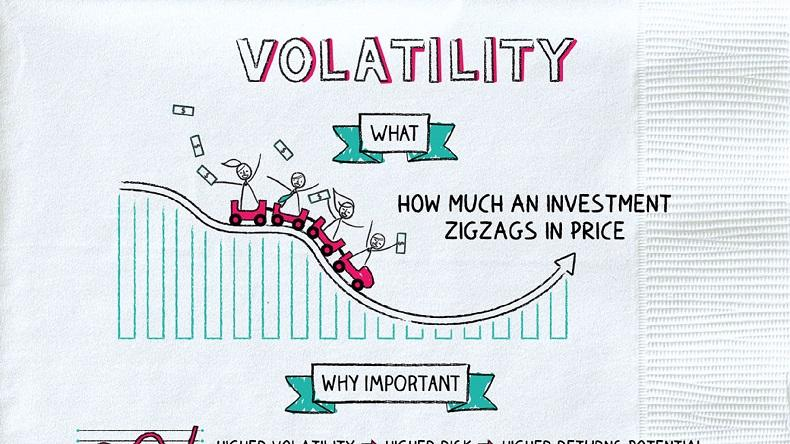

## Table of Contents

## What is volatility in the context of investing?

Volatility in investing means how much and how often the price of an investment goes up and down. If an investment's price changes a lot in a short time, it is called volatile. This can be scary for some investors because they might lose money quickly. But it can also be exciting for others who like to take risks, hoping to make more money when the price goes up.

Volatility is important because it shows how risky an investment might be. Stocks of smaller companies or new technology companies often have high volatility. This means their prices can change a lot. On the other hand, big, stable companies or government bonds usually have low volatility. Their prices don't change as much, so they are seen as safer investments. Understanding volatility helps investors decide if they want to take the risk for possibly higher rewards or if they prefer a safer, more predictable investment.

## How is volatility measured in financial markets?

Volatility in financial markets is often measured using a tool called standard deviation. This tool looks at how much the price of an investment, like a stock, changes over time. If the price jumps around a lot, the standard deviation will be high, showing that the investment is volatile. If the price stays pretty steady, the standard deviation will be low, meaning the investment is less volatile. Investors use this information to understand how risky an investment might be.

Another common way to measure volatility is by using something called the volatility index, or VIX. The VIX is often called the "fear gauge" because it measures how much people expect the market to move in the next 30 days. It's calculated using the prices of options, which are contracts that give investors the right to buy or sell an asset at a certain price. When the VIX is high, it means investors expect big price swings, and when it's low, they expect the market to be calmer. This helps investors decide when to buy or sell based on their comfort with risk.

## Why is volatility important for beginner investors to understand?

Volatility is important for beginner investors to understand because it helps them know how much risk they are taking with their money. When an investment goes up and down a lot, it's called volatile. If a beginner investor puts their money into something very volatile, they might see their money grow quickly, but they could also lose it just as fast. Knowing about volatility helps beginners pick investments that match how much risk they are okay with. If they don't like big surprises, they might choose less volatile investments, like big company stocks or bonds.

Understanding volatility also helps beginner investors make better decisions about when to buy or sell. If they see that the market is very volatile, they might decide to wait until things calm down before investing. Or, if they are okay with the risk, they might see it as a chance to buy when prices are low and sell when they go up. By learning about volatility, beginners can feel more confident and in control of their investments, instead of being scared by sudden changes in the market.

## What are the common misconceptions about volatility among investors?

One common misconception about volatility is that it always means an investment is bad or too risky. Some investors think that if a stock's price jumps around a lot, it must be a bad investment. But that's not always true. Volatility can actually be a good thing for investors who like to take risks and are looking for big rewards. For example, a new tech company's stock might be very volatile, but if the company does well, the stock price could go up a lot, making investors a lot of money.

Another misconception is that low volatility means an investment is safe. Some people think that if a stock's price doesn't change much, it's a safe bet. But even investments with low volatility can lose value, especially if something unexpected happens, like a big economic change or a company going bankrupt. It's important for investors to look at more than just volatility when deciding if an investment is safe. They should also think about the company's financial health, the overall market conditions, and their own comfort with risk.

## How does volatility affect investment returns?

Volatility can make investment returns go up and down a lot. When the price of an investment changes a lot, it can be good or bad for investors. If the price goes up quickly, investors can make more money. But if the price goes down fast, they can lose money just as fast. This is why some investors like to buy when prices are low and sell when they go up, hoping to make a profit from the big changes.

Volatility also affects how much risk investors are willing to take. Some people are okay with the ups and downs and see it as a chance to make more money. But others get scared by big price swings and might sell their investments at the wrong time, missing out on future gains. Understanding volatility helps investors pick investments that match their comfort with risk and their goals for making money.

## What role does volatility play in portfolio diversification?

Volatility plays a big role in portfolio diversification because it helps investors spread out their risk. When you have a mix of investments, some might go up while others go down. If you have some investments that are very volatile and others that are not, the ups and downs can balance each other out. This way, if one investment loses value because of big price swings, the others might stay steady or even go up, helping to protect your overall money.

Understanding the volatility of different investments also helps you pick the right mix for your portfolio. If you like taking risks, you might choose more volatile investments, hoping for bigger rewards. But if you want to play it safe, you might pick investments with less volatility. By mixing high and low volatility investments, you can create a portfolio that fits your comfort with risk and helps you reach your financial goals without putting all your eggs in one basket.

## How can investors use volatility to their advantage?

Investors can use volatility to their advantage by buying investments when prices are low and selling when they go up. When the market is very volatile, prices can drop a lot, which might scare some people. But if you believe in the long-term value of an investment, you can buy it at a lower price during these dips. Later, when the market calms down and prices go up, you can sell it for a profit. This strategy is called "buying low and selling high," and it works well in volatile markets.

Another way to use volatility to your advantage is by using options and other financial tools. Options let you bet on whether a stock's price will go up or down without actually owning the stock. If you think a stock will be very volatile, you can buy options that will make money if the stock price moves a lot in either direction. This can be a smart way to make money from big price swings, but it's important to understand the risks involved because you can also lose money if the stock doesn't move as expected.

## What are the different types of volatility and how do they impact investment strategies?

There are two main types of volatility that investors talk about: historical volatility and implied volatility. Historical volatility looks at how much an investment's price has moved up and down in the past. It helps investors understand how risky an investment has been. For example, if a stock's price has been jumping around a lot over the last year, it has high historical volatility. Investors might use this information to decide if they want to buy that stock or if it's too risky for them. On the other hand, if they see that a stock has been pretty steady, they might feel more comfortable investing in it because it has low historical volatility.

Implied volatility is a bit different because it looks at what investors think will happen in the future. It's often used with options, which are contracts that give you the right to buy or sell a stock at a certain price. When people think a stock's price will move a lot in the future, the implied volatility goes up. This can be good for investors who like to take risks because they can buy options and make money if the stock price moves a lot. But if investors think the stock will stay pretty steady, the implied volatility goes down. This might make some investors feel safer about buying the stock because they expect fewer surprises. Understanding both types of volatility can help investors pick the right strategies and investments for their goals and how much risk they are okay with.

## How can advanced tools like options and derivatives be used to manage volatility?

Advanced tools like options and derivatives can help investors manage volatility by allowing them to protect their investments from big price swings. Options give investors the right, but not the obligation, to buy or sell an asset at a set price before a certain date. If an investor thinks a stock might drop a lot, they can buy a put option to sell the stock at a higher price than the market might fall to. This way, even if the stock price goes down, the investor can still sell it at the higher price they set with the option, limiting their losses. On the other hand, if an investor thinks a stock will go up a lot, they can buy a call option to buy the stock at a lower price than the market might rise to, making a profit if the stock goes up.

Derivatives, like futures contracts, can also help manage volatility. Futures are agreements to buy or sell an asset at a future date for a price set today. If an investor is worried about a stock's price going down, they can sell a futures contract at today's price. If the stock price does drop, they can still sell it at the higher price they locked in with the futures contract. This helps them avoid big losses. By using options and derivatives, investors can create strategies that protect their money from the ups and downs of the market, giving them more control over their investments even when things get volatile.

## What historical examples illustrate the impact of volatility on markets?

One big example of volatility affecting the markets was the stock market crash of 1987, also known as Black Monday. On October 19, 1987, the stock market in the United States dropped a lot, losing about 22% of its value in just one day. This was a huge shock because it happened so fast. Many people got scared and sold their stocks, which made the prices drop even more. This event showed how quickly volatility can make the market go crazy and how important it is for investors to be ready for big changes.

Another example is the dot-com bubble that burst around 2000. During the late 1990s, a lot of new internet companies started, and their stock prices went way up because everyone was excited about the internet. But then, in 2000, people realized that many of these companies were not making money and their stock prices were too high. The market got very volatile, and the prices of these internet stocks dropped a lot. Many investors lost a lot of money because they were not ready for the big swings in the market. This shows how volatility can make things go up fast but also come crashing down.

## How do different asset classes respond to volatility, and what does this mean for asset allocation?

Different types of investments, or asset classes, react differently to volatility. Stocks, especially from smaller or newer companies, can be very volatile. Their prices can go up and down a lot, which means investors might see big gains or losses quickly. On the other hand, bonds, especially government bonds, are usually less volatile. Their prices don't change as much, so they are seen as safer investments. Real estate and commodities like gold can also be volatile but in different ways. Real estate prices might not change as fast as stocks, but they can still go up and down a lot over time. Gold is often seen as a safe place to put money during times of high volatility because its price can go up when other investments are going down.

Understanding how different asset classes respond to volatility helps investors decide how to spread their money, which is called asset allocation. If an investor wants to take more risk, they might put more money into stocks, hoping for bigger rewards. But if they want to play it safe, they might choose more bonds or real estate. By mixing different types of investments, investors can balance out the ups and downs of the market. For example, if stocks go down a lot, the bonds in the portfolio might stay steady or even go up a little, helping to protect the investor's money. This way, investors can create a plan that fits their comfort with risk and helps them reach their financial goals.

## What are the latest theories and models used by experts to predict and manage volatility?

Experts use different theories and models to predict and manage volatility. One popular model is the GARCH (Generalized Autoregressive Conditional Heteroskedasticity) model. This model looks at how volatility changes over time and helps predict future volatility based on past data. It's useful because it can show that big changes in prices often lead to more big changes. This helps investors get ready for when the market might get very volatile. Another theory is the Black-Scholes model, which is often used for pricing options. It uses math to figure out how much an option should cost based on the stock's price, how long until the option expires, and how much the stock's price is expected to move around.

Another approach experts use is the VIX (Volatility Index) model. The VIX measures how much investors expect the market to move in the next 30 days. It's called the "fear gauge" because it goes up when people are worried about big price swings. By watching the VIX, investors can see when the market might get more volatile and change their plans accordingly. Some experts also use machine learning to predict volatility. These models can look at a lot of data quickly and find patterns that humans might miss. They can help investors make better guesses about what might happen in the market and adjust their investments to manage risk better.

## What is Understanding Market Volatility?

Market volatility refers to the degree of variation in trading prices over a period of time, reflecting the uncertainty and dynamics inherent in financial markets. Typically, volatility is quantified using statistical measures such as standard deviation and the Volatility Index, commonly known as the VIX.

The standard deviation measures the amount of variation or [dispersion](/wiki/dispersion-trading) of a set of values. In financial markets, it is applied to the annual rate of return of an investment to analyze the asset's volatility. Mathematically, it is expressed as:

$$
\sigma = \sqrt{\frac{1}{N} \sum_{i=1}^{N} (R_i - \bar{R})^2}
$$

where $\sigma$ is the standard deviation, $N$ is the number of return periods, $R_i$ is the return for period $i$, and $\bar{R}$ is the average return.

The VIX, on the other hand, is often referred to as the "fear index" and is derived from the implied volatilities of options on the S&P 500 stock index. It provides an insight into the market's expectations of [volatility](/wiki/volatility-trading-strategies) over the coming 30 days. A higher VIX indicates a high level of expected market turbulence, whereas a lower VIX suggests stability.

Volatility is influenced by various factors. Economic indicators such as Gross Domestic Product (GDP), unemployment rates, and inflation can significantly affect market perceptions and, consequently, price movements. For instance, better-than-expected economic data could lead to increased confidence among investors, reducing volatility. Conversely, poor economic performance typically accentuates fear, leading to higher volatility.

Geopolitical events also play a crucial role. These include changes in political leadership, diplomatic tensions, and conflicts, which can cause sudden shifts in market sentiments and consequently trigger volatility. For example, unexpected election outcomes or escalating geopolitical conflicts may instill uncertainty, prompting sharp fluctuations in asset prices.

Market sentiment, influenced by investor perceptions and behaviors, can drastically impact volatility levels. During periods of euphoria or panic, market participants might act irrationally, leading to significant price swings. Behavioral finance explores how cognitive biases and emotions can amplify such movements, contributing to the prevalent volatility.

While market volatility often signals risks, presenting challenges to investors, it also indicates the potential for higher returns. In volatile markets, prices can deviate far from their intrinsic values, providing astute investors opportunities to acquire undervalued assets with the potential for significant appreciation when market conditions stabilize. Therefore, understanding market volatility is essential for investors aiming to navigate the complex and ever-changing financial landscape effectively.

## What is the role of investors in volatile markets?

Investors significantly influence financial markets, especially during volatile periods. Their actions can either stabilize or exacerbate market fluctuations, depending largely on their strategies and psychological responses to market conditions.

Long-term investors often perceive market volatility as an opportunity to purchase undervalued assets. This contrarian approach involves buying when others are selling, aiming to capitalize on rebounds when the market stabilizes. For instance, during market downturns, stock prices of fundamentally strong companies may drop below their intrinsic value, presenting a buying opportunity for patient investors willing to wait for a recovery. This strategy is based on the principle of mean reversion, where prices tend to move back to their historical average over time.

Portfolio diversification is another critical strategy employed by investors to mitigate risks associated with market volatility. By spreading investments across various asset classes, geographic regions, and industries, investors can reduce their exposure to any single financial instrument's adverse performance. The effectiveness of diversification can be mathematically represented by the reduction in portfolio variance, which is calculated as:

$$
\sigma^2_p = \sum_{i=1}^n w_i^2 \sigma^2_i + \sum_{i=1}^{n-1} \sum_{j=i+1}^n w_i w_j \rho_{ij} \sigma_i \sigma_j
$$

Here, $\sigma^2_p$ is the variance of the portfolio, $w_i$ and $w_j$ are the weights of the individual assets in the portfolio, $\sigma_i$ and $\sigma_j$ are their standard deviations, and $\rho_{ij}$ is the correlation coefficient between the returns of assets $i$ and $j$.

Behavioral finance explores how emotions and cognitive errors influence investor decisions, particularly during volatile periods. Psychological factors such as fear, overconfidence, and herd mentality can lead to irrational decision-making. For instance, fear of further losses may prompt panic selling, while overconfidence might encourage excessive risk-taking during a market rally. These behaviors can amplify market fluctuations, as collective investor actions can create feedback loops that drive prices away from their fundamental values. Understanding these dynamics allows investors to make more informed and objective decisions by recognizing and countering their biases.

In summary, the actions of investors play a pivotal role in influencing market stability during volatile periods. Strategies such as long-term investment, diversification, and the application of behavioral finance principles are essential tools for navigating these fluctuations effectively.

## References & Further Reading

[1]: Bergstra, J., Bardenet, R., Bengio, Y., & Kégl, B. (2011). ["Algorithms for Hyper-Parameter Optimization."](https://papers.nips.cc/paper/4443-algorithms-for-hyper-parameter-optimization) Advances in Neural Information Processing Systems 24.

[2]: ["Advances in Financial Machine Learning"](https://www.amazon.com/Advances-Financial-Machine-Learning-Marcos/dp/1119482089) by Marcos Lopez de Prado

[3]: ["Evidence-Based Technical Analysis: Applying the Scientific Method and Statistical Inference to Trading Signals"](https://www.amazon.com/Evidence-Based-Technical-Analysis-Scientific-Statistical/dp/0470008741) by David Aronson

[4]: ["Machine Learning for Algorithmic Trading"](https://github.com/stefan-jansen/machine-learning-for-trading) by Stefan Jansen

[5]: ["Quantitative Trading: How to Build Your Own Algorithmic Trading Business"](https://github.com/LucindaYa/quant-resources/blob/master/Quantitative%20Trading%20How%20to%20Build%20Your%20Own%20Algorithmic%20Trading%20Business.pdf) by Ernest P. Chan