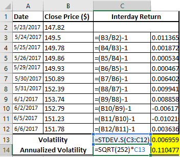

Financial markets are characterized by constant fluctuations in asset prices, a phenomenon known as volatility. This inherent volatility arises from a multitude of factors, including economic indicators, geopolitical developments, and market sentiment. For investors, such volatility presents both risks and opportunities; while it can lead to potential losses, it also offers avenues for maximizing returns through strategic trading practices.

Algorithmic trading, often referred to as 'algo trading,' has emerged as a powerful tool for navigating and exploiting market volatility. This method utilizes computer algorithms to execute trades with high precision and speed, thereby enabling investors to respond swiftly to market changes. Algo trading has become a significant force in modern financial markets, providing avenues for enhancing market efficiency and capturing price discrepancies.



The dynamics of market volatility and the implications for investors are profound. Understanding these fluctuations is critical for developing strategies that can mitigate risks and capitalize on favorable investment opportunities. With algorithmic trading playing a pivotal role, investors and market participants must be adept at leveraging technology to manage the ever-present challenges and prospects of volatility.

This article explores the complexities of market volatility, the transformative impact of algorithmic trading, and what these mean for contemporary investors. As financial markets continue to evolve, grasping the interplay between volatility and technological advancements is essential for effective and informed investment strategies.

## Table of Contents

## Understanding Market Volatility

Market volatility refers to the degree of variation in trading prices over a period of time, reflecting the uncertainty and dynamics inherent in financial markets. Typically, volatility is quantified using statistical measures such as standard deviation and the Volatility Index, commonly known as the VIX.

The standard deviation measures the amount of variation or [dispersion](/wiki/dispersion-trading) of a set of values. In financial markets, it is applied to the annual rate of return of an investment to analyze the asset's volatility. Mathematically, it is expressed as:

$$
\sigma = \sqrt{\frac{1}{N} \sum_{i=1}^{N} (R_i - \bar{R})^2}
$$

where $\sigma$ is the standard deviation, $N$ is the number of return periods, $R_i$ is the return for period $i$, and $\bar{R}$ is the average return.

The VIX, on the other hand, is often referred to as the "fear index" and is derived from the implied volatilities of options on the S&P 500 stock index. It provides an insight into the market's expectations of [volatility](/wiki/volatility-trading-strategies) over the coming 30 days. A higher VIX indicates a high level of expected market turbulence, whereas a lower VIX suggests stability.

Volatility is influenced by various factors. Economic indicators such as Gross Domestic Product (GDP), unemployment rates, and inflation can significantly affect market perceptions and, consequently, price movements. For instance, better-than-expected economic data could lead to increased confidence among investors, reducing volatility. Conversely, poor economic performance typically accentuates fear, leading to higher volatility.

Geopolitical events also play a crucial role. These include changes in political leadership, diplomatic tensions, and conflicts, which can cause sudden shifts in market sentiments and consequently trigger volatility. For example, unexpected election outcomes or escalating geopolitical conflicts may instill uncertainty, prompting sharp fluctuations in asset prices.

Market sentiment, influenced by investor perceptions and behaviors, can drastically impact volatility levels. During periods of euphoria or panic, market participants might act irrationally, leading to significant price swings. Behavioral finance explores how cognitive biases and emotions can amplify such movements, contributing to the prevalent volatility.

While market volatility often signals risks, presenting challenges to investors, it also indicates the potential for higher returns. In volatile markets, prices can deviate far from their intrinsic values, providing astute investors opportunities to acquire undervalued assets with the potential for significant appreciation when market conditions stabilize. Therefore, understanding market volatility is essential for investors aiming to navigate the complex and ever-changing financial landscape effectively.

## Factors Impacting Volatility

Market volatility is primarily affected by a variety of factors that influence asset prices. Fiscal and monetary policies play a significant role in driving market fluctuations. Fiscal policy, which includes government spending and taxation decisions, can impact economic growth and investor confidence, thereby affecting volatility. For instance, expansionary fiscal policies, characterized by increased government spending and tax cuts, can stimulate economic growth and potentially lead to reduced volatility in bearish markets. Conversely, contractionary fiscal policies might increase volatility during bullish periods as they dampen economic activity.

Monetary policy, particularly central bank actions like setting interest rates, directly affects market stability. An [interest rate](/wiki/interest-rate-trading-strategies) increase typically results in higher borrowing costs, which can slow down economic activity and trigger volatility in bond and equity markets. Conversely, lower interest rates generally lead to cheaper borrowing costs, encouraging investment and potential reductions in volatility.

External global events also have significant ramifications on market volatility. Political upheavals, such as elections or geopolitical tensions, can create uncertainty, causing rapid shifts in market perceptions and increasing volatility. Natural disasters similarly lead to sudden market disruptions, as they might affect supply chains, production capabilities, or consumer confidence, immediately influencing market behavior.

Technological advancements have transformed trading practices, significantly impacting market volatility's speed and frequency. Advancements in algorithmic and high-frequency trading enable large volumes of trades to be executed within fractions of a second. While these technologies enhance market [liquidity](/wiki/liquidity-risk-premium) and efficiency, they can also amplify volatility by potentially exaggerating price movements during periods of high trading activity. For instance, automated trading algorithms may trigger rapid buying or selling in response to market signals, contributing to abrupt price changes and increased volatility.

Understanding these factors is essential for stakeholders aiming to navigate and adapt to the inherent fluctuations within financial markets.

## Role of Investors in Volatile Markets

Investors significantly influence financial markets, especially during volatile periods. Their actions can either stabilize or exacerbate market fluctuations, depending largely on their strategies and psychological responses to market conditions.

Long-term investors often perceive market volatility as an opportunity to purchase undervalued assets. This contrarian approach involves buying when others are selling, aiming to capitalize on rebounds when the market stabilizes. For instance, during market downturns, stock prices of fundamentally strong companies may drop below their intrinsic value, presenting a buying opportunity for patient investors willing to wait for a recovery. This strategy is based on the principle of mean reversion, where prices tend to move back to their historical average over time.

Portfolio diversification is another critical strategy employed by investors to mitigate risks associated with market volatility. By spreading investments across various asset classes, geographic regions, and industries, investors can reduce their exposure to any single financial instrument's adverse performance. The effectiveness of diversification can be mathematically represented by the reduction in portfolio variance, which is calculated as:

$$
\sigma^2_p = \sum_{i=1}^n w_i^2 \sigma^2_i + \sum_{i=1}^{n-1} \sum_{j=i+1}^n w_i w_j \rho_{ij} \sigma_i \sigma_j
$$

Here, $\sigma^2_p$ is the variance of the portfolio, $w_i$ and $w_j$ are the weights of the individual assets in the portfolio, $\sigma_i$ and $\sigma_j$ are their standard deviations, and $\rho_{ij}$ is the correlation coefficient between the returns of assets $i$ and $j$.

Behavioral finance explores how emotions and cognitive errors influence investor decisions, particularly during volatile periods. Psychological factors such as fear, overconfidence, and herd mentality can lead to irrational decision-making. For instance, fear of further losses may prompt panic selling, while overconfidence might encourage excessive risk-taking during a market rally. These behaviors can amplify market fluctuations, as collective investor actions can create feedback loops that drive prices away from their fundamental values. Understanding these dynamics allows investors to make more informed and objective decisions by recognizing and countering their biases.

In summary, the actions of investors play a pivotal role in influencing market stability during volatile periods. Strategies such as long-term investment, diversification, and the application of behavioral finance principles are essential tools for navigating these fluctuations effectively.

## Algorithmic Trading and Volatility

Algorithmic trading employs advanced computer algorithms to execute trades with extraordinary speed and [volume](/wiki/volume-trading-strategy). At its core, this approach is geared towards exploiting market inefficiencies, specifically price discrepancies, to secure more favorable execution prices. These algorithmic systems can analyze vast amounts of market data in real-time, identifying and acting upon [arbitrage](/wiki/arbitrage) opportunities that may elude human traders due to their sheer complexity or the rapidity with which they manifest.

Among the various forms of [algorithmic trading](/wiki/algorithmic-trading), high-frequency trading ([HFT](/wiki/high-frequency-trading-strategies)) represents a prominent subset. HFT takes advantage of ultra-fast execution speeds, often completing trades in milliseconds or microseconds. This rapidity allows high-frequency traders to skim profits through methods like latency arbitrage and [market making](/wiki/market-making). However, the speed and frequency intrinsic to HFT have fueled debates regarding its potential to inadvertently heighten market volatility and destabilize financial systems, especially during periods of heightened market stress.

While algorithmic trading streamlines and enhances market efficiency by improving liquidity and reducing transaction costs, it can also inadvertently contribute to volatility. The cumulative effect of numerous algorithms executing trades simultaneously can sometimes lead to significant price swings. This phenomenon is often amplified in less liquid markets, where the impact of algorithmic trading on price movement is more pronounced.

One illustrative example is the "flash crash" event that transpired on May 6, 2010, when the Dow Jones Industrial Average plummeted nearly 1,000 points within minutes. Investigations revealed that a cascade of automated trading algorithms reacting to each other's trades significantly contributed to the event's severity, showcasing one of the algorithmic trading's potential risks to market stability.

Despite these risks, the algorithmic trading industry's emphasis on speed, precision, and data analysis remains a vital component of modern financial markets. Regulators have implemented measures to address the associated challenges, including setting stringent latency requirements and enhancing monitoring systems. As technology advances, the evolution of smart algorithms incorporating [artificial intelligence](/wiki/ai-artificial-intelligence) and [machine learning](/wiki/machine-learning) may provide more robust safeguards against unforeseen market shocks.

For those interested in experimenting with algorithmic trading, a basic Python implementation could involve utilizing libraries like `pandas` for data analysis, `numpy` for numerical computations, and `ccxt` for interaction with [cryptocurrency](/wiki/cryptocurrency) exchanges:

```python
import ccxt
import pandas as pd
import numpy as np

exchange = ccxt.binance()
markets = exchange.load_markets()
symbol = 'BTC/USDT'
ohlcv = exchange.fetch_ohlcv(symbol, timeframe='1m', limit=100)

df = pd.DataFrame(ohlcv, columns=['timestamp', 'open', 'high', 'low', 'close', 'volume'])
df['price_change'] = df['close'].pct_change()

# Simple moving average strategy
df['short_ma'] = df['close'].rolling(window=5).mean()
df['long_ma'] = df['close'].rolling(window=20).mean()

df['signal'] = np.where(df['short_ma'] > df['long_ma'], 1, 0)
df['position'] = df['signal'].diff()

print(df.tail())
```

This code snippet demonstrates a basic moving average crossover strategy. Such strategies aim to identify potential buy and sell signals based on the position of short and long moving averages, illustrating an elementary concept of algorithmic trading.

## Risks and Challenges of Algorithmic Trading

Algorithmic trading, while offering significant advantages in terms of efficiency and speed, also introduces a variety of systemic risks due to its inherent reliance on technology. Central to these risks is the potential for flash crashes, exemplified by the flash crash of May 6, 2010. On this day, the Dow Jones Industrial Average plummeted nearly 1,000 points within minutes, only to recover soon after. The event was triggered by a complex interaction of high-frequency trading algorithms reacting to a large sell order, leading to a liquidity crisis and wild price swings.

Regulatory challenges are another significant concern associated with algorithmic trading. Regulators face the difficult task of fostering innovation within financial markets while ensuring sufficient oversight to prevent market disruptions. The rapid pace of technological advancements often outstrips the ability of regulatory frameworks to adapt, creating a potential environment for unchecked risks. Ensuring market integrity requires a regulatory balance that promotes robust development of algorithmic strategies while implementing safeguards against market abuse.

Investors utilizing algorithmic trading must also be cautious of errant algorithms, which can lead to substantial financial losses. Errant algorithms may result from coding errors, unexpected market conditions not accounted for by the algorithm, or adverse interactions with other trading systems. These issues highlight the importance of implementing rigorous testing and validation processes for trading algorithms. Additionally, establishing circuit breakers and other fail-safes can help mitigate financial exposure during unexpected algorithmic behavior.

Ultimately, the risks and challenges of algorithmic trading necessitate a multifaceted approach to risk management and regulatory oversight. By understanding these vulnerabilities and implementing thorough control measures, the adverse impacts of algorithmic trading can be minimized, promoting a stable and efficient financial market environment.

## Mitigating Risks in Volatile Markets

In volatile markets, managing risk is vital for investors aiming to protect their portfolios. One effective approach involves using options and futures as hedging instruments. Options provide the right, but not the obligation, to buy or sell an asset at a predetermined price before a specific date, allowing investors to safeguard against potential losses. Futures, on the other hand, are contracts to buy or sell an asset at a set price on a future date. Both derivatives offer a hedge against price fluctuations, reducing the impact of sudden market changes.

A fundamental strategy in risk mitigation is diversification. By spreading investments across various asset classes and sectors, investors can reduce the exposure to any single asset's volatility. This approach minimizes the potential loss from market swings, leading to a more stable portfolio performance over time.

Risk management strategies are essential components of any comprehensive trading plan. These strategies often include setting stop-loss orders, which automatically sell a security when it reaches a certain price. This preemptive action helps limit losses without requiring constant market monitoring. Additionally, risk management entails regular portfolio rebalancing, ensuring that the asset allocation aligns with the investor's risk tolerance and financial goals.

Regulatory bodies have implemented measures like circuit breakers to control excessive volatility and maintain market stability. Circuit breakers temporarily halt trading if a market index falls beyond a predefined threshold during a trading session. These pauses prevent panic selling and provide time for investors to reassess market conditions and make informed decisions.

Technological advancements play a critical role in dealing with market volatility. Smart algorithms and machine learning models are increasingly incorporated into trading systems to anticipate and respond to market shocks. These technologies analyze vast amounts of data, identifying patterns and trends that may indicate upcoming volatility. By leveraging predictive analytics, investors can adjust their strategies proactively, leading to more resilient portfolios.

The implementation of sophisticated algorithms can be illustrated using Python. Here's a simple example of a moving average crossover strategy to manage market volatility:

```python
import numpy as np
import pandas as pd
import matplotlib.pyplot as plt

# Sample data: Generate random price data
np.random.seed(0)
dates = pd.date_range('2023-01-01', '2023-10-01')
prices = pd.Series(np.random.randn(len(dates)).cumsum() + 100, index=dates)

# Calculate short and long moving averages
short_window = 10
long_window = 50
signals = pd.DataFrame(index=prices.index)
signals['price'] = prices
signals['short_mavg'] = prices.rolling(window=short_window, min_periods=1).mean()
signals['long_mavg'] = prices.rolling(window=long_window, min_periods=1).mean()

# Create signals
signals['signal'] = 0
signals['signal'][short_window:] = np.where(signals['short_mavg'][short_window:] 
                                             > signals['long_mavg'][short_window:], 1, -1)

# Plot the price and moving averages
plt.figure(figsize=(10, 6))
plt.plot(signals['price'], label='Price')
plt.plot(signals['short_mavg'], label='Short Moving Avg')
plt.plot(signals['long_mavg'], label='Long Moving Avg')
plt.plot(signals[signals['signal'] == 1].index, 
         signals['short_mavg'][signals['signal'] == 1], 
         '^', markersize=10, color='g', lw=0, label='Buy Signal')
plt.plot(signals[signals['signal'] == -1].index, 
         signals['short_mavg'][signals['signal'] == -1], 
         'v', markersize=10, color='r', lw=0, label='Sell Signal')
plt.title('Moving Average Crossover Strategy')
plt.xlabel('Date')
plt.ylabel('Price')
plt.legend()
plt.show()
```

This code calculates short and long-term moving averages to generate buy and sell signals, which can help investors navigate volatile markets more effectively. By implementing such quantitative strategies, investors can better manage risks and capitalize on market opportunities.

## Conclusion

Volatility in financial markets is an unavoidable phenomenon, driven by a multitude of factors ranging from economic indicators and geopolitical events to market sentiment. This inherent volatility presents risks, as sudden price shifts can lead to significant financial losses. However, it also offers opportunities, as fluctuating prices create potential for high returns. Algorithmic trading, or algo trading, has introduced new dynamics by enabling rapid execution of trades, thereby increasing market efficiency and allowing investors to capitalize on price discrepancies.

Despite its advantages, algorithmic trading presents challenges to market stability. The high-speed nature of algorithmic systems can lead to scenarios where rapid, large-scale trades exacerbate market volatility, sometimes culminating in events like flash crashes. Moreover, the reliance on complex, automated systems introduces systemic risks, as errant algorithms can trigger unintended consequences.

Understanding and managing the interplay between market volatility and algorithmic trading is crucial for today's investors. By embracing advanced technologies and informed strategies, investors can better navigate the complexities of volatile markets. This involves utilizing diversification and risk management techniques, alongside leveraging options and futures as hedging mechanisms. Regulatory measures, such as circuit breakers, are also instrumental in curbing excessive volatility and maintaining market integrity.

Incorporating machine learning and smart algorithms into trading strategies can further enhance an investor's ability to handle market shocks. These technologies allow for more accurate predictions and informed decision-making, enabling investors to optimize their trading approaches in the face of volatility. As such, the evolving landscape of financial markets demands a sophisticated understanding and application of algorithmic trading to effectively exploit opportunities while mitigating associated risks.

## References & Further Reading

[1]: Bergstra, J., Bardenet, R., Bengio, Y., & Kégl, B. (2011). ["Algorithms for Hyper-Parameter Optimization."](https://papers.nips.cc/paper/4443-algorithms-for-hyper-parameter-optimization) Advances in Neural Information Processing Systems 24.

[2]: ["Advances in Financial Machine Learning"](https://www.amazon.com/Advances-Financial-Machine-Learning-Marcos/dp/1119482089) by Marcos Lopez de Prado

[3]: ["Evidence-Based Technical Analysis: Applying the Scientific Method and Statistical Inference to Trading Signals"](https://www.amazon.com/Evidence-Based-Technical-Analysis-Scientific-Statistical/dp/0470008741) by David Aronson

[4]: ["Machine Learning for Algorithmic Trading"](https://github.com/stefan-jansen/machine-learning-for-trading) by Stefan Jansen

[5]: ["Quantitative Trading: How to Build Your Own Algorithmic Trading Business"](https://github.com/LucindaYa/quant-resources/blob/master/Quantitative%20Trading%20How%20to%20Build%20Your%20Own%20Algorithmic%20Trading%20Business.pdf) by Ernest P. Chan