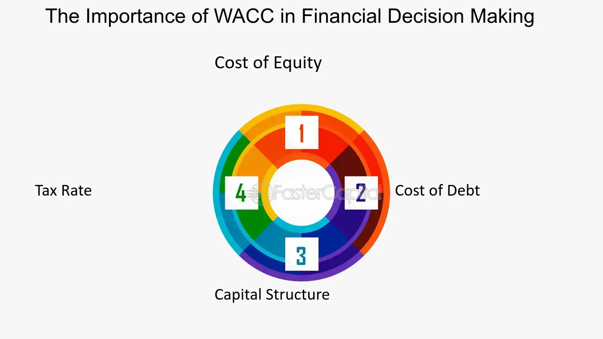

## Table of Contents

## What is WACC and why is it important for investors?

WACC stands for Weighted Average Cost of Capital. It is a way to figure out how much it costs a company to get money from different places, like loans or selling stocks. Imagine you want to borrow money or get investors for your business. WACC helps you know how expensive it will be to use a mix of these options.

WACC is important for investors because it helps them see if a company is a good investment. If a company's WACC is low, it means they can get money cheaply, which is good. Investors can compare the WACC with the money the company makes to see if it's worth investing in. If the company makes more money than its WACC, it might be a good choice for investors.

## How is WACC calculated?

To calculate WACC, you need to know the cost of each type of money a company uses and how much of each type they use. A company usually gets money from two places: debt (like loans) and equity (like stocks). The cost of debt is easy to find because it's just the interest rate the company pays on its loans. The cost of equity is trickier because it's what investors expect to earn from owning the company's stocks. You figure out the cost of equity using models like the Capital Asset Pricing Model (CAPM), which looks at the risk of the stock compared to the market.

Once you know the costs, you need to figure out the weights, or how much of the company's money comes from debt and how much comes from equity. The weight of debt is the total debt divided by the total of debt plus equity. The weight of equity is the total equity divided by the total of debt plus equity. Then, you multiply the cost of debt by its weight, the cost of equity by its weight, and add them together. That's your WACC. It's like making a financial recipe where you mix different ingredients (debt and equity) in the right amounts to get the total cost of capital.

## What are the components of WACC?

The main parts of WACC are the cost of debt and the cost of equity. The cost of debt is the [interest rate](/wiki/interest-rate-trading-strategies) a company pays on its loans. This is pretty easy to find because it's usually in the company's financial reports. The cost of equity is what investors expect to earn from owning the company's stocks. This is harder to figure out because it's not a set number. People often use the Capital Asset Pricing Model (CAPM) to guess it. CAPM looks at how risky the stock is compared to the whole market.

The other important parts of WACC are the weights of debt and equity. The weight of debt is how much of the company's money comes from loans, and the weight of equity is how much comes from stocks. To find these weights, you divide the total debt by the total of debt plus equity to get the weight of debt. Then, you divide the total equity by the total of debt plus equity to get the weight of equity. Once you have all these parts, you can put them together to calculate WACC. You multiply the cost of debt by its weight, the cost of equity by its weight, and then add them up to get the total cost of capital for the company.

## How does WACC affect investment decisions?

WACC helps investors decide if a company is a good place to put their money. It shows how much it costs a company to get money from loans and stocks. If a company's WACC is low, it means they can borrow money or get investors cheaply. This is good because the company can use that money to grow without spending too much on interest or returns for investors. If a company's WACC is high, it means they have to pay a lot to get money. This can make it harder for the company to make a profit, which might make investors think twice about investing.

Investors also use WACC to compare it with the money the company makes. If a company's profit is higher than its WACC, it means the company is making more money than it costs to get that money. This is a good sign for investors because it shows the company is using its money well. If the company's profit is lower than its WACC, it's not doing so well because it's spending more to get money than it's making back. This can make investors look for other places to put their money where they might get a better return.

## Can WACC be used to compare different companies?

Yes, WACC can be used to compare different companies. It helps investors see which companies can get money cheaply and which ones have to pay more. If one company has a lower WACC than another, it means they can borrow money or get investors for less. This is good because it gives them more room to make a profit. Investors might choose to invest in a company with a lower WACC because it could be a better deal.

However, comparing WACC across companies is not always easy. Different companies might have different risks, and that affects their WACC. For example, a company in a risky industry might have a higher WACC because investors want more money to take that risk. Also, how a company uses debt and equity can change its WACC. So, when comparing WACC, investors need to look at the whole picture, including the industry the company is in and how it manages its money.

## What are the limitations of using WACC in investment analysis?

Using WACC in investment analysis has some limitations. One big problem is that WACC is based on guesses and assumptions. For example, figuring out the cost of equity uses models like the Capital Asset Pricing Model (CAPM), which depends on guesses about how risky the stock is and what investors expect to earn. If these guesses are wrong, the WACC can be off too. Also, WACC doesn't stay the same. It can change because of things like interest rates going up or down, or if the company changes how it uses debt and equity. This makes it hard to use WACC to make long-term investment decisions.

Another limitation is that WACC might not work well for comparing companies in different industries or with different risks. A company in a risky industry might have a higher WACC because investors want more money to take that risk. But that doesn't mean the company is a bad investment. It just means the risk is higher. Also, WACC doesn't tell the whole story about a company. It doesn't say anything about the company's growth plans or how well it manages its money. So, while WACC can be a helpful tool, it's not the only thing investors should look at when deciding where to put their money.

## How does the cost of equity impact WACC?

The cost of equity is a big part of WACC. It's what investors expect to earn from owning a company's stocks. If the cost of equity goes up, it makes the WACC go up too. This happens because WACC is a mix of the cost of debt and the cost of equity. When the cost of equity is higher, the company has to promise more money to its shareholders, which makes getting money more expensive overall.

A higher WACC can make it harder for a company to make a profit. If the WACC is high, it means the company has to earn more money just to cover the cost of getting that money. This can make investors think twice about putting their money into the company. They might look for other places to invest where the cost of equity, and therefore the WACC, is lower. So, the cost of equity is really important because it affects how much it costs a company to grow and how attractive it is to investors.

## How does the cost of debt influence WACC?

The cost of debt is how much a company has to pay to borrow money, like the interest on loans. It's part of WACC because WACC is a mix of the cost of debt and the cost of equity. If the cost of debt goes up, it makes the WACC go up too. This happens because a higher cost of debt means the company has to pay more to borrow money, which makes getting money more expensive overall.

A higher WACC can make it harder for a company to make a profit. If the WACC is high because of a high cost of debt, the company needs to earn more money just to cover what it's paying for loans. This can make the company less attractive to investors. They might look for other places to invest where the cost of debt, and therefore the WACC, is lower. So, the cost of debt is really important because it affects how much it costs a company to grow and how good of an investment it is.

## What role does the capital structure play in determining WACC?

The capital structure of a company is how it mixes debt and equity to get money. This mix is really important for figuring out WACC because WACC is made up of the cost of debt and the cost of equity. If a company uses more debt, the weight of debt in the WACC calculation goes up. This can make the WACC lower if the cost of debt is less than the cost of equity. But if the company uses more equity, the weight of equity in the WACC goes up, which can make the WACC higher if the cost of equity is more than the cost of debt.

So, the capital structure can change the WACC a lot. Companies can try to find the best mix of debt and equity to make their WACC as low as possible. A lower WACC means the company can get money cheaper, which is good for making profits and growing. But, using too much debt can be risky because the company has to pay back the loans, and if it can't, it might get into trouble. So, finding the right balance in the capital structure is key to keeping the WACC low and making the company a good investment.

## How can changes in market conditions affect WACC?

Changes in market conditions can have a big impact on a company's WACC. For example, if interest rates go up, the cost of debt goes up too. This means the company has to pay more to borrow money, which makes the WACC higher. Also, if the stock market gets riskier, investors might want more money to own stocks. This makes the cost of equity go up, which also pushes the WACC higher. So, when market conditions change, it can change how much it costs a company to get money.

Another way market conditions affect WACC is through the company's capital structure. If the market gets better and companies can borrow money more easily, they might use more debt. This can lower the WACC if the cost of debt is less than the cost of equity. But if the market gets worse and borrowing money becomes harder, companies might use more equity, which can make the WACC higher if the cost of equity is more than the cost of debt. So, market conditions play a big role in how a company decides to get money and what its WACC will be.

## What advanced techniques can be used to refine WACC calculations?

To make WACC calculations more accurate, one advanced technique is to use a multi-period approach. Instead of using one set of numbers for the cost of debt and equity, you can break down the time into different periods. Each period might have different interest rates or market conditions. This way, you can see how WACC changes over time and make better guesses about the future. Another technique is to use different models for figuring out the cost of equity. Besides the Capital Asset Pricing Model (CAPM), you can use other models like the Dividend Discount Model (DDM) or the Arbitrage Pricing Theory (APT). These models might give you a different idea of what investors expect to earn, which can help you find a more accurate WACC.

Another way to refine WACC calculations is by adjusting for risk. You can use things like beta adjustments or country risk premiums to account for how risky the company or the country it's in is. This can make your WACC more specific to the company's situation. Also, you can look at the company's actual capital structure and how it changes over time. Instead of using a simple average, you can use a more detailed approach that looks at how the company uses debt and equity in different ways. This can give you a better idea of the true cost of capital for the company.

## How do multinational companies adjust WACC for different countries?

Multinational companies have to think about different countries when they figure out their WACC. Each country has its own risks and costs of money. So, these companies adjust their WACC by adding something called a country risk premium. This is extra money they add to the cost of equity to account for how risky it is to do business in that country. If a country is more risky, the country risk premium goes up, which makes the WACC higher for that part of the company.

Also, multinational companies look at the different interest rates in each country. The cost of debt can be different in each place, so they use the local interest rates to figure out the cost of debt for each country. They then mix these costs together based on how much money they get from each country. This way, they can find a WACC that fits their whole business, even though they work in many different places.

## What is WACC and why is it important?

Weighted Average Cost of Capital (WACC) is a pivotal financial metric that quantifies a company's overall cost of capital by blending the costs associated with both debt and equity financing. It serves as a critical tool for businesses to evaluate and make informed financial decisions, acting as a benchmark or hurdle rate for assessing potential investments. By ensuring that prospective projects or investments offer a return that surpasses the WACC, companies can confidently determine which initiatives are likely to enhance shareholder value.

The formula for calculating WACC is given by:

$$
\text{WACC} = \left(\frac{E}{V}\right) \times \text{Re} + \left(\frac{D}{V}\right) \times \text{Rd} \times (1 - \text{Tc})
$$

where:
- $E$ represents the market value of the firm's equity,
- $D$ denotes the market value of the firm's debt,
- $V$ is the total value of capital (equity plus debt),
- $\text{Re}$ is the cost of equity,
- $\text{Rd}$ is the cost of debt,
- $\text{Tc}$ is the corporate tax rate.

The WACC offers insight into the minimum rate of return necessary for an investment to be worthwhile, reflecting the opportunity cost of the company's capital investments. Understanding WACC is vital for appraising the financial viability of investment opportunities and evaluating corporate health. By ensuring that returns exceed their cost of capital, firms can achieve growth and reinvestment in value-creating opportunities, ultimately benefiting stakeholders and sustaining financial health.

## How can WACC be integrated into corporate financial strategies?

Weighted Average Cost of Capital (WACC) plays a fundamental role in corporate finance by influencing key financial strategies. At its core, WACC represents the average rate of return a company is expected to pay its security holders to finance its assets. This cost threshold is crucial for informing decisions regarding mergers, acquisitions, and company expansions. By comprehensively understanding and calculating WACC, firms can make more informed decisions about their growth strategies and capital allocation.

The calculation of WACC involves a blend of both the cost of debt and the cost of equity. The formula for WACC is expressed as:

$$

\text{WACC} = \left( \frac{E}{V} \times Re \right) + \left( \frac{D}{V} \times Rd \times (1 - Tc) \right) 
$$

where:
- $E$ = market value of equity
- $D$ = market value of debt
- $V$ = $E + D$ = total market value of the company’s financing (equity and debt)
- $Re$ = cost of equity
- $Rd$ = cost of debt
- $Tc$ = corporate tax rate

To ensure an accurate estimation of WACC, it is essential to correctly assess the costs of debt and equity. The cost of debt, $Rd$, factors in the interest rates on the company’s current liabilities, adjusted for tax savings since interest expenses are deductible. On the other hand, determining the cost of equity, $Re$, can be more complex and often employs models like the Capital Asset Pricing Model (CAPM), which considers the risk-free rate, the equity beta, and the expected market return.

WACC is integral for optimizing a company's capital structure. Firms use WACC as a benchmark against which the expected return of potential investments or projects is measured. If a project's return exceeds the WACC, it is likely to add value to the company. Conversely, projects yielding returns below the WACC may potentially diminish firm value.

Corporate finance strategies are heavily guided by WACC. During mergers and acquisitions, for instance, the acquiring company will evaluate whether the investment can achieve returns that surpass its WACC, thereby justifying the acquisition. Similarly, in expansion decisions, companies assess new projects through the lens of their WACC to ensure that they are expected to contribute positively to the company's financial standing.

Moreover, WACC allows firms to strike a balance between debt and equity in their capital structure. A lower WACC suggests a more favorable cost of capital, thereby increasing the value of future cash flows. Companies often adjust their mix of debt and equity financing to achieve the lowest possible WACC, optimizing financial leverage and enhancing shareholder value. This strategic alignment not only supports competitive growth but also strengthens overall financial health.

In conclusion, the precise calculation and strategic application of WACC in corporate finance enable companies to pursue opportunities that align with their financial goals, ensuring sustainable growth and value creation. Understanding and integrating WACC into financial decision-making processes is vital for effective capital management in today's competitive economic environment.

## How do you calculate WACC: What are its components and considerations?

The calculation of the Weighted Average Cost of Capital (WACC) is foundational for assessing a company's financial health and guiding investment decisions. The WACC formula integrates the costs of both equity and debt, weighted by their respective proportions in a company's capital structure. The mathematical expression for WACC is as follows:

$$

\text{WACC} = \left( \frac{E}{V} \times R_e \right) + \left( \frac{D}{V} \times R_d \times (1 - T) \right) 
$$

where:
- $E$ is the market value of the equity,
- $D$ is the market value of the debt,
- $V$ is the total market value of the company's financing (equity + debt),
- $R_e$ is the cost of equity,
- $R_d$ is the cost of debt,
- $T$ is the corporate tax rate.

Accurate market value assessments are crucial for determining the correct weighting of equity and debt. This requires up-to-date financial data reflecting the current market conditions. The cost of equity $R_e$ is often estimated using models such as the Capital Asset Pricing Model (CAPM), which considers the risk-free rate, the equity market premium, and the beta coefficient reflecting the stock's [volatility](/wiki/volatility-trading-strategies) in relation to the market.

Similarly, understanding the cost of debt $R_d$ involves calculating the average rate of return required by lenders, often inferred from bond yields or interest expenses observed in recent transactions. The tax shield, represented by $(1 - T)$, reflects the tax deductibility of interest payments, effectively reducing the cost of debt.

Market conditions and economic shifts can significantly influence these components, thereby impacting the calculated WACC. Interest rate fluctuations, changes in corporate tax rates, and shifting investor expectations all necessitate regular updates to the WACC calculation to ensure it reflects the current financial landscape accurately.

Moreover, economic cycles can affect the risk perceptions associated with equities and bonds, altering the weights and costs of capital sources. As a result, companies must continually revisit their assumptions and utilize reliable data sources to maintain an accurate WACC estimate.

By regularly updating the WACC in response to these dynamic factors, firms can ensure they maintain the appropriate benchmarks for evaluating investment opportunities and financial strategies.

## How can WACC be used for making investment decisions?

The Weighted Average Cost of Capital (WACC) plays a critical role in investment decision-making, particularly when employing Discounted Cash Flow (DCF) analysis. WACC is utilized as the discount rate in DCF, representing the minimum return a project must achieve to warrant investment. This threshold ensures that anticipated cash flows surpass the cost of capital, thereby delivering value to the company.

In practical terms, projects that generate returns exceeding the WACC are considered viable for investment. This is because such projects not only cover the capital costs but also contribute additional profit. The relationship between WACC and project evaluation is underscored by its ability to integrate risk assessment with potential returns. Companies must strategically determine their WACC, which reflects both the proportionate costs of equity and debt in their capital structures and the perceived risk associated with their operations.

The following formula for DCF highlights how WACC is integrated into investment appraisals:

$$

NPV = \sum_{t=1}^{n} \frac{C_t}{(1 + WACC)^t} - C_0 
$$

Here, $NPV$ is the Net Present Value of the project, $C_t$ represents the cash inflow during period $t$, and $C_0$ is the initial investment cost. The higher the NPV, the more attractive the investment becomes. If the NPV is positive, the project's return exceeds the WACC, making it a favorable investment option.

Furthermore, WACC aids in balancing investment risk and reward by accounting for the costs of both debt and equity financing. By adjusting for the risk premium, WACC can reflect changes in market dynamics, ensuring that financial evaluations remain relevant. This approach fosters informed decision-making and aligns investment strategies with corporate objectives, ensuring sustainable financial growth.

## References & Further Reading

1. **Brealey, R. A., Myers, S. C., & Allen, F. (2020). Principles of Corporate Finance (13th Edition).** This comprehensive text offers foundational knowledge on corporate finance, with in-depth coverage of WACC and its application in investment decision-making and financial strategy.

2. **Damodaran, A. (2012). Investment Valuation: Tools and Techniques for Determining the Value of Any Asset (3rd Edition).** This book presents valuation techniques essential for assessing the intrinsic value of assets, including how WACC serves as a critical component in Discounted Cash Flow analysis.

3. **Fernández, P. (2019). WACC: Definition, Misconceptions and Errors. IESE Business School Working Paper.** This paper addresses common misconceptions about WACC and provides insights into common errors in its calculation. It is valuable for those seeking to avoid pitfalls in WACC estimation.

4. **Sharpe, W. F. (1964). Capital Asset Prices: A Theory of Market Equilibrium under Conditions of Risk. The Journal of Finance, 19(3), 425-442.** This seminal paper discusses the Capital Asset Pricing Model (CAPM), integral to calculating the cost of equity, a component of WACC.

5. **Graham, J. R., & Harvey, C. R. (2001). The Theory and Practice of Corporate Finance: Evidence from the Field. Journal of Financial Economics, 60(2-3), 187-243.** It explores how companies in practice approach the calculation and application of WACC, providing empirical evidence from surveys.

6. **Grinold, R. C., & Kahn, R. N. (1999). Active Portfolio Management: A Quantitative Approach for Producing Superior Returns and Controlling Risk (2nd Edition).** This book is useful for understanding the role of metrics like WACC in portfolio management and algorithmic trading.

7. **Hull, J. C. (2018). Risk Management and Financial Institutions (5th Edition).** Offers insights into risk management practices that involve using WACC as part of the broader financial risk management strategy.

8. **Modigliani, F., & Miller, M. H. (1958). The Cost of Capital, Corporation Finance and the Theory of Investment. The American Economic Review, 48(3), 261-297.** This foundational paper introduces the Modigliani-Miller theorem, underpinning the theoretical basis for understanding the cost of capital in corporate finance.

9. **Luenberger, D. G. (1997). Investment Science.** Known for its analytical approach, this book provides a thorough examination of investment principles, including the use of WACC in evaluating project viability and corporate finance decisions.

10. **Damodaran Online (http://pages.stern.nyu.edu/~adamodar/).** The website hosted by Aswath Damodaran, a renowned finance professor, provides an extensive range of resources and datasets useful for understanding and calculating WACC, as well as other financial metrics.

