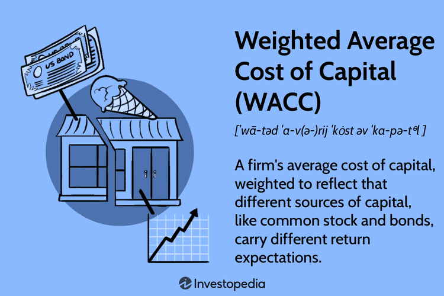

In today's financial landscape, understanding the Weighted Average Cost of Capital (WACC) is crucial for corporate finance, investment, and algorithmic trading. WACC is a pivotal financial metric that blends the costs of a firm's debt and equity to provide a comprehensive picture of its cost of capital. By serving as a critical benchmark, WACC aids in evaluating potential investments, mergers, and financial strategies. It essentially represents the minimum return a company must earn on its asset base to satisfy its creditors, owners, and other providers of capital.

The integration of WACC into financial decision-making processes is essential for companies seeking to optimize their capital structure and enhance shareholder value. Companies use WACC to assess whether to undertake new projects or investments; projects are generally deemed value-creating if their expected returns exceed the calculated WACC. This metric not only supports corporate finance decisions but also plays a significant role in investment appraisal techniques, such as Discounted Cash Flow (DCF) analysis, by setting a hurdle rate that prospective projects must surpass.



Furthermore, algorithmic trading incorporates WACC as a tool to gauge the intrinsic value of a company's stock, allowing traders to make informed decisions based on company valuations. By understanding the WACC, algorithmic traders can identify undervalued securities and adjust their strategies to maximize portfolio returns amidst ever-changing market conditions.

The following sections will delve deeper into the importance of WACC, its calculation, and its application across various financial sectors and strategies, highlighting its role in ensuring optimized financial performance and maintaining a competitive edge in the market.

## Table of Contents

## What is WACC and Why is it Important?

Weighted Average Cost of Capital (WACC) is a pivotal financial metric that quantifies a company's overall cost of capital by blending the costs associated with both debt and equity financing. It serves as a critical tool for businesses to evaluate and make informed financial decisions, acting as a benchmark or hurdle rate for assessing potential investments. By ensuring that prospective projects or investments offer a return that surpasses the WACC, companies can confidently determine which initiatives are likely to enhance shareholder value.

The formula for calculating WACC is given by:

$$
\text{WACC} = \left(\frac{E}{V}\right) \times \text{Re} + \left(\frac{D}{V}\right) \times \text{Rd} \times (1 - \text{Tc})
$$

where:
- $E$ represents the market value of the firm's equity,
- $D$ denotes the market value of the firm's debt,
- $V$ is the total value of capital (equity plus debt),
- $\text{Re}$ is the cost of equity,
- $\text{Rd}$ is the cost of debt,
- $\text{Tc}$ is the corporate tax rate.

The WACC offers insight into the minimum rate of return necessary for an investment to be worthwhile, reflecting the opportunity cost of the company's capital investments. Understanding WACC is vital for appraising the financial viability of investment opportunities and evaluating corporate health. By ensuring that returns exceed their cost of capital, firms can achieve growth and reinvestment in value-creating opportunities, ultimately benefiting stakeholders and sustaining financial health.

## Corporate Finance: Integrating WACC into Financial Strategies

Weighted Average Cost of Capital (WACC) plays a fundamental role in corporate finance by influencing key financial strategies. At its core, WACC represents the average rate of return a company is expected to pay its security holders to finance its assets. This cost threshold is crucial for informing decisions regarding mergers, acquisitions, and company expansions. By comprehensively understanding and calculating WACC, firms can make more informed decisions about their growth strategies and capital allocation.

The calculation of WACC involves a blend of both the cost of debt and the cost of equity. The formula for WACC is expressed as:

$$

\text{WACC} = \left( \frac{E}{V} \times Re \right) + \left( \frac{D}{V} \times Rd \times (1 - Tc) \right) 
$$

where:
- $E$ = market value of equity
- $D$ = market value of debt
- $V$ = $E + D$ = total market value of the company’s financing (equity and debt)
- $Re$ = cost of equity
- $Rd$ = cost of debt
- $Tc$ = corporate tax rate

To ensure an accurate estimation of WACC, it is essential to correctly assess the costs of debt and equity. The cost of debt, $Rd$, factors in the interest rates on the company’s current liabilities, adjusted for tax savings since interest expenses are deductible. On the other hand, determining the cost of equity, $Re$, can be more complex and often employs models like the Capital Asset Pricing Model (CAPM), which considers the risk-free rate, the equity beta, and the expected market return.

WACC is integral for optimizing a company's capital structure. Firms use WACC as a benchmark against which the expected return of potential investments or projects is measured. If a project's return exceeds the WACC, it is likely to add value to the company. Conversely, projects yielding returns below the WACC may potentially diminish firm value.

Corporate finance strategies are heavily guided by WACC. During mergers and acquisitions, for instance, the acquiring company will evaluate whether the investment can achieve returns that surpass its WACC, thereby justifying the acquisition. Similarly, in expansion decisions, companies assess new projects through the lens of their WACC to ensure that they are expected to contribute positively to the company's financial standing.

Moreover, WACC allows firms to strike a balance between debt and equity in their capital structure. A lower WACC suggests a more favorable cost of capital, thereby increasing the value of future cash flows. Companies often adjust their mix of debt and equity financing to achieve the lowest possible WACC, optimizing financial leverage and enhancing shareholder value. This strategic alignment not only supports competitive growth but also strengthens overall financial health.

In conclusion, the precise calculation and strategic application of WACC in corporate finance enable companies to pursue opportunities that align with their financial goals, ensuring sustainable growth and value creation. Understanding and integrating WACC into financial decision-making processes is vital for effective capital management in today's competitive economic environment.

## Algorithmic Trading: Leveraging Financial Metrics

Algorithmic trading employs a range of financial metrics to optimize decision-making processes, and among these metrics, the Weighted Average Cost of Capital (WACC) holds significant importance. WACC serves as a critical tool in assessing the intrinsic value of companies, thereby guiding traders in making informed and strategic trading decisions. In the context of [algorithmic trading](/wiki/algorithmic-trading), WACC functions as a benchmark for evaluating the cost-effectiveness of investments, allowing traders to determine the relative value of securities and identify opportunities for maximizing returns.

The integration of WACC into trading algorithms enables the identification of undervalued securities. By calculating WACC, traders can estimate the minimum acceptable return on an investment or the discount rate used in valuing future cash flows of a company. This discount rate reflects the opportunity cost of investing capital elsewhere with similar risk characteristics. For instance, if the expected return on a stock is higher than the company's WACC, the stock may be considered undervalued, signaling a potential buying opportunity.

Consider a Python implementation that uses WACC to assess a company's intrinsic value:

```python
def calculate_intrinsic_value(fcf, growth_rate, wacc, terminal_growth_rate, horizon_years):
    '''
    Calculates the intrinsic value of a company using a Discounted Cash Flow (DCF) approach,
    where `fcf` is the free cash flow, `growth_rate` is the expected free cash flow growth rate,
    `wacc` is the weighted average cost of capital, `terminal_growth_rate` is the perpetual 
    growth rate used in terminal value calculation, and `horizon_years` is the number of years for projection.
    '''
    # Calculate present value of projected cash flows
    projected_cash_flows = [fcf * ((1 + growth_rate) ** year) for year in range(1, horizon_years + 1)]
    discounted_cf = [fcf / ((1 + wacc) ** year) for year, fcf in enumerate(projected_cash_flows, start=1)]

    # Calculate terminal value
    terminal_value = (projected_cash_flows[-1] * (1 + terminal_growth_rate)) / (wacc - terminal_growth_rate)
    discounted_terminal_value = terminal_value / ((1 + wacc) ** horizon_years)

    # Intrinsic value is the sum of discounted cash flows and terminal value
    intrinsic_value = sum(discounted_cf) + discounted_terminal_value
    return intrinsic_value

# Example usage
fcf = 1000000  # Example free cash flow
growth_rate = 0.05  # Projected growth rate of 5%
wacc = 0.08  # Company's WACC of 8%
terminal_growth_rate = 0.03  # Terminal growth rate of 3%
horizon_years = 5  # Projection over 5 years
intrinsic_value = calculate_intrinsic_value(fcf, growth_rate, wacc, terminal_growth_rate, horizon_years)
print(f"Estimated Intrinsic Value: ${intrinsic_value:,.2f}")
```

Algorithmic strategies built around WACC can adjust dynamically to changing market conditions. By continuously updating the inputs (such as market conditions, interest rates, and risk premiums), algorithms can make real-time adjustments, ensuring optimal asset allocation and risk management. This adaptability enhances the trading strategy's ability to not only capture value but also mitigate potential risks inherent in the market.

Ultimately, incorporating WACC in algorithmic trading strategies ensures a comprehensive evaluation of investment opportunities, balancing the trade-off between risk and return, and aligning trading decisions with broader market trends and financial goals.

## Calculating WACC: Components and Considerations

The calculation of the Weighted Average Cost of Capital (WACC) is foundational for assessing a company's financial health and guiding investment decisions. The WACC formula integrates the costs of both equity and debt, weighted by their respective proportions in a company's capital structure. The mathematical expression for WACC is as follows:

$$

\text{WACC} = \left( \frac{E}{V} \times R_e \right) + \left( \frac{D}{V} \times R_d \times (1 - T) \right) 
$$

where:
- $E$ is the market value of the equity,
- $D$ is the market value of the debt,
- $V$ is the total market value of the company's financing (equity + debt),
- $R_e$ is the cost of equity,
- $R_d$ is the cost of debt,
- $T$ is the corporate tax rate.

Accurate market value assessments are crucial for determining the correct weighting of equity and debt. This requires up-to-date financial data reflecting the current market conditions. The cost of equity $R_e$ is often estimated using models such as the Capital Asset Pricing Model (CAPM), which considers the risk-free rate, the equity market premium, and the beta coefficient reflecting the stock's [volatility](/wiki/volatility-trading-strategies) in relation to the market.

Similarly, understanding the cost of debt $R_d$ involves calculating the average rate of return required by lenders, often inferred from bond yields or interest expenses observed in recent transactions. The tax shield, represented by $(1 - T)$, reflects the tax deductibility of interest payments, effectively reducing the cost of debt.

Market conditions and economic shifts can significantly influence these components, thereby impacting the calculated WACC. Interest rate fluctuations, changes in corporate tax rates, and shifting investor expectations all necessitate regular updates to the WACC calculation to ensure it reflects the current financial landscape accurately.

Moreover, economic cycles can affect the risk perceptions associated with equities and bonds, altering the weights and costs of capital sources. As a result, companies must continually revisit their assumptions and utilize reliable data sources to maintain an accurate WACC estimate.

By regularly updating the WACC in response to these dynamic factors, firms can ensure they maintain the appropriate benchmarks for evaluating investment opportunities and financial strategies.

## Using WACC for Investment Decisions

The Weighted Average Cost of Capital (WACC) plays a critical role in investment decision-making, particularly when employing Discounted Cash Flow (DCF) analysis. WACC is utilized as the discount rate in DCF, representing the minimum return a project must achieve to warrant investment. This threshold ensures that anticipated cash flows surpass the cost of capital, thereby delivering value to the company.

In practical terms, projects that generate returns exceeding the WACC are considered viable for investment. This is because such projects not only cover the capital costs but also contribute additional profit. The relationship between WACC and project evaluation is underscored by its ability to integrate risk assessment with potential returns. Companies must strategically determine their WACC, which reflects both the proportionate costs of equity and debt in their capital structures and the perceived risk associated with their operations.

The following formula for DCF highlights how WACC is integrated into investment appraisals:

$$

NPV = \sum_{t=1}^{n} \frac{C_t}{(1 + WACC)^t} - C_0 
$$

Here, $NPV$ is the Net Present Value of the project, $C_t$ represents the cash inflow during period $t$, and $C_0$ is the initial investment cost. The higher the NPV, the more attractive the investment becomes. If the NPV is positive, the project's return exceeds the WACC, making it a favorable investment option.

Furthermore, WACC aids in balancing investment risk and reward by accounting for the costs of both debt and equity financing. By adjusting for the risk premium, WACC can reflect changes in market dynamics, ensuring that financial evaluations remain relevant. This approach fosters informed decision-making and aligns investment strategies with corporate objectives, ensuring sustainable financial growth.

## Comparative Analysis: WACC Across Different Sectors

WACC, or Weighted Average Cost of Capital, exhibits significant variability across different industry sectors, primarily due to sector-specific risk profiles, market stability, and capital structures. This variability underscores the importance of understanding WACC within various contexts to accurately assess a company's financial health and competitiveness.

Sectors such as technology and pharmaceuticals often experience higher WACC values. This is attributed to elevated risk profiles associated with rapid technological changes, innovation-driven growth, and longer timelines for achieving profitability. Companies in these sectors typically rely more on equity financing due to the uncertainty and high potential for volatility in their cash flows. Equity investors demand higher returns as compensation for taking on this increased risk, thereby elevating the overall WACC.

Conversely, sectors like utilities and consumer staples tend to reflect lower WACC values. These industries benefit from stable cash flows, less sensitivity to economic cycles, and a generally lower risk profile, allowing for a higher proportion of debt financing. Debt financing is often cheaper compared to equity due to lower perceived risk by lenders, which in turn contributes to a reduced WACC. This capital structure is further stabilized by the regulated nature of such sectors and consistent demand for essential products and services.

Understanding the industry-specific WACC is vital for comparing companies within the same sector or assessing the potential profitability and risk of investments across sectors. For instance, a WACC of 8% might be standard in a low-risk industry like utilities, but the same figure could indicate a competitive disadvantage in a high-growth tech industry.

Industry benchmarks for WACC are instrumental in evaluating a company's market positioning. These benchmarks provide insights into the average cost of capital that companies within a particular sector face, serving as a reference point for assessing whether a company is operating efficiently in terms of its capital costs. A firm's ability to maintain a WACC lower than the industry average might suggest robust management and efficient use of resources, thereby enhancing competitive advantage.

Furthermore, sector-specific WACC assessment aids financial analysts in making informed investment decisions, crafting sector-tailored financial strategies, and understanding the broader economic factors influencing market trends. Regularly updated industry benchmarks, reflecting ongoing market conditions and shifts in economic outlook, are essential for maintaining reliability in financial analysis and strategic planning. 

In conclusion, recognizing the differences in WACC across various sectors enables investors, analysts, and corporations to align their financial strategies more accurately with sector dynamics. This appreciation of variances supports more nuanced investment appraisals and strategic decisions tailored to the distinctive conditions and risk profiles characteristic of specific industries.

## Addressing Limitations and Errors in WACC Estimation

Calculating the Weighted Average Cost of Capital (WACC) involves several assumptions and relies heavily on data that may not always be accurate or consistent. These inaccuracies can arise due to varying market conditions, incorrect estimations of the cost of debt and equity, or the fluctuating market value of a company's capital components. Addressing these limitations is crucial for improving the reliability of WACC as a financial metric.

One of the primary sources of error in WACC calculations is data inconsistency. Market data for determining the cost of equity and debt can vary significantly across sources and over time. For instance, the risk-free rate, a component of the cost of equity, might fluctuate based on economic changes. Similarly, market values of equity and debt might not reflect current conditions if historical data is used without adjustment.

To mitigate these issues, sensitivity analysis is an effective strategy. It involves varying key assumptions and inputs within the WACC formula to assess the impact on the outcome. This approach helps identify which variables most significantly affect the WACC, allowing analysts to focus on obtaining more accurate data for those components. A basic Python example for performing sensitivity analysis could look like this:

```python
import numpy as np

# Example constants for WACC calculation
equity_costs = np.linspace(0.08, 0.12, 5)  # Vary equity cost from 8% to 12%
debt_costs = np.linspace(0.03, 0.07, 5)    # Vary debt cost from 3% to 7%
tax_rate = 0.25
equity_market_value = 1000000
debt_market_value = 500000

def calculate_wacc(equity_cost, debt_cost):
    E = equity_market_value / (equity_market_value + debt_market_value)
    D = debt_market_value / (equity_market_value + debt_market_value)
    wacc = E * equity_cost + D * debt_cost * (1 - tax_rate)
    return wacc

# Perform sensitivity analysis
for equity_cost in equity_costs:
    for debt_cost in debt_costs:
        wacc = calculate_wacc(equity_cost, debt_cost)
        print(f'Equity Cost: {equity_cost:.2%}, Debt Cost: {debt_cost:.2%}, WACC: {wacc:.2%}')
```

In parallel, regularly revisiting assumptions and ensuring the use of reliable, up-to-date data sources bolster the accuracy of WACC calculations. This involves checking assumptions like the market risk premium and beta—which are integral to the Capital Asset Pricing Model (CAPM)—to ensure they reflect current financial environments.

Market conditions are dynamic, necessitating frequent updates to the data used in WACC calculations. Regular reviews and updates of both macroeconomic indicators and company-specific data, such as changes in capital structure or interest rates, help maintain the relevance and accuracy of WACC estimations. Engaging multiple data providers for cross-verification can also reduce the risk of erroneous inputs.

By adopting strategies such as sensitivity analysis and periodically revisiting key assumptions, alongside leveraging accurate and current data sources, analysts can enhance the precision and utility of WACC, making it a more robust tool for financial decision-making.

## Conclusion

The Weighted Average Cost of Capital (WACC) remains a vital component in making informed investment decisions and ensuring alignment with corporate strategic objectives. By considering the costs of both equity and debt, WACC provides a comprehensive measure of a firm’s cost of financing, influencing corporate decisions such as capital budgeting, mergers, and acquisitions. It acts as a benchmark for companies to evaluate potential projects, ensuring that investments are allocated towards opportunities with returns surpassing the WACC, thereby adding value to the firm.

Beyond the sphere of corporate finance, WACC's utility extends to algorithmic trading and advanced financial management strategies. By incorporating WACC into trading algorithms, traders can enhance their ability to assess the intrinsic value of securities, optimize portfolio returns, and dynamically adjust strategies in response to market conditions. This application underscores its role in evaluating financial health and investment potential more accurately.

A comprehensive grasp of WACC's components and its estimation method is essential for optimizing financial performance. Recognizing industry-specific WACC variations and assessing sector-relative competitive positioning can provide a strategic edge. A well-calculated WACC aids in balancing risks and returns, helping firms maintain a competitive advantage in the market by aligning investment opportunities with long-term strategic goals. This ensures that capital is allocated efficiently, promoting sustainable growth and value creation.

## References & Further Reading

1. **Brealey, R. A., Myers, S. C., & Allen, F. (2020). Principles of Corporate Finance (13th Edition).** This comprehensive text offers foundational knowledge on corporate finance, with in-depth coverage of WACC and its application in investment decision-making and financial strategy.

2. **Damodaran, A. (2012). Investment Valuation: Tools and Techniques for Determining the Value of Any Asset (3rd Edition).** This book presents valuation techniques essential for assessing the intrinsic value of assets, including how WACC serves as a critical component in Discounted Cash Flow analysis.

3. **Fernández, P. (2019). WACC: Definition, Misconceptions and Errors. IESE Business School Working Paper.** This paper addresses common misconceptions about WACC and provides insights into common errors in its calculation. It is valuable for those seeking to avoid pitfalls in WACC estimation.

4. **Sharpe, W. F. (1964). Capital Asset Prices: A Theory of Market Equilibrium under Conditions of Risk. The Journal of Finance, 19(3), 425-442.** This seminal paper discusses the Capital Asset Pricing Model (CAPM), integral to calculating the cost of equity, a component of WACC.

5. **Graham, J. R., & Harvey, C. R. (2001). The Theory and Practice of Corporate Finance: Evidence from the Field. Journal of Financial Economics, 60(2-3), 187-243.** It explores how companies in practice approach the calculation and application of WACC, providing empirical evidence from surveys.

6. **Grinold, R. C., & Kahn, R. N. (1999). Active Portfolio Management: A Quantitative Approach for Producing Superior Returns and Controlling Risk (2nd Edition).** This book is useful for understanding the role of metrics like WACC in portfolio management and algorithmic trading.

7. **Hull, J. C. (2018). Risk Management and Financial Institutions (5th Edition).** Offers insights into risk management practices that involve using WACC as part of the broader financial risk management strategy.

8. **Modigliani, F., & Miller, M. H. (1958). The Cost of Capital, Corporation Finance and the Theory of Investment. The American Economic Review, 48(3), 261-297.** This foundational paper introduces the Modigliani-Miller theorem, underpinning the theoretical basis for understanding the cost of capital in corporate finance.

9. **Luenberger, D. G. (1997). Investment Science.** Known for its analytical approach, this book provides a thorough examination of investment principles, including the use of WACC in evaluating project viability and corporate finance decisions.

10. **Damodaran Online (http://pages.stern.nyu.edu/~adamodar/).** The website hosted by Aswath Damodaran, a renowned finance professor, provides an extensive range of resources and datasets useful for understanding and calculating WACC, as well as other financial metrics.