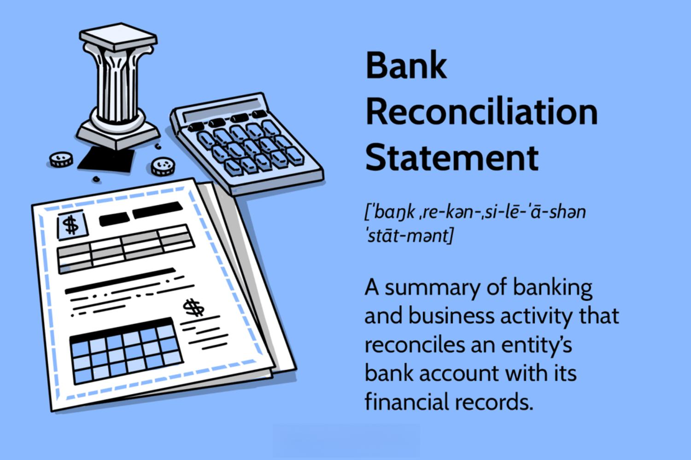

In the rapidly evolving world of finance, understanding key processes such as reconciliation is crucial. Reconciliation refers to the process of ensuring that two sets of records, typically financial accounts, are in agreement. This is an essential aspect of financial management, as it helps maintain the accuracy and reliability of financial data. By confirming that figures in different sets of records or statements match, reconciliation helps prevent errors and inconsistencies that could lead to financial misstatements or impact trading outcomes.

This article examines various types of reconciliation processes, including accounting reconciliation, financial reconciliation, and account reconciliation. Accounting reconciliation typically involves comparing internal records with external documents like bank statements to verify the accuracy of recorded transactions. This ensures that the company’s financial records are in sync with actual financial and banking activity, providing a clear picture of the organization's financial health.



Financial reconciliation goes beyond accounting and includes the verification of all financial statements to eliminate discrepancies and align reported figures with actual performance. This is vital for compliance with financial reporting standards and for ensuring the transparency and credibility of an organization’s financial declarations.

Account reconciliation focuses on identifying differences between account balances and external statements, which is essential for maintaining the integrity of financial data. Regular account reconciliation helps detect and correct errors or fraudulent activities, supporting more informed decision-making and efficient financial planning.

The implications of these reconciliation processes for algorithmic trading are significant. Algorithmic trading, which involves using automated systems to execute trades based on predefined strategies, relies on precise data for effectiveness. The integration of robust reconciliation processes can enhance system efficiency, reduce errors, and provide a competitive advantage in trade execution.

This guide aims to provide valuable insights for finance professionals and enthusiasts exploring algorithmic trading by explaining these reconciliation processes and highlighting their impact on the trading landscape. Understanding reconciliation is not just about maintaining accurate financial records but also about equipping oneself with the tools necessary to succeed in the continually shifting financial markets.

## Table of Contents

## Understanding Accounting Reconciliation

Accounting reconciliation is a critical process in financial management, serving to confirm the accuracy and consistency of financial records. The process involves comparing two sets of corresponding records, typically those maintained by an organization against those provided by a financial institution such as a bank. This ensures that all transactions are correctly recorded and any discrepancies are identified and resolved promptly.

### Balance Sheet Reconciliation

Balance sheet reconciliation is one of the most common forms of accounting reconciliation. This process ensures that the balances listed on a company’s balance sheet are accurate. It involves verifying the ending balances of specific accounts—such as cash, receivables, payables, and inventory—against supporting documentation. This verification is vital for confirming that there are no errors in the financial statements, which could lead to incorrect reporting of financial health.

### Bank Reconciliation

Bank reconciliation involves comparing the company’s recorded banking transactions with the bank’s monthly statement to identify any discrepancies. For instance, differences might arise due to outstanding checks, deposits in transit, or bank errors. By performing bank reconciliations regularly, companies can ensure that their cash records are up-to-date and correct, which is essential for effective cash management.

### Importance of Accounting Reconciliation

Maintaining accurate financial records is essential for financial analysis, planning, and regulatory compliance. Inaccuracies in financial records could lead to poor decision-making, financial losses, and legal penalties. Therefore, accounting reconciliation is indispensable in ensuring the integrity of financial data. It provides a mechanism to detect and correct errors, omissions, or fraud.

### Tools for Streamlining Reconciliation

With the advancement of technology, there are numerous tools and software solutions available that can automate and streamline the reconciliation process. These tools can automatically match transactions, flag discrepancies, and generate reconciliation reports. For instance, software such as SAP, Oracle Financial Services, and QuickBooks offer functionalities that reduce the time and effort required for reconciliation.

### Examples of Reconciliation Processes

Consider a company that receives multiple payments from different clients. The company’s accounting records should accurately reflect these payments, correlating with bank deposits. Any variation must be investigated to ascertain the cause—whether it's a recording error, a bank error, or fraud.

In short, accounting reconciliation plays a pivotal role in maintaining the credibility of financial statements. Through regular reconciliation processes, businesses can safeguard their financial resources and support sound financial management practices. This is particularly important in maintaining investor confidence and complying with financial regulations.

## Financial Reconciliation Explained

Financial reconciliation is a fundamental process within financial management that extends beyond traditional accounting reconciliation to ensure the accuracy of financial statements and compliance with regulatory requirements. This process involves cross-verifying different sets of financial data to identify and rectify discrepancies, thereby maintaining the integrity of financial reports.

### Role in Accuracy and Compliance

Financial reconciliation plays a critical role in guaranteeing that financial statements accurately reflect a company's financial position. By reconciling accounts, companies ensure that their financial data is consistent across all records and complies with accounting standards and regulatory requirements. This process helps in preventing financial misstatements, which can lead to legal consequences and damage to the organization's reputation. Accurate reconciliations provide stakeholders, including investors and regulatory bodies, with trustworthy information necessary for informed decision-making.

### Key Steps in the Financial Reconciliation Process

The financial reconciliation process typically involves several key steps:

1. **Data Collection**: Gather relevant financial data from all necessary sources, including bank statements, ledgers, and other financial records.

2. **Comparison**: Contrast the financial data from different sources to detect inconsistencies and identify discrepancies. This often involves matching figures from external documents such as bank statements to internal records.

3. **Investigation**: Examine discrepancies to determine their cause. This might require investigating transactions recorded inaccurately or omitted from records.

4. **Adjustment**: Rectify the identified discrepancies by making the necessary adjustments in the financial records. This ensures that all accounts are accurately balanced.

5. **Review**: Conduct a thorough review to confirm that all adjustments have been correctly implemented and that the reconciled financial statements are accurate.

6. **Documentation**: Maintain comprehensive records of the reconciliation process for future reference and auditing purposes.

### Common Challenges and Solutions

Financial reconciliation is often fraught with challenges, including:

- **Data Volume**: The sheer volume of financial transactions can be overwhelming, making manual reconciliation time-consuming and prone to errors.

- **Complex Transactions**: Transactions that involve multiple accounts or currencies can complicate the reconciliation process.

- **Human Error**: Manual data entry and analysis can result in inaccuracies and oversight.

To overcome these challenges, organizations are increasingly adopting automated reconciliation tools that offer significant advantages.

### Impact of Automated Solutions

Automation is redefining financial reconciliation by streamlining the process, reducing errors, and enhancing efficiency. Modern software can automatically import data, perform comparisons, and highlight discrepancies, minimizing the need for manual intervention. These solutions often integrate with existing accounting systems to facilitate seamless data flow and real-time reconciliation.

For instance, [machine learning](/wiki/machine-learning) algorithms can be employed to analyze transaction patterns, improving the accuracy of predictions for matching transactions. This technology not only speeds up the reconciliation process but also elevates its precision.

```python
# Example of a simple reconciliation check using Python

def reconcile(accounts_records, bank_records):
    # Check for discrepancies between the account and bank records
    discrepancies = []
    for account, amount in accounts_records.items():
        if account in bank_records:
            if bank_records[account] != amount:
                discrepancies.append((account, amount, bank_records[account]))
        else:
            discrepancies.append((account, amount, None))
    return discrepancies

accounts_records = {'Account1': 1000, 'Account2': 1500, 'Account3': 2000}
bank_records = {'Account1': 1000, 'Account2': 1600, 'Account4': 2000}

discrepancies = reconcile(accounts_records, bank_records)
print(discrepancies)
```

The above code snippet demonstrates a basic logic for checking discrepancies between a company's account records and its bank statements, highlighting accounts where transactions do not match.

In conclusion, financial reconciliation is pivotal in maintaining accurate financial reporting and ensuring compliance. As automated solutions continue to evolve, they offer promising enhancements in the efficiency and accuracy of the reconciliation process, allowing businesses to allocate resources more effectively and focus on strategic financial planning.

## The Importance of Account Reconciliation

Account reconciliation is fundamental to financial integrity as it ensures consistency and accuracy between accounts and statements. This process is crucial for identifying discrepancies that could result in financial inaccuracies or fraud. By maintaining congruence between the recorded transactions and external data (e.g., bank statements, invoices), organizations can assure the precision of their financial data, which is critical for robust decision-making and financial planning.

There are primarily two types of account reconciliation: manual and automated. **Manual reconciliation** involves physically matching records and verifying each entry for accuracy. This method, while thorough, is time-consuming and prone to human error, especially in organizations with high transaction volumes. **Automated reconciliation**, on the other hand, leverages software solutions to compare records across account transactions, swiftly identifying mismatches and anomalies with reduced error rates. Automation not only enhances efficiency but also increases the frequency of reconciliations, leading to more timely detection of potential issues.

Effective account reconciliation techniques are essential to prevent errors and fraud. One approach is the use of reconciliation templates that standardize the process, ensuring consistency and thoroughness. Regular audits and internal controls are also vital, providing oversight and ensuring compliance with established procedures. Advanced techniques may involve data analytics and machine learning to identify patterns that could signify fraudulent activity or systemic errors.

The impact of account reconciliation on decision-making and financial planning cannot be overstated. An accurate financial picture allows decision-makers to allocate resources more effectively, anticipate cash flow needs, and engage in strategic planning with confidence. Moreover, maintaining reconciled accounts enhances an organization's credibility with stakeholders, including investors, auditors, and regulatory bodies, which is crucial for long-term financial health.

In summary, account reconciliation is not just a routine task but a strategic element in safeguarding financial integrity, preventing fraudulent activities, and enabling informed decision-making. As technology evolves, the scope for automating and enhancing reconciliation processes will continue to grow, thus amplifying its importance and effectiveness in the financial landscape.

## Algorithmic Trading and Reconciliation

Algorithmic trading utilizes sophisticated algorithms to execute trades with precision and speed, based on pre-established strategies. The role of reconciliation in this context is pivotal in enhancing the efficiency and accuracy of these systems. Reconciliation processes are essential for ensuring that all trading activities are accurately recorded and align with actual market outcomes, thereby minimizing discrepancies and errors.

In [algorithmic trading](/wiki/algorithmic-trading), the reconciliation of data can take several forms, such as verifying that executed trades align with the intended orders and ensuring that the financial results are consistent with the firm's expectations. This accuracy is crucial as even minor errors can compound in high-frequency trading environments, leading to significant financial implications. For instance, position reconciliation helps in confirming that the positions recorded in the trading platform match with those reflected in the internal systems, preventing potential risks and inefficiencies.

One of the primary challenges in applying reconciliation in high-frequency trading environments is the sheer [volume](/wiki/volume-trading-strategy) and velocity of data generated. High-frequency trading can process millions of orders in fractions of a second, necessitating real-time reconciliation systems. These systems must be capable of handling large datasets swiftly and accurately, often requiring complex algorithms and high-performance computing resources.

Technological advancements have significantly enhanced reconciliation in algorithmic trading. Software solutions equipped with machine learning and [artificial intelligence](/wiki/ai-artificial-intelligence) can now automate many of the reconciliation processes, reducing the need for manual intervention and increasing accuracy. These tools can efficiently identify and rectify discrepancies by cross-referencing trades against various data sources, providing real-time alerts for any detected anomalies.

Python has emerged as a preferred language for developing these reconciliation solutions due to its robust libraries and frameworks, such as Pandas for data manipulation and NumPy for numerical computations. For example, a simple Python script can be used to reconcile two sets of trading data:

```python
import pandas as pd

# Load datasets
trades = pd.read_csv('executed_trades.csv')
orders = pd.read_csv('intended_orders.csv')

# Reconcile trades
reconciled_data = pd.merge(trades, orders, on='trade_id', how='outer', indicator=True)

# Identify discrepancies
discrepancies = reconciled_data[reconciled_data['_merge'] != 'both']
print(discrepancies)
```

Future trends in reconciliation practices within algorithmic trading are likely to focus on further automation and integration of advanced technologies. With the rise of blockchain technology, there is potential for greater transparency and immutability in trade records, which could simplify reconciliation efforts. Additionally, as quantum computing advances, it may offer novel approaches to handling the computational demands of real-time data reconciliation in high-frequency environments.

In conclusion, effective reconciliation processes are indispensable in algorithmic trading, ensuring system efficiency, accuracy, and compliance. As technology evolves, these processes will continue to adapt, offering enhanced capabilities and further reducing the potential for errors in complex trading systems.

## How Reconciliation Improves Trading Outcomes

Reconciliation is an essential process that significantly enhances trading outcomes by ensuring the accuracy of trade data, thereby reducing the risk of errors during trade execution. Discrepancies in trade data can lead to costly mistakes such as incorrect pricing, duplicated trades, or missed trades, which reconcile processes can effectively minimize.

Regular reconciliations can optimize resource allocation and performance assessment in trading environments. Repeatedly aligning and verifying trade data against financial records allows traders and financial institutions to allocate resources more efficiently, identifying discrepancies and inaccuracies promptly. This proactive approach aids in performance assessment by providing accurate data for evaluating trading strategies and decision-making processes.

Compliance with financial regulations is another critical aspect facilitated by reconciliation. Financial institutions are subject to numerous regulatory requirements mandating accurate record-keeping and reporting. Reconciliation processes ensure that trades and financial records are in sync, thus aiding compliance with these standards. For example, regulations such as the Dodd-Frank Act in the United States and the Markets in Financial Instruments Directive (MiFID II) in Europe require stringent record-keeping measures that are facilitated by effective reconciliation.

Case studies demonstrate the efficacy of reconciliation in trading outcomes. For instance, a prominent investment firm implemented an automated reconciliation system that significantly reduced discrepancies in their trade settlements. As a result, the firm not only improved its operational efficiency but also reduced financial loss from inaccuracies, enhancing its overall trading performance.

Integrating reconciliation seamlessly into trading strategies necessitates adopting advanced technologies and methodological improvements. Employing automated reconciliation software can streamline the process, offering real-time data validation and exceptional scalability to handle large volumes of trades. Furthermore, machine learning algorithms can be applied to identify patterns in discrepancies, predicting and preventing potential errors before they affect trade execution.

The integration of reconciliation into trading strategies not only enhances accuracy but also permits traders to operate with greater confidence and precision. As trading technologies evolve, the role of reconciliation processes will become increasingly vital, paving the way toward more robust and secure trading ecosystems.

## Conclusion

Reconciliation plays a critical role in both financial management and trading strategies, providing the necessary foundation for accurate data handling. By understanding and implementing various reconciliation processes, organizations can significantly enhance the reliability and validity of their financial data. This leads to improved decision-making and strategic planning, essential components of effective financial management.

Incorporating reconciliation processes into algorithmic trading offers a notable competitive edge. Accurate and timely data reconciliation ensures that algorithms operate based on the most precise information, reducing the likelihood of errors during trade execution. This accuracy is especially crucial in high-frequency trading environments, where even minor discrepancies can lead to substantial financial losses.

As technology continues to evolve, the efficiency and scope of reconciliation processes are expected to expand. Innovations in automation and algorithmic analysis are reshaping reconciliation practices, making them faster and more accurate. For instance, advanced software solutions can now automate complex reconciliation tasks, reducing the manual effort required and allowing for real-time data validation.

Staying informed about these technological advancements is vital for professionals involved in financial operations or trading. Keeping up with emerging trends and understanding their implications on reconciliation processes can provide meaningful insights and help maintain competitive advantages in the market. As the financial landscape continues to progress, the ability to efficiently integrate and adapt reconciliation processes will remain a crucial determinant of success in financial management and trading.

## References & Further Reading

[1]: Pahwa, A., & Bagga, Y. (2019). ["Automating Reconciliation of Bank Statements using Machine Learning in Banking."](https://medium.com/@lawrenceklamecki/using-machine-learning-to-solve-data-reconciliation-challenges-in-financial-services-b2f1a2dbb954) IEEE International Conference on Service Operations and Logistics, and Informatics.

[2]: Ball, R., & Kothari, S. P. (2000). ["Financial Statement Analysis."](https://www.sciencedirect.com/science/article/abs/pii/S0165410100000124) Journal of Accounting and Economics, 31(1-3), 105-231.

[3]: Marcos Lopez de Prado. ["Advances in Financial Machine Learning."](https://www.amazon.com/Advances-Financial-Machine-Learning-Marcos/dp/1119482089) Wiley.

[4]: Singleton, J. C., & Fields, K. T. (2020). ["Algorithmic Trading Reconciliation and Settlement Processes."](https://www.semanticscholar.org/paper/Language-Development%3A-Foundations%2C-Processes%2C-And-Singleton-Shulman/756d17dc8eb91a2a1e3bc2bc7f515ca75597f26a) Journal of Finance and Accounting Research.

[5]: Burgess, A. (2012). ["Automated Reconciliation: The Key to Compliance and Accuracy in Financial Services."](https://www.solvexia.com/blog/automated-reconciliations) Journal of Financial Services Marketing, 17(3).