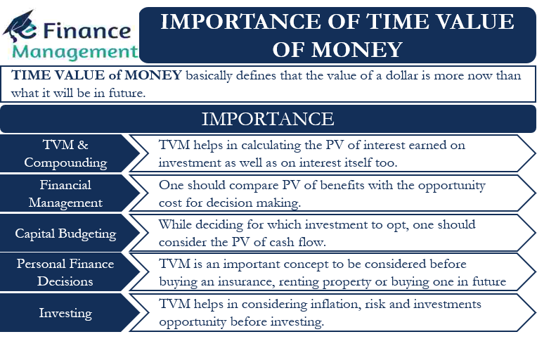

## Table of Contents

## What is the time value of money?

The time value of money is a basic idea in finance that says money you have now is worth more than the same amount of money you will get in the future. This is because you can use money you have now to invest and earn more money over time. For example, if you have $100 today, you could put it in a savings account and earn interest on it, so it would be worth more in a year than if you just got $100 a year from now.

This concept is important for making financial decisions like loans, investments, and savings plans. When you borrow money, you pay interest because the lender could have used that money to earn more money elsewhere. When you invest, you expect to get more money back in the future than what you put in now. Understanding the time value of money helps people and businesses make better choices about when and how to use their money.

## Why is the time value of money important for investors?

The time value of money is important for investors because it helps them understand how much their money can grow over time. If an investor puts money into something now, they expect to get more money back later. This is because they could have used that money to earn interest or invest in something else. By knowing the time value of money, investors can figure out if an investment is worth it. They can see if the money they will get in the future is worth more than what they are putting in now.

For example, if an investor has $1,000 today, they might choose to invest it in a stock or a bond. If they think the stock will grow and be worth $1,200 in a year, they need to compare that to what they could earn by putting the $1,000 in a savings account. If the savings account only gives them $1,050 in a year, the stock might be a better choice. The time value of money helps investors make these kinds of decisions by showing them the real value of money over time.

## How does inflation affect the time value of money?

Inflation affects the time value of money by making money worth less over time. When prices go up because of inflation, the same amount of money can buy fewer things in the future than it can now. For example, if you have $100 today and inflation is 2% a year, in one year, that $100 will only be able to buy things that cost $98 today. This means the real value of your money goes down as inflation goes up.

Because of inflation, investors need to think about more than just the interest or returns they might get from their investments. They also need to make sure their investments grow faster than inflation. If an investment only grows at the same rate as inflation, the investor isn't really making any more money. They need to find investments that will give them a return higher than the inflation rate to keep the value of their money from going down.

## What is the difference between present value and future value?

Present value and future value are two important ideas in the time value of money. Present value is what money today is worth. It's the amount of money you would need now to get a certain amount of money in the future. For example, if someone promises to give you $100 in a year, the present value is how much that $100 is worth to you today, taking into account things like interest rates and inflation.

Future value, on the other hand, is what money will be worth at a later time. It's the amount of money you will have in the future if you invest a certain amount of money now. For example, if you put $100 in a savings account that gives you 5% interest a year, the future value of that $100 after one year would be $105. Future value helps you see how much your money can grow over time.

Both present value and future value are used to make smart financial decisions. By understanding these concepts, you can figure out if it's better to get money now or later, and how much you need to invest now to reach your financial goals in the future.

## How can investors use the time value of money to make better investment decisions?

Investors can use the time value of money to make better investment decisions by figuring out how much their money will be worth in the future. They do this by looking at the interest rates and expected returns on their investments. For example, if an investor has $1,000 and they can put it in a savings account with a 3% interest rate, they can calculate that in one year, their money will grow to $1,030. By comparing this to other investments, like stocks or bonds, they can decide where to put their money to get the best return.

Another way investors use the time value of money is by understanding the present value of future cash flows. If an investment promises to pay out money over time, the investor can figure out how much that money is worth right now. For example, if a bond will pay $100 every year for 5 years, the investor can calculate the present value of those payments to see if it's a good deal. This helps them choose investments that will give them the most value for their money today.

Inflation also plays a big role in these decisions. Investors need to make sure their investments grow faster than inflation to keep their money's value from going down. If inflation is 2% a year, they need to find investments that will give them more than a 2% return. By thinking about the time value of money and inflation, investors can make smarter choices about where to put their money to reach their financial goals.

## What are the common formulas used to calculate the time value of money?

The most common formulas used to calculate the time value of money are the future value formula and the present value formula. The future value formula helps you figure out how much money you will have in the future if you invest a certain amount of money now. It's written as FV = PV * (1 + r)^n, where FV is the future value, PV is the present value, r is the interest rate, and n is the number of periods. For example, if you put $1,000 in a savings account with a 5% interest rate for one year, the future value would be $1,000 * (1 + 0.05)^1 = $1,050.

The present value formula helps you figure out how much money you need now to get a certain amount of money in the future. It's written as PV = FV / (1 + r)^n, where PV is the present value, FV is the future value, r is the interest rate, and n is the number of periods. For example, if someone promises to give you $100 in a year and the interest rate is 5%, the present value of that $100 is $100 / (1 + 0.05)^1 = $95.24. These formulas help investors make smart decisions about their money by showing them how much their money can grow over time and how much money they need now to reach their goals in the future.

## How does the concept of compounding relate to the time value of money?

Compounding is a big part of the time value of money. It means that you earn interest not just on the money you put in, but also on the interest you've already earned. This makes your money grow faster over time. For example, if you put $100 in a savings account with a 5% interest rate, after one year you'll have $105. But in the next year, you'll earn 5% interest on the new total of $105, not just the original $100. This keeps happening, making your money grow even more as time goes on.

Understanding compounding helps investors see how their money can grow over time. If you leave your money in an investment for a long time, the effect of compounding gets bigger and bigger. This is why starting to invest early can make a big difference. Even small amounts of money can grow into a lot if you let compounding work its magic over many years. By knowing about compounding, investors can make better choices about where to put their money and how long to keep it there to get the best results.

## What role does risk play in the time value of money calculations?

Risk plays a big role in figuring out the time value of money. When you invest your money, there's always a chance you might not get back what you expected. This risk can change how much you think your money is worth now and in the future. If an investment is really risky, you might want a higher return to make up for that risk. So, you'd need to see a bigger future value to make the investment worth it.

For example, if you're thinking about putting money into a safe savings account or a risky stock, the time value of money will be different for each one. With the savings account, you know the interest rate and it's pretty safe, so you can easily figure out the future value. But with the stock, there's more risk, so you might need a higher expected return to feel good about the investment. This means you'll need to think about how much risk you're willing to take when you calculate the time value of money.

## How do different investment vehicles (stocks, bonds, real estate) impact the time value of money?

Different investment vehicles like stocks, bonds, and real estate can change how you see the time value of money. Stocks can grow a lot over time, but they're also riskier. This means you might expect a bigger return from stocks to make up for the risk. If you invest in stocks, you'll look at the future value of your money and see if it's worth the risk. On the other hand, bonds are usually safer but they don't grow as fast. When you invest in bonds, you can predict the future value more easily because the interest rates are usually fixed. So, the time value of money for bonds is often lower than for stocks, but it's more certain.

Real estate is another way to invest, and it can affect the time value of money differently. Real estate can go up in value over time, and you might also get money from renting it out. This means the future value of your money in real estate can be high, but it also comes with risks like changes in the housing market or the cost of fixing up the property. When you think about the time value of money with real estate, you need to look at both the potential growth and the risks. Each type of investment changes how you see the value of your money now and in the future, based on how much risk you're willing to take and how much you expect to earn.

## Can you explain the impact of interest rates on the time value of money?

Interest rates have a big impact on the time value of money. When interest rates are high, the value of money you get now goes up because you can earn more from it by saving or investing. For example, if you have $100 and the interest rate is 5%, you can earn $5 in a year by putting it in a savings account. But if the interest rate goes up to 10%, you can earn $10 on that same $100. This means the present value of money goes up when interest rates are high because you can do more with it right away.

On the other hand, when interest rates are low, the value of money you get now goes down. If you can only earn 1% interest on your $100, you'll only get $1 more in a year. This makes the future value of money less important because it doesn't grow as much over time. So, when interest rates are low, people might be more willing to spend money now instead of saving it for later, because they won't earn much by waiting. Understanding how interest rates change the time value of money helps people and businesses make better choices about saving, spending, and investing.

## How do advanced techniques like discounted cash flow analysis incorporate the time value of money?

Discounted cash flow (DCF) analysis is a way to figure out how much an investment is worth by looking at the money it will bring in over time. It uses the time value of money by taking the future cash flows from an investment and figuring out what they're worth right now. This is done by "discounting" those future cash flows back to the present using a discount rate, which is often based on the interest rate or the expected return you want. For example, if an investment will give you $100 next year, and you want a 5% return, you can use DCF to find out that $100 next year is worth about $95.24 today.

DCF analysis helps investors see if an investment is a good deal by comparing the present value of all the future cash flows to the cost of the investment. If the present value of the cash flows is more than what you have to pay for the investment, it might be worth it. This method is really useful for things like buying a business or investing in a project that will make money over many years. By using the time value of money in DCF analysis, investors can make smarter choices about where to put their money to get the best return.

## What are some real-world examples where understanding the time value of money has significantly impacted investment outcomes?

One real-world example where understanding the time value of money made a big difference is in the case of Warren Buffett's investment in Coca-Cola. In 1988, Buffett bought a lot of Coca-Cola stock for about $1 billion. He knew that the money he was spending then would be worth a lot more in the future because of the company's strong brand and steady growth. Over the years, the value of his investment grew a lot, and by 2020, it was worth over $20 billion. By understanding how money grows over time, Buffett was able to see that spending $1 billion back then would lead to a huge return later.

Another example is when people invest in retirement accounts like a 401(k). If someone starts putting money into their 401(k) when they're young, they can benefit a lot from the time value of money. Even if they only put in a little bit each month, the money can grow a lot over 30 or 40 years because of compounding. For example, if someone puts in $200 a month starting at age 25, and their money grows at an average rate of 7% a year, by the time they're 65, they could have over $500,000. Starting early and understanding how money grows over time can make a big difference in how much someone has when they retire.

## What is the Time Value of Money and How Can We Understand It?

The time value of money (TVM) is a core financial principle highlighting that a sum of money available today holds more value than the same sum in the future. This is due to the potential [earning](/wiki/earning-announcement) capacity of money over time through investment and interest accrual. The concept of TVM underscores the necessity for investment strategies to weigh both immediate and projected values when making financial decisions.

At the heart of TVM is the notion that money can earn interest, making it advantageous to receive funds sooner to fully exploit compounding potential. This principle is vital in estimating future investment returns, serving as the foundation for various financial models and decisions. The fundamental TVM equation can be expressed in several forms to calculate present value (PV), future value (FV), interest rate, or time period. The future value formula is:

$$
FV = PV \times (1 + r)^n
$$

where $FV$ is the future value, $PV$ is the present value, $r$ is the interest rate, and $n$ is the number of periods.

Incorporating TVM into portfolio management can significantly optimize investments by factoring in interest rates and the timing of cash flows. For example, understanding TVM allows investors to assess present and future cash flows, enabling a more strategic approach to asset management that maximizes returns over time. By considering these elements, investors can allocate resources more effectively, tailoring their strategies to align with both short-term [liquidity](/wiki/liquidity-risk-premium) needs and long-term financial goals.

Practical applications of TVM are abundant in both personal and institutional finance. A personal finance example is determining how much to save monthly to reach a retirement goal. Let's consider an individual who aims to accumulate $500,000 in 20 years with an annual [interest rate](/wiki/interest-rate-trading-strategies) of 5%. Using TVM, they can calculate the necessary annual savings amount to achieve this target. In institutional settings, a company may use TVM to evaluate the feasibility of new projects by calculating the net present value (NPV) of expected cash flows or to price financial instruments accurately.

Overall, the time value of money is an essential concept that facilitates better investment calculations and planning, promoting a strategic mindset for capitalizing on the temporal potential of financial assets.

## How can traditional approaches be merged with technology in algorithmic trading?

Algorithmic trading employs automated software to execute trades based on predefined rules. This method often includes high-frequency trading ([HFT](/wiki/high-frequency-trading-strategies)) techniques, which allow traders to capitalize on minor price differences by executing thousands of trades per second. At its core, [algorithmic trading](/wiki/algorithmic-trading) seeks to merge traditional investment principles with cutting-edge technology to improve trading efficiency and reduce human error.

#### Efficiency and Error Reduction with Algorithmic Techniques

Integrating algorithmic trading with conventional investment strategies enhances efficiency in several ways. First, algorithms can process vast amounts of data significantly faster than humans, enabling quicker decision-making. For example, programs can analyze real-time market data, compare it against historical trends, and execute trades within milliseconds. Furthermore, by eliminating human intervention, these systems reduce the likelihood of errors that can occur due to emotional biases or miscalculations.

#### Designing Algorithms with Financial Principles

When designing algorithms to optimize investment strategies, fundamental financial concepts such as the Time Value of Money (TVM) are critical. TVM revolves around the idea that a sum of money today holds more potential than the same sum in the future due to its potential earning capacity. Algorithms can incorporate TVM by using it to evaluate the present value of expected future cash flows from investments. This involves calculations such as:

$$
PV = \frac{FV}{(1 + r)^n}
$$

where $PV$ is the present value, $FV$ is the future value, $r$ is the interest rate, and $n$ is the number of periods. By embedding such calculations, algorithms can ensure that trading decisions align with long-term financial goals.

#### Enhancing Performance Through Data Analysis and Machine Learning

Machine learning and advanced data analysis are pivotal in refining algorithmic trading. By leveraging historical and real-time data, [machine learning](/wiki/machine-learning) models can identify patterns and predict future market movements. These models undergo continuous training, improving their accuracy as more data becomes available. For instance, sentiment analysis, a method that evaluates social media or news feeds to gauge market sentiment, can be embedded into algorithms. This enables traders to anticipate shifts in market trends that are not immediately apparent through numerical analysis alone.

In Python, traders might use libraries such as `pandas` for data manipulation and `scikit-learn` for building predictive models. Here is a simple example of how sentiment analysis might be coded:

```python
from sklearn.feature_extraction.text import CountVectorizer
from sklearn.naive_bayes import MultinomialNB

# Sample data: tweets or headlines labeled as positive or negative
data = [
    ('Stock prices are up', 'positive'),
    ('The market is crashing', 'negative')
]

# Extract features
vectorizer = CountVectorizer()
features = vectorizer.fit_transform([text for text, label in data])

# Fit model
model = MultinomialNB()
model.fit(features, [label for text, label in data])

# Predict sentiment for a new sentence
new_data = ['Market outlook brightens']
new_features = vectorizer.transform(new_data)
predictions = model.predict(new_features)

print(predictions) # Outputs: ['positive']
```

#### Risks and Regulatory Considerations

Despite its benefits, algorithmic trading is not without risks. Systems are susceptible to technological failures or bugs that may result in unintended trades, potentially causing significant financial losses. Furthermore, algorithms that engage in HFT can exacerbate market [volatility](/wiki/volatility-trading-strategies). Regulatory bodies have thus implemented controls to mitigate these risks, including circuit breakers that halt trading during drastic price fluctuations and mandates for algorithmic testing before deployment.

The landscape of algorithmic trading continues to evolve as new technologies emerge, demanding ongoing adjustments to regulatory frameworks to ensure market stability and integrity. As algorithmic trading becomes more prevalent, staying informed about both technological advancements and regulatory updates remains crucial for traders.

## References & Further Reading

[1]: ["Principles of Corporate Finance"](https://www.amazon.com/Principles-Corporate-Finance-Richard-Brealey/dp/1260013901) by Richard A. Brealey, Stewart C. Myers, and Franklin Allen

[2]: ["Investment Science"](https://www.amazon.com/Investment-Science-David-G-Luenberger/dp/0199740089) by David G. Luenberger

[3]: ["The Intelligent Investor: The Definitive Book on Value Investing"](https://www.amazon.com/Intelligent-Investor-Definitive-Investing-Essentials/dp/0060555661) by Benjamin Graham

[4]: ["Financial Modeling"](https://www.investopedia.com/terms/f/financialmodeling.asp) by Simon Benninga

[5]: Hull, J. C. (2018). ["Options, Futures, and Other Derivatives."](https://www.semanticscholar.org/paper/Options%2C-Futures%2C-and-Other-Derivatives-Hull/89bdee500c8623864fc9eb7a471546aa713acc44) Pearson.

[6]: ["Algorithmic Trading and DMA"](https://www.amazon.com/Algorithmic-Trading-DMA-introduction-strategies/dp/0956399207) by Barry Johnson