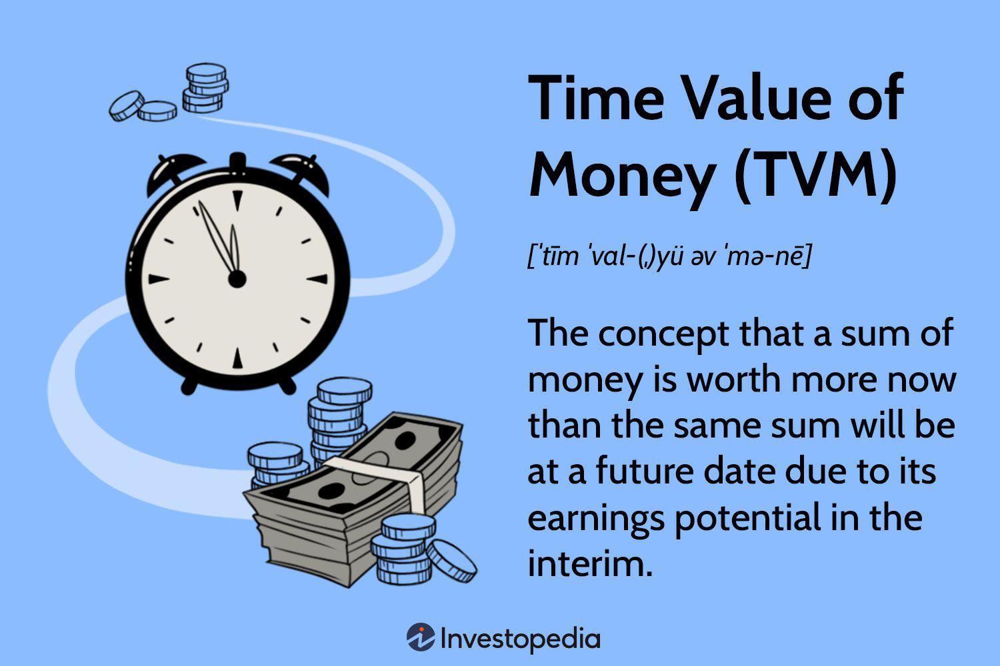

The world of finance is in a perpetual state of transformation, propelled by the continual development of new strategies and technologies that redefine investment practices. At the heart of successful investment strategies lies a robust understanding of fundamental financial principles, such as the time value of money (TVM). TVM is a core concept that underscores the idea that a dollar today is worth more than a dollar in the future due to its potential earning capacity. This principle serves as a cornerstone for evaluating investment opportunities by taking into account both current and future values, allowing investors to make more informed decisions.

In today's financial markets, the integration of traditional investment principles with modern algorithmic trading techniques presents a compelling synergy. Algorithmic trading uses advanced software to automate trading processes based on pre-determined criteria, offering the potential to enhance efficiency and minimize human error. This intersection of traditional and modern approaches not only optimizes investment strategies but also brings about new challenges and opportunities for investors.



A thorough comprehension of how these components interact is essential for navigating complex financial markets successfully. By blending timeless concepts like TVM with innovative trading technologies, investors can potentially achieve optimal returns while effectively managing risk. This article will explore key concepts within this framework, offering insights on how these elements can be leveraged in investment strategies today.

Understanding these dynamics is crucial for anyone looking to capitalize on the evolving landscape of finance. As we progress through this exploration, we'll highlight how these foundational ideas can be applied to real-world scenarios, providing a guide for investors aiming to enhance their strategic approach in an era marked by rapid technological advancement and market globalization.

## Table of Contents

## Understanding the Time Value of Money

The time value of money (TVM) is a core financial principle highlighting that a sum of money available today holds more value than the same sum in the future. This is due to the potential earning capacity of money over time through investment and interest accrual. The concept of TVM underscores the necessity for investment strategies to weigh both immediate and projected values when making financial decisions.

At the heart of TVM is the notion that money can earn interest, making it advantageous to receive funds sooner to fully exploit compounding potential. This principle is vital in estimating future investment returns, serving as the foundation for various financial models and decisions. The fundamental TVM equation can be expressed in several forms to calculate present value (PV), future value (FV), interest rate, or time period. The future value formula is:

$$
FV = PV \times (1 + r)^n
$$

where $FV$ is the future value, $PV$ is the present value, $r$ is the interest rate, and $n$ is the number of periods.

Incorporating TVM into portfolio management can significantly optimize investments by factoring in interest rates and the timing of cash flows. For example, understanding TVM allows investors to assess present and future cash flows, enabling a more strategic approach to asset management that maximizes returns over time. By considering these elements, investors can allocate resources more effectively, tailoring their strategies to align with both short-term [liquidity](/wiki/liquidity-risk-premium) needs and long-term financial goals.

Practical applications of TVM are abundant in both personal and institutional finance. A personal finance example is determining how much to save monthly to reach a retirement goal. Let's consider an individual who aims to accumulate $500,000 in 20 years with an annual [interest rate](/wiki/interest-rate-trading-strategies) of 5%. Using TVM, they can calculate the necessary annual savings amount to achieve this target. In institutional settings, a company may use TVM to evaluate the feasibility of new projects by calculating the net present value (NPV) of expected cash flows or to price financial instruments accurately.

Overall, the time value of money is an essential concept that facilitates better investment calculations and planning, promoting a strategic mindset for capitalizing on the temporal potential of financial assets.

## Investment Strategies that Leverage Financial Principles

Investment strategies in finance often rely on a robust understanding of core principles such as risk management, diversification, and asset allocation. These elements are crucial for successful investment outcomes and can be significantly enhanced by incorporating the time value of money (TVM) into strategic planning.

Diversification is a fundamental concept that reduces investment risk by spreading assets across various categories. The rationale is that a diversified portfolio will, on average, yield higher returns and pose a lower risk than any individual investment found within the portfolio. This approach minimizes the impact of performance [volatility](/wiki/volatility-trading-strategies) in any single asset, thus safeguarding against market fluctuations. For instance, holding a mix of stocks, bonds, and real estate can protect against the risk associated with a downturn in any one sector.

Proper asset allocation is another critical principle where the balances between risk and reward are meticulously handled. Asset allocation refers to the strategy of dividing investments among different asset categories, such as stocks, bonds, and cash, according to an individual's goals, risk tolerance, and investment horizon. For instance, younger investors might lean towards a higher percentage of stocks due to their potential for long-term growth, while those nearing retirement may prefer a higher allocation to bonds, which can offer stability and income.

The integration of the time value of money (TVM) with these financial principles can further enhance outcomes. TVM, based on the premise that a dollar today is worth more than a dollar in the future, is essential in estimating future investment returns. Incorporating TVM into investment strategies involves calculating present and future values to assess investment opportunities accurately. For example, using the formula for the present value $PV = \frac{FV}{(1 + r)^n}$ where $FV$ is the future value, $r$ is the interest rate, and $n$ is the number of periods, can help in determining whether a future cash flow justifies the current investment.

Compounding interest, which arises from the reinvestment of earnings, plays a pivotal role in building long-term wealth. The principle of compounding involves [earning](/wiki/earning-announcement) returns on both the original investment and the accumulated interest from previous periods. For example, in Python, a simple demonstration of compound interest could be calculated as follows:

```python
def calculate_compound_interest(principal, rate, time, compounding_frequency):
    amount = principal * (1 + rate / compounding_frequency) ** (compounding_frequency * time)
    return amount

principal = 1000  # Initial investment amount
annual_rate = 0.05  # Annual interest rate
time = 10  # Total number of years
compounding_frequency = 4  # Quarterly compounding

future_value = calculate_compound_interest(principal, annual_rate, time, compounding_frequency)
print(f"The future value of the investment would be: ${future_value:.2f}")
```

This example demonstrates how reinvested earnings significantly enhance the growth potential of investments over time.

Case studies of successful investors highlight the practical application of these strategies. Consider Warren Buffett, whose disciplined approach emphasizes value investing and long-term growth over short-term gains. His investment philosophy underscores the importance of understanding intrinsic value, which is rooted in the time value of money, and maintaining a diversified portfolio to mitigate risk.

In summary, the application of financial principles such as diversification, asset allocation, and the time value of money, combined with the power of compounding interest, provides a solid foundation for developing successful investment strategies. These concepts continue to be critical for both personal and institutional finance, offering a roadmap for achieving financial objectives in dynamic markets.

## Algorithmic Trading: Merging Traditional Approaches with Technology

Algorithmic trading employs automated software to execute trades based on predefined rules. This method often includes high-frequency trading ([HFT](/wiki/high-frequency-trading-strategies)) techniques, which allow traders to capitalize on minor price differences by executing thousands of trades per second. At its core, [algorithmic trading](/wiki/algorithmic-trading) seeks to merge traditional investment principles with cutting-edge technology to improve trading efficiency and reduce human error.

#### Efficiency and Error Reduction with Algorithmic Techniques

Integrating algorithmic trading with conventional investment strategies enhances efficiency in several ways. First, algorithms can process vast amounts of data significantly faster than humans, enabling quicker decision-making. For example, programs can analyze real-time market data, compare it against historical trends, and execute trades within milliseconds. Furthermore, by eliminating human intervention, these systems reduce the likelihood of errors that can occur due to emotional biases or miscalculations.

#### Designing Algorithms with Financial Principles

When designing algorithms to optimize investment strategies, fundamental financial concepts such as the Time Value of Money (TVM) are critical. TVM revolves around the idea that a sum of money today holds more potential than the same sum in the future due to its potential earning capacity. Algorithms can incorporate TVM by using it to evaluate the present value of expected future cash flows from investments. This involves calculations such as:

$$
PV = \frac{FV}{(1 + r)^n}
$$

where $PV$ is the present value, $FV$ is the future value, $r$ is the interest rate, and $n$ is the number of periods. By embedding such calculations, algorithms can ensure that trading decisions align with long-term financial goals.

#### Enhancing Performance Through Data Analysis and Machine Learning

Machine learning and advanced data analysis are pivotal in refining algorithmic trading. By leveraging historical and real-time data, [machine learning](/wiki/machine-learning) models can identify patterns and predict future market movements. These models undergo continuous training, improving their accuracy as more data becomes available. For instance, sentiment analysis, a method that evaluates social media or news feeds to gauge market sentiment, can be embedded into algorithms. This enables traders to anticipate shifts in market trends that are not immediately apparent through numerical analysis alone.

In Python, traders might use libraries such as `pandas` for data manipulation and `scikit-learn` for building predictive models. Here is a simple example of how sentiment analysis might be coded:

```python
from sklearn.feature_extraction.text import CountVectorizer
from sklearn.naive_bayes import MultinomialNB

# Sample data: tweets or headlines labeled as positive or negative
data = [
    ('Stock prices are up', 'positive'),
    ('The market is crashing', 'negative')
]

# Extract features
vectorizer = CountVectorizer()
features = vectorizer.fit_transform([text for text, label in data])

# Fit model
model = MultinomialNB()
model.fit(features, [label for text, label in data])

# Predict sentiment for a new sentence
new_data = ['Market outlook brightens']
new_features = vectorizer.transform(new_data)
predictions = model.predict(new_features)

print(predictions) # Outputs: ['positive']
```

#### Risks and Regulatory Considerations

Despite its benefits, algorithmic trading is not without risks. Systems are susceptible to technological failures or bugs that may result in unintended trades, potentially causing significant financial losses. Furthermore, algorithms that engage in HFT can exacerbate market volatility. Regulatory bodies have thus implemented controls to mitigate these risks, including circuit breakers that halt trading during drastic price fluctuations and mandates for algorithmic testing before deployment.

The landscape of algorithmic trading continues to evolve as new technologies emerge, demanding ongoing adjustments to regulatory frameworks to ensure market stability and integrity. As algorithmic trading becomes more prevalent, staying informed about both technological advancements and regulatory updates remains crucial for traders.

## The Future of Investment Strategies and Financial Insights

The financial landscape is undergoing a transformative shift due to the rapid advancement of technological innovations and the increased globalization of markets. These developments are significantly altering traditional investment principles, such as the time value of money (TVM), and are prompting the financial industry to adapt in unprecedented ways.

One of the most prominent emerging trends is the growing influence of financial technology (fintech). Fintech is revolutionizing how investments are made by offering individuals and institutions more efficient, transparent, and accessible financial services. Platforms like robo-advisors are utilizing algorithms to provide personalized investment advice at a lower cost than traditional financial advisors. This not only democratizes access to sophisticated financial strategies but also optimizes returns by leveraging data-driven insights.

As technology continues to evolve, it is expected that future innovations will further integrate traditional financial principles with state-of-the-art technologies. For instance, the incorporation of [artificial intelligence](/wiki/ai-artificial-intelligence) (AI) and machine learning in investment decision-making can enhance the application of TVM by more accurately predicting future cash flows and assessing risk-adjusted returns. Blockchain technology, known for its transparency and security, is also set to redefine investment vehicles through the introduction of decentralized finance (DeFi) platforms that allow for peer-to-peer transactions without intermediaries.

Furthermore, new forms of investments and trading platforms are likely to emerge, driven by these technological advancements. Cryptocurrencies and digital assets, though still in their relative infancy, represent a new asset class that challenges traditional financial markets. The rise of tokenization of assets allows for fractional ownership, thereby increasing liquidity and expanding the investment universe to a broader audience.

Looking ahead to the next decade, several predictions can be made about how these shifts will shape the future of investment strategies. The integration of fintech innovations is expected to lead to a more personalized, efficient, and diversified investment environment. Investors may increasingly rely on automated systems to manage portfolios, utilizing machine learning algorithms to dynamically adjust asset allocations based on real-time data.

To capitalize on these shifts, investors should focus on continuous learning and adaptation to new technologies. Staying informed about emerging fintech trends, understanding the regulatory landscape, and being open to adopting innovative investment solutions will be key to thriving in this evolving market. By embracing both traditional financial principles and cutting-edge technologies, investors can position themselves to better navigate and benefit from the future financial landscape.

In summary, the convergence of technology and finance is set to create a more dynamic and accessible investment environment, where sophisticated financial tools are available to a wider audience. As these trends continue to unfold, the importance of understanding and adapting to these changes cannot be overstated for those looking to maximize investment success.

## Conclusion

Incorporating traditional financial principles with modern technological tools can greatly enhance investment strategies by providing a balanced approach to both risk management and return optimization. A profound understanding of concepts such as the time value of money (TVM) is essential for this balance. TVM, which underscores the principle that a dollar today holds more value than a dollar received in the future due to its potential earning capacity, remains a cornerstone of rational financial decision-making. By factoring in interest rates and present value calculations, investors can better assess the true worth of their investments and make informed decisions.

Algorithmic trading, a contemporary advancement in investment methodology, introduces exciting opportunities for executing trades with precision and speed. It leverages algorithms to automate trading processes based on pre-determined strategies, which can significantly reduce human error and increase market efficiency. However, the successful implementation of such technology requires careful oversight to mitigate risks associated with latency, technical failures, and market volatility.

For investors, staying informed about these evolving strategies is crucial. The financial markets are continually adapting with technological progress, and those who actively engage in learning and applying these integrated approaches are better equipped to navigate complexities and seize opportunities. Algorithmic trading, while promising, demands diligent attention to detail and a strategic mindset.

The journey to mastering these financial and technological concepts is ongoing. As markets evolve and new tools emerge, continuous learning is key. The rewards, however, can be substantial. Mastery of these strategies not only increases potential returns but also equips investors with the acumen to respond adeptly to market shifts. Thus, committed engagement with both traditional principles and modern tools is indispensable for achieving long-term financial success.

## References & Further Reading

[1]: ["Principles of Corporate Finance"](https://www.amazon.com/Principles-Corporate-Finance-Richard-Brealey/dp/1260013901) by Richard A. Brealey, Stewart C. Myers, and Franklin Allen

[2]: ["Investment Science"](https://www.amazon.com/Investment-Science-David-G-Luenberger/dp/0199740089) by David G. Luenberger

[3]: ["The Intelligent Investor: The Definitive Book on Value Investing"](https://www.amazon.com/Intelligent-Investor-Definitive-Investing-Essentials/dp/0060555661) by Benjamin Graham

[4]: ["Financial Modeling"](https://www.investopedia.com/terms/f/financialmodeling.asp) by Simon Benninga

[5]: Hull, J. C. (2018). ["Options, Futures, and Other Derivatives."](https://www.semanticscholar.org/paper/Options%2C-Futures%2C-and-Other-Derivatives-Hull/89bdee500c8623864fc9eb7a471546aa713acc44) Pearson.

[6]: ["Algorithmic Trading and DMA"](https://www.amazon.com/Algorithmic-Trading-DMA-introduction-strategies/dp/0956399207) by Barry Johnson