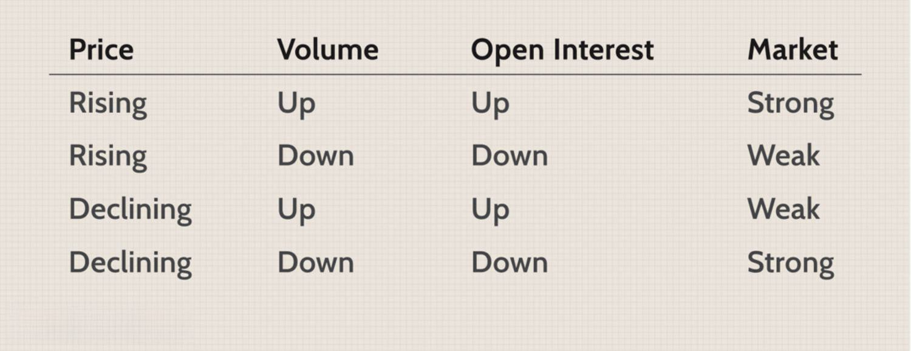

Options trading is a pivotal component of contemporary financial markets, providing traders with distinct opportunities as well as challenges. With its intricacies, options trading serves as both a mechanism for hedging risks and a platform for speculative ventures. Central to succeeding in options trading are key metrics such as trading volume, open interest, and sophisticated algorithmic trading (algo trading) strategies. These metrics are essential tools for traders to comprehend and navigate the complex dynamics of market behavior.

Trading volume, representing the total number of options contracts exchanged in a given timeframe, acts as a vital indicator of market activity, liquidity, and interest from traders. It can signal potential market movements and is crucial in assessing the sentiment mulling over a particular security or the market as a whole.



Open interest, on the other hand, reflects the total number of outstanding options contracts that have not yet been settled. This metric is invaluable in understanding the flow of capital and the steadfastness of market participants towards their positions. Open interest can also provide insights into future market trends, with an increase often suggesting sustained interest and potential movements in the underlying asset's price.

The fusion of these metrics with algorithmic trading strategies, particularly in the form of pre-defined rules automated through computer systems, further serves to refine and accelerate trading decisions. By leveraging trading algorithms, traders can enhance their responsiveness to market changes, efficiently process extensive data sets, and systematically align their strategies with prevailing market conditions.

In this article, we explore trading volume, open interest, and algorithmic strategies in detail, empowering traders with the knowledge they need to effectively capitalize on market opportunities and optimize their returns. Understanding these concepts not only aids in deciphering complex market patterns but also provides a foundation for developing robust trading strategies that adapt to ever-evolving market landscapes.

## Table of Contents

## Understanding Options Trading Volume

Options trading volume is a crucial metric that reflects the total number of options contracts exchanged over a specific timeframe, usually within a single trading day. It serves as a fundamental measure of market activity and provides traders with valuable insights regarding liquidity and market interest. High trading volume is generally indicative of strong liquidity, which simplifies the process for traders to enter and exit positions efficiently. This ease in executing trades comes from the greater number of buyers and sellers, reducing the bid-ask spread and limiting slippage.

Moreover, trading [volume](/wiki/volume-trading-strategy) acts as an essential tool for discerning market sentiment and anticipating potential [volatility](/wiki/volatility-trading-strategies). Typically, higher trading volume can signal increased market participation, which might suggest a more robust directional movement. For instance, a surge in trading volume alongside rising prices can confirm bullish sentiment, while the opposite can be true for bearish trends.

Traders often use trading volume as a confirmation signal for price movements, verifying the strength of trends and spotting reversals. An increase in volume accompanying a price move suggests genuine market interest and commitment, serving as a validation of the movement's strength. Conversely, if a significant price change occurs on low volume, it could indicate a lack of conviction, suggesting that the movement might not sustain.

In practical application, traders analyze volume through various methods and tools. One such tool is the volume-weighted average price (VWAP), which provides context by comparing current prices against an average price weighted by volume. This allows traders to determine whether the asset is trading at a premium or discount relative to its average price during the day.

For those utilizing [algorithmic trading](/wiki/algorithmic-trading) strategies, real-time volume data integration is essential, enabling algorithms to make informed, rapid decisions based on the current market state. This capability enhances a trader's ability to respond to live market conditions, potentially improving the precision and outcomes of trading strategies.

## The Importance of Open Interest in Options Trading

Open interest is a crucial metric in options trading that represents the total number of active contracts that have yet to be closed or exercised. Open interest serves as an indicator of market activity and trader commitment towards a particular option or series of options. By assessing open interest, traders can obtain insights into market sentiment and potential price trends, making it an integral aspect of decision-making for options traders.

Increasing open interest suggests that new contracts are being created and that there is continued interest in maintaining a position rather than closing it. Such a scenario is often interpreted as a sign that a trend may persist. This interpretation arises because increasing open interest alongside price movements suggests the possibility of further sustaining the current market direction. For instance, a rising open interest during a price rally in a call option could imply bullish sentiment, indicating that traders believe the underlying asset's price will continue to rise.

High open interest also implies strong [liquidity](/wiki/liquidity-risk-premium), which is beneficial for traders. Liquidity ensures that traders can enter and [exit](/wiki/exit-strategy) positions with minimal impact on the market price. A liquid market with high open interest is characterized by narrower bid-ask spreads, reducing transaction costs for traders. Therefore, high open interest not only signals strong market participation but also enhances the efficiency with which traders can execute their strategies.

Furthermore, open interest provides insights into the balance between long and short positions in the market. Analyzing changes in open interest alongside price movements can help traders infer whether the market is dominated by buyers or sellers. For example, if open interest increases while prices rise, it suggests that buyers are driving the market. Conversely, if open interest increases as prices fall, it is likely that sellers are more active.

In summary, open interest is a vital metric for understanding market sentiment and liquidity in options trading. It offers valuable insights into trader commitments and potential price trends. By considering open interest, traders can make informed decisions, manage risks better, and enhance trading strategies for improved outcomes.

## How Trading Volume and Open Interest Can Be Used Together

Combining trading volume and open interest provides traders with a nuanced understanding of market dynamics, enabling more informed decision-making. Trading volume, defined as the total number of options contracts exchanged in a given period, serves as a liquidity indicator and a proxy for market interest. High trading volume suggests a liquid market, allowing traders to execute large orders with minimal impact on the price.

Open interest, on the other hand, quantifies the number of outstanding contracts that remain unexercised or open at the end of each trading day. It reflects the level of remaining market activity and provides insights into potential future price movements. An increase in open interest often signals that more traders are taking positions, potentially indicating an emerging trend.

Analyzing the interaction between these two metrics allows traders to gauge market strength and predict future movements. For example, high trading volume paired with rising open interest typically confirms a strong ongoing trend. This scenario indicates that new participants are entering the market, potentially reinforcing the current direction. Conversely, if high volume is accompanied by decreasing open interest, it may suggest that existing positions are being closed, potentially signaling the exhaustion of the trend.

Divergence between high trading volume and diminishing open interest may serve as a warning of potential trend reversals. When numerous traders are exiting rather than entering positions despite high trading activity, it might indicate a turning point. This divergence helps traders anticipate potential reversals, suggesting that caution is warranted before committing to new positions.

To apply these insights effectively, traders can adopt algorithmic strategies that incorporate both trading volume and open interest. Algorithms can be designed to trigger trades when specified conditions are met, such as a rising volume and open interest concurrently, to confirm trend continuation. Conversely, a divergence between these metrics could trigger reversal strategies.

By leveraging the complementary nature of trading volume and open interest, traders enhance their strategy's robustness. This comprehensive approach allows them to validate market conditions, thereby improving the precision of their entry and exit points. These metrics serve as a foundation for developing sophisticated trading systems capable of navigating complex market environments.

## Algorithmic Trading Strategies Using Open Interest

Algorithmic trading strategies leverage open interest to make informed trading decisions by executing trades based on predefined rules that are aligned with prevailing market trends and conditions. The inclusion of open interest as a critical variable empowers these algorithms to assess market [momentum](/wiki/momentum) and potential reversals more accurately.

Trend-following algorithms typically utilize rising open interest as a confirmation of ongoing trends. When open interest increases, it suggests the entry of new participants into the market, which often confirms the strength and sustainability of a trend. For instance, consider a situation where both trading volume and open interest are rising alongside the price of an option. A trend-following algorithm might interpret this as a signal to enter a position in the direction of the price movement, as the increasing open interest supports the likelihood of a continued trend.

In contrast, reversal algorithms might look for divergences between open interest and price movements to predict potential trend reversals. Divergences occur when price movement is not accompanied by a corresponding change in open interest. For instance, if the price of an option is rising but open interest is decreasing or stagnant, a reversal algorithm may interpret this as a weakening trend, prompting a trade against the prevailing price direction. This divergence can indicate that the market is losing momentum and a reversal could be imminent.

Algorithmic trading enhances the speed and efficiency of reacting to market changes due to its ability to process vast amounts of data in real-time. By systematically analyzing open interest alongside other market indicators, algo trading can automatically adjust positions based on evolving market dynamics. This systematic approach not only improves response times but also reduces the emotional biases that often affect human traders, leading to more disciplined and consistent trading decisions.

Incorporating open interest into algorithmic models requires robust data management and integration capabilities. Traders must ensure they have access to real-time data feeds and possess the necessary computational power to analyze this information rapidly. This can involve implementing technology solutions such as cloud computing or high-frequency trading platforms to execute trades with minimal latency. Additionally, employing [machine learning](/wiki/machine-learning) techniques can further refine these strategies by identifying patterns and optimizing decision-making processes based on historical data performance.

By integrating open interest effectively, traders can thus leverage algorithmic trading not only to capture ongoing trends but also to preempt market reversals, ultimately enhancing trading performance and capitalizing on market opportunities more adeptly.

## Examples of Applying Volume and Open Interest in Options Trading

Combining trading volume and open interest offers valuable insights into market dynamics, enabling traders to refine and enhance their strategies in options trading. A practical understanding of how these metrics interact can inform better trading decisions, as exemplified by various real-world scenarios.

For instance, consider a situation where there is a significant spike in trading volume alongside an increase in open interest for a particular options contract. Such a scenario typically suggests strong bullish sentiment. The alignment of these metrics indicates not only increased trading activity but also a growing commitment among market participants toward a particular trend. In such cases, traders might interpret this as a confirmation of a bullish trend, thus justifying entering or increasing positions in expectation of rising prices.

Conversely, if there is a substantial increase in trading volume without a corresponding rise in open interest, the situation might imply speculative activity rather than a sustained trend. This divergence can indicate that many traders are closing their positions or that newly opened positions are being quickly closed, potentially signifying an impending price reversal.

Hypothetical examples also serve to illustrate these principles. Consider an options trader analyzing the market for XYZ Corporation. The trader observes that the daily trading volume for XYZ's call options has increased significantly over the past week, and open interest has concurrently risen. Such a pattern suggests that traders are not only actively trading but also holding onto their positions, anticipating a future price increase for XYZ shares. In anticipation of a price rally, the trader decides to buy call options, aligning with the bullish sentiment suggested by the metrics.

Additionally, let's explore a case where trading volume for the put options of ABC Corp. has increased, but open interest remains static. This scenario might reflect short-term speculative trading rather than a long-term bearish sentiment. A trader aware of this nuance might be cautious about interpreting this as a sustained downward trend, opting to wait for further market signals before taking a position.

In practice, traders often layer these analyses with other technical indicators and fundamental insights to develop robust trading strategies. By recognizing the interplay between trading volume and open interest, traders can better infer market sentiment, confirm trends, and anticipate potential reversals, ultimately enhancing their decision-making process in options trading.

## Challenges and Misconceptions in Using Volume and Open Interest

Utilizing trading volume and open interest in options trading is valuable but often misunderstood. One prevalent misconception is viewing high open interest as inherently bullish, which can lead to misguided strategies. Instead, open interest reflects the number of active contracts and may signify either bullish or bearish sentiments, depending on the context. 

For instance, a sudden rise in open interest paired with sideways trading volume could indicate that traders are setting up for a significant move, rather than an imminent bullish trend. The complexity lies in understanding that open interest alone does not provide directional cues. It's essential to consider these figures in conjunction with other indicators, such as price movements and trading volume, to gain a clearer picture of market conditions.

Traders must also distinguish between liquidity, indicated by trading volume, and market sentiment, which may not align directly with volume metrics. High liquidity suggests ease of transaction execution without significantly impacting the asset's price but does not inherently indicate the market's directional intent. Conversely, market sentiment involves the traders’ collective attitude towards an asset's future price, which might not always reflect current volumes.

This differentiation process can be technically challenging. A simple yet effective method to analyze these metrics is plotting them together over time to visualize patterns or trends. Here's an example of how this can be achieved using Python for plotting:

```python
import matplotlib.pyplot as plt

# Sample data for illustration
days = ['Mon', 'Tue', 'Wed', 'Thu', 'Fri']
trading_volume = [1500, 3000, 4500, 2500, 5000]
open_interest = [2000, 2300, 2800, 2500, 3500]

plt.plot(days, trading_volume, label='Trading Volume', marker='o')
plt.plot(days, open_interest, label='Open Interest', marker='x')
plt.xlabel('Days')
plt.ylabel('Contracts')
plt.title('Trading Volume vs Open Interest')
plt.legend()
plt.show()
```

Such visualizations help traders discern discrepancies or alignments, aiding in more informed decision-making. Accurate interpretation requires a nuanced approach, considering the metrics within the larger context of market behavior. Misreading these indicators can lead to inaccurate foresight, underscoring the necessity of comprehensive resource and skill development among traders. Understanding these distinctions ensures more reliable trading strategies and mitigates the risks of erroneous decisions.

## Implementing Volume and Open Interest Strategies in Algo Trading

To implement volume and open interest strategies in algorithmic trading, traders must build an infrastructure that integrates real-time data feeds and robust analytic models. This involves several critical steps that each contribute to developing a comprehensive trading system capable of making informed decisions based on current market conditions.

**Data Acquisition**: Effective algorithmic trading begins with the acquisition of reliable, real-time data. This includes market data such as price, volume, and open interest. Traders can obtain this data from financial market data providers, often through APIs that deliver streaming updates. For instance, Python libraries like `pandas` and `numpy` can be employed to manage and manipulate this data efficiently. An example code snippet for retrieving data might include using a library like `yfinance` to collect historical options data:

```python
import yfinance as yf

# Download option chain data
ticker = 'AAPL'
data = yf.Ticker(ticker)
options = data.option_chain('2023-11-17')
print(options.calls)
```

**Developing Algorithms**: Once data is secured, the next step is developing algorithms that can analyze these metrics to determine actionable signals. For instance, an algorithm might track changes in trading volume and open interest to identify trends. This could involve statistical models or machine learning techniques trained to predict market movements based on historical patterns.

**Backtesting Strategies**: After developing an algorithm, it's crucial to test its performance before live deployment. Backtesting involves using historical data to simulate how a trading strategy would have performed in the past. Python's `backtrader` framework, for example, allows traders to backtest their strategies against historical data to refine and validate their approach. 

```python
import backtrader as bt

# Define a simple strategy
class VolumeInterestStrategy(bt.SignalStrategy):
    def __init__(self):
        self.signal_add(bt.SIGNAL_LONG, self.data.volume > self.data.open_interest)

cerebro = bt.Cerebro()
cerebro.addstrategy(VolumeInterestStrategy)
cerebro.run()
```

**Live Deployment**: Once testing confirms that a strategy is viable, it can be deployed in a live trading environment. This step involves connecting the algorithm to a brokerage platform through which trades can be executed automatically. Continuous monitoring is essential, allowing for real-time adjustments to strategies as market conditions change.

A strong foundation in these stages can significantly enhance trading efficiency and returns, providing traders with the tools to effectively navigate complex market scenarios. When implemented with rigor and precision, volume and open interest-based algorithmic strategies can offer a systematic approach to trading, leveraging quantitative insights that would be challenging to replicate manually. Through constant optimization and technological adaptation, traders can maintain a competitive edge in the fast-paced world of options trading.

## Conclusion

Options trading volume, open interest, and algorithmic strategies serve as essential components for gaining valuable insights into market dynamics. Understanding these metrics allows traders to decipher underlying market trends and sentiments, guiding them to make informed decisions that can enhance trading outcomes. Trading volume, indicating the total number of options contracts exchanged, acts as a barometer for liquidity and market interest, thereby providing signals on potential volatility and price movements. Open interest, reflecting the total number of active contracts, offers a deeper perspective on market sentiment and prospective trends, with increased figures suggesting sustained interest and liquidity in a given position.

Algorithmic trading further enhances these insights by leveraging predefined rules and models that incorporate trading volume and open interest into trading strategies. Algorithms designed to recognize patterns in these metrics can execute trades at high speeds and large scales, maximizing efficiency and systematically processing vast amounts of market data.

For traders, the effective utilization of trading volume and open interest is critical for improving decision-making and achieving favorable trading results. Combining these metrics enables the verification of market trends or reversals, providing a strategic advantage. However, traders must remain aware of potential misconceptions, such as assuming high open interest always signals bullish sentiment, and must differentiate between liquidity and genuine market sentiment to avoid erroneous conclusions.

Continuous learning and adapting are crucial for traders aiming to capitalize on market opportunities while managing risks effectively. With markets constantly evolving, staying informed about new methodologies and trends in options trading is indispensable. Those who integrate these practices into their trading strategies stand to enhance their ability to navigate the complexities of financial markets successfully, optimizing both short-term results and long-term growth.

## References & Further Reading

[1]: Hull, J. (2018). ["Options, Futures, and Other Derivatives"](https://www.semanticscholar.org/paper/Options%2C-Futures%2C-and-Other-Derivatives-Hull/89bdee500c8623864fc9eb7a471546aa713acc44), 10th Edition. Pearson.

[2]: Engle, R. F., & Russell, J. R. (1998). ["Autoregressive Conditional Duration: A New Model for Irregularly Spaced Transaction Data."](https://www.jstor.org/stable/2999632) Econometrica, 66(5), 1127-1162.

[3]: Chance, D. M., & Brooks, R. (2015). ["An Introduction to Derivatives and Risk Management"](https://archive.org/details/introductiontode0000chan_m1l1), 10th Edition. Cengage Learning.

[4]: Black, F., & Scholes, M. (1973). ["The Pricing of Options and Corporate Liabilities."](https://www.cs.princeton.edu/courses/archive/fall09/cos323/papers/black_scholes73.pdf) Journal of Political Economy, 81(3), 637-654.

[5]: ["Quantitative Technical Analysis: An integrated approach to trading system development and trading management"](https://dl.acm.org/doi/book/10.5555/2789309) by Howard B. Bandy.